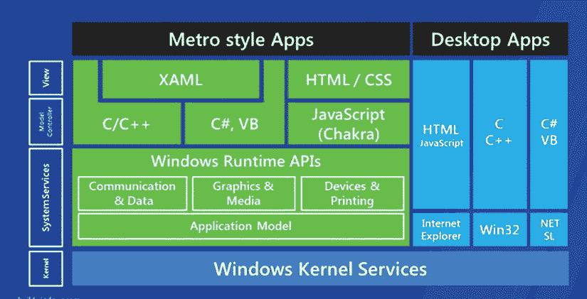
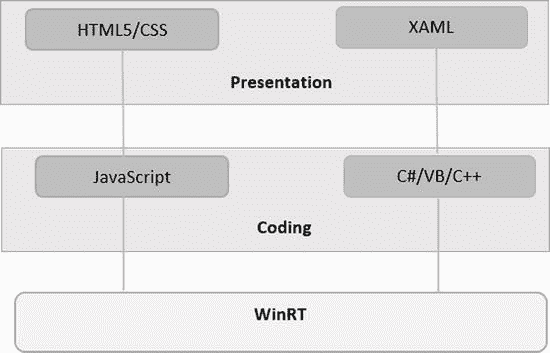
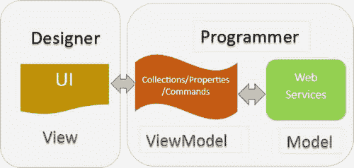
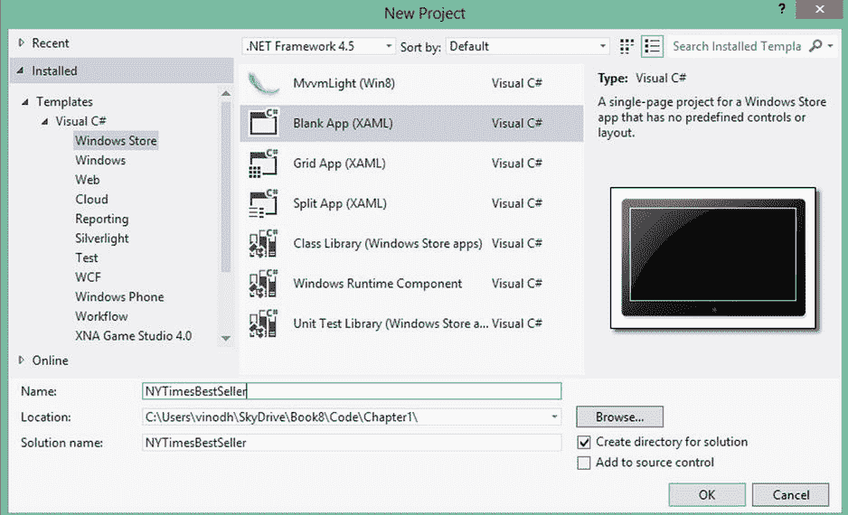
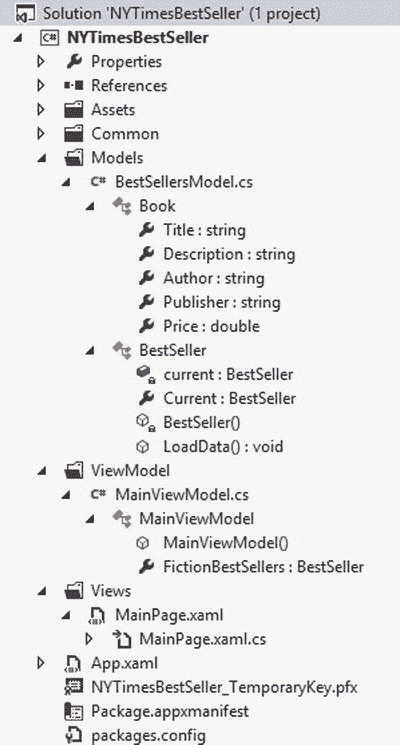
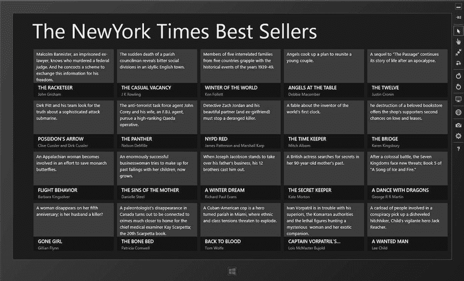

# 一、Windows 8 开发简介

Abstract

在 Windows 8 中，微软对底层平台和用户界面进行了重大改变。这些新功能包括新的开始屏幕体验，从单一存储库购买应用的 Windows 商店，以及名为 Windows Runtime (WinRT)的新平台。

在 Windows 8 中，微软对底层平台和用户界面进行了重大改变。这些新功能包括新的开始屏幕体验，从单一存储库购买应用的 Windows 商店，以及名为 Windows Runtime (WinRT)的新平台。

WinRT 提供了一套新的 API 和工具来创建一种快速流畅的触摸优先应用。这些应用通常被称为 Windows 应用商店应用。

出于本书的目的，关于 WinRT 和 Windows 应用商店应用需要了解的一些重要信息包括

*   Windows 8 应用可以在 Windows X86、x64 和 ARM 处理器上运行。
*   Windows 8 应用可以在全屏模式下运行，也可以停靠在屏幕的一侧。
*   WinRT 支持编程语言，如 ac C、C++、WinRT 和 C#，以及 HTML5 和 JavaScript。
*   WinRT APIs 被设计成异步的。运行时间超过 50 毫秒的 API 是异步的。
*   WPF/Silverlight XAML 用户界面模型向开发人员公开。
*   为了确保稳定性和安全性，Windows 应用商店应用在沙盒环境中运行。
*   最后，需要知道的最重要的一点是，在 Windows RT 中没有使用数据提供程序连接到数据库服务器的直接方法。

由于这本书更多的是关于 Windows 8 中的数据访问，本章提供了 Windows 8 应用框架的概述，并简要介绍了开发选择、UI 数据控件、MVVM 模式和其他将在本书各种示例中使用的必要概念。在本章的后半部分，我们将编写第一个数据驱动的 Windows 8 应用，显示纽约时报畅销书排行榜。

## Windows 应用框架

在图 [1-1](#Fig1) 中，我们看到了 Windows 8 现代风格应用框架与桌面应用框架的对比，两者共享相同的 Windows 核心操作系统服务。如果我们看一下桌面应用部分，JavaScript 和 HTML 用于针对 Internet Explorer，C 和 C++用于 Win32 应用，C# 和 Visual Basic 用于 .NET 和 Silverlight。每一个都有一套独立的 API。但对于 Windows 8 应用，无论我们使用 XAML、C#、C/C++、Visual Basic、HTML/CSS 还是 JavaScript，我们都有一套针对 WinRT 的 API。

图 1-1。

Windows App framework

## 发展选择

对于开发 Windows 8 应用，我们可以选择图 [1-2](#Fig2) 所示的两种开发途径中的任何一种。

图 1-2。

Development choices

在 HTML 路径中，我们将能够使用传统的 Web 技术，如 HTML5、CSS 和 JavaScript。对于表示，您使用 HTML 标记(如 div、table、spans 和 input)和 CSS 进行样式化。对于编码，可以使用 JavaScript。除了 HTML 控件，Windows Library for JavaScript 还提供了一组专为 Windows 应用商店应用设计的新控件。这个 WinJS 库是我们的 WinRT 路径。

如果您是 WPF、Silverlight 或 Windows Phone 开发人员，那么使用 XAML 设计 UI 和表示层是一个理想的选择。这里我们将使用 C#、Visual Basic 或 C++进行编码。

## 创建纽约时报畅销书应用

纽约时报畅销书应用是一个简单的 Windows 8 应用，它使用 MVVM 模式来显示纽约时报畅销书排行榜。构建此应用是学习使用 Visual Studio 2012、MVVM 框架、数据绑定、数据控件和其他必要概念来创建数据驱动的 Windows 8 Modern UI 应用的起点。

### 介绍 MVVM 应用框架

模型-视图-视图模型(MVVM)是基于 WPF/Silverlight/Windows Phone XAML 开发中使用最广泛的框架。考虑到 MVVM 是 Windows 8 的核心概念，它支持基于 XAML 的开发，并且在思想上类似于使用 MVVM 作为应用框架的技术，所以它是一个理想的选择。本章向你介绍 MVVM 框架。在后面的章节中，你会学到一些最常用的 MVVM 框架，比如 MVVM 光和棱镜。

### 什么是 MVVM？

MVVM 模式将用户界面代码分为三个概念部分:模型、视图和视图模型(见图 [1-3](#Fig3) )。视图模型的概念是新的，它控制视图与应用其余部分的交互。

图 1-3。

The basic relationships of the MVVM framework

*   模型表示实际的数据或信息，只保存数据，而不保存操作数据的行为或服务。
*   View 通过持有对 ViewModel 的引用来可视化地表示 ViewModel 中的数据。
*   ViewModel 通过向视图公开命令、可通知的属性和可观察的集合，充当视图和模型之间的粘合剂。

### 使用 MVVM 的优势

以下是使用 MVVM 相对于其他模式的一些优势:

*   MVVM 模式是专门为 XAML 应用中可用的数据绑定功能设计的，允许视图成为从业务逻辑流程中抽象出来的简单表示，这不应该发生在用户界面层。
*   MVVM 模式的另一个主要好处是代码库的单元可测试性。视图和视图模型之间缺乏联系有助于针对视图模型编写单元测试。
*   MVVM 允许开发人员和 UI 设计人员在开发他们各自的应用部分时更容易地协作。
*   MVVM 模式被广泛使用，有几个成熟的 MVVM 框架，如 Caliburn Micro 和 MVVMLight，它们提供了所有的基本模板代码，当然，它们还可以添加高级绑定、行为、动作和组合功能。

## 设置开发环境

从 [`http://dev.windows.com`](http://dev.windows.com/) 下载开发者工具。开发者工具包括 Windows 8 软件开发工具包，它是 Visual Studio 和项目模板的混合体。Microsoft Visual Studio for Windows 8 是我们构建 Windows 8 应用的集成开发环境(IDE ),该版本只能在 Windows 8 上运行。

也可以选择使用 Microsoft Visual Studio 2012。完整版具有高级调试工具支持、多单元测试框架和重构支持、代码分析、概要分析以及对连接到 Team Foundation Server 的支持。

Note

不能使用 Windows 7、Windows Vista 或 Windows XP 开发 Windows 8 应用。

Visual Studio 项目模板为构建 HTML 和 XAML 应用提供了一个很好的起点。我们创建了一个新的 Visual C# Windows 应用商店空白应用(XAML)项目，并将其命名为 NYTimesBestSeller(见图 [1-4](#Fig4) )。

图 1-4。

Visual Studio templates for XAML

《纽约时报》畅销书应用在网格视图中显示《纽约时报》小说畅销书的详细信息。在我们继续之前，让我们看看图 [1-5](#Fig5) 中的项目结构。

图 1-5。

NYTimesBestSeller project structure

在默认的项目结构中，我们已经通过 Models、Views 和 ViewModel 创建了三个新文件夹。这些文件夹用于模型、视图和视图模型。此外，我们将`MainPage.xaml`移动到视图文件夹。

### 创建模型

现在，我们创建应用的数据模型。这个类是在 C# 文件`BookSellersModel.cs`的模型文件夹中创建的。

`BookSellersModel.cs`文件实现了两个类:

*   `Book`
*   `BestSellersModel`

清单 1-1 中显示的`Book`类表示畅销书排行榜上的一本书的详细信息。详细信息包括书名、描述、作者和价格。

清单 1-1。向项目中添加 Book 类

`public class Book`

`{`

`public string Title { get; set; }`

`public string Description { get; set; }`

`public string Author { get; set; }`

`public string Publisher { get; set; }`

`public double Price { get; set; }`

`}`

清单 1-2 中显示的`BestSellersModel`类是`Book`对象的一个`ObservableCollection`。这个类将纽约时报畅销书加载到 observable 类中。

清单 1-2。存储畅销书信息的畅销书类

`public class BestSeller : ObservableCollection<Book>`

`{`

`private static BestSeller current = null;`

`public static BestSeller Current`

`{`

`get`

`{`

`if (current == null)`

`current = new BestSeller();`

`return current;`

`}`

`}`

`private BestSeller()`

`{`

`LoadData();`

`}`

`public async void LoadData()`

`{`

`//Code here to get New York Times best seller`

`}`

`}`

纽约时报畅销书 API 由`LoadData`方法调用以获取书籍的详细信息(见清单 1-3)。这个 API 返回一个 JSON 对象，该对象将使用驻留在`Windows.Data.Json`名称空间中的 WinRT APIs 进行解析。

清单 1-3。LoadData 方法使用纽约时报 API 获取数据

`public async void LoadData()`

`{`

`string url = "``http://api.nytimes.com/svc/books/v2/lists//hardcover-fiction.json?&offset=&sortby=&sortorder=&api-key=76038659ae9258d87cfb6dc8d6f02d35:11:66739421`T2】

`HttpResponseMessage response = await client.GetAsync(url);`

`string jsonData = await response.Content.ReadAsStringAsync();`

`JsonObject jsonObject = JsonObject.Parse(jsonData);`

`var resultObject = jsonObject.GetObject();`

`var result = resultObject["results"].GetArray();`

`foreach (var item in result)`

`{`

`JsonObject bookdetails = item.GetObject().GetNamedValue("book_details").GetArray()[0].GetObject();`

`Book book = new Book();`

`book.Title = bookdetails.GetNamedString("title");`

`book.Description = bookdetails.GetNamedString("description");`

`book.Author = bookdetails.GetNamedString("author");`

`book.Price = bookdetails.GetNamedNumber("price");`

`book.Publisher = bookdetails.GetNamedString("publisher");`

`Add(book);`

`}`

`}`

我们已经使用了`await`和随引入的`async`关键字 .NET 4.5 异步处理网络请求，以避免 GUI 锁定和冻结。这里，`async`关键字将一个方法标记为包含异步组件，而`await`关键字触发一个异步进程，并在它完成时恢复执行，而不会阻塞主线程。我们在本书中大量使用了`await`和`async`，因为整个 WinRT 框架都是在考虑性能的基础上构建的，并且在 WinRT 中，任何耗时超过 50 毫秒的潜在任务都是异步定义的。应用的响应能力是 Windows 8 应用认证的最低要求之一。

### 创建视图模型

ViewModel 被设计用来列出畅销书，我们使用`FictionBestSellers`属性来保存这个列表(见清单 1-4)。在这里，我们创建模型的实例。除此之外，ViewModel 还可以通过实现 ICommand 来公开各种命令。

清单 1-4。MainViewModel 为 view MainPage.xaml 提供 DataContext

`public class MainViewModel`

`{`

`public MainViewModel()`

`{`

`}`

`public BestSeller FictionBestSellers`

`{`

`get`

`{`

`return BestSeller.Current;`

`}`

`}`

`}`

Command 对象派生自 ICommand 接口，该接口有两个重要的方法:`CanExecute`方法控制绑定到该命令的相应控件是启用还是禁用，Execute 方法指定单击控件后要采取的操作。我们将在本书的后面看到 command 对象的用法。

### 创建视图

既然模型和视图模型已经准备好了，让我们把注意力放在视图上。让我们使用默认页面，即`MainPage.xaml`。在这里，我们将页面从根目录移动到 Views 文件夹，这样我们将有一个可管理的项目结构。页面模板带有一个`Grid`，其中添加了`TextBlock`来显示应用标题，添加了`GridView`来显示数据(参见清单 1-5)。

清单 1-5。xaml 中定义的 MainPage.xaml 视图

`<Grid Background="{StaticResource ApplicationPageBackgroundThemeBrush}">`

`<Grid.RowDefinitions>`

`<RowDefinition Height="9*"/>`

`<RowDefinition Height="55*"/>`

`</Grid.RowDefinitions>`

`<TextBlock`

`TextWrapping="Wrap"`

`Text="New York Times Best Sellers"`

`Margin="60,20,0,20"`

`FontSize="64"/>`

`<GridView Grid.Row="1"`

`Margin="60,0,0,0"`

`ItemsSource="{Binding FictionBestSellers}"`

`ItemTemplate="{StaticResource BookDataTemplate}"/>`

`</Grid>`

Visual Studio 在`app.xaml.cs`的`OnLaunched`事件中为我们生成代码，这样`MainPage.xaml`将被用作应用的起始页(见清单 1-6)。

清单 1-6。配置应用的启动页面

`protected override void OnLaunched(LaunchActivatedEventArgs args)`

`{`

`Frame rootFrame = Window.Current.Content as Frame;`

`if (rootFrame == null)`

`{`

`/* Create a Frame to act as the navigation context and navigate to the first page*/`

`rootFrame = new Frame();`

`if (args.PreviousExecutionState == ApplicationExecutionState.Terminated)`

`{`

`//TODO: Load state from previously suspended application`

`}`

`// Place the frame in the current Window`

`Window.Current.Content = rootFrame;`

`}`

`if (rootFrame.Content == null)`

`{`

`// When the navigation stack isn't restored navigate to the first page,`

`// configuring the new page by passing required information as a navigation`

`// parameter`

`if (!rootFrame.Navigate(typeof(MainPage), args.Arguments))`

`{`

`throw new Exception("Failed to create initial page");`

`}`

`}`

`// Ensure the current window is active`

`Window.Current.Activate();`

`}`

下一步是创建视图和视图模型之间的连接，这是通过在视图的构造函数中创建视图模型的实例并将其设置为页面的数据上下文来完成的(参见清单 1-7)。

清单 1-7。连接视图和视图模型

`public MainPage()`

`{`

`this.InitializeComponent();`

`MainViewModel vm = new MainViewModel();`

`this.DataContext = vm;`

`}`

### Windows 8 数据绑定

数据绑定是组合应用的有用工具，WinRT 非常依赖数据绑定的使用。WPF、Silverlight 或 Windows Phone 开发人员大多熟悉数据绑定，但是对于不熟悉这方面的人来说，我们在纽约时报畅销书应用中展示了一个数据绑定的示例。

数据绑定由目标和源组成。目标通常是控件的属性，源通常是数据对象的属性。在清单 1-5 中，我们将源`BestSeller`集合绑定到目标控件的`ItemsSource`属性。同样在清单 1-8 中，我们将`Book`类`Title`属性绑定到控件`Text`属性。

在我们继续之前，让我们看看应用第一次运行时的样子。

如果我们仔细看看清单 1-5，我们会看到 ViewModel `FictionBestSellers`属性被绑定到了`GridView`。`GridView`和`ListView`是 WinRT 中为触摸输入设计的两个强大的数据控件。这两个控件都来自于`ListViewBase`，除了用于垂直滚动的`ListView`和用于水平滚动的`GridView`之外，它们都没有添加任何属性、方法或事件。

通过查看该应用，人们会注意到书名、作者和描述的格式都很好，为此`GridView`需要知道如何显示列表中的每个对象，需要显示的对象的属性，以及它们应该如何显示。我们经常用一个`DataTemplate`来做这件事。这里我们创建一个名为`BookDataTemplate`的`DataTemplate`，它被分配给`GridView ItemTemplate`属性，如清单 1-5 所示。`ItemTemplate`获取或设置每个项目的模板，`DataTemplate`定制数据的外观。在这种情况下，我们创建了一个带有`Border`和`StackPanel`以及三个`TextBlock`实例的布局，我们将它们绑定到不同的`Book`对象属性，如`Title`、`Author,`和`Description`(参见清单 1-8)。结果如图 [1-6](#Fig6) 所示。

清单 1-8。BookDataTemplate 是在 MainPage.xaml 中定义的

`<DataTemplate x:Key="BookDataTemplate">`

`<Grid`

`HorizontalAlignment="Left"`

`Width="250"`

`Height="150">`

`<Border`

`Background="{StaticResource ListViewItemPlaceholderBackgroundThemeBrush}">`

`<TextBlock`

`Text="{Binding Description}"`

`Foreground="{StaticResource ListViewItemOverlayForegroundThemeBrush}"`

`Style="{StaticResource TitleTextStyle}"`

`FontWeight="Normal"`

`FontSize="13.333"`

`Margin="10,0"/>`

`</Border>`

`<StackPanel`

`VerticalAlignment="Bottom"`

`Background="{StaticResource ListViewItemOverlayBackgroundThemeBrush}">`

`<TextBlock`

`Text="{Binding Title}"`

`Foreground="{StaticResource ListViewItemOverlayForegroundThemeBrush}"`

`Style="{StaticResource TitleTextStyle}"`

`Height="20"`

`Margin="15,0,15,0"/>`

`<TextBlock`

`Text="{Binding Author}"`

`Foreground="{StaticResource ListViewItemOverlaySecondaryForegroundThemeBrush}"`

`Style="{StaticResource CaptionTextStyle}"`

`TextWrapping="NoWrap"`

`Margin="15,0,15,5"/>`

`</StackPanel>`

`</Grid>`

`</DataTemplate>`

图 1-6。

Windows 8 Application displaying the New York Times Best Sellers List

## 结论

本章通过构建我们的第一个 Windows 8 应用，介绍了 Windows 8 应用开发以及构建基于 XAML 的数据驱动的 Windows 8 应用所需的各种概念。如您所见，这只是对概念和框架的简单介绍。当您希望超越 Windows 8 开发的基础时，有许多更高级的场景可用，其中包括用户更新数据、双向绑定、值转换器和高级 MVVM 技术，如在页面之间传递数据、对话框 UI 等。在下一章中，我们将使用我们在本章中学到的 MVVM 模式和数据绑定，并使用 JavaScript 模式、MVVM 和 KnockoutJS 构建一个基于 HTML5 和 JavaScript 的 Windows 8 应用。