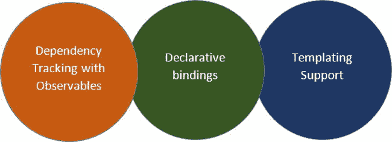
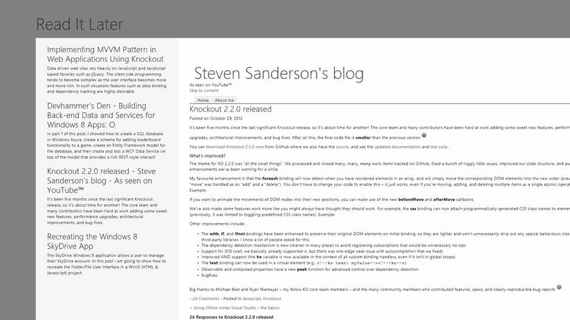
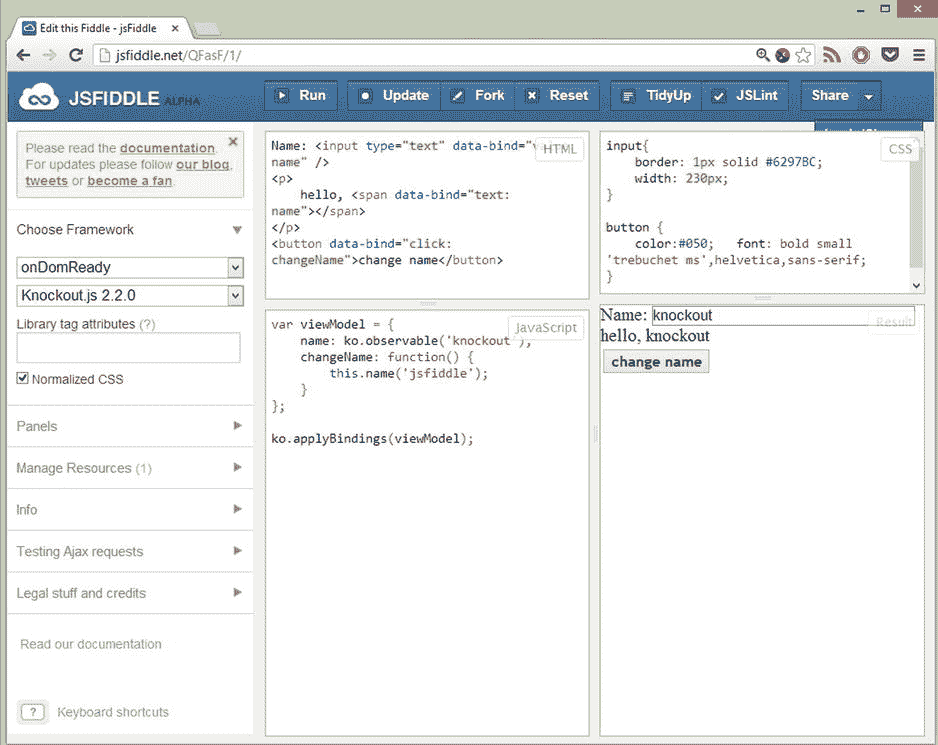
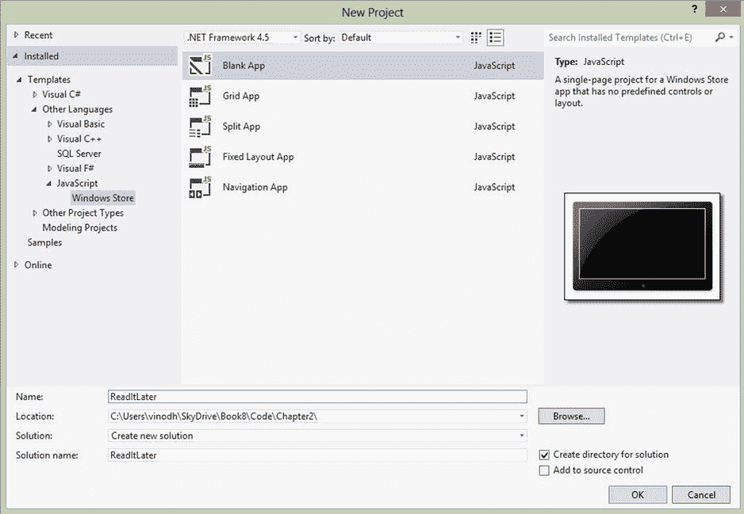
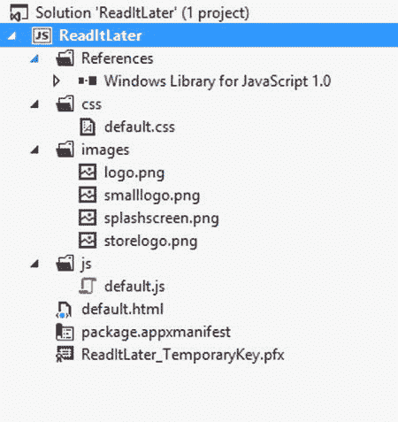
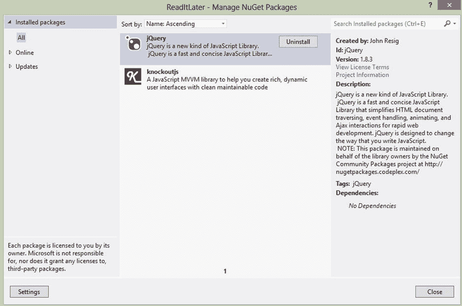
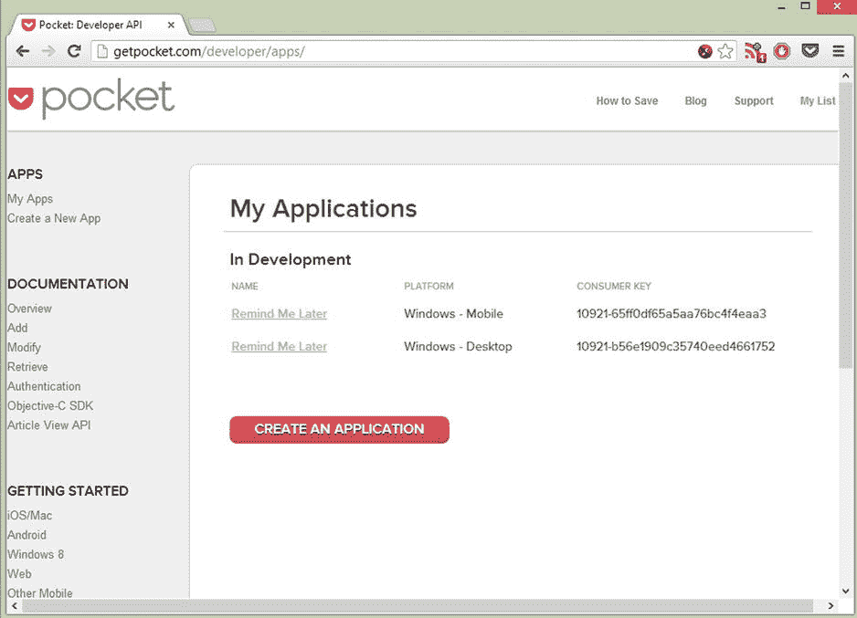
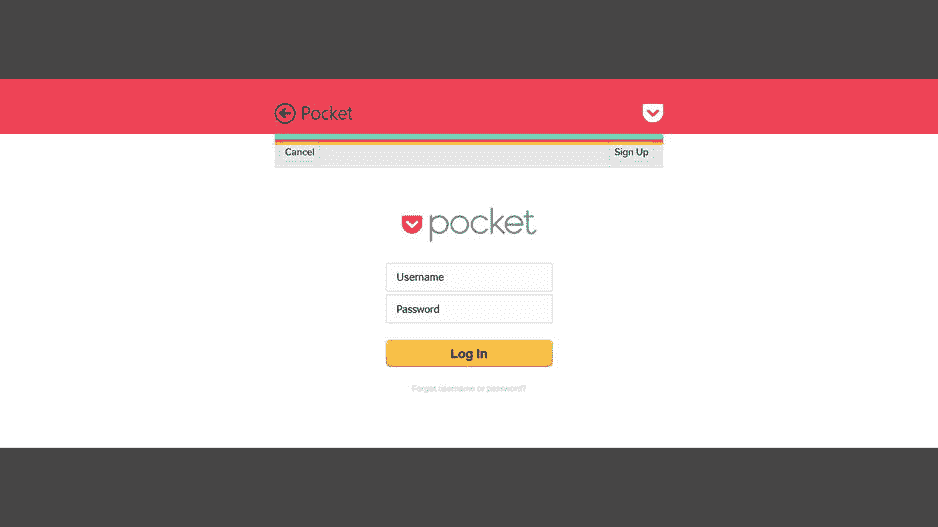

# 二、使用 MVVM 和 Knockout 的 HTML5 和 JavaScript 应用

Abstract

在第一章中，我们使用 MVVM 构建了一个基于 XAML 的应用，在本章中，我们使用 HTML5、CSS 和 Knockout JS 构建了一个基于 JavaScript 的数据驱动应用。

在[第 1 章](01.html)中，我们使用 MVVM 构建了一个基于 XAML 的应用，在本章中，我们使用 HTML5、CSS 和 Knockout JS 构建了一个基于 JavaScript 的数据驱动应用。

Knockout JS 是一个流行的开源 MVVM JavaScript 框架。这个框架帮助我们采用一些原则，如基本模型、继承和数据绑定，帮助我们编写可管理、可测试和可维护的代码。

本章首先帮助您开始使用 Knockout，浏览开始使用 Knockout 和在 Visual Studio 中使用 Knockout 所需的资源和工具。然后，我们提供了一个使用 MVVM 和 Knockout、数据绑定和 jQuery 开发 Pocket(稍后阅读)客户端 Windows 8 应用的演示。

## 什么是淘汰赛？

每个 web 应用开发人员都使用过或者至少听说过 jQuery，它旨在极大地简化 JavaScript 编程。jQuery 并不是所有问题的解决方案，因为在开发复杂的 web 应用时，让 UI 和数据动态地相互通信变得很棘手。此外，jQuery 没有底层数据模型的概念，因此对于数据操作，jQuery 总是使用 DOM 进行推断。因此，需要一个库来提供 UI 和底层数据模型之间更复杂的通信方式；这个解决方案非常棒。

## 了解淘汰

Knockout 是一个 JavaScript 库，有助于创建丰富的、类似桌面的 web UIs。它简化了用户交互，并且完全适应任何数据源的变化。使用观察，Knockout 帮助 UI 与底层数据模型保持同步。

*   Knockout 是一个免费的开源 JavaScript 库。
*   Knockout 实现了我们在第 1 章中讨论过的 JavaScript 的 MVVM 模式。
*   Knockout 是一个小型轻量级的库。
*   Knockout 与 Internet Explorer 6+、Firefox 2+以及最新版本的 Chrome、Safari 和 Opera 兼容。
*   Knockout 提供了一种补充性的、高层次的方法来将数据模型链接到 UI。
*   Knockout 本身并不依赖于 jQuery，但肯定可以同时使用 jQuery。

淘汰赛完全基于三个核心概念(见图 [2-1](#Fig1) ):

*   用可观测量进行依赖跟踪:如果你熟悉 XAML 技术，那么这个概念可能与`INotifyPropertyChanged`接口有关。例如，如果一个属性被加载或更改，它会自动通知 UI 在一个或多个地方绑定到它，而这些更改已经被执行了。UI 将反映这些更改，并且还会有一个选项，用于选择 UI 是否可以更改该值以再次自动更新源对象。
*   声明性绑定:这个概念有助于以简单方便的方式将部分 UI 连接到数据模型。这是源对象通过 HTML 本身绑定到目标元素的地方。不需要使用 JavaScript 代码通过 ID 来查找元素，或者通过其他方式通过带有 JSON 数据的 JavaScript 对象将元素嵌入到值中，然后将元素推入或拉出 UI，而是可以通过声明性绑定来完成。这是在 HTML 绑定中通过设置元素的 ID 从源对象获取特定的属性、特性或值来完成的。
*   模板:网页中的重复结构，如行或列表框，可以使用模板创建。这类似于 WPF/Silverlight 和 based Windows 8 应用中的项目模板或数据模板。jQuery 模板也可以用作带有挖空的模板，以及带有挖空的原生模板或其他模板引擎。

图 2-1。

Knockout core concepts

## 创建口袋(稍后阅读)应用

Pocket 是一个非常受欢迎的书签服务，它允许用户对文章进行分类，并创建他们感兴趣的项目的个人档案。在本章中，我们使用 HTML5、JavaScript、CSS 和 Knockout JS 为 Pocket bookmark services 创建了一个名为 Read It Later 的 Windows 8 应用。

稍后阅读是一个非常基础的 app，显示书签文章(见图 [2-2](#Fig2) )。在开发这款应用的过程中，我们将学习以下一些 Windows 8 概念和实践。

图 2-2。

Read It Later Windows 8 App displays articles from Pocket bookmark services

*   学会允许应用使用 OpenID 或 OAuth 等互联网认证和授权协议来连接到脸书、Twitter、Google 和 Microsoft Account 等在线身份提供商。
*   学习使用 WinJS.xhr JavaScript 函数进行跨域请求和内网请求。一些常见的场景是上传和下载文件，并连接到 web 服务以获取和发布到 REST API。
*   通过将数据从 JavaScript 对象绑定到 HTML 元素来学习 JavaScript 数据绑定。

### 工具和实用程序

使用工具和扩展不仅使开发人员的生活更加轻松；它还提高了生产率，减少了新项目的启动时间。让我们来看看我们可以在稍后阅读应用中使用的一些工具和扩展。

#### JsFiddle 的

JsFiddle 是一个免费的在线 shell 编辑器，它通过创建基于 JavaScript 框架的约定环境，为从 HTML、CSS 和 JavaScript 构建的代码片段简化了 JavaScript 代码的编写，托管在 [`http://jsFiddle.net`](http://jsfiddle.net/) 。这个免费的代码共享工具的界面分为四个部分，如图 [2-3](#Fig3) 所示。

图 2-3。

JsFiddle Online Editor tests the knockout dependency tracking and declarative binding Note

访问 [`http://jsfiddle.net/QFasF/1/`](http://jsfiddle.net/QFasF/1/) 用活体样品做实验。

有时，当需要快速构建 POC 或想法时，JsFiddle 就派上了用场，因为您可以快速设置并运行代码，而无需一个成熟的 IDE。JsFiddle 提供了一个现成的共享工作的选项，以及内置的版本控制、调试和代码分叉。

JsFiddle 能够使用生成的唯一 URL 共享和保存代码，用户可以选择默认的 JavaScript 框架，如 JQuery、Mootools、Prototype、Vanilla 等，还可以添加新的资源，如 Knockout 插件或 JQuery UI。

#### Visual Studio 扩展

在 Visual Studio 2012 中使用 JavaScript 进行开发的最大好处之一就是使用各种 Visual Studio 扩展来增强体验。以下是一些推荐的扩展。

*   NuGet:这个免费的扩展用于管理第三方库和参考资料。
*   Web Essentials:这用于代码折叠、添加特定于供应商的 CSS 属性等等。
*   JSLint:这个用于 JavaScript 的林挺工具有助于发现代码中的错误。
*   CSSCop:这使得理解编写样式表的最佳实践变得容易，并帮助用户发现影响浏览器兼容性的常见问题。
*   Resharper:这是 Visual Studio 最好的生产力工具之一，但它不是免费的。

### 入门指南

首先，让我们创建一个新的 Windows 应用商店空白应用(JavaScript)项目，并将其命名为 ReadItLater。空白应用(见图 [2-4](#Fig4) )是一个用于 Windows 8 应用的单页项目，没有预定义的控件或布局。

Note

像空白应用一样，Visual Studio 也提供了更多的模板，如拆分应用、固定布局应用、导航应用和网格应用。

图 2-4。

Visual Studio templates for JavaScript creates a Blank App with HTML,CSS, and JavaScript files

空白应用包括使用 JavaScript 的 Windows 8 应用所必需的文件，如图 [2-5](#Fig5) 所示。

图 2-5。

Visual Studio Soution Explorer displays the default files and project structure for the Blank App template

### 设置敲出 JS

KnockoutJS 可以通过两种方式引用到项目中:一种是直接从 [`http://knockoutjs.com`](http://knockoutjs.com/) 中获取 Knockout.js 文件，另一种是使用 NuGet 添加对 Knockout 和 JQuery 的引用，如图 [2-6](#Fig6) 所示。

图 2-6。

Using NuGet to add a reference to Knockoutjs and JQuery

### 设计应用起始页

如图 [2-4](#Fig4) 所示，Visual Studio 空白应用模板创建了`default.html`作为我们的应用起始页。此页面包含对应用代码文件和样式表的引用。我们更新了这个页面布局，如清单 2-1 所示。布局由显示应用标题的标题部分组成。右栏包含显示书签文章列表所需的 HTML 元素，左栏显示所选文章的内容。

清单 2-1。更新了两栏布局的 default.html 页面

`<!DOCTYPE html>`

`<html>`

`<head>`

`<meta charset="utf-8" />`

`<title>Read It Later</title>`

`<!-- WinJS references -->`

`<link href="//Microsoft.WinJS.1.0/css/ui-dark.css" rel="stylesheet" />`

``

``

`<!-- ReadItLater references -->`

`<link href="/css/default.css" rel="stylesheet" />`

``

`<!--Thirdy Party Reference -->`

``

``

`</head>`

`<body>`

`<div`

`class="fragment homepage">`

`<header`

`aria-label="Header content" role="banner">`

`<button`

`class="win-backbutton"`

`aria-label="Back"`

`disabled`

`type="button" />`

`<h1 class="titlearea win-type-ellipsis">`

`Read It Later`

`</h1>`

`</header>`

`<section`

`aria-label="Main content"`

`role="main">`

`
`

`
`

`<!--left col-->`

`
`

`<!-- Main Content Start-->`

`<h2>`

``

`</h2>`

`

`

`<!-- Main Content end -->`

`
`

`<!--right col-->`

`
`

`<!-- Articlet List start -->`

`
`

`
`

`<h2>`

``

`</h2>`

`

`

`
`

`
`

`<!-- Articlet List End -->`

`
`

`
`

`
`

`</section>`

`
`

`</body>`

`</html>`

### 启用 Windows 8 Web 身份验证

当调用 Pocket API 时，Pocket 服务实现 oAuth 授权来访问数据。对 API 的调用用加密的细节进行签名，其中包括到期时间。有很多类似 Pocket 的服务，像脸书、Digg、Google，都使用 oAuth，学习 oAuth 授权对开发使用 web 服务的 Windows 8 应用有很大帮助。

第一步是向 Pocket service 注册应用。注册时会提供一个消费者密钥，如图 [2-7](#Fig7) 所示。

图 2-7。

Pocket developer dashboard

### 获取请求令牌

要开始这个过程，需要传递消费者密钥并将 URL 重定向到服务以获取请求令牌。WinRT 提供了`WinJS.xhr`函数来发送跨域请求和内网请求。`WinJS.xhr`抽象了`XMLHttpRequest`的所有复杂性，并提供了一个使用承诺来处理异步响应的简单接口，如清单 2-2 所示。

清单 2-2。WinJS.xhr 函数用于将消费者密钥作为 HTTP POST 到 Pocket 服务

`function launchPocketWebAuth() {`

`var pocketReqUrl = "`[`https://getpocket.com/v3/oauth/request`](https://getpocket.com/v3/oauth/request)T2】

`var callbackURL = "readitlater123:authorizationFinished";`

`var dataString = "consumer_key=" + consumer_id`

`+ "&redirect_uri=" + callbackURL;`

`try {`

`WinJS.xhr({`

`type: "post"`

`, data: dataString`

`, url: pocketReqUrl`

`, headers: {`

`"Content-type": "application/x-www-form-urlencoded; charset=UTF8"`

`}`

`}).done(`

`function (request) {`

`request_code = getParameterByName("code", request.responseText);`

`var pocketAuthUrl = "`[`https://getpocket.com/auth/authorize?request_token=`](https://getpocket.com/auth/authorize?request_token=)T2】

`var authCallbackURL = "`[`http://www.myweb.com`](http://www.myweb.com/)T2】

`pocketAuthUrl += request_code`

`+ "&redirect_uri=" + encodeURIComponent(authCallbackURL)`

`+ "&webauthenticationbroker=1";`

`var startURI = new Windows.Foundation.Uri(pocketAuthUrl);`

`var endURI = new Windows.Foundation.Uri(authCallbackURL);`

`Windows.Security.Authentication.Web.WebAuthenticationBroker.authenticateAsync(`

`Windows.Security.Authentication.Web.WebAuthenticationOptions.useTitle,`

`startURI,`

`endURI).then(callbackPocketWebAuth, callbackPocketWebAuthError);`

`},`

`function error(error) {`

`//handle error here`

`},`

`function progress(result) {`

`//Do somehting to show the progress`

`});`

`}`

`catch (err) {`

`/*Error launching WebAuth"*/`

`return;`

`}`

`}`

Pocket API 的一个先决条件是我们必须发布请求并将请求头手动设置为`application/x-www-form-urlencoded; charset=UTF8`，如清单 2-2 所示。不同的服务会有不同的需求，确定需求的最好方法是查看服务提供的开发人员文档。

### 将请求令牌交换为访问令牌

下一步是用访问令牌交换请求令牌。WinRT 有一个名为 Web Authentication Broker 的内置 API，它为应用使用 OAuth 和 OpenID 等 Internet 身份验证和授权协议提供了必要的基础架构。当使用`WebAuthenticationBroker.authenticateAsync`函数调用 Web 身份验证代理时(见清单 2-3)，用户会看到一个如图 [2-8](#Fig8) 所示的对话框，显示用户登录的 Pocket 服务授权页面。

清单 2-3。使用 Web 身份验证代理调用 Pocket 登录窗口

`var pocketAuthUrl = "`[`https://getpocket.com/auth/authorize?request_token=`](https://getpocket.com/auth/authorize?request_token=)T2】

`var authCallbackURL = "`[`http://www.myweb.com`](http://www.myweb.com/)T2】

`pocketAuthUrl += request_code`

`+ "&redirect_uri=" + encodeURIComponent(authCallbackURL)`

`+ "&webauthenticationbroker=1";`

`var startURI = new Windows.Foundation.Uri(pocketAuthUrl);`

`var endURI = new Windows.Foundation.Uri(authCallbackURL);`

`Windows.Security.Authentication.Web.WebAuthenticationBroker.authenticateAsync(`

`Windows.Security.Authentication.Web.WebAuthenticationOptions.useTitle`

`, startURI`

`, endURI).then(callbackPocketWebAuth, callbackPocketWebAuthError);`

图 2-8。

Modal dialog box opens at the start of the app to authorize the user

接收访问令牌

一旦登录到 Pocket 服务，并且 Read It Later 应用具有使用该服务的必要授权，对话框关闭，Pocket 服务将返回一个访问令牌，如清单 2-4 所示。该访问令牌将存储在本地以备将来请求。

清单 2-4。存储访问令牌的回调方法

`function callbackPocketWebAuth(result) {`

`var pocketAuthUrl = "`[`https://getpocket.com/v3/oauth/authorize`](https://getpocket.com/v3/oauth/authorize)T2】

`var dataString = "consumer_key=" + consumer_id`

`+ "&code=" + request_code;`

`WinJS.xhr({`

`type: "post"`

`, data: dataString`

`, url: pocketAuthUrl`

`, headers: { "Content-type": "application/x-www-form-urlencoded; charset=UTF8" }`

`}).done(`

`function (request) {`

`var access = request.responseText;`

`access_token = getParameterByName("access_token", access);`

`var username = getParameterByName("username", access);`

`var localSettings = applicationData.localSettings;`

`localSettings.values["pocket_access_token"] = access_token;`

`localSettings.values["pocket_username"] = access_token;`

`retriveList(access_token);`

`},`

`function error(error) {`

`//handle error here`

`},`

`function progress(result) {`

`//Do something to show the progress`

`});`

`if (result.responseStatus == 2) {`

`response += "Error returned: " + result.responseErrorDetail + "\r\n";`

`}`

`}`

Note

Pocket 提供了一组 Rest APIs 来完成各种操作，比如检索、添加、修改和删除书签。更多详情请访问 [`http://getpocket.com/developer/docs/overview`](http://getpocket.com/developer/docs/overview) `.`

### 使用 oAuth 凭证(访问令牌)检索书签

为了检索书签，我们将使用清单 2-5 所示的`WinJS.xhr`将消费者 ID 和访问令牌一起发送到 Pocket `/v3/get`端点。这个请求用一个 JSON list 对象响应，这个对象包含每个项目的标题和 URL，因为请求 URL 中指定的`detailType`很简单。

清单 2-5。从 Pocket 服务中检索书签

`function retrieveList(token) {`

`var pocketGetUrl = "`[`https://getpocket.com/v3/get`](https://getpocket.com/v3/get)T2】

`var dataString = "detailType=simple&consumer_key=" + consumer_id`

`+ "&access_token=" + token;`

`WinJS.xhr({`

`type: "post"`

`, data: dataString`

`, url: pocketGetUrl`

`, headers: { "Content-type": "application/x-www-form-urlencoded; charset=UTF8" }`

`})`

`.done(`

`function (response) {`

`var json = JSON.parse(response.responseText);`

`ko.applyBindings(new ArticleViewModel(response.responseText));`

`},`

`function error(error) {`

`//handle error here`

`},`

`function progress(result) {`

`//Do something to show the progress`

`});`

`}`

Note

访问 [`http://getpocket.com/developer/docs/v3/retrieve`](http://getpocket.com/developer/docs/v3/retrieve) 以了解更多关于可使用 Pocket API 访问的各种类型的信息。

### 定义视图模型并将其绑定到视图

现在我们有了来自 Pocket 服务的数据，下一步是使用 KnockoutJS 框架将数据绑定到视图。为此，我们创建一个视图模型`ArticleViewModel`(见清单 2-6)。`ArticleViewModel`将有一个可观察的`selectedItem`来跟踪当前选中的文章，还有一个方法`ShowContent`在右栏显示文章内容。

清单 2-6。用函数和属性定义 ArticleViewModel

`function ArticleViewModel(data) {`

`var self = this;`

`self.selectedItem = ko.observable();`

`self.setItem = function (item) {`

`self.selectedItem(item);`

`}`

`self.ShowContent = function (url) {`

`$.get(url, function (data) {`

`var szStaticHTML = toStaticHTML(data);`

`$('#siteloader').html(szStaticHTML);`

`});`

`};`

`self.model = ko.utils.arrayMap(data, function (jsonData) {`

`return new ListStatus(jsonData.list);`

`});`

`}`

同样为了使 JSONObject 在 Knockout 中有用，我们需要做一些计算。为此，我们使用 Knockout 的映射插件，通过使用`ko.utils.arrayMap`(见清单 2-6)来映射对象数组的值，它为数组中的每一项执行一个函数，并将函数的结果推送到一个返回的新数组中，如清单 2-7 所示。

清单 2-7。将 JavaScript 对象映射到 ArticleViewModel

`function Item(item) {`

`var self = this;`

`self.title = item.given_title;`

`self.url = item.given_url;`

`self.excerpt = item.excerpt;`

`}`

`function ListStatus(list) {`

`var self = this;`

`self.keys = ko.observableArray(ko.utils.arrayMap(list, function (article) {`

`return new Item(article);`

`}));`

`}`

Note

mapping 插件为我们提供了一种直接的方法，将 Pocket bookmark JavaScript 对象映射到一个具有适当的 observables 的`ArticleViewModel`中，而不是我们手动编写自己的 JavaScript 代码来创建基于数据的视图模型。

要将视图模型绑定到视图，我们只需调用 KnockoutJS `applyBinding`函数，并将其传递给一个新的`ArticleViewModel`实例，该实例将 Pocket 服务中的 JSON 对象作为参数(见清单 2-8)。

清单 2-8。ArticleViewModel 对象用于将数据绑定到页面

`ko.applyBindings(new ArticleViewModel(response.responseText));`

`ko.applyBindings`方法激活挖空并将视图模型连接到视图。

### 使用 foreach 绑定呈现文章列表

现在我们有了一个 ViewModel，我们创建如清单 2-9 所示的绑定，在左栏中生成书签文章列表。在 Knockout.js 中，我们通过向 HTML 元素添加数据绑定属性来实现这一点。foreach 绑定遍历数组，并为数组中的每个对象(read article)创建子元素。

清单 2-9。将文章列表绑定到 HTML 元素

`<!-- Article List start -->`

`
`

`
`

`<h2></h2>`

`

`

`
`

`
`

`<!-- Article List End -->`

子元素上的绑定可以引用数组对象上的属性；例如，`
`元素出现在`foreach`绑定的范围内。这意味着 Knockout.js 将为 articles 数组中的每篇文章呈现一次元素。`
`元素中的所有绑定都引用该文章实例。我们使用文本绑定来设置文章标题和摘录的值。``元素也绑定到 click 绑定，其中文章实例作为参数传递给每个函数。

现在，所有代码都已就绪，当我们运行 Read It Later 应用时，它会显示 Pocket service 登录页面(见图 [2-8](#Fig8) ),在对用户进行身份验证后，登录用户的书签文章将从 Pocket service 中检索出来，并显示在应用中，如图 [2-2](#Fig2) 所示。

## 结论

本章向我们介绍了使用 HTML、JavaScript 和 CSS 开发 Windows 8 应用，不是使用 WinJS UI 控件的传统方法，而是使用 JavaScript MVVM 框架 KnockoutJS。在第 5 章和第 8 章[中，我们将看到使用 HTML、JavaScript 和 CSS 开发数据驱动的 Windows 8 应用的推荐方法。在这一章中，我们还学习了如何实现 oAuth 授权，使用 JsFiddle 作为在线 HTML 编辑器和各种 Visual Studio 扩展来补充我们的应用开发体验。](08.html)

在下一章中，我们将讨论在构建 Windows 8 应用时可以考虑的各种数据存储选项，以及可以使用的各种 WinRT APIs。