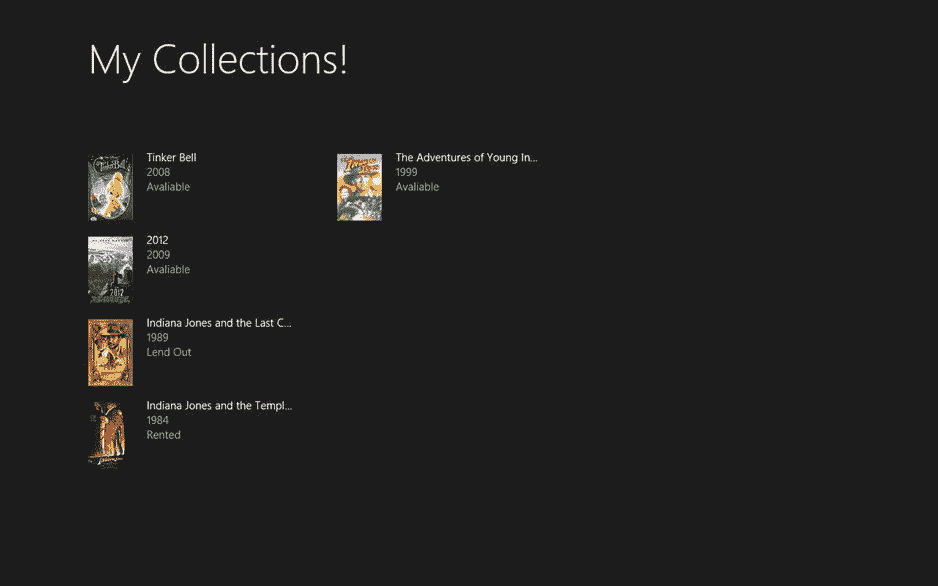
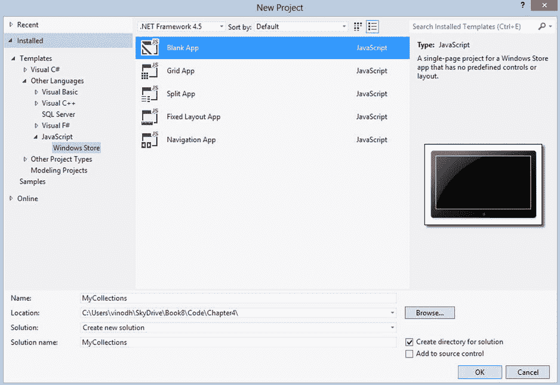
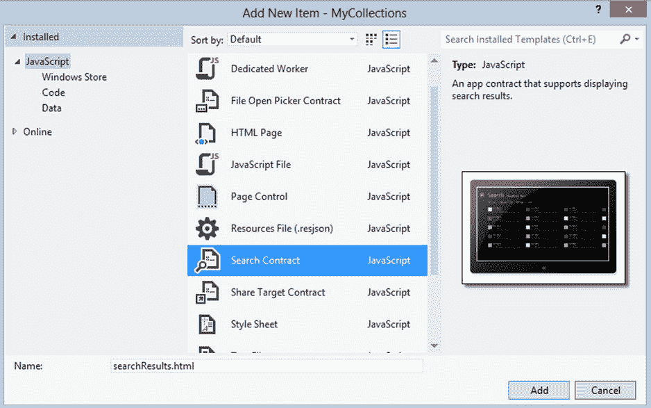
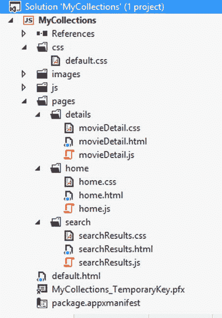
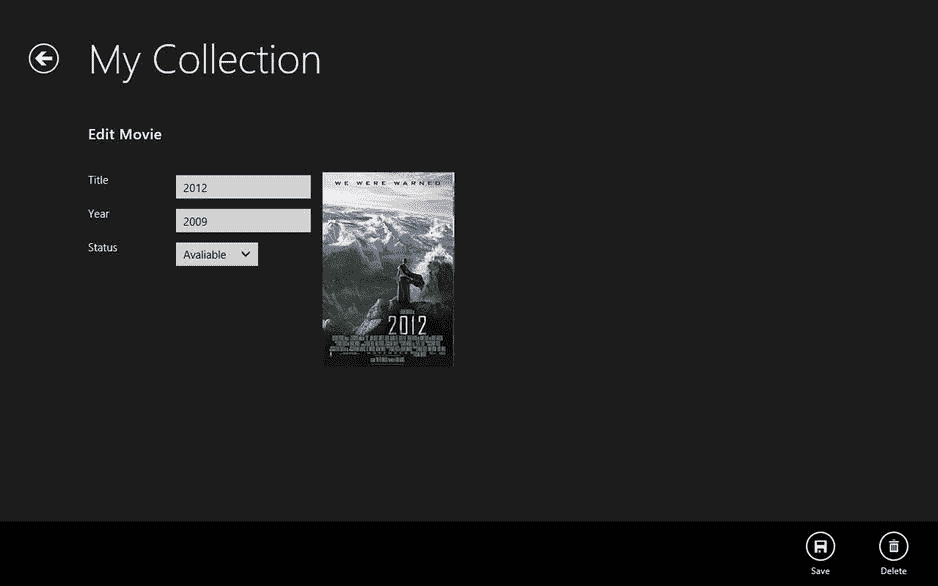
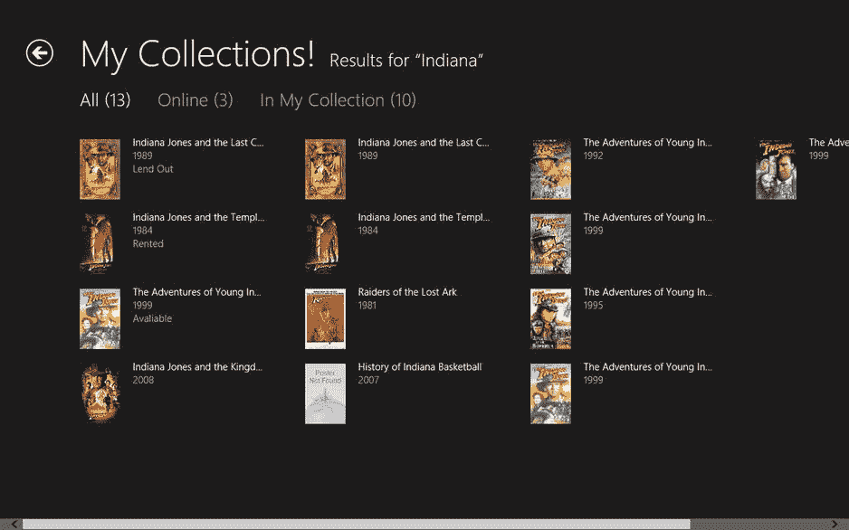

# 4.本地数据访问:I: IndexedDB

Abstract

WinRT 没有任何像 SQL Server CE 那样的内置数据库功能。它没有提供任何 API 来直接连接到 SQL Server 相反，我们需要使用云存储解决方案或依赖 SQLite 等第三方选项。云存储在许多情况下并不是理想的解决方案，因为它需要复杂的数据管理。此外，这可能不是一个负担得起的解决方案，因为在大多数情况下，在云中存储数据不是免费的。在接下来的三章中，我们将了解本地存储选项，如 indexedDB、JET API、应用存储和 SQLite。首先，在本章中，我们学习使用 IndexedDB 在本地存储结构化数据，并构建一个使用 IndexedDB 作为数据存储的电影收藏和库存应用程序。

WinRT 没有任何像 SQL Server CE 那样的内置数据库功能。它没有提供任何 API 来直接连接到 SQL Server 相反，我们需要使用云存储解决方案或依赖 SQLite 等第三方选项。云存储在许多情况下并不是理想的解决方案，因为它需要复杂的数据管理。此外，这可能不是一个负担得起的解决方案，因为在大多数情况下，在云中存储数据不是免费的。在接下来的三章中，我们将了解本地存储选项，如 indexedDB、JET API、应用存储和 SQLite。首先，在本章中，我们学习使用 IndexedDB 在本地存储结构化数据，并构建一个使用 IndexedDB 作为数据存储的电影收藏和库存应用程序。

## 什么是 IndexedDB？

IndexedDB 或索引数据库 API 是一个非关系数据存储，旨在将结构化对象存储在称为对象存储的集合中。对象存储将记录保存为键值对。对象存储中的每个记录都有一个键，可以配置为自动递增，也可以由应用程序提供。该键类似于关系数据库表中的主键，在关系数据库表中，对象存储中的任何两条记录都不能由同一个键标识。

Note

Firefox(从版本 4 开始)、Internet Explorer 10 和 Google Chrome(从版本 11 开始)都支持 IndexedDB。Safari 和 Opera 支持客户端数据库存储的替代机制，称为 Web SQL 数据库。截至 2010 年 11 月，W3C Web 应用程序工作组停止了 Web SQL 数据库规范的工作，理由是缺乏独立的实现。

## 在 Windows 8 应用程序中使用 IndexedDB

使用 JavaScript 的 Internet Explorer 10 和 Windows Store 应用程序支持由万维网联盟(W3C)索引数据库 API 规范定义的索引数据库 API，因此使用 HTML5 和 JavaScript 编写的应用程序将能够使用 IndexedDB 作为本地存储选项。以下是一些常见的指数化 DB 合约。

*   数据库:数据库由一个或多个保存数据库中存储的数据的对象存储组成。它还包含索引，用于管理事务。一个应用程序中可以有多个数据库。
*   对象存储:对象存储是用于在数据库中存储数据的主要存储。它是 JavaScript 对象的集合，其中的属性有键值对。
*   关键字:关键字用于在数据库中唯一地标识一个对象。它具有浮点、日期、字符串和数组类型的值。它非常类似于关系数据库表中的主键列。它还对相关对象施加了升序排序。
*   值:值是与给定键相关联的 JavaScript 对象。每条记录都与一个值相关联。它可以是一个没有模式化需求的复杂对象。
*   键路径:键路径是一个字符串，它定义了从值中提取键的方法。如果一个键路径包含一个空字符串，或者包含多个用句点分隔的 JavaScript 元素，那么这个键路径就是有效的。
*   索引:索引是检索对象存储中的记录的替代方法，而不是使用键。这是一种特殊形式的存储，支持通过属性值在存储中搜索对象。
*   事务:事务用于向数据库中读取或写入数据。事务总是以三种模式之一运行:只读、读写或 versionchange。
*   请求:请求用于对数据库执行读或写操作。这类似于 SQL 语句。
*   键范围:键范围用于从对象存储和索引中检索记录。
*   游标:游标是一种简单的机制，用于遍历数据库中的多条记录。它是双向的，可以跳过非唯一索引中的重复记录。

尽管 IndexedDB concepts 看起来类似于关系数据库管理元素，但一个关键的区别是没有关系语义，这意味着我们不能使用连接。通过这个介绍，我们了解了如何使用 IndexedDB 作为数据存储，方法是使用 HTML5 和 JavaScript 创建 My Collections，这是一个电影收藏和库存 Windows Store 应用程序。

## 创建我的收藏应用程序

许多电影迷收藏了大量的 DVD 和蓝光电影，并与他们的朋友和家人分享。有时候，跟踪所有这些电影变成了一个乏味的过程。为了管理和跟踪收藏，我们构建了一个简单的应用程序来帮助添加和跟踪收藏中的电影。这个应用程序有三个 HTML 页面。

图 4-1。

My Collection Windows 8 app displays the movies in the collection

*   起始页:这个页面显示收藏中的电影列表。
*   搜索页面:搜索页面是从 Windows 8 搜索魅力中调用的。该页面显示来自集合的匹配结果，它还在最受欢迎的电影评论和信息网站之一 [`www.Rottentomatoes.com`](http://www.rottentomatoes.com/) 上搜索匹配结果，并显示结果。
*   添加/编辑页面:可以从起始页或搜索结果页面访问该页面。它显示电影的详细信息，并提供一个将它添加到收藏中的选项。我们还可以编辑电影信息及其可用状态(参见图 [4-1](#Fig1) )。

### 入门指南

首先，让我们创建一个新的 Windows Store 空白应用程序(JavaScript)项目，并将其命名为 MyCollections(参见图 [4-2](#Fig2) )。我们向项目添加了两个新页面:`Home.html`和`Details.html`。

图 4-2。

Visual Studio templates for JavaScript creates a Blank application with HTML, CSS, and JavaScript files

我们还添加了一个搜索契约并命名为`searchResults.html`，如图 [4-3](#Fig3) 所示。如前所述，这是我们从 Windows 8 Search charm 搜索电影时会涉及到的页面。

图 4-3。

Adding support for the Search contract by using the Visual Studio template

最后，我们添加一个 JavaScript 文件，`Movie.js`。这是主文件，它包含驱动整个应用程序的功能。

所有的文件都准备好了，为了更好的管理，在你移动一些文件来重组项目之后，最终的 MyCollections Windows 8 应用程序项目将如图 [4-4](#Fig4) 所示。

图 4-4。

Visual Studio Solution Explorer displaying the MyCollections project structure

### 定义模式

MyCollections IndexedDB 数据库集合 DB 将只有一个名为 Movies 的对象存储。电影对象存储将有六个关键路径，如下所示。

*   Id:自动增量的作用类似于主键。
*   标题:存储电影的标题。
*   Year:存储电影的发行年份。
*   储存腐烂的 [`tomatoes.com`](http://tomatoes.com) 。
*   海报:店铺烂 [`tomatoes.com`](http://tomatoes.com) 海报链接。
*   状态:电影的当前状态，如可用、借出、借出。

### 创建数据库

我们通过调用如清单 4-1 所示的函数`createDB`，在`default.js`中的激活事件处应用程序一启动，就通过创建 CollectionDB 数据库来开始编码。

清单 4-1。在激活的事件内部调用 createDB 函数

`app.addEventListener("activated", function (args) {`

`if (args.detail.kind === activation.ActivationKind.launch) {`

`if (args.detail.previousExecutionState !== activation.ApplicationExecutionState.terminated) {`

`// TODO: This application has been newly launched. Initialize`

`// your application here.`

`} else {`

`// TODO: This application has been reactivated from suspension.`

`// Restore application state here.`

`}`

`if (app.sessionState.history) {`

`nav.history = app.sessionState.history;`

`}`

`args.setPromise(WinJS.UI.processAll().then(function () {`

`if (nav.location) {`

`nav.history.current.initialPlaceholder = true;`

`return nav.navigate(nav.location, nav.state);`

`} else {`

`return nav.navigate(Application.navigator.home);`

`}`

`}));`

`//creating the indexeddb database`

`createDB();`

`}`

`});`

`CreateDB`函数创建打开数据库的请求。如果它不存在，创建它，它会立即升级到版本 1。在任何给定时间，应用程序中只能存在一个数据库版本。创建后，数据库及其对象存储只能通过一种称为版本更改的特殊类型的事务模式进行更改。要在创建后更改数据库，我们必须用更高的版本号打开数据库，这就是将其更改为版本 1 的原因。这个动作会触发`upgradeneeded`事件，并在`onupgradeneeded`中创建电影对象存储。

电影对象存储是使用 IndexedDB `createObjectStore`函数创建的。该函数获取对象存储的名称，并设置密钥路径和密钥生成器。这个对象存储也有保存附加信息的索引。这些索引是使用`createIndex`函数创建的。打开数据库时调用成功回调。这里我们将数据库上下文设置为一个属性，如清单 4-2 所示。

清单 4-2。数据库和表是在 createDB 函数中创建的

`function createDB() {`

`// Create the request to open the database, named CollectionDB. If it doesn't exist, create it and immediately`

`// upgrade to version 1.`

`var dbRequest = window.indexedDB.open("CollectionDB", 1);`

`dbRequest.onupgradeneeded = function (e) {`

`MyCollection.db = e.target.result;`

`var txn = e.target.transaction;`

`var movieTable = MyCollection.db.createObjectStore(`

`"Movies"`

`,{`

`keyPath: "id"`

`, autoIncrement: true`

`});`

`movieTable.createIndex("title"`

`, "title"`

`, { unique: false });`

`movieTable.createIndex("year"`

`, "year"`

`, { unique: false });`

`movieTable.createIndex("image"`

`, "image"`

`, { unique: false });`

`movieTable.createIndex("poster"`

`, "poster"`

`, { unique: false });`

`movieTable.createIndex("status"`

`, "status"`

`, { unique: false });`

`txn.onerror = function () {`

`WinJS.log && WinJS.log("Database creation failed"`

`, "Log"`

`, "Status");`

`};`

`txn.oncomplete = function () {`

`WinJS.log && WinJS.log("Database table created"`

`, "Log"`

`, "Status");`

`};`

`};`

`dbRequest.onsuccess = function (e) {`

`MyCollection.db = e.target.result;`

`};`

`}`

### 在 Windows 8 JavaScript 中创建电影对象

Movie.js 包含一个自动执行的匿名函数，其中对象是在`MyCollections`名称空间中创建的。该对象包含一个属性`Movie`。

使用`WinJS.Class.define()`方法将电影对象定义为`WinJS.Class`。从清单 4-3 中可以看出，这个方法采用了分配给`Movie`类的相应属性的各种参数。`Movie`类有五个匹配 IndexedDB objectstore Movie 的属性和另一个属性`IsInCollection`，用于确定对象是否已经在集合中。

清单 4-3。在 Movie.js 中定义电影对象

`WinJS.Namespace.define("MyCollection", {`

`Movie: WinJS.Class.define(`

`function () {`

`this.title = "";`

`this.year = 0;`

`this.image = "";`

`this.isInCollection = false;`

`this.status = "";`

`this.poster = "";`

`this.id = 0;`

`},`

`{`

`getTitle: function () { return this.title; },`

`setTitle: function (newValue) { this.title = newValue; },`

`getImage: function () { return this.image; },`

`setImage: function (newValue) { this.image = newValue; },`

`getIsInCollection: function () { return this.isInCollection; },`

`setIsInCollection: function (newValue) { this.isInCollection = newValue; },`

`getYear: function () { return this.year; },`

`setYear: function (newValue) {`

`this.year = newValue;`

`},`

`getPoster: function () { return this.poster; },`

`setPoster: function (newValue) { this.poster = newValue; },`

`getStatus: function () { return this.status; },`

`setStatus: function (newValue) { this.status = newValue; },`

`getID: function () { return this.id; },`

`setID: function (newValue) {`

`this.id = newValue;`

`},`

`},`

Movie 对象也有 CRUD 函数，我们用它来添加、删除和更新 IndexedDB 的数据。让我们详细看一下其中的每一个。

#### 保存电影对象

要将电影添加到电影集合中，我们调用`saveMovie`函数。该函数首先检查 IndexedDB 电影`objectStore`中是否已经存在电影细节。如果该信息已经存在，它将更新现有的行；否则，它将向 IndexedDB 电影`objectStore`中添加一个新行。为此，首先创建一个新的涉及电影`objectStore`的事务，如清单 4-4 所示，并将模式设置为`readWrite`，并将获得一个电影对象存储的句柄。现在我们已经可以访问`objectstore`，我们可以根据 ID 参数的值传递一个 JSON 对象来添加或上传命令。

清单 4-4。使用 saveMovie 函数将电影对象保存到 IndexedDB

`saveMovie: function (id, title, year, image, poster, status ) {`

`var txn = MyCollection.db.transaction(["Movies"], "readwrite");`

`var movieTable = txn.objectStore("Movies");`

`var saveRequest;`

`if (id > 0)`

`saveRequest = movieTable.put(`

`{`

`id: id,`

`title: title,`

`year: year,`

`image: image,`

`poster: poster,`

`status: status`

`});`

`else {`

`saveRequest = movieTable.add(`

`{`

`title: title,`

`year: year,`

`image: image,`

`poster: poster,`

`status: status`

`});`

`}`

`saveRequest.onsuccess = function () {`

`WinJS.log && WinJS.log("Movie Updated: " + this + ".", "Log", "Status");`

`};`

`saveRequest.onerror = function () {`

`WinJS && WinJS.log("Failed to update Movie: " + this + ".", "Log", "error");`

`};`

`}`

Note

在 IndexedDB 中，`objectStore.add()`用于将对象添加到存储中，`objectStore.put()`用于更新对象。

#### 删除电影对象

`deleteMovie`函数从电影`objectStore`中删除一行。就像`saveMovie`一样，我们启动一个事务，引用包含`Movie`对象的对象存储，并用我们对象的唯一 ID 发出一个删除命令(见清单 4-5)。

清单 4-5。使用 deleteMovie 函数从 IndexedDB 中删除电影对象

`deleteMovie: function ( id ) {`

`var txn = MyCollection.db.transaction(["Movies"], "readwrite");`

`var movieTable = txn.objectStore("Movies");`

`var deleteRequest = movieTable.delete(id)`

`deleteRequest.onsuccess = function () {`

`WinJS.log && WinJS.log("Movie Deleted: " + this + ".", "Log", "Status");`

`};`

`deleteRequest.onerror = function () {`

`WinJS && WinJS.log("Failed to delete Movie: " + this + ".", "Log", "error");`

`};`

`}`

#### 检索电影详细信息

使用 REST API 从属于用户集合的数据库或烂番茄数据库中检索电影细节。这两个动作在 JavaScript 函数`loadFromDB`和`loadSearchResult`中执行。这些函数依次调用`buildMovie`函数来构建一个`Movie`对象。`buildMovie`函数检查作为参数传入的模型，创建一个新的`Movie`对象，尝试从传入的模型中设置它的值，并在`WinJS.Binding.as()`方法的帮助下返回一个可绑定对象(见清单 4-6)。

清单 4-6。buildMovie 函数从模型中创建一个电影对象

`buildMovie: function (model) {`

`var newMovie = new MyCollection.Movie();`

`if (model.hasOwnProperty("title")) {`

`newMovie.setTitle(model.title);`

`}`

`if (model.hasOwnProperty("year")) {`

`newMovie.setYear(model.year);`

`}`

`if (model.hasOwnProperty("movieId")) {`

`newMovie.setID(model.id);`

`newMovie.setIsInCollection(true);`

`}`

`if (model.hasOwnProperty("status")) {`

`newMovie.setStatus(model.status);`

`}`

`if (model.hasOwnProperty("thumbnail")) {`

`newMovie.setImage(model.thumbnail);`

`}`

`if (model.hasOwnProperty("poster")) {`

`newMovie.setPoster(model.poster);`

`}`

`//only if the request from rottentomatoes`

`if (model.hasOwnProperty("posters")) {`

`newMovie.setImage(model.posters.thumbnail);`

`newMovie.setPoster(model.posters.detailed);`

`}`

`return new WinJS.Binding.as(newMovie);`

`}`

清单 4-7 所示的`loadFromDB`函数将 string 作为参数，返回一个与 IndexedDB 电影`objectStore`中电影商店的标题相匹配的`Movie`对象数组。像`saveMovie`和`deleteMovie`方法一样，我们首先创建一个涉及电影`objectStore`的新事务，并将模式设置为只读，因为这里只检索数据。然后我们打开一个游标来遍历`Movie`对象存储中的记录。结果被传递给游标上的 success 回调函数，我们在那里呈现结果。对于每个结果，回调只触发一次，并且将调用`continue`继续遍历结果对象上的数据。JSON 对象从结果中构造出来，并被传递给`buildMovie`函数以返回一个`WinJS.Binding`对象，该对象最终被添加到数组中。

清单 4-7。搜索 indexedDB 并将结果填充到数组中

`loadFromDB: function (searchText) {`

`var collection = new Array();`

`var txn = MyCollection.db.transaction(["Movies"], "readonly");`

`var movieCursorRequest = txn.objectStore("Movies").openCursor();`

`movieCursorRequest.onsuccess = function (e) {`

`var cursor = e.target.result;`

`if (cursor) {`

`var data = cursor.value;`

`if (data.title.indexOf(searchText) > -1) {`

`var movieData = {`

`movieId: data.id`

`, title: data.title`

`, year: data.year`

`, thumbnail: data.image`

`, poster: data.poster`

`, status: data.status`

`};`

`var newMovie = MyCollection.Movie.buildMovie(movieData);`

`collection.push(newMovie);`

`}`

`cursor.continue();`

`}`

`};`

`return collection;`

`}`

和`loadFromDB`一样，清单 4-8 所示的`loadSearchResult`函数将搜索文本作为参数，并返回一个`Movie`对象数组。该函数执行两个操作。首先，它使用公共 API 查询烂番茄电影数据库，并将结果加载到一个数组中。接下来，它调用`loadFromDB`并将匹配的电影对象添加到现有数组中。现在，数组中的对象与 IndexedDB `Movie`对象存储库中的搜索结果相匹配，也与烂番茄搜索结果相匹配。

清单 4-8。搜索烂番茄数据库并将结果添加到一个数组中

`loadSearchResult: function (searchText) {`

`var searchUrl = "``http://api.rottentomatoes.com/api/public/v1.0/movies.json?apikey=XXXXXXXXXXXXXf8&page_limit=10&q=`T2】

`return WinJS.xhr({ url: searchUrl }).then(`

`function (result) {`

`var result = window.JSON.parse(result.responseText).movies;`

`var collection = new Array();`

`if (result) {`

`result.forEach(function (newObject) {`

`var newMovie = MyCollection.Movie.buildMovieFromRottentomatoes(newObject);`

`collection.push(newMovie);`

`});`

`var txn = MyCollection.db.transaction(["Movies"], "readonly");`

`var movieCursorRequest = txn.objectStore("Movies").openCursor();`

`movieCursorRequest.onsuccess = function (e) {`

`var cursor = e.target.result;`

`if (cursor) {`

`var data = cursor.value;`

`if (data.title.indexOf(searchText) > -1) {`

`var movieData = {`

`movieId: data.id`

`, title: data.title`

`, year: data.year`

`, thumbnail: data.image`

`, poster: data.poster`

`, status: data.status`

`};`

`var newMovie = MyCollection.Movie.buildMovie(movieData);`

`collection.push(newMovie);`

`}`

`cursor.continue();`

`}`

`};`

`}`

`return collection;`

`});`

`}`

### 设计应用起始页

`Home.html`是本 app 的起始页(见图 [4-1](#Fig1) )。它通过绑定到`Home.js`中的电影集合，使用`WinJS.UI.ListView`元素在网格布局中显示我们的 IndexedDB 集合中的电影。我们还定义了一个项目模板，其中包含显示每部电影细节的标记(见清单 4-9)。

清单 4-9 . Home.html 页面包括一个带有项目模板的 ListView 来显示电影细节

`<!DOCTYPE html>`

`<html>`

`<head>`

`<meta charset="utf-8" />`

`<title>homePage</title>`

`<!-- WinJS references -->`

`<link href="//Microsoft.WinJS.1.0/css/ui-dark.css" rel="stylesheet" />`

``

``

`<link href="/css/default.css" rel="stylesheet" />`

`<link href="/pages/home/home.css" rel="stylesheet" />`

``

`</head>`

`<body>`

`<!-- The content that will be loaded and displayed. -->`

`
`

`
`

``

`
`

`<h3`

`class="item-title win-type-x-small win-type-ellipsis"`

`data-win-bind="innerHTML: title"></h3>`

`<h4`

`class="item-subtitle win-type-x-small win-type-ellipsis"`

`data-win-bind="innerHTML: year"></h4>`

`<h4`

`class="item-subtitle win-type-x-small win-type-ellipsis"`

`data-win-bind="innerHTML: status"></h4>`

`
`

`
`

`
`

`
`

`<header`

`aria-label="Header content"`

`role="banner">`

`<button`

`class="win-backbutton"`

`aria-label="Back"`

`disabled type="button"></button>`

`<h1 class="titlearea win-type-ellipsis">`

`My Collections!`

`</h1>`

`</header>`

`<section aria-label="Main content" role="main">`

`<div`

`id="listView"`

`class="resultslist win-selectionstylefilled"`

`aria-label="Movies in my collection"`

`data-win-control="WinJS.UI.ListView"`

`data-win-options="{`

`itemTemplate: select('#dbItemtemplate'),`

`}">`

`}">
`

`</section>`

`
`

`</body>`

`</html>`

### Home.js

`Home.js`是我们编写额外代码的地方，为我们的`home.html`页面提供交互性。这个脚本文件只实现了就绪功能。这个函数在页面加载时被调用。在这个函数中，我们遍历 IndexedDB Movies 对象存储，并将其存储到一个数组中，并将该数组绑定到`ListView`，如清单 4-10 所示。该页面还有一个`itemInvoked`功能，该功能附属于`ListView`，当从`ListView`中选择一个项目时被调用。一旦被调用，这个函数使用`WinJS.Navigation.navigate`函数导航用户到`MovieDetail.html`(见清单 4-11)。该函数将详细页面位置和选定的电影对象作为参数。

清单 4-10。集合中的电影被绑定到 ListView 元素

`(function () {`

`"use strict";`

`WinJS.UI.Pages.define("/pages/home/home.html", {`

`// This function is called whenever a user navigates to this page. It`

`// populates the page elements with the app's data.`

`ready: function (element, options) {`

`var listView = element.querySelector(".resultslist").winControl;`

`var tapBehavior = listView.tapBehavior;`

`listView.tapBehavior = tapBehavior;`

`listView.oniteminvoked = this._itemInvoked;`

`var collection = new Array();`

`var txn = MyCollection.db.transaction(["Movies"], "readonly");`

`var movieCursorRequest = txn.objectStore("Movies").openCursor();`

`movieCursorRequest.onsuccess = function (e) {`

`var cursor = e.target.result;`

`if (cursor) {`

`var data = cursor.value;`

`var movieData = {`

`movieId: data.id`

`, title: data.title`

`, year: data.year`

`, thumbnail: data.image`

`, poster: data.poster`

`, status: data.status`

`};`

`var newMovie = MyCollection.Movie.buildMovie(movieData);`

`collection.push(newMovie);`

`cursor.continue();`

`}`

`else {`

`listView.itemDataSource = new WinJS.Binding.List(collection).dataSource;`

`}`

`}`

`},`

`_itemInvoked: function (args) {`

`args.detail.itemPromise.done(function itemInvoked(item) {`

`WinJS.Navigation.navigate("/pages/details/movieDetail.html"`

`, { movieDetail: item.data });`

`});`

`},`

`});`

`})();`

设计电影详细信息页面

`MovieDetail.html`页面从主页或搜索结果页面重定向，并显示上一页中所选电影的详细信息。`MovieDetail.html`还提供了添加或编辑电影对象的选项。该页面的标记包含一个 HTML 元素，该元素使用 WinJS `data-win-bind`属性绑定到`Movie`对象的属性。该页面还有两个应用栏按钮，允许我们保存或删除`Movie`对象，如图 [4-5](#Fig5) 所示。

清单 4-11 .用 HTML 元素显示选定电影细节的 MovieDetail.html

`<!DOCTYPE html>`

`<html>`

`<head>`

`<meta charset="utf-8" />`

`<title>movieDetail</title>`

`<!-- WinJS references -->`

`<link href="//Microsoft.WinJS.1.0/css/ui-dark.css" rel="stylesheet" />`

``

``

`<link href="/pages/details/movieDetail.css" rel="stylesheet" />`

``

`</head>`

`<body>`

`
`

`<header`

`aria-label="Header content"`

`role="banner">`

`<button`

`class="win-backbutton"`

`aria-label="Back"`

`disabled`

`type="button" />`

`<h1`

`class="titlearea win-type-ellipsis">`

`My Collection`

`</h1>`

`</header>`

`<section`

`aria-label="Main content"`

`role="main">`

`<div`

`id="divDetail"`

`class="detailView">`

`<h3 id="title">Edit Movie</h3>`

` `

`<!--Movie Image-->`

``

`<!--Movie Title-->`

`<label>Title</label>`

`<input`

`id="txtTitle"`

`type="text"`

`data-win-bind="value: title Binding.Mode.twoway" />`

` `

`<!--Movie Release Year-->`

`<label>Year</label>`

`<input`

`id="txtYear"`

`type="text"`

`data-win-bind="value: year Binding.Mode.twoway" />`

` `

`<!--Movie Status-->`

`<label>Status</label>`

`<select`

`id="status"`

`data-win-bind="selected: status; value: status Binding.Mode.twoway">`

`<option value="Avaliable">Avaliable</option>`

`<option value="Lend Out">Lend Out</option>`

`<option value="Rented">Borrowed</option>`

`</select>`

` `

`
`

`</section>`

`
`

`<!--App bar-->`

`<div`

`data-win-control="WinJS.UI.AppBar"`

`class="appBar"`

`id="appBar">`

`<!--Save Movie Button-->`

`<button`

`data-win-control="WinJS.UI.AppBarCommand"`

`data-win-options="{id:'saveButton', label:'Save', icon:'save',section:'global'}"/>`

`<!--Delete Movie Button-->`

`<button`

`data-win-control="WinJS.UI.AppBarCommand"`

`data-win-options="{id:'deleteButton', label:'Delete', icon:'delete',section:'global'}"/>`

`
`

`</body>`

`</html>`

图 4-5。

The My Collections app displaying movie details along with the app bar for saving and deleting

### 电影详情.js

这里我们将传递给这个页面的`Movie`对象绑定到页面`ready`函数中的`div`元素。这个函数，如清单 4-12 所示，也为保存和删除按钮设置事件处理程序，该按钮依次调用`Movie.js`中的`saveMovie`(见清单 4-4)和`deleteMovie`(见清单 4-5)函数。

清单 4-12。将电影对象绑定到 div 元素进行添加或删除

`WinJS.UI.Pages.define("/pages/details/movieDetail.html", {`

`// This function is called whenever a user navigates to this page. It`

`// populates the page elements with the app's data.`

`ready: function (element, options) {`

`// TODO: Initialize the page here.`

`movieDetail = options.movieDetail;`

`var src = WinJS.Binding.as(movieDetail);`

`var form = document.getElementById("divDetail");`

`WinJS.Binding.processAll(form, src);`

`document.getElementById("saveButton")`

`.addEventListener("click", doClickSave, false);`

`document.getElementById("deleteButton")`

`.addEventListener("click", doClickDelete, false);`

`if (movieDetail.fromSearch == true) {`

`document.getElementById("deleteButton").disabled = true;`

`document.getElementById("title").innerText = "Add to collection";`

`}`

`}`

`});`

`function doClickSave() {`

`MyCollection.Movie.saveMovie(movieDetail.id, movieDetail.title, movieDetail.year, movieDetail.image, movieDetail.poster, movieDetail.status);`

`WinJS.Navigation.back();`

`}`

`function doClickDelete() {`

`MyCollection.Movie.deleteMovie(movieDetail.id);`

`WinJS.Navigation.back();`

`}`

尽管我们将元素绑定到了`Movie`对象属性，但是我们对元素所做的更改并没有反映在`Movie`对象中，因为 WinJS 不支持双向绑定，但是由于有了`WinJS.Binding.initializer`函数，添加这个功能非常容易。创建绑定时会涉及到这个函数。`WinJS.Binding.initializer`授予对源和目标对象及其属性的访问权，这允许它们订阅目标元素的事件并将数据推送到源对象，如清单 4-13 所示。

清单 4-13。使用 WinJS 定义双向绑定。绑定.初始值设定项

`WinJS.Namespace.define("Binding.Mode", {`

`twoway: WinJS.Binding.initializer(function (source, sourceProps, dest, destProps) {`

`WinJS.Binding.defaultBind(source, sourceProps, dest, destProps);`

`dest.onchange = function () {`

`var d = dest[destProps[0]];`

`var s = source[sourceProps[0]];`

`if (s !== d) source[sourceProps[0]] = d;`

`}`

`})`

`});`

一旦定义完毕，我们只需要将初始化器应用于绑定，如清单 4-14 所示。

清单 4-14。在 HTML 元素中启用双向绑定

`<input type="text" data-win-bind="value: title Binding.Mode.twoway" />`

### 搜索电影

当我们使用 Search charm 进行应用级搜索时，就会调用`searchResults.html`页面。该页面在一个`ListView`元素中显示匹配结果(参见清单 4-15)。结果如图 [4-6](#Fig6) 所示。在`ListView`中显示电影信息与`Home.html`非常相似，除了一个例外:这里我们使用两个项目模板，一个用于显示来自烂番茄数据库的电影细节，另一个来自 IndexedDB，使用`searchResult.js`中的 JavaScript 代码动态切换，如清单 4-16 所示。

清单 4-15。当从 Search Charm 调用时，搜索页面以列表视图的形式显示结果

`<!DOCTYPE html>`

`<html>`

`<head>`

`<meta charset="utf-8" />`

`<meta name="ms-design-extensionType" content="Search" />`

`<title>Search Contract</title>`

`<!-- WinJS references -->`

`<link href="//Microsoft.WinJS.1.0/css/ui-dark.css" rel="stylesheet" />`

``

``

`<link href="/css/default.css" rel="stylesheet" />`

`<link href="/pages/search/searchResults.css" rel="stylesheet" />`

``

`</head>`

`<body>`

`<!-- This template is used to display each item in the ListView declared`

`below. -->`

`<!--ItemTemplate to display search from Rotten Tomatoes database -->`

`<div`

`id="onlineItemtemplate"`

`class="itemtemplate"`

`data-win-control="WinJS.Binding.Template">`

`
`

``

`
`

`<h3`

`class="item-title win-type-x-small win-type-ellipsis"`

`data-win-bind="innerHTML: title searchResults.title" />`

`<h4`

`class="item-subtitle win-type-x-small win-type-ellipsis"`

`data-win-bind="innerHTML: year searchResults.text" />`

`
`

`
`

`
`

`<!--ItemTemplate to display search from IndexedDB -->`

`
`

`
`

``

`
`

`<h3`

`class="item-title win-type-x-small win-type-ellipsis"`

`data-win-bind="innerHTML: title searchResults.title" />`

`<h4`

`class="item-subtitle win-type-x-small win-type-ellipsis"`

`data-win-bind="innerHTML: year searchResults.text" />`

`<h4`

`class="item-subtitle win-type-x-small win-type-ellipsis"`

`data-win-bind="innerHTML: status searchResults.text" />`

`
`

`
`

`
`

`<!-- The content that will be loaded and displayed. -->`

`
`

`<!--Page Header-->`

`<header`

`aria-label="Header content"`

`role="banner">`

`<button`

`class="win-backbutton"`

`aria-label="Back"`

`disabled`

`type="button" />`

`
`

`<h1 class="pagetitle win-type-ellipsis" />`

`<h2 class="pagesubtitle win-type-ellipsis" />`

`
`

`</header>`

`<section`

`aria-label="Main content"`

`role="main">`

`<div`

`class="resultsmessage win-type-x-large">`

`No results match your search.`

`
`

`<!--Filter section-->`

`
`

`<ul class="filterbar"></ul>`

`<select class="filterselect" />`

`
`

`<!--ListView-->`

`<div`

`id="searchListView"`

`class="resultslist win-selectionstylefilled"`

`aria-label="Search results"`

`data-win-control="WinJS.UI.ListView" />`

`</section>`

`
`

`</body>`

`</html>`

图 4-6。

My Collections app displaying search results

### 搜索结果.js

`searchResult.js`页面主要做三件事:获取结果数据并将其绑定到`ListView`，动态切换模板，最后为页面生成过滤器，以便用户可以通过在线和收集过滤结果。

#### 动态模板更改

动态模板改变(见清单 4-16)可以通过将函数`itemTemplateFunction`分配给`ListLiew itemTemplate`属性来实现。这个函数根据`Movie`对象`isInCollection`属性的值返回一个 DOM 元素。

清单 4-16。动态切换模板

`ready: function (element, options) {`

`var listView = element.querySelector(".resultslist").winControl;`

`// listView.itemTemplate = element.querySelector(".itemtemplate");`

`listView.oniteminvoked = this._itemInvoked;`

`listView.itemTemplate = itemTemplateFunction;`

`this._handleQuery(element, options);`

`listView.element.focus();`

`}`

`function itemTemplateFunction(itemPromise) {`

`return itemPromise.then(function (item) {`

`var itemTemplate = document.getElementById("onlineItemtemplate");`

`if (item.data.isInCollection) {`

`itemTemplate = document.getElementById("dbItemtemplate");`

`};`

`var container = document.createElement("div");`

`itemTemplate.winControl.render(item.data, container);`

`return container;`

`});`

`}`

#### 获取数据

当我们添加搜索协定页时，Visual Studio 包含了自动满足搜索协定最低要求的必要代码。在`searchResults.js`中有两个我们感兴趣的函数，`_handleQuery`和`_searchData`(见清单 4-17)。`_handleQuery`依次调用函数`_searchData`。在`_searchData`函数中，我们通过调用方法`loadFromDB`和`loadSearchResult`用搜索数据填充`WinJS.Binding.List`。除了这两个函数，我们还调用了`_generateFilters`和`_populateFilterBar`函数。

清单 4-17。处理搜索查询并将结果加载到数组中

`_handleQuery: function (element, args) {`

`var originalResults;`

`this._lastSearch = args.queryText;`

`WinJS.Namespace.define("searchResults"`

`, {`

`markText: WinJS.Binding.converter(this._markText.bind(this))`

`});`

`this._initializeLayout(element.querySelector(".resultslist").winControl`

`, Windows.UI.ViewManagement.ApplicationView.value);`

`this._generateFilters();`

`this._searchData(args.queryText, element, this);`

`},`

`// This function populates a WinJS.Binding.List with search results for the`

`// provided query.`

`_searchData: function (queryText, element, object) {`

`var originalResults;`

`originalResults = MyCollection.Movie.loadFromDB(queryText);`

`MyCollection.Movie.loadSearchResult(queryText).done(`

`function (result) {`

`for (var i = 0; i < result.length; i++)`

`{`

`originalResults.push(result[i]);`

`}`

`originalResults = new WinJS.Binding.List(originalResults);`

`if (originalResults.length === 0) {`

`document.querySelector('.filterarea').style.display = "none";`

`} else {`

`document.querySelector('.resultsmessage').style.display = "none";`

`}`

`object._populateFilterBar(element, originalResults);`

`object._applyFilter(object._filters[0], originalResults);`

`return originalResults;`

`});`

`}`

`});`

#### 生成过滤器

过滤器在`_generateFilters`功能中创建。根据`isInCollection`属性的值，我们为搜索结果添加了两个过滤器，如清单 4-18 所示:一个显示烂番茄匹配，另一个显示索引数据库中的匹配。

清单 4-18。为搜索结果创建过滤器

`generateFilters: function () {`

`this._filters = [];`

`this._filters.push(`

`{`

`results: null`

`, text: "All"`

`, predicate: function (item) {`

`return true;`

`}`

`});`

`this._filters.push(`

`{`

`results: null`

`, text: "Online"`

`, predicate: function (item) {`

`return item.isInCollection === true;`

`}`

`});`

`this._filters.push(`

`{`

`results: null`

`, text: "In My Collection"`

`, predicate: function (item) {`

`return item.isInCollection !== true;`

`}`

`});`

`}`

现在所有代码都准备好了，当我们运行我的收藏应用程序时，起初它显示一个空的开始屏幕，但我们可以使用搜索功能搜索电影，并将它们添加到我们的电影收藏中。一旦它们被添加，开始屏幕将如图 [4-1](#Fig1) 所示。

## 改进的想法

“我的收藏”应用程序可以进行改进，使其成为一个功能齐全的库存应用程序。以下是一些可以添加的功能:

*   你可以添加一个选项，使用第三方 API 搜索书籍或游戏，比如 [`http://www.thegamesdb.net/`](http://www.thegamesdb.net/) 和谷歌图书。
*   现在，我们只能通过搜索烂番茄数据库来添加一部电影。您可以提供一个选项来添加特殊条目。
*   条形码扫描选项将允许用户通过快速扫描电影盒上的条形码来输入电影。
*   在 SkyDrive 或 Dropbox 中备份您的电影收藏。
*   添加高级搜索功能和过滤器。
*   你可以把这些东西分为书籍、电影、游戏等等。

## 结论

在本章中，我们通过创建一个 Windows 8 JavaScript 应用程序，学习了如何使用 IndexedDB 作为本地存储选项。正如我们所见，IndexedDB API 是一个简单但功能强大的本地存储数据的选项，尽管它与关系数据库略有不同。

还有一些像 IDBWrapper ( [`https://github.com/jensarps/IDBWrapper`](https://github.com/jensarps/IDBWrapper) `)`)这样的 IndexedDB 包装器，可以用来方便地使用 IndexedDB。在下一章中，我们将通过学习使用 Jet API 和应用程序存储来继续探索本地存储选项。