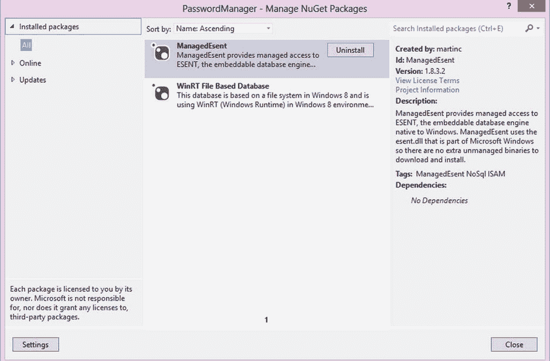
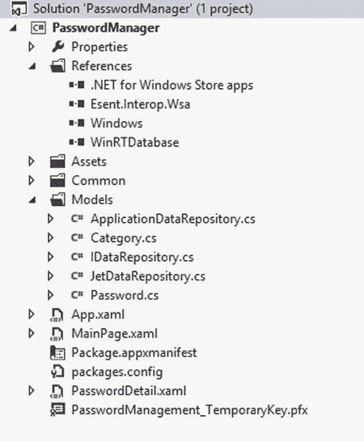
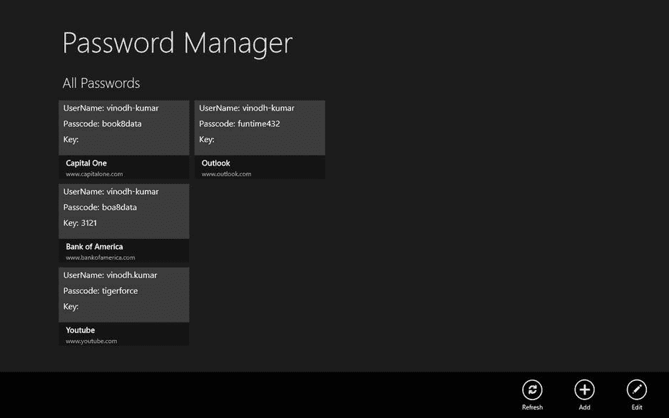
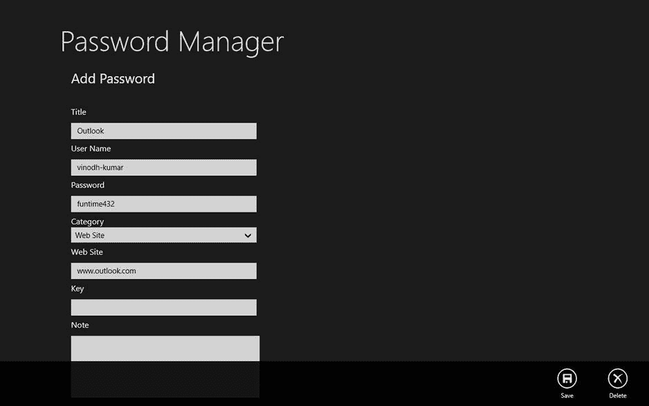

# 五、本地数据访问 II：JET API 和应用数据

Abstract

在上一章中，我们学习了使用 IndexedDB 作为本地存储选项之一。继续本章，我们将了解更多本地存储选项，即 JET API 和应用存储，方法是使用 XAML/C# 创建一个 Windows 8 密码管理器应用。

在上一章中，我们学习了使用 IndexedDB 作为本地存储选项之一。继续本章，我们将了解更多本地存储选项，即 JET API 和应用存储，方法是使用 XAML/C# 创建一个 Windows 8 密码管理器应用。

## 什么是 ESENT/Jet API？

ESENT/JET API 是微软的索引顺序访问方法(ISAM)数据存储技术。ESENT 运行时自 Windows 2000 以来一直是 Windows 的一部分，并已用于 Microsoft Exchange、Active Directory、Windows Update 和桌面搜索等产品中。这个应用使用索引或顺序游标导航来存储和检索表中的数据。

## 为什么使用 ESENT/Jet API

我们可以将 ESENT 用于需要可靠、高性能、低开销的结构化或半结构化数据存储的应用。ESENT 引擎可以帮助满足各种数据需求，从简单到太大而无法存储在内存中的哈希表，到更复杂的数据，例如包含表、列和索引的应用。

ESENT 整合了 ISAM 数据存储技术的所有优势，如下所示:

*   酸性交易
*   快照隔离
*   并行存取存储器
*   光标导航
*   高级索引:对多值列、稀疏列和元组进行索引
*   固定列、可变列和标记列
*   数据完整性和一致性
*   列大小从 1 位到 2 GB 不等

## 构建密码管理器应用

密码管理器应用有助于将银行信息、财务信息、健康信息、网站登录、在线订阅、信用卡、保险和其他一切需要保密的信息存储在一个位置，以便于访问。

### 设置开发环境

首先，我们创建一个新的 Windows 应用商店空白应用(XAML)项目，并将其命名为 PasswordManager。这个应用将有两个 XAML 页面。`MainPage.xaml`是起始页，将列出数据库中所有存储的密码信息。`PasswordDetail.xaml`用于添加、删除或更新密码。

### 创建数据库

我们将创建一个数据库，`_PasswordDB`，它包含两个通过类别和密码的表。我们将添加两个 POCO 类，`Category`(见清单 5-1)和`Password`，到项目的 Models 文件夹中，它将代表表格，这两个类的结构将模拟表格的列。

Category 是一个查找表，我们使用它将密码分为银行、保险、网站、订阅和其他类别。

清单 5-1。表示类别表的类别 POCO 类

`public class Category`

`{`

`public int CategoryId { get; set; }`

`public string CategoryName { get; set; }`

`}`

密码表保存了密码信息(见清单 5-2)。

清单 5-2。密码类存储密码详细信息

`public class Password`

`{`

`public Guid PasswordId { get; set; }`

`public string Title { get; set; }`

`public string UserName { get; set; }`

`public string Passcode { get; set; }`

`public string WebSite { get; set; }`

`public string Key { get; set; }`

`public int CategoryId { get; set; }`

`public string Note { get; set; }`

`}`

为了让事情变得有趣，我们将使用 ESENT 数据库和应用数据存储作为该应用的存储选项。应用数据存储是 Windows 8 应用可以使用`Windows.Storage`名称空间下的类将数据存储到本地、临时和漫游文件夹中的地方。我们将在本章后面了解更多关于 Windows 8 应用数据存储的信息。

为了在一个应用中使用两个不同的存储选项，我们创建了一个接口`IDataRespository`(见清单 5-1)和两个单独的类`JetDataRepository`和`ApplicationDataRepository`，它们显式地实现了`IDataRespository`接口的方法。`IDataRespository`接口有各种方法，允许我们创建、实例化一个数据库，以及上传、获取和删除数据，如清单 5-3 所示。

清单 5-3。定义创建、修改、读取、获取和删除数据的接口

`public interface IDataRepository`

`{`

`void CreateInstance();`

`void AddCategory(Category cat);`

`void DeletePassword(Guid id);`

`void SavePassword(Password pwd, bool isnew);`

`List<Category> GetCategories();`

`List<Password> GetAllPasswords();`

`}`

为了在 ESENT 和应用数据中创建、添加、修改和删除数据，我们将以下 dll 的引用添加到 references 下的项目中。

*   管理事件
*   基于 WinRT 文件的数据库

ESENT 数据库引擎是 Windows 自带的，因此要在托管环境中使用它，我们需要创建一个托管 ESENT 互操作层。我们将使用现有的 ManagedEsent，而不是编写一个。ManagedEsent 提供对 Esent 的托管访问，ESENT 是 Windows 自带的嵌入式数据库引擎。ManagedEsent 使用 Microsoft Windows 的一部分`esent.dll`,因此没有额外的非托管二进制文件需要下载和安装。

类似地，我们不会从头开始构建一个序列化对象并将它们存储在应用存储中的数据库，而是通过在我们的项目中引用它来使用 NuGet 中现有的一个名为 WinRT File Based Database 的数据库。基于 WinRT 文件的数据库包括一个简单而有效的 API，允许基于类创建表。每个数据库由任意数量的表组成。所有操作都是异步的，以支持文件系统上的 Windows 8 风格的操作。它还支持表的水平分区，以提供更小的文件和更快的操作。

这两个 dll 的引用是从 NuGet 包中添加的，如图 [5-1](#Fig1) 所示。

图 5-1。

Using NuGet to add references to ManagedEsent and WinRT database

所有文件就绪后，我们的密码管理器应用解决方案浏览器将如图 [5-2](#Fig2) 所示。现在我们将研究实现`IDataRepository`接口的类`JetDataRepository`和`ApplicationDataRepository`。

图 5-2。

Password Manager Windows 8 App project structure

### 创建 ESENT 数据存储库

`JetDataRepository`实现`IDataRepository`，用于将数据存储到 ESENT 数据库中。`CreateInstance`方法用于创建一个 ESENT 数据库的实例(见清单 5-4)。在这个方法中，我们构建数据库文件路径，然后将路径传递给属于 ManagedEsent API 的`Instance`类。`Instance`类将`JET_INSTANCE`与`JetInit`和`JetTerm`包装在一起。这个类继承自`SafeHandle`以确保 ESENT 实例总是被终止。

清单 5-4。使用 CreateInstance 创建 ESENT 实例

`public void CreateInstance()`

`{`

`_instancePath = Path.Combine(ApplicationData.Current.LocalFolder.Path, DatabaseName);`

`_databasePath = Path.Combine(_instancePath, "_Password.edb");`

`_instance = new Instance(_databasePath);`

`_instance.Parameters.CreatePathIfNotExist = true;`

`_instance.Parameters.TempDirectory = Path.Combine(_instancePath, "temp");`

`_instance.Parameters.SystemDirectory = Path.Combine(_instancePath, "system");`

`_instance.Parameters.LogFileDirectory = Path.Combine(_instancePath, "logs");`

`_instance.Parameters.Recovery = true;`

`_instance.Parameters.CircularLog = true;`

`_instance.Init();`

`CreateDatabase();`

`}`

Note

一个 ESENT 实例最多可以包含六个数据库，并为所有连接的数据库提供一个共享的事务日志。

接下来我们添加另一个方法`CreateDatabase`，它在`CreateInstance`方法中被调用，如清单 5-5 所示。

清单 5-5。创建 ESENT 数据库和表

`private async void CreateDatabase()`

`{`

`if (await IsFileExist(_databasePath))`

`return;`

`using (var session = new Session(_instance))`

`{`

`JET_DBID database;`

`Api.JetCreateDatabase(session`

`, _databasePath`

`, null`

`, out database`

`, CreateDatabaseGrbit.None);`

`// create database schema`

`using (var transaction = new Transaction(session))`

`{`

`//Schema for Category Table`

`JET_TABLEID categoryTableId;`

`Api.JetCreateTable(session`

`, database`

`, "Categories" //table name`

`, 1`

`, 100`

`, out categoryTableId);`

`JET_COLUMNID categoryColumnid;`

`//CategoryId column`

`Api.JetAddColumn(session`

`, categoryTableId`

`, "CategoryId" //column name`

`, new JET_COLUMNDEF`

`{`

`cbMax = 16,`

`coltyp = JET_coltyp.IEEESingle,`

`grbit = ColumndefGrbit.ColumnFixed | ColumndefGrbit.ColumnNotNULL`

`}`

`, null`

`, 0`

`, out categoryColumnid);`

`//CategoryName column`

`Api.JetAddColumn(session`

`, categoryTableId`

`, "CategoryName" //column name`

`, new JET_COLUMNDEF`

`{`

`coltyp = JET_coltyp.LongText,`

`cp = JET_CP.Unicode,`

`grbit = ColumndefGrbit.None`

`}, null, 0, out categoryColumnid);`

`//Creating Index`

`var categoryindexDef = "+CategoryId\0\0";`

`Api.JetCreateIndex(session`

`, categoryTableId`

`, "CategoryId_index" //index name`

`, CreateIndexGrbit.IndexPrimary`

`, categoryindexDef`

`, categoryindexDef.Length`

`, 100);`

`//Schema for Password table`

`JET_TABLEID passwordTableid;`

`Api.JetCreateTable(session`

`, database`

`, "Passwords" //table name`

`, 1`

`, 100`

`, out passwordTableid);`

`//creating columns for Password tables`

`JET_COLUMNID passwordColumnid;`

`Api.JetAddColumn(session`

`, passwordTableid`

`, "PasswordId" //column name`

`, new JET_COLUMNDEF`

`{`

`cbMax = 16,`

`coltyp = JET_coltyp.Binary,`

`grbit = ColumndefGrbit.ColumnFixed | ColumndefGrbit.ColumnNotNULL`

`}`

`, null`

`, 0`

`, out passwordColumnid);`

`Api.JetAddColumn(session`

`, passwordTableid`

`, "Title" //column name`

`, new JET_COLUMNDEF`

`{`

`coltyp = JET_coltyp.LongText,`

`cp = JET_CP.Unicode,`

`grbit = ColumndefGrbit.None`

`}`

`, null`

`, 0`

`, out passwordColumnid);`

`Api.JetAddColumn(session`

`, passwordTableid`

`, "UserName" //column name`

`, new JET_COLUMNDEF`

`{`

`coltyp = JET_coltyp.LongText,`

`cp = JET_CP.Unicode,`

`grbit = ColumndefGrbit.None`

`}`

`, null`

`, 0`

`, out passwordColumnid);`

`Api.JetAddColumn(session`

`, passwordTableid`

`, "Passcode" //column name`

`, new JET_COLUMNDEF`

`{`

`coltyp = JET_coltyp.LongText,`

`cp = JET_CP.Unicode,`

`grbit = ColumndefGrbit.None`

`}`

`, null`

`, 0`

`, out passwordColumnid);`

`Api.JetAddColumn(session`

`, passwordTableid`

`, "WebSite" //column name`

`, new JET_COLUMNDEF`

`{`

`coltyp = JET_coltyp.LongText,`

`cp = JET_CP.Unicode,`

`grbit = ColumndefGrbit.None`

`}`

`, null`

`, 0`

`, out passwordColumnid);`

`Api.JetAddColumn(session`

`, passwordTableid`

`, "Key" //column name`

`, new JET_COLUMNDEF`

`{`

`coltyp = JET_coltyp.LongText,`

`cp = JET_CP.Unicode,`

`grbit = ColumndefGrbit.None`

`}`

`, null`

`, 0`

`, out passwordColumnid);`

`Api.JetAddColumn(session`

`, passwordTableid`

`, "CategoryId" //column name`

`, new JET_COLUMNDEF`

`{`

`coltyp = JET_coltyp.IEEESingle,`

`cp = JET_CP.Unicode,`

`grbit = ColumndefGrbit.None`

`}`

`, null`

`, 0`

`, out passwordColumnid);`

`Api.JetAddColumn(session`

`, passwordTableid`

`, "Note" //column name`

`, new JET_COLUMNDEF`

`{`

`coltyp = JET_coltyp.LongText,`

`cp = JET_CP.Unicode,`

`grbit = ColumndefGrbit.None`

`}`

`, null`

`, 0`

`, out passwordColumnid);`

`//creating index for Passwords table`

`var indexDef = "+PasswordId\0\0";`

`Api.JetCreateIndex(session`

`, passwordTableid`

`, "PasswordId_index" //index name`

`, CreateIndexGrbit.IndexPrimary`

`, indexDef`

`, indexDef.Length`

`, 100);`

`transaction.Commit(CommitTransactionGrbit.None);`

`}`

`Api.JetCloseDatabase(session, database, CloseDatabaseGrbit.None);`

`Api.JetDetachDatabase(session, _databasePath);`

`}`

`//Add defult values to the database table`

`CreateDefaultData();`

`}`

一旦创建了数据库和表格，我们就可以用默认类别和一些测试密码数据填充表格，之后我们调用`CreateDatabase`中的`CreateDefaultData`方法，如清单 5-6 所示。

清单 5-6。向类别和密码表中插入默认值

`private void CreateDefaultData()`

`{`

`//Adding categories`

`AddCategory(new Category {`

`CategoryId = 1`

`, CategoryName = "Bank"`

`});`

`AddCategory(new Category {`

`CategoryId = 2`

`, CategoryName = "Web Site"`

`});`

`//Adding password`

`SavePassword(new Password {`

`PasswordId = Guid.NewGuid()`

`, Title = "Capital One"`

`, UserName = "vinodh-kumar"`

`, WebSite = "`[`www.capitalone.com`](http://www.capitalone.com/)T2】

`, Passcode = "book8data"`

`, CategoryId = 1`

`}`

`, true);`

`SavePassword(new Password {`

`PasswordId = Guid.NewGuid()`

`, Title = "Bank of America"`

`, UserName = "vinodh-kumar"`

`, Passcode = "boa8data"`

`, CategoryId = 1`

`, Key = "3121"`

`, WebSite = "`[`www.bankofamerica.com`](http://www.bankofamerica.com/)T2】

`}`

`, true);`

`}`

`CreateDefaultData`调用`AddCategory`和`SavePassword`方法向类别和密码表中添加新行。我们必须执行以下活动来与 ESENT 数据交互(见清单 5-7)。

*   使用`Instance`对象创建一个新会话。
*   将数据库附加到会话并打开它。
*   为此会话启动一个新事务。
*   在事务中，选择我们想要使用的活动表。
*   可以执行数据操作，如更新或删除表中的行。

清单 5-7。向类别表中添加数据

`public void AddCategory` `(Category ev)`

`{`

`using (var session = new Session(_instance))`

`{`

`JET_DBID dbid;`

`Api.JetAttachDatabase(session`

`, _databasePath`

`, AttachDatabaseGrbit.None);`

`//Opening database`

`Api.JetOpenDatabase(session`

`, _databasePath`

`, String.Empty`

`, out dbid`

`, OpenDatabaseGrbit.None);`

`//within a transaction`

`using (var transaction = new Transaction(session))`

`{`

`//opening the table`

`using (var table = new Table(session`

`, dbid`

`, "Categories"`

`, OpenTableGrbit.None))`

`{`

`//inserting row`

`using (var updater = new Update(session, table, JET_prep.Insert))`

`{`

`var columnId = Api.GetTableColumnid(session`

`, table`

`, "CategoryId"); //to CategoryId column`

`Api.SetColumn(session`

`, table`

`, columnId`

`, ev.CategoryId);`

`var columnDesc = Api.GetTableColumnid(session`

`, table`

`, "CategoryName"); //to CategoryName column`

`Api.SetColumn(session`

`, table`

`, columnDesc`

`, ev.CategoryName`

`, Encoding.Unicode);`

`updater.Save();`

`}`

`}`

`transaction.Commit(CommitTransactionGrbit.LazyFlush);`

`}`

`}`

`}`

如前所述，每当我们与 ESENT 数据交互时，我们都必须创建一个会话，连接并打开数据库，然后启动一个事务。接下来，我们将前面提到的密码表的所有活动封装在`ExecuteInTransaction`方法中，并将使用这个方法与密码表进行交互(CRUD ),如清单 5-8 所示。

清单 5-8。ExecuteInTransaction 封装了 ESENT 活动

`private IList<Password> ExecuteInTransaction(Func<Session, Table, IList<Password>> dataFunc)`

`{`

`IList<Password> results;`

`using (var session = new Session(_instance))`

`{`

`JET_DBID dbid;`

`Api.JetAttachDatabase(session, _databasePath, AttachDatabaseGrbit.None);`

`Api.JetOpenDatabase(session, _databasePath, String.Empty, out dbid, OpenDatabaseGrbit.None);`

`using (var transaction = new Transaction(session))`

`{`

`using (var table = new Table(session, dbid, "Passwords", OpenTableGrbit.None))`

`{`

`results = dataFunc(session, table);`

`}`

`transaction.Commit(CommitTransactionGrbit.None);`

`}`

`}`

`return results;`

`}`

#### 添加密码

接下来，我们将添加一个使用`ExecuteInTransaction`(见清单 5-8)方法的方法`SavePassword`。该方法将`Password`对象作为参数之一，并将值设置为密码表中相应的列。当调用 ESENT 的`Update`对象中的`Save`方法时，如清单 5-9 所示，它将向密码表中插入或更新一行。

清单 5-9。向密码表中添加或更新密码

`public void SavePassword(Password pwd, bool isnew)`

`{`

`ExecuteInTransaction((session, table) =>`

`{`

`using (var updater = new Update(session, table, isnew ? JET_prep.Insert : JET_prep.Replace))`

`{`

`//set the password id depending on the isnew parameter`

`if (isnew)`

`{`

`var columnId = Api.GetTableColumnid(session, table, "PasswordId");`

`Api.SetColumn(session, table, columnId, pwd.PasswordId);`

`}`

`//Title`

`var columnTitle = Api.GetTableColumnid(session, table, "Title");`

`Api.SetColumn(session, table, columnTitle, pwd.Title, Encoding.Unicode);`

`//UserName`

`var columnUserName = Api.GetTableColumnid(session, table, "UserName");`

`Api.SetColumn(session, table, columnUserName, pwd.UserName, Encoding.Unicode);`

`//Passcode`

`var columnPasscode = Api.GetTableColumnid(session, table, "Passcode");`

`Api.SetColumn(session, table, columnPasscode, pwd.Passcode, Encoding.Unicode);`

`//WebSite`

`var columnWebSite = Api.GetTableColumnid(session, table, "WebSite");`

`Api.SetColumn(session, table, columnWebSite, pwd.WebSite, Encoding.Unicode);`

`//Key`

`var columnKey = Api.GetTableColumnid(session, table, "Key");`

`Api.SetColumn(session, table, columnKey, pwd.Key, Encoding.Unicode);`

`//CategoryId`

`var columnCategoryId = Api.GetTableColumnid(session, table, "CategoryId");`

`Api.SetColumn(session, table, columnCategoryId, pwd.CategoryId);`

`//Note`

`var columnNote = Api.GetTableColumnid(session, table, "Note");`

`Api.SetColumn(session, table, columnNote, pwd.Note, Encoding.Unicode);`

`updater.Save();`

`}`

`return null;`

`});`

`}`

#### 删除密码

类似于`SavePassword`(见清单 5-9)方法，`DeletePassword`也调用`ExecuteInTransaction`方法(见清单 5-8)来设置从密码表中删除一行的 ESENT。在这个方法中，我们将密码 ID 作为参数，并使用 JET API 的`MakeKey`方法寻找一个与我们的密码 ID 匹配的密钥，然后使用`JetDelete`删除选中的记录，如清单 5-10 所示。

清单 5-10。使用 DeletePassword 从密码表中删除行

`public void DeletePassword(Guid id)`

`{`

`ExecuteInTransaction((session, table) =>`

`{`

`Api.JetSetCurrentIndex(session, table, null);`

`Api.MakeKey(session, table, id, MakeKeyGrbit.NewKey);`

`if (Api.TrySeek(session, table, SeekGrbit.SeekEQ))`

`{`

`Api.JetDelete(session, table);`

`}`

`return null;`

`});`

`}`

#### 检索密码

与前两个方法类似，首先我们将调用`ExecuteInTransaction`，然后将使用 JET API 的`TryMoveFirst`和`TryMoveNext`方法遍历密码表中的所有记录，并将当前正在构造的记录传递给`GetPassword`方法。`GetPassword`使用`JetRetrieveColumn`获取所有列的值，并将它们分配给`Password`对象的 corressponding 属性。一旦检索到，`Password`对象就被添加到集合中(见清单 5-11)。

清单 5-11。从密码表中检索密码

`public List<Password> GetAllPasswords()`

`{`

`List<Password> results = null;`

`ExecuteInTransaction((session, table) =>`

`{`

`results = new List<Password>();`

`if (Api.TryMoveFirst(session, table))`

`{`

`do`

`{`

`//Call GetPassword method to create password object`

`//from the table row`

`results.Add(GetPassword(session, table));`

`}`

`while (Api.TryMoveNext(session, table));`

`}`

`return results;`

`});`

`return results;`

`}`

`private Password GetPassword(Session session, Table table)`

`{`

`var password = new Password();`

`//retrieving PasswordId column`

`var columnId = Api.GetTableColumnid(session, table, "PasswordId");`

`//assigning it to the PasswordId property`

`password.PasswordId = Api.RetrieveColumnAsGuid(session, table, columnId) ?? Guid.Empty;`

`//retrieving Title`

`var columnTitle = Api.GetTableColumnid(session, table, "Title");`

`password.Title = Api.RetrieveColumnAsString(session, table, columnTitle, Encoding.Unicode);`

`//retrieving UserName`

`var columnUsername = Api.GetTableColumnid(session, table, "UserName");`

`password.UserName = Api.RetrieveColumnAsString(session, table, columnUsername, Encoding.Unicode);`

`//retrieving Passcode`

`var columnPasscode = Api.GetTableColumnid(session, table, "Passcode");`

`password.Passcode = Api.RetrieveColumnAsString(session, table, columnPasscode, Encoding.Unicode);`

`//retrieving WebSite`

`var columnWebSite = Api.GetTableColumnid(session, table, "WebSite");`

`password.WebSite = Api.RetrieveColumnAsString(session, table, columnWebSite, Encoding.Unicode);`

`//retrieving Key`

`var columnKey = Api.GetTableColumnid(session, table, "Key");`

`password.Key = Api.RetrieveColumnAsString(session, table, columnKey, Encoding.Unicode);`

`//retrieving Note`

`var columnNote = Api.GetTableColumnid(session, table, "Note");`

`password.Note = Api.RetrieveColumnAsString(session, table, columnNote, Encoding.Unicode);`

`//retrieving CategoryId`

`var columnCategoryId = Api.GetTableColumnid(session, table, "CategoryId");`

`password.CategoryId = Api.RetrieveColumnAsInt32(session, table, columnCategoryId) ?? -1;`

`return password;`

`}`

由于所有的`IDataRepository`方法都在`JetDataRepository`中实现，我们将对用于在应用存储中存储数据的`ApplicationDataRepository`做同样的事情。在进一步讨论之前，先简要介绍一下应用数据存储。

## 使用应用数据存储

Windows 8/RT 中安装的每个应用都将被分配存储应用数据的空间。此应用存储可用于存储应用的设置、偏好设置、上下文、应用状态和文件。其他应用无法访问它，只能使用 WinRT 中提供的 API 来访问它。

为了存储和检索应用数据，我们应该使用`ApplicationData`类，它是`Windows.Store`名称空间的一部分。这些数据可以用三种不同的方式存储。

*   本地应用数据:在本地存储数据。仅当您有充分的理由不将设置漫游到云时，才使用本地存储。
*   漫游应用数据:数据将在用户安装了该应用的所有设备上同步。如果我们使用漫游，而用户没有 Microsoft 帐户，那么它将存储在本地。
*   临时应用数据:数据是在应用会话期间临时存储的，可以通过系统维护任务随时删除。

简单介绍了应用数据存储之后，我们现在在`ApplicationDataRepository`类中实现`IDataRepository`方法。`ApplicationDataRepository`类中的所有方法都是简单明了的，我们简要地看一下它们中的每一个。

### 基于 WinRT 文件的数据库

WinRT File Based Database 是一个基于文件系统的数据库，使用 WinRT 框架编写。这个 API 允许我们基于类创建表。每个数据库由许多表组成，这些表被序列化并存储在应用数据存储中。

像 ESANT 数据库一样，我们在清单 5-12 所示的`CreateInstance`方法中做的第一件事是创建数据库和表，如果它还不存在的话。如果它已经存在，我们打开数据库，检索表对象并将其分配给`ApplicationDataRepository`类中相应的属性。

清单 5-12。创建应用存储数据库和表

`public async void CreateInstance()`

`{`

`var exists = await Database.DoesDatabaseExistsAsync(DatabaseName`

`, StorageLocation.Local);`

`if (!exists)`

`{`

`_database = await Database.CreateDatabaseAsync(DatabaseName`

`, StorageLocation.Local);`

`_database.CreateTable<Category>();`

`_database.CreateTable<Password>();`

`var categoriesTable = await _database.Table<Category>();`

`var passwordsTable = await _database.Table<Password>();`

`Categories = categoriesTable;`

`Passwords = passwordsTable;`

`CreateDefaultData();`

`SaveResult result = await _database.SaveAsync();`

`if (result.Error == null)`

`{`

`Debug.WriteLine(result.Error == null ?`

`"Database created with Defult data"`

`: result.Error.Message);`

`}`

`}`

`else`

`{`

`_database = await Database.OpenDatabaseAsync(DatabaseName`

`, true`

`, StorageLocation.Local);`

`Categories = await _database.Table<Category>();`

`Passwords = await _database.Table<Password>();`

`}`

`}`

`public Table<Category> Categories`

`{ get; set; }`

`public Table<Password> Passwords`

`{ get; set; }`

接下来，我们使用清单 5-13 所示的`CreateDefaultData`方法将默认值插入到类别表中，并测试密码表中的数据，该方法在`CreateInstance`方法中被调用，其方式与我们在`JetDataRepository`中使用的方式非常相似。

清单 5-13。使用`CreateDefaultData`将默认值插入表格

`private void CreateDefaultData()`

`{`

`//Adding categories`

`Categories.Add(new Category`

`{`

`CategoryId = 1`

`, CategoryName = "Bank"`

`});`

`Categories.Add(new Category`

`{`

`CategoryId = 2`

`, CategoryName = "Web Site"`

`});`

`//Adding password`

`Passwords.Add(new Password`

`{`

`PasswordId = Guid.NewGuid()`

`, Title = "Capital One"`

`, UserName = "vinodh-kumar"`

`, WebSite = "`[`www.capitalone.com`](http://www.capitalone.com/)T2】

`, Passcode = "book8data"`

`, CategoryId = 1`

`});`

`Passwords.Add(new Password`

`{`

`PasswordId = Guid.NewGuid()`

`, Title = "Bank of America"`

`, UserName = "vinodh-kumar"`

`, Passcode = "boa8data"`

`, CategoryId = 1`

`, Key = "3121"`

`, WebSite = "`[`www.bankofamerica.com`](http://www.bankofamerica.com/)T2】

`});`

`}`

`AddCategory`方法将一个`Category`对象作为参数，并将其添加到`Categories`集合中。然后它异步调用基于 WinRT 文件的数据库实例的`Save`方法，如清单 5-14 所示。这个`Save`方法序列化`Categories`对象，并将其存储在应用数据存储中。

清单 5-14。使用 AddCategory 向类别表中添加一行

`public async void AddCategory(Category category)`

`{`

`Categories.Add(category);`

`SaveResult result = await _database.SaveAsync();`

`if (result.Error == null)`

`{`

`Debug.WriteLine(result.Error == null`

`? "Saved Category"`

`: result.Error.Message);`

`}`

`}`

类似于`AddCategory`方法，`SavePassword`方法将`Password`对象作为参数，如果它是新的，就将其添加到密码集合中，然后调用数据库对象`Save`方法，如清单 5-15 所示。

清单 5-15。使用`SavePassword`添加或更新密码表中的行

`public async void SavePassword(Password password, bool isnew=true)`

`{`

`if (isnew)`

`{`

`Passwords.Add(password);`

`}`

`SaveResult result = await _database.SaveAsync();`

`if (result.Error == null)`

`{`

`Debug.WriteLine(result.Error == null`

`? "Saved Password"`

`: result.Error.Message);`

`}`

`}`

`DeletePassword`方法从密码表中删除密码行，如清单 5-16 所示。该方法将密码 ID 作为一个参数，并使用它来获取对应于该密码 ID 的`Password`对象。然后，在调用数据库对象`Save`方法从密码表中永久删除该行之前，从`Passwords`集合中删除这个`Password`对象。

清单 5-16。使用 DeletePassword 从密码表中删除一行

`public async void DeletePassword(Guid id)`

`{`

`var password = Passwords.Where(p => p.PasswordId == id).FirstOrDefault();`

`Passwords.Remove(password);`

`SaveResult result = await _database.SaveAsync();`

`if (result.Error == null)`

`{`

`Debug.WriteLine(result.Error == null`

`? "Delete Password"`

`: result.Error.Message);`

`}`

`}`

`GetCategories`和`GetAllPasswords`方法将列出类别和密码数据，如清单 5-17 所示。

清单 5-17。GetCategories 和 GetAllPasswords 用于从表中检索数据

`public List<Category> GetCategories()`

`{`

`if (Categories == null) return null;`

`return Categories.ToList();`

`}`

`public List<Password> GetAllPasswords()`

`{`

`if (Passwords == null) return null;`

`return Passwords.ToList();`

`}`

现在所有的 CRUD 方法都准备好了，我们将把数据库集成到我们的密码管理器应用中。我们做的第一件事是在`App.xaml Launch`事件中创建两个`Repository`类的实例，并调用`CreateInstance`方法。我们还将实例分配给`PasswordDB`属性，以便它可以在整个应用中使用。尽管我们将集成两种不同的存储方法，但对于密码管理器应用，我们一次只能使用一个数据库。添加这个数据库开关的理想位置是在应用设置页面，但是为了简洁起见，这里我们创建一个布尔属性，可以在运行应用之前手动更改。参见清单 5-19。

清单 5-19。OnLaunched 将创建 DataRepository 类的实例

`protected override void OnLaunched(LaunchActivatedEventArgs args)`

`{`

`Frame rootFrame = Window.Current.Content as Frame;`

`//app defualts to application data storage`

`//change the UseApplicationStorage = false for Jet Datastorage`

`UseApplicationStorage = true;`

`IDataRepository dr = null;`

`if (UseApplicationStorage)`

`{`

`dr = new ApplicationDataRepository();`

`}`

`else`

`{`

`dr = new JetDataRepository();`

`}`

`dr.CreateInstance();`

`App.PasswordDB = dr;`

`// omitted for brevity`

`}`

`public static IDataRepository PasswordDB`

`{`

`get;`

`set;`

`}`

`public static bool UseApplicationStorage`

`{`

`get;`

`set;`

`}`

### 设计应用起始页

`MainPage.xaml`是本 app 的起始页(见图 [5-3](#Fig3) )。该页包含一个 GridView 控件，该控件列出了密码表中存储的所有密码。GridView 中每一项的布局都是由 PasswordDataTemplate 驱动的。这个模板非常类似于我们在第一章中用来显示纽约时报畅销书排行榜的 BookDataTemplate。`MainPage.xaml`也有三个应用栏按钮(见清单 5-20 ),这里列出了每个按钮的功能。

图 5-3。

Password Manager app displaying the stored passwords

*   刷新:用于刷新网格中显示的项目。
*   添加:导航至`PasswordDetail.xaml`(见图 [5-3](#Fig3) )。
*   编辑:导航到`PasswordDetail.xaml`以及从 GridView 中选择的密码作为页面参数。

清单 5-20。MainPage.xaml 包含一个带有项目模板的 GridView，用于显示密码详细信息

`<common:LayoutAwarePage`

`x:Name="pageRoot"`

`x:Class="PasswordManager.MainPage"`

`DataContext="{Binding DefaultViewModel, RelativeSource={RelativeSource Self}}"`

`xmlns="`[`http://schemas.microsoft.com/winfx/2006/xaml/presentation`](http://schemas.microsoft.com/winfx/2006/xaml/presentation)T2】

`xmlns:x="`[`http://schemas.microsoft.com/winfx/2006/xaml`](http://schemas.microsoft.com/winfx/2006/xaml)T2】

`xmlns:local="using:PasswordManager"`

`xmlns:common="using:PasswordManager.Common"`

`xmlns:d="`[`http://schemas.microsoft.com/expression/blend/2008`](http://schemas.microsoft.com/expression/blend/2008)T2】

`xmlns:mc="`[`http://schemas.openxmlformats.org/markup-compatibility/2006`](http://schemas.openxmlformats.org/markup-compatibility/2006)T2】

`mc:Ignorable="d">`

`<!--Reduced Markup for better readability-->`

`<Page.Resources>`

`<!--DataTemplae-->`

`<DataTemplate x:Key="PasswordDataTemplate">`

`<Grid Width="250" Height="150">`

`<StackPanel>`

`<!--UserName-->`

`<StackPanel Orientation="Horizontal">`

`<TextBlock Text="UserName:"/>`

`<TextBlock Text="{Binding UserName}"/>`

`</StackPanel>`

`<!--Password-->`

`<StackPanel Orientation="Horizontal">`

`<TextBlock Text="Passcode:"/>`

`<TextBlock Text="{Binding Passcode}"/>`

`</StackPanel>`

`<!--Key-->`

`<StackPanel Orientation="Horizontal">`

`<TextBlock Text="Key:"/>`

`<TextBlock Text="{Binding Key}"/>`

`</StackPanel>`

`</StackPanel>`

`<StackPanel VerticalAlignment="Bottom">`

`<!--Title-->`

`<TextBlock Text="{Binding Title}"/>`

`<!--WebSite-->`

`<TextBlock Text="{Binding WebSite}"/>`

`</StackPanel>`

`</Grid>`

`</DataTemplate>`

`</Page.Resources>`

`<!--AppBar-->`

`<common:LayoutAwarePage.BottomAppBar>`

`<AppBar IsOpen="True">`

`<Grid>`

`<Grid.ColumnDefinitions>`

`<ColumnDefinition/>`

`<ColumnDefinition/>`

`</Grid.ColumnDefinitions>`

`<StackPanel`

`Orientation="Horizontal"/>`

`<StackPanel`

`Grid.Column="1"`

`Orientation="Horizontal">`

`<!-- Refresh Button-->`

`<Button`

`Style="{StaticResource RefreshAppBarButtonStyle}"`

`Click="Refresh_Click" />`

`<!--New Password Button-->`

`<Button`

`Style="{StaticResource AddAppBarButtonStyle}"`

`Click="Add_Click" />`

`<!-- Edit Password Button-->`

`<Button`

`Style="{StaticResource EditAppBarButtonStyle}"`

`Click="Edit_Click"/>`

`</StackPanel>`

`</Grid>`

`</AppBar>`

`</common:LayoutAwarePage.BottomAppBar>`

`<!--Page Layout-->`

`<Grid Style="{StaticResource LayoutRootStyle}" Margin="0">`

`<Grid.RowDefinitions>`

`<RowDefinition Height="140"/>`

`<RowDefinition Height="48"/>`

`<RowDefinition Height="275*"/>`

`</Grid.RowDefinitions>`

`<!-- GridView to display Password details -->`

`<GridView`

`Grid.Row="2"`

`Name="gvPasswords"`

`ItemTemplate="{StaticResource PasswordDataTemplate}"`

`Grid.RowSpan="2"/>`

`<!-- Back button and page title -->`

`<Grid>`

`<Grid.ColumnDefinitions>`

`<ColumnDefinition Width="Auto"/>`

`<ColumnDefinition Width="*"/>`

`</Grid.ColumnDefinitions>`

`<Button`

`x:Name="backButton"`

`Click="GoBack"`

`IsEnabled="{Binding Frame.CanGoBack, ElementName=pageRoot}"`

`Style="{StaticResource BackButtonStyle}"/>`

`<TextBlock`

`x:Name="pageTitle"`

`Text="{StaticResource AppName}"`

`Grid.Column="1"`

`IsHitTestVisible="false"`

`Style="{StaticResource PageHeaderTextStyle}"/>`

`</Grid>`

`<TextBlock`

`x:Name="pageSubTitle"`

`Text="All Passwords"`

`IsHitTestVisible="false"`

`Style="{StaticResource PageSubheaderTextStyle}"`

`Margin="120,0,30,20"`

`Grid.Row="1"/>`

`</Grid>`

`</common:LayoutAwarePage>`

页面背后的`MainPage.xaml`代码有一个方法`LoadAllPasswords`和三个点击事件，用于每个应用栏按钮。`LoadAllPasswords`在页面开始时被调用，也在点击刷新按钮时被调用。该方法使用来自`DataRepository`类的方法`GetAllPasswords`(见清单 5-17)获取`Passwords`集合对象，并将其绑定到 GridView 的`ItemsSource`属性。`Add_Click`和`Edit_Click`事件将用户导航到`PasswordDetail.xaml`页面(参见清单 5.21)。

清单 5-21。MainPage.xaml 代码将密码集合绑定到 GridView

`public sealed partial class MainPage : PasswordManager.Common.LayoutAwarePage`

`{`

`public MainPage()`

`{`

`this.InitializeComponent();`

`}`

`protected override void OnNavigatedTo(NavigationEventArgs e)`

`{`

`LoadAllPasswords();`

`}`

`private void Refresh_Click(object sender, Windows.UI.Xaml.RoutedEventArgs e)`

`{`

`LoadAllPasswords();`

`}`

`private void LoadAllPasswords()`

`{`

`gvPasswords.ItemsSource = App.PasswordDB.GetAllPasswords();`

`}`

`private void Add_Click(object sender, Windows.UI.Xaml.RoutedEventArgs e)`

`{`

`var rootFrame = new Frame();`

`rootFrame.Navigate(typeof(PasswordDetail));`

`Window.Current.Content = rootFrame;`

`Window.Current.Activate();`

`}`

`private void Edit_Click(object sender, Windows.UI.Xaml.RoutedEventArgs e)`

`{`

`var rootFrame = new Frame();`

`rootFrame.Navigate(typeof(PasswordDetail), gvPasswords.SelectedValue);`

`Window.Current.Content = rootFrame;`

`Window.Current.Activate();`

`}`

`}`

#### 添加和更新密码

`PasswordDetail.xaml`是一个非常简单的页面(见图 [5-3](#Fig3) )，用于添加新密码或更新或删除现有密码(见清单 5-22)。该页面包含输入密码信息所需的控件。在这个页面上，我们还有两个应用栏按钮，用于保存和删除密码。

清单 5-22。PasswordDetail.xaml 具有输入密码信息的控件

`<common:LayoutAwarePage`

`x:Name="pageRoot"`

`x:Class="PasswordManager.PasswordDetail"`

`DataContext="{Binding DefaultViewModel, RelativeSource={RelativeSource Self}}"`

`xmlns="`[`http://schemas.microsoft.com/winfx/2006/xaml/presentation`](http://schemas.microsoft.com/winfx/2006/xaml/presentation)T2】

`xmlns:x="`[`http://schemas.microsoft.com/winfx/2006/xaml`](http://schemas.microsoft.com/winfx/2006/xaml)T2】

`xmlns:local="using:PasswordManager"`

`xmlns:common="using:PasswordManager.Common"`

`xmlns:d="`[`http://schemas.microsoft.com/expression/blend/2008`](http://schemas.microsoft.com/expression/blend/2008)T2】

`xmlns:mc="`[`http://schemas.openxmlformats.org/markup-compatibility/2006`](http://schemas.openxmlformats.org/markup-compatibility/2006)T2】

`mc:Ignorable="d">`

`<!--Reduced Markup for better readability-->`

`<!--App Bar buttons-->`

`<common:LayoutAwarePage.BottomAppBar>`

`<AppBar IsOpen="True">`

`<Grid>`

`<Grid.ColumnDefinitions>`

`<ColumnDefinition/>`

`<ColumnDefinition/>`

`</Grid.ColumnDefinitions>`

`<StackPanel`

`Orientation="Horizontal"`

`Grid.Column="1" HorizontalAlignment="Right">`

`<!--Save button-->`

`<Button`

`Style="{StaticResource SaveAppBarButtonStyle}"`

`Click="Save_Click"/>`

`<!--Delete button-->`

`<Button`

`x:Name="btnDelete"`

`Style="{StaticResource DeleteAppBarButtonStyle}"`

`Click="Delete_Click"`

`IsEnabled="False"/>`

`</StackPanel>`

`</Grid>`

`</AppBar>`

`</common:LayoutAwarePage.BottomAppBar>`

`<!--Page Layout-->`

`<Grid Style="{StaticResource LayoutRootStyle}">`

`<Grid.RowDefinitions>`

`<RowDefinition Height="140"/>`

`<RowDefinition Height="*"/>`

`</Grid.RowDefinitions>`

`<!-- Back button and page title -->`

`<Grid>`

`<Grid.ColumnDefinitions>`

`<ColumnDefinition Width="Auto"/>`

`<ColumnDefinition Width="*"/>`

`</Grid.ColumnDefinitions>`

`<Button`

`x:Name="backButton"`

`Click="GoBack"`

`IsEnabled="{Binding Frame.CanGoBack, ElementName=pageRoot}"`

`Style="{StaticResource BackButtonStyle}"/>`

`<TextBlock`

`x:Name="pageTitle"`

`Grid.Column="1"`

`Text="{StaticResource AppName}"`

`Style="{StaticResource PageHeaderTextStyle}"/>`

`</Grid>`

`<!--Password Details-->`

`<StackPanel Grid.Row="1">`

`<TextBlock Text="Add Password"/>`

`<!--Title-->`

`<StackPanel>`

`<TextBlock Text="Title"/>`

`<TextBox x:Name="txtTitle"/>`

`</StackPanel>`

`<!--User Name-->`

`<StackPanel>`

`<TextBlock Text="User Name"/>`

`<TextBox x:Name="txtUserName"/>`

`</StackPanel>`

`<!--Password-->`

`<StackPanel>`

`<TextBlock Text="Password"/>`

`<TextBox x:Name="txtPassword"/>`

`</StackPanel>`

`<!--Category-->`

`<StackPanel>`

`<TextBlock Text="Category"/>`

`<ComboBox x:Name="cboCategory"/>`

`</StackPanel>`

`<!--Web Site-->`

`<StackPanel>`

`<TextBlock Text="Web Site"/>`

`<TextBox x:Name="txtWebSite"/>`

`</StackPanel>`

`<!--Key-->`

`<StackPanel>`

`<TextBlock Text="Key"/>`

`<TextBox x:Name="txtKey"/>`

`</StackPanel>`

`<!--Note-->`

`<StackPanel>`

`<TextBlock Text="Note"/>`

`<TextBox x:Name="txtNote"/>`

`</StackPanel>`

`</StackPanel>`

`</Grid>`

`</common:LayoutAwarePage>`

页面后面的`PasswordDetail.xaml`代码有保存和删除密码的必要代码。首先，当页面被调用来编辑一个现有的密码对象时，这些值将被分配给相应的控件进行编辑，如清单 5-23 所示。

清单 5-23。将密码值分配给控件

`protected override void OnNavigatedTo(NavigationEventArgs e)`

`{`

`cboCategory.DisplayMemberPath = "CategoryName";`

`List<Category> categories = null;`

`categories = App.PasswordDB.GetCategories();`

`cboCategory.ItemsSource = categories;`

`if (e.Parameter != null)`

`{`

`_password = (Password)e.Parameter;`

`if (_password != null)`

`{`

`txtTitle.Text = _password.Title ?? "";`

`txtUserName.Text = _password.UserName ?? "";`

`txtPassword.Text = _password.Passcode ?? "";`

`txtKey.Text = _password.Key ?? "";`

`txtNote.Text = _password.Note??"";`

`txtWebSite.Text = _password.WebSite ?? "";`

`cboCategory.SelectedValue= categories.Where(c=>c.CategoryId == _password.CategoryId).First();`

`btnDelete.IsEnabled = true;`

`}`

`}`

`}`

当点击保存按钮时，调用`Save_Click`事件。在这个事件中，我们创建一个`Password`对象，并将其作为参数传递给`DataRepository`实例中的`SavePassword`方法，以便将对象保存到数据库中(见清单 5-24)。

清单 5-24。创建用于保存的密码对象

`private void Save_Click(object sender, Windows.UI.Xaml.RoutedEventArgs e)`

`{`

`Password pwd;`

`pwd = _password == null ? new Password() : _password;`

`pwd.PasswordId = _password == null ? Guid.NewGuid() : _password.PasswordId;`

`pwd.Title = txtTitle.Text;`

`pwd.UserName = txtUserName.Text;`

`pwd.Passcode = txtPassword.Text;`

`pwd.Key = txtKey.Text;`

`pwd.WebSite = txtWebSite.Text;`

`pwd.Note = txtNote.Text;`

`Category category = (Category)cboCategory.SelectedValue;`

`pwd.CategoryId = category.CategoryId;`

`App.PasswordDB.SavePassword(pwd, _password == null ? true : false);`

`NagivateToMainPage`()；

`}`

在删除按钮点击事件中调用`DataRepository`类中的`DeletePassword`方法。这将删除密码表中相应的行，并导航回`MainPage.xaml`，如清单 5-25 所示。

清单 5-25。使用 DataRepository DeletePassword 方法删除密码

`private void Delete_Click(object sender, Windows.UI.Xaml.RoutedEventArgs e)`

`{`

`App.PasswordDB.DeletePassword(_password.PasswordId);`

`NagivateToMainPage();`

`}`

现在，所有代码都已就绪，当我们运行密码管理器应用时，它将显示我们添加到密码表中的默认密码，如图 [5-4](#Fig4) 所示。从这里开始，我们将能够添加新密码，更新和删除现有的密码。

图 5-4。

Password details page for adding or editing passwords

## 改进的想法

密码管理器应用可以工作和改进，使其成为一个功能齐全的密码管理应用。以下是可以添加的一些功能。

*   如您所见，开发此应用的目的是展示 ESENT 数据库和应用数据存储的使用，因此我们没有编写代码来加密数据。这应该是我们做出的第一个改进。
*   我们按类别存储密码，但是考虑到本章的长度，我们没有实现它。这可能是我们可以做的一个改进，以及使用 Windows 搜索功能进行搜索的选项。
*   备份和导出功能会有所帮助。
*   现在，我们将应用存储在应用本地存储中。相反，我们可以使用漫游存储，这样数据就可以在用户的所有计算机和设备上同步。

## 结论

在本章中，我们学习了如何通过构建密码管理器应用，将 ESENT 数据库和应用数据存储用作本地存储选项。这里的目标是提供一个使用现有库的 ESENT 和应用存储的中级介绍，以便可以轻松地做出选择本地数据存储选项的决定。

在下一章中，我们将学习另一个更广泛使用的本地存储选项，Sqlite。一如既往，我们将构建一个使用 Sqlite 作为本地存储数据库的应用。