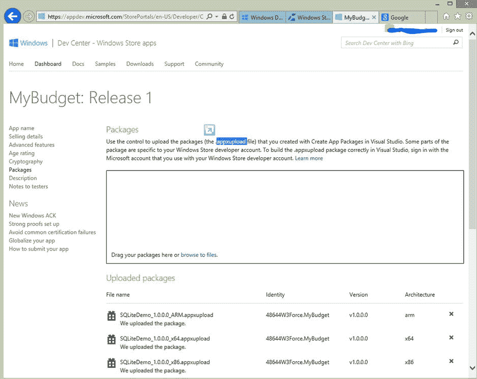

# 6.本地数据访问 III: SQLite

Abstract

在前两章中，我们研究了如何使用 Jet API、应用程序存储和 IndexedDB 在本地读写数据。在本章中，我们将讨论 Windows 8 应用程序的另一个本地存储选项 SQLite。本章首先介绍 SQLite，然后我们将研究在项目中包含 SQLite 所需的各种设置过程。我们还学习使用 sqlite-net，一个 sqlite 包装器。一如既往，我们通过使用 SQLite 作为数据存储选项开发 Windows 8 应用程序来结束本章。我们使用 MVVM 之光作为这个账单提醒应用的 MVVM 框架，通过这样做，我们学会了在项目中集成和使用 MVVM 之光，一个最流行的 MVVM 框架。

在前两章中，我们研究了如何使用 Jet API、应用程序存储和 IndexedDB 在本地读写数据。在本章中，我们将讨论 Windows 8 应用程序的另一个本地存储选项 SQLite。本章首先介绍 SQLite，然后我们将研究在项目中包含 SQLite 所需的各种设置过程。我们还学习使用 sqlite-net，一个 sqlite 包装器。一如既往，我们通过使用 SQLite 作为数据存储选项开发 Windows 8 应用程序来结束本章。我们使用 MVVM 之光作为这个账单提醒应用的 MVVM 框架，通过这样做，我们学会了在项目中集成和使用 MVVM 之光，一个最流行的 MVVM 框架。

## SQLite 简介

SQLite 是一个软件库，它实现了一个独立的、无服务器的、零配置的事务性 SQL 数据库引擎。它是一个基于文件的数据库，不需要 SQLServer、Oracle 等数据库引擎就可以使用。SQLite 是一个关系数据库管理系统，包含在一个小型 C 编程库中。SQLite 是世界上部署最广泛的 SQL 数据库引擎，其源代码存在于公共领域。它可以免费用于私人和商业目的。

SQLite 的特征与 SQL Server Compact 非常相似，但与 SQL Server Compact 不同，后者在大多数情况下是操作系统(Windows Phone OS、Windows Mobile OS)的一部分，SQLite 是一个嵌入式数据库，应明确包含在应用程序中，并在应用程序中运行。无论 CPU 的字节顺序如何，任何 SQLite 数据库文件都可以从一个平台复制到另一个平台。

## 集成 SQLite

现在我们将看到如何集成 SQLite。SQLite 开发团队通过打包二进制文件，根据 CPU 架构提取正确的 dll，使 SQLite 在 Windows 8 应用程序中的集成变得简单明了。若要从 Visual Studio 工具菜单安装 SQLite，请选择扩展和更新菜单。这将打开一个扩展和更新对话窗口。在搜索词中搜索 sqlite。这将显示 SQLite for Windows 运行时包，如图 [6-1](#Fig1) 所示。

图 6-1。

Search result shows SQLite for Windows Runtime package

单击下载按钮安装 SQLite 运行时并重新启动 Visual Studio。安装后，您可以使用引用管理器在项目中引用 SQLite。SQLite 将出现在 Windows 部分下的扩展中，如图 [6-2](#Fig2) 所示。

图 6-2。

Adding project reference to SQLite for Windows Runtime

我们还应该参考 Microsoft Visual C++运行时包，因为 SQLite for Windows 运行时依赖于此。事实上，所有的本地库都需要 Visual C++运行时包。

现在，当你编译这个项目时，会有一个编译时错误，因为我们不能针对任何 CPU 构建这个项目；因此，我们需要进入项目的配置管理器对话框，将目标平台更改为 X86，如图 [6-3](#Fig3) 所示。为了针对 X86、x64 和 ARM 等多种架构，我们需要创建三个单独的包，每个包针对一种架构，然后将包上传到 Windows 商店，如图 [6-4](#Fig4) 和 [6-5](#Fig5) 所示。

图 6-5。

Adding all three packages to the Windows Store App Submission Wizard

图 6-4。

Creating packages targeting all three architectures

图 6-3。

Changing the targeted platform from Visual Studio Configuration Manager

此时，SQLite 库成为项目的一部分，但是我们需要一个 C#中的托管包装器来与 C++库交互。因为编写类似的东西不在本书的范围之内，所以我们使用一个开源的基于 LINQ 的包装器 sqlite-net，我们可以从 NuGet 获得它(见图 [6-6](#Fig6) )。

图 6-6。

Adding sqlite-net library to the project

## MVVM 照明工具包介绍

最流行的 MVVM 框架之一是 MVVM 轻型工具包，这是一个通用的框架，允许您构建定制的应用程序。它有助于避开构建 MVVM 应用程序的一些要点。MVVM 之光由 Laurent Bugnion 开发，最初用于 Silverlight 和 Windows Phone，后来被移植到 Windows 8 应用程序中。MVVM 轻型工具包由几个组件组成，使编写 MVVM 应用程序更容易，包括以下内容。

*   这个类基本上实现了`INotifyPropertyChanged`，可以用在不需要`ViewModelBase`但仍然需要`INotifyPropertyChanged`功能的地方。
*   这个类可以用作视图模型的基类，它实现了`INotifyPropertyChanged`。
*   `Messenger`:这个类用于应用程序内部的通信。
*   `RelayCommand`:这实现了`ICommand`接口，按钮控件需要这个接口将调用传递给 ViewModel 中的函数。
*   Visual Studio 项目模板。

MVVM 光工具包 Visual Studio 2012 可以从 [`http://mvvmlight.codeplex.com/`](http://mvvmlight.codeplex.com/) 下载。

安装工具包后，你会看到在 Visual Studio 2012 新项目对话框中有一个新的项目模板可用，如图 [6-7](#Fig7) 所示。

图 6-7。

MVVM Light Windows Store app project template

如图 [6-8](#Fig8) 所示，我们也可以通过从 NuGet 获取 MVVM 光来将其包含在现有项目中。

图 6-8。

Referencing MVVM Light from NuGet Packages

## 构建账单提醒 Windows 8 应用

### 现在我们已经了解了 SQLite 和 MVVM 灯的基本原理，我们将使用这些技巧来构建一个简单的账单提醒 Windows 8 应用程序。通过构建这个应用程序，您将学会集成 SQLite，并将其用作 Windows 8 应用程序中的本地数据库。您还将学习应用一些 MVVM 和 XAML 技术，如视图模型定位器、IOC、事件聚合器、RelayCommand 和 ValueConverters。了解这些技术将有助于您理解一些常见的 MVVM 实现实践，这些实践也可以在使用其他 MVVM 框架(如 Caliburn)时应用。微型和棱镜。

我们的账单提醒应用程序是一个个人财务应用程序，有助于跟踪个人的账单。使用这个应用程序，用户可以创建一个账单提醒。如图 [6-9](#Fig9) 所示，该应用程序在起始页显示最近的账单，并带有一个将账单标记为已支付的选项。

图 6-9。

The Bill Reminder app start page lists the recent bills

### 项目结构

该项目有三个主要文件夹，分别对应于模型、视图模型和视图。图 [6-10](#Fig10) 所示的项目结构与我们在[第一章](01.html)中创建的《纽约时报》畅销书 MVVM 样本非常相似。

图 6-10。

Bil lReminder app project structure

### 创建数据库表

我们的账单提醒应用程序的主要功能是帮助跟踪账单。在这个应用程序中，我们可以创建一个新的账单，编辑账单，并将账单标记为已支付。为此，我们创建了三个 SQLite 数据库表。

*   类别:这是一个查找表，用于将账单分成不同的类别，如信用卡、贷款等。
*   账单:此表存储账单明细。
*   已付账单:此表用于跟踪已付账单的详细信息。

sqlite-net 方法类似于其他基于 ORM 的数据库，如 SQLCE for Windows Phone。因此，我们将为需要创建的每个表创建一个类，并用属性增加属性(见图 [6-11](#Fig11) )。这将让 sqlite-net 在 sqlite 中生成表时分配匹配的列属性。

图 6-11。

Class diagram of the Bill Reminder SQLite tables

这些类，如清单 6-1 所示，通过 sqlite-net 库支持的属性得到了增强。让我们简单看看这些属性中每一个的功能。

*   PrimaryKey:用于唯一标识表中的每条记录。
*   AutoIncrement:与 PrimaryKey 列一起使用，在每次插入新行时自动创建一个值。
*   MaxLength:用于指定列中可以存储的最大字符数。
*   Indexed:用于查询中最有可能是 WHERE 子句、ORDER BY 或 JOIN 的列。适当列上的索引可以提高性能。

清单 6-1。类别、账单和已付账单分类

`public class Category`

`{`

`[PrimaryKey, AutoIncrement]`

`public int CategoryID { get; internal set; }`

`[MaxLength(50)]`

`public string Name { get; internal set; }`

`}`

`public class Bill`

`{`

`[PrimaryKey, AutoIncrement]`

`public int BillID { get; internal set; }`

`[MaxLength(150)]`

`public string Name { get; internal set; }`

`public DateTime DueDate { get; internal set; }`

`public bool IsRecurring { get; internal set; }`

`public int CategoryID{get; internal set; }`

`public Decimal Amount { get; internal set; }`

`}`

`public class PaidBill`

`{`

`[PrimaryKey]`

`public int PaidBillID { get; internal set; }`

`[Indexed]`

`public int BillID { get; internal set; }`

`public DateTime PaidDate { get; internal set; }`

`public Decimal Amount { get; internal set; }`

`}`

Note

为了简化解释，提高可读性，我们在本章中有意省略了一些代码，如值转换器。您可以从 APress 网站下载的源代码具有完整的实现。

如前所述，SQLite 数据库是一个单文件数据库。我们将其命名为 billreminder.sqlite，并将文件存储在应用程序的本地文件夹中。要创建数据库，将清单 6-2 所示的代码添加到`APP.xaml OnLaunched`方法中。

清单 6-2。用三个表创建 SQLite 数据库

`private string dBPath = string.Empty;`

`public string DBPath`

`{`

`get`

`{`

`return dBPath;`

`}`

`set`

`{`

`if (dBPath == value)`

`{`

`return;`

`}`

`dBPath = value;`

`}`

`}`

`protected override void OnLaunched(LaunchActivatedEventArgs args)`

`{`

`Frame rootFrame = Window.Current.Content as Frame;`

`// Do not repeat app initialization when the window already has content,`

`// just ensure that the window is active`

`if (rootFrame == null)`

`{`

`// Create a frame to act as the navigation context and navigate to the first page`

`rootFrame = new Frame();`

`dBPath = Path.Combine(`

`Windows.Storage.ApplicationData.Current.LocalFolder.Path,`

`"billreminder.sqlite");`

`// Initialize the database`

`using (var db = new SQLite.SQLiteConnection(dBPath))`

`{`

`// Create the tables if they don't exist`

`db.CreateTable<Category>();`

`db.CreateTable<Bill>();`

`db.CreateTable<PaidBill>();`

`LoadDefaultData();`

`}`

`// Place the frame in the current window`

`Window.Current.Content = rootFrame;`

`}`

`if (rootFrame.Content == null)`

`{`

`if (!rootFrame.Navigate(typeof(MainPage), args.Arguments))`

`{`

`throw new Exception("Failed to create initial page");`

`}`

`}`

`// Ensure the current window is active`

`Window.Current.Activate();`

`DispatcherHelper.Initialize();`

`}`

清单 6-2 中的代码创建了数据库和表格(如果它们还没有创建的话),并将调用`LoadDefaultData`方法将默认值插入到类别表中。我们已经使用 sqlite-net `SQLLiteConnection`类创建了这个表。将类作为参数的`SQLLiteConnection`类的`CreateTable`方法用于根据类的属性在数据库中创建一个表(见清单 6-3)。

清单 6-3。将默认数据加载到类别表中

`private void LoadDefaultData()`

`{`

`using (var db = new SQLite.SQLiteConnection(dBPath))`

`{`

`if (!db.Table<Category>().Any())`

`{`

`db.Insert(new Category()`

`{`

`Name = "Credit Card"`

`});`

`db.Insert(new Category()`

`{`

`Name = "Loan"`

`});`

`db.Insert(new Category()`

`{`

`Name = "Utilities"`

`});`

`}`

`}`

`}`

### 模型

除了我们已经讨论过的 ORM 类文件(Category、Bill 和 paid Bill ), Model 文件夹还包括`IDataService`接口和`DataService`类。`DataService`类是所有数据库交互的中央存储库，比如创建、读取、更新和删除(CRUD)操作的方法。清单 6-4 显示了在`DataService`类中插入、更新和读取账单的三个方法。在每种方法中，在使用`SQLiteConnection`建立连接之后，我们使用`Insert`、`Update`或`Get`方法来添加、更新或读取账单数据。

清单 6-4。添加、更新和检索账单的方法

`public void AddBill(Bill bill)`

`{`

`using (var db = new SQLite.SQLiteConnection(DBPath))`

`{`

`db.Insert(bill);`

`}`

`}`

`public void UpdateBill(Bill bill)`

`{`

`using (var db = new SQLite.SQLiteConnection(DBPath))`

`{`

`db.Update(bill);`

`}`

`}`

`public Bill GetBillByID(int billID)`

`{`

`using (var db = new SQLite.SQLiteConnection(DBPath))`

`{`

`return db.Get<Bill>(billID);`

`}`

`}`

`DataService`类还包括一个将日期作为参数的`GetBills`方法。这个方法通过使用`SQLiteConnection`对象的`Query`方法执行一个 SQL 查询来获取给定月份的所有账单(见清单 6-5)。`Query`方法的泛型参数指定为每行创建的对象类型。它可以是您的一个表类，也可以是具有与查询返回的列相匹配的公共属性的任何其他类。

清单 6-5。GetBills 方法获取给定月份的所有账单

`public ObservableCollection<Billtem> GetBills(DateTime month)`

`{`

`DateTime fromDate = new DateTime(month.Year, month.Month, 1);//first day of the month`

`DateTime toDate = fromDate.AddMonths(1).AddDays(-1);// last day of the month`

`string sql = string.Format("SELECT b.BillID,b.Name, c.Name as Category, b.DueDate, p.PaidDate, b.Amount, p.Amount as PaidAmount FROM Bill b Join Category c on b.CategoryID= c.CategoryID LEFT JOIN PaidBill p on (p.BillID = b.BillID ) WHERE (b.IsRecurring = 1 or b.DueDate BETWEEN '{0}' AND '{1}')", fromDate.ToString("MM/dd/yyy"), toDate.ToString("MM/dd/yyy"));`

`var bills = new ObservableCollection<Billtem>();`

`using (var db = new SQLite.SQLiteConnection(DBPath))`

`{`

`var query = db.Query<Billtem>(sql);`

`foreach (var item in query)`

`{`

`Billtem bi = new Billtem(this);`

`bi.BillID = item.BillID;`

`bi.Name = item.Name;`

`bi.Category = item.Category;`

`bi.DueDate = item.DueDate;`

`bi.Amount = item.Amount;`

`bi.PaidAmount = item.PaidAmount;`

`bi.PaidDate = item.PaidDate;`

`if (bi.PaidAmount > 0 && bi.PaidDate > DateTime.MinValue)`

`{`

`bi.IsPaid = true;`

`}`

`bills.Add(bi);`

`}`

`}`

`return bills;`

`}`

为了匹配查询公共属性，我们创建了一个新的类`Billtem`，如清单 6-6 所示。这个类继承了 MVVM 之光`ObservableObject,`，而后者又实现了`INotifyPropertyChanged`。

清单 6-6。保存账单信息的 BillItem 类的属性

`public class Billtem : ObservableObject`

`{`

`private readonly IDataService _dataService;`

`public Billtem() { }`

`public Billtem(IDataService dataService)`

`{`

`_dataService = dataService;`

`}`

`public int BillID { get; set; }`

`private string _name = string.Empty;`

`public string Name`

`{`

`get`

`{`

`return _name;`

`}`

`set`

`{`

`if (_name == value)`

`{`

`return;`

`}`

`_name = value;`

`RaisePropertyChanged("Name");`

`}`

`}`

`private string _category = string.Empty;`

`public string Category`

`{`

`get`

`{`

`return _category;`

`}`

`set`

`{`

`if (_category == value)`

`{`

`return;`

`}`

`_category = value;`

`RaisePropertyChanged("Category");`

`}`

`}`

`private DateTime _dueDate = System.DateTime.Today;`

`public DateTime DueDate`

`{`

`get`

`{`

`return _dueDate;`

`}`

`set`

`{`

`if (_dueDate == value)`

`{ return; }`

`_dueDate = value;`

`RaisePropertyChanged("DueDate");`

`}`

`}`

`private DateTime _paidDate = System.DateTime.Today;`

`public DateTime PaidDate`

`{`

`get`

`{`

`return _paidDate;`

`}`

`set`

`{`

`if (_paidDate == value)`

`{ return; }`

`_paidDate = value;`

`RaisePropertyChanged("PaidDate");`

`}`

`}`

`private Decimal _amount = 0;`

`public Decimal Amount`

`{`

`get`

`{`

`return _amount;`

`}`

`set`

`{`

`if (_amount == value)`

`{ return; }`

`_amount = value;`

`RaisePropertyChanged("Amount");`

`}`

`}`

`private Decimal _paidAmount = 0;`

`public Decimal PaidAmount`

`{`

`get`

`{`

`return _paidAmount;`

`}`

`set`

`{`

`if (_paidAmount == value)`

`{ return; }`

`_paidAmount = value;`

`RaisePropertyChanged("PaidAmount");`

`}`

`}`

`private bool _isPaid ;`

`public bool IsPaid`

`{`

`get`

`{`

`return _isPaid;`

`}`

`set`

`{`

`if (_isPaid == value)`

`{ return; }`

`_isPaid = value;`

`RaisePropertyChanged("IsPaid");`

`}`

`}`

`}`

`BillItem`类还包括一个`RelayCommand`,当一个账单被标记为已支付时，通过按下如图 [6-9](#Fig9) 所示的支付按钮来调用它。`RelayCommand`将调用传递给`ExecutePayCommand`方法，该方法又调用`DataService`类中的`MarkPaid`方法，如清单 6-7 所示。

清单 6-7。BillItem 类中的 RelayCommand 调用 ExecutePayCommand 方法

`private RelayCommand _payCommand;`

`public RelayCommand PayCommand`

`{`

`get`

`{`

`return _payCommand`

`?? (_payCommand = new RelayCommand(ExecutePayCommand));`

`}`

`}`

`private void ExecutePayCommand()`

`{`

`PaidAmount = Amount;`

`_dataService.MarkPaid(BillID, PaidAmount);`

`IsPaid = true;`

`}`

然后，`MarkPaid`方法通过使用`SQLiteConnection`对象的`Execute`方法在`PaidBill`表中插入一行，如清单 6-8 所示。

清单 6-8。MarkPaid 方法在 PaidBill 表中插入一行

`public void MarkPaid(int billID, decimal amount)`

`{`

`using (var db = new SQLite.SQLiteConnection(DBPath))`

`{`

`db.Execute("INSERT INTO PaidBill (BillID, PaidDate, Amount) values (?,?,?)"`

`, billID`

`, DateTime.Today.ToString("MM/dd/yyyy")`

`, amount);`

`}`

`}`

### 视图模型

视图模型文件夹由`ViewModelLocator`和两个视图模型组成:`MainViewModel`和`BillViewModel`。`ViewModelLocator`是一个由 MVVM 之光支持的视图模型库，它从`XAML`内部定位视图模型并将其连接到视图`DataContent`。

如清单 6-9 所示，`App.xaml`定义了定位器的一个全局实例，单个视图可以将它们的`DataContent`绑定到定位器的属性，这些属性提供单个视图模型。

清单 6-9。App.xaml 中 ViewModelLocator 的全局实例

`<Application.Resources>`

`<vm:ViewModelLocator x:Key="Locator"`

`d:IsDataSource="True" />`

`</Application.Resources>`

MVVM 之光还通过在框架中包含一个简单的 IOC 容器简化了服务和视图模型的注册，如清单 6-10 所示。

清单 6-10。SimpleIOC 容器注册 DataService、NavigationService、MainViewModel 和 BillViewModel

`public class ViewModelLocator`

`{`

`static ViewModelLocator()`

`{`

`ServiceLocator.SetLocatorProvider(() => SimpleIoc.Default);`

`SimpleIoc.Default.Register<IDataService, DataService>();`

`SimpleIoc.Default.Register<INavigationService>(() => new NavigationService());`

`SimpleIoc.Default.Register<MainViewModel>();`

`SimpleIoc.Default.Register<BillViewModel>();`

`}`

`[System.Diagnostics.CodeAnalysis.SuppressMessage("Microsoft.Performance",`

`"CA1822:MarkMembersAsStatic",`

`Justification = "This non-static member is needed for data binding purposes.")]`

`public MainViewModel Main`

`{`

`get`

`{`

`return ServiceLocator.Current.GetInstance<MainViewModel>();`

`}`

`}`

`[System.Diagnostics.CodeAnalysis.SuppressMessage("Microsoft.Performance",`

`"CA1822:MarkMembersAsStatic",`

`Justification = "This non-static member is needed for data binding purposes.")]`

`public BillViewModel Bill`

`{`

`get`

`{`

`return ServiceLocator.Current.GetInstance<BillViewModel>();`

`}`

`}`

`}`

如清单 6-11 所示，视图模型被公开为`ViewModelLocator`的属性，并且可以在`XAML`中被数据绑定到视图`DataContext`。

清单 6-11。MainViewModel 数据绑定到 MainPage.xaml Datacontext

`<Page x:Class="BillReminder.MainPage" xmlns="`[`http://schemas.microsoft.com/winfx/2006/xaml/presentation`](http://schemas.microsoft.com/winfx/2006/xaml/presentation)T2】

`xmlns:x="`[`http://schemas.microsoft.com/winfx/2006/xaml`](http://schemas.microsoft.com/winfx/2006/xaml)T2】

`xmlns:d="`[`http://schemas.microsoft.com/expression/blend/2008`](http://schemas.microsoft.com/expression/blend/2008)T2】

`xmlns:mc="`[`http://schemas.openxmlformats.org/markup-compatibility/2006`](http://schemas.openxmlformats.org/markup-compatibility/2006)T2】

`xmlns:ignore="`[`http://www.ignore.com`](http://www.ignore.com/)T2】

`mc:Ignorable="d ignore"`

`d:DesignHeight="768"`

`d:DesignWidth="1366"`

`DataContext="{Binding Main, Source={StaticResource Locator}}">`

#### 主视图模型

由于`SimpleIoc`容器会自动创建所有对象，因此`MainViewModel`构造函数会将一个`IDataService`和一个`INavigationService`作为参数。这个视图模型包含了一个名为`Bills`的属性`BillItem ObservableCollection`。该属性使用`DataService GetBills`方法检索最近的账单，并且它将被绑定到 GridView 控件中`MainPage.xaml. MainViewModel`还具有两个额外的属性。

*   SelectedBill:该属性用于查看在`MainPage.xaml` GridView 控件中是否选择了任何账单，并且该账单绑定到 GridView `SelectedItem` element 属性。
*   ShowAppBar:这个属性的目的是当我们从 GridView 中选择一个账单时打开`MainPage.xaml`应用程序栏。AppBar 包含一个按钮控件，用于编辑选定的账单。`ShowAppBar`被绑定到 AppBar `IsOpen`元素属性(参见清单 6-12)。

清单 6-12。ShowAppBar 属性绑定到 MainPage.xaml AppBar IsOpen 属性

`<AppBar IsOpen="{Binding ShowAppBar, Mode=TwoWay}">`

`<Grid>`

`<Grid.ColumnDefinitions>`

`<ColumnDefinition/>`

`<ColumnDefinition/>`

`</Grid.ColumnDefinitions>`

`<StackPanel Orientation="Horizontal"/>`

`<StackPanel Grid.Column="1" HorizontalAlignment="Right" Orientation="Horizontal">`

`<Button x:Name="EditButton"`

`Style="{StaticResource EditAppBarButtonStyle}"`

`Command="{Binding EditCommand, Mode=OneWay}"`

`/>`

`<Button x:Name="AddButton"`

`Style="{StaticResource AddAppBarButtonStyle}"`

`Command="{Binding AddCommand, Mode=OneWay}"`

`/>`

`</StackPanel>`

`</Grid>`

`</AppBar>`

`MainViewModel`还实现了两个`RelayCommands`,用户可以调用它们来添加新的账单或者编辑选中的账单，如清单 6-13 所示。`AddCommand`将调用传递给`ExecuteAddCommand`方法，该方法又导航到`Bill.xaml`页面。`EditCommand`也用于导航到`Bill.xaml`，但它也使用 MVVM 光`Messaging`事件聚合器发送选定的`Bill`对象。

清单 6-13。MainViewModel 类

`public class MainViewModel : ViewModelBase`

`{`

`private readonly IDataService _dataService;`

`private readonly INavigationService _navigationService;`

`public MainViewModel(IDataService dataService, INavigationService navigationService)`

`{`

`_dataService = dataService;`

`_navigationService = navigationService;`

`}`

`public ObservableCollection<Billtem> Bills`

`{`

`get`

`{`

`return _dataService.GetBills(DateTime.Now);`

`}`

`}`

`private Billtem _selectedBill = null;`

`public Billtem SelectedBill`

`{`

`get`

`{`

`return _selectedBill;`

`}`

`set`

`{`

`_selectedBill = value;`

`ShowAppBar = true;`

`RaisePropertyChanged("SelectedBill");`

`}`

`}`

`private bool _showAppBar;`

`public bool ShowAppBar`

`{`

`get`

`{`

`return _showAppBar;`

`}`

`set`

`{`

`_showAppBar = value;`

`RaisePropertyChanged("ShowAppBar");`

`}`

`}`

`private RelayCommand _addCommand;`

`public RelayCommand AddCommand`

`{`

`get`

`{`

`return _addCommand`

`?? (_addCommand = new RelayCommand(ExecuteAddCommand));`

`}`

`}`

`private RelayCommand _editCommand;`

`public RelayCommand EditCommand`

`{`

`get`

`{`

`return _editCommand`

`?? (_editCommand = new RelayCommand(ExecuteEditCommand));`

`}`

`}`

`private void ExecuteAddCommand()`

`{`

`_navigationService.Navigate(typeof(BillView));`

`}`

`private void ExecuteEditCommand()`

`{`

`_navigationService.Navigate(typeof(BillView));`

`Messenger.Default.Send<Billtem>(SelectedBill);`

`}`

`}`

#### BillViewModel

`BillViewModel`(见清单 6-14)是`Bill.xaml. BillViewModel`的视图模型，它的属性被绑定到`Bill.xaml`中的控件，然后用于添加或编辑一个账单。

清单 6-14。BillViewModel 类中的属性

`public class BillViewModel : ViewModelBase`

`{`

`public int BillID { get; set; }`

`private string _title = string.Empty;`

`public string Title`

`{`

`get`

`{`

`return _title;`

`}`

`set`

`{`

`if (_title == value)`

`{`

`return;`

`}`

`_title = value;`

`RaisePropertyChanged("Title");`

`}`

`}`

`private string _name = string.Empty;`

`public string Name`

`{`

`get`

`{`

`return _name;`

`}`

`set`

`{`

`if (_name == value)`

`{`

`return;`

`}`

`_name = value;`

`RaisePropertyChanged("Name");`

`}`

`}`

`private Category _selectedCategory = null;`

`public Category SelectedCategory`

`{`

`get`

`{`

`return _selectedCategory;`

`}`

`set`

`{`

`_selectedCategory = value;`

`RaisePropertyChanged("SelectedCategory");`

`}`

`}`

`private DateTime _dueDate = System.DateTime.Today;`

`public DateTime DueDate`

`{`

`get`

`{`

`return _dueDate;`

`}`

`set`

`{`

`if (_dueDate == value)`

`{ return; }`

`_dueDate = value;`

`RaisePropertyChanged("DueDate");`

`}`

`}`

`private Decimal _amount = 0;`

`public Decimal Amount`

`{`

`get`

`{`

`return _amount;`

`}`

`set`

`{`

`if (_amount == value)`

`{ return; }`

`_amount = value;`

`RaisePropertyChanged("Amount");`

`}`

`}`

`private bool _isrecurring = true;`

`public bool Isrecurring`

`{`

`get`

`{`

`return _isrecurring;`

`}`

`set`

`{`

`_isrecurring = value;`

`RaisePropertyChanged("Isrecurring");`

`}`

`}`

`public IList<Category> Categories`

`{`

`get`

`{`

`return _dataService.GetCategories();`

`}`

`}`

`}`

在`BillViewModel`构造函数中，我们注册了 MVVM 光`Messenger`事件聚合器，这样从`MainViewModel EditCommand`(见清单 6-15)发送的`Bill`对象可以在这里被接收。

清单 6-15。BillViewModel 的私有字段和构造函数

`private readonly IDataService _dataService;`

`private readonly INavigationService _navigationService;`

`public BillViewModel(IDataService dataService, INavigationService navigationService)`

`{`

`_dataService = dataService;`

`_navigationService = navigationService;`

`Title = "Bill Reminder";`

`Messenger.Default.Register<Billtem>(this, message =>`

`{`

`Bill bill = _dataService.GetBillByID(message.BillID);`

`BillID = bill.BillID;`

`Name = bill.Name;`

`Amount = bill.Amount;`

`DueDate = bill.DueDate;`

`Isrecurring = bill.IsRecurring;`

`SelectedCategory = _dataService.GetCategoryByID(bill.CategoryID);`

`});`

`}`

我们还有两个`RelayCommands`，如清单 6-16 所示。一个是`SaveCommand`,用于根据动作调用`DataService`类中的`AddBill`或`UpdateBill`来保存账单。`BackCommand`有助于导航回`MainPage.xaml`。

清单 6-16。BillViewModel 的 relay 命令

`private RelayCommand _saveCommand;`

`public RelayCommand SaveCommand`

`{`

`get`

`{`

`return _saveCommand`

`?? (_saveCommand = new RelayCommand(ExecuteSaveCommand));`

`}`

`}`

`private void ExecuteSaveCommand()`

`{`

`if (BillID > 0)`

`{`

`_dataService.UpdateBill(new Bill()`

`{`

`BillID = BillID,`

`Name = _name,`

`Amount = _amount,`

`IsRecurring = _isrecurring,`

`CategoryID = _selectedCategory.CategoryID,`

`DueDate = _dueDate`

`});`

`}`

`else`

`{`

`_dataService.AddBill(new Bill()`

`{`

`Name = _name,`

`Amount = _amount,`

`IsRecurring = _isrecurring,`

`CategoryID = _selectedCategory.CategoryID,`

`DueDate = _dueDate`

`});`

`}`

`_navigationService.Navigate(typeof(MainPage));`

`}`

`private RelayCommand _backCommand;`

`public RelayCommand BackCommand`

`{`

`get`

`{`

`return _backCommand`

`?? (_backCommand = new RelayCommand(ExecuteBackCommand));`

`}`

`}`

`private void ExecuteBackCommand()`

`{`

`_navigationService.GoBack();`

`}`

### 视图

`MainPage.xaml`是账单提醒 Windows 8 app 的起始页。它的代码如清单 6-17 所示。这个视图有一个 GridView 控件和两个应用程序栏按钮，用于导航到`Bill.xaml`页面。GridView 控件绑定到`MainViewControl`中的`Bill`属性，并显示最近的账单。我们使用一个数据模板来定制在 GridView 中显示账单信息的方式。根据`Bill`对象的`IsPaid`属性的状态，显示的账单信息有两种模式。如果`IsPaid`属性为假，那么我们显示一个文本框来输入账单金额，并显示一个按钮来将账单标记为已支付。该按钮命令绑定到`MainViewModel`中的`PaidCommand`。但是如果账单被支付，那么这个控件的`Visibility`属性使用`ValueConverter BoolToValueConverter`被设置为`Collapsed`。

清单 6-17。主页。控件

`<Page x:Class="BillReminder.MainPage"`

`mc:Ignorable="d ignore"`

`d:DesignHeight="768"`

`d:DesignWidth="1366"`

`xmlns:converters="using:BillReminder.Converters"`

`DataContext="{Binding Main, Source={StaticResource Locator}}">`

`<Page.Resources>`

`<ResourceDictionary>`

`<!--Converters declaration-->`

`<converters:DateTimeToStringConverter`

`x:Key="DateTimeToStringConverter"/>`

`<converters:DecimalToStringConverter`

`x:Key="DecimalToStringConverter"/>`

`<converters:VisibilityConverter`

`x:Key="VisibilityConverter"`

`TrueValue="Collapsed"`

`FalseValue="Visible"/>`

`<converters:VisibilityConverter`

`x:Key="InverseVisibilityConverter"`

`TrueValue="Visible" FalseValue="Collapsed"/>`

`<!--Data Template to display bill info-->`

`<DataTemplate x:Key="BillDataTemplate">`

`<Grid`

`Background="{StaticResource ListViewItemPlaceholderBackgroundThemeBrush}">`

`<Grid.ColumnDefinitions>`

`<ColumnDefinition Width="195*"/>`

`<ColumnDefinition Width="97*"/>`

`</Grid.ColumnDefinitions>`

`<Grid.RowDefinitions>`

`<RowDefinition Height="34*"/>`

`<RowDefinition Height="42*"/>`

`<RowDefinition Height="51*"/>`

`</Grid.RowDefinitions>`

`<TextBlock`

`Text="{Binding Name}"`

`Grid.ColumnSpan="2"/>`

`<StackPanel Grid.Row="1" Grid.ColumnSpan="2">`

`<TextBlock`

`Text="{Binding DueDate, Mode= TwoWay, Converter={StaticResource DateTimeToStringConverter}}"/>`

`<TextBox`

`Visibility="{Binding IsPaid,Converter={StaticResource VisibilityConverter}}"`

`Text="{Binding Amount, Mode=TwoWay, Converter={StaticResource DecimalToStringConverter}}" />`

`<TextBlock`

`Visibility="{Binding IsPaid,Converter={StaticResource InverseVisibilityConverter}}"`

`Text="{Binding PaidAmount, Mode=TwoWay, Converter={StaticResource DecimalToStringConverter}}"/>`

`</StackPanel>`

`<StackPanel Grid.Row="2" Grid.Column="1">`

`<TextBlock`

`Visibility="{Binding IsPaid,Converter={StaticResource InverseVisibilityConverter}}"`

`Text="Paid" />`

`<Button`

`Content="Pay"`

`Visibility="{Binding IsPaid,Converter={StaticResource VisibilityConverter}}"`

`Command="{Binding PayCommand, Mode=OneWay}"/>`

`</StackPanel>`

`</Grid>`

`</DataTemplate>`

`<ResourceDictionary.MergedDictionaries>`

`<ResourceDictionary Source="../Skins/MainSkin.xaml" />`

`</ResourceDictionary.MergedDictionaries>`

`</ResourceDictionary>`

`</Page.Resources>`

`<Page.BottomAppBar>`

`<AppBar`

`IsOpen="{Binding ShowAppBar, Mode=TwoWay}">`

`<Grid>`

`<Grid.ColumnDefinitions>`

`<ColumnDefinition/>`

`<ColumnDefinition/>`

`</Grid.ColumnDefinitions>`

`<StackPanel Grid.Column="1">`

`<!--Edit Appbar Button-->`

`<Button x:Name="EditButton"`

`Style="{StaticResource EditAppBarButtonStyle}"`

`Command="{Binding EditCommand, Mode=OneWay}" />`

`<!--Add Appbar Button-->`

`<Button x:Name="AddButton"`

`Style="{StaticResource AddAppBarButtonStyle}"`

`Command="{Binding AddCommand, Mode=OneWay}"/>`

`</StackPanel>`

`</Grid>`

`</AppBar>`

`</Page.BottomAppBar>`

`<Grid`

`Background="{StaticResource ApplicationPageBackgroundThemeBrush}">`

`<Grid.RowDefinitions>`

`<RowDefinition Height="140"/>`

`<RowDefinition Height="*"/>`

`</Grid.RowDefinitions>`

`<Grid>`

`<Grid.ColumnDefinitions>`

`<ColumnDefinition Width="Auto"/>`

`<ColumnDefinition Width="*"/>`

`</Grid.ColumnDefinitions>`

`<TextBlock x:Name="PageTitle"`

`Text="Bill Reminder"`

`Grid.Column="1"`

`Style="{StaticResource PageHeaderTextStyle}"/>`

`</Grid>`

`<!--GridView to display the recent bills-->`

`<GridView x:Name="BillGridView"`

`Grid.Row="1"`

`Margin="110,50,0,0"`

`Foreground="White"`

`SelectionMode="Single"`

`IsSwipeEnabled="True"`

`IsItemClickEnabled="True"`

`ItemsSource="{Binding Bills}"`

`Header="Recent Bills"`

`FontSize="32"`

`ItemTemplate="{StaticResource BillDataTemplate}"`

`SelectedItem ="{Binding SelectedBill, Mode=TwoWay}" >`

`<GridView.ItemsPanel>`

`<ItemsPanelTemplate>`

`<WrapGrid`

`Orientation="Horizontal" />`

`</ItemsPanelTemplate>`

`</GridView.ItemsPanel>`

`</GridView>`

`</Grid>`

`</Page>`

Note

为了简化解释和易于阅读，我们有意省略了本章中与控件的样式和定位相关的大部分 XAML 代码。您可以从 APress 网站下载的源代码具有完整的实现。

`BillView.xaml`用于创建和编辑账单。如图 [6-12](#Fig12) 所示，该页面包含绑定到 BillViewModel 属性的文本框、组合框和复选框等控件。

图 6-12。

BillView.xaml displays a bill’s details

页面上还有两个按钮。Save 按钮用于将`Bill`对象保存到数据库，该按钮命令属性绑定到 BillViewModel 的`SaveCommand`。后退按钮用于导航回`MainPage.xaml`。该页面有一个组合框，允许用户选择一个账单类别。这个组合框被绑定到视图模型的`Categories`属性，而`SelectedItem`被双向绑定到`SelectedCategory`属性(见清单 6-18)。

清单 6-18。Bill.xaml

`<Page x:Class="BillReminder.Views.BillView"`

`x:Name="pageRoot"`

`xmlns:converters="using:BillReminder.Converters"`

`mc:Ignorable="d ignore"`

`d:DesignHeight="768"`

`d:DesignWidth="1366"`

`DataContext="{Binding Bill, Source={StaticResource Locator}}">`

`<Page.Resources>`

`<ResourceDictionary>`

`<converters:DateTimeToStringConverter`

`x:Key="DateTimeToStringConverter"/>`

`<converters:DecimalToStringConverter`

`x:Key="DecimalToStringConverter"/>`

`</ResourceDictionary>`

`</Page.Resources>`

`<Page.BottomAppBar>`

`<AppBar IsOpen="True">`

`<Grid>`

`<Grid.ColumnDefinitions>`

`<ColumnDefinition/>`

`<ColumnDefinition/>`

`</Grid.ColumnDefinitions>`

`<StackPanel Orientation="Horizontal"/>`

`<StackPanel Grid.Column="1">`

`<!--Bill Edit button-->`

`<Button x:Name="EditButton"`

`Style="{StaticResource SaveAppBarButtonStyle}"`

`Command="{Binding SaveCommand, Mode=OneWay}" />`

`</StackPanel>`

`</Grid>`

`</AppBar>`

`</Page.BottomAppBar>`

`<Grid Background="{StaticResource ApplicationPageBackgroundThemeBrush}">`

`<Grid.RowDefinitions>`

`<RowDefinition Height="140"/>`

`<RowDefinition Height="*"/>`

`</Grid.RowDefinitions>`

`<Grid>`

`<Grid.ColumnDefinitions>`

`<ColumnDefinition Width="Auto"/>`

`<ColumnDefinition Width="*"/>`

`</Grid.ColumnDefinitions>`

`<Button`

`x:Name="backButton"`

`Command="{Binding BackCommand, Mode=OneWay}"`

`Style="{StaticResource BackButtonStyle}"/>`

`<TextBlock x:Name="pageTitle"`

`Text="Bill Reminder"`

`Style="{StaticResource PageHeaderTextStyle}"`

`Grid.Column="1"/>`

`</Grid>`

`<!--Controls for inputting Bill details-->`

`<StackPanel Grid.Row="1">`

`<StackPanel>`

`<TextBlock`

`Text="{Binding Title}"/>`

`</StackPanel>`

`<StackPanel Orientation="Horizontal">`

`<TextBlock`

`Text="Bill Name"/>`

`<TextBox`

`Text="{Binding Name, Mode=TwoWay}"/>`

`</StackPanel>`

`<StackPanel Orientation="Horizontal">">`

`<TextBlock Text="Category"/>`

`<ComboBox`

`ItemsSource="{Binding Categories}"`

`DisplayMemberPath="Name"`

`SelectedItem="{Binding SelectedCategory, Mode=TwoWay}"/>`

`</StackPanel>`

`<StackPanel Orientation="Horizontal">`

`<TextBlock`

`Text="Due Date"/>`

`<TextBox`

`Text="{Binding DueDate, Converter={StaticResource DateTimeToStringConverter}, Mode=TwoWay}"/>`

`</StackPanel>`

`<StackPanel Orientation="Horizontal">`

`<TextBlock`

`Text="Amount"/>`

`<TextBox`

`Text="{Binding Amount, Converter={StaticResource DecimalToStringConverter}, Mode=TwoWay}"/>`

`</StackPanel>`

`<StackPanel Orientation="Horizontal">`

`<TextBlock`

`Text="Recurring?"/>`

`<CheckBox`

`IsChecked="{Binding IsRecurring, Mode=TwoWay}"/>`

`</StackPanel>`

`</StackPanel>`

`</Grid>`

`</Page>`

现在，所有代码就绪，当我们运行账单提醒应用程序时，用户将能够创建账单，并标记最近支付的账单，如图 [6-9](#Fig9) 所示。

## 改进的想法

账单提醒 app 可以进行工作和改进，使之成为一款功能齐全的理财 app。以下是可以添加的一些功能。

*   通过添加对登记收入和支出的支持来扩展应用程序，使其成为一个成熟的个人财务应用程序。
*   通过支持不同的语言、货币和格式来本地化应用程序。
*   包括带有动态图表和报告的支出分析工具。
*   支持动态磁贴和账单提醒通知。

## 结论

本章向您介绍了 SQLite、SQLite 包装器 sqlite-net 和 MVVM 之光，并讨论了如何使用该框架来构建真实的 Windows 8 应用程序。具体来说，它讨论了将 SQLite 集成到 Windows 8 应用程序中，并将其用作本地数据库来存储数据，从而构建一个基于 MVVM 模式的应用程序。

本章结束了本书的第 2 部分，其中解释了各种 Windows 8 应用程序本地存储选项。在下一节中，我们将探讨各种远程数据访问选项，包括 Windows Azure Mobile 服务。