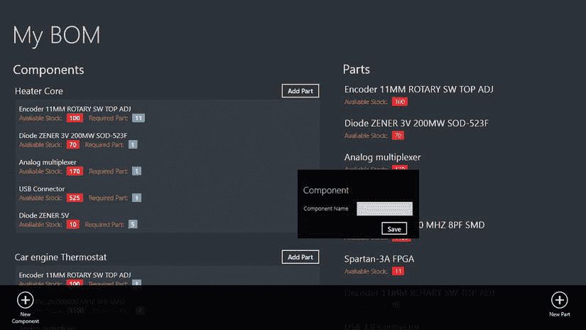
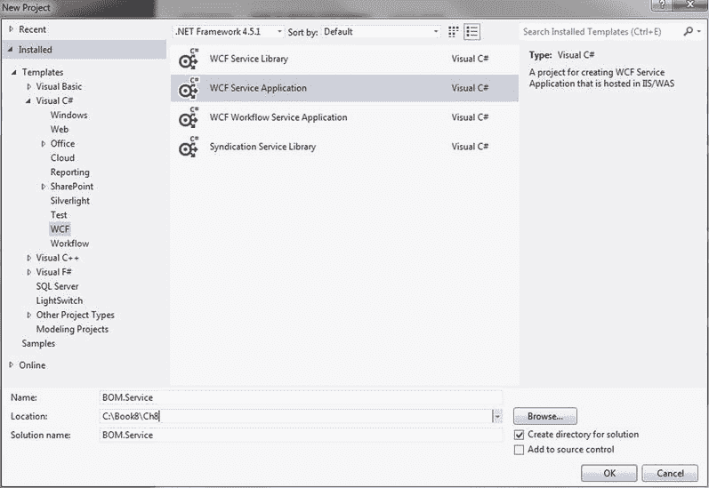
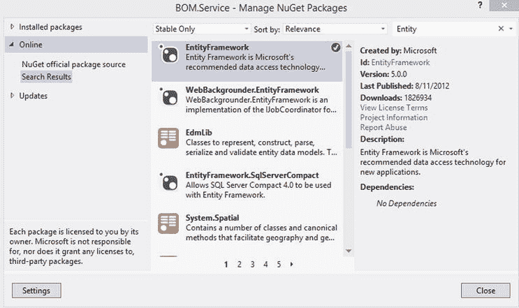
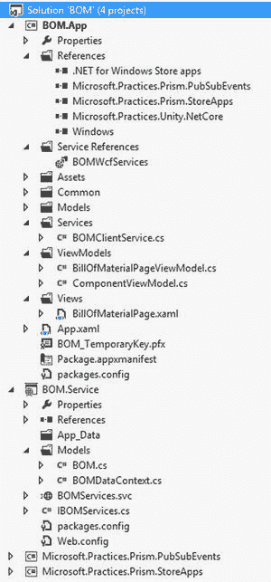
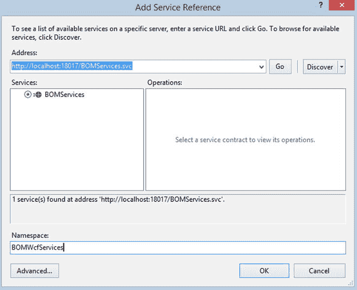
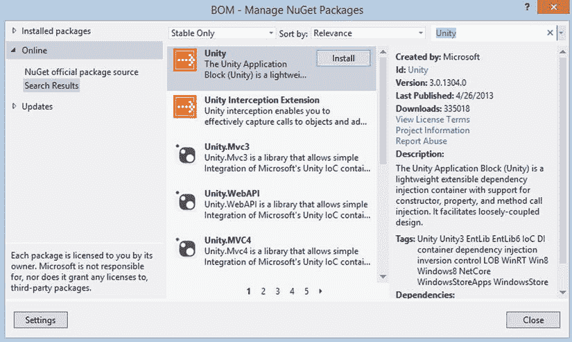
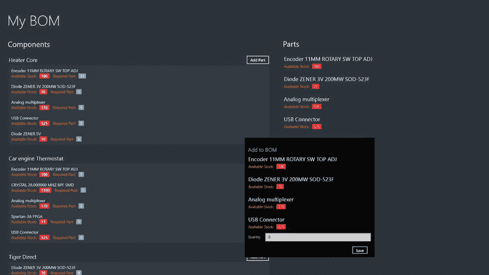

# 八、WCF 服务

Abstract

在第 7 章中，我们学习了首先使用实体框架代码，使用 ASP.NET Web API 建立连接到 SQL Server 的服务基础设施。接下来，在本章中，我们将学习使用 Windows 通信框架(WCF)来构建服务基础架构。

在第 7 章中，我们学习了使用 ASP.NET Web API 构建服务基础设施，首先使用实体框架代码连接到 SQL Server。接下来，在本章中，我们将学习使用 Windows 通信框架(WCF)来构建服务基础架构。

本章首先简要介绍为 WinRT 构建业务应用，然后介绍 Prism for Windows Runtime，它用于实现模型-视图-视图模型(MVVM)模式，通过一种松散耦合的通信机制(称为 PubSub 事件和应用生命周期管理)进行导航。我们通过使用 XAML/C#、Prism 和实体框架代码开发物料清单(BOM) Windows 8 应用来学习这些概念，首先以 WCF 作为服务层。

## WinRT 的商业应用

WinRT 的业务应用可以大致分为两种不同类型的应用:企业对消费者(B2C)和业务线(LOB)应用。B2C 应用是这样一种应用，它允许公司外部的人(主要是消费者)访问公司的产品和服务，如预订系统、实用程序等，让我们管理和支付账单。LOB 应用通常有助于精确的客户交易或业务需求，它们可以是消费者服务应用、企业 CRM、发票系统或库存系统。

## 棱镜概述

Prism for Windows Runtime 是一套使用 XAML 和 C#在 WinRT 上构建业务应用的指导原则。Prism 基于各种架构目标，如松散耦合、关注点分离、可维护性、可测试性以及利用 MVVM 的 WinRT 平台特性。Prism for WinRT 提供了几个可下载、可重用的基础设施类库。

Note

Prism for Windows 8 app 可以从 [`http://prismwindowsruntime.codeplex.com/`](http://prismwindowsruntime.codeplex.com/) 下载。

我们简要看到的第一个库是`Microsoft.Practices.Prism.StoreApps`。该库提供以下功能:

*   通过包含视图和视图模型的基类来支持 MVVM。
*   导航。
*   应用状态管理。
*   指挥支持是 MVVM 模式的一部分。
*   验证。
*   支持 WinRT 平台特性，如搜索/设置符和弹出按钮。

接下来我们将看到`Microsoft.Practices.Prism.PubSubEvents`，一个封装了 PubSub 功能的库。Prism 中的`Pubsub`事件基于`EventAggregator`模式，这有助于实现视图模型和客户端服务之间的松耦合通信。这种模式的总体思想是，当系统内的组件想要相互通信时，它们将松散耦合，而不是通过类型或生存期来耦合。这是通过在发布者和订阅者之间放置一个中间人(即`EventAggregator`)来实现的；他们不会直接依赖对方，而是会依赖中间人。`EventAggregator`是事件对象的容器，这些事件对象是完成大部分工作的对象。事件对象由订阅者订阅，并由发布者发布。

### Prism 入门

我们使用微软模式与实践的 Prism for Windows 运行时指南。Microsoft Patterns & Practices 是一个为 Microsoft 开发技术提供最佳实践和设计模式指导的组织。他们的一些受欢迎的产品是企业库和 Prism 4。这些指导方针帮助我们编写易于维护、扩展和测试的业务应用。

Microsoft 模式和实践项目网站包括许多展示最佳实践的项目和示例应用。你可以在 [`http://pnp.azurewebsites.net/en-us/projects.htm`](http://pnp.azurewebsites.net/en-us/projects.htm) 找到它。

## 构建物料清单 Windows 8 应用

物料清单(BOM)用于列出构建组件所需的部件或项目，可以是工业设备、软件或物理建筑材料，方法是将每个项目与组件相关联。BOM 应用有助于为制造、生产和即时环境维护集中和准确的项目记录。使用这种应用有助于改善材料管理、控制库存和降低制造成本。

我们将使用 XAML 和 C#创建 BOM 应用(见图 [8-1](#Fig1) ),以 SQL Server 作为数据库，并显示组件及其相应的零件。使用此应用，用户可以添加新的组件和零件，也可以将一个或多个零件与组件相关联。

图 8-1。

Bill of Material app displaying components and parts

我们还使用 WCF 为 BOM 应用和 SQL Server 之间的数据交互创建了一个服务层。就像第 6 章中的 Party Planner 应用一样，这里我们也首先使用实体框架代码作为数据访问层。

### 入门指南

首先，让我们创建一个新的 Windows 应用商店空白应用(XAML)项目，并将其命名为`BOM.App`。我们添加了作为 Prism for Windows 运行时下载的一部分的`Microsoft.Practices.Prism.StoreApps`和`Microsoft.Practices.Prism.PubSubEvents`项目，并将它们作为项目引用添加到`BOM.App`中。

接下来，我们向解决方案添加一个新的 WCF 服务应用，如图 [8-2](#Fig2) 所示，并将其命名为`BOM.Services`。

图 8-2。

Visual Studio template for adding a new WCF Service Application

要启用实体框架，使用 NuGet 包引用`BOM.Services`项目中的库，如图 [8-3](#Fig3) 所示。

图 8-3。

Adding a reference to Entity Framework using NuGet package

下一步是在`BOM.Services`项目中创建一个名为`Models`的文件夹，并向其中添加一个名为`BillOfMaterial.cs`的文件。BOM 解决方案项目结构将如图 [8-4](#Fig4) 所示。

图 8-4。

BOM project structure

保存三个 POCO 类，代表三个数据库表:Component、Part 和 BillOfMaterial。

*   组件:存储组件详细信息。
*   零件:存储零件详细信息。
*   BillOfMaterial:存储 BOM 信息，如 ComponentID 和 PartID。

这些类是非常简单的实体类，不依赖于实体框架。这些类的属性表示数据库表的列。我们用`DataContract`属性修饰类，用`DataMember`(见清单 8-1)属性修饰类中的属性，以序列化数据并将其传输到 WCF 客户端。

清单 8-1。BOM 实体类别

`using System;`

`using System.Collections.Generic;`

`using System.ComponentModel.DataAnnotations;`

`using System.ComponentModel.DataAnnotations.Schema;`

`using System.Linq;`

`using System.Runtime.Serialization;`

`using System.Web;`

`namespace BOM.Service.Models`

`{`

`[DataContract(IsReference = true)]`

`public class Part`

`{`

`[Key]`

`[DataMember]`

`public int PartID { get; set; }`

`[DataMember]`

`public string PartName { get; set; }`

`[DataMember]`

`public int StockCount { get; set; }`

`[DataMember]`

`public virtual ICollection<BillOfMaterial> BOMParts { get; set; }`

`}`

`[DataContract(IsReference = true)]`

`public class Component`

`{`

`[Key]`

`[DataMember]`

`public int ComponentID { get; set; }`

`[DataMember]`

`public string ComponentName { get; set; }`

`[DataMember]`

`public virtual ICollection<BillOfMaterial> BOMComponents { get; set; }`

`}`

`[DataContract(IsReference = true)]`

`public class BillOfMaterial`

`{`

`[Key]`

`[DataMember]`

`public int BOMID { get; set; }`

`[DataMember]`

`public int ComponentID { get; set; }`

`[DataMember]`

`public int PartID { get; set; }`

`[DataMember]`

`public int Quantity { get; set; }`

`[ForeignKey("PartID"), Column(Order = 0)]`

`[DataMember]`

`public virtual Part BOMPart { get; set; }`

`[ForeignKey("ComponentID"), Column(Order = 1)]`

`[DataMember]`

`public virtual Component BOMComponent { get; set; }`

`}`

`}`

### 添加数据上下文

我们在`Models`文件夹中创建定制的数据库上下文类`BOMDataContext`，如清单 8-2 所示。这个类是从实体框架基础类型`DbContext`中派生出来的。`DbContext`使用实体类模式自动生成数据库，还表示与数据库的会话，并允许其查询数据库。上下文包含属性`DbSet`，它代表了我们模型中的 POCO 类型类。我们还覆盖了`OnModelCreating`方法来设置必需的字段和模型之间的关系。

清单 8-2。类别具有代表模型的属性

`using System;`

`using System.Collections.Generic;`

`using System.Configuration;`

`using System.Data.Entity;`

`using System.Linq;`

`using System.Web;`

`namespace BOM.Service.Models`

`{`

`public class BOMDataContext : DbContext`

`{`

`public BOMDataContext()`

`{`

`Configuration.AutoDetectChangesEnabled = true;`

`Configuration.LazyLoadingEnabled = true;`

`Configuration.ProxyCreationEnabled = true;`

`Configuration.ValidateOnSaveEnabled = true;`

`}`

`protected override void Dispose(bool disposing)`

`{`

`Configuration.LazyLoadingEnabled = false;`

`base.Dispose(disposing);`

`}`

`public DbSet<Part> Parts { get; set; }`

`public DbSet<Component> Components { get; set; }`

`public DbSet<BillOfMaterial> BillOfMaterials { get; set; }`

`protected override void OnModelCreating(DbModelBuilder modelBuilder)`

`{`

`modelBuilder.Entity<Part>()`

`.Property(s => s.PartName)`

`.IsRequired();`

`modelBuilder.Entity<Component>()`

`.Property(s => s.ComponentName)`

`.IsRequired();`

`modelBuilder.Entity<Part>()`

`.HasMany<BillOfMaterial>(e => e.BOMParts);`

`modelBuilder.Entity<Component>()`

`.HasMany<BillOfMaterial>(e => e.BOMComponents);`

`modelBuilder.Entity<BillOfMaterial>()`

`.Property(s => s.ComponentID)`

`.IsRequired();`

`modelBuilder.Entity<BillOfMaterial>()`

`.Property(s => s.PartID)`

`.IsRequired();`

`}`

`}`

`}`

### 添加 Web 服务

有了模型和数据上下文，我们现在添加一个 WCF Web 服务`BOMServices.svc`来处理来自应用的 HTTP 请求。这个 WCF 服务有提供基本 CRUD 操作的必要方法，如清单 8-3 所示。

清单 8-3。定义 BOM WCF 服务的服务合同的 WCF 合同接口

`using System;`

`using System.Collections.Generic;`

`using System.Linq;`

`using System.Runtime.Serialization;`

`using System.ServiceModel;`

`using System.ServiceModel.Web;`

`using System.Text;`

`using BOM.Service.Models;`

`namespace BOM.Service`

`{`

`[ServiceContract]`

`public interface IBOMServices`

`{`

`[OperationContract]`

`IList<Part> GetAllParts();`

`[OperationContract]`

`IList<Component> GetAllComponents();`

`[OperationContract]`

`void AddComponent(Component component);`

`[OperationContract]`

`void DeleteComponent(Component component);`

`[OperationContract]`

`void AddPart(Part part);`

`[OperationContract]`

`void DeletePart(Part part);`

`[OperationContract]`

`void AddBOM(BillOfMaterial bom);`

`[OperationContract]`

`void RemoveBOM(BillOfMaterial bom);`

`}`

`}`

首先，我们使用标记有`ServiceContractAttribute`和`OperationContractAttribute`属性的接口来定义服务契约。让我们通过实现如清单 8-4 所示的服务契约来详细看看 web 方法。

*   GetAllComponents:该方法使用实体框架的`Include`方法从组件表中检索所有组件以及相应的导航属性，如零件和 BOM。
*   GetAllParts:检索所有零件以及相应的 BOM。
*   AddComponent:向组件表中添加一行。
*   DeleteComponent:从表中删除一个组件以及该组件在 BOM 表中的所有对应行。
*   AddPart:向零件表中添加一行。
*   删除零件:从零件表中删除一行，同时从 BOM 表中删除该零件的所有相应行。
*   AddBOM:该方法首先检查是否存在具有相似 ComponentID 和 PartID 的匹配 BOM。如果存在，则更新该 BOM 的数量；否则，它将向 BOM 表中添加一个新行。
*   RemoveBOM:从 BOM 表中删除一行。

清单 8-4。实现 BOMService 方法

`using System;`

`using System.Collections.Generic;`

`using System.Linq;`

`using System.Runtime.Serialization;`

`using System.ServiceModel;`

`using System.ServiceModel.Web;`

`using System.Text;`

`using BOM.Service.Models;`

`namespace BOM.Service`

`{`

`public class BOMServices : IBOMServices`

`{`

`public IList<Part> GetAllParts()`

`{`

`using (var ctx = new BOMDataContext())`

`{`

`ctx.Configuration.ProxyCreationEnabled = false;`

`var parts = ctx.Parts`

`.Include("BOMParts")`

`.ToList();`

`ctx.Configuration.ProxyCreationEnabled = true;`

`return parts;`

`}`

`}`

`public IList<Component> GetAllComponents()`

`{`

`using (var ctx = new BOMDataContext())`

`{`

`ctx.Configuration.ProxyCreationEnabled = false;`

`var components = ctx.Components`

`.Include("BOMComponents")`

`.Include("BOMComponents.BOMPart")`

`.ToList();`

`ctx.Configuration.ProxyCreationEnabled = true;`

`return components;`

`}`

`}`

`public void AddComponent(Component component)`

`{`

`using (var ctx = new BOMDataContext())`

`{`

`ctx.Components.Add(component);`

`ctx.SaveChanges();`

`}`

`}`

`public void DeleteComponent(Component component)`

`{`

`using (var ctx = new BOMDataContext())`

`{`

`foreach (var bom in component.BOMComponents)`

`{`

`ctx.BillOfMaterials.Remove(bom);`

`}`

`ctx.Components.Remove(component);`

`ctx.SaveChanges();`

`}`

`}`

`public void AddPart(Part part)`

`{`

`using (var ctx = new BOMDataContext())`

`{`

`ctx.Parts.Add(part);`

`ctx.SaveChanges();`

`}`

`}`

`public void DeletePart(Part part)`

`{`

`using (var ctx = new BOMDataContext())`

`{`

`foreach (var bom in part.BOMParts)`

`{`

`ctx.BillOfMaterials.Remove(bom);`

`}`

`ctx.Parts.Remove(part);`

`ctx.SaveChanges();`

`}`

`}`

`public void AddBOM(BillOfMaterial bom)`

`{`

`using (var ctx = new BOMDataContext())`

`{`

`var bomv = ctx.BillOfMaterials.Where(b => b.ComponentID == bom.ComponentID && b.PartID == bom.PartID);`

`if (bomv.Any())`

`{`

`var oldBOM = bomv.First();`

`oldBOM.Quantity = oldBOM.Quantity + bom.Quantity;`

`}`

`else`

`{`

`ctx.BillOfMaterials.Add(bom);`

`}`

`ctx.SaveChanges();`

`}`

`}`

`public void RemoveBOM(BillOfMaterial bom)`

`{`

`using (var ctx = new BOMDataContext())`

`{`

`ctx.BillOfMaterials.Remove(bom);`

`ctx.SaveChanges();`

`}`

`}`

`}`

`}`

当第一次调用清单 8-4 中的任何一个方法时，实体框架代码首先使用一组约定来确定模式，并创建数据库和必要的表以及表之间的引用完整性。它使用来自`web.config`文件的数据库连接信息。创建完成后，我们就可以在 VS.NET SQL Server 对象资源管理器(Ctrl + \，Ctrl + S)中看到数据库了。

## 消费 WCF 服务

消耗物料清单。BOM 中的服务 WCF 服务。App 非常简单，就像在项目中添加一个 DLL 引用。要使用服务，我们首先必须添加一个服务引用，这可以通过右键单击 BOM 中的引用来完成。解决方案资源管理器的“应用项目”部分，并选择“添加服务引用”。这将显示如图 [8-5](#Fig5) 所示的添加服务参考页面。为 WCF 服务指定一个逻辑名称空间 BOMWcfServices，然后选择 OK。这个动作生成一个客户端代理类的托管源代码文件，我们将在客户端服务类`BOMClientServices`中使用它(见清单 8-5)。

图 8-5。

Creating Proxy class using Visual Studio Add Service Reference page

清单 8-5。BOMClientService 封装了 WCF 服务方法

`using System;`

`using System.Collections.ObjectModel;`

`using System.Threading.Tasks;`

`using BOM.BOMWcfServices;`

`using Microsoft.Practices.Prism.PubSubEvents;`

`using BOM.Models;`

`namespace BOM.Services`

`{`

`public interface IBOMClientService`

`{`

`Task<ObservableCollection<Component>> GetComponentsAsync();`

`Task<ObservableCollection<Part>> GetAllPartsAsync();`

`void AddComponentAsync(Component component);`

`void AddPartAsync(Part part);`

`void AddBOMAsync(BillOfMaterial bom);`

`}`

`public class BOMClientService : IBOMClientService`

`{`

`private IEventAggregator _eventAggregator;`

`public BOMClientService(IEventAggregator eventAggregator)`

`{`

`_eventAggregator = eventAggregator;`

`}`

`public Task<ObservableCollection<Component>> GetComponentsAsync()`

`{`

`var client= new BOMServicesClient();`

`return client.GetAllComponentsAsync();`

`}`

`public Task<ObservableCollection<Part>> GetAllPartsAsync()`

`{`

`var client = new BOMServicesClient();`

`return client.GetAllPartsAsync();`

`}`

`public async void AddComponentAsync(Component component)`

`{`

`var client = new BOMServicesClient();`

`await client.AddComponentAsync(component);`

`_eventAggregator.GetEvent<ComponentSaveEvent>().Publish(null);`

`}`

`public async void AddPartAsync(Part part)`

`{`

`var client = new BOMServicesClient();`

`await client.AddPartAsync(part);`

`_eventAggregator.GetEvent<PartSaveEvent>().Publish(null);`

`}`

`public async void AddBOMAsync(BillOfMaterial bom)`

`{`

`var client = new BOMServicesClient();`

`await client.AddBOMAsync(bom);`

`_eventAggregator.GetEvent<ComponentSaveEvent>().Publish(null);`

`}`

`}`

`}`

`BOMClientServices`是一个客户端服务类，通过依赖注入注入到 ViewModel 中。这个类封装了 BOM 的创建和操作。服务的 WCF 服务，并使用`EventAggregator`服务来发布事件，这些事件在 ViewModel 中处理。

## 在 Windows 8 应用中集成 Prism

将 Prism 集成到 BOM 中的第一步。App 项目是添加对库`Microsoft.Practices.Prism.StoreApps`和`Microsoft.Practices.Prism.PubSubEvent`的引用。接下来，我们需要更新`App.Xaml App`类。`App`类被更新为从`Microsoft.Practices.Prism.StoreApps`库中的`MvvmAppBase`类派生而来，以获得对 MVVM 和 Windows 应用商店应用所需的核心服务的支持。

然后，我们在`App`类中覆盖 MVVMAppBase 的`OnLaunchApplication`抽象方法，并添加起始页导航代码。因为 BOM 应用只有一个页面，`BillOfMaterialPage.xaml`，我们添加代码来导航到那个页面，如清单 8-6 所示。

清单 8-6。与 Prism 集成的 App 类

`using System;`

`using System.Globalization;`

`using BOM.Services;`

`using Microsoft.Practices.Prism.PubSubEvents;`

`using Microsoft.Practices.Prism.StoreApps;`

`using Microsoft.Practices.Prism.StoreApps.Interfaces;`

`using Microsoft.Practices.Unity;`

`using Windows.ApplicationModel;`

`using Windows.ApplicationModel.Activation;`

`using Windows.ApplicationModel.Resources;`

`using Windows.UI.Notifications;`

`using Windows.UI.Xaml;`

`using Windows.UI.Xaml.Controls;`

`namespace BOM`

`{`

`sealed partial class App : MvvmAppBase`

`{`

`// Create the singleton container that will be used for type resolution in the app`

`private readonly IUnityContainer _container = new UnityContainer();`

`//Bootstrap: App singleton service declarations`

`private IEventAggregator _eventAggregator;`

`public App()`

`{`

`InitializeComponent();`

`Suspending += OnSuspending;`

`}`

`protected override void OnLaunchApplication(LaunchActivatedEventArgs args)`

`{`

`NavigationService.Navigate("BillOfMaterial", null);`

`}`

`protected override void OnInitialize(IActivatedEventArgs args)`

`{`

`_eventAggregator = new EventAggregator();`

`_container.RegisterInstance(NavigationService);`

`_container.RegisterInstance(_eventAggregator);`

`_container.RegisterType<IBOMClientService, BOMClientService>(new ContainerControlledLifetimeManager());`

`ViewModelLocator.SetDefaultViewTypeToViewModelTypeResolver((viewType) =>`

`{`

`var viewModelTypeName = string.Format(CultureInfo.InvariantCulture`

`, "BOM.ViewModels.{0}ViewModel"`

`, viewType.Name);`

`var viewModelType = Type.GetType(viewModelTypeName);`

`return viewModelType;`

`});`

`}`

`private void OnSuspending(object sender, SuspendingEventArgs e)`

`{`

`SuspendingDeferral deferral = e.SuspendingOperation.GetDeferral();`

`deferral.Complete();`

`}`

`protected override object Resolve(Type type)`

`{`

`return _container.Resolve(type);`

`}`

`}`

`}`

接下来，我们使用 NuGet 包将对`Unity`库的引用添加到项目中，如图 [8-6](#Fig6) 所示。Unity 应用块(Unity)是一个轻量级可扩展依赖注入容器，支持构造函数、属性和方法调用注入。使用 Unity 有助于我们使代码更易于维护、扩展和测试。

图 8-6。

Adding reference to Unity using NuGet package

现在，有了 Unity 库，我们在`App`类中创建一个`UnityContainer`类的实例(见清单 8-5)，并使用 Unity 依赖注入容器来注册和解析类型和实例。

最后，我们覆盖了`App`类中的`OnInitialize`方法，并为 Unity 容器注册了类型。这里我们注册了以下类型。

*   NavigationService:通过在应用中用一个视图替换另一个视图来帮助在视图之间导航。
*   IEventAggregator:`EventAggregator`类作为容器中的服务提供，可以通过`IEventAggregator`接口检索。事件聚合器负责定位或构建事件，并在系统中保存事件的集合。
*   BOMClientService:如前所述，`BOMClientService`类(见清单 8-5)是容器中的客户端服务，可以通过`IBOMService`检索。该服务公开了一些 BOM。如图 [8-5](#Fig5) 所示，服务 WCF 方法通过使用代理类与 BOM WCF 服务进行通信，我们通过向 WCF 服务添加服务引用来生成代理类。

## 设计 BOM 应用用户界面

BOM 应用是一个单页(`BillOfMaterialPage.xaml`)用户界面，分为两个部分。app 左侧会列出所有组件及其对应的零件，如图 [8-1](#Fig1) 所示。该部分托管一个绑定到`ComponentViewModel`集合的 ListView 控件。右侧部分列出了所有要查找的零件。除了这两个部分，我们在底部还有一个应用栏，其中有两个按钮，用于添加新的组件和部件。`BillOfMaterialPage.xaml`还有三个弹出控件，用于保存添加组件、零件和 BOM 的界面(见清单 8-7)。

清单 8-7。带有列表视图、弹出控件和应用栏按钮的 BillOfMaterialPage.xaml

`<Infrastructure:VisualStateAwarePage`

`x:Name="pageRoot"`

`x:Class="BOM.Views.BillOfMaterialPage"`

`DataContext="{Binding DefaultViewModel, RelativeSource={RelativeSource Self}}"`

`xmlns="`[`http: //schemas.microsoft.com/winfx/2006/xaml/presentation`](http://schemas.microsoft.com/winfx/2006/xaml/presentation)T2】

`xmlns:x="`[`http: //schemas.microsoft.com/winfx/2006/xaml`](http://schemas.microsoft.com/winfx/2006/xaml)T2】

`xmlns:local="using:BOM.Views"`

`xmlns:Infrastructure="using:Microsoft.Practices.Prism.StoreApps"`

`xmlns:d="`[`http: //schemas.microsoft.com/expression/blend/2008`](http://schemas.microsoft.com/expression/blend/2008)T2】

`xmlns:mc="`[`http://schemas.openxmlformats.org/markup-compatibility/2006`](http://schemas.openxmlformats.org/markup-compatibility/2006)T2】

`Infrastructure:ViewModelLocator.AutoWireViewModel="true"`

`mc:Ignorable="d">`

`<Page.Resources>`

`<x:String x:Key="AppName">Bill of Material</x:String>`

`<!--Bill of Material Data Template-->`

`<DataTemplate x:Key="BOMDataTemplate">`

`<StackPanel>`

`<TextBlock`

`Text="{Binding BOMPart.PartName}"/>`

`<StackPanel`

`Orientation="Horizontal">`

`<TextBlock`

`Text="Avaliable Stock: "/>`

`<Border>`

`<TextBlock`

`Text="{Binding BOMPart.StockCount}"/>`

`</Border>`

`<TextBlock`

`Text=" Required Part: "/>`

`<Border>`

`<TextBlock`

`Text="{Binding Quantity}"/>`

`</Border>`

`</StackPanel>`

`</StackPanel>`

`</DataTemplate>`

`<!--Component Data Template-->`

`<DataTemplate x:Key="ComponentDataTemplate">`

`<StackPanel>`

`<Grid>`

`<Grid.ColumnDefinitions>`

`<ColumnDefinition/>`

`<ColumnDefinition/>`

`</Grid.ColumnDefinitions>`

`<StackPanel`

`Orientation="Horizontal">`

`<TextBlock`

`Text="{Binding ComponentName}"/>`

`</StackPanel>`

`<StackPanel`

`Grid.Column="1"`

`Orientation="Horizontal">`

`<Button`

`Content="Add Part"`

`Command="{Binding AddPartsCommand, Mode=OneWay}"/>`

`</StackPanel>`

`</Grid>`

`<!--ListBox to display Parts of the Componement-->`

`<ListBox`

`ItemsSource="{Binding BOMComponents}"`

`ItemTemplate="{StaticResource BOMDataTemplate}"/>`

`</StackPanel>`

`</DataTemplate>`

`<!--Part Data Template-->`

`<DataTemplate x:Key="PartDataTemplate">`

`<StackPanel>`

`<TextBlock`

`Text="{Binding PartName}"/>`

`<StackPanel`

`Orientation="Horizontal">`

`<TextBlock`

`Text="Avaliable Stock: "/>`

`<Border>`

`<TextBlock`

`Text="{Binding StockCount}"/>`

`</Border>`

`</StackPanel>`

`</StackPanel>`

`</DataTemplate>`

`</Page.Resources>`

`<Infrastructure:VisualStateAwarePage.BottomAppBar>`

`<AppBar>`

`<Grid>`

`<Grid.ColumnDefinitions>`

`<ColumnDefinition/>`

`<ColumnDefinition/>`

`</Grid.ColumnDefinitions>`

`<StackPanel Orientation="Horizontal">`

`<!-- Button to add component-->`

`<Button x:Name="AddComponent"`

`Command="{Binding OpenComponentCommand, Mode=OneWay}"`

`Style="{StaticResource AddComponentAppBarButtonStyle}"/>`

`</StackPanel>`

`<StackPanel Grid.Column="1">`

`<!-- Button to add part-->`

`<Button x:Name="AddPart"`

`Command="{Binding OpenPartCommand, Mode=OneWay}"`

`Style="{StaticResource AddPartAppBarButtonStyle}"/>`

`</StackPanel>`

`</Grid>`

`</AppBar>`

`</Infrastructure:VisualStateAwarePage.BottomAppBar>`

`<Grid`

`Style="{StaticResource LayoutRootStyle}">`

`<Grid.ColumnDefinitions>`

`<ColumnDefinition Width="769*"/>`

`<ColumnDefinition Width="597*"/>`

`</Grid.ColumnDefinitions>`

`<Grid.RowDefinitions>`

`<RowDefinition Height="140"/>`

`<RowDefinition Height="12*"/>`

`<RowDefinition Height="145*"/>`

`</Grid.RowDefinitions>`

`<!-- Popup control to get Component information to add -->`

`<Popup x:Name="AddComponentPopup"`

`x:Uid="AddComponentPopup"`

`AutomationProperties.AutomationId="AddComponentPopup"`

`IsLightDismissEnabled="True"`

`IsOpen="{Binding IsAddComponentPopupOpened, Mode=TwoWay}"`

`Grid.RowSpan="3"`

`Grid.ColumnSpan="2">`

`<Border>`

`<Grid>`

`<Grid.RowDefinitions>`

`<RowDefinition Height="Auto" />`

`<RowDefinition Height="Auto" />`

`<RowDefinition Height="38"/>`

`</Grid.RowDefinitions>`

`<Grid.ColumnDefinitions>`

`<ColumnDefinition Width="Auto" />`

`<ColumnDefinition Width="*" />`

`</Grid.ColumnDefinitions>`

`<TextBlock Grid.Column="0"`

`Grid.Row="0"`

`Text="Component"`

`Grid.ColumnSpan="2"`

`Style="{StaticResource HeaderTextStyle}"/>`

`<TextBlock`

`Grid.Column="0"`

`Grid.Row="1"`

`Text="Component Name"`

`Style="{StaticResource ResourceKey=SubheaderTextStyle}" />`

`<TextBox`

`Grid.Column="1"`

`Grid.Row="1" x:Name="txtComponentName"`

`Text="{Binding ComponentName, Mode=TwoWay}"/>`

`<Button`

`Command="{Binding AddComponentCommand, Mode=OneWay}"`

`Content="Save"`

`Grid.Row="2"`

`Grid.Column="1"/>`

`</Grid>`

`</Border>`

`</Popup>`

`<!-- Popup control to get Part information to add -->`

`<Popup x:Name="AddPartPopup"`

`x:Uid="AddPartPopup"`

`AutomationProperties.AutomationId="AddPartPopup"`

`IsLightDismissEnabled="True"`

`IsOpen="{Binding IsAddPartPopupOpened, Mode=TwoWay}" Grid.RowSpan="3" Grid.ColumnSpan="2">`

`<Border>`

`<Grid x:Name="addPart">`

`<Grid.RowDefinitions>`

`<RowDefinition Height="Auto" />`

`<RowDefinition Height="Auto" />`

`<RowDefinition Height="Auto" />`

`<RowDefinition Height="38"/>`

`</Grid.RowDefinitions>`

`<Grid.ColumnDefinitions>`

`<ColumnDefinition Width="Auto" />`

`<ColumnDefinition Width="*" />`

`</Grid.ColumnDefinitions>`

`<TextBlock`

`Grid.Column="0"`

`Grid.Row="0"`

`Text="Part"`

`Grid.ColumnSpan="2"`

`Style="{StaticResource HeaderTextStyle}" />`

`<TextBlock`

`Grid.Column="0"`

`Grid.Row="1"`

`Text="Part Name"`

`Style="{StaticResource ResourceKey=SubheaderTextStyle}" />`

`<TextBox`

`Grid.Column="1"`

`Grid.Row="1"`

`Text="{Binding PartName, Mode=TwoWay}"/>`

`<TextBlock`

`Grid.Column="0"`

`Grid.Row="2"`

`Text="Quantity"`

`Style="{StaticResource ResourceKey=SubheaderTextStyle}"/>`

`<TextBox`

`Grid.Column="1"`

`Grid.Row="2"`

`Text="{Binding StockCount, Mode=TwoWay}"/>`

`<Button`

`Command="{Binding AddPartCommand, Mode=OneWay}"`

`Content="Save"`

`Grid.Row="3"`

`Grid.Column="1"/>`

`</Grid>`

`</Border>`

`</Popup>`

`<!-- Popup control to select a Part to add it to Component as BOM -->`

`<Popup x:Name="AddBOMPopup"`

`x:Uid="AddBOMPopup"`

`AutomationProperties.AutomationId="AddBOMPopup"`

`IsLightDismissEnabled="True"`

`IsOpen="{Binding IsShowBOMPopupOpened, Mode=TwoWay}"`

`Grid.RowSpan="3"`

`Grid.ColumnSpan="2">`

`<Border>`

`<Grid>`

`<Grid.RowDefinitions>`

`<RowDefinition Height="Auto" />`

`<RowDefinition Height="Auto" />`

`<RowDefinition Height="Auto" />`

`<RowDefinition Height="38"/>`

`</Grid.RowDefinitions>`

`<Grid.ColumnDefinitions>`

`<ColumnDefinition Width="Auto" />`

`<ColumnDefinition Width="*" />`

`</Grid.ColumnDefinitions>`

`<TextBlock`

`Grid.Column="0"`

`Grid.Row="0"`

`Text="Add to BOM"`

`Grid.ColumnSpan="2"`

`Style="{StaticResource HeaderTextStyle}" />`

`<ListView`

`Grid.Row="1"`

`ItemsSource="{Binding Parts}"`

`SelectedItem="{Binding SelectedPart, Mode=TwoWay}"`

`ItemTemplate="{StaticResource PartDataTemplate}"`

`Grid.Column="0"`

`Grid.ColumnSpan="2">`

`<TextBlock`

`Grid.Column="0"`

`Grid.Row="2"`

`Text="Quantity"`

`Style="{StaticResource ResourceKey=SubheaderTextStyle}"/>`

`<TextBox`

`Grid.Column="1"`

`Grid.Row="2"`

`Text="{Binding BOMQuantity, Mode=TwoWay}"/>`

`<Button`

`Command="{Binding AddBOMCommand, Mode=OneWay}"`

`Content="Save"`

`Grid.Row="3"`

`Grid.Column="1"/>`

`</Grid>`

`</Border>`

`</Popup>`

`<Grid Grid.ColumnSpan="2">`

`<Grid.ColumnDefinitions>`

`<ColumnDefinition Width="Auto"/>`

`<ColumnDefinition Width="*"/>`

`</Grid.ColumnDefinitions>`

`<TextBlock`

`Grid.Column="1"`

`Text="{Binding HeaderLabel}"`

`Style="{StaticResource PageHeaderTextStyle}"/>`

`</Grid>`

`<!--ListView Control to disply the Components-->`

`<ListView`

`Grid.Row="2"`

`ItemsSource="{Binding Components}"`

`ItemTemplate="{StaticResource ComponentDataTemplate}"/>`

`<TextBlock`

`Grid.Row="1"`

`Text="Components" />`

`<TextBlock`

`Grid.Row="1"`

`Text="Parts"`

`Grid.Column="1"/>`

`<!--ListView Control to disply the Parts-->`

`<ListView`

`Grid.Row="2"`

`ItemsSource="{Binding Parts}"`

`ItemTemplate="{StaticResource PartDataTemplate}"`

`Grid.Column="1"/>`

`</Grid>`

`</Infrastructure:VisualStateAwarePage>`

Note

为了简化解释和提高可读性，我们有意省略了本章中与控件的样式和定位相关的大部分 XAML 代码。您可以从 APress 网站下载的源代码具有完整的实现。

## 视图模型

炸弹。App 有两个视图模型:`BillOfMaterialPageViewModel`和`ComponentViewModel`，驻留在`ViewModel`文件夹中。使用清单 8-7 所示的`AutoWireViewModel`附加属性将`BillOfMaterialPageViewModel`绑定到`BillOfMaterialPage.xaml`。`AutoWireViewModel` attached 属性告诉 Prism 的`ViewModelLocator`对象创建一个对应于该视图的视图模型实例，并将其设置到视图的`DataContext`属性中。`ViewModelLocator`对象使用默认约定，在`ViewModels`名称空间中查找名称以视图名称开始并以“ViewModel”结束的类型。

### BillOfMaterialPageViewModel

`BillOfMaterialPageViewModel`(见清单 8-8)是从`Microsoft.Practices.Prism.StoreApps`库的`ViewModel`类派生的，以获得对 MVVM 的支持。在这个视图模型中，`NavigationService`、`EventAggregator`和`BOMService`是通过构造函数插入的。同样在构造函数中，我们添加了订阅`EventAggregator`事件的代码。除此之外，ViewModel 还公开了完成各种功能的方法和命令，如显示组件和部件、向数据库添加新的组件和部件，以及将部件与组件相关联。

清单 8-8。BillOfMaterialPageViewModel 类

`using System;`

`using System.Collections.Generic;`

`using System.Collections.ObjectModel;`

`using System.Linq;`

`using System.Text;`

`using System.Threading.Tasks;`

`using System.Windows.Input;`

`using BOM.BOMWcfServices;`

`using BOM.Services;`

`using Microsoft.Practices.Prism.StoreApps;`

`using Microsoft.Practices.Prism.StoreApps.Interfaces;`

`using Microsoft.Practices.Prism.PubSubEvents;`

`using BOM.Models;`

`namespace BOM.ViewModels`

`{`

`public class BillOfMaterialPageViewModel : ViewModel`

`{`

`private readonly INavigationService _navigationService;`

`private readonly IBOMService _bomservice;`

`private IEventAggregator _eventAggregator;`

`private string _headerLabel;`

`private bool _isAddComponentPopupOpened;`

`private bool _isAddPartPopupOpened;`

`private bool _isShowBOMPopupOpened;`

`private int _selectedComponentID;`

`private Part _selectedPart;`

`private string _componentName;`

`private string _partName;`

`private int _stockCount = 0;`

`private int _bomQuantity = 0;`

`private ObservableCollection<ComponentViewModel> _components;`

`private ReadOnlyCollection<Part> _parts;`

`public ICommand OpenComponentCommand { get; private set; }`

`public ICommand OpenPartCommand { get; private set; }`

`public ICommand AddComponentCommand { get; private set; }`

`public ICommand AddPartCommand { get; private set; }`

`public ICommand AddBOMCommand { get; private set; }`

`public BillOfMaterialPageViewModel(INavigationService navigationService`

`,IEventAggregator eventAggregator`

`, IBOMService bomservice)`

`{`

`_navigationService = navigationService;`

`_eventAggregator = eventAggregator;`

`_bomservice = bomservice;`

`OpenComponentCommand = new DelegateCommand(OpenComponentFlyout);`

`OpenPartCommand = new DelegateCommand(OpenPartFlyout);`

`AddComponentCommand = new DelegateCommand(AddComponentAsync);`

`AddPartCommand = new DelegateCommand(AddPartAsync);`

`AddBOMCommand = new DelegateCommand(AddBOMAsync);`

`if (eventAggregator != null)`

`{`

`eventAggregator.GetEvent<ComponentSaveEvent>().Subscribe(RefreshComponentListAsync);`

`eventAggregator.GetEvent<PartSaveEvent>().Subscribe(RefreshPartListAsync);`

`eventAggregator.GetEvent<AddBOMEvent>().Subscribe(OpenBOMFlyout);`

`}`

`}`

`//Methods that display the pop-up`

`private void OpenComponentFlyout()`

`{`

`ComponentName = string.Empty;`

`IsAddComponentPopupOpened = true;`

`}`

`private void OpenPartFlyout()`

`{`

`PartName = string.Empty;`

`StockCount = 0;`

`IsAddPartPopupOpened = true;`

`}`

`public async void OpenBOMFlyout(object componentID)`

`{`

`_selectedComponentID=(int) componentID;`

`IsShowBOMPopupOpened = true;`

`}`

`//Properties that are bound to the Popup IsOpen property`

`public bool IsAddComponentPopupOpened`

`{`

`get { return _isAddComponentPopupOpened; }`

`set { SetProperty(ref _isAddComponentPopupOpened, value); }`

`}`

`public bool IsAddPartPopupOpened`

`{`

`get { return _isAddPartPopupOpened; }`

`set { SetProperty(ref _isAddPartPopupOpened, value); }`

`}`

`public bool IsShowBOMPopupOpened`

`{`

`get { return _isShowBOMPopupOpened; }`

`set { SetProperty(ref _isShowBOMPopupOpened, value); }`

`}`

`//App Header`

`public string HeaderLabel`

`{`

`get { return _headerLabel; }`

`private set { SetProperty(ref _headerLabel, value); }`

`}`

`//Properties bound to the Popup controls for capturing user input`

`public string ComponentName`

`{`

`get { return _componentName; }`

`set { SetProperty(ref _componentName, value); }`

`}`

`public string PartName`

`{`

`get { return _partName; }`

`set { SetProperty(ref _partName, value); }`

`}`

`public int StockCount`

`{`

`get { return _stockCount; }`

`set { SetProperty(ref _stockCount, value); }`

`}`

`public int BOMQuantity`

`{`

`get { return _bomQuantity; }`

`set { SetProperty(ref _bomQuantity, value); }`

`}`

`public int SelectedComponentID`

`{`

`get { return _selectedComponentID; }`

`set { SetProperty(ref _selectedComponentID, value); }`

`}`

`public Part SelectedPart`

`{`

`get { return _selectedPart; }`

`set { SetProperty(ref _selectedPart, value); }`

`}`

`//Properties that are bound to the ListViews`

`public ObservableCollection<ComponentViewModel> Components`

`{`

`get { return _components; }`

`private set { SetProperty(ref _components, value); }`

`}`

`public ReadOnlyCollection<Part> Parts`

`{`

`get { return _parts; }`

`private set { SetProperty(ref _parts, value); }`

`}`

`//Fires on ViewLoad`

`public override async void OnNavigatedTo(object navigationParameter,`

`Windows.UI.Xaml.Navigation.NavigationMode navigationMode,`

`System.Collections.Generic.Dictionary<string, object> viewModelState)`

`{`

`HeaderLabel = "My BOM";`

`GetComponentsAsync();`

`GetPartsAsync();`

`}`

`private async void GetComponentsAsync()`

`{`

`var components = await _bomservice.GetComponentsAsync();`

`var vmComponents = new ObservableCollection<ComponentViewModel>();`

`foreach (Component item in new ObservableCollection<Component>(components.ToList()))`

`{`

`ComponentViewModel cvm = new ComponentViewModel(_eventAggregator);`

`cvm.ComponentID = item.ComponentID;`

`cvm.ComponentName = item.ComponentName;`

`cvm.BOMComponents = item.BOMComponents;`

`vmComponents.Add(cvm);`

`}`

`Components = vmComponents;`

`}`

`private async void GetPartsAsync()`

`{`

`var items = await _bomservice.GetAllPartsAsync();`

`Parts = new ReadOnlyCollection<Part>(items.ToList());`

`}`

`private async void AddComponentAsync()`

`{`

`_bomservice.AddComponentAsync(new Component { ComponentName = _componentName });`

`IsAddComponentPopupOpened = false;`

`}`

`private async void AddPartAsync()`

`{`

`_bomservice.AddPartAsync(new Part { PartName = _partName, StockCount = _stockCount });`

`IsAddPartPopupOpened = false;`

`}`

`private async void AddBOMAsync()`

`{`

`_bomservice.AddBOMAsync(new BillOfMaterial { ComponentID = _selectedComponentID`

`, PartID = _selectedPart.PartID`

`, Quantity = _bomQuantity });`

`IsShowBOMPopupOpened = false;`

`}`

`public async void RefreshComponentListAsync(object notUsed)`

`{`

`GetComponentsAsync();`

`}`

`public async void RefreshPartListAsync(object notUsed)`

`{`

`GetPartsAsync();`

`}`

`}`

`}`

### billofmaterialpageviewmodel 模型命令

在`BillOfMaterialPageViewModel`中，我们添加了将绑定到`BillOfMaterialPage.xaml`中 UI 元素的命令。这些命令将与调用命令时调用的方法相关联。

### billofmaterialpageviewmodel 模型特性

我们向`BillOfMaterialPageViewModel`添加各种属性，这些属性负责保存要添加到 BOM 的组件、零件、选定的组件和零件，以及设置 UI 中弹出窗口的打开状态的属性。清单 8-7 列出了`BillOfMaterialPageViewModel`中的所有属性，每个属性上面都有详细说明该属性用途的注释。

### bill of materials viewmodel events-bill of materials 材料检视模型事件

如前所述，这个视图模型订阅了三个事件(见清单 8-9)。

*   ComponentSaveEvent:当被触发时，该事件调用`RefreshComponentListAsync`方法，该方法又调用`GetComponentsAsync`来刷新组件列表。
*   PartSaveEvent:当添加新部件时调用该事件。该事件调用`RefreshPartListAsync`方法，该方法又调用`GetPartsAsync`方法来刷新零件列表。
*   AddBOMEvent:该事件从 ComponentViewModel 触发，收到后由`OpenBOMFlyout`方法处理，该方法将`IsShowBOMPopupOpened`属性设置为 true，以显示弹出窗口来为组件挑选零件。

清单 8-9。BillOfMaterialPageViewModel 事件

`using Microsoft.Practices.Prism.PubSubEvents;`

`using System;`

`using System.Collections.Generic;`

`using System.Linq;`

`using System.Text;`

`using System.Threading.Tasks;`

`namespace BOM.Models`

`{`

`public class ComponentSaveEvent : PubSubEvent<object>`

`{`

`}`

`public class PartSaveEvent : PubSubEvent<object>`

`{`

`}`

`public class AddBOMEvent : PubSubEvent<object>`

`{`

`}`

`}`

### billofmaterialpageviewmodel 方法

我们已经讨论了`BillOfMaterialPageViewModel`的属性、事件和命令，所以我们只剩下方法了。让我们看看 ViewModel 中的一些重要方法。

*   GetComponentsAsync:该方法从 BOMService 调用`GetComponentsAsync`方法，从数据库中检索所有组件。使用这个，它基于 ComponentViewModel 构建一个`ObservableCollection`(见清单 8-8 ),并将集合分配给`Components`属性。
*   GetPartsAsync:该方法从 BOMService 调用`GetAllPartsAsync`方法，从数据库中检索所有零件，并将其分配给`Parts`属性。
*   AddComponentAsync:该方法构建一个组件对象，并将其作为参数传递给 BOMService 的`AddComponentAsync`方法，以将组件添加到数据库表中。该方法还将`IsAddComponentPopupOpened`属性设置为 false，以隐藏用于添加组件的弹出窗口。
*   AddPartAsync:该方法创建一个`Part`对象，并将其作为参数传递给 BOMService 的`AddPartAsync`方法，以向零件表添加一行。该方法还将`IsAddPartPopupOpenedproperty`设置为 false，以隐藏用于添加部件的弹出控件。
*   AddBOMAsync:类似于`AddComponentAsync`和`AddBOMAsync`，该方法创建一个 BOM 对象，并将其作为参数传递给 BOMService 的`AddBOMAsync`方法，以向 BOM 表添加一行。为了隐藏弹出窗口，该方法将`IsShowBOMPopupOpened`属性设置为 false。

除了这些方法，我们还覆盖了 ViewModel 的`OnNavigatedTo`方法。这个方法将在视图加载时被触发，在这个方法中，我们设置应用的标题，然后调用方法`GetComponentsAsync`和`GetPartsAsync`。如前所述，调用这些方法时，设置`Components`、`Parts`属性，这些属性又绑定到视图中的 ListView 控件，以显示组件和零件信息，如图 [8-1](#Fig1) 所示。

### 组件视图模型

这个 ViewModel 也是从`ViewModel`类派生的。它有三个属性:`ComponentID`、`ComponentName`和`BOMComponents`。它还有一个如清单 8-10 所示的`DelegateCommand AddPartsCommand`。

清单 8-10。ComponentViewModel 类

`using System;`

`using System.Collections.Generic;`

`using System.Collections.ObjectModel;`

`using System.Linq;`

`using System.Text;`

`using System.Threading.Tasks;`

`using System.Windows.Input;`

`namespace BOM.ViewModels`

`{`

`public class ComponentViewModel : ViewModel`

`{`

`private int _componentID;`

`private string _ComponentName;`

`private ObservableCollection<BillOfMaterial> _bOMComponents;`

`public ICommand AddPartsCommand { get; private set; }`

`private IEventAggregator _eventAggregator;`

`public ComponentViewModel(IEventAggregator eventAggregator)`

`{`

`_eventAggregator = eventAggregator;`

`AddPartsCommand = new DelegateCommand(RaiseAddBOM);`

`}`

`public int ComponentID`

`{`

`get { return _componentID; }`

`set { SetProperty(ref _componentID, value); }`

`}`

`public string ComponentName`

`{`

`get { return _ComponentName; }`

`set { SetProperty(ref _ComponentName, value); }`

`}`

`public ObservableCollection<BillOfMaterial> BOMComponents`

`{`

`get { return _bOMComponents; }`

`set { SetProperty(ref _bOMComponents, value); }`

`}`

`private void RaiseAddBOM()`

`{`

`_eventAggregator.GetEvent<AddBOMEvent>().Publish(ComponentID);`

`}`

`}`

`}`

当绑定到`BillOfMaterialPage.xaml`中的列表框时，该命令发布在`BillOfMaterialPageViewModel`中订阅的 AddBOM 事件，该事件将标志`IsShowBOMPopupOpened`设置为 true，该标志绑定到弹出控件的`IsOpen`属性。设置该属性将打开弹出控件，显示要作为 BOM 选取到组件的零件列表，如图 [8-7](#Fig7) 所示。

图 8-7。

The Parts list to be picked to add it to BOM

## 结论

在本章中，我们学习了如何使用 SQL Server 作为数据库，通过使用 WCF 服务构建服务层来存储和检索 Windows 8 应用中的数据。WCF 服务被广泛使用，它使得公开和消费 WCF 服务变得更加容易。在本章中，我们还学习了使用 Prism，因为它有助于轻松设计和构建丰富、灵活且易于维护的 Windows 8 应用。

在下一章中，我们将通过构建一个受 Instagram 启发的 Windows 8 应用，学习使用 SQL Azure 作为数据存储选项，并将 Windows Azure 移动服务作为服务层。