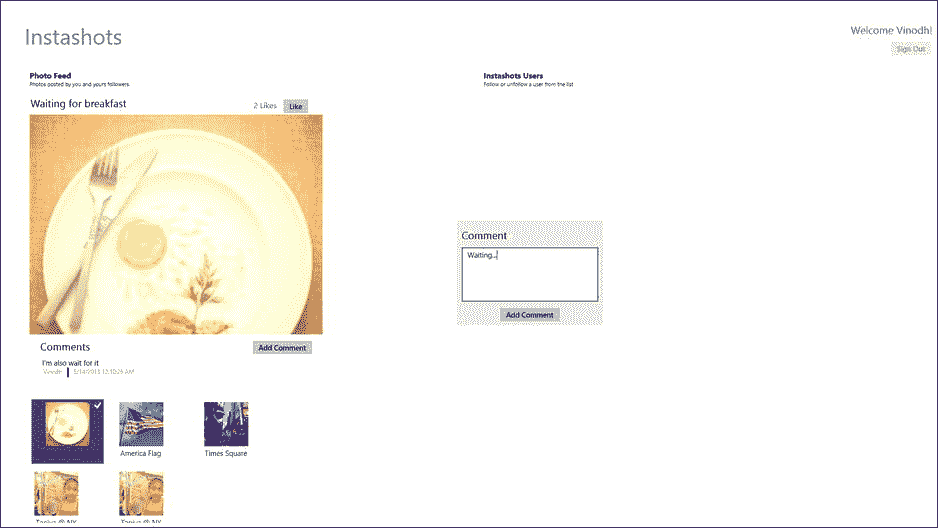

# 九、Windows Azure 移动服务

Abstract

在上两章中，我们看到了两种不同的使用 SQL Server 数据的方法，一种使用 ASP.NET Web API，另一种使用 WCF。在本章中，我们将学习使用 Windows Azure 移动服务来利用 Windows 8 应用中的数据。Windows Azure 移动服务允许我们将任何移动客户端(如 Windows 8、Windows Phone、iOS、Android 或 HTML5 应用)快速连接到托管在 Windows Azure 上的基于云的后端。

在上两章中，我们看到了两种不同的使用 SQL Server 数据的方法，一种使用 ASP.NET Web API，另一种使用 WCF。在本章中，我们将学习使用 Windows Azure 移动服务来利用 Windows 8 应用中的数据。Windows Azure 移动服务允许我们将任何移动客户端(如 Windows 8、Windows Phone、iOS、Android 或 HTML5 应用)快速连接到托管在 Windows Azure 上的基于云的后端。

本章首先帮助我们使用 Windows Azure Mobile 服务设置开始使用 Windows Azure Mobile 服务。我们学习集成用于用户认证的 Live SDK，将数据存储在 Windows Azure 存储中。我们通过开发一个名为 Instashots 的受 Instagram 启发的应用来学习这些步骤，该应用允许用户通过使用 Aviary SDK 并将数据存储在 Windows Azure 存储中，以类似于 Instagram 的方式编辑和添加滤镜。

## Windows Azure 移动服务简介

Windows Azure Mobile Services 是 Windows Azure 的新增功能。其背后的想法是允许开发者为多个移动平台构建可扩展的服务。Windows Azure Mobile Services 目前通过可用于 Windows 8、Windows Phone、iOS、Android 和 HTML5 应用的客户端库提供支持。该服务通过支持一些常见场景(如存储数据、身份验证、应用通知、服务监控和日志记录)来提供快速创建后端服务所需的基础架构。

图 9-1。

Windows Azure Mobile Services Dashboard displays API Call count, CPU usage and Data Out

*   数据:使用 Windows Azure，我们能够将数据作为表格存储在 Windows Azure SQL 数据库中。Windows Azure Mobile Services 的最佳功能之一是能够使用动态架构为以前从未收到的字段自动插入新列。
*   身份验证:Windows Azure Mobile Services 内置了对各种第三方身份提供商的支持，如微软帐户、脸书登录、Twitter 登录和谷歌登录。
*   通知:Windows Azure Mobile Services 支持推送通知，可以与 iOS、Android、Windows 8 和 Windows Phones 的通知服务集成，以提供推送通知。
*   监控和日志记录:Windows Azure Mobile Services 提供了一个仪表板，显示使用时间表、使用概述和日志记录信息(请参见图 [9-1](#Fig1) )。

Note

与 Windows Azure 移动服务类似，亚马逊也提供了一种基于云的解决方案，称为亚马逊 Web 服务(AWS)，用于在云中存储结构化信息。AWS 有一个. NET SDK，支持 Windows 8 和 Windows Phone 8 应用开发。你可以在 [`http://aws.amazon.com/sdkfornet/`](http://aws.amazon.com/sdkfornet/) 下载 SDK。

## 创建 Instashots 应用

Instashots 应用是一种受 Instagram 启发的在线照片共享服务，用户可以为照片添加滤镜并将其发布到网上。通过构建此服务，我们了解如何完成以下工作。

*   创建和管理 Windows Azure Mobile 服务。
*   将数据存储在 Windows Azure SQL 数据库中。
*   将图像存储在 Windows Azure 存储中。
*   集成 Live SDK，用它来认证用户。
*   集成 Aviary SDK 进行照片编辑。

### 在管理门户中创建 Windows Azure Mobile 服务

若要在我们的应用中启用 Windows Azure 移动服务，我们需要注册 Windows Azure 服务。微软为喜欢提前体验的人提供了试用版。注册完成后，登录 Windows Azure 管理门户( [`http://manage.windowsazure.com`](http://manage.windowsazure.com/) ，点击页面左下方的+新建按钮，新建一个名为 Instashots 的移动服务，如图 [9-2](#Fig2) 所示。

图 9-2。

Creating back end services for the Instashots app

在图 [9-3](#Fig3) 所示的创建移动服务页面上，输入 Instashots 作为子域名。我们的 Windows Azure Mobile 服务的 URL 将是 [`http://instashots.azure-mobile.net/`](http://instashots.azure-mobile.net/) 。

图 9-3。

Creating the Mobile Services for Instashots app

创建移动服务后，接下来向导会将我们带到指定数据库设置页面，如图 [9-4](#Fig4) 所示。在这里，我们创建了一个新的数据库，并将其命名为 instashot_db。图 [9-5](#Fig5) 显示了应用可以使用的 Instashots 移动服务。

图 9-5。

Instashots mobile service is ready for the Windows 8 app to use

图 9-4。

Setting up the database for the Instashots Mobile Service

### 创建移动服务表

移动服务就绪后，我们在 SQL 数据库实例`instashot_db`中添加新表，该实例是我们与移动服务一起创建的。Instashots 应用的主要功能是允许用户使用微软帐户登录应用并上传照片，为照片添加评论，以及关注用户。为此，我们创建了四个移动服务表。

*   用户:存储用户信息。
*   图片:存储上传到 Windows Azure 存储的图片的 URI。
*   注释:存储图片的注释。
*   Follow:存储被关注者和关注者的信息。

要创建表格，请点击图 [9-5](#Fig5) 中所示的右箭头，进入移动服务 Instashots 的起始页。导航到数据选项卡以创建新表。为此，点击创建+按钮(参见图 [9-6](#Fig6) )。

图 9-6。

Creating a new table interface in the Windows Azure Management Portal

图片表是必不可少的，因为它将照片数据存储到移动服务中。当 Instashots 应用试图执行任何凝乳操作(如插入、更新、删除或读取)时，我们可以指定用户需要什么权限来执行此操作。在我们的例子中，我们将只允许经过身份验证的用户执行插入、更新和删除操作，但是每个人都可以读取数据(参见图 [9-7](#Fig7) )。现在该表被锁定，任何人在没有适当授权的情况下都不可能插入、更新或删除。与图片表类似，我们也创建表来存储用户数据、评论和关注者信息。一旦创建完毕，数据选项卡将如图 [9-6](#Fig6) 所示。

图 9-7。

Creating a new storage table Pictures for storing photo data

### 正在创建 Windows Azure 存储

尽管照片的信息(如标题和上传日期)存储在图片表中，但图像文件将存储在 Windows Azure 存储中。为此，我们需要创建一个 Windows Azure 存储(见图 [9-8](#Fig8) )和一个容器来存储我们从 Instashots 应用上传的图片。

图 9-8。

New Windows Azure Storage account created with the name Instashots

接下来，我们在存储帐户中创建一个容器。该容器为存储在 Windows Azure 存储服务中的 blobs 提供逻辑分组。当我们将照片上传到 Instshots app 时，要指定容器的名称，如图 [9-9](#Fig9) 所示。

图 9-9。

Container within the storage account is created to store the images

### 设置开发环境

移动服务开始屏幕会生成一个可以下载的 Windows 8 应用。该应用已预先配置为访问 Instashots 后端，并已准备好运行。WinJS (HTML5/JavaScript)或者 C#( .NET/XAML)可以选择下载。我们将在这里选择 C#，并包含 NuGet 包中的以下引用。

*   MVVM 之光
*   Windows Azure 移动服务
*   Windows Azure 存储

我们还添加了对 Live SDK 和 Aviary 照片编辑 SDK 的引用，如图 [9-10](#Fig10) 所示。Aviary 照片编辑 SDK 为我们提供了一个直观的照片编辑工具，从快速修复和一键自动增强到风格效果、裁剪、消除红眼，以及向照片添加滤镜、相框和贴纸。

Note

Aviary SDK for Windows 8 可以从 [`http://www.aviary.com/w8`](http://www.aviary.com/w8) 下载。到目前为止，这个 SDK 只与 C++/XAML 和 C#/XAML 兼容。

图 9-10。

Instashots Windows 8 App project structure

深入到解决方案资源管理器，我们注意到两个文件，`App.xaml`和`MainPage.xaml`，以及一些已经添加到`App.xaml`中的存根代码，如清单 9-1 所示。这有助于应用的`Client`组件与移动服务对话。

清单 9-1。一个更简单的关键 URL 将映射到 Instashots 移动服务，这有助于应用与移动服务对话

`// This MobileServiceClient has been configured to communicate with Mobile Service's url`

`// and application key. You're all set to start working with your Mobile Service!`

`public static MobileServiceClient MobileService = new MobileServiceClient(`

`"`[`https://instashots.azure-mobile.net/`](https://instashots.azure-mobile.net/)T2】

`"TVqTZaDDCuvOKGPMmKwrJhdAFCTECy75"`

`);`

我们创建了四个类:`User`、`Comment`、`Picture`和`Follow`(见清单 9-2)，它们对我们使用管理控制台在 Windows Azure 表存储中创建的实体进行建模。我们将`DataTable`属性添加到所有这些类中，以指定这个类表示移动服务表。

清单 9-2。对 Windows Azure 表存储的实体进行建模的表类

`using Microsoft.WindowsAzure.MobileServices;`

`using System;`

`using System.Runtime.Serialization;`

`[DataTable(Name = "User")]`

`public class User`

`{`

`public int Id { get; set; }`

`[DataMember(Name = "username")]`

`public string UserName { get; set; }`

`[DataMember(Name = "userid")]`

`public string UserID { get; set; }`

`[DataMember(Name = "lastaccessed")]`

`public DateTime? LastAccessed { get; set; }`

`}`

`[DataTable(Name = "Pictures")]`

`public class Picture`

`{`

`public int Id { get; set; }`

`[DataMember(Name = "name")]`

`public string Name { get; set; }`

`[DataMember(Name = "title")]`

`public string Title { get; set; }`

`[DataMember(Name = "userid")]`

`public string UserId { get; set; }`

`[DataMember(Name = "imageurl")]`

`public string Imageurl { get; set; }`

`[DataMember(Name = "sasQueryString")]`

`public string sasQueryString { get; set; }`

`[DataMember(Name = "likes")]`

`public int Likes { get; set; }`

`[IgnoreDataMember]`

`public List<Comment> Comments { get; set; }`

`}`

`[DataTable(Name = "Comments")]`

`public class Comment`

`{`

`public int Id { get; set; }`

`[DataMember(Name = "text")]`

`public string CommentText { get; set; }`

`[DataMember(Name = "userid")]`

`public int UserId { get; set; }`

`[DataMember(Name = "pictureid")]`

`public int PictureId { get; set; }`

`[DataMember(Name = "createdDate")]`

`public DateTime? CreatedDate { get; set; }`

`[IgnoreDataMember]`

`public User CommentedBy { get; set; }`

`}`

`[DataTable(Name = "Follow")]`

`public class Follow`

`{`

`public int Id { get; set; }`

`[DataMember(Name = "followeruserid")]`

`public int FollowerUserId { get; set; }`

`[DataMember(Name = "followinguserid")]`

`public int FollowingUserId { get; set; }`

`[DataMember(Name = "lastUpdated")]`

`public DateTime? LastUpdatedDate { get; set; }`

`}`

## 设计 Instashots 用户界面

Instashots 应用是一个单页 UI ( `MainPage.xaml`)，如清单 9-3 所示，它通过 Header section 分为四个部分，其中包含应用名称和注销按钮。Feed 部分位于左侧，将显示登录用户和该登录用户关注的所有用户发布的照片。下一个部分位于提要部分的上方，显示从提要列表中选择的照片。从这个部分，用户可以链接图片，查看评论，并为图片添加评论。在右侧，我们可以显示正在关注的 Instashots 用户和用户关注的人，但考虑到本章的长度，我们不讨论这种实现。鼓励读者将此作为进一步的练习来探索。

清单 9-3。xaml 中定义的 MainPage.xaml 视图

`<Grid Background="White">`

`<Grid Margin="50,50,10,10">`

`<Grid.ColumnDefinitions>`

`<ColumnDefinition Width="653*" />`

`<ColumnDefinition Width="427*" />`

`<ColumnDefinition Width="226*"/>`

`</Grid.ColumnDefinitions>`

`<Grid.RowDefinitions>`

`<RowDefinition Height="Auto" />`

`<RowDefinition Height="*" />`

`</Grid.RowDefinitions>`

`<!--Header Section-->`

`<Grid Grid.Row="0"`

`Grid.ColumnSpan="2"`

`Margin="0,0,0,20">`

`<StackPanel>`

`<TextBlock>`

`<Run Text="Instashots"/>`

`</TextBlock>`

`</StackPanel>`

`</Grid>`

`<StackPanel Grid.Row="1">`

`<StackPanel>`

`<local:QuickStartTask`

`Number="1"`

`Title="Photo Feed"`

`Description="Photos posted by you and your followers" />`

`<!--Selected Photo Section-->`

`<StackPanel`

`Margin="10,20,0,20"`

`Visibility="{Binding ShowSelectedPhoto}">`

`<StackPanel`

`Margin="2,0,0,0"`

`Orientation="Horizontal">`

`<TextBlock`

`Text="{Binding SelectedTitle}"/>`

`<TextBlock`

`Text="{Binding SelectedLikeCount}"`

`VerticalAlignment="Center"`

`Foreground="{StaticResource`

`SliderTrackDecreasePressedBackgroundThemeBrush}"`

`/>`

`<Button`

`Command="{Binding LikeCommand, Mode=OneWay}"`

`Content="Like"`

`/>`

`</StackPanel>`

`<Border>`

`<Image`

`Source="{Binding SelectedPicture,`

`Converter={StaticResource UrlToBitmapImageConverter}}"`

`Stretch="UniformToFill"/>`

`</Border>`

`<StackPanel`

`Margin="22,10,0,0"`

`Orientation="Vertical">`

`<StackPanel Orientation="Horizontal">`

`<TextBlock/>`

`<Button`

`Command="{Binding ShowCommentCommand, Mode=OneWay}"`

`Content="Add Comment"/>`

`</StackPanel>`

`<!--ListView the loads the comment of the selected picture-->`

`<ListView`

`ItemsSource="{Binding PictureComments}"`

`SelectionMode="None"`

`IsSwipeEnabled="false"`

`IsItemClickEnabled="True"`

`ItemTemplate="{StaticResource CommentTemplate}" />`

`</StackPanel>`

`</StackPanel>`

`<!--Feed List-->`

`<StackPanel`

`Orientation="Horizontal"`

`Margin="10,0,0,0">`

`<ListView`

`ItemsSource="{Binding MyPictures}"`

`SelectedItem="{Binding SelectedItem, Mode=TwoWay}"`

`IsSwipeEnabled="false"`

`IsItemClickEnabled="True"`

`ItemTemplate="{StaticResource 80PxTemplate}"`

`SelectionMode="Single">`

`<ListView.ItemsPanel>`

`<ItemsPanelTemplate>`

`<WrapGrid Orientation="Horizontal" />`

`</ItemsPanelTemplate>`

`</ListView.ItemsPanel>`

`</ListView>`

`</StackPanel>`

`</StackPanel>`

`</StackPanel>`

`<Grid Grid.Row="1" Grid.Column="1" Grid.ColumnSpan="2">`

`<Grid.RowDefinitions>`

`<RowDefinition Height="Auto" />`

`<RowDefinition />`

`</Grid.RowDefinitions>`

`<!-- Users list to follow-->`

`<StackPanel>`

`<local:QuickStartTask`

`Number="2"`

`Title="Instashots Users"`

`Description="Follow or unfollow a user from the list" />`

`</StackPanel>`

`<ListView`

`x:Name="ListItems"`

`Margin="62,10,0,0" Grid.Row="1">`

`<ListView.ItemTemplate>`

`<DataTemplate>`

`<StackPanel Orientation="Horizontal">`

`<CheckBox`

`x:Name="CheckBoxComplete"`

`IsChecked="{Binding Complete, Mode=TwoWay}"`

`Content="{Binding Text}" Margin="10,5"`

`VerticalAlignment="Center"/>`

`</StackPanel>`

`</DataTemplate>`

`</ListView.ItemTemplate>`

`</ListView>`

`</Grid>`

`<StackPanel Margin="0,0,0,20" Grid.Column="2">`

`<TextBlock`

`x:Name="txtWelcome"/>`

`<Button Margin="72,0,0,0"`

`x:Name="btnSignOut"`

`Command="{Binding SignoutCommand}"`

`Content="Sign Out"/>`

`</StackPanel>`

`</Grid>`

### 主视图模型

我们添加一个 ViewModel 类`MainViewModel`。MVVM 之光的`ViewModelBase`类被用作这个视图模型的基类，这个视图模型公开了完成各种功能的方法和命令，如根据微软帐户验证用户，将照片上传到 Windows Azure 存储服务，以及从 Windows Azure 移动服务获取照片和用户详细信息。

### 主视图模型命令

在`MainViewModel`(见清单 9-4)中，我们添加了将被绑定到`MainPage.xaml`中用户界面元素的命令。这些命令将与调用命令时调用的方法相关联。

清单 9-4。将用户界面与逻辑绑定的命令

`public RelayCommand SignoutCommand { get; private set; }`

`public RelayCommand EditPhotoCommand { get; private set; }`

`public RelayCommand UploadPhotoCommand { get; private set; }`

`public RelayCommand AddCommentCommand { get; private set; }`

`public RelayCommand ShowCommentCommand { get; private set; }`

`public RelayCommand LikeCommand { get; private set; }`

`public MainViewModel()`

`{`

`if (!IsInDesignMode)`

`{`

`this.SignoutCommand = new RelayCommand(this.SignOutAction, CanSignOut);`

`this.UploadPhotoCommand = new RelayCommand(this.UploadAction, CanUpload);`

`this.EditPhotoCommand = new RelayCommand(this.EditPhotoAction , CanEditPhoto);`

`this.AddCommentCommand = new RelayCommand(this.AddCommentAction);`

`this.ShowCommentCommand = new RelayCommand(this.ShowCommentAction);`

`this.LikeCommand = new RelayCommand(this.LikeAction);`

`Authenticate();`

`}`

`}`

### MainViewModel 属性

我们将向`MainViewModel`添加各种属性，这些属性负责保存照片馈送、改变控件的可见状态以及编辑照片细节。清单 9-5 显示了`MainViewModel`中的所有属性，每个属性上面都有注释，详细说明了该属性的用途。

清单 9-5。保存信息的 MainViewModel 属性

`//User welcome text`

`public string WelcomeTitle`

`{`

`get`

`{`

`return welcomeTitle;`

`}`

`set`

`{`

`welcomeTitle = value;`

`RaisePropertyChanged("WelcomeTitle");`

`}`

`}string welcomeTitle;`

`//Uploading Photo Title`

`public string PhotoTitle`

`{`

`get`

`{`

`return photoTitle;`

`}`

`set`

`{`

`photoTitle = value;`

`RaisePropertyChanged("PhotoTitle");`

`}`

`}string photoTitle;`

`//Photo Like count`

`public string SelectedLikeCount`

`{`

`get`

`{`

`return selectedLikeCount;`

`}`

`set`

`{`

`selectedLikeCount = value;`

`RaisePropertyChanged("SelectedLikeCount");`

`}`

`}string selectedLikeCount;`

`//Show popup UI to entry title and upload`

`public bool ShowUploadPopup`

`{`

`get`

`{`

`return showUploadPopup;`

`}`

`set`

`{`

`showUploadPopup = value;`

`RaisePropertyChanged("ShowUploadPopup");`

`}`

`}bool showUploadPopup;`

`//Show popup UI to add comment`

`public bool ShowCommentPopup`

`{`

`get`

`{`

`return showCommentPopup;`

`}`

`set`

`{`

`showCommentPopup = value;`

`RaisePropertyChanged("ShowCommentPopup");`

`}`

`}bool showCommentPopup;`

`//Selected Photo from the Feed`

`public Picture SelectedItem`

`{`

`get`

`{`

`return selectedItem;`

`}`

`set`

`{`

`selectedItem = value;`

`SelectedTitle = selectedItem.Title;`

`SelectedPhoto = SelectedItem.Imageurl ;`

`ShowSelectedPhoto = Visibility.Visible;`

`SelectedLikeCount = string.Format("{0} {1}"`

`, SelectedItem.Likes, SelectedItem.Likes > 1 ? "Likes" : "Like");`

`RaisePropertyChanged("SelectedItem");`

`LoadComment();`

`}`

`}Picture selectedItem;`

`//Set visibility of the Selected Photo section`

`public Visibility ShowSelectedPhoto`

`{`

`get`

`{`

`return showSelectedPhoto;`

`}`

`set`

`{`

`showSelectedPhoto = value;`

`RaisePropertyChanged("ShowSelectedPhoto");`

`}`

`}Visibility showSelectedPhoto = Visibility.Collapsed;`

`//Selected Photo title from the feed`

`public string SelectedTitle`

`{`

`get`

`{`

`return selectedTitle;`

`}`

`set`

`{`

`selectedTitle = value;`

`RaisePropertyChanged("SelectedTitle");`

`}`

`}string selectedTitle;`

`//Comment to be added to the selected photo`

`public string CommentText`

`{`

`get`

`{`

`return commentText;`

`}`

`set`

`{`

`commentText = value;`

`RaisePropertyChanged("CommentText");`

`}`

`}string commentText;`

`//Azure storage URL of the selected photo from the feed`

`public string SelectedPhoto`

`{`

`get`

`{`

`return selectedPhoto;`

`}`

`set`

`{`

`selectedPhoto = value;`

`RaisePropertyChanged("SelectedPhoto");`

`}`

`}string selectedPhoto;`

`//WritableBitmap of the edited photo from Aviary UI`

`public WriteableBitmap EditedImage`

`{`

`get`

`{`

`return editedImage;`

`}`

`set`

`{`

`editedImage = value;`

`RaisePropertyChanged("EditedImage");`

`}`

`}WriteableBitmap editedImage;`

### 使用 Live SDK 进行身份验证

Windows Azure Mobile Services 内置了通过使用各种身份提供商(如微软帐户、脸书、Twitter 和谷歌)对用户进行身份验证和授权的功能。

要将 Instashots 配置为使用 Microsoft 帐户进行身份验证，我们必须更新 Windows Azure 管理门户中“移动服务身份”选项卡上的设置。在此选项卡上，我们可以为微软帐户、脸书、Twitter 和谷歌进行配置；不过，对于 Instashots 应用，我们只配置了微软账户。导航到 Live Portal ( [`http://manage.dev.live.com`](http://manage.dev.live.com/) )注册应用，如图 [9-11](#Fig11) 所示。获取客户端 ID 和客户端密钥，并在 Microsoft 帐户设置中更新它们，如图 [9-12](#Fig12) 所示。最后在 Live Connect 中设置重定向域，本质上就是我们的 Windows Azure Mobile 服务 URL， [`https://instashots.azure-mobile.net/`](https://instashots.azure-mobile.net/) 。

图 9-12。

Setting up Microsoft Account for authentication

图 9-11。

Live developer portal to register an app to support Microsoft Account

到目前为止，移动服务 API 仅提供有关登录用户的非常基本的信息，如用户名，但我们希望获得更多信息，如登录用户的名字，以便我们可以在用户登录应用时为他或她提供定制的问候。为了实现这一点，我们不使用移动服务 API 来认证用户，而是使用 Live SDK APIs 来认证，然后将令牌分配给移动服务用户对象，如清单 9-6 所示。我们将在一个 asyn 方法中拥有所有这些逻辑。该方法驻留在`MainViewModel`中，当用户启动应用时将被调用。该方法对用户进行身份验证，一旦通过身份验证，它将检查用户是否是现有用户。如果是，那么它获取该用户的用户对象；否则，它会创建一个新的用户对象，并将信息保存到移动服务存储表中。

清单 9-6。使用 Live SDK 验证用户身份

`LiveAuthClient liveIdClient = new LiveAuthClient("`[`https://instashots.azure-mobile.net/`](https://instashots.azure-mobile.net/)T2】

`private LiveConnectSession session;`

`private async System.Threading.Tasks.Task Authenticate()`

`{`

`while (session == null)`

`{`

`// Force a logout to make it easier to test with multiple Microsoft Accounts`

`if (liveIdClient.CanLogout)`

`liveIdClient.Logout();`

`LiveLoginResult result = await liveIdClient.LoginAsync(new[] { "wl.basic" });`

`if (result.Status == LiveConnectSessionStatus.Connected)`

`{`

`session = result.Session;`

`LiveConnectClient client = new LiveConnectClient(result.Session);`

`LiveOperationResult meResult = await client.GetAsync("me");`

`//assigning the token generated by LiveConnectClient to the MobileServiceUser`

`MobileServiceUser loginResult = await App.MobileService.LoginAsync(result.Session.AuthenticationToken);`

`var results = await userTable.ToListAsync();`

`if (results.Count == 0)`

`{`

`var user = new User { LastAccessed = DateTime.Now, UserName = meResult.Result["first_name"].ToString() };`

`}`

`else`

`{`

`CurrentUser = results.First();`

`}`

`WelcomeTitle = string.Format("Welcome {0}!", meResult.Result["first_name"]);`

`//Get the photos uploaded by logged in user.`

`var getPictures = await GetMyPhotos();`

`foreach (var p in getPictures)`

`{`

`myPictures.Add(p);`

`}`

`RaisePropertyChanged("MyPictures");`

`}`

`else`

`{`

`session = null;`

`var dialog = new MessageDialog("You must log in.", "Login Required");`

`dialog.Commands.Add(new UICommand("OK"));`

`await dialog.ShowAsync();`

`}`

`}`

`}`

Windows Azure Mobile Services 使我们能够定义在服务器上运行的自定义业务逻辑。这个逻辑作为一个 JavaScript 函数提供，该函数注册到给定表上的插入、读取、更新或删除操作。在我们的例子中，在用户表中插入一行之前，我们从插入脚本的`User`参数中获取经过验证的用户 ID，并将其设置为用户表的`userid`列，如图 [9-13](#Fig13) 所示。

图 9-13。

Insert script to get the UserID and update the table

### 正在检索照片源

一旦用户被认证，`Authenticate`方法将调用`GetMyPhotos`(见清单 9-7)方法来获取图片并将它们填充到`MyPictures`集合中。这个集合被绑定到 ListView，如清单 9-3 所示。

清单 9-7。从图片表中检索照片馈送

`private async Task<List<Picture>> GetMyPhotos()`

`{`

`return await pictureTable.ToListAsync();`

`}`

### 将照片上载到 Windows Azure 存储

如前所述，Instashots 应用允许登录用户为照片添加滤镜并将其上传到 Windows Azure 存储，并使用照片标题和 Windows Azure 存储 URI 更新照片表。为了上传照片，用户将点击应用栏上的上传按钮，这将调用调用`EditPhotoAction`方法的`EditPhotoAction`命令。这个方法调用`FileOpenPicker`类让用户选择一张照片进行编辑。一旦选中，通过调用清单 9-8 所示的`LaunchAviarySDK`方法将照片发送到鸟舍照片编辑器，如图 [9-14](#Fig14) 所示给照片添加滤镜。一旦用户编辑了照片，AviaryEditor 就会调用`PhotoEditCompleted`方法。在`PhotoEditCompleted`方法中，我们将编辑过的照片分配给`EditedImage`属性，并显示一个弹出窗口(见图 [9-15](#Fig15) )来为照片添加标题，并通过单击弹出窗口中的上传按钮选择上传。

清单 9-8。使用 Aviary SDK 编辑照片

`public async void EditPhotoAction()`

`{`

`editedImage = null;`

`PhotoTitle = null;`

`FileOpenPicker openPicker = new FileOpenPicker();`

`openPicker.ViewMode = PickerViewMode.Thumbnail;`

`openPicker.SuggestedStartLocation = PickerLocationId.PicturesLibrary;`

`openPicker.FileTypeFilter.Add(".jpg");`

`openPicker.FileTypeFilter.Add(".jpeg");`

`openPicker.FileTypeFilter.Add(".png");`

`StorageFile file = await openPicker.PickSingleFileAsync();`

`if (file != null)`

`{`

`selectedFileName = file.Name;`

`m_aviaryPhotoStream = await file.OpenReadAsync();`

`await LaunchAviarySDK();`

`}`

`}`

`private async System.Threading.Tasks.Task LaunchAviarySDK()`

`{`

`if (m_aviaryPhotoStream == null)`

`{`

`return;`

`}`

`//Load editor with IRandomAccessStream from a picture file`

`AviaryEditorTask.SetAviaryEditorAccentColor(Windows.UI.Colors.LightGray, true);`

`AviaryEditorTask task = await AviaryEditorTask.FromRandomAccessStream(m_aviaryPhotoStream, true);`

`task.Completed += PhotoEditCompleted;`

`task.Show();`

`}`

`private void PhotoEditCompleted(object sender, AviaryTaskCompletedEventArgs e)`

`{`

`//check the Result to see if editing was successfully completed before accessing the Edited Photo`

`if (e.Result == AviaryTaskResult.Completed)`

`{`

`EditedImage = e.EditedPhoto.Image;`

`ShowUploadPopup = true;`

`}`

`}`

图 9-15。

Adding a title to the photo before uploading

图 9-14。

Photo edited using the Aviary Editor

当用户点击上传按钮时，`UploadCommand`(见清单 9-9)被调用。这调用了`UploadAction`方法。我们做的第一件事是将照片临时保存在本地存储位置。接下来，我们在图片表中插入照片信息，并将照片上传到 Windows Azure 存储。为此，我们创建了`Picture`对象，并将其插入到表中。

清单 9-9。将照片上载到 Windows Azure 存储

`public async void UploadAction()`

`{`

`string fileName = string.Format("{0}_{1}"`

`, Guid.NewGuid()`

`, selectedFileName);`

`var picture = new Picture { Name = fileName`

`, Title= PhotoTitle };`

`await App.MobileService.GetTable<Picture>().InsertAsync(picture);`

`string container = "instashots";`

`string imageUrl = string.Format("``http://{0}.blob.core.windows.net/{1}/{2}`T2】

`, "splcricket"`

`, container`

`, fileName);`

`StorageCredentials cred = new StorageCredentials(picture.sasQueryString);`

`var imageUri = new Uri(picture.Imageurl);`

`// Instantiate a Blob store container based on the info in the returned item.`

`CloudBlobContainer cloudcontainer = new CloudBlobContainer(`

`new Uri(string.Format("``https://{0}/{1}`T2】

`, imageUri.Host`

`, container))`

`, cred);`

`CloudBlockBlob blobFromSASCredential =`

`cloudcontainer.GetBlockBlobReference(fileName);`

`//Save File to local folder.`

`await EditedImage.SaveToFile(`

`ApplicationData.Current.LocalFolder,`

`fileName,`

`CreationCollisionOption.GenerateUniqueName);`

`var localFolder = Windows.Storage.ApplicationData.Current.LocalFolder;`

`var savedFile = await localFolder.GetFileAsync(fileName);`

`using (var fileStream = await savedFile.OpenStreamForReadAsync())`

`{`

`await blobFromSASCredential.UploadFromStreamAsync(fileStream.AsInputStream());`

`}`

`MyPictures.Add(picture);`

`}`

要将照片上传到 Windows Azure 存储，我们需要使用共享访问签名(SAS)生成上传 URI。SAS 是一个安全的 URI，我们可以使用它在 Windows Azure 存储帐户中上传文件，而无需提供存储凭据。上传 URI 将在照片表格插入脚本中生成，如图 [9-16](#Fig16) 所示。有了 SAS URI，我们基于 SAS URI 实例化一个 Blob store 容器(使用`CloudBlockBlob`类),并使用`CloudBlockBlob`类中的`UploadFromStreamAsync`方法上传保存的文件。最后，我们将照片对象添加到`MyPhotos`集合中，这样上传的照片将显示在`Feed`列表视图中。

图 9-16。

Insert script to get the SAS URI and update it to the Picture table

### 实现评论和喜欢功能

显示评论、添加评论和喜欢一张选中的照片是一项简单的任务，如清单 9-10 所示。在从提要中选择一张照片时，我们可以显示该照片的大图以及为该照片输入的评论列表。我们还有两个按钮:一个用来添加评论，另一个用来喜欢照片。当用户点击添加注释按钮时，将显示一个弹出窗口(见图 [9-17](#Fig17) )用于输入注释。提交后，评论将被保存到评论存储表中。

清单 9-10。实现评论和喜欢

`public void ShowCommentAction()`

`{`

`showCommentPopup = true;`

`RaisePropertyChanged("ShowCommentPopup");`

`}`

`private async void LoadComment()`

`{`

`var comments = await commentTable`

`.Where(b => b.PictureId == SelectedItem.Id)`

`.OrderByDescending(c => c.CreatedDate)`

`.ToListAsync();`

`pictureComments.Clear();`

`foreach (var c in comments)`

`{`

`c.CommentedBy = await userTable.LookupAsync(c.UserId);`

`pictureComments.Add(c);`

`}`

`RaisePropertyChanged("PictureComments");`

`}`

`public async void AddCommentAction()`

`{`

`var comment = new Comment { CommentText = commentText`

`, PictureId = SelectedItem.Id`

`,UserId=CurrentUser.Id`

`, CreatedDate= DateTime.Now };`

`await App.MobileService.GetTable<Comment>().InsertAsync(comment);`

`pictureComments.Add(comment);`

`}`

`public async void LikeAction()`

`{`

`await App.MobileService.GetTable<Picture>().UpdateAsync(SelectedItem);`

`}`

图 9-17。

Adding a comment to the Instashots app

现在，所有代码都准备好了，当我们运行 Instashots 应用时，用户现在将能够通过 Microsoft 帐户进行身份验证，并能够上传照片、添加评论和喜欢的照片。最终的应用将链接到图 [9-17](#Fig17) 所示的应用。

### 改进的想法

Instashots 应用可以进行工作和改进，使其成为一个功能齐全的照片分享社交应用。以下是可以添加的一些功能。

*   如前所述，可以通过显示您正在关注的用户列表来创建用户部分，并提供取消关注的选项。
*   使用 Windows 8 的 Share charm 功能添加一个共享照片的选项。
*   使用搜索魅力搜索新用户。
*   启用 Windows 8 PlayTo 功能，将照片流式传输到设备，并提供使用 NFC(点击并发送)共享照片的选项。
*   扩展身份验证以包括脸书、谷歌和 Twitter 登录，因为对这一点的支持已经内置于 Windows Azure Mobile 服务中。

## 结论

在本章中，我们了解了 Windows Azure 以及如何设置和使用 Windows Azure 移动服务作为服务层，集成 Live SDK 进行用户身份验证，在 Windows Azure SQL 数据库中存储数据，以及将图像上传到 Windows Azure 存储。我们通过创建一个使用一些 Windows Azure 服务的真实世界 Windows 8 应用了解了所有这些。如前所述，这个应用可以进一步扩展，使其功能更加丰富，并在 Windows 商店中提供。在本章中，我们总结了本书的第 3 部分，其中概述了各种 Windows 8 应用远程存储选项。在下一章也是最后一章，我们将学习如何创建另一款面向 Windows 8 和 Windows Phone 平台的数据驱动应用。