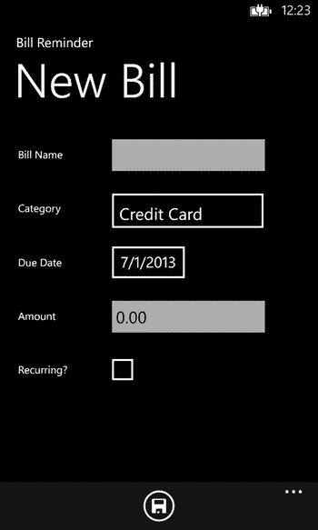

# 十、Windows Phone 8 数据访问

Abstract

我们通过学习 Windows Phone 应用可用的数据访问选项来结束这本书。本章首先讨论 Windows Phone 和 Windows 8 应用之间的代码共享技术，然后向您介绍 Windows Phone 内置数据库选项 SQL Server Compact for Windows Phone，并引导您完成 Windows Phone 应用开发的入门步骤。然后，我们使用 SQLServer Compact 数据库作为数据存储，将我们在第 6 章构建的账单提醒 Windows 8 应用移植到 Windows Phone 应用。最后，我们简要介绍一下我们在本书中学到的其他数据存储选项，这些选项也可以在 Windows Phone 应用中使用。

我们通过学习 Windows Phone 应用可用的数据访问选项来结束这本书。本章首先讨论 Windows Phone 和 Windows 8 应用之间的代码共享技术，然后向您介绍 Windows Phone 内置数据库选项 SQL Server Compact for Windows Phone，并引导您完成 Windows Phone 应用开发的入门步骤。然后，我们将在第 6 章中构建的账单提醒 Windows 8 应用移植到 Windows Phone 应用，使用 SQLServer Compact 数据库作为数据存储。最后，我们简要介绍一下我们在本书中学到的其他数据存储选项，这些选项也可以在 Windows Phone 应用中使用。

## 共享代码

Windows Phone 8 是对 Windows Phone 7.x 的重大升级，它用与 Windows 8 相同的内核替换了内核，这意味着。NET Compact Framework 被替换为。NET CLR。除此之外，Windows Phone API 添加了 Windows Phone 运行时，这与 WinRT 有很多共同之处。有了这个新的 Windows Phone API，开发者将能够用 VB/C#和 C++开发应用。Windows Phone 8 还支持使用 Direct3D、xAudio2 Win32、COM 和 MF 的原生开发。

### 将 UI 与应用逻辑分开

构建一个同时面向 Windows 8 和 Windows Phone 8 的成功应用的策略是将 UI 与应用逻辑分离。模型-视图-视图模型(MVVM ),我们在本书中广泛用于构建各种应用，是唯一一个将 UI 与应用逻辑分离的简洁方法。使用 MVVM，我们可以封装一个或多个视图模型，在此基础上，我们可以有一个或多个视图来表示 Windows Phone 页面或 Windows 8 页面。

### 共享便携。可移植类库中的. NET 代码

可移植类库是我们可以用来在 Windows 8 和使用 XAML/VB/C#编写的 Windows Phone 应用之间共享代码的重要模块之一，因为这具有共性。网络图书馆。在 Visual Studio 中，当我们创建一个可移植的类库时，一个如图 [10-1](#Fig1) 所示的弹出窗口允许我们选择目标框架。该项目将有一套图书馆显示。NET 目前可以移植到我们的目标平台上。一旦编译完成，这些库就可以与目标框架兼容，在我们的例子中是 Windows Phone 和 Windows 8。除了创建我们自己的可移植库，我们还可以在我们的可移植库项目中引用一些常见的可移植库，如 MVVM 之光。

图 10-1。

Selecting the targeted frameworks for the Portable Class Library

### 使用公共 Windows 运行时 API(添加为链接)

Windows 8 附带了通用的 Windows 运行时 API，可以访问传感器、媒体和邻近度。除此之外，我们还获得了 Windows Phone 8 运行时 API，它与 Windows 8 共享 API 的子集。每当我们使用这组 API 时，我们可以编写一次，并使用 Visual Studio 中可用的添加为链接功能在 Windows 8 和 Windows Phone 8 应用中使用它，如图 [10-2](#Fig2) 所示。通过这样做，类文件将不会被复制到项目中，而是作为一个链接从源文件中复制。因此，如果我们对代码进行任何更改，它将会反映在所有链接的引用中。

Note

在创建针对 Windows 8 和 Windows Phone 8 的门户库时，不能将 Windows 运行时 API 引用到可移植库中，因为不支持二进制兼容性，并且必须为每个平台单独编译代码。

使用刚才讨论的技术，我们能够通过共享相似的代码库来创建一个针对 Windows Phone 8 和 Windows 8 的编译应用。

图 10-2。

Adding an existing file as a link to the Visual Studio Project

## 用于 Windows Phone 的 SQL Server Compact

与 Windows 8 不同，Windows Phone 提供了对 SQL Server Compact 作为本地数据库的内置支持。这个数据库驻留在应用的独立存储中，是一个内存中的关系数据库。以下是 SQL Server Compact 的一些功能。

*   SQL Server Compact 数据库在 Windows Phone 应用的进程中运行。与 SQL Server 不同，数据库不会在后台持续运行；相反，只有当应用正在使用时，才会创建一个实例。
*   由于数据库存储在应用的独立存储中，因此该数据库只能由该应用访问，不能与任何其他应用共享。
*   不支持事务 SQL。相反，LINQ 到 SQL 被用作 ORM 引擎。
*   因为 SQL Server Compact 数据库是 Windows Phone 运行时的一部分，所以不需要将对应于 SQL Server Compact 数据库的任何 dll 打包为应用的一部分。

简要介绍了内置的 SQL Server compact 数据库后，我们接下来将在第 6 章中使用 Windows 8 XAML/C#、SQLite、MVVM 轻量级框架构建的账单提醒 Windows 8 应用移植到使用 SQL Server Compact 作为数据库而不是 SQLite 来存储数据的 Windows Phone 应用，以及 MVVM 轻量级框架。

## 将账单提醒 Windows 8 应用移植到 Windows Phone

为 Windows Phone 移植账单提醒应用非常简单明了。项目结构如图 [10-3](#Fig3) 所示，大部分代码保持不变，除了适应更小屏幕的布局。

图 10-3。

BillReminder Windows Phone app project structure, which looks similar to the BillReminder Windows 8 app

### 设置 Windows Phone 8 开发环境

Windows Phone SDK 8.0 可以从 [`http://go.microsoft.com/fwlink/?LinkId=259416`](http://go.microsoft.com/fwlink/?LinkId=259416) 下载。该 SDK 包括所有必要的工具，如用于 Windows Phone 的 Visual Studio Express 2012、用于创建新 Windows Phone 应用的项目模板以及用于测试的 Windows Phone 仿真器。安装 SDK 后，我们创建一个新的 Windows Phone 应用，如图 [10-4](#Fig4) 所示。

图 10-4。

Windows Phone app project template

创建应用后，系统会提示我们选择目标 Windows Phone OS 版本，如图 [10-5](#Fig5) 所示。选择 Windows Phone OS 8.0，但您可以随时选择 Windows Phone OS 7.1 来支持这两个版本，因为 Windows Phone 8 OS 提供了针对 Windows Phone 7.1 开发的应用的向后兼容性。

图 10-5。

Selecting the Windows Phone platform that we want to target, in this case Windows Phone OS 8.0

我们使用 NuGet 包向 MVVM 轻量级框架和 Windows Phone 工具包添加项目引用。Windows Phone Toolkit 提供了一组控件、动画框架和扩展方法，使 Windows Phone 开发更加容易。我们在项目中使用 Windows Phone 工具包中的 DatePicker 和 ListPicker 控件。

### 创建数据库表

第六章中[提到，账单提醒 app 的主要功能是帮助跟踪账单。为此，我们通过 Category、Bill 和 PaidBill 创建了三个表，类似于我们为 Windows 8 应用创建的表。像 SQLite 包装器 sqlite-net 一样，SQL Server Compact 也是一个基于 ORM 的数据库，所以我们将映射到三个表的类文件复制到 Windows Phone app `Model`文件夹中，如图](06.html) [10-3](#Fig3) 所示。这些类定义了我们的对象模型及其到数据库模式的映射。

接下来，要使用 LINQ 到 SQL 访问存储在数据库中的数据，我们必须用清单 10-1 所示的`[Table]`属性来修饰这个类。基本上，我们可以使用该属性将一个类指定为与数据库表或视图相关联的实体类。

除了将类与表相关联之外，我们还需要指出我们打算与数据库列相关联的每个字段或属性。

清单 10-1。类别、账单和已付账单分类

`[Table]`

`public class Category`

`{`

`[Column(IsPrimaryKey = true, IsDbGenerated = true)]`

`public int CategoryID { get; internal set; }`

`[Column(CanBeNull = false)]`

`public string Name { get; internal set; }`

`}`

`[Table]`

`public class Bill`

`{`

`[Column(IsPrimaryKey = true`

`, IsDbGenerated = true`

`, DbType = "INT NOT NULL Identity"`

`, CanBeNull = false`

`, AutoSync = AutoSync.OnInsert)]`

`public int BillID { get; internal set; }`

`[Column(CanBeNull = false)]`

`public string Name { get; internal set; }`

`[Column(CanBeNull = false)]`

`public DateTime DueDate { get; internal set; }`

`[Column(CanBeNull = false)]`

`public bool IsRecurring { get; internal set; }`

`[Column(CanBeNull = true, UpdateCheck = UpdateCheck.Never)]`

`public int CategoryID{get; internal set; }`

`private EntityRef<Category> category;`

`[Association(Storage = "category"`

`, ThisKey = "CategoryID"`

`, OtherKey = "CategoryID"`

`, IsForeignKey = true)]`

`public Category Category`

`{`

`get { return category.Entity; }`

`set`

`{`

`if (value != null)`

`{`

`CategoryID = value.CategoryID;`

`}`

`category.Entity = value;`

`}`

`}`

`[Column(CanBeNull = false)]`

`public Decimal Amount { get; internal set; }`

`}`

`[Table]`

`public class PaidBill`

`{`

`[Column(IsPrimaryKey = true, IsDbGenerated = false)]`

`public int PaidBillID { get; internal set; }`

`[Column(CanBeNull = false, UpdateCheck = UpdateCheck.Never)]`

`public int BillID { get; internal set; }`

`private EntityRef<Bill> bill;`

`[Association(Storage = "bill"`

`, ThisKey = "BillID"`

`, OtherKey = "BillID"`

`, IsForeignKey = true)]`

`public Bill Bill`

`{`

`get { return bill.Entity; }`

`set`

`{`

`if (value != null)`

`{`

`BillID = value.BillID;`

`}`

`bill.Entity = value;`

`}`

`}`

`[Column(CanBeNull = true)]`

`public DateTime PaidDate { get; internal set; }`

`[Column(CanBeNull = true)]`

`public Decimal Amount { get; internal set; }`

`}`

### 创建 DataContext 类

`DataContext`类继承自`System.Data.Linq.DataContext`，用于通过`Table<TEntity>`类型的属性将数据库暴露给代码的其余部分，如清单 10-2 所示。

清单 10-2。BillReminderDataContext 类公开数据库

`using System.Data.Linq;`

`namespace BillReminder.Model`

`{`

`public class BillReminderDataContext : DataContext`

`{`

`public BillReminderDataContext(string connectionString)`

`: base(connectionString)`

`{`

`}`

`public Table<Bill> Bills`

`{`

`get`

`{`

`return this.GetTable<Bill>();`

`}`

`}`

`public Table<Category> Categories`

`{`

`get`

`{`

`return this.GetTable<Category>();`

`}`

`}`

`public Table<PaidBill> PaidBills`

`{`

`get`

`{`

`return this.GetTable<PaidBill>();`

`}`

`}`

`}`

`}`

接下来，我们在`App.xaml.cs`中的应用初始化时使用`DataContext`对象创建数据库。通过传递连接字符串来初始化`DataContext`对象，这基本上告诉应用如何连接到数据库。一旦应用被初始化，我们检查数据库是否存在；如果没有，我们通过调用`DataContext`的`CreateDatabase()`方法来创建数据库。我们还通过使用`InsertOnSubmit`方法将`Category`对象添加到数据上下文中，并调用数据上下文`SubmitChanges`方法将数据作为一行永久添加到数据库中，从而将一些默认值添加到类别表中(参见清单 10-3)。

清单 10-3。使用 DataContext 在应用初始化中创建数据库

`public partial class App : Application`

`{`

`public static PhoneApplicationFrame RootFrame { get; private set; }`

`public App()`

`{`

`UnhandledException += Application_UnhandledException;`

`InitializeComponent();`

`InitializePhoneApplication();`

`InitializeLanguage();`

`if (Debugger.IsAttached)`

`{`

`Application.Current.Host.Settings.EnableFrameRateCounter = false;`

`PhoneApplicationService.Current.UserIdleDetectionMode = IdleDetectionMode.Disabled;`

`}`

`try`

`{`

`app = this;`

`DB = new BillReminderDataContext("isostore:/BillReminder.sdf");`

`InitializeDatabase();`

`}`

`catch(Exception ex)`

`{`

`Debug.WriteLine(ex.Message);`

`}`

`}`

`private static App app;`

`public static App CurrentApp`

`{`

`get { return app; }`

`}`

`public BillReminderDataContext DB { get; set; }`

`private void InitializeDatabase()`

`{`

`if (DB.DatabaseExists()) return;`

`DB.CreateDatabase();`

`if (!App.CurrentApp.DB.Categories.Any())`

`{`

`DB.Categories.InsertOnSubmit(new Category()`

`{`

`Name = "Credit Card"`

`});`

`DB.Categories.InsertOnSubmit(new Category()`

`{`

`Name = "Loan"`

`});`

`DB.Categories.InsertOnSubmit(new Category()`

`{`

`Name = "Utilities"`

`});`

`DB.SubmitChanges();`

`}`

`}`

### 更新模型

除了新的`DataContext`类`BillReminderDataContext`之外，`Model`文件夹中的所有其他类都将从 Windows 8 账单提醒应用中继承，对`DataService`类做了一些小的改动。在这里，我们将引用 SQLite 数据库的代码替换为 SQL Server Compact 数据库，但所有方法都与清单 10-4 所示的方法相同。

清单 10-4。检索账单详细信息以及添加、更新和删除账单的方法

`using System;`

`using System.Collections.Generic;`

`using System.Collections.ObjectModel;`

`using System.Linq;`

`namespace BillReminder.Model`

`{`

`public class DataService : IDataService`

`{`

`public void AddBill(Bill bill)`

`{`

`App.CurrentApp.DB.Bills.InsertOnSubmit(bill);`

`App.CurrentApp.DB.SubmitChanges();`

`}`

`public Bill GetBillByID(int billId)`

`{`

`return App.CurrentApp.DB.Bills.First(b => b.BillID == billId);`

`}`

`public ObservableCollection<Billtem> GetBills(DateTime month)`

`{`

`var bills = new ObservableCollection<Billtem>();`

`var fromDate = new DateTime(month.Year, month.Month, 1); //first day of the month`

`var toDate = fromDate.AddMonths(1).AddDays(-1); // last day of the month`

`var query = from bill in App.CurrentApp.DB.Bills`

`join cat in App.CurrentApp.DB.Categories on bill.CategoryID equals`

`cat.CategoryID`

`join paid in App.CurrentApp.DB.PaidBills on bill.BillID equals paid.BillID into`

`pp`

`from paid in pp.DefaultIfEmpty()`

`where (bill.IsRecurring || (bill.DueDate >= fromDate && bill.DueDate <= toDate))`

`select new Billtem(this)`

`{`

`BillID = bill.BillID`

`,`

`Name = bill.Name`

`,`

`Category = cat.Name`

`,`

`DueDate = bill.DueDate`

`,`

`Amount = bill.Amount`

`,`

`PaidAmount = paid.Amount`

`,`

`PaidDate = paid.PaidDate`

`};`

`foreach (var item in query)`

`{`

`item.IsPaid = (item.PaidAmount > 0 && item.PaidDate > DateTime.MinValue);`

`bills.Add(item);`

`}`

`return bills;`

`}`

`public IList<Category> GetCategories()`

`{`

`return App.CurrentApp.DB.Categories.ToList();`

`}`

`public Category GetCategoryByID(int categoryId)`

`{`

`return App.CurrentApp.DB.Categories.First(c => c.CategoryID == categoryId);`

`}`

`public void MarkPaid(int billId, decimal amount)`

`{`

`PaidBill paidBill;`

`if (App.CurrentApp.DB.PaidBills.Count() > 0)`

`{`

`paidBill = App.CurrentApp.DB.PaidBills.First(b => b.BillID == billId);`

`}`

`else`

`{`

`paidBill= new PaidBill();`

`paidBill.BillID = billId;`

`App.CurrentApp.DB.PaidBills.InsertOnSubmit(paidBill);`

`}`

`paidBill.Amount = amount;`

`paidBill.PaidDate = DateTime.Now;`

`App.CurrentApp.DB.SubmitChanges();`

`}`

`public void UpdateBill(Bill bill)`

`{`

`App.CurrentApp.DB.SubmitChanges();`

`}`

`}`

`}`

### 视图模型没有更新

除了我们必须在页面之间导航的微小框架级别的更改之外，我们没有对 Windows 8 账单提醒应用使用的视图模型进行任何更改。

### 视图

由于手机外形与运行 Windows 8 应用的平板设备不同，我们必须对视图布局进行更改，如图 [10-6](#Fig6) 所示，以适应更小的设备。与 Windows 8 应用类似，`MainPage.xaml`(见清单 10-5)是账单提醒 Windows Phone 应用的起始页。这个视图有一个`LongListSelector`控件和两个应用栏按钮，用于导航到`Bill.xaml`页面，同样类似于 Windows 8 应用的导航。`LongListSelector`控件类似于 Windows 8 的`GridView Xaml`控件，绑定到 MainViewModel 中的`Bill`属性，使用`DataTemplate`将最近的账单显示为列表。显示的账单信息有两种模式，取决于`Bill`对象的`IsPaid`属性的状态。如果`IsPaid`属性为假，那么我们显示一个文本框来输入账单金额，并显示一个按钮来将账单标记为已支付。该按钮命令绑定到 MainViewModel 中的`PaidCommand`。但是如果账单是支付的，那么这两个控件的`Visibility`属性都使用`ValueConverter VisibilityConverter`设置为`Collapsed`。

图 10-6。

Bill Reminder app displaying recent bills

清单 10-5。xaml 包含一个带有数据模板的 LongListSelector 来显示最近的账单

`<phone:PhoneApplicationPage`

`x:Class="BillReminder.MainPage"`

`xmlns="`[`http://schemas.microsoft.com/winfx/2006/xaml/presentation`](http://schemas.microsoft.com/winfx/2006/xaml/presentation)T2】

`xmlns:x="`[`http://schemas.microsoft.com/winfx/2006/xaml`](http://schemas.microsoft.com/winfx/2006/xaml)T2】

`xmlns:phone="clr-namespace:Microsoft.Phone.Controls;assembly=Microsoft.Phone"`

`xmlns:shell="clr-namespace:Microsoft.Phone.Shell;assembly=Microsoft.Phone"`

`xmlns:d="`[`http://schemas.microsoft.com/expression/blend/2008`](http://schemas.microsoft.com/expression/blend/2008)T2】

`xmlns:mc="`[`http://schemas.openxmlformats.org/markup-compatibility/2006`](http://schemas.openxmlformats.org/markup-compatibility/2006)T2】

`mc:Ignorable="d"`

`FontFamily="{StaticResource PhoneFontFamilyNormal}"`

`FontSize="{StaticResource PhoneFontSizeNormal}"`

`Foreground="{StaticResource PhoneForegroundBrush}"`

`SupportedOrientations="Portrait" Orientation="Portrait"`

`shell:SystemTray.IsVisible="True"`

`xmlns:i="clr-namespace:System.Windows.Interactivity;assembly=System.Windows.Interactivity"`

`xmlns:ec="clr-namespace:Microsoft.Expression.Interactivity.Core;assembly=Microsoft.Expression.Interactions"`

`xmlns:abu="clr-namespace:AppBarUtils;assembly=AppBarUtils"`

`xmlns:converters="clr-namespace:BillReminder.Converters"`

`DataContext="{Binding Main, Source={StaticResource Locator}}">`

`<phone:PhoneApplicationPage.ApplicationBar>`

`<shell:ApplicationBar`

`IsVisible="True"`

`IsMenuEnabled="True"`

`Opacity="0.99">`

`<shell:ApplicationBarIconButton`

`x:Name="addBill"`

`IconUri="/Assets/AppBar/new.png"`

`Text="new" />`

`<shell:ApplicationBarIconButton`

`x:Name="editBill"`

`IconUri="/Assets/AppBar/edit.png"`

`Text="edit" />`

`</shell:ApplicationBar>`

`</phone:PhoneApplicationPage.ApplicationBar>`

`<i:Interaction.Behaviors>`

`<abu:AppBarItemCommand Id="new" Command="{Binding AddCommand, Mode=OneWay}"/>`

`<abu:AppBarItemCommand Id="edit" Command="{Binding EditCommand, Mode=OneWay}"/>`

`</i:Interaction.Behaviors>`

`<!--LayoutRoot is the root grid where all page content is placed-->`

`<Grid x:Name="LayoutRoot" Background="Transparent">`

`<Grid.RowDefinitions>`

`<RowDefinition Height="Auto"/>`

`<RowDefinition Height="*"/>`

`</Grid.RowDefinitions>`

`<StackPanel x:Name="TitlePanel"`

`Grid.Row="0"`

`Margin="12,17,0,28">`

`<TextBlock Text="Bill Reminder"`

`Style="{StaticResource PhoneTextNormalStyle}"`

`Margin="12,0"/>`

`<TextBlock Text="Recent Bills"`

`Margin="9,-7,0,0"`

`Style="{StaticResource PhoneTextTitle1Style}"/>`

`</StackPanel>`

`<!--ContentPanel - place additional content here-->`

`<Grid x:Name="ContentPanel"`

`Grid.Row="1" Margin="12,0,12,0">`

`<phone:LongListSelector ItemsSource="{Binding Bills}"`

`SelectedItem ="{Binding SelectedBill, Mode=TwoWay}"`

`ItemTemplate="{StaticResource DataTemplate}">`

`</phone:LongListSelector>`

`</Grid>`

`</Grid>`

`</phone:PhoneApplicationPage>`

`BillView.xaml`如图 [10-7](#Fig7) 用于创建和编辑票据。此页面包含绑定到 BillViewModel 属性的控件，如 TextBox、ListPicker、DatePicker 和 CheckBox。ListPicker 和 DatePicker 不是 Windows Phone 默认控件集的一部分，但它们可以通过引用 NuGet 包中的 Windows Phone 工具包来包含。在页面上，我们还有两个应用栏按钮。保存按钮用于将`Bill`对象保存到数据库中，该按钮的命令属性绑定到 BillViewModel 的`SaveCommand`。`BackButton`用于导航回`MainPage.xaml.`list picker 控件允许用户选择账单类别。这个 ListPicker 被绑定到 ViewModel 的`Categories`属性，`SelectedItem`被双向绑定到`SelectedCategory`属性(参见清单 10-6)。

图 10-7。

Bill Detail page for adding and editing a bill

清单 10-6。BillView.xaml 有输入账单信息的控件

`<phone:PhoneApplicationPage`

`xmlns="`[`http://schemas.microsoft.com/winfx/2006/xaml/presentation`](http://schemas.microsoft.com/winfx/2006/xaml/presentation)T2】

`xmlns:x="`[`http://schemas.microsoft.com/winfx/2006/xaml`](http://schemas.microsoft.com/winfx/2006/xaml)T2】

`xmlns:phone="clr-namespace:Microsoft.Phone.Controls;assembly=Microsoft.Phone"`

`xmlns:shell="clr-namespace:Microsoft.Phone.Shell;assembly=Microsoft.Phone"`

`xmlns:d="`[`http://schemas.microsoft.com/expression/blend/2008`](http://schemas.microsoft.com/expression/blend/2008)T2】

`xmlns:mc="`[`http://schemas.openxmlformats.org/markup-compatibility/2006`](http://schemas.openxmlformats.org/markup-compatibility/2006)T2】

`xmlns:converters="clr-namespace:BillReminder.Converters"`

`xmlns:i="clr-namespace:System.Windows.Interactivity;assembly=System.Windows.Interactivity"`

`xmlns:abu="clr-namespace:AppBarUtils;assembly=AppBarUtils"`

`xmlns:toolkit="clr-namespace:Microsoft.Phone.Controls;assembly=Microsoft.Phone.Controls.Toolkit"`

`x:Class="BillReminder.BillView"`

`mc:Ignorable="d"`

`SupportedOrientations="Portrait" Orientation="Portrait"`

`shell:SystemTray.IsVisible="True"`

`>`

`<phone:PhoneApplicationPage.Resources>`

`<converters:DateTimeToStringConverter x:Key="DateTimeToStringConverter"/>`

`<converters:DecimalToStringConverter x:Key="DecimalToStringConverter"/>`

`</phone:PhoneApplicationPage.Resources>`

`<phone:PhoneApplicationPage.FontFamily>`

`<StaticResource ResourceKey="PhoneFontFamilyNormal"/>`

`</phone:PhoneApplicationPage.FontFamily>`

`<phone:PhoneApplicationPage.FontSize>`

`<StaticResource ResourceKey="PhoneFontSizeNormal"/>`

`</phone:PhoneApplicationPage.FontSize>`

`<phone:PhoneApplicationPage.Foreground>`

`<StaticResource ResourceKey="PhoneForegroundBrush"/>`

`</phone:PhoneApplicationPage.Foreground>`

`<phone:PhoneApplicationPage.DataContext>`

`<Binding Path="Bill" Source="{StaticResource Locator}"/>`

`</phone:PhoneApplicationPage.DataContext>`

`<phone:PhoneApplicationPage.ApplicationBar>`

`<shell:ApplicationBar IsVisible="True" IsMenuEnabled="True" Opacity="0.99">`

`<shell:ApplicationBarIconButton x:Name="save"`

`IconUri="/Assets/AppBar/save.png"`

`Text="save" />`

`</shell:ApplicationBar>`

`</phone:PhoneApplicationPage.ApplicationBar>`

`<i:Interaction.Behaviors>`

`<abu:AppBarItemCommand Id="save"`

`Command="{Binding SaveCommand, Mode=OneWay}"/>`

`</i:Interaction.Behaviors>`

`<!--LayoutRoot is the root grid where all page content is placed-->`

`<Grid x:Name="LayoutRoot" Background="Transparent">`

`<Grid.RowDefinitions>`

`<RowDefinition Height="Auto"/>`

`<RowDefinition Height="*"/>`

`</Grid.RowDefinitions>`

`<StackPanel x:Name="TitlePanel"`

`Grid.Row="0"`

`Margin="12,17,0,28">`

`<TextBlock Text="Bill Reminder"`

`Style="{StaticResource PhoneTextNormalStyle}"`

`Margin="12,0"/>`

`<TextBlock Text="{Binding Title}"`

`Margin="9,-7,0,0"`

`Style="{StaticResource PhoneTextTitle1Style}"/>`

`</StackPanel>`

`<!--ContentPanel - place additional content here-->`

`<Grid x:Name="ContentPanel"`

`Grid.Row="1"`

`Margin="12,0,12,0">`

`<StackPanel Grid.Row="1">`

`<StackPanel HorizontalAlignment="Left"`

`VerticalAlignment="Top"`

`Width="383"`

`Orientation="Horizontal"`

`Margin="5">`

`<TextBlock TextWrapping="Wrap"`

`Text="Bill Name"`

`Margin="10,0,30,0"`

`FontSize="16"`

`Width="100"`

`VerticalAlignment="Center"/>`

`<TextBox TextWrapping="Wrap"`

`Margin="0,0,0,-2"`

`Width="283"`

`Text="{Binding Name, Mode=TwoWay}"/>`

`</StackPanel>`

`<StackPanel HorizontalAlignment="Left"`

`VerticalAlignment="Top"`

`Width="383"`

`Orientation="Horizontal"`

`Margin="5">`

`<TextBlock TextWrapping="Wrap"`

`Text="Category"`

`Margin="10,0,30,0"`

`FontSize="16"`

`Width="100"`

`VerticalAlignment="Center"/>`

`<toolkit:ListPicker Width="229"`

`ItemsSource="{Binding Categories}"`

`DisplayMemberPath="Name"`

`SelectedItem="{Binding SelectedCategory, Mode=TwoWay}"`

`Margin="12,6,6,6"/>`

`</StackPanel>`

`<StackPanel HorizontalAlignment="Left"`

`VerticalAlignment="Top"`

`Width="383"`

`Orientation="Horizontal"`

`Margin="5">`

`<TextBlock TextWrapping="Wrap"`

`Text="Due Date"`

`Margin="10,0,30,0"`

`FontSize="16"`

`Width="100"`

`VerticalAlignment="Center"/>`

`<toolkit:DatePicker Value= "{Binding DueDate, Mode=TwoWay}" />`

`</StackPanel>`

`<StackPanel HorizontalAlignment="Left"`

`VerticalAlignment="Top"`

`Width="383"`

`Orientation="Horizontal"`

`Margin="5">`

`<TextBlock TextWrapping="Wrap"`

`Text="Amount"`

`Margin="10,0,30,0"`

`FontSize="16"`

`Width="100" VerticalAlignment="Center"/>`

`<TextBox TextWrapping="Wrap"`

`Margin="0,0,0,-2"`

`Width="283"`

`Text="{Binding Amount, Converter={StaticResource DecimalToStringConverter}, Mode=TwoWay}"/>`

`</StackPanel>`

`<StackPanel HorizontalAlignment="Left"`

`VerticalAlignment="Top"`

`Width="383"`

`Orientation="Horizontal"`

`Margin="5">`

`<TextBlock TextWrapping="Wrap"`

`Text="Recurring?"`

`Margin="10,0,30,0"`

`FontSize="16" Width="100"`

`VerticalAlignment="Center"/>`

`<CheckBox VerticalAlignment="Stretch"`

`IsChecked="{Binding IsRecurring, Mode=TwoWay}"/>`

`</StackPanel>`

`</StackPanel>`

`</Grid>`

`</Grid>`

`</phone:PhoneApplicationPage>`

### 其他数据存储选项

除了 SQL Server Compact，我们还可以使用许多不同的数据存储选项，就像我们对 Windows 8 应用所做的那样。让我们简单看一下其中的一些选项。

#### 基于文件的数据存储

与 Windows 8 应用类似，Windows Phone 应用也有特定于应用的独立存储。我们可以使用这种存储为 Windows Phone 应用构建基于文件的存储解决方案。就像我们在第 5 章中看到的基于 WinRT 文件的数据库一样，有许多类似的库，比如 SterlingDB，我们可以用于 Windows Phone。英镑可以在一个项目中引用使用 NuGet 包。斯特林是一个轻量级的 NoSQL 面向对象的数据库，可用于。NET 4.0、Silverlight 和 Windows Phone，它们与我们现有的类结构一起工作。此外，使用 Sterling DB，我们可以快速消毒对象，并支持 LINQ 对象。

#### 数据库

我们还可以使用 SQLite 作为 Windows Phone 应用的数据存储选项，集成的步骤与我们在 Windows 8 应用中集成 SQLite 的步骤非常相似，详见第 6 章[。](06.html)

#### Windows Azure 移动服务

读者熟悉的另一个有趣的选项是 Windows Azure Mobile Services，我们在第 9 章中详细看到了它。Windows Azure Mobile Services SDK 提供了必要的库来将其集成到 Windows Phone 应用中；事实上，Windows Azure 移动服务开始屏幕生成了一个可以下载的 Windows Phone 示例应用(见图 [10-8](#Fig8) )。这个应用预先配置为访问后端，并准备运行。

图 10-8。

Windows Azure Mobile Services sample Windows Phone 8 project that we can download from the Windows Azure Management portal

同样，我们可以使用 ASP.NET Web API 或 WCF 创建一个服务层，从 Windows Phone 访问任何后端，如 SQL Server。

## 结论

在本章中，我们将账单提醒 Windows 8 应用移植到了 Windows Phone 上。为此，我们使用 Windows Phone 内置的数据访问选项 SQL Server Compact 数据库作为数据存储。本章的目的是强调作为开发人员，您可以使用哪些选项来构建既适用于 Windows 8 又适用于 Windows Phone 的应用。为此，我们详细介绍了可以用来在两个平台之间共享代码的各种技术。在本章的最后，我们还简要地介绍了在开发 Windows Phone 应用时可以使用的各种其他数据存储选项。

通过这一章，我们完成了这本书，我希望它能帮助你学习开发 Windows 8 应用的各种数据访问选项。这本书提供了 Windows 8 应用框架的概述，您还学会了使用各种开发工具和库，这些工具和库可以集成到许多 Windows 8 应用中。在本书的每一章中，我们使用不同的数据访问技术构建了一个 Windows 8 应用，并且我们还提供了改进该应用的想法。我希望这将是一个很好的起点，让你为应用添加更多的功能，使它们功能齐全。也许你甚至会将它们提交到 Windows 应用商店，这样数百万人就可以下载它们并感谢你的努力。快乐的应用开发！