# 二、使用文档对象模型操作 XML 文档

第 1 章讨论了各种类型的解析器——基于树的解析器、基于事件的解析器和拉模型解析器。您还了解了文档对象模型(DOM)是一组用于操作 XML 文档的 API。为此，本章涵盖了提供的所有基本功能 .NET 框架的 DOM 类。具体来说，本章涵盖以下主题:

*   `System.Xml`与 DOM 相关的类
*   知道何时使用 DOM
*   使用 DOM 读取 XML 文档
*   使用 DOM 编写 XML 文档
*   处理空白和名称空间
*   处理`XmlDocument`类的事件

## 使用 DOM 解析器

名称空间提供了一组类，它们共同允许对 XML 文档进行 DOM 操作。中 DOM 操作的核心 .NET Framework 是一个叫`XmlDocument`的类。该类是 .NET 框架。就像任何其他 DOM 解析器一样，`XmlDocument`将 XML 文档视为一棵树。它加载 XML 文档，并在内存中构建它的树表示(由元素、属性、注释等组成)。

例如，考虑清单 [2-1](#Par10) 。

```cs
<?xml version="1.0"?>
<customers>
  <customer ID="C001">
    <name>Nancy Davolio</name>
    <email>nancy@localhost</email>
    <comments>
      <![CDATA[Regular customer since 1995]]>
    </comments>
  </customer>
  <customer ID="C002">
    <name>Steven Buchanan</name>
    <email>steven@localhost</email>
    <comments>
      <![CDATA[New customer interested in multiple services]]>
    </comments>
  </customer>
</customers>

Listing 2-1.Parts of

a Typical XML Document

```

前面的 XML 文档由表 [2-1](#Tab1) 中列出的部分组成。

表 2-1。

Parts of the XML Document

<colgroup><col> <col></colgroup> 
| 零件名称 | 零件类型 |
| --- | --- |
| `<?xml ...?>` | 处理指令 |
| `customers` | 文档元素或根节点 |
| `customer` | 元素 |
| `ID` | `<customer>`元素的属性 |
| `name` | `<customer>`元素的子元素 |
| `email` | `<customer>`元素的子元素 |
| `comments` | `<customer>`元素的子元素 |

除了上表中显示的内容之外，`<name>`、`<email>`和`<comments>`元素包含称为文本节点的文本值。

前面的文档由 DOM 解析器作为树加载到内存中，类似于图 [2-1](#Fig1) 。

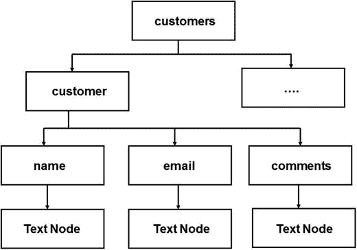

图 2-1。

Tree representation of an XML document

上图的每个部分实际上都是一个节点。英寸 NET 中，节点由一个名为`XmlNode`的抽象类来表示。甚至文本值和属性都是节点。它们的处理方式当然不同于其他节点。

表 [2-1](#Tab1) 中提到的每一个零件都由一个类表示，每个零件都在表 [2-2](#Tab2) 中描述。

表 2-2。

XML DOM Classes

<colgroup><col> <col></colgroup> 
| XML 文档的一部分 | 代表零件的类别 |
| --- | --- |
| 文档元素 | `XmlElement` |
| 处理指令 | `XmlProcessingInstruction` |
| 元素 | `XmlElement` |
| 属性 | `XmlAttribute` |
| 文本值 | `XmlText` |
| 节点 | `XmlNode` |

表 [2-2](#Tab2) 中的所有类都直接或间接继承自一个抽象基类`XmlNode`。当使用`XmlDocument`类时，你会经常使用表 [2-2](#Tab2) 中的一个或另一个类。

## 知道何时使用 DOM

在使用 DOM 访问 XML 文档之前，您应该了解 DOM 最适合的领域以及应该避免使用 DOM 的领域。

决定是否使用 DOM 取决于以下核心因素:

*   读/写访问:DOM 允许您读写 XML 文档。但是您真的需要更改底层文档吗？
*   内存占用:DOM 将整个文档加载到内存中。自然 DOM 的内存占用更大。您的文档很大吗，比如说超过 100MB？
*   访问类型:DOM 允许你随机访问任何节点。这是可能的，因为整个文档树在内存中都是可用的。你需要这样的权限吗？还是顺序访问就足够了？

对上述问题的回答将帮助您决定是否使用 DOM。总而言之，DOM 最适合以下场景:

*   您想要修改 XML 文档，也就是说，只读访问是不够的。
*   您希望随机访问各个节点，也就是说，顺序访问是不够的。
*   您想要处理小尺寸的文档。
*   内存占用不是一个限制。

## 一个示例 XML 文档

在本章中，我们将使用一个 XML 文档，它作为一个名为`Employees.xml`的文件驻留在磁盘上。`Employees.xml`文件如清单 [2-2](#Par28) 所示。

```cs
<?xml version="1.0" encoding="utf-8" ?>
<!-- This is list of employees -->
<employees>
  <employee employeeid="1">
    <firstname>Nancy</firstname>
    <lastname>Davolio</lastname>
    <homephone>(206) 555-9857</homephone>
    <notes>
        <![CDATA[Education includes a BA in psychology from Colorado State University in 1970\. She also completed "The Art of the Cold Call." Nancy is a member of Toastmasters International.]]> 

    </notes>
  </employee>
  <employee employeeid="2">
    <firstname>Andrew</firstname>
    <lastname>Fuller</lastname>
    <homephone>(206) 555-9482</homephone>

    <notes>
        <![CDATA[Andrew received his BTS commercial in 1974 and a Ph.D. in international marketing from the University of Dallas in 1981\. He is fluent in French and Italian and reads German. He joined the company as a sales representative, was promoted to sales manager in January 1992 and to vice president of sales in March 1993\. Andrew is a member of the Sales Management Roundtable, the Seattle Chamber of Commerce, and the Pacific Rim Importers Association.]]> 

    </notes>
  </employee>
  <employee employeeid="3">
    <firstname>Janet</firstname>
    <lastname>Leverling</lastname>
    <homephone>(206) 555-3412</homephone>
    <notes>
       <![CDATA[Janet has a BS degree in chemistry from Boston College (1984).
        She has also completed a certificate program in food retailing management. Janet was hired as a sales associate in 1991 and promoted to sales representative in February 1992.]]>
    </notes>
  </employee>
</employees>
Listing 2-2.A Sample XML Document

```

这个 XML 文档表示雇员的列表。`<employees>`元素构成了文档元素，并包含三个`<employee>`子元素。`<employee>`元素有一个名为`employeeid`的属性和四个子元素:`<firstname>`、`<lastname>`、`<homephone>`和`<notes>`。`<notes>`元素包含存储为`CDATA`的描述性数据。

Note

您可能已经猜到了,`Employees.xml`文件是基于 Northwind 数据库的`Employees`表 SQL Server 的一个示例数据库。当然，对于本章的例子，我们不需要 Northwind 数据库。

若要创建 XML 文件，可以利用 Visual Studio IDE 的帮助，它使您能够通过自动完成结束标记、将属性放在引号中以及显示与文档格式不正确相关的错误来快速创建 XML 文档。因为我们会经常使用该文件，所以我建议您创建该文件，并将其保存在硬盘上方便的位置。

## 打开现有的 XML 文档进行解析

要打开一个现有的 XML 文档，需要使用`XmlDocument`类。`XmlDocument`类允许您以三种常见的方式打开 XML 文档:

*   您可以指定 XML 文件的路径或 URL。
*   您可以使用包含 XML 数据的流对象，比如`FileStream`。
*   您可以在内存中保存一个包含 XML 数据的字符串。

要了解如何使用上述方法，您需要开发一个 Windows 窗体应用，如图 [2-2](#Fig2) 所示。

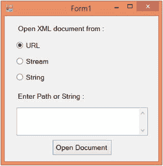

图 2-2。

Opening an XML document

该应用由三个单选按钮组成，用于选择 XML 文档的加载位置。有一个文本框用于输入文件路径、URL 或 XML 字符串。最后，有一个名为 Open Document 的按钮，它根据选择打开 XML 文件，并显示一个带有成功消息的消息框。

Note

我没有在示例中包括任何输入验证或异常处理，以便将示例集中在与 XML 相关的代码上。本书下载中的代码包含基本的验证检查和必要的异常处理。

清单 [2-3](#Par40) 显示了按钮的`Click`事件处理程序。

```cs
private void button1_Click(object sender, EventArgs e)
{
  try
  {
    XmlDocument doc = new XmlDocument();

    if (radioButton1.Checked)
    {
      doc.Load(textBox1.Text);

    }
    if (radioButton2.Checked)
    {
      FileStream stream = new FileStream(textBox1.Text, FileMode.Open);
      doc.Load(stream);

      stream.Close();
    }
    if (radioButton3.Checked)
    {
      doc.LoadXml(textBox1.Text);

    }
    MessageBox.Show("XML Document Opened Successfully!");
  }
  catch(Exception ex)
  {
    MessageBox.Show(ex.Message); 

  }
}
Listing 2-3.Opening an XML Document

```

代码创建了一个`XmlDocument`类的实例。`XmlDocument`类有两个重要的方法:`Load()`和`LoadXml()`。前一种方法可以接受指向要打开的 XML 文档的文件系统路径、URL 或流对象。后一种方法接受包含要加载的 XML 数据的字符串。根据用户的选择，调用`Load()`或`LoadXml()`。请注意，根据选择，您的文本框应该包含 URL、文件系统路径或原始 XML 数据。

Note

您必须导入`System.IO`和`System.Xml`名称空间来成功编译清单 [2-3](#Par40) 中所示的代码。这适用于本章中阐述的大多数例子。

您可以运行应用并提供我们之前创建的`Employees.xml`文件的路径。

## 在 XML 文档中导航

XML 文档由一个或多个节点组成，节点可以嵌套在其他节点中。这种嵌套节点称为子节点。

`XmlNode`类有一个名为`ChildNodes`的集合，其中包含所考虑节点的子节点列表。注意，大多数其他与 DOM 相关的类都直接或间接继承自`XmlNode`类，因此`ChildNodes`集合对它们也是可用的。此外，`XmlNode`类具有诸如`ParentNode`、`FirstChild`、`LastChild`、`NextSibling`和`PreviousSibling`之类的属性，这些属性允许您导航到相应的节点。因此,`ParentNode`属性将允许您访问当前节点的父节点，而`NextSibling`属性将允许您访问与当前节点处于同一级别的下一个节点。

为了了解如何使用这些属性，我们将开发一个 Windows 窗体应用。应用在`Employees.xml`文件中导航，并显示一个`TreeView`控件，其中按照文档结构嵌套了各种节点。

应用如图 [2-3](#Fig3) 所示。

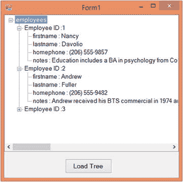

图 2-3。

Navigating through an XML document by using DOM

该应用由一个`TreeView`控件和一个名为 Load Tree 的按钮组成。单击按钮后，应用通过使用`XmlDocument`类加载`Employees.xml`文件。然后，它遍历所有子节点，读取属性和节点的值。然后，XML 节点作为`TreeNodes`添加到`TreeView`中。

清单 [2-4](#Par50) 显示了加载树按钮的`Click`事件处理程序。

```cs
private void button1_Click(object sender, EventArgs e)
{
  XmlDocument doc = new XmlDocument();
  doc.Load($"{Application.StartupPath}\\employees.xml");
  TreeNode root = new TreeNode(doc.DocumentElement.Name);
  treeView1.Nodes.Add(root);
  foreach (XmlNode node in doc.DocumentElement.ChildNodes)
  {
    TreeNode employee = new TreeNode("Employee ID :" +
      node.Attributes["employeeid"].Value);
    root.Nodes.Add(employee);
    if (node.HasChildNodes)
    {
      foreach (XmlNode childnode in node.ChildNodes)
      {
        TreeNode n2 = new TreeNode(childnode.Name + " : "+ childnode.InnerText);
        employee.Nodes.Add(n2);
      }
    }

  }
}
Listing 2-4.Loading the Tree

```

代码创建了一个`XmlDocument`类的实例，并使用其`Load()`方法加载了`Employees.xml`文件。然后代码添加了`TreeView`的根节点。XML 文档的根节点是`<employees>`，可以通过使用`XmlDocument`类的`DocumentElement`属性来访问。`DocumentElement`属性属于`XmlElement`类型。它有一个名为`Name`的属性，返回元素的名称(在我们的例子中是 employees)。

`<employees>`节点包含三个`<employee>`子节点，可以使用`DocumentElement`的`ChildNodes`属性访问。然后一个`foreach`循环遍历它们。随着每一次迭代，一个新的`TreeNode`被添加到`TreeView`中，并将雇员 ID 作为文本。为了访问`employeeid`属性，我们使用了`XmlNode`类的`Attributes`集合。您可以指定属性的索引或名称来检索其值。

然后，代码检查`<employee>`节点是否有更多的子节点。这是通过使用名为`HasChildNodes`的`XmlNode`类的布尔属性来完成的。如果该属性返回`true`，另一个`foreach`循环将遍历`<employee>`节点的子节点。在每次迭代中，都会添加一个新的`TreeNode`,其文本与子节点的名称和值相同。为了检索诸如`<firstname>`、`<lastname>`等节点内的数据，代码使用了`XmlNode`类的`InnerText`属性。属性返回节点及其所有子节点的连接值。

## 寻找特定的元素和节点

通常，我们对加载到内存中的整个 XML 文档不感兴趣，而是对它的一部分感兴趣。这要求我们搜索特定的元素或节点以进行进一步的处理。有几种方法可以用来搜索 XML 文档:

*   使用`GetElementsByTagName()`方法检索特定元素
*   使用`GetElementById()`方法检索特定元素
*   使用`SelectNodes()`方法选择特定节点
*   使用`SelectSingleNode()`方法选择单个特定节点

### 使用 GetElementsByTagName()方法检索特定元素

`XmlDocument`类的`GetElementsByTagName()`方法接受标签的名称(不包括`<`和`>`)并返回所有匹配该标签名称的节点。匹配的节点作为一个`XmlNodeList`返回。`XmlNodeList`类表示一组`XmlNode`对象。

为了看到`GetElementsByTagName()`的运行，我们需要开发一个 Windows 窗体应用，如图 [2-4](#Fig4) 所示。

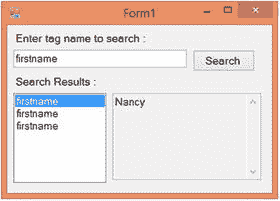

图 2-4。

Using the GetElementsByTagName() method

该应用包含一个文本框，用于输入要查找的标记名。单击“搜索”按钮后，匹配的标签将显示在列表框中。从列表框中选择一个标签会在只读文本框中显示其内容。

清单 [2-5](#Par63) 中显示了使前面的表单工作的代码。

```cs
XmlNodeList list = null;

private void button1_Click(object sender, EventArgs e)
{
  XmlDocument doc = new XmlDocument();
  doc.Load($"{Application.StartupPath}\\employees.xml");
  list = doc.GetElementsByTagName(textBox1.Text);

  listBox1.Items.Clear();
  foreach (XmlNode node in list)
  {
    listBox1.Items.Add(node.Name);
  }
}

private void listBox1_SelectedIndexChanged(object sender, EventArgs e)
{
  textBox2.Text = list[listBox1.SelectedIndex].InnerXml; 

}

Listing 2-5.Using the GetElementsByTagName() Method

```

代码在表单级别声明了一个类型为`XmlNodeList`的变量。这个变量需要在表单级别声明，因为我们需要在两个事件处理程序中访问它。

在搜索按钮的`Click`事件处理程序中，创建了一个`XmlDocument`实例。通过使用它的`Load()`方法将`Employees.xml`文件加载到其中。然后代码调用`XmlDocument`对象的`GetElementsByTagName()`方法，该方法接受要查找的标签名。在我们的应用中，标签在`textBox1`中指定。如前所述，`GetElementsByTagName()`方法的返回值属于`XmlNodeList`类型。`XmlNodeList`类存储了`XmlNode`对象的集合。然后代码遍历返回的`XmlNodeList`并将每个节点名添加到列表框中。

用户可以选择列表框中显示的任何节点。为了显示所选节点的内容，代码处理列表框的`SelectedIndexChanged`事件。在`SelectedIndexChanged`事件处理程序中，从我们之前存储的`XmlNodeList`中检索选择的节点。使用`XmlNode`类的`InnerXml`属性显示所选节点的内容，该属性返回所考虑节点内的所有 XML 内容。

若要查看应用如何工作，请从 Visual Studio IDE 中运行它。在搜索文本框中输入名字，然后单击搜索按钮。列表框应该显示三个`firstname`条目。这是意料之中的，因为我们的 XML 文档包含三个`<employee>`节点，每个节点都有自己的`<firstname>`子元素。点击列表框中的任意`firstname`条目。列表框旁边的文本框应该显示`firstname`节点的值。

### 使用 GetElementById()方法检索特定元素

通常，我们的 XML 元素有一个属性，对于 XML 文档中该元素的每个实例都是唯一的。我们可能希望根据这个属性值来寻找一个特定的元素。这个过程类似于根据主键在数据库中查找记录。然而，不同之处在于,`XmlDocument`类不会自动知道某个特定的属性充当了该元素的主键。形式上，这种属性被称为该元素的 ID。

要传达这些信息，您必须使用 DTD 或模式。这两种技术都可以将属性标记为元素的 ID，然后`XmlDocument`类可以将它们理解为 ID。将 DTD 或模式附加到 XML 文档后，可以调用`XmlDocument`类的`GetElementById()`方法。`GetElementById()`方法接受要搜索的元素的 ID，并将该元素作为`XmlElement`类的实例返回。然后，您可以访问该元素中的子元素或文本。

为了说明`GetElementById()`方法的使用，我们将构建一个如图 [2-5](#Fig5) 所示的应用。

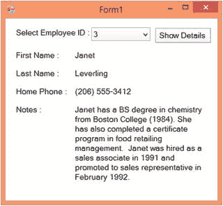

图 2-5。

Using the GetElementByID() method

该应用由一个显示员工 id 列表的组合框组成。在您选择一个 ID 并点击“显示细节”按钮后，将显示诸如`firstname`、`lastname`、`homephone`和`notes`的细节。

在继续应用开发之前，您必须修改`Employees.xml`文件，如清单 [2-6](#Par73) 所示。

```cs
<?xml version="1.0" encoding="utf-8" standalone="yes" ?>
<!-- This is list of employees -->

<!DOCTYPE employees [

  <!ELEMENT employees ANY>

  <!ELEMENT employee ANY>

  <!ELEMENT firstname ANY>

  <!ELEMENT lastname ANY>

  <!ELEMENT homephone ANY>

  <!ELEMENT notes ANY>

  <!ATTLIST employee employeeid ID #REQUIRED>

]>

<employees>
  <employee employeeid="1">
    <firstname>Nancy</firstname>
    <lastname>Davolio</lastname>
    <homephone>(206) 555-9857</homephone>
    <notes>
        <![CDATA[Education includes a BA in psychology from Colorado State University in 1970\. She also completed "The Art of the Cold Call." Nancy is a member of Toastmasters International.]]>
    </notes>
  </employee>
  <employee employeeid="2">
    <firstname>Andrew</firstname>
    <lastname>Fuller</lastname>
    <homephone>(206) 555-9482</homephone>

    <notes>
       <![CDATA[Andrew received his BTS commercial in 1974 and a Ph.D.
       in international marketing from the University of Dallas in 1981.
        He is fluent in French and Italian and reads German. He joined the company as a sales representative, was promoted to sales manager in January 1992 and to vice president of sales in March 1993\. Andrew is a member of the Sales Management Roundtable, the Seattle Chamber of Commerce, and the Pacific Rim Importers Association.]]>
    </notes>
  </employee>
  <employee employeeid="3">
    <firstname>Janet</firstname>
    <lastname>Leverling</lastname>

    <homephone>(206) 555-3412</homephone>
    <notes>
      <![CDATA[Janet has a BS degree in chemistry from Boston College (1984).
        She has also completed a certificate program in food retailing management. Janet was hired as a sales associate in 1991 and promoted to sales representative in February 1992.]]>
    </notes>
  </employee>
</employees>

Listing 2-6.XML File with DTD

```

这份文件看起来和原件几乎一模一样。但是，在顶部添加了一个重要的部分(见粗体显示的标记)。我们为我们的文档添加了一个 DTD。我不会在这里深入讨论 DTD 的细节，但可以说,`ATTLIST`部分为`<employee>`元素定义了一个名为`employeeid`的属性。更重要的是，`employeeid`属性被标记为 ID，也是一个`REQUIRED`属性。这就是`XmlDocument`类如何知道元素的哪个属性充当 ID。

如果您查看应用的源代码，您会看到一个名为`doc`的`XmlDocument`类型的表单级变量:

```cs
XmlDocument doc = new XmlDocument();

```

表单的`Load`事件处理程序具有清单 [2-7](#Par78) 中所示的代码。

```cs
private void Form1_Load(object sender, EventArgs e)
{
  doc.Load($"{Application.StartupPath}\\employees.xml");
  foreach (XmlNode node in doc.DocumentElement.ChildNodes)
  {
    string employeeid = node.Attributes["employeeid"].Value;

    comboBox1.Items.Add(employeeid);
  }
}
Listing 2-7.Populating the Combo Box

```

代码通过使用它的`Load()`方法在我们之前创建的`XmlDocument`实例中加载新的`Employees.xml`文件。然后一个`foreach`循环遍历所有的`<employee>`节点。在每次迭代中，使用`XmlNode`类的`Attributes`集合检索`<employee>`节点的`employeeid`属性。属性值被添加到组合框中。

当用户选择一个特定的 ID 时，将显示该员工的详细信息。这在 Show Details 按钮的`Click`事件处理程序中完成。`Click`事件处理程序内部的代码如清单 [2-8](#Par81) 所示。

```cs
private void button1_Click(object sender, EventArgs e)
{
  XmlElement ele= doc.GetElementById(comboBox1.SelectedItem.ToString());

  label6.Text = ele.ChildNodes[0].InnerText; 

  label7.Text = ele.ChildNodes[1].InnerText;
  label8.Text = ele.ChildNodes[2].InnerText;
  label9.Text = ele.ChildNodes[3].InnerText;
}
Listing 2-8.Calling the GetElementById() Method

```

代码调用`XmlDocument`类的`GetElementById()`方法，并传递要查找的雇员 ID。`GetElementById()`方法将匹配元素作为类型为`XmlElement`的对象返回。因为`XmlElement`类继承自`XmlNode`类，所以`ChildNodes`集合也可用于`XmlElement`类。为了检索`<firstname>`、`<lastname>`、`<homephone>`和`<notes>`节点的值，通过使用相应元素的索引来访问`ChildNodes`集合。最后，每个`XmlNode`的`InnerText`属性给出适当节点内的文本。

### 使用 SelectNodes()方法选择特定节点

在复杂的情况下，您可能希望搜索与模式匹配的节点。这是借助 XPath 完成的。虽然 XPath 不是本章的主题，但是我会让您大致了解如何使用它。我在第 4 章[中详细解释了 XPath。](04.html)

`XmlDocument`类有一个名为`SelectNodes()`的方法，该方法接受过滤可用节点的 XPath 标准。它返回一个包含匹配节点的`XmlNodeList`。

为了了解`SelectNodes()`方法是如何工作的，我们需要开发一个 Windows 窗体应用，如图 [2-6](#Fig6) 所示。


图 2-6。

Using the SelectNodes() method

该应用包含一个文本框，用于输入雇员的名字或姓氏。单选按钮允许您选择是查找匹配的名字还是姓氏。单击 Search 按钮后，调用`SelectNodes()`方法。返回的`<employee>`节点被收集在一个`XmlNodeList`中。组合框显示匹配的员工 id 列表。您可以选择一个员工 ID，然后单击“显示详细信息”按钮来显示员工的详细信息。

如果您查看应用的源代码，您会发现在表单级别有一个类型为`XmlNodeList`的变量声明:

```cs
XmlNodeList list = null;

```

我们在表单级别声明该变量，因为它在多个事件处理函数中使用。

搜索按钮的`Click`事件处理程序如清单 [2-9](#Par91) 所示。

```cs
private void button1_Click(object sender, EventArgs e)
{
  XmlDocument doc = new XmlDocument();
  doc.Load($"{Application.StartupPath}\\employees.xml");
  if (radioButton1.Checked)
  {
    list = doc.SelectNodes($"//employee[./firstname/text()='{textBox1.Text}']");

  }
  else
  {
    list = doc.SelectNodes($"//employee[./lastname/text()='{textBox1.Text}']");

  }
  foreach (XmlNode node in list) 

  {
    comboBox1.Items.Add(node.Attributes["employeeid"].Value);
  }
}
Listing 2-9.Using the SelectNodes() Method

```

前面的代码首先创建了一个`XmlDocument`类的实例。然后它通过使用`Load()`方法加载`Employees.xml`文件。此外，它还检查单选按钮，以确定是基于名字还是姓氏进行搜索。我们希望搜索其`<firstname>`或`<lastname>`与文本框中输入的值相匹配的`<employee>`节点。这是通过调用`XmlDocument`类的`SelectNodes()`方法来完成的。`SelectNodes()`方法获取 XPath 字符串并返回包含匹配节点的`XmlNodeList`。仔细看看 XPath 语法。因为我们想要选择`<employee>`节点，所以我们指定了`//employee`。但是我们对选择所有的`<employee>`节点不感兴趣，所以我们将过滤标准放在一对方括号中(`[]`)。为了表示`<firstname>`和`<lastname>`节点的文本值，我们使用了`text()` XPath 函数。

然后代码遍历`XmlNodeList`并将员工 id 添加到组合框中。通过使用`XmlNode`类的`Attributes`集合来检索`employeeid`属性的值。

用户将选择他们想要查看其详细信息的员工 ID，并单击 Show Details 按钮。清单 [2-10](#Par95) 显示了 Show Details 按钮的`Click`事件处理程序的代码。

```cs
private void button2_Click(object sender, EventArgs e)
{
  label8.Text = list[comboBox1.SelectedIndex].ChildNodes[0].InnerText;
  label9.Text = list[comboBox1.SelectedIndex].ChildNodes[1].InnerText;
  label10.Text = list[comboBox1.SelectedIndex].ChildNodes[2].InnerText;
  label11.Text = list[comboBox1.SelectedIndex].ChildNodes[3].InnerText;
}
Listing 2-10.Displaying Employee Details

```

代码只是从`XmlNodeList`中检索所需的`XmlNode`。节点的子节点通过使用`ChildNodes`集合来访问。`XmlNode`类的`InnerText`属性返回每个子节点的文本。

### 使用 SelectSingleNode()方法选择单个特定节点

`SelectSingleNode()`和你刚学的`SelectNodes()`方法很像，有一点不同。它不是以一个`XmlNodeList`的形式返回一个`XmlNode`对象列表，而是简单地返回第一个匹配的`XmlNode`。

为了测试这个方法，您可以修改前面的例子，如清单 [2-11](#Par99) 所示。

```cs
XmlNode node = null;

private void button1_Click(object sender, EventArgs e)
{
  XmlDocument doc = new XmlDocument();
  doc.Load($"{Application.StartupPath}\\employees.xml");
  if (radioButton1.Checked)
  {
    node = doc.SelectSingleNode($"//employee[./firstname/text()='{textBox1.Text}']");

  }
  else
  {
    node = doc.SelectSingleNode($"//employee[./lastname/text()='{textBox1.Text}']");

  }
  if (node != null)
  {
    comboBox1.Items.Add(node.Attributes["employeeid"].Value);
  }
}

private void button2_Click(object sender, EventArgs e)
{
  label8.Text = node.ChildNodes[0].InnerText;
  label9.Text = node.ChildNodes[1].InnerText;
  label10.Text = node.ChildNodes[2].InnerText;
  label11.Text = node.ChildNodes[3].InnerText; 

}

Listing 2-11.Using the SelectSingleNode() Method

```

代码现在在表单级别声明了一个类型为`XmlNode`的变量。搜索按钮的`Click`事件处理程序调用`SelectSingleNode()`方法，该方法接受与上例相同的 XPath 表达式。这个方法返回第一个匹配的节点，而不是一个`XmlNodeList`，尽管我们的搜索标准不一定会返回任何匹配的节点。因此，只有当`XmlNode`变量不为空时，代码才会访问它。在 Show Details 按钮的`Click`事件中，`XmlNode`变量`node`用于检索雇员的详细信息。

## 修改 XML 文档

到目前为止，我们已经看到了如何读取 XML 文档；如何浏览它们；以及如何根据标记名、id 和 XPath 表达式来搜索它们。但是修改它们呢？这就是本节的主题。

业务需求通常要求修改底层的 XML 文档。这种修改可以是节点或属性的添加、删除或改变。如前所述，DOM 是一个读写解析器。这意味着 DOM APIs 也允许您修改文档。

为了说明如何使用几个`System.Xml`类来修改 XML 文档，我们将开发一个 Windows 窗体应用，如图 [2-7](#Fig7) 所示。


图 2-7。

Data entry screen for the Employees.xml file

该应用为`Employees.xml`文件提供了一个完整的数据输入屏幕。该应用允许我们执行以下任务:

*   借助 VCR 按钮在可用员工中导航(用于导航到上一条、下一条、第一条和最后一条记录的按钮通常称为 VCR 按钮)。
*   添加新员工。
*   修改特定员工的详细信息。employee ID 属性就像我们的 XML 文档的主键，因此它不能被更改。
*   删除现有员工。

如果您查看前面应用的源代码，您会看到两个表单级变量，如下所示:

```cs
XmlDocument doc = new XmlDocument();
int CurrentNodeIndex = 0;

```

在整个应用中都使用了`XmlDocument`实例。整数变量`CurrentNodeIndex`用于跟踪当前显示的员工记录(主要由导航按钮使用)。

表单的`Load`事件处理程序如清单 [2-12](#Par113) 所示。

```cs
private void Form1_Load(object sender, EventArgs e)
{
  doc.Load($"{Application.StartupPath}\\employees.xml");
  foreach (XmlNode node in doc.DocumentElement.ChildNodes)
  {
    comboBox1.Items.Add(node.Attributes["employeeid"].Value);
  }
  FillControls();
}
Listing 2-12.Filling Controls

```

前面的代码通过使用`Load()`方法加载`Employees.xml`文件。然后，它遍历所有的`<employee>`节点，并用员工 id 填充组合框。通过使用`XmlNode`类的`Attributes`集合来检索`employeeid`属性。最后，代码调用一个名为`FillControls()`的助手方法。这个方法只是在不同的文本框中显示当前`<employee>`节点的名字、姓氏、住宅电话和注释。我们很快就会看到`FillControls()`方法。

### 在各种节点之间导航

该应用允许您在 VCR 导航按钮的帮助下在各种`<employee>`节点之间导航。清单 [2-13](#Par116) 展示了导航按钮是如何工作的。

```cs
//go to first record
private void button4_Click(object sender, EventArgs e)
{
  CurrentNodeIndex = 0;
  FillControls();
}

//go to previous record
private void button5_Click(object sender, EventArgs e)
{
  CurrentNodeIndex--;
  if (CurrentNodeIndex < 0)
  {
    CurrentNodeIndex = 0;
  }
  FillControls();
}

//go to next record

private void button6_Click(object sender, EventArgs e)
{
  CurrentNodeIndex++;
  if (CurrentNodeIndex >= doc.DocumentElement.ChildNodes.Count)
  {
    CurrentNodeIndex = doc.DocumentElement.ChildNodes.Count-1;
  }
  FillControls();
}

//go to last record
private void button7_Click(object sender, EventArgs e)
{
  CurrentNodeIndex = doc.DocumentElement.ChildNodes.Count - 1;
  FillControls();
}

Listing 2-13.Working of Navigation Buttons

```

在`Click`事件中的第一条记录(< `CurrentNodeIndex`)变量为`0`并调用`FillControls()`方法。然后，`FillControls()`方法根据`CurrentNodeIndex`变量的值填充各种控件。

前一条记录的`Click`事件处理程序(`CurrentNodeIndex`变量)。如果该值变得小于零，事件处理程序将其设置为`0`。然后调用`FillControls()`方法。

在下一条记录(>)按钮的`Click`事件处理程序中，代码递增`CurrentNodeIndex`变量。如果该值超过了`<employee>`节点的总数，事件处理程序将设置一个新值，即雇员节点总数减 1。这是必要的，因为就像 .NET 中，`ChildNodes`集合是从零开始的。

最后，最后一条记录(> >)按钮的`Click`事件处理程序将`CurrentNodeIndex`变量设置为雇员节点总数减 1。

现在您已经知道了应用的导航系统是如何工作的，让我们继续更有趣的部分——修改、删除和添加 XML 内容。

### 修改现有内容

要修改一个`<employee>`节点，我们首先需要从`<employee>`节点列表中检索它。员工的 ID 将从组合框中获取。要检索`<employee>`节点，我们可以使用`SelectNodes()`或`SelectSingleNode()`方法。在我们的例子中，因为只有一个`<employee>`节点匹配给定的雇员 ID，所以`SelectSingleNode()`是更好的选择。在检索到对`<employee>`节点的引用后，我们可以更改它的子节点。清单 [2-14](#Par123) 显示了实现该逻辑的完整代码。

```cs
private void button2_Click(object sender, EventArgs e)
{
  XmlNode node=doc.SelectSingleNode($"//employee[@employeeid='{comboBox1.Text}']");

  if (node != null)
  {
    node.ChildNodes[0].InnerText = textBox1.Text;

    node.ChildNodes[1].InnerText = textBox2.Text;

    node.ChildNodes[2].InnerText = textBox3.Text;

    XmlCDataSection notes = doc.CreateCDataSection(textBox4.Text);

    node.ChildNodes[3].ReplaceChild(notes, node.ChildNodes[3].ChildNodes[0]);

  }
  doc.Save($"{Application.StartupPath}\\employees.xml");

}
Listing 2-14.Modifying Existing Content

```

首先，代码通过使用`SelectSingleNode()`方法检索匹配所选雇员 ID 的`<employee>`节点。仔细记下使用的 XPath 表达式。在 XPath 表达式中，属性以`@`符号为前缀。因此`@employeeid`指的是`<employee>`节点的`employeeid`属性。`SelectSingleNode()`方法以`XmlNode`对象的形式返回选中的节点。在我们继续修改它的内容之前，我们需要确保`SelectSingleNode()`已经返回了一个节点。这是通过检查返回的节点是否为空来完成的。

从`SelectSingleNode()`方法返回的`XmlNode`将是一个`<employee>`节点。这意味着它将有四个子节点:`<firstname>`、`<lastname>`、`<homephone>`和`<notes>`。这四个子节点的`InnerText`属性不过是对应节点的文本值。在`if`条件中，代码将所有四个子节点的`InnerText`属性设置为各自文本框中的值。这里有一件有趣的事情需要注意。`<notes>`元素包含自由文本，可以显示特殊的标记符号，如`<`、`>`和`"`。如果我们简单地将`<notes>`节点的`InnerText`属性赋给新值，那么在以后访问文档时会产生问题。

请记住，我们将`<notes>`节点的内容写成了一个`CDATA`节来避免这样的问题，所以我们也必须将新数据写成一个`CDATA`节。`CDATA`部分由一个名为`XmlCDataSection`的类表示。`XmlDocument`类的`CreateCDataSection()`方法用提供的文本创建一个新的`CDATA`部分(提供的整个文本放在`<![CDATA[. . .]]>`中)。为了更改现有的`CDATA`部分的内容，代码调用了`XmlNode`类的`ReplaceChild()`方法。`ReplaceChild()`方法接受新节点和旧节点作为参数。然后用新节点替换旧节点。

对 XML 文档进行任何更改后，必须将整个文档保存到磁盘上，以便保存更改。这是使用`XmlDocument`类的`Save()`方法完成的。`Save()`方法接受您想要保存文件的目标路径。在我们的例子中，因为我们想用修改后的版本覆盖现有的`Employees.xml`文件，所以我们提供了与原始文件相同的路径。

### 删除现有内容

删除一个`<employee>`节点需要根据员工 ID 从可用员工列表中找到它，然后将其从文档中删除。实现删除特性的代码如清单 [2-15](#Par129) 所示。

```cs
private void button3_Click(object sender, EventArgs e)
{
  XmlNode node = doc.SelectSingleNode($"//employee[@employeeid='{comboBox1.Text}']");

  if (node != null)
  {
    doc.DocumentElement.RemoveChild(node);

  }
  doc.Save($"{Application.StartupPath}\\employees.xml");

  UpdateLabel();
}
Listing 2-15.Deleting a Node

```

代码通过使用`SelectsSingleNode()`方法检索我们想要删除的节点。为了从`ChildNodes`集合中删除一个节点，`XmlNode`类提供了一个叫做`RemoveChild()`的方法。`RemoveChild()`方法接受对要从`ChildNodes`集合中移除的`XmlNode`的引用。在我们的例子中，我们想要删除整个`<employee>`节点，它是`<employees>`根元素的子节点。因此，代码在`DocumentElement`上调用`RemoveChild()`方法，也就是文档的根节点。

删除节点后，使用`XmlDocument`类的`Save()`方法将文件保存到磁盘。`UpdateLabel()`助手方法只是更新显示在状态标签上的当前记录号。

### 添加新内容

添加新雇员的代码比我们前面的例子要长一些。它也更有趣。现在，您将学习如何从头开始创建 XML 文档内容。创建元素、属性、文本节点和`CDATA`部分都将在这一节中进行解释。

首先，让我们计算一下为了向 XML 文档中添加一名新员工而需要创建的元素、属性和节点。以下是我们需要添加的节点列表:

*   一个`<employee>`元素
*   一个`<firstname>`元素
*   一个`<lastname>`元素
*   一个`<homephone>`元素
*   一个`<notes>`元素
*   `<employee>`元素的`employeeid`属性
*   用于`<firstname>`值的文本节点
*   用于`<lastname>`值的文本节点
*   用于`<homephone>`值的文本节点
*   用于`<notes>`值的`CDATA`部分

注意一件重要的事情:作为`<firstname>`、`<lastname>`、`<homephone>`和`<notes>`元素的值出现的文本也被视为一个节点。

清单 [2-16](#Par146) 显示了实现员工添加的完整代码。

```cs
private void button1_Click(object sender, EventArgs e)
{
  XmlElement employee = doc.CreateElement("employee");
  XmlElement firstname = doc.CreateElement("firstname");
  XmlElement lastname = doc.CreateElement("lastname");
  XmlElement homephone = doc.CreateElement("homephone");
  XmlElement notes = doc.CreateElement("notes");

  XmlAttribute employeeid = doc.CreateAttribute("employeeid");
  employeeid.Value = comboBox1.Text;

  XmlText firstnametext = doc.CreateTextNode(textBox1.Text);
  XmlText lastnametext = doc.CreateTextNode(textBox2.Text);
  XmlText homephonetext = doc.CreateTextNode(textBox3.Text);
  XmlCDataSection notestext = doc.CreateCDataSection(textBox4.Text);

  employee.Attributes.Append(employeeid); 

  employee.AppendChild(firstname);
  employee.AppendChild(lastname);
  employee.AppendChild(homephone);
  employee.AppendChild(notes);

  firstname.AppendChild(firstnametext);
  lastname.AppendChild(lastnametext);
  homephone.AppendChild(homephonetext);
  notes.AppendChild(notestext);

  doc.DocumentElement.AppendChild(employee);
  doc.Save($"{Application.StartupPath}\\employees.xml");

  UpdateLabel();

}

Listing 2-16.Adding a New Node

```

代码通过使用`XmlDocument`类的`CreateElement()`方法创建了五个元素。这五种元素是`<employee>`、`<firstname>`、`<lastname>`、`<homephone>`和`<notes>`。`CreateElement()`方法接受元素的标记名，并返回一个类型为`XmlElement`的对象。注意`XmlElement`继承自`XmlNode`类。

属性由`XmlAttribute`类表示，并使用`XmlDocument`类的`CreateAttribute()`方法创建。`CreateAttribute()`方法接受属性名作为参数，在这里是`employeeid`。属性的值可以通过设置`XmlAttribute`类的`Value`属性来分配。

代码继续创建三个文本节点，分别代表`<firstname>`、`<lastname>`和`<homephone>`元素的值。文本节点由一个名为`XmlText`的类表示。为了创建这些文本节点，代码使用了`XmlDocument`类的`CreateTextNode()`方法。`CreateTextNode()`方法接受文本节点的值作为参数。

如前所述，`<notes>`元素包含字符数据(`CDATA`),`CDATA`部分由一个名为`XmlCDataSection`的类表示。正如我们之前所做的，我们通过使用`XmlDocument`类的`CreateCDataSection()`方法来创建`CDATA`部分。

这就完成了元素、属性和节点的创建。然后，代码按照所需的 XML 结构嵌套各种元素。

一个`XmlNode`的所有属性都存储在它的`Attributes`集合中。为了将`employeeid`属性添加到`<employee>`元素，使用了`Attributes`集合的`Append()`方法。`Append()`方法接受`XmlAttribute`类的一个实例。

`XmlNode`类的`AppendChild()`方法接受另一个`XmlNode`,并使其成为调用过`AppendChild()`的节点的子节点。代码在`<employee>`元素上调用`AppendChild()`方法，并将其余四个元素添加为其子元素。

接下来，代码通过使用相同的`AppendChild()`方法将所有文本节点和`CDATA`部分添加到它们各自的父节点。

最后，整个`<employee>`节点被附加到`DocumentElement`，即`<employees>`根节点。因为我们向文档添加了一个新节点，所以需要使用`Save()`方法将更改后的文档保存到磁盘。

### 使用助手方法

在前面的代码中，我们经常使用两个助手方法:`FillControls()`和`UpdateLabel()`。这些方法如清单 [2-17](#Par157) 所示。

```cs
private void FillControls()

{
  XmlNode node = doc.DocumentElement.ChildNodes[CurrentNodeIndex];
  comboBox1.Text = node.Attributes["employeeid"].Value;
  textBox1.Text = node.ChildNodes[0].InnerText;
  textBox2.Text = node.ChildNodes[1].InnerText;
  textBox3.Text = node.ChildNodes[2].InnerText;
  textBox4.Text = node.ChildNodes[3].InnerText;
  UpdateLabel();
}

private void UpdateLabel()
{
  label6.Text = $"Employee {(CurrentNodeIndex + 1)} of {doc.DocumentElement.ChildNodes.Count}";

}

Listing 2-17.Helper Methods Used in the Application

```

`FillControls()`方法获取对要显示的`<employee>`节点的引用。这个节点的索引由`CurrentNodeIndex`变量表示。从节点的`Attributes`集合中检索出`employeeid`，并显示在组合框中。其他文本框分别用`<firstname>`、`<lastname>`、`<homephone>`和`<notes>`的`InnerText`填充。

`UpdateLabel()`方法只是将导航状态标签的`Text`属性设置为当前雇员索引。

## 处理空白

您已经学习了如何通过使用`XmlDocument`和相关的类来读写 XML 文档。在各种操作中，我们很少被空白所困扰。空白包括空格、制表符、回车等字符。默认情况下，当您加载文档(通过`Load()`方法或`LoadXml()`方法)或保存文档(通过使用`Save()`方法)时，`XmlDocument`类将忽略任何空白。您可以通过使用一个名为`PreserveWhitespace`的布尔属性来切换这种行为。将该属性设置为`true`将保留空白，而设置为`false`将忽略空白。

为了查看`PreserveWhitespace`属性带来的不同，让我们创建一个简单的应用，如图 [2-8](#Fig8) 所示。

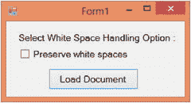

图 2-8。

Importance of the PreserveWhiteSpace property

该应用包含一个复选框，允许您切换是否保留空白。当您单击 Load Document 按钮时，它只是通过使用`Load()`方法加载`Employees.xml`文件，并在一个消息框中显示全部内容。

加载文档按钮的`Click`事件处理程序内的代码如清单 [2-18](#Par164) 所示。

```cs
private void button1_Click(object sender, EventArgs e)
{
  XmlDocument doc = new XmlDocument();
  doc.PreserveWhitespace = checkBox1.Checked;
  doc.Load($"{Application.StartupPath}\\employees.xml");
  MessageBox.Show(doc.InnerXml);
}
Listing 2-18.Loading a Document

```

代码创建了一个`XmlDocument`类的实例，并将其`PreserveWhitespace`属性设置为通过复选框选择的属性。这意味着如果用户选择复选框，`true`将被分配；否则，`false`将被赋值。然后使用`Load()`方法加载`Employees.xml`文件。通过使用`XmlDocument`实例的`InnerXml`属性检索文件的完整内容，并显示在一个消息框中。

图 [2-9](#Fig9) 显示了取消选择复选框时显示的消息框。相反，图 [2-10](#Fig10) 显示复选框被选中时的消息框。

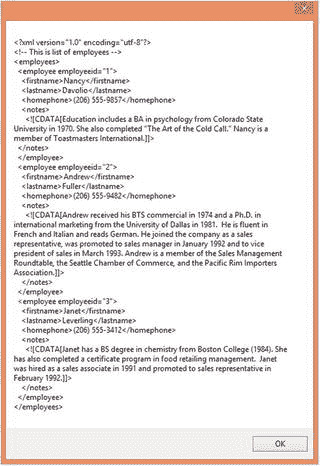

图 2-10。

Output with the PreserveWhitespace property set to true

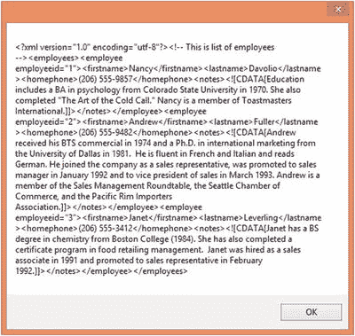

图 2-9。

Output with the PreserveWhitespace property set to false

您可以看到不同之处:第二个消息框显示保留了空白。

`PreserveWhitespace`属性会影响你的解析逻辑吗？这个问题的答案是肯定的。为了说明这个属性对文档解析的影响，让我们修改前面的应用，如清单 [2-19](#Par169) 所示。

```cs
private void button1_Click(object sender, EventArgs e)
{
  XmlDocument doc = new XmlDocument();
  doc.PreserveWhitespace = checkBox1.Checked;
  doc.Load($"{Application.StartupPath}\\employees.xml");
  MessageBox.Show($"Employee node contains {doc.DocumentElement.ChildNodes.Count} child nodes");

}
Listing 2-19.Effect of the PreserveWhitespace Property

```

前面的代码与前面的例子几乎相同，但是这一次，消息框显示了文档元素的子节点总数，即根节点`<employees>`。分别将`PreserveWhitespace`属性设置为`false`和`true`的结果消息框见图 [2-11](#Fig11) 和 [2-12](#Fig12) 。

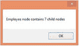

图 2-12。

Result when the PreserveWhitespace property is true

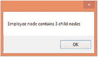

图 2-11。

Result when the PreserveWhitespace property is false

惊讶吗？我们的文档中有三个`<employee>`元素。这意味着`<employees>`节点有三个子节点。图 [2-11](#Fig11) 的消息框与此事实一致。但是，当您将`PreserveWhitespace`属性设置为`true`时，消息框显示`<employees>`元素有七个子节点。保留空白向`<employees>`元素添加了四个子节点。这些额外的节点属于`XmlWhiteSpace`类型。如果您通过索引访问不同的节点，切换空白会导致您的逻辑失败。还有一个与空白相关的类:`XmlSignificantWhitespace`。`XmlSignificantWhitespace`类表示混合内容节点中标记之间的空白。

理解`XmlWhiteSpace`和`XmlSignificantWhitespace`的区别很重要。考虑清单 [2-20](#Par173) 中显示的标记。

```cs
<?xml version="1.0" ?>
<root>
  <fullname>Nancy Davolio</fullname>
  <address>
    507 - 20th Ave. E. Apt. 2A
    Seattle,
    WA 98122
    USA
  </address>
</root>
Listing 2-20.Understanding the Difference Between the XmlWhiteSpace and XmlSignificantWhiteSpace Classes

```

在清单 [2-20](#Par173) 所示的标记中，有几个空白区域。首先，在标签之间有空白，比如`<root>`、`<fullname>`和`<address>`。请记住，在 XML 中，回车和换行符也被认为是空白。各种元素之间的空白主要用于提高文档的可读性，由`XmlWhiteSpace`类表示。其次，在`<address>`节点的内容中嵌入了空格。例如，在文本`Seattle`和`WA 98122`之后有回车和换行符。这种类型的空白由`XmlSignificantWhiteSpace`类表示。

## 处理名称空间

XML 名称空间的概念类似于 .NET 命名空间。XML 名称空间通过唯一限定 XML 文档中使用的元素和属性名称，允许您将元素标识为单个组(名称空间)的一部分。每个名称空间由统一资源标识符(URI)标识。这使得开发人员可以将来自不同数据结构的信息组合到一个 XML 文档中，而不会在元素名称中引起歧义和混淆。

例如，假设您有两个 XML 片段，一个与雇员相关，另一个与客户相关。进一步假设两个片段都包含一个名为`<name>`的标签。问题是当你将它们混合在一起时，你会对标签`<name>`产生歧义。在这种情况下，XML 名称空间就派上了用场。

来看看如何 .NET 框架提供了对 XML 命名空间的支持，我们将修改`Employees.xml`，如清单 [2-21](#Par178) 所示。

```cs
<?xml version="1.0" encoding="utf-8" ?>
<!-- This is list of employees -->

<emp:employees xmlns:emp="http://localhost/employees">

  <emp:employee employeeid="1">

    <emp:firstname>Nancy</emp:firstname>

    <emp:lastname>Davolio</emp:lastname>

    <emp:homephone>(206) 555-9857</emp:homephone>

    <emp:notes>

        <![CDATA[Education includes a BA in psychology from Colorado State University in 1970\. She also completed "The Art of the Cold Call." Nancy is a member of Toastmasters International.]]>

    </emp:notes>

  </emp:employee>

  <emp:employee employeeid="2">
    <emp:firstname>Andrew</emp:firstname>
    <emp:lastname>Fuller</emp:lastname>
    <emp:homephone>(206) 555-9482</emp:homephone>
    <emp:notes>
        <![CDATA[Andrew received his BTS commercial in 1974 and a Ph.D.
        in international marketing from the University of Dallas in 1981\. He is fluent in French and Italian and reads German. He joined the company as a sales representative, was promoted to sales manager in January 1992 and to vice president of sales in March 1993\. Andrew is a member of the Sales Management Roundtable, the Seattle Chamber of Commerce, and the Pacific Rim Importers Association.]]> 

    </emp:notes>
  </emp:employee>
  <emp:employee employeeid="3">
    <emp:firstname>Janet</emp:firstname>
    <emp:lastname>Leverling</emp:lastname>
    <emp:homephone>(206) 555-3412</emp:homephone>
    <emp:notes>
        <![CDATA[Janet has a BS degree in chemistry from Boston College (1984). She has also completed a certificate program in food retailing management. Janet was hired as a sales associate in 1991 and promoted to sales representative in February 1992.]]>
    </emp:notes>
  </emp:employee>

</emp:employees>
Listing 2-21.XML Document with Namespaces

```

这是同一个文档，但是我们给它添加了一个名称空间。请看粗体显示的标记。在根元素`<employees>`中，我们用 URI `http://localhost/employees`指定了一个名为`emp`的 XML 名称空间。虽然使用 URL 作为名称空间 URIs 是一种常见的做法，但是任何唯一的字符串都可以。注意所有的标签名称都带有前缀`emp`。您可以通过使用`XmlNode`类的三个属性来访问名称空间细节:`NamespaceURI`、`Prefix`和`LocalName`。

为了说明如何使用这些属性，我们将开发一个如图 [2-13](#Fig13) 所示的应用。

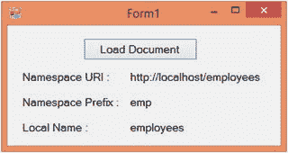

图 2-13。

Retrieving namespace details

应用加载我们新版本的`Employees.xml`，并提取文档元素的`NamespaceURI`、`Prefix`和`LocalName`属性。名称空间的详细信息显示在标签中。清单 [2-22](#Par182) 显示了加载文档按钮的`Click`事件处理程序。

```cs
private void button1_Click(object sender, EventArgs e)
{
  XmlDocument doc = new XmlDocument();
  doc.Load($"{Application.StartupPath}\\employees.xml");
  label4.Text = doc.DocumentElement.NamespaceURI;
  label5.Text = doc.DocumentElement.Prefix;
  label6.Text = doc.DocumentElement.LocalName; 

}
Listing 2-22.Retrieving Namespace Details

```

代码通过使用`Load()`方法加载`Employees.xml`文件。然后，它简单地检索`NamespaceURI`、`Prefix`和`LocalName`属性的值。需要注意的一点是，这三个属性都是只读属性。如果您想写这些细节，您必须在从`XmlDocument`类创建属性、元素和节点时提供它们。`XmlDocument`类的方法，比如`CreateElement()`和`CreateAttribute()`，有适当的重载，允许你指定名称空间的细节。

## 了解 XmlDocument 类的事件

无论何时修改 XML 文档，`XmlDocument`类都会引发几个事件。这些事件遵循前后模式。前置事件在实际操作之前引发，而后置事件在操作结束后引发。这些事件总结在表 [2-3](#Tab3) 中。

表 2-3。

Events of the XmlDocument Class

<colgroup><col> <col></colgroup> 
| 事件名称 | 描述 |
| --- | --- |
| `NodeChanging` | 当属于此文档的节点的值将要更改时，将引发此事件。 |
| `NodeChanged` | 当属于此文档的节点的值已更改时，将引发此事件。 |
| `NodeRemoving` | 当属于此文档的节点即将从文档中移除时，将引发此事件。 |
| `NodeRemoved` | 当属于此文档的节点已从其父级中移除时，将引发此事件。 |
| `NodeInserting` | 当属于此文档的节点将要插入另一个节点时，将引发此事件。 |
| `NodeInserted` | 当属于此文档的节点被插入到另一个节点中时，将引发此事件。 |

上表中指定的每个事件都接收一个类型为`XmlNodeChangedEventArgs`的事件参数。`XmlNodeChangedEventArgs`类提供了几个属性。其中一些列于表 [2-4](#Tab4) 中。

表 2-4。

Properties of the XmlNodeChangedEventArgs Class

<colgroup><col> <col></colgroup> 
| 财产 | 描述 |
| --- | --- |
| `Action` | 提供有关导致节点更改的操作的信息。该属性是类型为`XmlNodeChangedAction`的枚举。可能的值包括`Change`、`Remove`和`Insert`。 |
| `OldParent` | 返回操作前正在更改的节点的父节点`XmlNode`。 |
| `NewParent` | 返回操作后被更改节点的父节点`XmlNode`。 |
| `OldValue` | 返回操作前节点的值。 |
| `NewValue` | 操作完成后返回节点的值。 |
| `Node` | 返回一个代表受影响节点的`XmlNode`对象。 |

为了查看这些事件的运行情况，我们将修改之前开发的相同的员工数据输入应用。

修改`Form_Load`事件处理程序，如清单 [2-23](#Par188) 所示。

```cs
private void Form1_Load(object sender, EventArgs e)
{
  doc.Load($"{Application.StartupPath}\\employees.xml");

  doc.NodeChanged += new XmlNodeChangedEventHandler(doc_NodeChanged);

  doc.NodeInserted += new XmlNodeChangedEventHandler(doc_NodeInserted);

  doc.NodeRemoved += new XmlNodeChangedEventHandler(doc_NodeRemoved);

  foreach (XmlNode node in doc.DocumentElement.ChildNodes)
  {
    comboBox1.Items.Add(node.Attributes["employeeid"].Value);
  }
  FillControls();
}

Listing 2-23.Attaching Event Handlers

```

请注意用粗体标记的行。代码将事件处理程序分别附加到`NodeChanged`、`NodeRemoved`和`NodeInserted`事件。这些事件属于委托类型`XmlNodeChangedEventHandler`。

清单 [2-24](#Par191) 中的代码展示了这些事件处理程序。

```cs
void doc_NodeRemoved(object sender, XmlNodeChangedEventArgs e)
{
  MessageBox.Show($"Node {e.Node.Name} removed successfully!");
}

void doc_NodeInserted(object sender, XmlNodeChangedEventArgs e)
{
  MessageBox.Show($"Node {e.Node.Name} added successfully!");
}

void doc_NodeChanged(object sender, XmlNodeChangedEventArgs e)
{
  MessageBox.Show($"Node {e.Node.Name} changed successfully!");
}

Listing 2-24.Handling Events

of the XmlDocument Class

```

每个事件处理程序中的代码只是在消息框中显示受影响的节点。要测试这些事件，您需要运行应用并尝试更新、删除和添加新员工。您会发现，每次这样的操作都会引发`NodeChanged`、`NodeRemoved`和`NodeInserted`事件。图 [2-14](#Fig14) 显示了应用的运行示例。

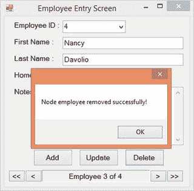

图 2-14。

Handling events of the XmlDocument class

## 摘要

本章详细介绍了`XmlDocument`类 .NET 框架的 DOM 解析器。你和其他几个班一起工作，包括`XmlNode`、`XmlElement`、`XmlAttribute`和`XmlText`。您了解了如何加载 XML 文档、如何在其中导航、如何读取内容，以及如何修改它们。您还了解了如何处理空白和名称空间。最后，您处理了当您以某种方式更改文档时引发的各种`XmlDocument`事件。

你可以在目前所学的基础上再接再厉。例如，您可以通过从它们继承来创建自己的自定义扩展`XmlDocument`和其他类。虽然很少需要这样做，但这项任务可以通过从这些类继承并添加额外的属性和方法来完成。