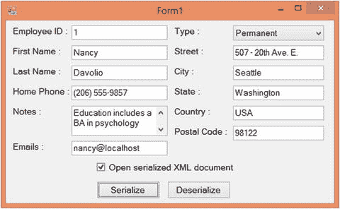

# 八、XML 序列化

你的 .NET 应用由一个或多个类组成。这些类的对象用于存储状态信息。只要您的对象在应用的内存中可用，这些状态信息就随时可用。但是，如果您想在应用关闭时保持对象状态，该怎么办呢？首先，您可能会想到在关系数据库中保存对象状态。然而，数据库通常以关系格式存储信息，而对象通常具有层次结构。此外，您需要自己在数据库中创建许多表。将对象数据存储在数据库中会带来额外的开销。如果整个对象状态可以存储到一个介质中并在以后检索，那不是很好吗？这就是序列化所提供的。

序列化是将对象状态保存到介质中的过程。介质可以是物理磁盘文件、内存，甚至是网络流。序列化的对象可以稍后在应用中通过一个称为反序列化的过程来检索。那个 .NET Framework 为序列化提供了广泛的支持，并在许多地方使用序列化。Web 服务、WCF 服务和 Web API 是大量使用序列化的几个地方。在本章中，您将了解以下主题:

*   理解序列化的味道
*   使用`XmlSerializer`类以 XML 格式序列化对象状态
*   使用`DataContractSerializer`类以 XML 格式序列化对象状态
*   使用`SoapFormatter`类以 SOAP 格式序列化对象状态
*   借助某些属性定制序列化过程

## 理解序列化的味道

序列化可以根据序列化的格式或序列化的深度进行分类。中序列化数据的三种常用格式 .NET 框架如下:

*   二进制:就性能而言，这种格式通常比其他格式更好。但是，在可扩展性和跨应用集成方面，其他格式更好。
*   XML:以这种方式序列化的对象存储为纯 XML。如果您正在与多个异构系统交谈，这种格式将被证明是有用的。比如你的 .NET 应用可以将对象序列化为 XML 文档，而 Java 应用可以使用其标准的 XML 解析器读取这些序列化的对象，并进一步处理数据。
*   简单对象访问协议(SOAP):以这种方式序列化的对象按照 SOAP 标准存储信息。SOAP 是 web 服务的核心支柱。SOAP 协议是基于 XML 的。

使用二进制格式的序列化超出了本书的范围。本章讨论使用 XML 和 SOAP 格式的序列化。

Note

在现代 web 应用中，JSON 作为一种传输数据的格式越来越流行。使用 JSON 的应用需要一种机制来序列化和反序列化 JSON 格式的对象。虽然 WCF 和 Web API 可以处理 JSON 数据，但我们不会在本书中讨论这一点。

另一种对序列化进行分类的方法是基于序列化的深度。基于序列化深度的两种风格如下:

*   深度序列化:这将序列化类的所有公共、受保护和私有成员。
*   浅层序列化:只序列化你的类的公共成员。

在 .NET Framework 中，序列化的深度取决于为了序列化和反序列化对象而使用的序列化程序类。

### XML 序列化中涉及的类

有三个核心类用于执行 XML 和 SOAP 格式的序列化:

*   `XmlSerializer`类以 XML 格式序列化对象。它驻留在`System.Xml.Serialization`名称空间中。`System.Xml.Serialization`名称空间实际上驻留在`System.Xml.dll`程序集中。使用`XmlSerializer`完成的序列化本质上是肤浅的。
*   `DataContractSerializer`类以 XML 格式序列化对象。它是作为 Windows Communication Foundation(WCF)的一部分添加的，驻留在`System.Runtime.Serialization`名称空间中。使用`DataContractSerializer`完成的序列化本质上是深层的。
*   `SoapFormatter`类以 SOAP 格式序列化对象。它驻留在`System.Runtime.Serialization.Formatters.Soap`名称空间中。`System.Runtime.Serialization.Formatters.Soap`名称空间实际上驻留在`System.Runtime.Serialization.Formatters.Soap.dll`程序集中。使用`SoapFormatter`完成的序列化本质上是深层的。

## 使用 XmlSerializer 序列化和反序列化对象

现在，您对什么是序列化有了基本的了解，让我们直接研究 XML 序列化。您将使用`XmlSerializer`类构建一个演示序列化和反序列化过程的应用。应用用户界面如图 [8-1](#Fig1) 所示。


图 8-1。

Application for illustrating XML serialization

该应用由一个名为`Employee`的类组成，该类有五个公共属性:`EmployeeID`、`FirstName`、`LastName`、`HomePhone`和`Notes`。有五个文本框接受这些属性的值。Serialize 和 Deserialize 这两个按钮分别负责序列化和反序列化`Employee`对象。该复选框确定是否将在浏览器中打开序列化的 XML 文档进行查看。

在使用`XmlSerializer`类之前，您应该创建清单 [8-1](#Par25) 中所示的`Employee`类。

```cs
public class Employee
{
    public int EmployeeID { get; set; }
    public string FirstName { get; set; }
    public string LastName { get; set; }
    public string HomePhone { get; set; }
    public string Notes { get; set; }
}
Listing 8-1.The Employee Class

```

该类由五个公共属性组成，用于存储员工的各种信息，即`EmployeeID`、`FirstName`、`LastName`、`HomePhone`和`Notes`。

序列化按钮的`Click`事件处理程序包含清单 [8-2](#Par28) 中所示的代码。

```cs
private void button1_Click(object sender, EventArgs e)
{
  Employee emp = new Employee();
  emp.EmployeeID = int.Parse(textBox1.Text);
  emp.FirstName = textBox2.Text;
  emp.LastName = textBox3.Text;
  emp.HomePhone = textBox4.Text;
  emp.Notes = textBox5.Text;
  FileStream stream =

    new FileStream($"{Application.StartupPath}\\employee.xml", FileMode.Create);

  XmlSerializer serializer = new XmlSerializer(typeof(Employee));

  serializer.Serialize(stream, emp);

  stream.Close();
  if (checkBox1.Checked)
  {
    Process.Start($"{Application.StartupPath}\\employee.xml");
  }
}
Listing 8-2.Serializing Objects in XML Format

```

代码创建了一个`Employee`类的实例。然后，它将各个文本框中的值分配给`Employee`类的相应属性。然后创建一个用于写入物理磁盘文件的`FileStream`(`Employee.xml`)。实际序列化对象时使用此流。然后代码创建了一个`XmlSerializer`类的对象。如前所述，`XmlSerializer`类允许您序列化 XML 格式的数据。

`XmlSerializer`构造函数有几个重载，代码使用一个接受其对象要被序列化的类的类型的重载。通过使用`typeof`关键字获得关于`Employee`类的类型信息。`XmlSerializer`的`Serialize()`方法将对象序列化为指定的流、`TextWriter`或`XmlWriter`。

因为我们的示例使用了一个`FileStream`来序列化`Employee`对象，所以在序列化完成后，流被关闭。最后，通过使用`Process`类的`Start()`方法，来自 XML 文件的序列化数据显示在浏览器中。

反序列化按钮的`Click`事件处理程序包含清单 [8-3](#Par33) 中所示的代码。

```cs
private void button2_Click(object sender, EventArgs e)
{
  FileStream stream =

    new FileStream($"{Application.StartupPath}\\employee.xml", FileMode.Open);

  XmlSerializer serializer = new XmlSerializer(typeof(Employee));

  Employee emp = (Employee)serializer.Deserialize(stream);

  stream.Close();

  textBox1.Text = emp.EmployeeID.ToString();
  textBox2.Text = emp.FirstName;
  textBox3.Text = emp.LastName;
  textBox4.Text = emp.HomePhone;
  textBox5.Text = emp.Notes;
}
Listing 8-3.Deserializing by Using the XmlSerializer Class

```

代码创建了一个`FileStream`，指向在序列化过程中创建的同一个文件。注意，这次文件是以`Open`模式打开的，而不是以`Create`模式打开的。然后像以前一样创建一个对象`XmlSerializer`。

`XmlSerializer`类的`Deserialize()`方法接受一个`Stream`、`TextReader`或`XmlReader`，从其中读取对象进行反序列化。然后它返回反序列化的对象。反序列化的数据总是作为对象返回，并且需要转换成`Employee`类型。然后将反序列化对象的各种属性值分配给相应的文本框。

要测试应用，运行它，在文本框中输入一些值，然后单击 Serialize 按钮。图 [8-2](#Fig2) 显示了通过运行前面的应用获得的样本 XML 文档。


图 8-2。

Employee object serialized as an XML document

仔细检查生成的 XML 标记。类名(`Employee`)已经成为根元素的名称。元素如`<EmployeeID>`、`<FirstName>`和`<LastName>`与`Employee`类的相应属性同名。现在关闭应用并再次运行它。这一次单击反序列化按钮。您会发现文本框显示了您在上次运行应用时指定的属性值。

### 处理反序列化期间引发的事件

想象这样一种情况，一个应用正在序列化对象，而另一个应用正在反序列化它们。如果序列化的对象包含一些额外的属性和元素怎么办？反序列化这些对象的应用必须有某种方式来通知这种差异。幸运的是，`XmlSerializer`类附带了特定的事件来处理这种情况。当类的结构和序列化的 XML 不匹配时，在反序列化过程中会引发这些事件。表 [8-1](#Tab1) 列出了这些事件。

表 8-1。

Events of the XmlSerializer Class

<colgroup><col> <col></colgroup> 
| 事件名称 | 描述 |
| --- | --- |
| `UnknownAttribute` | 当被反序列化的数据包含某些意外属性时，会引发此事件。该事件接收一个类型为`XmlAttributeEventArgs`的事件参数，它提供了关于该事件的更多信息。 |
| `UnknownElement` | 当被反序列化的数据包含某些意外元素时，会引发此事件。该事件接收一个类型为`XmlElementEventArgs`的事件参数，它提供了关于该事件的更多信息。 |
| `UnknownNode` | 当被反序列化的数据包含某些意外节点时，会引发此事件。该事件接收一个类型为`XmlNodeEventArgs`的事件参数，它提供了关于该事件的更多信息。 |
| `UnreferencedObject` | 当被反序列化的数据包含一些未使用或未被引用的已识别类型时，将引发此事件。该事件接收一个类型为`UnreferencedObjectEventArgs`的事件参数，它提供了关于该事件的更多信息。此事件仅适用于 SOAP 编码的 XML。 |

为了演示这些事件的用法，您需要将前面的应用修改为清单 [8-4](#Par40) 中所示的应用。

```cs
private void button2_Click(object sender, EventArgs e)
{
  FileStream stream =
    new FileStream($"{Application.StartupPath}\\employee.xml", FileMode.Open);
  XmlSerializer serializer = new XmlSerializer(typeof(Employee));
  serializer.UnknownAttribute +=

    new XmlAttributeEventHandler(serializer_UnknownAttribute);

  serializer.UnknownElement +=

    new XmlElementEventHandler(serializer_UnknownElement);

  serializer.UnknownNode += new XmlNodeEventHandler(serializer_UnknownNode);

  Employee emp = (Employee)serializer.Deserialize(stream);
  stream.Close();
  textBox1.Text = emp.EmployeeID.ToString();
  textBox2.Text = emp.FirstName;
  textBox3.Text = emp.LastName;
  textBox4.Text = emp.HomePhone;
  textBox5.Text = emp.Notes;
}

void serializer_UnknownNode(object sender, XmlNodeEventArgs e)

{

  MessageBox.Show($"Unknown Node {e.Name} found at Line {e.LineNumber}");

}

void serializer_UnknownElement(object sender, XmlElementEventArgs e)

{

  MessageBox.Show($"Unknown Element {e.Element.Name} found at Line {e.LineNumber}");

}

void serializer_UnknownAttribute(object sender, XmlAttributeEventArgs e)

{

  MessageBox.Show($"Unknown Attribute {e.Attr.Name} found at Line {e.LineNumber}");

}

Listing 8-4.
Events of th

e XmlSerializer Class

```

注意用粗体标记的代码。在声明了`XmlSerializer`类的实例之后，它连接了三个事件处理程序——`UnknownAttribute`、`UnknownElement`和`UnknownNode`——它们只是显示一个消息框，显示属性、元素或节点的名称以及遇到属性、元素或节点的行号。请注意事件参数是如何用于提取有关意外内容的信息的。

为了测试这些事件，手动修改序列化的 XML 文件，如清单 [8-5](#Par43) 所示。

```cs
<?xml version="1.0"?>
<Employee xmlns:xsi="http://www.w3.org/2001/XMLSchema-instance"
 xmlns:xsd="http://www.w3.org/2001/XMLSchema" EmpCode="E001">
  <EmployeeID>1</EmployeeID>
  <FirstName>Nancy</FirstName>
  <LastName>Davolio</LastName>
  <HomePhone>(206) 555-9857</HomePhone>
  <Notes>Education includes a BA in psychology from Colorado State University in 1970\. She also completed "The Art of the Cold Call." Nancy is a member of Toastmasters International.</Notes>
  <OfficePhone>(206) 555-1234</OfficePhone>

</Employee>
Listing 8-5.Modifying the Serialized XML Manually

```

请注意粗体的标记。我们向 XML 文件中手动添加了一个`EmpCode`属性和一个`<OfficePhone>`元素。保存文件并运行应用。这一次，当您单击“反序列化”按钮时，您将看到消息框通知您存在差异。图 [8-3](#Fig3) 显示了一个这样的消息框。


图 8-3。

Unexpected content encou ntered during the deserialization process

### 复杂类型的序列化和反序列化

在前面的例子中，我们序列化了简单类型；`Employee`类的成员是简单类型，比如整数和字符串。然而，现实世界中的类通常是复杂的。它们可能包含类类型、枚举类型甚至数组的成员。`XmlSerializer`类提供了对这种复杂类型的支持，这就是你将在下一个例子中看到的。

应用的用户界面现在看起来如图 [8-4](#Fig4) 所示。



图 8-4。

Application for illustrating XML serialization of complex types

前五个文本框与前一个示例中的一样。但是，六个文本框和一个组合框是新的。新添加的文本框捕获雇员的电子邮件、街道、城市、州、国家和邮政编码信息。组合框捕获员工类型(永久或合同)。

要存储员工的地址信息，需要在`Employee`类中添加一个名为`Address`的属性。`Address`属性本身就是类型`Address`。清单 [8-6](#Par49) 中显示了`Address`类。

```cs
public class Address
{
    public string Street { get; set; }
    public string City { get; set; }
    public string State { get; set; }
    public string Country { get; set; }
    public string PostalCode { get; set; }
}

Listing 8-6.The Address Class

```

这个类有五个公共属性，分别用于存储街道地址、城市、州、国家和邮政编码。

为了存储雇员类型，您需要向`Employee`类添加一个名为`Type`的属性。`Type`属性将是一个`EmployeeType`类型的枚举，它包含两个值:`Permanent`和`Contract`。清单 [8-7](#Par52) 中显示了`EmployeeType`枚举。

```cs
public enum EmployeeType
{
  Permanent, Contract
}
Listing 8-7.The EmployeeType Enumeration

```

电子邮件信息存储在名为`Emails`的属性中。一个雇员可以有多个电子邮件地址，因此该属性是字符串数组类型。清单 [8-8](#Par54) 显示了`Employee`类的修改版本。

```cs
public class Employee
{
    public int EmployeeID { get; set; }
    public string FirstName { get; set; }
    public string LastName { get; set; }
    public string HomePhone { get; set; }
    public string Notes { get; set; }
    public string[] Emails { get; set; }

    public EmployeeType Type { get; set; }

    public Address Address { get; set; } = new Address();

}
Listing 8-8.The Employee Class After Adding Address, Type, and Emails Properties

```

请注意以粗体标记的属性定义。三个公共属性——`Address`、`Type`和`Emails`——分别属于类型`Address`、`EmployeeType`和字符串数组。Serialize 按钮的`Click`事件处理程序中的代码现在变为清单 [8-9](#Par56) 中所示的代码。

```cs
private void button1_Click(object sender, EventArgs e)
{
  Employee emp = new Employee();
  emp.EmployeeID = int.Parse(textBox1.Text);
  emp.FirstName = textBox2.Text;
  emp.LastName = textBox3.Text;
  emp.HomePhone = textBox4.Text;
  emp.Notes = textBox5.Text;
  emp.Type =

    (comboBox1.SelectedIndex == 0 ? EmployeeType.Permanent :

     EmployeeType.Contract);

  emp.Address.Street = textBox6.Text;

  emp.Address.City = textBox7.Text;

  emp.Address.State = textBox8.Text;

  emp.Address.Country = textBox9.Text;

  emp.Address.PostalCode = textBox10.Text;

  emp.Emails = textBox11.Text.Split(',');

  FileStream stream =
    new FileStream($"{Application.StartupPath}\\employee.xml", FileMode.Create);
  XmlSerializer serializer = new XmlSerializer(typeof(Employee));
  serializer.Serialize(stream, emp);
  stream.Close();
  if (checkBox1.Checked)
  {
    Process.Start($"{Application.StartupPath}\\employee.xml");
  }
}

Listing 8-9.Serializing Com

plex Types

```

代码基本上与前面的示例相同。但是，它会将新添加的属性设置为文本框和组合框中的相应值。注意复杂属性`Address`是如何设置的。另外，注意在电子邮件文本框中输入的逗号分隔的电子邮件是如何通过使用`Split()`方法转换成字符串数组的。调用`Serialize()`序列化`Employee`对象后，序列化后的 XML 文档如图 [8-5](#Fig5) 所示。


图 8-5。

Serialized XML for complex types

仔细检查序列化的 XML 数据。地址由`<Address>`节点表示，其名称来自于`Employee`类的`Address`属性。`<Address>`节点有五个子节点:`<Street>`、`<City>`、`<State>`、`<Country>`和`<PostalCode>`。它们的名字来源于`Address`类各自的属性。

`<Type>`元素表示`Employee`类的`Type`属性。枚举值`Permanent`存储在 XML 标记中。最后，`<Emails>`节点表示`Emails`属性，它的子节点只是单个的数组元素。因为电子邮件存储在一个字符串数组中，所以各个值包含在`<string></string>`元素中。

清单 [8-10](#Par61) 显示了反序列化按钮的`Click`事件中的代码。

```cs
private void button2_Click(object sender, EventArgs e)
{
  FileStream stream = new FileStream($"{Application.StartupPath}\\employee.xml", FileMode.Open);
  XmlSerializer serializer = new XmlSerializer(typeof(Employee));
  Employee emp=(Employee)serializer.Deserialize(stream);
  stream.Close();
  textBox1.Text = emp.EmployeeID.ToString();
  textBox2.Text = emp.FirstName;
  textBox3.Text = emp.LastName;
  textBox4.Text = emp.HomePhone;
  textBox5.Text = emp.Notes;
  comboBox1.SelectedIndex = (emp.Type == EmployeeType.Permanent?0:1);
  textBox6.Text=emp.Address.Street;
  textBox7.Text=emp.Address.City;
  textBox8.Text=emp.Address.State;
  textBox9.Text=emp.Address.Country;
  textBox10.Text=emp.Address.PostalCode;
  textBox11.Text = string.Join(",", emp.Emails);
  stream.Close();
}

Listing 8-10.Deserializing Complex Types

```

代码与前面的例子非常相似。它通过使用`XmlSerializer`类反序列化先前序列化的`Employee`对象。属性值随后被分配给窗体上的各种控件。注意如何通过使用`string`类的`Join()`方法将`Emails`属性转换成逗号分隔的字符串。序列化复杂类型时，以下几点值得注意:

*   若要序列化和反序列化枚举值，序列化对象的应用和反序列化对象的应用必须定义相同的枚举。
*   序列化对象属性时，对象的所有公共成员都被序列化。成员名称被分配给结果 XML 中的子元素。
*   在反序列化过程中，`XmlSerializer`实例化主类(`Employee`)以及所有子类(`Address`)，并为各自的属性赋值。
*   序列化数组时，XML 元素表示数组。单个数组元素构成了这个元素的子元素。根据数组的数据类型，各个数组元素包含在一个元素中。
*   反序列化时，`XmlSerializer`创建一个数组，其元素数量与序列化后的元素数量相同。然后，它相应地分配数组元素值。

### 序列化和继承

序列化不限于简单和复杂类型。它同样适用于继承的类。假设您有一个名为`Manager`的类，它继承了我们的`Employee`类。现在当你序列化`Manager`时，`Employee`基类和`Manager`的所有公共属性都被序列化了。在继承链很长的情况下也是如此。

为了演示继承的类是如何序列化的，我们需要在应用中添加一个名为`Manager`的类。`Manager`类继承了`Employee`类(参见清单 [8-1](#Par25) )并通过添加一个整数属性`NoOfSubordinates`来扩展它。清单 [8-11](#Par70) 中显示了`Manager`类。

```cs
public class Manager : Employee
{
    public int NoOfSubordinates { get; set; }
}
Listing 8-11.The Manager Class

```

代码创建了一个名为`Manager`的类，它继承了`Employee`类。然后，它添加一个整数属性—`NoOfSubordinates`—来存储经理下属的数量。为了适应额外的属性，应用的用户界面发生了变化，如图 [8-6](#Fig6) 所示。


图 8-6。

Application to demonstrate serialization of inherited classes

该应用与图 [8-1](#Fig1) 中的几乎相同，但是有一个额外的文本框用于接受经理下属的数量。清单 [8-12](#Par73) 显示了序列化按钮的`Click`事件处理程序。

```cs
private void button1_Click(object sender, EventArgs e)
{
  Manager manager = new Manager();

  manager.EmployeeID = int.Parse(textBox1.Text);
  manager.FirstName = textBox2.Text;
  manager.LastName = textBox3.Text;
  manager.HomePhone = textBox4.Text;
  manager.Notes = textBox5.Text;
  manager.NoOfSubordinates = int.Parse(textBox6.Text);

  FileStream stream =
    new FileStream($"{Application.StartupPath}\\employee.xml", FileMode.Create);
  XmlSerializer serializer = new XmlSerializer(typeof(Manager));

  serializer.Serialize(stream, manager);

  stream.Close();
  if (checkBox1.Checked)
  {
    Process.Start($"{Application.StartupPath}\\employee.xml");
  }
}
Listing 8-12.Serializing the Inherited 

Manager Class

```

代码本质上与我们到目前为止一直使用的一样，但是它使用了`Manager`类而不是`Employee`类。创建了一个`Manager`的实例，并设置了它的所有属性。然后通过传递`Manager`类的`Type`信息来创建`XmlSerializer`的实例。最后，通过调用`XmlSerializer`的`Serialize()`方法来序列化`Manager`实例。图 [8-7](#Fig7) 显示了结果 XML 输出。


图 8-7。

Serialized XML of the Manager class

注意来自`Employee`基类的所有公共属性以及来自`Manager`的属性是如何被序列化的。反序列化`Manager`类的代码与我们之前使用的非常相似。清单 [8-13](#Par76) 显示了这段代码。

```cs
private void button2_Click(object sender, EventArgs e)
{
  FileStream stream =
    new FileStream($"{Application.StartupPath}\\employee.xml", FileMode.Open);
  XmlSerializer serializer = new XmlSerializer(typeof(Manager));

  Manager manager = (Manager)serializer.Deserialize(stream);

  stream.Close();

  textBox1.Text = manager.EmployeeID.ToString();
  textBox2.Text = manager.FirstName;
  textBox3.Text = manager.LastName;
  textBox4.Text = manager.HomePhone;
  textBox5.Text = manager.Notes;
  textBox6.Text = manager.NoOfSubordinates.ToString();
}
Listing 8-13.Deserializing the Manager Class

```

这段代码中唯一的不同是，i t 在反序列化过程中使用了`Manager`而不是`Employee`。

### 自定义序列化的 XML

`XmlSerializer`类自动使用公共成员的名称作为结果 XML 元素的名称。这是许多情况下所要求的。但是，有时您可能需要定制序列化的 XML 数据来满足您的需要。在前面说明复杂类型序列化的例子中，我们得到了清单 [8-14](#Par79) 中所示的 XML 文档。

```cs
<?xml version="1.0"?>
<Employee xmlns:xsi="http://www.w3.org/2001/XMLSchema-instance"
xmlns:xsd="http://www.w3.org/2001/XMLSchema">
  <EmployeeID>1</EmployeeID>
  <FirstName>Nancy</FirstName>
  <LastName>Davolio</LastName>
  <HomePhone>(206) 555-9857</HomePhone>
  <Notes>Education includes a BA in psychology from Colorado State University in 1970\. She also completed "The Art of the Cold Call." Nancy is a member of Toastmasters International.</Notes>
  <Type>Permanent</Type>
  <Emails>
    <string>nancy@localhost</string>
  </Emails>
  <Address>
    <Street>507 - 20th Ave. E. Apt. 2A</Street>
    <City>Seattle</City>
    <State>Washington</State>
    <Country>USA</Country>
    <PostalCode>98122</PostalCode>
  </Address>
</Employee>
Listing 8-14.Serialized XML Document Without Any 

Customization

```

然而，如果您希望生成的 X ML 结构类似于清单 [8-15](#Par81) 该怎么办呢？

```cs
<?xml version="1.0"?>
<MyEmployee xmlns:xsi="http://www.w3.org/2001/XMLSchema-instance"
xmlns:xsd="http://www.w3.org/2001/XMLSchema" EmployeeCode="1">
  <FName>Nancy</FName>
  <LName>Davolio</LName>
  <Remarks>
Education includes a BA in psychology from Colorado State University in 1970\. She also completed "The Art of the Cold Call." Nancy is a member of Toastmasters International.
</Remarks>
  <EmployeeType>Permanent Employee</EmployeeType>
  <EmailAddresses>
    <Email>nancy@localhost</Email>
  </EmailAddresses>
  <Address>
    <Street>507 - 20th Ave. E. Apt. 2A</Street>
    <City>Seattle</City>
    <State>Washington</State>
    <Country>USA</Country>
    <PostalCode>98122</PostalCode>
  </Address>
</MyEmployee>
Listing 8-15.Serialized XML After Customization

```

仔细观察清单 [8-15](#Par81) 。有一些重大的变化:

*   文档的根元素是`<MyEmployee>`而不是`<Employee>`。
*   元素名与公共属性名完全不同。
*   雇员 ID 存储为`EmployeeCode`属性。
*   `EmployeeType`枚举值与实际枚举项文本不同。
*   电子邮件地址存储为`<Email>`元素，而不是`<string>`元素。
*   即使`HomePhone`属性值是该类的公共成员，它也不会被序列化。

为了实现这样的定制，`System.Xml.Serialization`名称空间提供了几个属性。您需要用这些属性来修饰您的类、枚举和属性，以自定义它们的序列化方式。清单 [8-16](#Par90) 显示了应用了许多属性后的`Employee`类和`EmployeeType`枚举。

```cs
[XmlRoot(ElementName="MyEmployee")]

public class Employee
{
    [XmlAttribute(AttributeName = "EmployeeCode")]

    public int EmployeeID { get; set; }

    [XmlElement(ElementName = "FName")]

    public string FirstName { get; set; }

    [XmlElement(ElementName = "LName")]

    public string LastName { get; set; }

    [XmlIgnore]

    public string HomePhone { get; set; }

    [XmlElement(ElementName = "Remarks")]

    public string Notes { get; set; }

    [XmlArray(ElementName = "EmailAddresses")]

         [XmlArrayItem(ElementName = "Email")]

    public string[] Emails { get; set; }

    [XmlElement(ElementName = "EmployeeType")]

    public EmployeeType Type { get; set; }

    [XmlElement(IsNullable = true)]

    public Address Address { get; set; } = new Address();
}

public enum EmployeeType
{
        [XmlEnum(Name="Permanent Employee")]

        Permanent,
        [XmlEnum(Name = "Employee on contract")]

        Contract

}

Listing 8-16.Customizing Serialization by Using Attributes

```

让我们一步一步地剖析前面的清单，看看所使用的每个属性的重要性。

#### 更改 XML 文档根

默认情况下，`XmlSerializer`类使用类名作为 XML 根元素的名称。要改变这种行为，您可以用`[XmlRoot]`属性来修饰您的类。`[XmlRoot]`属性有一个名为`ElementName`的属性，指示 XML 文档根元素的新名称。`[XmlRoot]`属性必须应用于类定义，因此我们将它放在了`Employee`类的顶部。

#### 更改元素名称

默认情况下，`XmlSerializer`类使用公共成员的名称来分配给输出 XML 元素。例如，`FirstName`属性被序列化为`<FirstName>`元素。这个默认行为可以通过使用`[XmlElement]`属性来改变。`[XmlElement]`属性有一个名为`ElementName`的属性，它指定了结果 XML 元素的名称。`[XmlElement]`属性应用于将被序列化的公共成员，因此`FirstName`、`LastName`、`Notes`、`Type`和`Address`属性由`[XmlElement]`属性修饰。

#### 将成员序列化为属性

默认情况下，类的所有公共成员在输出文档中被序列化为 XML 元素。`[XmlAttribute]`属性允许您更改这个默认行为。`[XmlAttribute]`属性的`AttributeName`属性表示将赋予结果 XML 属性的名称。`[XmlAttribute]`应用于要序列化为属性的公共成员。在我们的例子中，我们将`[XmlAttribute]`属性添加到`EmployeeID`属性中。

#### 在序列化过程中忽略公共成员

默认情况下，类的所有公共成员都是序列化的，但有时这并不是您想要的。例如，如果您将信用卡信息存储在公共属性中，出于明显的安全原因，您可能不想序列化它。通过用`[XmlIgnore]`属性修饰公共成员，可以在序列化过程中忽略它。在我们的例子中，`HomePhone`属性被标记为这个属性。

#### 更改数组和数组元素的名称

`Employee`类有一个名为`Emails`的属性，它属于字符串数组类型。在默认的命名模式下，当这个属性被序列化时，会创建一个名为`Emails`的 XML 节点。该节点还包含子节点，每个子节点都包含数组元素值。子元素的名称与数组的数据类型相同(在我们的例子中是`<string>`)。您可以在`[XmlArray]`和`[XmlArrayElement]`属性的帮助下改变这种行为。前者标记数组类型的公共成员，并为该成员指定 XML 元素名称。后一个属性控制分配给单个数组成员的 XML 元素的名称。在我们的例子中，`Emails`属性将被序列化为`<EmailAddresses>`，并且每个数组元素将被包含在一个`<Email>`元素中。

#### 在序列化过程中忽略空对象

`Employee`类有一个属于对象类型的`Address`属性。如果这个属性为 null，`XmlSerializer`仍然为它发出一个空的 XML 元素，但是您可以使用`[XmlElement]`属性来改变这个行为。属性`[XmlElement]`的`IsNullable`布尔属性表示当成员为空时是否会发出空的 XML 元素。如果`Address`属性为 null，将该属性设置为`true`将不会发出空的 XML 元素。

#### 更改枚举标识符

`EmployeeType`枚举有两个值:`Permanent`和`Contract`。默认情况下，当`EmployeeType`类型的成员被序列化时，这些枚举标识符的值在序列化的 XML 中发出。`[XmlEnum]`属性指定要序列化的替代值，而不是实际的标识符名称，并应用于枚举标识符。属性的属性指定了将被序列化的文本，而不是标识符名称。

## 使用 DataContractSerializer 序列化和反序列化对象

在上一节中，您使用了`XmlSerializer`类来序列化和反序列化对象。`XmlSerializer`从的 1.1 版本开始提供 .NET 框架。除了 Windows Communication Foundation(WCF)之外，还添加了另一个名为`DataContractSerializer`的类，它也可以用于 XML 序列化。`DataContractSerializer`类是 WCF 服务的默认序列化程序，但是您也可以像使用`XmlSerializer`一样使用它来序列化和反序列化您的对象。

为了使用`DataContractSerializer`，您需要向您的类添加几个属性:

*   该类必须用`[DataContract]`属性来修饰。
*   您想要序列化的类的每个成员都必须标记有`[DataMember]`属性。在序列化过程中，没有用`[DataMember]`修饰的成员将被忽略。

Note

当我们讨论 WCF 服务时，我们将在第 [10 章](10.html)中重温`[DataContract]`和`[DataMember]`属性。到那时，你会更清楚 WCF 是如何使用这些属性的。这里可以说它们是使用`DataContractSerializer`类序列化一个对象所必需的。

为了说明`DataContractSerializer`类的使用，您将开发一个类似于`XmlSerializer`的应用(参见图 [8-1](#Fig1) )。当然，您将需要修改`Employee`类以及序列化和反序列化`Employee`对象的代码，如下所述。

首先打开`Employee`类并修改，如清单 [8-17](#Par106) 所示。

```cs
[DataContract]
public class Employee
{
    [DataMember]
    public int EmployeeID { get; set; }
    [DataMember]
    public string FirstName { get; set; }
    [DataMember]
    public string LastName { get; set; }
    [DataMember]
    public string HomePhone { get; set; }
    [DataMember]
    public string Notes { get; set; }
}
Listing 8-17.Marking a 

Class with the [DataContract] and [DataMember] Attributes

```

添加到`Employee`类的`[DataContract]`属性表明`Employee`类是一个数据契约，可以被`DataContractSerializer`序列化。添加到`Employee`类的属性中的`[DataMember]`属性表明所考虑的成员是数据契约的一部分，并且可以被`DataContractSerializer`序列化。

接下来，修改序列化按钮的`Click`事件处理程序，如清单 [8-18](#Par109) 所示。

```cs
private void button1_Click(object sender, EventArgs e)
{
    Employee emp = new Employee();
    emp.EmployeeID = int.Parse(textBox1.Text);
    emp.FirstName = textBox2.Text;
    emp.LastName = textBox3.Text;
    emp.HomePhone = textBox4.Text;
    emp.Notes = textBox5.Text;
    FileStream stream = new FileStream($"{Application.StartupPath}\\employee.xml", FileMode.Create);

    DataContractSerializer serializer = new DataContractSerializer(typeof(Employee));

         serializer.WriteObject(stream, emp);

    stream.Close();
    if (checkBox1.Checked)
    {
        Process.Start($"{Application.StartupPath}\\employee.xml");
    }
}

Listing 8-18.Serialize Data Using DataC

ontractSerializer

```

清单 [8-18](#Par109) 中显示的大部分代码对您来说应该很熟悉，除了用粗体标记的代码行。用粗体标记的第一行通过传递`Employee`类的类型信息创建了一个`DataContractSerializer`实例。第二行调用了`DataContractSerializer`的`WriteObject()`方法。`WriteObject()`方法接受两个参数——写入数据的流对象和要序列化的对象。

如果您运行应用，并在填充各种文本框后单击 Serialize 按钮，结果 XML 文档应该类似于图 [8-8](#Fig8) 。


图 8-8。

XML serialized by DataContractSerializer

为了反序列化以前使用`DataContractSerializer`序列化的 XML，可以使用`ReadObject()`方法。清单 [8-19](#Par113) 显示了反序列化按钮的`Click`事件处理程序，演示了`ReadObject()`的用法。

```cs
private void button2_Click(object sender, EventArgs e)
{
    FileStream stream = new FileStream($"{Application.StartupPath}\\employee.xml", FileMode.Open);

    DataContractSerializer serializer = new DataContractSerializer(typeof(Employee));

    Employee emp = (Employee)serializer.ReadObject(stream);

    stream.Close();
    textBox1.Text = emp.EmployeeID.ToString();
    textBox2.Text = emp.FirstName;
    textBox3.Text = emp.LastName;
    textBox4.Text = emp.HomePhone;
    textBox5.Text = emp.Notes;
}

Listing 8-19.Serialize Data Using DataContractSerializer

```

注意用粗体标记的代码。第一行通过传递`Employee`类的类型信息来创建一个`DataContractSerializer`的实例。第二行调用了`DataContractSerializer`上的`ReadObject()`方法。要读取的流作为参数提供给`ReadObject()`。`ReadObject()`读取一个对象，然后将其转换为`Employee`类型。

如果您再次运行应用并单击 Deserialize 按钮，您会发现所有的文本框都填充了正确的值。

### 自定义序列化的 XML

正如您所观察到的，默认情况下，`DataContractSerializer`使用类名和属性名作为结果 XML 元素。您可以通过在`[DataContract]`和`[DataMember]`属性中指定 XML 元素名称来定制它们。清单 [8-20](#Par117) 展示了这是如何完成的。

```cs
[DataContract(Name ="MyEmployee")]
public class Employee
{
    [DataMember(Name ="EmployeeCode")]
    public int EmployeeID { get; set; }
    [DataMember(Name = "FName")]
    public string FirstName { get; set; }
    [DataMember(Name = "LName")]
    public string LastName { get; set; }
    [IgnoreDataMember]
    public string HomePhone { get; set; }
    [DataMember(Name = "Remarks")]
    public string Notes { get; set; }
}
Listing 8-20.Customizing XML Element Names

```

`[DataContract]`属性现在指定它的`Name`属性为`MyEmployee`。因此，根元素名称将是`MyEmployee`。添加到`EmployeeID`、`FirstName`、`LastName`和`Notes`属性的`[DataMember]`属性分别将它们的`Name`属性设置为`EmployeeCode`、`FName`、`LName`和`Remarks`。`HomePhone`属性用`[IgnoreDataMember]`属性修饰，表示`HomePhone`不会被序列化。

图 [8-9](#Fig9) 显示了在刚才讨论的定制之后生成的一个示例 XML。


图 8-9。

XML element names are now customized

如您所见，XML 元素名称现在符合我们的`Name`属性。还有，`HomePhone`还没有序列化。如果反序列化这个 XML，您会发现除了 HomePhone 之外的所有文本框都按预期填充了。出于显而易见的原因，家庭电话文本框仍然为空。

## 使用 SoapFormatter 序列化和反序列化对象

在本章的开始，你学习了基于格式的三种类型的序列化(二进制、XML 和 SOAP)。将对象序列化为二进制格式超出了本书的范围，并且您已经学习了如何使用`XmlSerializer`和`DataContractSerializer`类将对象序列化为 XML 格式。现在是时候学习如何使用`SoapFormatter`类以 SOAP 格式序列化对象了。

Note

本节中使用的`SoapFormatter`类现在被认为是过时的。我们在这里讨论它是因为一些旧的应用可能还在使用它。此外，它让您有机会熟悉 SOAP 格式，而无需深入 ASMX web 服务或 WCF 服务的细节。

SOAP 是一种行业标准，是 web 服务的支柱之一。尽管 SOAP 与 web 服务一起被广泛使用，但是您可以将它用作对象序列化的编码格式。

当您使用`XmlSerializer`类序列化对象时，您不需要对类本身做任何特殊的事情。然而，当您想要使用 SOAP 作为序列化格式时，您必须用`[Serializable]`属性来标记您的类。只有这样，您的类才能被序列化。

`SoapFormatter`类负责以 SOAP 格式序列化对象的所有复杂工作。`SoapFormatter`类驻留在`System.Runtime.Serialization.Formatters.Soap`名称空间中，而名称空间实际上驻留在`System.Runtime.Serialization.Formatters.Soap.dll`程序集中。

让我们重温一下我们在本章开始时开发的应用(见图 [8-1](#Fig1) ，并修改它以使用`SoapFormatter`而不是`XmlSerializer`。应用的用户界面保持不变，但是我们序列化和反序列化对象的方式不同。

首先，您需要用`[Serializable]`属性标记`Employee`类。修改后的`Employee`级如清单 [8-21](#Par128) 所示。

```cs
[Serializable]

public class Employee
{
    public int EmployeeID { get; set; }
    public string FirstName { get; set; }
    public string LastName { get; set; }
    public string HomePhone { get; set; }
    public string Notes { get; set; }

}

Listing 8-21.Marking a Class with the [Serializable] Attribute

```

如您所见，`[Serializable]`属性是一个类级别的属性。因此，它被放在`Employee`类的顶部，并被标记为可序列化的类。清单 [8-22](#Par130) 显示了序列化按钮的`Click`事件处理程序。这次代码使用了`SoapFormatter`类。

```cs
private void button1_Click(object sender, EventArgs e)
{
  Employee emp = new Employee();
  emp.EmployeeID = int.Parse(textBox1.Text);
  emp.FirstName = textBox2.Text;
  emp.LastName = textBox3.Text;
  emp.HomePhone = textBox4.Text;
  emp.Notes = textBox5.Text;
  FileStream stream =
    new FileStream($"{Application.StartupPath}\\employee.xml", FileMode.Create);

  SoapFormatter formatter = new SoapFormatter();

  formatter.Serialize(stream, emp);

  stream.Close();
  if (checkBox1.Checked)
  {
    Process.Start($"{Application.StartupPath}\\employee.xml");
  }
}

Listing 8-22.Serializing Objects by Using the SoapFormatter Class

```

该代码创建了一个`Employee`类的实例，并将其属性设置为文本框中输入的值。然后创建一个`FileStream`对象，并创建一个序列化数据要写入的文件。然后一个`SoapFormatter`对象被创建。`SoapFormatter`的`Serialize()`方法接受两个参数:序列化数据要写入的流和要序列化的对象。这个操作的对应物在反序列化按钮的`Click`事件处理程序中执行，如清单 [8-23](#Par132) 所示。

```cs
private void button2_Click(object sender, EventArgs e)
{
  FileStream stream =
    new FileStream($"{Application.StartupPath}\\employee.xml", FileMode.Open);
  SoapFormatter formatter = new SoapFormatter();

  Employee emp=(Employee)formatter.Deserialize(stream);

  textBox1.Text = emp.EmployeeID.ToString();
  textBox2.Text = emp.FirstName;
  textBox3.Text = emp.LastName;
  textBox4.Text = emp.HomePhone;
  textBox5.Text = emp.Notes;
  stream.Close();
}
Listing 8-23.Deserialization by Using the SoapFormatter Class

```

代码打开一个流，该流指向对象之前被序列化到的同一个文件。然后创建一个`SoapFormatter`的实例。`SoapFormatter`的`Deserialize()`方法读取流并反序列化对象。`Deserialize()`的返回值属于`object`类型，因此它被类型转换为`Employee`类。在检索到`Employee`对象后，它的属性值被分配给相应的文本框。如果您运行应用并序列化`Employee`对象，您应该会看到类似于图 [8-10](#Fig10) 的输出。


图 8-10。

Object serialized in SOAP format

如您所见，XML 输出现在是 SOAP 格式的。还提到了一些与 SOAP 相关的名称空间。请注意，XML 元素名称与属性名称不同，而是使用属性名称形成唯一的元素名称。与本质上是浅层的 XML 序列化不同，通过`SoapFormatter`类完成的 SOAP 序列化是深层序列化。它序列化对象的私有、受保护和公共成员。

### 自定义 SOAP 序列化

在上一节中，您使用了 SOAP 序列化的默认行为来序列化和反序列化对象。如果愿意，您还可以自定义 SOAP 序列化过程。有两种方法可以实现这一点:

*   实现`ISerializable`接口。
*   使用某些序列化和反序列化属性。

第一种方法自 1960 年以来就已存在 .NET Framework 1.1。后一种方法是在 .NET 2.0。在我们的例子中，我们将使用这两种方法来定制序列化过程。

我们将使用在上一节中开发的同一个应用，同时演示`SoapFormatter`类的用法。假设您想要定制结果 SOAP 消息中元素的名称。您还希望控制要序列化哪些属性。

最后，还假设您想要保护序列化的 XML 数据不被临时用户访问。您希望对正在序列化的数据实现 Base64 编码，这样普通读者就不能轻易地读取文件内容。该数据需要以 Base64 编码方案进行编码，并在反序列化时进行解码。

打开您之前创建的`Employee`类，并在其上实现`ISerializable`接口。作为实现的一部分，您需要做两件事:

*   实现`GetObjectData()`方法。
*   添加处理反序列化的构造函数。

清单 [8-24](#Par145) 显示了添加到`Employee`类中的`GetObjectData()`方法。

```cs
public void GetObjectData(SerializationInfo info, StreamingContext context)
{
    info.AddValue("EmpCode", EmployeeID, typeof(int));
    info.AddValue("FName", FirstName, typeof(string));
    info.AddValue("LName", LastName, typeof(string));
    info.AddValue("Remarks", Notes, typeof(string));
}
Listing 8-24.GetObjectData() Added to Employee Class

```

`GetObjectData()`方法有两个参数— `SerializationInfo`和`StreamingContext`。在对`SoapFormatter`对象调用`Serialize()`方法之后，就会调用`GetObjectData()`方法。

`GetObjectData()`中的代码使用`SerializationInfo`对象的`AddValue()`方法来决定哪些值将被序列化。例如，对`AddValue()`的第一次调用指定`EmployeeID`值将被序列化为`EmpCode`元素。值的数据类型也是使用第三个参数指定的。注意，我们没有序列化`Employee`类的`HomePhone`属性。其他属性分别序列化为`EmpCode`、`FName`、`LName`和`Remarks`。

接下来，向`Employee`类添加一个与清单 [8-25](#Par149) 中所示签名匹配的构造函数。当你调用`SoapFormatter`对象的`Deserialize()`方法时，这个构造函数将被调用。

```cs
protected Employee(SerializationInfo info, StreamingContext context)
{
    EmployeeID = (int)info.GetValue("EmpCode", typeof(int));
    FirstName = (string)info.GetValue("FName", typeof(string));
    LastName = (string)info.GetValue("LName", typeof(string));
    Notes = (string)info.GetValue("Remarks", typeof(string));
    HomePhone = "";
}
Listing 8-25.Constructor That Handles the Deserialization

```

构造函数接受与`GetObjectData()`方法相同的两个参数。此构造函数的目的是检索以前序列化的值，并将它们分配给属性。

这是使用`SerializationInfo`类的`GetValue()`方法完成的。`GetValue()`方法接受与要检索的值及其数据类型相关联的名称。在检索值时，它被转换并赋给正在构造的`Employee`对象的相应属性。请注意，`HomePhone`属性被赋予了一个空字符串值，因为我们在序列化过程中忽略了它。

现在给前面的应用添加两个助手函数，名为`Encode()`和`Decode()`，如清单 [8-26](#Par153) 所示。

```cs
private string Encode(string str)
{
  byte[] data = ASCIIEncoding.ASCII.GetBytes(str);
  return Convert.ToBase64String(data);
}

private string Decode(string str)
{
  byte[] data=Convert.FromBase64String(str);
  return ASCIIEncoding.ASCII.GetString(data);
}

Listing 8-26.Encoding and Decoding Data by Using Base64 Encoding

```

确保将这些助手方法添加到`Employee`类中。`Encode()`函数接受以 Base64 格式编码的字符串。然后，它通过使用`ASCIIEncoding`类的`GetBytes()`方法将字符串转换成字节数组。然后，字节数组被提供给`Convert`类的`ToBase64String()`方法，该方法返回一个 Base64 编码的字符串，表示所提供的字节数组。

`Decode()`函数接受 Base64 编码的字符串，该字符串将被解码回普通的字符串表示。然后它调用`Convert`类的`FromBase64String()`方法，并将提供的 Base64 字符串传递给它。`FromBase64String()`方法返回一个字节数组，表示所提供字符串的解码版本。通过使用`ASCIIEncoding`类的`GetString()`方法将字节数组转换为字符串。

现在我们需要向`Employee`类添加四个方法，如清单 [8-27](#Par157) 所示。

```cs
[OnSerializing]
public void OnSerializing(StreamingContext context)
{
    FirstName = Encode(FirstName);
    LastName = Encode(LastName);
    HomePhone = Encode(HomePhone);
    Notes = Encode(Notes);
}

[OnSerialized]
public void OnSerialized(StreamingContext context)
{
    FirstName = Decode(FirstName);
    LastName = Decode(LastName);
    HomePhone = Decode(HomePhone);
    Notes = Decode(Notes);
}

[OnDeserializing]
public void OnDeserializing(StreamingContext context)
{
    //no code here
}

[OnDeserialized]
public void OnDeserialized(StreamingContext context)
{
    FirstName = Decode(FirstName);
    LastName = Decode(LastName);
    HomePhone = Decode(HomePhone);
    Notes = Decode(Notes);
}

Listing 8-27.Customizing SOAP Serial

ization and Deserialization

```

这四种方法分别标有`[OnSerializing]`、`[OnSerialized]`、`[OnDeserializing]`和`[OnDeserialized]`属性。这些属性允许您通过使用前置和后置方法来自定义序列化和反序列化过程:

*   标有`[OnSerializing]`的方法在数据被序列化之前被序列化框架自动调用。
*   当序列化完成时，调用标有`[OnSerialized]`的方法。
*   类似地，标有`[OnDeserializing]`和`[OnDeserialized]`的方法在反序列化操作之前和之后被调用。

所有这些方法都必须接受类型为`StreamingContext`的参数。`StreamingContext`参数提供了关于序列化或反序列化过程的附加信息。

在我们的示例中，`OnSerializing()`方法调用我们之前创建的`Encode()`辅助方法，将属性值编码为 Base64 格式。因此，被序列化的数据不是普通字符串，而是 Base64 字符串。序列化完成后，我们可能仍然需要纯字符串格式的相同数据。这就是为什么`Decode()`方法被称为`OnSerialized()`方法的原因。

在我们的例子中,`OnDeserializing()`方法不包含任何代码。但是，如果希望在反序列化发生之前执行一些代码，可以在此方法中添加自定义逻辑。在之前序列化的数据被反序列化后，它应该以普通字符串格式而不是 Base64 格式给出值。因此，`OnDeserialized()`方法调用`Decode()`并将 Base64 值转换成纯文本。图 [8-11](#Fig11) 显示了一个样本 SOAP 数据后序列化。


图 8-11。

Base64-encoded data after seria lization

请注意整个数据是如何以 Base64 格式序列化的。还要注意元素名是如何从`GetObjectData()`方法中指定的值中选取的。

如果您单击反序列化按钮，您会发现除了家庭电话之外，所有的文本框都填充了正确的值。这是因为我们在序列化过程中忽略了 HomePhone。

## 摘要

在本章中，我们详细研究了 XML 序列化过程。那个 .NET 框架本身在许多地方使用序列化，包括 web 服务和 WCF 服务。这三个类，即`XmlSerializer, DataContractSerializer`和`SoapFormatter`，允许你序列化 XML 和 SOAP 中的对象。XML web 服务使用`XmlSerializer`来执行序列化。`DataContractSerializer`由 WCF 服务和 Web API 用来执行序列化。

使用`XmlSerializer`完成的 XML 序列化可以借助各种属性进行定制，比如`[XmlRoot]`和`[XmlElement]`。使用`DataContractSerializer`完成的 XML 序列化可以借助`[DataContract]`和`[DataMember]`等属性进行定制。使用`SoapFormatter`完成的 SOAP 序列化可以通过实现`ISerializable`接口来定制。您还可以使用`[OnSerializing]`和`[OnDeserialized]`等属性来控制数据的预处理和后处理。

在下一章，你将学习 XML web 服务。您还将了解更多关于 SOAP 协议和相关标准的知识。