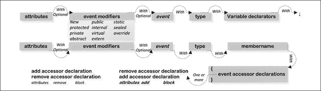

# 一、重新了解 C#：详细介绍我们都知道的语言

本章将讨论 C# 语言的基础知识。它以一个平方数生成器程序的例子开始，解释 C# 程序的基本结构，C# 如何编译 C# 程序，然后解释实时编译。您将了解 C# 语言的词法元素，不同的类型，如值类型和引用类型、变量、参数和语句，以及`interface`、`enum`和`delegate`类。

### 平方数使用 C#

清单 1-1 显示了一个简单的程序，它计算一个给定数字的平方，并显示这个平方的数字作为输出。

***清单 1-1。**平方数程序*

`using System;                                   **/* importing namespace */**

namespace Ch01                                  **/* namespace declaration */**
{
    class Program                               **/* class declaration*/**
    {
        static void Main(string[] args)         **/* method declaration */**
        {
            PowerGenerator pg = new PowerGenerator();
            pg.ProcessPower();
        }                                       **/* end of method declaration */**
    }                                           **/* end of class declaration */**

    public class PowerGenerator
    {
        const int limit = 3;                    **/* constant declaration */**
        const string
                  original = "Original number",` `                  square   = "Square number";
        public void ProcessPower()
        {
            Console.WriteLine("{0,16}{1,20}",
                    original, square);          **/* statement*/**
            for (int i = 0; i <= limit; ++i)    **/* iteration statement*/**
            {
                Console.Write("{0,10}{1,20}\n", i, Math.Pow(i, 2));
            }
        }
    }
}                                           **/* end of namespace declaration */**`

C# 程序由语句组成，并且这些语句中的每一条都按顺序执行。在[清单 1-1](#list_1_1) 中，`Math`类的`Pow`方法处理一个数字的平方，`Console`类的`Write`方法在控制台上显示处理后的平方数作为输出。当[清单 1-1](#list_1_1) 使用 C# 编译器`csc.exe`编译并执行可执行文件时，它将产生输出:

`Original number       Square number
       0                    0
       1                    1
       2                    4
       3                    9`

[清单 1-1](#list_1_1) 在名称空间`Ch01`中包含一个名为*程序*的类。一个*命名空间*用来组织类，*类*用来组织一组函数成员，称为方法。一个*方法*是在花括号{}内定义的语句块，比如一个类内的`{statement list}`，例如:

`static void Main( string[] args ){……}`

一个`int`文字`3`和`string`文字“`Original number`”和“`Square number`”在程序中被用来定义三个变量。在[清单 1-1](#list_1_1) 中，迭代语句`for`用于迭代处理。局部变量`i`在`for`循环中被声明为循环变量。下一节将探讨 C# 程序的编译过程。

### C# 程序的编译

C# 编译器将 C# 源代码编译成模块，最终转换成程序集。*程序集*包含中间语言(IL)代码以及关于程序集的元数据信息。所有这些都发生在程序的编译期。[图 1-1](#fig_1_1) 演示了一个 C# 程序的编译过程。

***图 1-1。**一个 C# 程序的编译过程*

公共语言运行库(CLR)使用程序集。它加载该程序集并将其转换为本机代码来执行该程序集，如[图 1-1](#fig_1_1) 所示。

CLR 执行一个程序的时候，是一个方法一个方法的执行程序，在执行任何一个方法之前(除非这个方法已经被 JITTER 了)，JITTER 需要把它转换成原生代码。编译器指的是 CLR 的实时(JIT)编译器，它负责将 IL 代码编译成本机指令以供执行。CLR 从程序集中检索该方法的适当元数据信息，提取该方法的 IL 代码，并将内存块分配到堆上，抖动将在堆中存储该方法的 JITTER 本机代码。下一节将探讨将 IL 代码转换成本机代码的 Jitting 过程。

#### Jitting 一个 C# 程序

[图 1-1](#fig_1_1) 显示了在运行时，作为 CLR 一部分的 JIT 编译器将 IL 代码编译成本机代码。让我们分析一下[清单 1-1](#list_1_1) ，看看方法的 IL 代码是如何被转换成本机代码的。

*1。步骤 1* :当 CLR 加载从[清单 1-1](#list_1_1) 产生的程序集时，`Program`类和`PowerGenerator`类的方法还不会被 JIT 抖动。在[图 1-2](#fig_1_2) 中，你可以看到`Program`类的`Main`方法和`PowerGenerator`类的`ProcessPower`方法还没有被 JIT，如其`Not JITTED yet`状态所示。一段时间后，JIT 将`Main`方法的 IL 代码转换为本机代码，并且`Main`方法的方法描述表的状态显示了存储在堆中的 JITTED 地址。这个地址的内容将包含用于`Main`方法的 JITTED 本地代码。

*2。步骤 2* :抖动仍然没有生成`ProcessPower`方法的本机代码，因为`ProcessPower`方法的状态显示`Not JITTED yet`为状态，`ProcessPower`方法的状态显示`NONE`为 JIT 状态，如图[图 1-2](#fig_1_2) 所示。

***图 1-2。**[清单 1-1](#list_1_1)* 中装配的 Jitting 流程

*3。步骤 3* :一段时间后，JITTER 将`ProcessPower`方法的 IL 代码转换为本机代码，本机代码存储在堆中。[图 1-2](#fig_1_2) 中`ProcessPower`方法的方法描述表显示了`ProcessPower`方法的本地代码地址。存储在堆中的本机代码的内容，如图 1-2 中的[所示，是使用以下命令提取的:](#fig_1_2)

`!u -n 004c0050
!u -n 004c00e8`

 **注:**[图 1-1](#fig_1_1) 中显示的 IL 代码是用`ildasm.exe`反编译的。当来自清单 1-1 的可执行文件执行时，`windbg.exe`被用来探索不同的运行时信息。你可以在第 15 章的[中探索关于`ildasm.exe`和`windbg.exe`工具的更多细节。在](15.html#ch15)[图 1-2](#fig_1_2) 中，使用了不同的调试命令，这也在[第 15 章](15.html#ch15)中讨论。除了`ildasm.exe`和`windbg.exe`工具之外 .NET Reflector 工具用于浏览程序集的 IL/C# 代码。

### 理解 C# 语言

本节探索 C# 语言。您将学习标识符、关键字和文字的语法和用法。您将探索 C# 中使用的不同类型，如值类型和引用类型，如何声明变量，以及在一个程序中可以使用多少种不同类型的变量。您还将了解可以在 C# 中声明的不同类型的语句，最后，您将了解类、类的类型、构造函数、字段和方法。

#### 标识符

*标识符*是应用中用来标识名称空间、类、方法、变量、委托、接口等的名称。[图 1-3](#fig_1_3) 展示了标识符的可能形式。

***图 1-3。**标识符声明的可能形式*

[图 1-3](#fig_1_3) 展示了用于定义标识符的字符和数字的可能组合。

> *   The identifier consists of Unicode characters, or it can start with the underscore character or the character `(_)` and other characters, such as `_identifier` or `_iden77tifier`, or `\u005F\u005FIdentifier` (compiled as `__Identifier`).
> *   An identifier can be prefixed with the at symbol (`@`), such as `@int` (as used in [Listing 1-2](#list_1_2) ), which is called a word-for-word identifier. To use keywords as identifiers, you need to prefix `@` with keywords.
> *   Unicode escape is used to define an identifier, such as "`cl\u0061ss`" and "When C# compiler compiles" `cl\u0061ss` "as a class.

清单 1-2 显示了标识符在程序中的用法。

***清单 1-2。**标识符的例子*

`using System;

/* **Ch01 is the identifier to name the namespace***/
namespace Ch01
{
    /* **Program is the identifier to name the class** */
    class Program
    {
        /* **Main is the identifier to name the method** */
        static void Main(string[] args)
        {
            /* **a and _a is the identifier to name the variable** */
            int a =  10, _a = 20;
            /* **Verbatim identifier - start with an @ prefix** */
            int   @int = 10;

            Console.WriteLine("{0}\t{1}\t{2}", a,_a, @int);
        }
    }
}`

该程序将产生以下输出:

`10      20      10`

反编译后的 IL 代码(使用[清单 1-2](#list_1_2) 中的`ildasm.exe`反编译)显示了变量名，如`a`、`_a`和`@int`，是如何被 C# 编译器编译的:

`.method private hidebysig static void Main(string[] args) cil managed
{
    .entrypoint
    .maxstack 4
    .locals init (
        [0] int32     a,         **/* a compiled as a */**
        [1] int32     _a,        **/* _a compiled as _a */**
        [2] int32    int)        **/* @int compiled as int */**
**    /* Code removed */**
}`

IL 代码显示变量`a`和`_a`按照 C# 源代码中的定义进行编译，但是`@int`被编译为`int`，其中 C# 编译器从逐字标识符中删除了`@`字符。

#### 关键词

一个*关键字*是一个字符序列，比如标识符，但是它被 C# 编译器保留使用，除了它可以在前缀为`@`字符时用作标识符。C# 语言支持将`@`字符作为变量名的前缀，但是通常不使用它。[清单 1-3](#list_1_3) 展示了关键字在一个方法中的用法。

***清单 1-3。**关键词的例子*

`static void Main(string[] args)
{
    int a = 100, @int = 100;            **/* int is keyword and @int used**
                                         *** as identifier***/
    try {                               /* **try is keyword** */
         Console.Write(a / @int);
    }
    catch {
         throw;
    }                                   /* **catch and throw is keyword** */
}`

在[清单 1-3](#list_1_3) 中，`int`关键字以`@`为前缀，这使得`int`成为标识符。清单 1-3 中的反编译 IL 代码(使用`ildasm.exe`反编译)展示了 C# 编译器如何编译关键字:

`.method private hidebysig static void Main(string[] args) cil managed
{
    .entrypoint
    .maxstack 2
    .locals init (
        [0] int32    a,       **/* Code removed */**
        [1] int32    int)     **/* @int translates as int */**
**    /* Code removed */**
}`

IL 代码显示变量`a`按照 C# 源代码中的定义编译，但是`@int`被编译为`int`，C# 编译器从变量名中删除了`@`字符。[表 1-1](#tab_1_1) 列出了 C# 中可用的关键字。

除了[表 1-1](#tab_1_1) 中显示的关键字之外，C# 还有一些上下文关键字。下一节讨论 C# 中的上下文关键字。

##### 上下文关键词

一个*上下文关键字*在 C# 中不是一个保留字，但它在代码中用来提供特定的含义。[表 1-2](#tab_1_2) 显示了 C# 中可用的上下文关键字列表。

#### 文字

在 C# 中，一个*字面值*用于表示源代码中的值，或者一个字面值可以是嵌入源代码中的一段数据，比如:

`string book    = "Expert C# 5.0";       /* "**Expert C# 5.0" represents a string**
                                         *** literal in source code** */
int chapters   = 14;                    **/* 14 is the int literal used for the**
                                         *** chapters variable */**`

[表 1-3](#tab_1_3) 列出了 C# 语言中使用的六种文字类型。

##### 布尔文字

C# 中可以使用两种类型的布尔文字值:

`bool myBoolAsTrue    = true;
bool myBoolAsFalse    = false;`

##### 整数文字

整数文字用于表示`int`、`uint`、`long`和`ulong`的值:

`long one           = 30l;                /* **long literal 30l with suffix l** */
**uint two**           = **0x2u;**               /* **uint literal 0x2u in Hexadecimal**
                                          *** format (starts with 0x)** */
**int three**          = **3;**                  /* **int literal** 3 */
**ulong hundred**      = **100;**                /* **ulong literal 100 which has more**
                                          *** than one decimal digit** */`

图 1-4 展示了整数文字的可能形式。

***图 1-4。**整数文字声明的可能形式*

从[图 1-4](#fig_1_4) 可以看出，整数文字可以是十进制整数文字，也可以是十六进制整数文字。这些将在下一节中讨论。

###### 十进制整数文字

十进制整数文字以一个或多个十进制数字(取决于存储它的类型大小)和一个整数类型后缀开始，例如 7，77，77u，77l。如图 1-4 所示，一个整数类型的后缀是可选的，用来定义十进制整数文字。

###### 十六进制整数文字

十六进制整数文字以`0x`开头，表示它是十六进制格式，还有一个或多个(取决于使用它的字体大小)十六进制数字和一个整数类型后缀，例如 0x7、0x77、0x77l。如图 1-4 所示，整数类型后缀是可选的，用来定义十六进制整数文字。

##### 真实文字

*实值*用于表示`float`、`double`和`decimal`的值:

`double one          = 30.1;         /* **double literal** 30.1 */
float two           = 30;           /* **float literal 30***/
double three        = 30.1e+1;      /* **double literal with exponent**
                                     *** part e+1, 30.1e+1** */
double hundred      = 100.12E-1;    /* **double literal with E-1, 100.12E-1** */`

真实文字的可能形式在[图 1-5](#fig_1_5) 中展示。

***图 1-5。**真实文字声明的可能形式*

##### 字符文字

*字符文字*代表单个字符，由单引号中的一个字符组成:

`**'a character'**`

例如:

`'M'
'R'`

当声明一个包含反斜杠字符(`\`)的字符文字时，它必须跟一个转义序列字符，如[表 1-4](#tab_1_4) 所示。

例如:

`**/* declare a char variable */**
char charLiteral;

**/* assign variety of the escape characters on multiple lines.**
** * Each of the escape character will produce respective output as**
** * describes on the above table.*/**

charLiteral = '\'';   **/*        \ character follows by '     */**
charLiteral = '\"';   **/*        \ character follows by "     */**
charLiteral = '\\';   /***        \ character follows by \     */**
charLiteral = '\0';   **/*        \ character follows by 0     */**
charLiteral = '\a';   **/*        \ character follows by a     */**
charLiteral = '\b';   **/*        \ character follows by b     */**
charLiteral = '\f';   **/*        \ character follows by f     */**
charLiteral = '\n';   **/*        \ character follows by n     */**
charLiteral = '\r';   **/*        \ character follows by r     */**
charLiteral = '\t';   **/*        \ character follows by t     */**
charLiteral = '\x4';  **/*        \ character follows by x     */**
charLiteral = '\v';   **/*        \ character follows by v     */**

**/* If you declare a character literal as shows below, the C# compiler**
** * shows compile time error as \ does not follows any escape character. */**

//char charLiteral = '\';`

##### 空文字

在 C# 中，`null`文字用于引用类型，除非值类型用作`nullable`类型，否则不能用于值类型。清单 1-4 展示了`null`在程序中的用法。

***清单 1-4。**空文字的例子*

`using System;
namespace Ch01
{
    class Program
    {
        static void Main(string[] args)
        {
            Book aBook            = null; /* **Reference type can be set with**
                                           *** null literal */**
            int chapters          = null; /* **Compiler error for value type**
                                           *** when set with null literal*/**
            Nullable<int> pages   = null; /* **null can be set in value type**
                                           *** when it is a type of Nullable** */
        }
    }
    class Book { }
}`

##### 字符串文字

一个`string`字面值用来表示源代码中的一系列字符。C# 编译器支持两种形式的 s `tring`文字:常规的`string`文字和逐字的`string`文字。

源代码中使用了一个`string`文字，如代码所示:

`string address  = "Zero Point, Prometheus";        /* **Regular string literal** */
string source   = @"J:\Book\ExpertC#2012\Ch01";    /* **Verbatim string literal**
                                                    *** with @***/
string bookName = @"Expert C# 5.0
                   : with the .NET 4.5 Framework"; /* **Verbatim string literal**
                                                    *** in multiple lines** */
string regularString    = "One\tTwo";              /* **One       Two***/
string verbatimString   = @"One\tTwo";             /* **One\tTwo***/`

[图 1-6](#fig_1_6) 显示了`string`文字的可能形式。

***图 1-6。**字符串文字声明的可能形式*

[图 1-6](#fig_1_6) 演示了一个常规的`string`文字字符需要在双引号(`""`)内声明，而在双引号`string`文字内不能使用一个字符，如`"` ( `U+0022` - Unicode 表示的`"`)、`\`(`U+005c`-Unicode 表示的`\`)，或一个新的行字符，如`CR`(回车)或`LF`(换行)。

当在常规`string`文字中声明包含反斜杠字符的`string`文字时，该字符后面必须跟有`'`、`"`、`\`、0、`a`、`b`、`f`、`n`、`r`、`t`、`x`、`v`字符中的一个，如[表 1-4](#tab_1_4) 所示。例如:

`**/* declare a string variable */**
string stringLiteral;

**/* assign variety of the escape characters on multiple lines.**
** * Each of the escape character will produce respective output as**
** * describes on the Table 1-4.*/**

stringLiteral = "A String Literal with  \' "; **/* \ character follows by '        */**
stringLiteral = "A String Literal with  \" "; **/* \ character follows by "        */**
stringLiteral = "A String Literal with  \\ "; **/* \ character follows by \        */**` `stringLiteral = "A String Literal with  \0 "; **/* \ character follows by 0        */**
stringLiteral = "A String Literal with  \a "; **/* \ character follows by a        */**
stringLiteral = "A String Literal with  \b "; **/* \ character follows by b        */**
stringLiteral = "A String Literal with  \f "; **/* \ character follows by f        */**
stringLiteral = "A String Literal with  \n "; **/* \ character follows by n        */**
stringLiteral = "A String Literal with  \r "; **/* \ character follows by r        */**
stringLiteral = "A String Literal with  \t "; **/* \ character follows by t        */**
stringLiteral = "A String Literal with  \x4 ";**/* \ character follows by x        */**
stringLiteral = "A String Literal with  \v "; **/* \ character follows by v */**

**/* If you declare a string literal as shows below, the C# compiler**
** * shows compile time error as \ does not follows any escape character. */**

//stringLiteral= "A String Literal with \ "; **/*  Compiler error */**`

#### 评论

C# 语言支持源代码中以下形式的注释:

> *   *Single line* : A single line note begins with `//`, followed by characters other than line breaks.
> *   *Multi-line* : Multi-line comments begin with `/*` and end with `*/`. Between `/*` and `*/`, it contains characters that are regarded as comments by the C# compiler.

例如:

`int daysInStandardYear     = 365;      **// When the year is not a leap year.**
int daysInLeapYear         = 366;      **/* When the year is**
                                        *** a leap year. */**`

C# 编译器在将源代码编译成 IL 代码时，会跳过 C# 源代码中使用的所有注释。例如，当 C# 编译器编译以下程序时，它会在编译成 IL 代码时删除程序中使用的注释:

`namespace Ch01
{
    class Program
    {
        static void Main(string[] args)
        {
            int daysInStandardYear  = 365; **// When the year is not a leap year.**
            int daysInLeapYear      = 366; **/* When the year is**
                                            *** a leap year. */**
        }
    }
}`

反编译(使用 .NET 反射器工具)IL 为这个程序是:

`.class private auto ansi beforefieldinit Program extends [mscorlib]System.Object
{
    .method public hidebysig specialname rtspecialname instance
            void .ctor() cil managed` `    {
        .maxstack 8
        L_0000: ldarg.0
        L_0001: call instance void [mscorlib]System.Object::.ctor()
        L_0006: ret
    }

    .method private hidebysig static void Main(string[] args) cil managed
    {
        .entrypoint
        .maxstack 1
        .locals init (
            [0] int32 daysInStandardYear,
            [1] int32 daysInLeapYear)
        L_0000: nop
        L_0001: ldc.i4 0x16d
        L_0006: stloc.0
        L_0007: ldc.i4 0x16e
        L_000c: stloc.1
        L_000d: ret
    }
}`

反编译后的 IL 代码显示，C# 在编译成 IL 代码时删除了 C# 源代码中使用的注释。

#### 类型

在 C# 中，类型分为两大类:值类型和引用类型。这些将在接下来的章节中讨论。

##### 值类型

值类型的变量直接包含它们的值。[清单 1-5](#list_1_5) 展示了值类型`int (10)`、`struct` ( `Book)`)和`enum` ( `Planets)`)的一个例子。清单 1-5 显示了我们如何在程序中确定值类型的用法。

***清单 1-5。**值类型的例子*

`using System;
namespace Ch01
{
    class Program
    {
        static void Main(string[] args)
        {
            int a                 = 10;               /* **int type** */
            Book book             = new Book();       /* **struct type** */
            Planets planets       = Planets.Earth;    /* **enum type** */` `        }
    }

    struct Book        { }             /* **struct type declaration */**
    enum Planets       { Earth = 0 }   /* **enum type declaration*/**
}`

[图 1-7](#fig_1_7) 展示了可能的不同值类型。

***图 1-7。**值类型声明的可能形式*

[图 1-7](#fig_1_7) 展示了在 C# 中值类型分为两大类，比如`struct`和`enum`。`struct`型又分为`simple`和`nullable`型等等。

###### 简单类型

[表 1-5](#tab_1_5) 至 [1-9](#tab_1_9) 列出了不同类型的积分、它们的范围和精度信息。

T2】

###### 值类型的默认构造函数

*默认构造函数*是由公共无参数实例构造函数隐式声明的值类型，它为该值类型设置默认值。[表 1-10](#tab_1_10) 显示了不同值类型的默认值。

##### 参考类型

在 C# 中，引用类型是`class`类型、`interface`类型、`array`类型或`delegate`类型。[清单 1-6](#list_1_6) 显示了这些引用类型的用法。

***清单 1-6。**参考类型的例子*

`using System;
namespace Ch01
{
    class Program
    {
        static void Main(string[] args)
        {` `            IBook book = new Book();    **/* book is an instance of the Book */**
        }
    }

    interface IBook { }

    class Book : IBook { }
}`

[图 1-8](#fig_1_8) 显示了可能的不同参考类型。

***图 1-8。**引用类型声明的可能形式*

引用类型的值是该类型的实例，称为它的*对象*。[表 1-11](#tab_1_11) 列出了[图 1-8](#fig_1_8) 中显示的不同参考类型。

###### This 关键字和引用类型

`this`关键字是在类中使用的特殊关键字。它是对类型的当前实例的引用。因为静态成员不是实例的一部分，所以`this`关键字不能用在任何类型的静态函数成员中。`this`关键字可以用在下面的类成员中:

> *   `Instance constructors`
> *   `Instance methods`
> *   `Instance accessors of properties and indexers`

清单 1-7 展示了`this`关键字的用法。

***清单 1-7。**This 关键字用法示例*

`using System;
namespace Ch01
{
    class Program
    {
        static void Main(string[] args)
        {
            AClass aClass = new AClass();
            Console.WriteLine(aClass.MethodA(10));
            Console.ReadLine();
        }
    }

    public class AClass
    {
        public int MethodA(int a) { return a * MethodB(); }
        public int MethodB() { return 10; }
    }
}`

[清单 1-7](#list_1_7) 产生输出:

`100`

来自`AClass`的`MethodA`的正文可以写成:

`public int MethodA(int a)
{
    return a * this.MethodB(); **/* this refers to the instance of the**
                                *** AClass in runtime */**
}`

在这个版本的`MethodA`中，`this`关键字用于访问`MethodB`。对于`MethodB`也是如此，但是`Program`类的`Main`方法不能使用`this`关键字，因为它是`Program`类的静态成员。

在[清单 1-7](#list_1_7) 中，`this`关键字没有被直接使用，因为 C# 编译器可以在 C# 源代码中不包含它的情况下处理它。让我们分析来自[清单 1-7](#list_1_7) 的反编译 IL 代码:

`.method public hidebysig instance int32 MethodA(int32 a) cil managed
{
    .maxstack 2
    .locals init (
        [0] int32 CS$1$0000)
    L_0000: nop
    L_0001: ldarg.1

**    /* Points to the this parameter whose value passed by the CLR**
**     * and it will be explored in the Figure 1-9.*/**
    L_0002: ldarg.0

    L_0003: call instance int32 Ch01.AClass::MethodB()` 
`    L_0008: mul
    L_0009: stloc.0
    L_000a: br.s L_000c
    L_000c: ldloc.0
    L_000d: ret
}`

反编译的 IL 代码展示了 CLR 如何将关键字`this`的值作为方法调用的一部分进行传递。在`L_0002`中，`ldarg.0` IL 指令加载调用`MethodA`时传递的第一个参数的值。[图 1-9](#fig_1_9) 详细说明了`this`关键字的使用。

当 CLR 从`Program`类的`Main`方法中调用`MethodA`并从[清单 1-7](#list_1_7) 中的`AClass`的`MethodA`中调用`MethodB`时，CLR 向该方法(属于该类型的实例)传递一个额外的参数作为`this`参数的输入。在这种情况下，关键字`this`将引用对象(在`Main`方法中实例化的`AClass`的实例)。[图 1-9](#fig_1_9) 展示了当 CLR 调用`MethodA`和`MethodB`时，CLR 如何为`this`参数传递值。

***图 1-9。**this 关键字在运行时的用法*

[图 1-9](#fig_1_9) 显示`MethodA`和`MethodB`在`MethodA`和`MethodB`的`Method`状态描述表的`PARAMETERS`部分多了一个参数`this`。当 CLR 从`Main`方法调用`MethodA`和从`MethodA`方法调用`MethodB`时，这个额外的参数被填充为`AClass`的实例。`this`关键字只在实例方法中可见。

最后，`this`关键字也可以使用:

> *   Used to distinguish local variables or parameters in members and classes.
> *   When calling the method, as the actual parameter, as shown in Figure 1-9
> 
> 所示

 `dumpobj`:在`windbg.exe`程序中使用的命令，用于探测存储在堆上的对象的状态。

#### 阵列

*数组*是存储数据集合的数据结构，并允许通过使用简单的索引操作来访问元素。C# 数组的一些特征是:

> *   C# array is zero-indexed; The array index starts from zero.
> *   All array elements of must be of the same type.
> *   An element can be of any type, including array type.
> *   The array can be a one-dimensional array or a multidimensional array.
> *   The array type is a reference type derived from the abstract base type `System.Array`.

在 C# 中，数组可以是一维的、多维的、矩形的、可变长度的或关联的。下一节将探讨这些类型的数组。

##### 一维数组

一维数组通过声明元素类型后跟空方括号来声明，如代码所示:

`int[] arr1;
char[] characters             = { 'a', 'b', 'c' };
double[] arr3         = new double[5];

string[] arr4 = new string[]
{
    "Galactic Centre", "Great Rift", "Interstellar Dust"
};

Console.WriteLine(arr1.Length);         **/* Compile time error:**
                                         *** unassigned variable */**
Console.WriteLine(characters.Length);   **/* 3 */**
Console.WriteLine(arr3.GetLength(0));   **/* 5 */**`

##### 多维数组

多维数组可以是锯齿状的或矩形的。交错数组包含对其他数组的引用:

`double [][]      arr = new double [2][];
              arr[0] = new double [] {1.3, 2.4, 4.5, 6.6};
              arr[1] = new double [] {6.7, 1.1, 3.5};

Console.WriteLine(arr[0].Length);       **/* 4 */**
Console.WriteLine(arr[1].Length);       **/* 3 */**
Console.WriteLine(arr.Rank);            **/* 1 (1 dimension) */**
Console.WriteLine(arr.GetLength(0));    **/* 2 */**
Console.WriteLine(arr.GetLength(1));    **/* Runtime error: Index was outside**
                                         *** the bounds of the array */**`

矩形数组对于索引来说更加紧凑和高效:

`double [,] a         = new double[2, 3];
string[, ,] b        = new string[3, 2, 4];
double[,] arr        =
{
           { 1.3, 2.4, 4.5 },
           { 6.6, 1.2, 3.2 }
};
Console.WriteLine(arr.Length);         **/* 6 */**
Console.WriteLine(arr.Rank);           **/* 2 (2 dimensions) */**
Console.WriteLine(arr.GetLength(0));   **/* 2 */**
Console.WriteLine(arr.GetLength(1));   **/* 3 */**`

##### 可变长度数组

锯齿状或矩形数组在声明后具有固定的长度。名称空间`System.Collections`中的`ArrayList`(在[第 11 章](11.html#ch11)中有详细讨论)类提供了可变长度的数组，如[清单 1-8](#list_1_8) 所示。

***清单 1-8。**可变长度数组的一个例子*

`using System;
using System.Collections;

namespace Ch01
{
    class MainClass
    {
        static void Main(string[] args)
        {
            ArrayList al = new ArrayList();
            al.Add("C#");
            Console.WriteLine(al.Count);       /* 1 */
            Console.WriteLine(al[0]);          /* C# */
        }
    }
}`

该程序将产生以下输出:

`1
C#`

##### 关联数组

如果数组是由名称空间`System.Collections`中的类`Hashtable`(在[第 11 章](11.html#ch11)中有详细讨论)创建的，那么它们可以被字符串索引，如[清单 1-9](#list_1_9) 所示。

***清单 1-9。**关联数组的例子*

`using System;
using System.Collections;` `namespace Ch01
{
    class MainClass
    {
        static void Main(string[] args)
        {
            Hashtable htArray   = new Hashtable();
            htArray["1"]        = "Milky way";
            htArray["2"]        = "Galaxy";
            Console.WriteLine(htArray.Count);        /* 2 */
            Console.WriteLine(htArray["1"]);         /* Milky way */
            Console.WriteLine(htArray["2"]);         /* Galaxy */
        }
    }
}`

该程序将产生以下输出:

`2
Milky way
Galaxy`

#### 变量

在 C# 中，*变量*代表包含该值的存储位置。值的类型可以存储在由变量类型确定的变量中。例如:

`**/* a string type variable */**
string bookName         = " Expert C# 5.0: with the .NET 4.5 Framework";
**/* a int type variable */**
int publishedYear       = 2012;`

C# 编译器保证存储在变量中的值始终是它定义的适当类型。

##### 变量的默认值

所有类型实例都有默认值。[表 1-12](#tab_1_12) 显示了不同类型的默认值。

[清单 1-10](#list_1_10) 展示了`default`关键字的用法，它在 C# 中用于返回一个类型的默认值。

***清单 1-10。**不同类型的默认值示例*

`using System;
namespace Ch01
{
    class Program
    {
        static void Main(string[] args)
        {
            Book book   = default(Book);        /* **null** */
            int i       = default(int);         /* **0** */
            float f     = default(float);       /* 0.0 */
            char c      = default(char);        /* **'\0'** */
            bool b      = default(bool);        /* **false** */
            Planets p   = default(Planets);     /* **Earth** */
        }
    }

    class Book      { }           **/* a reference type Book declaration */**
    enum Planets    { Earth=0 }   **/* enum declaration */**
}`

[清单 1-10](#list_1_10) 展示了如何使用`default`关键字来初始化类型的默认值，否则你可以在初始化时显式地设置类型的默认值。

#### 可变存储

C# 中使用了两种变量存储:堆栈和堆。这些将在下面的章节中讨论。

##### 堆

堆栈用于存储局部变量、参数和其他信息。让我们看看 CLR 在执行`Main`方法时是如何维护堆栈的，如[清单 1-11](#list_1_11) 所示。

***清单 1-11。**栈和堆的例子*

`using System;
namespace Ch01
{
    class Program
    {
        static void Main(string[] args)
        {
            Converter converter = new Converter();
            converter.ConvertAndIncrease(10);
        }
    }

    public class Converter
    {` `        public int ConvertAndIncrease(int baseValue)
        {
            int increaseFactor = 10;
            return baseValue + increaseFactor;
        }
    }
}`

当 CLR 调用 c `onverter`对象的`ConvertAndIncrease`方法时，它将创建一个内存块来存储参数、局部变量和其他内容，这被称为该方法的堆栈。[图 1-10](#fig_1_10) 显示了 CLR 执行`ConvertAndIncrease`方法时`Main`方法的堆栈信息。

***图 1-10。**主方法的堆栈状态*

##### 许多

C# 将引用类型的对象存储到堆中(即，当实例化引用类型的实例时，CLR 在堆中分配该实例并返回该对象的引用)。当[清单 1-11](#list_1_11) 中的程序被 CLR 执行时，它将实例化一个`Converter`类的实例到堆上，并将该实例的引用传递回`Main`方法堆栈，如图[图 1-11](#fig_1_11) 所示。

***图 1-11。**实例化引用类型的实例时的堆状态*

堆栈和堆将在第 2 章中详细讨论。

#### 变量类型

C# 定义了七类变量:`static`变量、实例变量、数组元素、值参数、引用参数、输出参数、局部或全局变量。以下部分详细探讨了这些变量。

##### 静态变量

`static`变量是用`static`关键字声明的。在执行定义它的类型的`static`构造函数之前，它开始活跃起来。当关联的应用域不存在时，`static`变量的生命也就不存在了。`static`变量的初始值是该变量类型的默认值。[清单 1-12](#list_1_12) 显示了`static`变量在程序中的用法。

***清单 1-12。**静态变量的例子*

`using System;
namespace Ch01
{
    class Program
    {
        public static int X=100;             **/* Static variable */**

        static void Main(string[] args)
        {
            Console.Write("{0}\t", X);       **/* 100 */**
            Program.X = 200;                 **/* This change affect globally */**
            Console.Write("{0}\t", X);       **/* 200 */**
            Show();
        }

        static void Show()
        {
            Console.Write("{0}\t", Program.X);   **/* 200 */**
        }
    }
}`

该程序将产生以下输出:

`100     200     200`

如果您使用`windbg.exe`工具调试[清单 1-12](#list_1_12) ，您将能够看到`static`变量的范围是类范围的。它不需要编译器实例化包含类的实例，例如，`Program`类的`X`变量不需要实例化`Program`类就可以访问:

`0:000> !name2ee Ch01.exe Ch01.Program
Module:         00232e94
Assembly:       Ch01.exe
Token:          02000002
MethodTable:    00233760
EEClass:        00231264     **/* This address used to explore about the**
                              *** static class such as Program */**
Name:           Ch01.Program`

让我们用程序的`EEClass`地址来看看`Program`类的`static`变量的细节:

`0:000> !dumpclass 00231264
Class Name:                     Ch01.Program
mdToken:                        02000002
File:                           J:\Book\ExpertC#2012\SourceCode\BookExamples\Ch01\bin\Debug\Ch01.exe
Parent Class:                   55094f7c
Module:                         00232e94
Method Table:                   00233760
Vtable Slots:                   4
Total Method Slots:     6
Class Attributes:       100000  
Transparency:           Critical
NumInstanceFields:      0
NumStaticFields:        1
MT         Field    Offset Type          VT Attr    Value Name
5548cfc8   4000001  20     System.Int32  1  static  100   X`

输出显示一个类不需要实例化对其`static`变量的访问。

##### 实例变量

没有使用`static`修饰符声明的字段被称为*实例变量*。[清单 1-13](#list_1_13) 显示了实例变量的一个例子。

***清单 1-13。**实例变量的例子*

`using System;
namespace Ch01
{
    class Program
    {
        static void Main(string[] args)
        {
            AClass anObject = new AClass();
            Console.ReadLine();
        }
    }
    public class AClass
    {
        public int X;
        public AClass()
        {
            Console.WriteLine("Initial value of the X :{0}", X);
            X = 100;
            Console.WriteLine("Updated value of the X :{0}", X);
            MethodA();
        }
        public void MethodA() { }` `    }
}`

该程序将产生以下输出:

`Initial value of the X :0
Updated value of the X :100`

###### 类中的实例变量

当一个类的新实例被实例化时，该类的实例变量就有了生命。此外，当没有对该实例的引用并且该实例的析构函数(如果有)已经执行时，它将不再存在。

###### struts 中的实例变量

一个结构的实例变量与其所属的`struct`类型变量具有完全相同的生命周期。

##### 数组元素

当创建数组实例时，数组元素开始存在，当没有对该数组实例的引用时，数组元素停止存在:

`int[] myArray = new int[]{1,2,3,4,5};        **/* An array of int  */**`

##### 值参数

不带`ref`或`out`修饰符声明的参数是一个*值参数*:

`MethodA(10,10);                          **/* MethodA calls with 10,10 */**
...
void MethodA( int a, int b){}            **/* MethodA has two parameters a, b */**`

##### 参考参数

用`ref`修饰符声明的参数是一个*参考参数*:

`object myObject = new object();
ProcessObject(ref  myObject);
...
static void ProcessObject(ref object aObject)         {}`

##### 输出参数

用 out 修饰符声明的参数是一个*输出参数*。[清单 1-14](#list_1_14) 显示了输出参数的使用。

***清单 1-14。**输出参数示例*

`using System;

namespace Ch01
{
    class Program
    {
        static void Main(string[] args)
        {
            int x;
            WithOutInParameter(out x);
            Console.WriteLine(x);           **/* 100 */**
        }

        static void WithOutInParameter(out int a)
        { a = 100; }
    }
}`

该程序将产生以下输出:

`100`

##### 局部变量

局部变量将被声明为:

`**typeName variableName  = variable initializer or**
**var variableName       = variable initializer**`

它可能出现在一个块中、一条`for`语句中、一条`switch`语句中或者一条`using`语句中。它也可以出现在`foreach`语句或`try`语句的特定`catch`子句中:

`void MethodA()
{
        int a=10;              **/* Example of the local variable */**
}`

清单 1-15 展示了局部变量的使用。

***清单 1-15。**局部变量用法示例*

`using System;
using System.IO;
namespace Ch01
{
    class Program
    {
        static void Main(string[] args)
        {
            AClass aClass = new AClass();
            aClass.MethodA();` `            Console.ReadLine();
        }
    }

    public class AClass
    {
        public void MethodA()
        {
            int a = 10;
            switch (a)
            {
                case 7:
                      Console.WriteLine("...");
                      break;
                case 10:
                       int b = 10;
                      Console.WriteLine(b);
                       break;
                default: Console.WriteLine("Default"); break;
            }
            for (int i = 0; i < 5; ++i) ;
            using (MemoryStream ms = new MemoryStream())
            {
                  ;       **/*Doing nothing*/**
            }
        }
    }
}`

该程序产生以下输出:

`10`

###### 编译时的局部变量

当 C# 编译器将[清单 1-15](#list_1_15) 中的程序编译成 IL 时，它会为`Program`类的`Main`方法添加一个局部变量段，为`ACLass`的`MethodA`添加一个局部变量段，如[清单 1-16](#list_1_16) 和[清单 1-17](#list_1_17) 所示。

***清单 1-16。**反编译为[清单 1-15](#list_1_15) 的 Main 方法的 IL 代码*

`.method private hidebysig static void Main(string[] args) cil managed
{
    .entrypoint
    .maxstack 1

**    /* Local section of the MethodA which will hold all the local**
**     * variable used in the MethodA*/**
    .locals init (
        [0] class         Ch01.AClass aClass)
**    /* code removed */**
}`

***清单 1-17** 。[清单 1-15](#list_1_15)* 的类的方法的 IL 代码

`.method public hidebysig instance void MethodA() cil managed
{
    .maxstack 2

**    /* Local section of the MethodA which will hold all the local variable**
**     * used in the MethodA*/**
    .locals init (
        [0] int32       a,
        [1] int32       b,
        [2] int32       i,
        [3] class       [mscorlib]System.IO.MemoryStream ms,
        [4] int32       CS$4$0000,
        [5] bool        CS$4$0001)
**    /* Code removed */**
}`

[清单 1-16](#list_1_16) 和[清单 1-17](#list_1_17) 显示对于`Program`类的`Main`方法的`.locals`部分，有一个变量用于`AClass`的实例，`AClass`的`MethodA`有六个局部变量:

> *   The variables `a` and `b` are used to hold the value of `10`.
> 
> `for`
> 
> `i`
> 
> `for`
> 
> `MethodA`
> 
> `using`
> 
> `ms`
> 
> *   In the `.locals` section, two additional variables, such as `CS$4$0000` and `CS$4$0001`, are used in the `4` and `5` positions. The `CS$4$0000` variable is used to store the value of the case label used in the `switch` block. For example, for case tag value 7 or 10, C# compiler will generate IL code, such as `ldc.i4.7` to load 7 into CS$4$0000 variable, or for case tag value 10, IL instruction will be `ldc.i4.s 10` to load this value into CS$4$0000\. The variable CS$4$0001 is used to store the result of condition `i<5` (used in the statements in [Listing 1-15](#list_1_15) ).

###### 运行时的局部变量

如果你使用`windbg.exe`工具调试[清单 1-15](#list_1_15) 的可执行文件，CLR 会将本地变量的值保存在`MethodA`栈的`LOCALS`部分，如图[图 1-12](#fig_1_12) 所示。

***图 1-12。**方法中的局部变量*

[图 1-12](#fig_1_12) 显示在`MethodA`的堆栈中，CLR 将`0x0000000a (10)`存储在`0x001af1d0`中，将`b`存储在`0x001af1cc`地址中。地址`0x001af1c8`用于`for`语句中使用的`i`变量，而`0x001af1b8`用于`MemoryStream`类。`case`变量的`0x001af1c4`地址和`0x001af1c0`地址用于存储`for`语句中使用的条件(`i<5`)的结果的`bool`值。

#### 参数

*参数*用于 .NET 将数据作为值或变量引用传递到方法中。方法的参数从方法调用时指定的实参中获取它们的实际值:

`public class AClass
{
     public int MethodA(int a)  **/* a is the parameter for the MethodA*/**
    { return a * 10; }
}`

`AClass`的`MethodA`有参数`a`，从中取值，如代码所示:

`static void Main(string[] args)
{
    AClass aClass = new AClass();
    aClass.MethodA(10);         **/* 10 is the argument for the MethodA*/**
}`

在一个方法的运行时，除了方法堆栈的`PARAMETERS`部分中的`this`关键字的额外值，CLR 还存储该方法中使用的参数的所有值，如图[图 1-12](#fig_1_12) 所示。

##### 参数传递的类型

接下来的部分解释了不同类型的参数传递:

> *   Pass parameters by value
> *   `Ref` modifier
> *   `Out` modifier
> *   Meaning of passing by reference
> *   `Params` modifier
> *   Optional parameters
> *   Named parameter

###### 通过值传递参数

值参数用于传递输入参数。值形参对应于一个局部变量，该变量从为形参传递的实参中获取初始值。对值参数的修改不会影响为该参数传递的参数。清单 1-18 提供了一个参数传递的例子。

***清单 1-18。**通过值传递参数*

`using System;
namespace Ch01
{
    class Program
    {
        static void Main(string[] args)
        {
            **/* Initializes with 100 */**
            int x = 100;               
            Console.WriteLine("Before method call :\t{0}", x);

            **/* pass as value to the Increment method*/**
            Increment(x);                  
            Console.WriteLine("After  method call :\t{0}", x);             
        }

        **/* a is the parameter for the MethodA*/**
        static void Increment(int a)          
        {
            ++a;
            Console.WriteLine("Incremented  value :\t{0}",a);
        }
    }
}`

该程序产生了以下输出:

`Before method call  :    100
Incremented  value  :    101
After  method call  :    100`

将使用值类型传递对`Increment`方法的调用；因此，`Increment`方法中参数`a`值的增加不会更新`Main`方法中`X`的原始值。

###### 参考编辑

引用参数用于传递输入和输出参数，在方法执行期间，引用参数表示与实参变量相同的存储位置。引用参数是用`ref`修饰符声明的。[清单 1-19](#list_1_19) 中的例子显示了`ref`参数的使用。

***清单 1-19。**Ref 参数的例子*

`using System;
namespace Ch01
{
    class Program
    {
        static void Main(string[] args)` `        {
            int x = 100;          **/* Needs to initialize x */**
            Console.WriteLine(x); **/* 100 */**
            Increment(ref x);     **/* pass the location (0x052de8b4) of the x */**
            Console.WriteLine(x); **/* 101 */**
        }
        static void Increment(ref int a) **/* a pointing to the same memory**
                                          *** location as x (0x052de8b4)**
                                          *** of Main method */**
        { ++a; }
    }
}`

该程序将产生以下输出:

`100
101`

###### 退出编辑

输出参数用于输出参数传递。输出参数类似于引用参数，只是调用方提供的参数的初始值不是必需的。用`out`修饰符声明一个输出参数。[清单 1-20](#list_1_20) 提供了一个使用`out`修饰符的例子。

***清单 1-20。**Out 修饰符的例子*

`using System;
namespace Ch01
{
    class Program
    {
        static void Main(string[] args)
        {
            int x;                      **/* Does not need to initialize x */**
            SetInitialValue(out x);    
            Console.WriteLine(x);       **/* 1 */**
        }

        static void SetInitialValue(out int a)
        { a = 1; }
    }
}`

该程序将产生以下输出:

`1`

###### 通过引用传递的含义

当参数通过引用传递给方法时，相同的存储位置用于访问该变量。在[清单 1-20](#list_1_20) ，`x`和`a`指的是同一个位置。

###### 参数修饰

参数数组允许向方法传递可变数量的参数。参数数组是用`params`修饰符声明的。只有方法的最后一个参数可以是参数数组，并且参数数组的类型必须是一维数组类型。[清单 1-21](#list_1_21) 提供了一个使用`params`修饰符的例子。

***清单 1-21。**参数修饰符的例子*

`using System;
namespace Ch01
{
    class Program
    {
         static void Main(string[] args)
        {
            string[] planets = { "Jupiter", "\n", "Pallas" };
            Console.WriteLine("{0}", ConcatStrings(planets));
        }

         static string ConcatStrings(params string[] items)
        {
            string result = default(string);
            foreach (string item in items)
            {  result = string.Concat(result, item);  }
            return result;
        }
    }
}`

该程序将产生以下输出:

`Jupiter
Pallas`

###### 可选参数

如果参数的默认值在其声明中指定了，参数可以是可选的，如[清单 1-22](#list_1_22) 所示。

***清单 1-22。**可选参数的例子*

`using System;
namespace Ch01
{
    class Program
    {
        static void Main(string[] args)
        {
            Show();                 **/* Please specify message */**
            Show("Message set");    **/* Message set */**
        }` `        static void Show( string message="Please specify message")
        {
            Console.WriteLine(message);
        }
    }
}`

该程序将产生以下输出:

`Please specify message
Message set`

###### 命名参数

命名参数用于通过名称而不是位置来标识参数。清单 1-23 提供了一个命名参数的例子。

***清单 1-23。**命名参数的例子*

`using System;
namespace Ch01
{
    class Program
    {
        static void Main(string[] args)
        {
            Add(a: 10, b: 10);         **/* 20 */**
            Add(10, b: 10);            **/* 20 */**
            //Add(a: 10, 10);          **/* Compile time error, position */**
        }

        static void Add(int a, int b)
        {
            Console.WriteLine(a + b);
        }
    }
}`

该程序将产生以下输出:

`20
20`

#### 操作员的种类

有三种运算符:

> *   *Unary operator* : Unary operator accepts an operand, using prefix notation (such as `–x`) or suffix notation (such as `x++`).
> *   *Binary operator* : Binary operator has two operands, all of which use infix notation (such as `x - y`).
> *   *ternary operator* : there is only one ternary operator `?:`; It accepts three operands and uses the infix symbol (`condition? whenTrue: whenFalse`).

表达式由操作数和运算符构成。[表 1-13](#tab_1_13) 总结了 C# 中使用的运算符，按照从高到低的优先顺序列出了运算符类别。同一类别中的运算符具有相同的优先级。

#### 报表

程序的操作是用语句来表达的。C# 支持几种类型的语句，其中一些是根据嵌入式语句定义的。块允许在允许单个语句的上下文中编写多个语句。

一个块由使用分隔符(`;`)分隔的语句列表组成:

`**{ list of statement }**`

或者，

`**{**
       **statement ;**
       **statement ;**
       **statement ;**
       **statement ;**
**}**`

[图 1-13](#fig_1_13) 展示了 C# 中可能使用的不同语句。

***图 1-13。**C # 中使用的语句的可能形式*

下面几节将更详细地探讨标记语句、嵌入语句和声明语句。

##### 带标签的语句

以标签为前缀的语句称为`Label`语句。标签语句可以声明为:

`**An identifier following by : with statement or statements.**`

它用在块中，而不是作为嵌入式语句。`goto`语句可以在块内和块外转移控制，但不能转移到块内。让我们看看下面的例子:

`public void MethodA()
{
    int i = 0;
    while (++i < int.MaxValue)
    {
        if (i == int.MaxValue / 2)
            goto Display;        **/* Program control will transfer to the label**
                                  *** Display when the condition meets. */**
    }
    Display: Console.WriteLine(i);
}`

`Display`标签可以写成:

`Display:
    {
        Console.WriteLine("Labeled statement");
        Console.WriteLine(i);
        Console.WriteLine("End Labeled statement");
    }`

在 C# 代码中使用`Label`语句将程序控制从一个地方转移到另一个地方。在`MethodA`的 IL 代码中，使用指令`br`翻译`Label`语句，如[清单 1-24](#list_1_24) 所示。

***清单 1-24。**反编译方法 a 的 IL 代码*

`.method public hidebysig instance void MethodA() cil managed
{
    .maxstack 2
    .locals init (
        [0] int32 i,
        [1] bool CS$4$0000)
    L_0000: nop
    L_0001: ldc.i4.0
    L_0002: stloc.0
    L_0003: br.s L_0018
    L_0005: nop
    L_0006: ldloc.0
    L_0007: ldc.i4 0x3fffffff
    L_000c: ceq
    L_000e: ldc.i4.0
    L_000f: ceq
    L_0011: stloc.1
    L_0012: ldloc.1
    L_0013: brtrue.s L_0017

**    /* The program control will transfer to L_0028 to execute the statements**
**     * define for the Display label in C#. It will skip the execution of the**` `     *** statements from L_0017 to L_0026 the CLR will execute the statement**
     *** from L_0028 to L_0052.*/**
    L_0015: br.s L_0028

    L_0017: nop
    L_0018: ldloc.0
    L_0019: ldc.i4.1
    L_001a: add
    L_001b: dup
    L_001c: stloc.0
    L_001d: ldc.i4 0x7fffffff
    L_0022: clt
    L_0024: stloc.1
    L_0025: ldloc.1
    L_0026: brtrue.s L_0005

**    /* Display labeled start from here and end at L_0045 */**
    L_0028: nop
    L_0029: ldstr "Labeled statement"
    L_002e: call void [mscorlib]System.Console::WriteLine(string)
    L_0033: nop
    L_0034: ldloc.0
    L_0035: call void [mscorlib]System.Console::WriteLine(int32)
    L_003a: nop
    L_003b: ldstr "End Labeled statement"
    L_0040: call void [mscorlib]System.Console::WriteLine(string)
    L_0045: nop
    L_0046: nop
    L_0047: ldstr "Continue with the rest of the statements in the method"
    L_004c: call void [mscorlib]System.Console::WriteLine(string)
    L_0051: nop
    L_0052: ret
}`

##### 声明语句

*声明语句*用于声明一个局部变量(之前讨论过)或一个常量。下一节进一步解释常量变量声明。

###### 常量声明

在常数声明中，可以声明一个或多个常数。以下代码行显示常量变量`book`已被声明:

`public const string book = "Expert C# 5.0";`

##### 嵌入式语句

以下部分将探讨不同的嵌入式语句，例如空语句、表达式语句、选择语句、迭代语句、跳转语句、`try`语句、`lock`语句、`using`语句和`yield`语句。

###### 空白语句

空语句什么也不做，只是在没有操作要执行时使用。空语句可以声明为:

`**;**
**empty statement defined by ;**`

以下示例用于解释空语句:

`public void MethodA()
{
    int i = 0;
    while (++i < int.MaxValue)
        ;                         **/* ; Does nothing in here except elapsed**
                                   *** time to execute the looping until**
                                   *** int.MaxValue reached*/**
    Console.WriteLine(i);
}`

###### 表达式语句

表达式语句对表达式求值。表达式语句将是下列语句之一:

> *   Call expression
> *   Object creation expression
> *   assignment expression
> *   Up-down or down-down expression

清单 1-25 中的例子显示了不同表达式的用法。

***清单 1-25。**表达式语句示例*

`using System;
namespace Ch01
{
    class Program
    {
        static void Main(string[] args)
        {
            int x, y;                     **/* Declaration statement */**
            x = 10;                       **/* Assignment expression */**
            y = 12;                       **/* Assignment expression */**
            ++x;                          **/* Increment expression */**
            --y;                          **/* Decrement expression */**
            Show(x, y);                   **/* Method call expression which will**` `                                           *** show 22 as output*/**
            string message =
                   new string('.', 10);   **/* object instantiation expression */**
            Console.WriteLine(message);   **/* Method call expression which will**
                                           *** show method */**
        }

        static void Show(int a, int b)
        {
            Console.WriteLine(a + b);
        }
    }
}`

该程序将产生以下输出:

`22
..........`

###### 选择语句

在 C# 中，选择语句用于根据给定的条件选择可能执行的语句。在 C# 中，选择语句有两种:`if`和`switch`。`if`声明的声明将是:

`**if  ( boolean expression )  embedded statement**`

或者

`**if  ( boolean expression )  embedded statement else embedded statement**`

`switch`语句的声明应该是:

`**switch ( expression )**
{
   **One or more switch block which consists of the switch label along with the statement or**
**statements.**
}`

`switch`标签应该是:

`**case constant expression: statements**
**default: statements**`

以下示例显示了`if`和`switch`语句的用法:

`public static void MethodA(int a)
{
    if (a < 10)
    {
        switch (a)
        {
            case 1:
            case 2:
            case 3:
            case 4:
**                /* Following statement will execute when a is in range**` `                 *** of {1,2,3,4} */**
                Console.WriteLine(a);
                break;

            case 5:
**                /* Following statement will execute when a is 5 */**
                Console.WriteLine(a);
                break;

            default:
**                /* otherwise */**
                Console.WriteLine("Input < 10");
                break;
        }
    }
    else
    {
        Console.WriteLine("Input > 10");
    }
}`

在程序中使用时，`MethodA`将为值集{1，4，5，7}生成以下输出:

`1
4
5
Input < 10`

###### 迭代语句

为了在 C# 中执行重复的语句，将使用`while`、`do`、`for`和`foreach`语句。`while`声明的声明将是:

`**while  ( boolean expression )  embedded statement**`

`do`语句的声明应该是:

`**do embedded statement while  ( boolean expression ) ;**`

`for`语句的声明应该是:

`**for (**
      **local variable declaration or statement expression;**
      **boolean expression;**
**      statement expression or statement expression list along with comma (,)**
**      separated statement expression**
**      )**
**        embedded statement**`

`foreach`语句的声明应该是:

`**foreach (**
        **local variable type follows by an identifier and this follows**
        **in**` `**        along with an expression**
        **)**
        **embedded statement**`

以下是使用这些语句的示例:

`public static void MethodA(int a) {
    do
    {
**        /* Iterate through the Enumerator and extract each of the item from**
**         * the data source*/**
        foreach (char ch in "Expert C# 5.0" + Environment.NewLine)
            Console.Write(ch);

**        /* loop through until does not meet the condition */**
        for (int i = 0; i <= 2; ++i)
            ++a;
    } while (a <= 10);    **/* loop through until does not meet the condition */**
}`

在程序中使用值 1 时，`MethodA`将产生以下输出:

`Expert C# 5.0 Expert C# 5.0
Expert C# 5.0
Expert C# 5.0`

###### 跳转语句

在 C# 中，要转移程序执行的控制权，可以使用`break`、`continue`、`goto`、`return`、`throw`等跳转语句之一。`while`语句的声明应该是:

`**break ;**`

`continue`语句的声明应该是:

`**continue ;**`

`goto`语句的声明应该是:

`**goto identifier ;**`

`return`语句的声明应该是:

`**return expression ;**`

`throw`语句的声明应该是:

`**throw expression ;**`

以下示例解释了语句的用法:

`public static void MethodA(int a) {
    do
    {` `        foreach (char ch in "Expert C# 5.0\t" + Environment.NewLine)
        {
            if (Environment.NewLine.Contains(ch.ToString()))
                break;
            Console.Write(ch);
        }
    } while ((a = MethodB(a)) <= 10);
}

public static int MethodB(int a)
{
    if (a == 100)
        throw new Exception("Error: a>10");
    return ++a;
}`

当在程序中使用时，`MethodA`和`MethodB`将为值 1 产生以下输出:

`Expert C# 5.0   Expert C# 5.0   Expert C# 5.0   Expert C# 5.0   Expert C# 5.0
Expert C# 5.0   Expert C# 5.0   Expert C# 5.0   Expert C# 5.0   Expert C# 5.0`

###### Try 语句

`try`语句提供了一种机制，用于捕获在块执行期间发生的异常。此外，`try`语句提供了指定代码块的能力，当控制离开`try`语句时，该代码块总是被执行:

`public static int MethodB(int a)
{
    try
    {
        return Int16.MaxValue / a;
    }
    catch (DivideByZeroException dbze)
    {
        Console.WriteLine(dbze.Message);
    }
    finally
    {
        Console.WriteLine("Execute always");
    }
    return -1;
}`

当在程序中使用时，`MethodB`将为值 0 产生以下输出:

`Attempted to divide by zero. Execute always
-1`

###### 锁定语句

`lock`语句获取给定对象的互斥锁，执行一条语句，然后释放锁。`lock`语句可以如下例所示进行声明:

`** lock   (   expression   )   embedded-statement**`

`lock`陈述的形式

`lock(x) {/*  some code */ }`

由 C# 编译器编译，如下面的伪代码所示:

`System.Threading.Monitor.Enter(x);
try      { /*  some code */ }
finally { System.Threading.Monitor.Exit(x); }`

[清单 1-26](#list_1_26) 显示了一个`lock`语句的例子。

***清单 1-26。**使用值类型的锁语句示例*

`using System;
namespace Ch01
{
    class Program
    {
        static void Main(string[] args)
        {
            int a = 0;
            lock (a)
            {
                Console.WriteLine(a);
            }
        }
    }
}`

当您编译[清单 1-26](#list_1_26) 时，C# 编译器将生成以下编译时错误:

`'int' is not a reference type as required by the lock statement`

编译时错误的原因是因为`lock`语句可以用于引用类型，而不能用于值类型，如[清单 1-27](#list_1_27) 所示。

***清单 1-27。**使用引用类型的锁语句示例*

`using System;
namespace Ch01
{
    class Program
    {

        static void Main(string[] args)
        {
            AClass anObject = new AClass();
            lock (anObject)` `            {
                Console.WriteLine(anObject.ToString());
            }
        }
        class AClass { }
    }
}`

该程序产生以下输出:

`Ch01.Program+AClass`

让我们看看[清单 1-27](#list_1_27) 的 IL 代码，看看 C# 编译器是如何编译`lock`语句的。[清单 1-28](#list_1_28) 展示了 C# 编译器如何在幕后处理`lock`语句。

***清单 1-28。** IL 相当于[清单 1-27](#list_1_27)T5】*

`.method private hidebysig static void  Main(string[] args) cil managed
{
  .entrypoint
  // Code size       54 (0x36)
  .maxstack  2
  .locals init ([0] class Ch01.Program/AClass anObject,
           [1] bool '<>s__LockTaken0',
           [2] class Ch01.Program/AClass CS$2$0000,
           [3] bool CS$4$0001)
  IL_0000:  nop
  IL_0001:  newobj     instance void Ch01.Program/AClass::.ctor()
  IL_0006:  stloc.0
  IL_0007:  ldc.i4.0
  IL_0008:  stloc.1

**  /* try..finally block added to the code */**
  .try
  {
    IL_0009:  ldloc.0
    IL_000a:  dup
    IL_000b:  stloc.2
    IL_000c:  ldloca.s   '<>s__LockTaken0'

**    /* Instance of the AClass is now Enter into the Threading Monitor and from**
**     * IL_0013 to IL_0021 the CLR will work with it whatever it requires to.*/**
    IL_000e:  call       void [mscorlib]System.Threading.Monitor::Enter(object,
                                                                        bool&)
    IL_0013:  nop
    IL_0014:  nop
    IL_0015:  ldloc.0
    IL_0016:  callvirt   instance string [mscorlib]System.Object::ToString()
    IL_001b:  call       void [mscorlib]System.Console::WriteLine(string)
    IL_0020:  nop
    IL_0021:  nop` 
`**    /* leave.s instruction will execute the closest finally  block which**
**     * will release the instance of the AClass and '<>s__LockTaken0'**
**     * will be released.*/**
    IL_0022:  leave.s    IL_0034
  }  // end .try
  finally
  {
    IL_0024:  ldloc.1
    IL_0025:  ldc.i4.0
    IL_0026:  ceq
    IL_0028:  stloc.3
    IL_0029:  ldloc.3
    IL_002a:  brtrue.s   IL_0033
    IL_002c:  ldloc.2

**    /* Release the lock of the anObject instance.*/**
    IL_002d:  call       void [mscorlib]System.Threading.Monitor::Exit(object)
    IL_0032:  nop
    IL_0033:  endfinally
  }  // end handler
  IL_0034:  nop
  IL_0035:  ret
}`

###### Using 语句

`using`语句获取一个或多个资源，执行一条语句，然后释放资源。`using`语句的声明语句是:

`**using   (    resource-acquisition   )    embedded-statement**
**resource-acquisition:**
        **local-variable-declaration**
**expression**`

[清单 1-29](#list_1_29) 显示了`using`语句的用法。

***清单 1-29。**使用语句的例子*

`using System;
using System.IO;
using System.Text;

namespace Ch01
{
    class Program
    {
        static void Main(string[] args)
        {
            MethodB();
        }` 
`        public static void MethodB()
        {
            using (MemoryStream ms =
                   new MemoryStream(Encoding.ASCII.GetBytes("Expert C# 5.0")))
            {
                int i = 0;
                do
                {
                    int current = ms.ReadByte();
                    Console.Write("{0}\t{1}\n", current, (char)current);
                } while (++i < ms.Length);
            }
        }
    }
}`

该程序将产生以下输出:

`69      E
120     x
112     p
101     e
114     r
116     t
32
67      C
35      #
32
53      5
46      .
48      0`

第 13 章中的[详细讨论了`using`声明。](13.html#ch13)

###### 收益表

`yield`语句在迭代器块中使用，为枚举器对象或可枚举对象生成一个值。`yield`语句可以以下列形式之一使用:

`yield return <expression>;
yield break;`

使用`yield`语句有一些限制:

> *   It can't be used outside the law.
> *   It cannot be used in anonymous functions.
> *   `finally` block that cannot be used for `try` block.
> *   It cannot be used in `try` statements containing any `catch` statements.

如果你做了以上任何一项，C# 编译器都会抱怨。[清单 1-30](#list_1_30) 显示了`yield`语句的用法。

***清单 1-30。**收益表示例*

`using System;
using System.Collections;

namespace Ch01
{
    class Program
    {
        static void Main()
        {
            foreach (int i in GeneratePower(2, 4))
            {
                Console.Write("{0} ", i);
            }
        }

        public static IEnumerable GeneratePower(int initialValue, int range)
        {
            int result = 1;
            for (int counter = 0; counter < range; ++counter)
            {
                result = result * initialValue;
                yield return result;
            }
        }
    }
}` 

该程序将产生以下输出:

`2 4 8 16`

在第 9 章的[中讨论了`yield`语句和它的迭代器。](09.html#ch9)

#### 名称空间

在 C# 中，命名空间用于组织程序。名称空间声明以关键字`namespace`开始，后面是名称空间的名称和主体。可选的`;`(分号)可以用来声明一个名称空间。[清单 1-31](#list_1_31) 给出了一个使用名称空间的例子。

***清单 1-31。**命名空间的例子*

`namespace Ch01
{
    class A { }
    class B { }
}`

名称空间的声明以限定标识符开始，可以是单个标识符，也可以是用点`(.`标记分隔的多个标识符。因此，下面的两个名称空间声明，如清单 1-32 中的[和清单 1-33](#list_1_32) 中的[所声明的，将被 C# 编译器同样对待。](#list_1_33)

***清单 1-32。**使用多个标识符分隔符(.)*

`namespace Ch01Level3.Ch01Level2.Ch01Level1
{
    class ClassA { }
}`

***清单 1-33** 。带有多个标识符分隔符(.)*

`namespace Ch01Level3
{
    namespace Ch01Level2
    {
        namespace Ch01Level1
        {
            class ClassA { }
        }
    }
}`

在[清单 1-32](#list_1_32) 和[清单 1-33](#list_1_33) 中声明的名称空间如[清单 1-34](#list_1_34) 所示编译。

***清单 1-34。**具有多个标识符的名称空间*

`namespace Ch01Level3.Ch01Level2.Ch01Level1
{
    internal class ClassA
    {
**        /* Methods */**
        public ClassA();
    }
}`

当两个名称空间用相同的完全限定名声明时，C# 编译器将这些名称空间的声明合并到一个限定名中，如[清单 1-35](#list_1_35) 所示。

***清单 1-35。**多个名称空间具有相同的完全限定名*

`namespace Ch01
{
    class ClassA { }
}

namespace Ch01
{
    class ClassB { }
}`

[清单 1-35](#list_1_35) 如[清单 1-36](#list_1_36) 所示编译，以组合相同的名称空间声明。

***清单 1-36。**组合名称空间*

`namespace Ch01
{` `    internal class ClassA               {}
    internal class ClassB               {}
    public class Person                 {}
    internal class Program              {}
}`

`using`指令用于导入一个名称空间，如[清单 1-37](#list_1_37) 所示。

***清单 1-37。**使用指令的用法*

`namespace Ch01.Using
{
    using Ch01;                  **/* using statement imports the namespace**
                                  *** defined in the Listing 1-36 */**
    using One=Ch01;              **/* using alias directives One refers to**
                                  *** the Ch01 */**
    class ClassC
    {
        private ClassB classB;
        private One.ClassA classA;
    }
}`

#### 阶级

类是 C# 中最基本的类型。*类*是将状态(属性)和动作(方法)结合在一个块中的数据结构。一个类为动态创建的类实例提供了一个定义，也称为*对象*。一个类将支持:

> *   succeed to
> *   polymorphic
> *   Mechanisms by which derived classes can extend and specialize base classes.

图 1-14 显示了声明一个类的可能方法。

***图 1-14。**类声明的可能形式*

清单 1-38 中显示了一个类声明的例子。

***清单 1-38。**类声明的例子*

`using System;
namespace Ch01
{
    class Program
    {
        static void Main(string[] args)
        {
            Person person = new Person()
            {
                Name            = "Person A",
                Address         = "Address of Person A"
            };
            Console.WriteLine(person.ToString());
        }
    }

    public class Person
    {
        public override string ToString()
        {
            return string.Format("Name: {0}\nAddress:{1}", Name, Address);
        }

        public string Name { get; set; }
        public string Address { get; set; }
    }
    public class Address {};            **/* ; is optional and it used in here**
                                         *** to show the usage of it.*/**
}`

该程序将产生以下输出:

`Name: Person A Address: Address of Person A`

在[清单 1-38](#list_1_38) 中，使用可访问性修饰符`public`用`public`可访问性声明了一个类`Person`。它有两个属性——`Name`、`Address`(使用自动属性声明声明)——并且这个类覆盖基类的`ToString`方法(对于 C# 中的所有类)或`object`类。

##### 目标

类型`object`是 C# 中整个类型层次结构的根，因此所有类型都与它兼容，例如:

`object person                = new Person();
Person anotherPerson         = (Person) person;`

类`System.Object`包含以下由所有类和结构继承的方法:

> *   `Equals`
> *   `ToString`
> *   `GetHashCode`

使用`new`操作符创建类的实例，它:

> *   Allocate memory for the new instance
> *   Call constructor to initialize instance
> *   Returns a reference to the instance.

以下语句创建了两个`Point`对象，并将对这些对象的引用存储在两个变量`p1`和`p2`中:

`Point p1 = new Point(0,0);
Point p2 = new Point(20,30);`

当一个对象不再被使用时，它所占用的内存会被自动回收。在 C# 中，显式地重新分配对象既不必要也不可能。

##### 班级成员

类的成员要么是静态成员，要么是实例成员。静态成员属于类，实例成员属于对象(类的实例)。表 1-14 概述了一个类可以包含的不同种类的成员。

##### 易接近

一个类可以有五种可访问性形式之一:

> *   `Public`: No access restrictions.
> *   `Protected`: Accessible within the containing type.
> *   `Protected internal`: It defines that access is limited to containing classes or types derived from containing classes.
> *   `Internal`: Define that access is limited to programs.
> *   `Private`: It is defined that access is limited to programs or types derived from continuation classes.

这些修饰符有一些优点和缺点，例如，当一个类在一个名称空间中定义时，不能使用修饰符`private`、`protected`或`protected`、`internal`。C# 编译器使用这些修饰符会产生编译时错误:

`namespace Ch01
{
    private class ClassA                 {}
    protected class ClassB               {}
    protected internal class ClassC      {}
}`

C# 编译器在编译这段代码时报错，并显示以下错误信息:

`Elements defined in a namespace cannot be explicitly declared as private, protected, or protected
internal`

另一方面，在嵌套类中使用`private`、`protected`或`protected`、`internal`是有效的，如下面的代码所示:

`namespace Ch01
{
    class Program
    {
        static void Main(string[] args) {}
    }
    public class ClassA         {}
    internal class ClassB       {}

**    /* Nested classes allowed protected, private or protected internal**
**     * modifiers for class declaration */**
    public class ClassC
    {
        protected class ClassD          {}
        private class ClassE            {}
        protected internal class ClassF {}
    }
}`

当没有明确指定可访问性时，`modifier internal`是任何类的默认可访问性:

`class Planets { };                         **/* a class declaration without**
                                            *** specifying accessibility */**`

这将被编译如下:

`internal class Planets                 **/* The C# compiler sets internal as**
                                        *** the accessibility */**` `{
    public Planets(){}                 **/* default constructor provided by**
                                        *** the C# compiler */**
}`

派生类不能具有比基类更大的可访问性，如下面的代码所示:

`namespace Ch01
{
    internal class ClassA                 {}
    public class ClassB:ClassA            {}
}`

C# 编译器在编译这段代码时会产生以下编译时错误:

`Inconsistent accessibility: base class 'Ch01.ClassA' is less accessible than class 'Ch01.ClassB'`

在访问修饰符用法中，除了`protected` `internal`之外，不允许修饰符的并集。[清单 1-39](#list_1_39) 给出了一个这样的例子。

***清单 1-39。**访问修饰符用法示例*

`namespace Ch01
{
    class Program
    {
        static void Main(string[] args)      {}
        protected   internal void MethodA()  {}   **/*  Valid use of access modifiers**
                                                   *** combination */**
        public      internal void MethodA()  {}   **/*  Invalid use of access**
                                                   *** modifiers combination */**
        private     internal void MethodA()  {}   **/*  Invalid use of access**
                                                   *** modifiers combination */**
    }
}`

[清单 1-39](#list_1_39) 由于多重保护修饰符产生了以下异常:

`Error   11      More than one protection modifier        J:\Book\ExpertC#2012\SourceCode\
BookExamples\Ch01\Program.cs    7       16       Ch01
Error   12      More than one protection modifier        J:\Book\ExpertC#2012\SourceCode\
BookExamples\Ch01\Program.cs    8       17       Ch01`

#### 类的类型

有三种类型的类:抽象类、密封类和静态类。以下各节将详细讨论其中的每一项。

##### 抽象类

`abstract`类打算只作为基类使用，它只能作为另一个类的基类使用。您不能创建一个`abstract`类的实例，一个`abstract`类是使用`abstract`修饰符声明的。一个`abstract`类可以包含`abstract`成员或者常规的非抽象成员。一个`abstract`类的成员可以是`abstract`成员和普通成员与实现的任意组合。一个`abstract`类本身可以从另一个`abstract`类派生。例如，[清单 1-40](#list_1_40) 中的代码显示了一个从`abstract`类派生的`class`。任何从`abstract`类派生的类都必须使用`override`关键字实现`class`的所有`abstract`成员，除非派生类本身是抽象的。

***清单 1-40。**抽象类的例子*

`using System;
namespace Ch01
{
    class Program
    {
        static void Main(string[] args)
        {
            StandardCalculator sc = new StandardCalculator();
            Console.WriteLine(sc.Add(10, 10));     **/* 20 */**
            Console.WriteLine(sc.Sub(10, 10));     **/*  0 */**
        }
    }

    public abstract class Calculator
    {
        public abstract int Add(int a, int b);
        public int Sub(int a, int b) { return b - a; }
    }

    public class StandardCalculator : Calculator
    {
        public override int Add(int a, int b) { return a + b; }
    }
}`

该程序将产生以下输出:

`20
0`

##### 密封类

`sealed`修饰符用于防止从一个类派生。[清单 1-41](#list_1_41) 展示了一个`sealed`类的例子。

***清单 1-41。**密封类的例子*

`using System;
namespace Ch01
{
    class Program
    {
        static void Main(string[] args)
        {
            Person person = new Person` `            {
                Age = 30
            };
        }
    }

    public sealed class Person
    {
        public int Age { get; set; }
    }
}`

一个`sealed`类不能用作另一个类的基类，否则会发生编译时错误，例如，如果将`Person`类用作基类，如下面的代码所示:

`public sealed class Person
{
    public int Age { get; set; }
}

public class Alien : Person { }`

C# 编译器将引发以下编译时错误:

`'Ch01.Alien': cannot derive from sealed type 'Ch01.Person'`

一个`sealed`类不能也是一个`abstract`类。`sealed`类提供了某些运行时优化，例如，C# 编译器可能会将`sealed`类实例上的`virtual`函数成员调用转换成非虚拟调用。大多数情况下，在设计工具类时，密封一个类是最有意义的。例如，`System`名称空间定义了许多`sealed`类。

##### 静态类

`static`修饰符用于标记声明为静态类的类。一个`static`类具有以下特征:

> *   It cannot be used for instantiation.
> *   It can only contain static members, or it will generate compile-time errors, such as "`cannot declare instance members in a static class"`".
> *   Extension methods can only be declared in the `static` class. A `static` class may not contain a `sealed` or `abstract` modifier.
> *   The access modifier `protected` or `protected` `internal` cannot be used to define the members of the `static` class, otherwise compile-time errors will occur, for example, for `protected`: `"static classes cannot contain protected members"`.
> *   Instance constructors cannot be declared in the `static` class, or compile-time errors will occur, such as `"Static classes cannot have instance constructors"`.

清单 1-42 展示了一个`static`类的例子。

***清单 1-42。**静态类的例子*

`using System;
namespace Ch01
{
    class Program
    {
        static void Main(string[] args)
        {
            Console.WriteLine("{0}", Calculator.Add(10, 10));
        }
    }

    public static class Calculator     **/* A static class declaration */**
    {
**        /* A static method declaration */**
        public static int Add(int a, int b) { return a + b; }              
    }
}`

该程序将产生以下输出:

`20`

`static`类不包含任何默认构造函数，例如，`Calculator`类的 IL 版本，如以下代码所示:

`.class public abstract auto ansi sealed beforefieldinit Calculator
    extends [mscorlib]System.Object
{
    .method public hidebysig static int32 Add(int32 a, int32 b) cil managed{}
}`

IL 代码显示，`static`类不包含任何默认构造函数，除非您定义了`static`构造函数。

#### 构造器

C# 支持实例和静态构造函数。一个*实例构造器*是一个成员，它实现初始化一个类的实例所需的动作。一个*静态构造函数*是一个成员，当类第一次被加载时，它执行初始化类本身所需的动作。下面的代码显示了一个类的实例构造函数的示例:

`public class Person
{
    private string name;
    public Person()                         **/* Constructor for the Person class */**
    {
        name=string.Empty;
    }
}`

##### 默认构造函数

如果一个类不包含实例构造函数声明，C# 编译器会自动提供一个默认的实例构造函数。默认构造函数只是调用直接基类的无参数构造函数。如果直接基类没有可访问的无参数实例构造函数，则会发生编译时错误。如果类是`abstract`，那么默认构造函数声明的可访问性是`protected`。

***清单 1-43。**默认构造函数的例子*

`using System;
namespace Ch01
{
    class Program
    {
        static void Main(string[] args)
        {
            Person person = new Person();
        }
    }

    public class Person
    {
**        /* Empty class, there hasn't been declared any explicit constructor,**
**         * property or method. After compiling C# compiler will add a**
**         * default constructor*/**
    }
}`

编译[清单 1-43](#list_1_43) 中的程序时，C# 编译器将默认构造函数添加到`Person`类中，如代码所示:

`.class public auto ansi beforefieldinit Person  extends [mscorlib]System.Object
{
**    /* Default constructor .ctor generated by the C# compiler for the**
**     * Person class. */**
    .method public hidebysig specialname rtspecialname instance
     void .ctor() cil managed {}
}`

 **注:** [第十五章](15.html#ch15)讨论了`.ctor`和`.cctor`构造函数。

##### 私有构造函数

当一个类`C`只声明了`private`的实例构造函数时，`C`之外的类就不可能从`C`派生或者直接创建`C`的实例，如下面的代码所示:

`public class Person
{
    private string name;` `    private Person()        **/* private constructor */**
    {
        name = string.Empty;
    }
}`

尝试实例化`Person`类的实例时，`Person`类将无法访问，C# 编译器将显示以下消息:

`Ch01.Person.Person()' is inaccessible due to its protection level`

如果一个类只包含`static`成员，并且您不希望它被实例化，那么您可以通过添加一个`private`构造函数来阻止该类的实例化。此外，如果您有一个没有实例字段或实例方法的类，可以使用一个`private`构造函数来防止该类的实例化。如果您有一个只包含常量的类，您可以使用一个`private`构造函数来防止实例化，因为从类中访问常量并不要求您拥有该类的对象。

##### 可选实例构造函数参数

构造函数初始化器的`this(...)`形式通常与重载结合使用，以实现可选的实例构造函数参数。

###### 静态构造函数

一个`static`构造函数是一个成员，它实现了初始化一个封闭类类型所需的动作。[清单 1-44](#list_1_44) 给出了一个`static`构造函数的例子。

***清单 1-44。**静态构造函数的可能形式*

`using System;

namespace Ch01
{
    class Program
    {
        public static int Y = StaticClass.X + 1;     **/* StaticClass.X= 1 */**
        static Program() { }
        static void Main()
        {
            Console.WriteLine("X = {0}, Y = {1}", StaticClass.X, Program.Y);
        }
    }

    class StaticClass
    {
        public static int X;                         **/*0*/**
        static StaticClass()
        {
            X = Program.Y + 1;                       **/* Program.Y = 0 */**
        }` `    }
}`

该程序将产生以下输出:

`X = 1, Y = 2`

#### 字段

一个*字段*是一个与一个类或者一个类的实例相关联的变量。无论是`static`字段还是实例字段，字段的初始值都是字段类型的默认值。[图 1-15](#fig_1_15) 展示了该字段的声明。

***图 1-15。**字段声明的可能形式*

下面的代码表示已经声明了两个字段`Name`和`FirstTwoDigitOfDob`:

`public class Person
{
    public string Name      = "Mohammad Rahman";  **/* A field of type string */**
    public int FirstTwoDigitOfDob = 19;           **/* A field of type int    */**
    public int a = 0, b = 1, c = 2;         **/* Multiple variable declarator */**
}`

[图 1-15](#fig_1_15) 显示了当你声明一个字段时，你可以使用`new`修饰符来隐藏在派生类中使用相同成员名时的警告，如代码所示:

`public class AClass
{
    public string Name;
}

public class BClass : AClass
{
    public string Name;         **/* Same field name used in the derived class */**
}`

这段代码产生了以下编译时警告:

`Warning 150     'Ch01.BClass.Name' hides inherited member 'Ch01.AClass.Name'. Use the new
keyword if hiding was intended.`

在`BClass`的`Name`字段声明中使用`new`修饰符将消除该警告。作为修饰符，您也可以使用`volatile`关键字，这表明用`volatile`关键字声明的字段可能会被并发线程执行修改。

C# 中有四种类型的字段:静态字段、实例字段、只读字段和可变字段。在接下来的章节中，我们将逐一讨论这些问题。

##### 静态场

用 static 修饰符声明的字段定义了一个静态字段。一个*静态字段*确切地标识一个存储位置。无论实例化了多少个类实例，静态字段都只有一个副本，如下面的代码所示:

`public static int FirstTwoDigitOfDob = 19; **/* A static field of type int */**`

##### 实例字段

没有 static 修饰符声明的字段定义了一个*实例字段*，如下面的代码所示:

`public int FirstTwoDigitOfDob = 19;        **/* An instance field of type int */**`

当该类的一个实例被实例化时，实例变量就存在了，并且一个`class`的每个实例包含该类的所有实例字段的单独副本。实例字段的初始值是变量类型的默认值。

初始化实例字段时，不能引用正在创建的实例字段，如下面的代码所示:

`public class AClass
{
    public int a = 0;
    public int b = a + 1;  **/* The C# compiler complains about this line**
                            *** of statement */**
}`

在`AClass`中，实例字段`b`试图访问刚刚创建的`a`的值，但是 C# 编译器引发了以下编译时错误:

`A field initializer cannot reference the non-static field, method, or property 'Ch01.AClass.a'`

##### 只读字段

当字段声明包含 readonly 修饰符时，声明引入的字段是只读的，如下面的代码所示:

`**/* An readonly field of type int */**
public readonly int FirstTwoDigitOfDob = 19;`

##### 易变场

当字段声明包含 volatile 修饰符时，该声明引入的字段是 volatile 字段，如下面的代码所示:

`**/* An volatile field of type int */**
public static volatile int FirstTwoDigitOfDob = 19;`

#### 方法

一个*方法*是一个实现操作的成员，这些操作可以由一个对象或类来执行。一个方法有一个(可能是空的)参数列表，它表示传递给该方法的值或变量引用，还有一个返回类型，它指定由该方法计算并返回的值的类型。[图 1-16](#fig_1_16) 展示了方法声明的可能形式。

***图 1-16。**方法声明的可能形式*

清单 1-45 展示了一个 C# 方法声明的例子。

***清单 1-45。**方法声明的例子*

`using System;
namespace Ch01
{
    class Program
    {
**        /* A static method */**
        static void Main(string[] args)
        {
            AClass anInstanceOfAClass = new AClass();
            anInstanceOfAClass.Display();
        }
    }

    public class AClass
    {
**        /* An instance method */**
        public void Display()
        {
            Console.WriteLine("Hello world! from the Main method");         
            /* Hello world! from the Main method */
        }
    }
}`

该程序将产生以下输出:

`Hello world! from the Main method`

当你从`AClass`派生出一个名为`BClass`的类，并实现一个与`Display`同名的方法，如代码所示:

`public class BClass:AClass
{
**    /* An instance method */**
    public  void Display()
    {
        Console.WriteLine("Hello world! from the Main method");         
        **/* Hello world! from the Main method */**
    }
}`

C# 编译器将发出警告，如下所示:

`Warning        150        'Ch01.BClass.Display()' hides inherited member 'Ch01.AClass.Display()'. Use the
new keyword if hiding was intended.`

为了消除这个警告，我们需要在方法头中添加`new`修饰符，如图[图 1-16](#fig_1_16) 所示。`BClass`的`Display`方法需要`new`修饰符，如下面的代码所示:

`public new void Display()
{
    Console.WriteLine("Hello world! from the Main method");         
    **/* Hello world! from the Main method */**
}`

##### 方法的类型

有几种类型的方法:静态方法、实例方法、虚拟方法、重写方法、密封方法、抽象方法、外部方法、分部方法和扩展方法。这些将在接下来的章节中讨论。

###### 静态法

一个`static`方法不能在一个特定的实例上使用，只能直接访问静态成员。[清单 1-46](#list_1_46) 给出了一个`static`方法的例子。

***清单 1-46。**静态方法的例子*

`using System;

namespace Ch01
{
    class Program
    {
        static void Main()
        {
            AClass.Method1();        /* Call Method1 but Method2 is not` `                                      * accessible outside of the AClass*/
            Console.ReadLine();

        }
    }
    public static class AClass
    {
        public static void Method1()
        {
            Console.WriteLine("Method 1");
            Method2();
        }
        private static void Method2()
        {
            Console.WriteLine("Method 2");
        }
    }
}`

该程序将产生以下输出:

`Method 1
Method 2`

在一个`static`类中，在一个`static`方法中引用`this`关键字是一个错误，所以编译器会生成一个编译时错误:

`"Keyword 'this' is not valid in a static property, static method, or static field initializer"`

###### 实例方法

instance 方法对特定的实例进行操作，可以访问静态成员和实例成员。`this`关键字可以在调用实例方法的实例中使用。清单 1-47 给出了一个实例方法的例子。

***清单 1-47。**实例方法的例子*

`using System;
namespace Ch01
{
    class Program
    {
        static void Main()
        {
            AClass anObjectOfAClass = new AClass();
            anObjectOfAClass.Method1();
            Console.ReadLine();
        }
    }
    public class AClass
    {
        public void Method1()` `        {
            Console.WriteLine("Method 1");
            this.Method2();        **/* this keyword used to invoke Method2 */**
        }
        private void Method2()
        {
            Console.WriteLine("Method 2");
            Method3();             **/* this keyword can not be used to**
                                    *** static Method3 */**
        }
        public static void Method3()
        {
            Console.WriteLine("Method 2");
        }
    }
}`

该程序将产生以下输出:

`Method 1
Method 2
Method 2`

###### 虚拟方法

实际的`virtual`方法实现基于为其发生调用的实例的运行时类型来确定，而编译时类型用于非虚拟方法。衍生类别`D`可以覆写基底类别`B (D:B)`中定义的虚拟方法。替代修改量替代继承的`virtual`方法。一个新的实现可以提供在基类中定义的`virtual`方法。[清单 1-48](#list_1_48) 给出了一个`virtual`方法的例子。

***清单 1-48。**虚拟方法的例子*

`using System;
namespace Ch01
{
    class Program
    {
        static void Main()
        {
            D anObjectOfDClass = new D();
            anObjectOfDClass.Method1();
            Console.ReadLine();
        }
    }

    public class B
    {
        public virtual void Method1()
        {
            Console.WriteLine(ToString());` `        }
    }

    public class D : B
    {
        public override void Method1() /* virtual method overriden */
        {
            Console.WriteLine(ToString());
        }
    }
}`

该程序将产生以下输出:

`Ch01.D`

###### 抽象方法

一个`abstract`方法是用`abstract`修饰符声明的，并且只允许在一个被声明为抽象的类中使用。一个`abstract`方法是一个没有实现的虚拟方法。例如，如果在非抽象类`AClass`中将`Method2`定义为`abstract`，如以下代码所示:

`public abstract class BaseClass
{
    public abstract void Method1();
}

public class AClass : BaseClass
{
    public override void Method1()
    {
        Console.WriteLine(ToString());
    }

    public abstract void Method2();         **/* The C# compiler complain about**
                                             *** the Method2 */**
}`

C# 编译器引发了一个编译时错误:

`'Ch01.AClass.Method2()' is abstract but it is contained in non-abstract class 'Ch01.AClass'`

抽象方法必须在每个非抽象派生类中重写。[清单 1-49](#list_1_49) 展示了一个`abstract`方法的例子。

***清单 1-49。**抽象方法的例子*

`using System;
namespace Ch01
{
    class Program
    {` `        static void Main()
        {
            AClass anObjectOfAClass = new AClass();
            anObjectOfAClass.Method1();
            Console.ReadLine();

        }
    }
    public class AClass : BaseClass
    {
        public override void Method1()
        {
            Console.WriteLine(ToString());
        }
    }

    public abstract class BaseClass
    {
        public abstract void Method1();
    }
}`

该程序将产生以下输出:

`Ch01.AClass`

###### 密封方法

当一个实例方法声明包含一个`sealed`修饰符时，该方法被称为一个`sealed`方法。如果一个实例方法声明包含了`sealed`修饰符，那么它也必须包含`override`修饰符(来自`AClass)`的`Method2`方法，如[清单 1-50](#list_1_50) 所示)。

***清单 1-50。**密封方法的例子*

`using System;
namespace Ch01
{
    class Program
    {
        static void Main()
        {
            AClass anObjectOfAClass = new AClass();
            anObjectOfAClass.Method1();
            anObjectOfAClass.Method2();

            BClass anObjectOfBClass = new BClass();
            anObjectOfBClass.Method1();
            Console.ReadLine();
        }
    }

    public class BaseClass` `    {
        public virtual void Method1() { Console.WriteLine(ToString()); }
        public virtual void Method2() { Console.WriteLine(ToString()); }
    }

    public class AClass : BaseClass
    {
        public override void Method1() { Console.WriteLine(ToString()); }
        public sealed override void Method2()
        { Console.WriteLine(ToString()); }
    }

    public class BClass : AClass
    {
        public override void Method1() { Console.WriteLine("Overriden"); }
    }
}`

该程序将产生以下输出:

`Ch01.AClass
Ch01.AClass
Overriden`

基类中定义的`sealed`方法不会在派生类中被重写；例如，从`BClass`进一步覆盖`AClass`的`Method2`，如下面的代码所示，将抛出一个编译时错误:

`public class BClass : AClass
{
    public override void Method1()
    {
        Console.WriteLine("Overriden");
    }
    public override void Method2()
    {
        Console.WriteLine("Overriden");
    }
}`

编译时错误将是:

`'Ch01.BClass.Method2()': cannot override inherited member 'Ch01.AClass.Method2()' because it is
sealed`

###### 外部方法

当一个方法声明包含一个`extern`修饰符时，这个方法被称为一个`external`方法。为了使用一种方法来定义除 C# 之外的外部典型语言，使用了`extern`修饰符。例如，如果你想在 C# 应用中使用 Win32 方法`Beep`，你需要使用`extern`修饰符。`extern`修饰符在`DllImport`中作为属性使用。`DllImport`需要提到它在哪个动态链接库(DLL)中实现了相关的方法，例如 `User32.dll`中定义的`Beep`方法。此外，当通过`extern`访问`external`方法时，必须包含一个`static`修饰符。[清单 1-51](#list_1_51) 显示了一个外部方法的例子。

***清单 1-51。**外部方法的例子*

`using System;
using System.Runtime.InteropServices;
namespace Ch01
{
    class Program
    {
        [DllImport("User32.dll")]
        static extern Boolean MessageBeep(UInt32 beepType);

        static void Main()
        {
            MessageBeep((UInt32)BeepTypes.MB_ICONEXCLAMATION);
        }
        enum BeepTypes
        {
            MB_ICONASTERISK = 0x00000040,
            MB_ICONEXCLAMATION = 0x00000030
        }
    }
}`

###### 覆盖方法

当一个实例方法声明包含一个`override`修饰符时，该方法被称为一个`override`方法。一个`override`方法用相同的签名覆盖了一个继承的`virtual`方法。被覆盖的基方法是一个`virtual`、`abstract`或`override`方法。不能将一个`sealed`基方法声明为被覆盖。[清单 1-52](#list_1_52) 显示了一个`override`方法的例子。

***清单 1-52。**覆盖方法的例子*

`using System;
namespace Ch01
{
    class Program
    {
        static void Main()
        {
            AClass anObjectOfAClass = new AClass();
            anObjectOfAClass.Method1();
            anObjectOfAClass.Method2();
            Console.ReadLine();` `        }
    }

    public abstract class BaseClass { public abstract void Method1();}

    public class BaseClass2 : BaseClass
    {
        public override void Method1()
        {
           Console.WriteLine(
                  "Method1 of the BaseClass overridden in the BaseClass2");
        }

        public virtual void Method2()
        { Console.WriteLine("Method2 define as virtual in the BaseClass2"); }

    }
    public class AClass : BaseClass2
    {
        public override void Method1()
        { Console.WriteLine("Method1 of the AClass overridden"); }
        public override void Method2()
        { Console.WriteLine("Method2 of the AClass overridden"); }
    }
}`

该程序将产生以下输出:

`Method1 of the AClass overridden
Method2 of the AClass overridden`

如果不使用`AClass`中被覆盖的`Method2`，如下面的代码所示:

`public class AClass : BaseClass2
{
    public override void Method1()
    {
        Console.WriteLine("Method1 of the AClass overridden");
    }
**    /* Method2 removed from the AClass */ **
}`

而是使用下面的代码:

`AClass anObjectOfAClass = new AClass();
anObjectOfAClass.Method1();
anObjectOfAClass.Method2();
Console.ReadLine();`

它将产生输出:

`Method1 of the AClass overridden
Method2 define as virtual in the BaseClass2`

###### 部分方法

一个`partial`方法的签名定义在一个`partial`类型的一部分中，而它的实现定义在该类型的另一部分中。`partial`方法使类设计者能够提供方法挂钩，类似于事件处理程序，开发者可以决定是否实现。如果开发者没有提供实现，编译器会在编译时移除签名。以下条件适用于分部方法:

> *   The two-part signature of partial type must match.
> *   The law must return to vanity.
> *   Access modifiers or attributes are not allowed. Partial methods are implicitly private.

清单 1-53 提供了一个例子，展示了在分部类的两个部分中定义的分部方法。

***清单 1-53。**分部方法的例子*

`using System;
namespace Ch01
{
    class Program
    {
        static void Main()
        {
            A anObject = new A();
        }
    }

    public partial class A
    {
        public A() { MethodOfA("Partial method"); }
        partial void MethodOfA(string s);
    }

**    /* This part can be in a separate file. */**
    public partial class A
    {
        partial void MethodOfA(String s) { Console.WriteLine("{0}", s); }
    }
}`

该程序将产生以下输出:

`Partial method`

###### 扩展和匿名方法

扩展和匿名方法将在第 4 章中详细讨论。

#### 属性

属性是字段的自然延伸。两者都是具有关联类型的命名成员，访问字段和属性的语法是相同的。但是，与字段不同，属性并不表示存储位置。相反，属性具有指定在读取或写入其值时要执行的语句的访问器。[图 1-17](#fig_1_17) 展示了属性声明的可能形式。

***图 1-17。**财产申报的可能形式*

以下代码是一个示例:

`public class Person
{
    private string address;
    public string Name         **              /* Implicit property declaration */**
    {
        get;
        set;
    }
    public string Address
    {
        get { return address; }       **/* get accessor*/**
        set { address = value; }      **/* set accessor*/**
    }
}`

#### 索引程序

一个*索引器*是一个成员，它使得对象能够以与数组相同的方式被索引。索引器像属性一样被声明，除了成员的名字是`this`，后面是写在分隔符`[`和`]`之间的参数列表。[图 1-18](#fig_1_18) 展示了索引声明的可能形式。

***图 1-18。**索引器声明的可能形式*

清单 1-54 展示了索引器的使用示例。

***清单 1-54。**索引器的例子*

`using System;
namespace Ch01
{
    public delegate void EventHandler(string name);` 
`    class Program
    {
        static void Main(string[] args)
        {
            Planets planets = new Planets();
            for (int i = 0; i <= 8; ++i)
                Console.Write("{0}\t",planets[i]);
            Console.ReadLine();
        }
    }

    public class Planets
    {
        private string[] nameOfThePlanets =
            { "Sun", "Mercury", "Venus", "Earth", "Mars", "Jupiter",
              "Saturn", "Uranus", "Neptune" };

        public string this[int index]
        {
            get
            {
                return nameOfThePlanets[index];
            }
            set
            {
                nameOfThePlanets[index] = value;
            }
        }
    }
}`

该程序将产生以下输出:

`Sun     Mercury Venus   Earth   Mars    Jupiter Saturn  Uranus  Neptune`

#### 自动实现的属性

当某个属性被指定为自动实现的属性时，C# 编译器会为该属性插入一个隐藏的支持字段，并实现访问器来读取和写入该支持字段。清单 1-55 给出了一个显示自动实现属性的例子。

***清单 1-55。**自动实现属性的例子*

`namespace Ch01
{
    class Program
    {
        static void Main(string[] args)
        {
            Book aBook = new Book` `            {
                Name = "Expert C# 5.0: with the .NET 4.5 Framework"
            };
        }
    }
    public class Book
    {
        public Book()
        { Name = default(string); }

        public string Name

        { get; set; }
    }
}`

当 C# 编译器编译[清单 1-55](#list_1_55) 中的代码时，它将为`Name`属性添加额外的字段`<Name>k_BackingField`。这将在[第五章](05.html#ch5)中深入探讨。

#### 结构

*struct*是可以包含数据成员和函数成员的数据结构，但与类不同，它们是值类型，不需要堆分配。一个`struct`类型的变量直接存储结构的数据。[图 1-19](#fig_1_19) 展示了 C# 中可能的`struct`声明。

***图 1-19。**结构声明的可能形式*

[清单 1-56](#list_1_56) 给出了一个`struct`的例子。

***清单 1-56。**结构的例子*

`public struct Point
{
    public const int ZeroPoint = 0;    **/* Constant declaration */**
    public int X;                      **/* Field declaration */**` `    public int Y;                      **/* Field declaration */**
    private int length;
    public Point(int x, int y)         **/* Non-parameterless constructor */**
    {
        X = x; Y = y;
        length = X + Y;
    }
    public string ToString()           **/* Method declaration */**
    {
        return "X" + X + "\n Y:" + Y;
    }
    public int PointLength             **/* Read only Property declaration */**
    {
        get { return length; }
    }
}`

#### 事件

一个*事件*被用作向一个对象或类提供通知的成员。[图 1-20](#fig_1_20) 展示了事件的可能声明。

***图 1-20。**接口声明的可能形式*

清单 1-57 展示了一个 C# 中事件的例子。

***清单 1-57。**事件的例子*

`using System;

namespace Ch01
{
    public delegate void EventHandler(string name);
    class Program
    {
        static void Main(string[] args)
        {
            Book book = new Book();` `            book.ShowBookName += new EventHandler(book_ShowBookName);
            book.Name = "Expert C# 5.0 with .NET Framework 4.5";
            Console.WriteLine(book.Name);
        }

        static void book_ShowBookName(string name)
        {
            Console.WriteLine(name);
        }
    }

    public class Book
    {
        public event EventHandler ShowBookName;
        private string name;

        public string Name
        {
            set
            {
                BookEventArgs eventArgs = new BookEventArgs()
                {
                    BookName = "Book name updated...."
                };
                name = value;
                OnNameChanged(eventArgs);
            }
            get
            {
                return name;
            }

        }

        protected virtual void OnNameChanged(BookEventArgs args)
        {
            EventHandler handler = ShowBookName;
            if (handler != null)
            {
                handler(args.BookName);
            }
        }
    }
    public class BookEventArgs : EventArgs
    {
        public string BookName { get; set; }
    }

}`

在[清单 1-57](#list_1_57) 中，`event`关键字用于定义一个事件并产生以下输出:

`Book name updated....
Expert C# 5.0 with .NET Framework 4.5`

[第八章](08.html#ch8)将详细探讨`event`。

#### 接口

一个*接口*为其成员定义了一个契约或规范，而不是一个实现。当类或结构实现接口时，它必须实现其所有成员。[图 1-21](#fig_1_21) 展示了一个接口可能的声明。

***图 1-21。**接口声明的可能形式*

[清单 1-58](#list_1_58) 显示了一个界面的例子。

***清单 1-58。**界面示例*

`using System;
namespace Ch01
{
    class Program
    {
        static void Main(string[] args)
        {
            Calculator calculator = new Calculator();
            Console.WriteLine(calculator.Add(10, 10));      **/* 20 */**
            Console.WriteLine(calculator.Sub(10, 10));      **/* 0 */**
            Console.WriteLine(calculator.Mul(9, 7));        **/* 63 */**
        }
    }

**    /* interface definition*/**
    interface IAddition  { int Add(int a, int b);} **/* Interface declaration */**
    interface IExAddition{ int Add(int a, int b);} **/* Interface declaration */**
    interface ISubtraction{ int Sub(int a, int b);}**/* Interface declaration */**` `    interface IMultiplication :IAddition                 { int Mul(int a, int b);  }
**/* Extending Interface declaration */**

**    /* interface implementation*/**
    public class Calculator :
        IAddition,
        ISubtraction,
        IMultiplication,
        IExAddition
**/* Multiple interface implementation */**
    {
        public int Add(int a, int b) { return a + b; }

        int IExAddition.Add(int a, int b)
**/* Explicit interface implementation */**
        { return 100 + a + b; }

        public int Sub(int a, int b) { return a > b ? a - b : b - a; }

        public int Mul(int a, int b)
        {
            var result = 0;
            for (int i = 0; i < a; ++i)
                result += Add(0, b);
            return result;
        }
    }
}`

该程序将产生以下输出:

`20
0
63`

在[清单 1-58](#list_1_58) 中，定义了`IAddition`、`IExAddition`、`ISubtration`和`IMultiplication`接口。`IMultiplication`接口来源于`IAddition`接口，这个概念叫做“在 C# 中扩展一个接口”`Calculator`类实现了`IAddition`、`IExAddition`、`ISubtration`和`IMultiplication`接口。由于用于`Add`方法的`IAddition`和`IExAddition`接口之间的冲突，`Calculator`类显式实现了`IExAddition`方法。默认情况下，当类实现接口时，接口成员是密封的。要覆盖任何成员，您需要将该成员标记为`virtual`或`abstract`。清单 1-59 给出了一个这样的例子。

***清单 1-59。**虚拟会员的例子*

`using System;
namespace Ch01
{
    class Program
    {
        static void Main(string[] args)
        {` `            Calculator calculator = new ScientificCalculator();
            Console.WriteLine(calculator.Add(10, 10));     **/* 120 */**
        }
    }

**    /* Interface declaration */**
    interface IAddition { int Add(int a, int b); }                

**    /* Interface implementation */**
    public class Calculator : IAddition                            
    {
        public virtual int Add(int a, int b) { return a + b; }
    }

    public class ScientificCalculator : Calculator
    {
**        public override int Add(int a, int b) { return 100 + a + b; }**
    }
}`

该程序将产生以下输出:

`120`

#### 枚举

一个`enum`类型包含一组命名的常量。图 1-22 展示了一个枚举的可能声明。

***图 1-22。**enum 声明的可能形式*

[清单 1-60](#list_1_60) 中的例子声明了一个名为`Planets`的`enum`类型，有九个常量值，如`Sun`、`Mercury`、`Venus`、`Earth`、`Mars`、`Jupiter`、`Saturn`、`Uranus`和`Neptune`。

***清单 1-60。**枚举用法示例*

`using System;
namespace Ch01
{
    class Program
    {
        public enum Planets` `        {
            Sun,
            Mercury,
            Venus,
            Earth,
            Mars,
            Jupiter,
            Saturn,
            Uranus,
            Neptune
        }
        static void Main()
        {
            DisplayInformation(Planets.Earth);
            DisplayInformation(Planets.Mars);
            DisplayInformation(Planets.Jupiter);
        }
        static void DisplayInformation(Planets planets)
        {
            switch (planets)
            {
                case Planets.Earth:
                    Console.WriteLine("Third planet from the Sun");
                    break;
                case Planets.Mars:
                    Console.WriteLine("The fourth planet from the Sun");
                    break;
                default:
                    Console.WriteLine("Please provide valid Planet name");
                    break;
            }
        }
    }
}`

该程序将产生以下输出:

`Third planet from the Sun
The fourth planet from the Sun
Please provide valid Planet name`

[第六章](06.html#ch6)将探讨关于`enum`的细节。

#### 代表们

一个`delegate`类型代表对具有特定参数列表和返回类型的方法的引用。委托使得将方法视为可以赋给变量并作为参数传递的实体成为可能。[图 1-23](#fig_1_23) 展示了一个委托可能的声明。

***图 1-23。**代表声明的可能形式*

委托类似于其他一些语言(如 C、C++)中的函数指针的概念，但与函数指针不同，委托是面向对象和类型安全的。[清单 1-61](#list_1_61) 声明并使用了一个`delegate`类型的命名函数。

***清单 1-61。**代表的例子*

`using System;
namespace Ch01
{
**    /* A delegate which will encapsulate a method which accept two parameter**
**     * and return int */**
    delegate int BinaryOperation(int x, int y);

    class Program
    {
        static void Main(string[] args)
        {
            Calculate(Add, new Tuple<int, int>(10, 10));       **/* 20  */**
            Calculate(Sub, new Tuple<int, int>(10, 10));       **/*  0  */**
            Calculate(Sub, new Tuple<int, int>(1, 10));        **/*  9  */**
        }

         static void Calculate(
                     BinaryOperation binaryOperation, Tuple<int, int> data)
        {
            Console.WriteLine(binaryOperation(data.Item1, data.Item2));
        }

        static int Add(int x, int y)
        {
            return x + y;
        }

        static int Sub(int x, int y)
        {
            return x > y ? x - y : y - x;
        }
    }
}`

该程序将产生以下输出:

`20
0
9`

[第 7 章](07.html#ch7)将探讨关于委托的细节。在清单 1-61 的[中，一个类`Tuple`被用来表示一组值。C# 4.0 中引入的*元组*是一种具有特定数量和序列的元素的数据结构。它用于表示一组值或从一个方法返回多个值。](#list_1_61)

#### 异常

程序由一系列指令组成，这些指令根据给定的数据(如果有的话)执行特定的操作，以产生操作的预期结果。在执行时，如果指令不能根据提供的数据进行操作，它将为该操作引发一个异常，让用户知道这种意外的行为。清单 1-62 显示了一个当系统不能执行除法运算时抛出异常的例子。

***清单 1-62。**`Division`操作的例子*

`using System;

namespace Ch01
{
    class Program
    {
        static void Main(string[] args)
        {
            int a = 10, b = 0;
            Division div = new Division();
            Console.WriteLine("{0}/{1}={2}", a, b, div.Divide(a, b));
        }

        public class Division
        {
            public int Divide(int a, int b)
            {
                return a / b;
            }
        }
    }
}`

[清单 1-45](#list_1_45) 中的程序旨在根据通过参数`a`、`b`传递的数据进行除法运算。对于`a = 10,`T3 的除法运算会产生一个异常:

`Unhandled Exception: System.DivideByZeroException: Attempted to divide by zero. at Ch01.Program.
Division.Divide(Int32 a, Int32 b) in J:\Book\ExpertC#2012\SourceCode\BookExamples\Ch01\Program.
cs:line 18 at Ch01.Program.Main(String[] args) in J:\Book\ExpertC#2012\SourceCode\BookExamples\
Ch01\Program.cs:line 11`

程序中使用`try`、`catch`和`finally`语句处理异常。[第十三章](13.html#ch13)将探究关于异常的细节。

### 总结

在本章中，我们已经了解了 C# 编译过程，以及 JIT 如何将 IL 代码 JIT 化为本机代码，以使程序能够被操作系统理解。您已经探索了 C# 语言的词汇元素，如标识符、关键字和注释。您已经学习了值类型和引用类型以及如何使用这些类型，并且已经探索了参数以及在程序中使用这些参数在方法调用之间传递数据的不同方式。对关键字`this`进行了详细分析，以理解 CLR 如何将关键字`this`的值作为参数传递的一部分进行传递。

你已经了解了 C# 程序中使用的不同类型的语句，比如空语句、表达式语句、选择语句(比如，`if`、`switch`)、迭代语句(比如，`do`、`for`、`foreach`)、跳转语句(比如`break`、`continue`)、goto 语句，还有`try`、`using`、`lock`、`yield`语句。

本章还探讨了类、类的类型、类中的字段、方法、属性、索引、结构、事件、接口、委托和异常。有了这个基础，我们进入下一章，详细研究内存中的 C# 对象。