# 三、参数

本章将讨论 C# 中的参数。重点将是展示向方法传递参数的不同方式，例如按值传递、按引用传递和传递参数的默认值。您将会找到对这些问题的详细解释，并了解 CLR 如何在幕后处理这些问题。

### 参数

参数是一种机制，用于接受来自方法调用方的方法输入。在方法签名中，您可以定义一个或多个参数来接受输入。这些参数可以是任何类型，例如值类型，例如，`Int32`、`string,`或者实例对象的引用类型、`Person`类型的个人对象等等。

[图 3-1](#fig_3_1) 显示了方法签名定义中使用的参数。

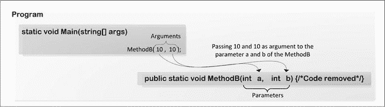

***图 3-1。**C # 中的形参和实参*

当您从方法的调用方接受值时，调用方可以只将值传递给参数，或者传递变量的引用，依此类推。表 3-1 显示了你可以在方法声明中使用的不同类型的参数接受策略。

T2】

### 方法状态描述表

方法状态描述方法执行的环境，方法状态描述表是 CLR 在执行方法时保存与该方法相关的信息的临时存储区。[图 3-2](#fig_3_2) 显示了方法状态表的不同组成部分。

***图 3-2。**方法状态描述表*

让我们检查方法状态描述表的不同组成部分的细节。

#### 一个指令指针

在本方法中，指令指针(IP)用于指向将由公共语言基础结构(CLI)执行的下一条公共中间语言(CIL)指令。

#### 评估堆栈

英寸 NET 中，运行时的方法包含一个计算堆栈。方法进入时堆栈为空。堆栈的内容对于方法来说是局部的，并且跨调用指令保存。评估堆栈中的地址不可寻址。

#### 局部变量数组

局部变量数组将从索引 0 开始。局部变量的值在调用中保持不变(与计算堆栈的意义相同)。局部变量可以保存任何数据类型。可使用`ldloca`指令获取单个局部变量的地址。

#### 一个自变量数组

参数数组将保存当前方法传入参数的值，并将从索引 0 开始。这个参数数组可以被逻辑索引读写。IL 指令可以用来获取一个参数的地址。

#### 一个方法信息句柄

方法信息句柄保存方法的签名、其局部变量的类型以及关于其异常处理程序的数据。它包含有关该方法的只读信息。

#### 本地内存池

CLI 包括从本地内存池中动态分配对象的指令(`localloc`)。在本地内存池中分配的内存是可寻址的，并且在方法上下文终止时被回收。

#### 返回状态句柄

返回状态句柄用于在从当前方法返回时恢复方法状态。通常，这是方法调用方的状态。

#### 安全描述符

托管代码不能直接访问安全描述符，但 CLI 安全系统使用它来记录安全重写。

### 值类型

本节将描述 CLR 在方法调用期间如何处理值类型参数。

#### 按值参数

通过值传递参数是传递值类型的常用方法之一。CLR 会将该值的副本作为参数传递给方法。在[清单 3-1](#list_3_1) 中，可以看到在`BuiltInValuePassingAsValue`类中，`MethodB`接受内置值类型的两个参数`a`和`b,`，比如`int`。`MethodA`以`int`值`10`和`10`为参数调用`MethodB`方法，如图[图 3-3](#fig_3_3) 所示。

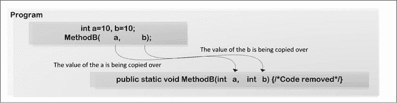

***图 3-3。**为值类型*传递值的参数

当[清单 3-1](#list_3_1) 中的程序执行时，CLR 将从`MethodA.`调用`MethodB(a,b)`，它将把`a`和`b`的值复制到`MethodB,`，因此`MethodB`将拥有值`a`和`b`的副本，如[图 3-3](#fig_3_3) 所示。[清单 3-1](#list_3_1) 展示了内置值用于传递参数的地方。

***清单 3-1。**内置值类型参数作为值的例子*

`using System;

namespace Ch03
{
    class Program
    {
        static void Main(string[] args)
        {
            BuiltInValuePassingAsValue temp = new BuiltInValuePassingAsValue();
            temp.MethodA();
        }
    }

    public class BuiltInValuePassingAsValue
    {
        public BuiltInValuePassingAsValue()
        { Console.WriteLine("Built in value type passing as value"); }

        public void MethodA()
        {` `          int a = 10, b = 10;
**          MethodB(a, b);**
          Console.WriteLine("Method A: {0},{1}", a, b);
        }

        public void MethodB(int a, int b)
        { Console.WriteLine("Method B: {0},{1}", a, b);  }
    }
}`

清单 3-1 中的程序将产生以下输出:

`Built in value type passing as value
Method B: 10,10
Method A: 10,10`

当[清单 3-1](#list_3_1) 中的程序被执行时，让我们通过检查堆栈和堆来探索更多关于清单 3-1 中的程序。

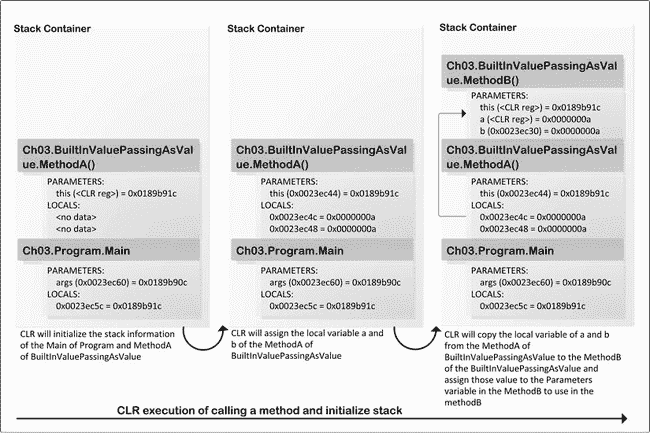

***图 3-4。**使用值类型参数作为值调用方法时堆栈信息*

在[图 3-4](#fig_3_4) 中，你可以看到当 CLR 从`MethodA`方法调用`MethodB`时，它传递了`a(10=0xa)`和`b(10=0xa),`的值，这些值存储在`MethodB`方法的`LOCALS`部分。因此，这些值的任何变化都不会影响`MethodA`中`a`和`b`的值。

让我们看看使用`.NET Reflector`工具为[清单 3-1](#list_3_1) 中的`MethodA`生成的 IL 代码，如[清单 3-2](#list_3_2) 所示，以探索更多关于值类型的参数传递值的信息。

***清单 3-2。**BuiltInValuePassingAsValue*的 MethodA()的 IL 代码

`.method public hidebysig instance void MethodA() cil managed
{
    .maxstack 3
    .locals init (
        [0] int32 a,
        [1] int32 b)

    L_0000: ldc.i4.s 10 **    /* The CLR push numeric constant 10 onto the stack */**
    L_0002: stloc.0         **/* Pop the value 10 from stack into local variable**
**                             * at position 0.*/**
    L_0003: ldc.i4.s 10     **/* The CLR push numeric constant 10 onto the stack */**
    L_0005: stloc.1         **/* Pop the value 10 from stack into local variable**
**                             * at position 1.*/**
    L_0006: ldarg.0
    L_0007: ldloc.0     **    /* Load local variable at position 0 from the Local**
**                             * section of the MethodA onto stack.*/**
    L_0008: ldloc.1 **        /* Load local variable at position 1 from the Local**
**                             * section of the MethodA onto stack.*/**

    L_0009: call instance void Ch03.BuiltInValuePassingAsValue::MethodB(int32, int32)
**    //Code removed**
    L_0024: ret
}`

从[清单 3-2](#list_3_2) 中可以看出，在`L_0007`和`L_0008`、`ldloc.0`和`ldloc`中。`1` IL 指令已经被使用，它将从`MethodA`的方法状态描述表的`Local variable`部分的位置 0 和 1 加载局部变量的值，将是 10 和 10，到评估堆栈上。`L_0009`中的`call`指令将这些值从评估堆栈传递到`MethodB`方法状态描述表的方法`MethodB. The CLR copies those`值的参数数组(因为来自调用者的 CLR 已经用相关值设置了传入的参数数组)，稍后在`MethodB,`中，这些值将由 CLR 为参数`a`和`b b`检索。

`ldc.<type>:`加载数值常数

`stloc`:从堆栈弹出值到局部变量

`ldloc`:将局部变量加载到堆栈上

`maxstack`:不代表运行时堆栈的大小，但与专门用于 IL 验证的程序分析有关。

`.locals init`:用于定义当前方法中的变量。`init`关键字意味着在方法执行之前，局部变量将在运行时被初始化。

为了更深入地了解这一点，请参见从[清单 3-1](#list_3_1) 中为`MethodB`生成的 IL 代码，如[清单 3-3](#list_3_3) 所示。

***清单 3-3。**用于 BuiltInValuePassingAsValue* 的方法 b()的 IL 代码

`.method public hidebysig instance void MethodB(int32 a, int32 b) cil managed
{
    .maxstack 8
    L_0000: ldstr "Method B: {0},{1}"

    L_0005: ldarg.1     /* **ldarg.1 load the argument at position 1 onto the**
**                         * evaluation stack** */
    L_0006: box int32

    L_000b: ldarg.2     /* **ldarg.2 load the argument at position 2 onto the**
**                         * evaluation stack** */
    L_000c: box int32

**    /* Get the values from the evaluation stack and pass as argument of the WriteLine method */**
    L_0011: call void [mscorlib]System.Console::WriteLine(string, object, object)
    L_0016: ret
}`

从[清单 3-3](#list_3_3) 中，您可以看到在`L_0005`和`L_000b,`中，CLR 从位置 1 和 2 的参数数组中加载值，它们将是 10 和 10，加载到评估堆栈中。这些值将被用来在`L_0011`中传递一个参数，以调用`Console`类的`WriteLine`方法。

#### 参考参数

让我们看看内置值类型在使用`ref`关键字作为引用传递时是如何工作的。如清单 3-4 所示的程序将内置值类型作为引用传递给一个方法，该方法接受一个内置值类型作为引用。当 CLR 从`MethodA,`调用`MethodB(ref a,ref b)`时，它将`a`和`b`的地址复制到`MethodB.`中，因此`MethodB`将拥有`a`和`b`变量的地址，如图 3-5 中的[所示。](#fig_3_5)

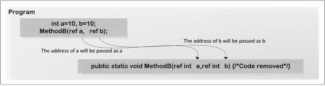

***图 3-5。**参数作为 ref 传递*

在[清单 3-4](#list_3_4) 的程序中，`MethodB`使用`ref`关键字接受两个`int`类型的参数作为引用。

***清单 3-4。**值类型*的参数通过 ref 传递

`using System;

namespace Ch03
{
    class Program
    {
        static void Main(string[] args)
        {
            BuiltInValuePassingAsRef temp = new BuiltInValuePassingAsRef();
            temp.MethodA();
        }
    }

    public class BuiltInValuePassingAsRef
    {
        public BuiltInValuePassingAsRef()
        {
            Console.WriteLine("Built in value type passing as ref");
        }

        public void MethodA()
        {
            int a = 10, b = 10;
**           MethodB(ref a, ref b);**
            Console.WriteLine("Method A: {0},{1}", a, b);
        }

        public void MethodB(ref int a, ref int b)
        {
            Console.WriteLine("Method B: {0},{1}", a, b);
            a *= 2; b *= 2;
        }
    }
}`

清单 3-4 中的程序产生以下输出:

`Built in value type passing as ref
Method B: 10,10
Method A: 20,20`

为了更深入地了解这一点，请参见从[清单 3-4](#list_3_4) 中为`MethodA`生成的 IL 代码，如[清单 3-5](#list_3_5) 所示。

***清单 3-5。**内建的 BuiltInValuePassingAsRef 的方法 a 的 IL 代码*

`.method public hidebysig instance void MethodA() cil managed
{
    .maxstack 3
    .locals init (
        [0] int32 a,` `        [1] int32 b)

    L_0000: ldc.i4.s 10     **/* The CLR push numeric constant 10 onto the**
**                             * stack */**
    L_0002: stloc.0         **/* Pop the value 10 from stack into local variable**
**                             * at position 0.*/**
    L_0003: ldc.i4.s 10     **/* The CLR push numeric constant 10 onto the**
**                             * stack */**
    L_0005: stloc.1         **/* Pop the value 10 from stack into local variable**
**                             * at position 1.*/**
    L_0006: ldarg.0

    L_0007: ldloca.s a      **/* Load the address of the a variable from the**
**                             * Local section of the method stack */**

    L_0009: ldloca.s b      **/* Load the address of the b variable from the**
**                             * Local section of the method stack */**

    **/* Pass the address of the a and b as argument to the MethodB call */**
    L_000b: call instance void Ch03.BuiltInValuePassingAsRef::MethodB(**int32&, int32&)**

**    //Code removed**
    L_0026: ret
}`

ldloca。`<length>`:加载局部变量地址。`ldloca`指令将局部变量编号索引的地址推送到堆栈上，其中局部变量从 0 开始向上编号。

在[清单 3-5](#list_3_5) 中，你可以看到在`L_0007`和`L_0009,`中使用的`ldloca.s`指令，它将局部变量`a`和`b`的地址加载到评估堆栈中，并在稍后用于调用`L_000b`中的`MethodB`方法。CLR 将`a`和`b`的地址复制到`MethodB,`的方法状态描述表的参数数组中，该数组稍后用于检索`a`和`b`变量的值。

为了更深入地了解这一点，请参见从[清单 3-4](#list_3_4) 中为`MethodB`生成的 IL 代码，如[清单 3-6](#list_3_6) 所示。

***清单 3-6。**处理内置值类型 ref 参数的方法 b 的 IL 代码*

`.method public hidebysig instance void MethodB(**int32& a, int32& b**) cil managed
{
    .maxstack 8
    L_0000: ldstr "Method B: {0},{1}"

    /* **ldarg.1 load the argument at position 1 onto the evaluation stack** */
    L_0005: ldarg.1

**    /* Get the address of the a from the top of the stack (loaded in L_0005) and**
**     * using that address the CLR load the value of the variable located at**
**     * that address.*/**
    L_0006: ldind.i4
    L_0007: box int32` `    /* **ldarg.2 load the argument at position 2 onto the evaluation stack** */
    L_000c: ldarg.2

**    /* Get the address from the top of the stack (loaded in L_000c) and using**
**     * that address the CLR load the value of the variable located at that address.*/**
    L_000d: ldind.i4
    L_000e: box int32

    L_0013: call void [mscorlib]System.Console::WriteLine(string, object, object)

    L_0018: ldarg.1
    L_0019: dup
    L_001a: ldind.i4
    L_001b: ldc.i4.2
    L_001c: mul

**    /* Store the value from the evaluation stack to the specified address */**
    L_001d: stind.i4

    L_001e: ldarg.2
    L_001f: dup
    L_0020: ldind.i4
    L_0021: ldc.i4.2
    L_0022: mul
    L_0023: stind.i4
    L_0024: ret
}`

ldind。`<type>:`将值间接加载到堆栈上。它从地址`addr`间接加载一个值到堆栈上。

`stind.<type>`:存储堆栈中的间接值。`stind`指令在地址`addr`存储值`val`。

在[清单 3-6](#list_3_6) 中，`L_0005`使用 IL 指令`ldarg.1`将`MethodB`方法的方法状态描述表的参数数组中的第一个参数值(即`MethodA`方法的变量`a`的地址)加载到评估栈中。`L_0006`中的下一条指令`ldind.i4`将从该地址加载一个值(刚刚使用`L_0005`中的 IL 指令将其推入堆栈)。在`L_000c`到`L_000e`中使用相同的技术加载`MethodA`的变量`b`。这些值稍后用于在`L_0013`中写入输出。

如你所知，如果你用这个方法改变变量`a`或`b`的内容，这将更新变量`a`和`b,`的内容，可以从`MethodA`中看到。在`L_0018`到`L_001c,`中的`MethodA have been modified`的变量`a`的内容，稍后使用`L_001d,`中的`stind.i4`将把新的更新值存储到相关地址中。同样的技术用于更新`L_001e`到`L_0024`中`MethodA`的变量`b`的值。

让我们在执行[清单 3-4](#list_3_4) 中的程序时，通过检查堆栈和堆来更深入地探讨这个问题。

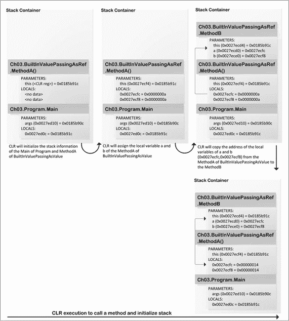

***图 3-6。**值类型作为参考传递*

在[图 3-6](#fig_3_6) 中，你可以看到当 CLR 从`MethodA`方法调用`MethodB`时，它传递变量`a(0x0027ecfc)`和`b(0x0027ecf8),`的地址，这些地址被存储在`MethodB`方法的`PARAMETERS`部分。因此，这些值的任何变化都会影响`MethodA`中`a`和`b`的原始值。

### 引用类型

本节将解释 CLR 在方法调用期间如何处理引用类型参数。

#### 按值参数

本节描述 CLR 在传递值时如何处理引用类型。在[清单 3-7](#list_3_7) 中，`ObjectAsValue`类中，`MethodB`接受来自`MethodA`的`Person`类型`f`的参数，调用`MethodB`时使用`Person`类型的实例作为参数，如图[图 3-7](#fig_3_7) 所示。

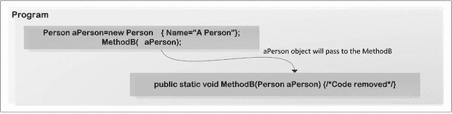

***图 3-7。**将对象作为值类型传递的参数*

当 CLR 从`MethodA,`调用`MethodB(Person aPerson)`时，它会将`aPerson`对象复制到`MethodB`的方法状态描述表的参数数组中，因此`MethodB`将拥有`aPerson`对象，如[清单 3-7](#list_3_7) 所示。

***清单 3-7。**对象作为参数传递中的值传递*

`using System;

namespace Ch03
{
    class Program
    {
        static void Main(string[] args)
        {
            ObjectAsValue temp = new ObjectAsValue();
            temp.MethodA();
        }
    }

    public class ObjectAsValue
    {
        public ObjectAsValue()
        {
            Console.WriteLine("Object as value");
        }
        public void MethodA()
        {
            Person aPerson = new Person()` `            {
                Name = "APerson"
            };
**            MethodB(aPerson);**
            Console.WriteLine("Method A: {0}", aPerson.Name);
        }
        public void MethodB(Person aPerson)
        {
            Console.WriteLine("Method B: {0}", aPerson.Name);
            aPerson.Name = "Updated" + aPerson.Name;
        }
    }

    public class Person
    {
        public string Name
        {  get; set;  }
    }
}`

清单 3-7 中的程序产生以下输出:

`Object as value
Method B: APerson
Method A: UpdatedAPerson`

为了更深入地探究这一点，让我们看看从[清单 3-7](#list_3_7) 中为`MethodA`生成的 IL 代码，如[清单 3-8](#list_3_8) 所示。

***清单 3-8。**清单 3-7[中程序的 IL 代码](#list_3_7)T5】*

`.method public hidebysig instance void MethodA() cil managed
{
    .maxstack 2
    .locals init (
        [0] class Ch03.Person aPerson,
        [1] class Ch03.Person <>g__initLocal0)

    L_0000: newobj instance void Ch03.Person::.ctor()
    L_0005: stloc.1
    L_0006: ldloc.1
    L_0007: ldstr "APerson"
    L_000c: callvirt instance void Ch03.Person::set_Name(string)
    L_0011: ldloc.1
    L_0012: stloc.0

    L_0013: ldarg.0
    L_0014: ldloc.0
    L_0015: call instance void Ch03.ObjectAsValue::MethodB(class Ch03.Person)

    L_001a: ldstr "Method A: {0}"
    L_001f: ldloc.0` `    L_0020: callvirt instance string Ch03.Person::get_Name()
    L_0025: call void [mscorlib]System.Console::WriteLine(string, object)
    L_002a: ret
}`

在这个 IL 代码中，两个局部变量被存储在位置 0 和 1，比如`aPerson`和`<>g__initLocal0,`，这是`Person`类型的一个实例。在`L_0000` `to L_0011,`中，将创建一个`Person`类型的实例，CLR 会将该实例加载到位置`1`的局部变量中，稍后会将其存储在位置 0，即`aPerson`对象。

在`L_0013,`中，IL 代码`ldarg.0`将从位置 0 加载参数值，在`L_0014`中，IL 代码`ldloc.0`将在位置 0 加载当前局部变量，该变量将被用作`L_0015`中`MethodB`方法调用的参数。因此，您可以看到这是作为一个值传递给方法调用`MethodB`的。[图 3-8](#fig_3_8) 显示了在执行[清单 3-7](#list_3_7) 中的代码时，内存中的栈-堆关系。

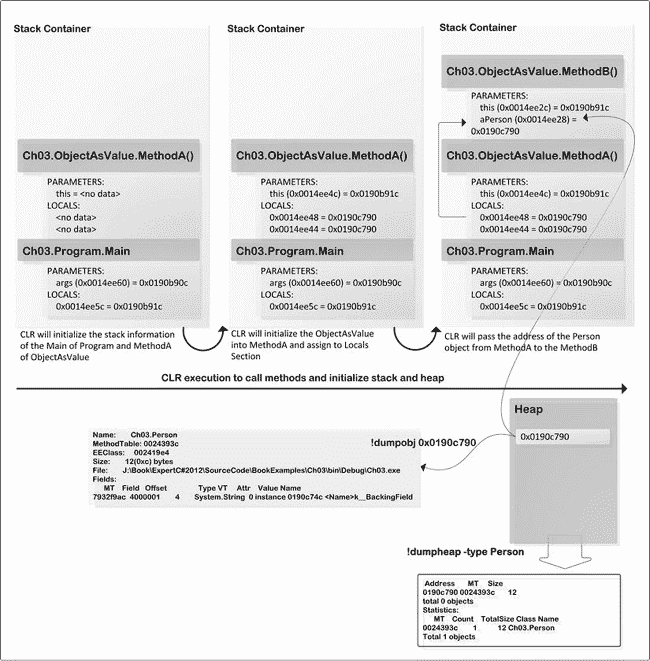

***图 3-8。**将对象的参数作为值传递时的堆栈和堆信息*

你可以在[清单 3-9](#list_3_9) 中看到`MethodB,`的 IL 代码，并且你可以看到在`L_0005,`中`ldarg.1`被用来加载`aPerson`的参数值，然后从从`MethodA`传递的`aPerson`对象中调用`get_Name()`方法。

***清单 3-9。**方法 b 的 IL 代码*

`.method public hidebysig instance void MethodB(class Ch03.Person aPerson) cil managed
{
    .maxstack 8
    L_0000: ldstr "Method B: {0}"

    L_0005: ldarg.1
    L_0006: callvirt instance string Ch03.Person::get_Name()

    L_000b: call void [mscorlib]System.Console::WriteLine(string, object)

    L_0010: ldarg.1
    L_0011: ldstr "Updated"
    L_0016: ldarg.1
    L_0017: callvirt instance string Ch03.Person::get_Name()
    L_001c: call string [mscorlib]System.String::Concat(string, string)

    L_0021: callvirt instance void Ch03.Person::set_Name(string)

    L_0026: ret
}`

在`L_0021,`中，`Person`类的`set_Name(string)`方法被调用来更新`Name`属性的值，`get_Name()`和`set_Name(string)`是`aPerson`对象的属性`Name`的内部方法。当您将引用类型的对象作为方法调用(接受相关类型的对象)的参数传递时，您可以修改该对象的公共属性的值。但是如果你试图更新对象本身(例如，用`Person`对象的新实例替换`aPerson`对象的现有内容)，如[清单 3-10](#list_3_10) 所示，它将不会在`MethodA`中可见。

***清单 3-10。**更新了方法 b 中的代码*

`public void MethodB(Person aPerson)
{
    Console.WriteLine("Method B: {0}", aPerson.Name);
    aPerson = new Person()
    {
        Name = "New name"
    };
}`

为了更深入地了解这一点，请参见从[清单 3-10](#list_3_10) 中为`MethodB`生成的 IL 代码，如[清单 3-11](#list_3_11) 所示。

***清单 3-11。** IL 代码为[清单 3-10](#list_3_10) 。*

`.method public hidebysig instance void MethodB(class Ch03.Person aPerson) cil managed
{
    .maxstack 2
    .locals init (` `        [0] class Ch03.Person <>g__initLocal1)
    L_0000: ldstr "Method B: {0}"
    L_0005: ldarg.1
    L_0006: callvirt instance string Ch03.Person::get_Name()
    L_000b: call void [mscorlib]System.Console::WriteLine(string, object)
    L_0010: newobj instance void Ch03.Person::.ctor()

    L_0015: stloc.0
    L_0016: ldloc.0
    L_0017: ldstr "New name"
    L_001c: callvirt instance void Ch03.Person::set_Name(string)

    L_0021: ldloc.0

    L_0022: starg.s aPerson

    L_0024: ret
}`

`L_0021`中的 IL 指令`ldloc.0`将把位置`0,`处的局部变量`<>g__initLocal0,`加载到评估堆栈上，并且使用`starg.s aPerson`指令，CLR 将把这个新的`<>g_initLocal0`对象加载到保存`aPerson`对象的参数中。然而，这个新值永远不会传到`MethodA`。因此，原始对象的内容永远不会被替换，但要做到这一点，您需要将对象的引用传递给方法调用，这将在下一节中讨论。

`starg.s`:`starg`指令从堆栈中弹出一个值，并将它放入自变量槽中的特定位置。

#### 参考参数

类型的引用作为方法调用的引用传递。在`ObjectAsValue`类中，`MethodB`接受一个`Person`类型的参数作为引用，`MethodB is being called from MethodA`接受一个`Person`类型的实例，通过传递那个`Person`实例的地址作为实参，如图[图 3-9](#fig_3_9) 所示。

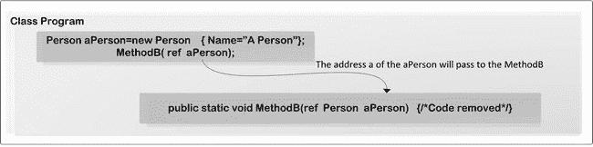

***图 3-9。**参考类型用作参考*

当 CLR 执行来自`MethodA,`的`MethodB(ref Person aPerson)`时，它会将`aPerson`对象的地址复制到`MethodB,`的方法状态描述表的参数数组中，因此`MethodB`将拥有`aPerson`对象的地址，如[清单 3-12](#list_3_12) 所示。

***清单 3-12。**将对象类型作为引用传递*

`using System;

namespace Ch03
{
    class Program
    {
        static void Main(string[] args)
        {
            ObjectAsValue temp =  new ObjectAsValue();
            temp.MethodA();
        }
    }

    public class ObjectAsValue
    {
        public ObjectAsValue()
        {
            Console.WriteLine("Object as value");
        }

        public void MethodA()
        {
            Person aPerson = new Person()
            {
                Name = "APerson"
            };
            MethodB(ref aPerson);
            Console.WriteLine("Method A: {0}", aPerson.Name);
        }

        public void MethodB(ref Person aPerson)
        {
            Console.WriteLine("Method B: {0}", aPerson.Name);
            aPerson = new Person()
            {
                Name = "New name"
            };
        }
    }

    public class Person
    {
        public string Name` `        { get;  set; }
    }

}`

清单 3-12 中的程序产生以下输出:

`Object as value
Method B: APerson
Method A: New name`

为了更深入地了解这一点，请参见清单 3-12 中的[为`MethodA`生成的 IL 代码，如清单 3-13](#list_3_12) 中的[所示。](#list_3_13)

***清单 3-13。**方法的 IL 代码方法*

`.method public hidebysig instance void MethodA() cil managed
{
    .maxstack 2
    .locals init (
        [0] class Ch03.Person aPerson,
        [1] class Ch03.Person <>g__initLocal0)

    L_0000: newobj instance void Ch03.Person::.ctor()
    L_0005: stloc.1
    L_0006: ldloc.1
    L_0007: ldstr "APerson"
    L_000c: callvirt instance void Ch03.Person::set_Name(string)
    L_0011: ldloc.1
    L_0012: stloc.0

    L_0013: ldarg.0

    **/* Load the address of the local variable aPerson onto the Stack. */**
    L_0014: ldloca.s aPerson

**    /* The CLR will use the address of the aPerson object from the Stack and**
**     * pass as argument of the MethodB call.*/**
**    L_0016: call instance void Ch03.ObjectAsValue::MethodB(class Ch03.Person&)**

    L_001b: ldstr "Method A: {0}"
    L_0020: ldloc.0
    L_0021: callvirt instance string Ch03.Person::get_Name()
    L_0026: call void [mscorlib]System.Console::WriteLine(string, object)
    L_002b: ret
}`

CLR 使用`L_000`中的`newobj`指令实例化`Person`的一个实例。`L_0014`标签中的`ldloca.s aPerson`指令会将局部变量`aPerson`的地址推送到堆栈上。在初始化`MethodB`调用时，该地址将被复制到`MethodB`的方法状态描述表的参数数组中，`L_0016`中的`MethodB(class Ch03.Person&)`。另一方面，`MethodB,`正在接受`Person`类型对象的地址。当你用`Person,`的新实例更新`aPerson`对象时，这个变化将从`MethodA`方法中可见，如[清单 3-14](#list_3_14) 所示。

***清单 3-14。**方法 b 方法的 IL 代码*

`.method public hidebysig instance void MethodB(class Ch03.Person& aPerson) cil managed
{
    .maxstack 3
    .locals init (
        [0] class Ch03.Person <>g__initLocal1)
    L_0000: ldstr "Method B: {0}"

**    /* Load the address passed via the aPerson parameter onto the stack */**
    L_0005: ldarg.1

**    /* Load the contents of the aPerson object indirectly */**
    L_0006: ldind.ref

    L_0007: callvirt instance string Ch03.Person::get_Name()
    L_000c: call void [mscorlib]System.Console::WriteLine(string, object)

    L_0011: ldarg.1
    L_0012: newobj instance void Ch03.Person::.ctor()
    L_0017: stloc.0

    L_0018: ldloc.0

    L_0019: ldstr "New name"
    L_001e: callvirt instance void Ch03.Person::set_Name(string)

    **/* Load the value of the local variable at position at 0 on the stack */**
    L_0023: ldloc.0

**    /* It will store the object from the stack on to the memory object which actually**
**     * replace the original aPerson passed as argument. */**
    L_0024: stind.ref

    L_0025: ret
}`

`L_0006`中的 IL 指令`ldind.ref`会将对象加载到堆栈上。`L_0018`中的 IL 指令`ldloc.0`将加载存储在 0 位置的本地对象`aPerson`，并为`aPerson`对象的`Name`字段设置新值。使用`L_0024`中的`stind.ref`将更新后的`aPerson`存储在`MethodA`的`aPerson`对象的地址中。这个`stind.ref`指令将在调用者传递的给定地址存储新的对象实例。从`MethodA`传递到`MethodB`，`stind.ref`的地址将把这个`Person`对象的新实例从评估堆栈存储到那个位置。因此，这个更新的`Person`对象将从`MethodA`中可见。

### 默认参数值

默认参数值是在方法声明中声明可选参数的一种方式。换句话说，当您用参数定义方法时，您也可以设置参数的默认值。则该方法的调用方在调用该方法时不必传递参数值。

当 CLR 处理任何带有默认值集的参数的方法时，它以两种方式处理这些方法:

> *   If no values are set for the parameters when calling the method, the CLR will get the default values from the method signature and pass these values as parameters to the method call.
> *   On the other hand, if you set values for parameters from the calling method, the CLR will call that method with these values as parameters.

清单 3-15 中给出了一个例子，其中默认值被设置为方法参数，该方法被调用了两次，传递和不传递参数值。

***清单 3-15。**值类型*的参数默认值示例

`using System;
namespace Ch03
{
    class Program
    {
        static void Main(string[] args)
        {
           int result = GetTotalPrice();        **/* Test scenario 1- with the value */**
            result = GetTotalPrice(55);**         /* Test scenario 2 - with the value*/**
        }
        public static int GetTotalPrice(int basePrice = 40)
        {
            return basePrice - (basePrice * 10) / 100;
        }
    }
}`

清单 3-15 中的[程序在执行时将产生大约如下的堆栈信息，如图 3-10](#list_3_15) 中的[所示。](#fig_3_10)

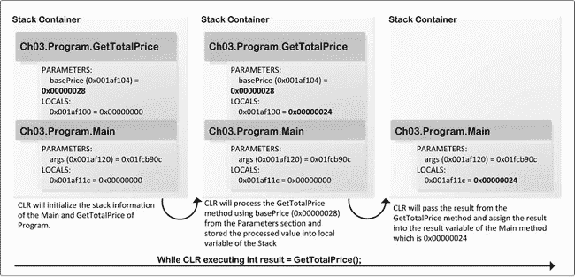

***图 3-10。**执行 GetTotalPrice 方法而不传递参数值*

如你所见，`GetTotalPrice`方法的堆栈`basePrice`的`PARAMETERS`部分已经用默认值`0x00000028(40)`初始化。当 CLR 将程序控制移入`GetTotalPrice`时，它将使用存储在堆栈`PARAMETERS`部分的`basePrice`变量的值，在完成处理后，它将返回表达式`basePrice (basePrice * 10 )/100`的结果`0x00000024(36)`。

为了更深入地理解默认值参数，让我们看看清单 3-15 的反编译 IL 代码，如清单 3-16 中的[所示。](#list_3_16)

***清单 3-16。** IL 代码为[清单 3-15](#list_3_15)T5】*

`.class private auto ansi beforefieldinit Program  extends [mscorlib]System.Object
{
    .method public hidebysig specialname rtspecialname instance void .ctor() cil managed
    {
         **/* code removed */**
    }

    .method public hidebysig static int32 GetTotalPrice([opt] int32 basePrice) cil managed
    {
        .param [1] = int32(40)
        .maxstack 3
        .locals init (
            [0] int32 CS$1$0000)
        L_0000: nop

**       /* ldarg will load the argument at position 0 from the arguments array of this method's**
**        * method state description table. These arguments have been passed from the**
**        * caller which is Main method and the argument at position 0 is 40\. */**
        L_0001: ldarg.0
        L_0002: ldarg.0
        L_0003: ldc.i4.s 10
        L_0005: mul
        L_0006: ldc.i4.s 100
        L_0008: div
        L_0009: sub
        L_000a: stloc.0
        L_000b: br.s L_000d
        L_000d: ldloc.0
        L_000e: ret
    }

    .method private hidebysig static void Main(string[] args) cil managed
    {
        .entrypoint
        .maxstack 1
        .locals init (
            [0] int32 result)
        L_0000: nop

**       /* Push numeric constant 40 onto the evaluation stack. The C# compiler will take the**
**        *constant value 40 from the signature of the method GetTotalPrice */**` `        L_0001: ldc.i4.s 40

**       /* Get the top value from the evaluation stack, use as the parameter value and**
**        * call the GetTotalPrice method */**
        L_0003: call int32 Ch03.Program::GetTotalPrice(int32)

        **/* Store the result return from the IL code L_0003\. */**
        L_0008: stloc.0

**        /* Push numeric constant 0x37(55) onto the evaluation stack. */**
        L_0009: ldc.i4.s 0x37

**        /* Get the top value from the evaluation stack, use as the parameter value and**
**         * call the GetTotalPrice method */**
        L_000b: call int32 Ch03.Program::GetTotalPrice(int32)

        /* Store the result return from the IL code L_0003\. */
        L_0010: stloc.0
        L_0011: ret
    }
}`

清单 3-16 中的 IL 代码表明:

> *   When CLR Jits] method is used, it will get the default value set for `GetTotalPrice` method and embed the numerical constant into the IL instruction in `L_0001` of `Main` method, as shown in [Listing 3-16](#list_3_16) .
> *   CLR will use this numeric constant `40` in the `Main` method to call `GetTotalPrice`.
> *   From the `GetTotalPrice` method, the CLR will access the parameter from the method state description table of the `GetTotalPrice` method and obtain the value of the parameter `basePrice`. The CLR has passed the value of `basePrice` to the `GetTotalPrice` method at runtime, because when `GetTotalPrice` is called, the parameter `basePrice` has no parameter value.

`ldc.<type>`:在堆栈上加载一个数值常量。

`ldc.i4.s N`:将 N 推送到堆栈上作为`int32`。

[图 3-11](#fig_3_11) 显示`GetTotalPrice`正在使用参数值 55 ( `0x37`)执行。当 CLR 如清单 3-15 中的[执行时，它将使用`basePrice,`的参数值`55 (0x37),`，而不是默认值`40`。](#list_3_15)

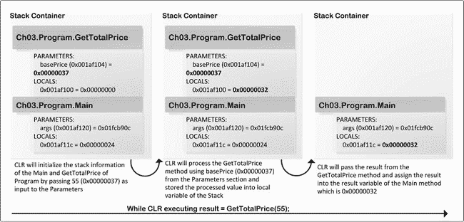

***图 3-11。** CLR 正在执行 GetTotalPrice(55)*

在 C# 中，可以使用关键字`default`将引用类型设置为参数的默认值，或者将`null`设置为默认值。您可以尝试为引用类型设置默认值，如[清单 3-17](#list_3_17) 所示。

***清单 3-17。**参考类型作为参数的默认值*

`using System;

namespace Ch03
{
    class Program
    {
        static void Main(string[] args) { }

**        /* The C# compiler complain in here as reference type Person used for the default**
**value.*/**
        public static string GetPersonDetails(Person aPerson = new Person())
        { return aPerson.ToString(); }
    }

    public class Person { }
}`

在编译时，C# 编译器将抛出一个异常，如下所示:

`Error  11    Default parameter value for 'aPerspon' must be a compile-time constant
          J:\Book\ExpertC#2012\SourceCode\BookExamples\Ch03\Program.cs    10      65     Ch03`

然而，如果您定义了如下的`GetPersonDetails`方法，您将能够为引用类型设置默认值:

`public static string GetPersonDetails(Person aPerspon = null)
{ return aPerspon.ToString(); }` 

或者它被定义为:

`public static string GetPersonDetails(Person aPerspon = default(Person))
{ return aPerspon.ToString(); }` 

你可以使用`string`作为参数的默认值，如[列表 3-18](#list_3_18) 所示。

***清单 3-18。**C # 中命名参数的一个例子*

`using System;

namespace Ch03
{
    class Program
    {
        static void Main(string[] args)
        {
            GetNameWithDefaultValue();
            GetNameWithDefaultValue("Expert C# 5.0 by Mohammad Rahman", "C#");
        }

        **/* Default value has been set as of string type */**
        public static void GetNameWithDefaultValue(
            string name = "Expert C# 5.0: with the .NET 4.5 Framework",
            string language = ": C#")
        {
            Console.WriteLine("{0} {1}", name, language);
        }
    }
}`

在上面的代码中，`string`类型的两个参数`name`和`language`定义的`GetNameWithDefaultValue`方法，其默认值为`"Expert C# 5.0: with the .NET 4.5 Framework"`和`": C#"`。这个方法的调用者，例如，`Main`方法，不需要为`name`和`address`参数传递任何值，或者可以传递。为了更深入地了解这一点，请看为[清单 3-18](#list_3_18) 生成的 IL 代码，如[清单 3-19](#list_3_19) 所示。

***清单 3-19。【GetNameWithDefaultValue 方法的 IL 代码***

`.class private auto ansi beforefieldinit Program extends [mscorlib]System.Object
{
    **/* Code removed */**
    .method public hidebysig static void
        GetNameWithDefaultValue([opt] string name, [opt] string language) cil managed
    {
        .param [1] = string('Expert C# 5.0: with the .NET 4.5 Framework')
        .param [2] = string(': C#')
        .maxstack 8
        L_0000: nop
        L_0001: ldstr "{0} {1}"

**        /* Load the argument value at position 0 and 1 from the argument values**` `**         * of the Method state description table into the evaluation stack and**
**         * execute the following IL instruction using those values from the**
**         * evaluation stack.*/**
        L_0006: ldarg.0     **/* refers to the name */**
        L_0007: ldarg.1     **/* refers to the language */**

        L_0008: call void [mscorlib]System.Console::WriteLine(string, object, object)
        L_000d: nop
        L_000e: ret
    }

    .method private hidebysig static void Main(string[] args) cil managed
    {
        .entrypoint
        .maxstack 8
        L_0000: nop

**        /* In the compile time the C# compiler extract the default values set for the parameter**
**         * name and language from the GetNameWithDefaultValue method and**
**         * embed into the IL instruction L_0001 and L_0006.**
**         * The CLR load the given string into the heap as result those string will have**
**         * memory address on the heap. The CLR use memory addresses as the parameter**
**         * value for the GetNameWithDefaultValue method call.*/    **
        L_0001: ldstr "Expert C# 5.0: with the .NET 4.5 Framework"
        L_0006: ldstr ": C#"

        L_000b: call void Ch03.Program::GetNameWithDefaultValue(string, string)
        L_0010: nop

**        /* The CLR load the given string into the heap as result those string will have**
**         * memory address on the heap. The CLR use memory addresses as the parameter**
**         * value for the GetNameWithDefaultValue method call.*/    **
        L_0011: ldstr "Expert C# 5.0 by Mohammad Rahman"
        L_0016: ldstr "C#"

        L_001b: call void Ch03.Program::GetNameWithDefaultValue(string, string)
        L_0020: nop
        L_0021: ret
    }
}`

在`L_0001`和`L_0006`中可以看到，CLR 使用`ldstr`指令将`"Expert C# 5.0: with the .NET 4.5 Framework"`和`":C#"`从`GetNameWithDefaultValue`方法的参数数组加载到`Main`方法。这将被用作调用`GetNameWithDefaultValue`方法的参数，正如你在从`Main`方法的`L_0001`到`L_000b`的 IL 指令中看到的。另一方面，对于`L_0011`和`L_0016,`，当从`Main`方法执行`GetNameWithDefaultValue("Expert C# 5.0 by  Mohammad Rahman", "C#")`时，CLR 不会从`GetNameWithDefaultValue`方法加载参数值。[图 3-12](#fig_3_12) 显示了在没有任何默认值的情况下执行`GetNameWithDefaultValue`方法时形成的堆栈和堆信息。

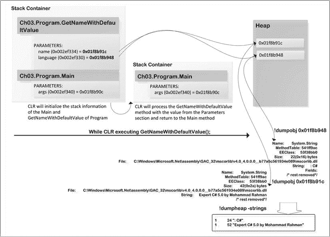

***图 3-12。** CLR 执行 GetNameWithDefaultValue()；*

从[图 3-12](#fig_3_12) 中可以看到，相关`string`的所有值都已经存储到堆中，CLR 只是使用了内存引用来访问那些值。这举例说明了在没有设置参数值的情况下执行`GetNameWithDefaultValue`方法。然而，在[图 3-13](#fig_3_13) 中，你可以看到 CLR 以同样的方式处理`GetNameWithDefaultValue`方法调用，但是这次参数值被设置为`GetNameWithDefaultValue`方法，而不是 CLR 从`GetNameWithDefaultValue`方法签名中获取值。

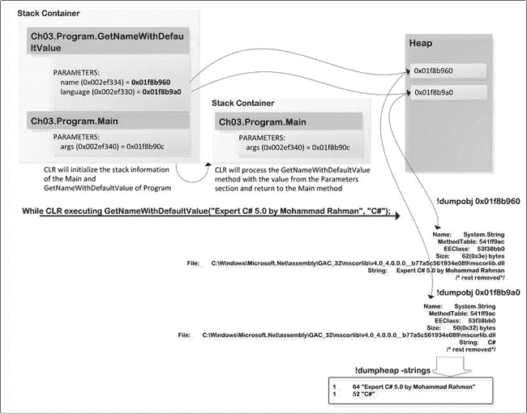

***图 3-13。** CLR 执行 GetNameWithDefaultValue("穆罕默德·拉赫曼的专家 C# 5.0 "，" c# ")；*

### 总结

本章介绍了有关参数的信息，包括值类型和引用类型。当你对值类型和引用类型使用`ref`和`out`关键字时，CLR 有一些特殊的机制，这可以在`windbg.exe`工具产生的调试信息中看到。在下一章，我们将探索 C# 中使用的方法。