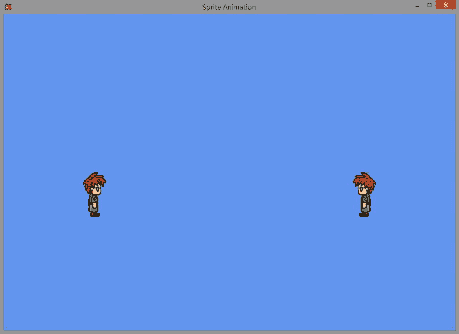
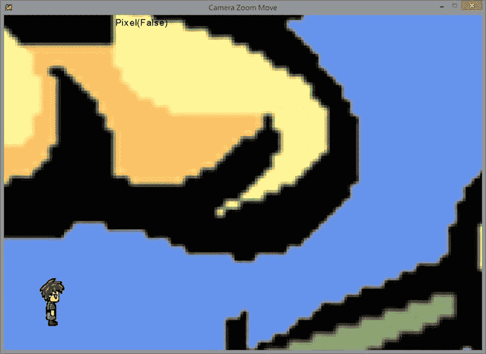

# 七、精灵们，摄像机，开拍！

完成本章后，您将能够:

*   了解精灵表动画的组成部分
*   使用精灵表创建您自己的动画
*   操纵游戏摄像机
*   将音频添加到游戏项目中，以获得音乐和声音效果

这一章涵盖了创建全功能和完整的游戏项目通常需要的许多额外的概念，但在前面的章节中没有介绍。这些概念包括通过精灵表的动画，游戏中的相机操作，以及背景音乐和提示效果的音频。动画、相机操作和音频对于创建核心游戏机制通常是不必要的；然而，包含它们可以为最终用户创造更丰富的体验，为他们提供游戏中特定动作的定制反馈。

精灵动画

在游戏中，你经常想让你的角色或游戏对象看起来像是在运动。虽然前面的章节解释了如何在屏幕上移动游戏对象来创造运动，但是因为图像本身是静态的，所以它们可能会感觉有些没有生命。为了解决这个问题，你可以使用动画。您可能知道，您通过快速连续显示相关图像来创建动画，以产生运动感——游戏中的动画也是如此。通常，您将动画用于简单的运动，如行走和奔跑，以及更复杂的运动，如打斗或舞蹈动作。本节展示了如何通过使用一系列图像和一个 sprite 表来给你的对象添加运动。

精灵动画项目

这个项目演示了如何在屏幕上移动两个动画角色。您可以调整每个角色的动画速度，以便在屏幕上创建更流畅的运动感。你可以在 [图 7-1](#Fig1) 中看到这个项目运行的例子。



[图 7-1](#_Fig1) 。精灵动画项目，放大

项目的控制如下:

*   **右键(箭头键)**移动角色
*   **左拇指操纵杆的 x 轴(AD 键)**控制动画速度
*   **按钮 A (K 键)**选择左边的字符
*   **按钮 B (L 键)**选择右边的字符

该项目的目标如下:

*   体验精灵动画中涉及的组件
*   为了理解 MonoGame SpriteBatch 为 sprite 动画提供的支持

创建项目的步骤如下:

1.  获得 sprite 工作表的概述。
2.  创建一个 SpritePrimitive 类。
3.  修改 GameState 类以包含新创建的 sprite 功能。

在开始之前，将以下资源(可以在 Chapter07\SourceCode\Resources 文件夹中找到)添加到您的内容项目中:

*   SimpleSpriteSheet.png

子画面概述

为了实现动画，游戏经常使用所谓的精灵，或者更具体地说，*精灵表*。一个 *sprite sheet* 是一个包含一个动画的图像，该动画被分成一个或多个行和列( *R* × *C* )。例如，在[图 7-2](#Fig2) 中，你可以看到一个包含两个独立动画的 4×2 sprite 表。动画描绘了一个角色左右行走。在这个例子中，动画被分成单独的行；然而，情况并非总是如此。sprite 工作表的组织通常由其创建者处理。


[图 7-2](#_Fig2) 。描绘游戏角色左右行走所需的单个帧

更具体的例子，请看图 7-2 中[子画面的顶行。这一行中的图像描绘了向右行走的角色。为了达到这种效果，每个字符图像必须从左到右按 1、2、3、4 的顺序显示。显示完最后一个角色图像后，动画会循环回到该行的第一个图像。你可以在](#Fig2)[图 7-3](#Fig3) 中看到这样的例子。


[图 7-3](#_Fig3) 。循环的精灵动画序列

现在你已经知道了 sprite sheets 可以提供的一般用法，下面快速看一下实现这种行为所需的数学知识。假设 sprite 工作表为 4×2，图像的分辨率为 256×128 像素，您可以推断出每个 sprite 的分辨率为 256/4×128/2 或 64×64 像素。

虽然这对于这个特定的 sprite sheet 示例非常有用，但是您需要一个更通用的等式来实现一个类，该类可以处理包含不同数量的 sprite 和分辨率的 sprite sheet。

然而，这仍然是相当简单的计算。假设 sprite 工作表的像素分辨率等于 *P* × *Q* ，其中 *P* 表示像素宽度， *Q* 表示像素高度，那么 sprite 工作表中每个 sprite 的分辨率等于*P*/*R*×*Q*/*C*，其中 *R* 和 *C*

例如，如果 sprite 工作表的像素分辨率为 256×256，其行和列为 4×4，则每个 sprite 的分辨率为 256/4×256/2，即 64×64 像素。一般来说，子画面由相同大小的子画面组成，以方便定位每个单独的子画面。具有不同大小精灵的精灵表确实存在；然而，你需要一个更复杂的计算来挑选出每个精灵。

有了 sprite 工作表的基础知识，现在可以开始创建 sprite 类了。

创建 *SpritePrimitive* 类

1.  Begin by creating a new class called SpritePrimitive that inherits from GameObject. Add instance variables for rows, columns, padding, and the sprite sheet’s width and height. The padding variable is used to define the space between each frame or sprite if necessary.

     **注意**sprite 工作表的填充取决于它的创建者。通常，sprite 工作表在所有边上都包含一致的填充。

    ```cs
    public class SpritePrimitive :GameObject
    {
        private int mNumRow, mNumColumn, mPaddings;
        private int mSpriteImageWidth, mSpriteImageHeight;

        #region Per Animation setting
        ...
        #endregion

        ...
    }
    ```

2.  现在创建以下变量为精灵动画提供支持:

    ```cs
    private int mUserSpecifedTicks;
    private int mCurrentTick;
    private int mCurrentRow, mCurrentColumn;
    private int mBeginRow, mEndRow;
    private int mBeginCol, mEndCol;
    ```

    *   在切换到下一帧之前，mUserSpecifedTicks 会跟踪机器的节拍数。
    *   mCurrentTick 用于跟踪自当前帧开始显示以来的刻度数。
    *   mCurrentRow 和 mCurrentColumn 用于显示当前框架的行和列。
    *   mBeginRow *、* mEndRow *、* mBeginCol *、*和 mEndCol 用于记录您从哪一帧开始和结束。
3.  添加一个构造函数，将变量初始化为默认值。确保支持文件名、位置和大小的参数，以及 sprite 工作表包含的行数、列数和填充数。

    ```cs
    public SpritePrimitive(String image, Vector2 position, Vector2 size,
        int rowCounts, int columnCount, int padding) :
        base(image, position, size)
    {
        mNumRow = rowCounts;
        mNumColumn = columnCount;
        mPaddings = padding;
        mSpriteImageWidth = mImage.Width / mNumRow;
        mSpriteImageHeight = mImage.Height / mNumColumn;

        mUserSpecifedTicks = 1;
        mCurrentTick = 0;
        mCurrentRow = 0;
        mCurrentColumn = 0;
        mBeginRow = mBeginCol = mEndRow = mEndCol = 0;
    }
    ```

4.  现在为变量创建 get 和 set 访问器，如下面的代码所示:

    ```cs
    public int SpriteBeginRow
    {
        get { return mBeginRow; }
        set { mBeginRow = value; mCurrentRow = value; }
    }
    public int SpriteEndRow
    {
        get { return mEndRow; }
        set { mEndRow = value; }
    }
    public int SpriteBeginColumn
    {
        get { return mBeginCol; }
        set { mBeginCol = value; mCurrentColumn = value; }
    }
    public int SpriteEndColumn
    {
        get { return mEndCol; }
        set { mEndCol = value; }
    }
    public int SpriteAnimationTicks
    {
        get { return mUserSpecifedTicks; }
        set { mUserSpecifedTicks = value; }
    }
    ```

5.  接下来，创建一个公共方法，允许您设置动画的开始和结束帧。为此，您必须知道起始框架所在的行和列。此外，您还可以修改节拍间隔，这指定了动画应该多长时间更改一次帧。滴答间隔越小，动画就越快。

    ```cs
    public void SetSpriteAnimation(int beginRow, int beginCol, int endRow, int endCol, int tickInterval)
    {
        mUserSpecifedTicks = tickInterval;
        mBeginRow = beginRow;
        mBeginCol = beginCol;
        mEndRow = endRow;
        mEndCol = endCol;

        mCurrentRow = mBeginRow;
        mCurrentColumn = mBeginCol;
        mCurrentTick = 0;
    }
    ```

6.  创建 Update()函数。在每次更新期间，增加当前滴答并检查滴答时间是否已到。如果是这样，重置当前刻度并移动到下一个精灵帧。当当前帧等于行中的最后一帧时，将当前帧设置回行中的第一帧。

    ```cs
    public override void Update()
    {
        base.Update();

        mCurrentTick++;
        if (mCurrentTick > mUserSpecifedTicks)
        {
            mCurrentTick = 0;
            mCurrentColumn++;
            if (mCurrentColumn > mEndCol)
            {
                mCurrentColumn = mBeginCol;
                mCurrentRow++;

                if (mCurrentRow > mEndRow)
                    mCurrentRow = mBeginRow;
            }
        }
    }
    ```

7.  现在是时候创建 Draw()函数了。首先，您需要通过调用 Camera 类的 ComputePixelRectangle()函数来创建显示图像的目标矩形。然后添加一个源矩形，指定 sprite 工作表中将要映射到目标矩形的框架。这是通过使用所需帧左上角的位置(考虑填充)和精灵图像的宽度和高度来完成的。最后，使用 Game1.sSpriteBatch.Draw()函数调用定义旋转原点并绘制目标矩形。

    ```cs
    public override void Draw()
    {
        // Define location and size of the texture
        Rectangle destRect = Camera.ComputePixelRectangle(Position, Size);

        int imageTop = mCurrentRow * mSpriteImageWidth;
        int imageLeft = mCurrentColumn * mSpriteImageHeight;
        // Define the area to draw from the spriteSheet
        Rectangle srcRect = new Rectangle(
            imageLeft + mPaddings,
            imageTop + mPaddings,
            mSpriteImageWidth, mSpriteImageHeight);

        // Define the rotation origin
        Vector2 org = new Vector2(mSpriteImageWidth/2, mSpriteImageHeight/2);

        // Draw the texture
        Game1.sSpriteBatch.Draw(
            mImage,
            destRect,           // Area to be drawn in pixel space
            srcRect,            // Rect on the spriteSheet
            Color.White,        //
            mRotateAngle,       // Angle to rotate (clockwise)
            org,                // Image reference position
            SpriteEffects.None, 0f);

        if (null != Label)
            FontSupport.PrintStatusAt(Position, Label, LabelColor);
    }
    ```

现在您将修改 GameState 类以使用 SpritePrimitive 类。

修改*游戏状态*类

1.  首先添加精灵动画速度、英雄原语和当前选择的英雄原语的变量。

    ```cs
    const int kSpriteSpeedFactor = 10;    // Value of 1 maps to updates of 10 ticks
    SpritePrimitive mHero, mAnotherHero;
    SpritePrimitive mCurrent;
    ```

2.  现在修改构造函数，用下面代码中显示的值初始化实例变量:

    ```cs
    public GameState()
    {
        mHero = new SpritePrimitive(
            "SimpleSpriteSheet",
            new Vector2(20, 30), new Vector2(10, 10),
            4,  // Number of rows
            2,  // Number of columns
            0); // Padding between images

        mAnotherHero = new SpritePrimitive(
            "SimpleSpriteSheet",
            new Vector2(80, 30), new Vector2(10, 10),
            4,  // Number of rows
            2,  // Number of columns
            0); // Padding between images

        // Start mHero by walking left and mAnotherHero by walking right
        mHero.SetSpriteAnimation(0, 0, 0, 3, 10);       // Slowly
        mAnotherHero.SetSpriteAnimation(1, 0, 1, 3, 5); // Twice as fast
        mCurrent = mAnotherHero;
    }
    ```

3.  Remember, mHero.SetSpriteAnimation(0, 0, 0, 3, 10); means the animation will start from frame 0, 0 and continue to frame 0, 3\. The 10 used indicates the number of ticks before changing to the next frame. The following image provides a visual representation of the frame-numbering system.

    

4.  接下来，在 UpdateGame()函数中，执行以下步骤:
    1.  通过调用两个英雄的 Update()函数来更新他们:

        ```cs
        public void UpdateGame()
        {
            mHero.Update();
            mAnotherHero.Update();

            UserControlUpdate();
        }
        ```

    2.  通过执行以下操作实现 UserControlUpdate()函数:

        ```cs
        private void UserControlUpdate()
        {
            #region Selecting Hero
            if (InputWrapper.Buttons.A == ButtonState.Pressed)
                mCurrent = mHero;
            if (InputWrapper.Buttons.B == ButtonState.Pressed)
                mCurrent = mAnotherHero;
            mCurrent.Position += InputWrapper.ThumbSticks.Right;
            #endregion

            #region Specifying rotation
            if (InputWrapper.Buttons.X == ButtonState.Pressed)
                mCurrent.RotateAngleInRadian += MathHelper.ToRadians(1);
            if (InputWrapper.Buttons.Y == ButtonState.Pressed)
                mCurrent.RotateAngleInRadian += MathHelper.ToRadians(-1);
            #endregion

            #region spriteSheet Update
            if (InputWrapper.ThumbSticks.Left.X == 0)
            {
                mCurrent.SpriteEndColumn = 0;  // Stops the animation
            }
            Else
            {
                float useX = InputWrapper.ThumbSticks.Left.X;
                mCurrent.SpriteEndColumn = 3;
                if (useX < 0)
                {
                    mCurrent.SpriteBeginRow = 1;
                    mCurrent.SpriteEndRow = 1;
                    useX *= -1f;
                }
                else
                {
                    mCurrent.SpriteBeginRow = 0;
                    mCurrent.SpriteEndRow = 0;
                }
                mCurrent.SpriteAnimationTicks = (int)((1f - useX) * kSpriteSpeedFactor);
            }
            #endregion
        }
        ```

        *   通过 A 和 B 按钮改变当前选择的英雄
        *   按下 X 或 Y 按钮时旋转图像
        *   将当前英雄的位置映射到右边的拇指棒上进行移动
        *   将左拇指操纵杆映射到英雄的动画速度
5.  最后，修改 DrawGame()函数，使其绘制两个英雄:

    ```cs
    public void DrawGame()
    {
        mHero.Draw();
        mAnotherHero.Draw();
    }
    ```

精灵碰撞

在前面的项目中，您看到了如何使用 sprite sheets 的原理来创建动画。但是，如果您在动画的不同阶段使用纹理，您之前创建的像素精确碰撞检测功能将不再正常工作。这是因为你的像素碰撞检测函数假设使用的纹理是静态的。在这一节中，你将看到如何为动画精灵实现像素精确的碰撞。

精灵碰撞项目

这个项目演示了如何在屏幕上移动一个角色，并以像素精度使它与其他几个对象发生碰撞。角色本身将通过一个精灵表来动画化。该项目在屏幕的左上角显示当前的碰撞状态。你可以在[图 7-4](#Fig4) 中看到这个项目运行的例子。


[图 7-4](#_Fig4) 。运行精灵碰撞项目；该项目准确地检测碰撞，甚至为精灵字符

该项目的控制如下:

*   **右键(箭头键)**移动所选对象
*   **左手拇指操纵杆(WSAD 键)**移动英雄
*   **左右触发器(M 和 N 键)**旋转所选对象
*   **按钮 A (K 键)**选择花朵
*   **按钮 B (L 键)**选择左下平面(火箭状物体)

该项目的目标如下:

*   为精灵图像实现逐像素碰撞
*   使用有效的颜色存储系统，用于共享图像

创建项目的步骤如下:

1.  修改 TexturedPrimitive 类以添加新的访问器。
2.  修改 SpritePrimitive 类以添加新的访问器。
3.  修改 TexturedPrimitivePixelCollide 分部类以支持每像素冲突。
4.  修改 GameState 类以使用对项目所做的更改。

在开始之前，将以下资源(可以在 Chapter07\SourceCode\Resources 文件夹中找到)添加到内容项目中:

*   Flower.png 格式
*   目标.png

修改 *TexturedPrimitive* 类

为了支持精灵的像素精确碰撞检测，您需要修改 TexturedPrimitive 类。您可以通过在 sprite 工作表中添加 sprite 位置和大小的访问器来实现这一点。默认情况下，将访问器设置为图像和 sprite 工作表大小的左上角。注意，在下面的代码中，访问器被定义为虚拟的。通过将它们定义为虚拟的，您允许那些从 TexturedPrimitive 类继承的类重写访问器以返回它们所需的值。

```cs
protected virtual int SpriteTopPixel { get { return 0; } }
protected virtual int SpriteLeftPixel { get { return 0; } }
protected virtual int SpriteImageWidth { get { return mImage.Width; } }
protected virtual int SpriteImageHeight { get { return mImage.Height; } }
```

修改 *SpritePrimitive* 类

重写父访问器以返回 sprite 表中当前 sprite 的正确左上角位置和大小:

```cs
#region override to support per-pixel collision
protected override int SpriteTopPixel
{
    get { return mCurrentRow * mSpriteImageHeight; }
}
protected override int SpriteLeftPixel
{
    get { return mCurrentColumn * mSpriteImageWidth; }
}
protected override int SpriteImageWidth
{
    get { return mSpriteImageWidth; }
}
protected override int SpriteImageHeight
{
    get { return mSpriteImageHeight; }
}
#endregion
```

接下来，您将修改 texturedprimitivepixelcolled 分部类，该类是您之前创建的，用于处理纹理的像素精确碰撞，因此它可以适应不同的精灵。

修改*texturedprimitivepixelcollect*分部类

1.  修改 PixelTouches()函数以使用新创建的 SpriteImageWidth 和 SpriteImageHeight 变量。您可以在下面的代码中看到这一点。其余的功能保持不变。

    ```cs
    public bool PixelTouches(TexturedPrimitive otherPrim, out Vector2 collidePoint)
    {
        ...

        if (touches)
        {
            ...

            int i = 0;
            while ( (!pixelTouch) && (i<SpriteImageWidth) )
            {
                int j = 0;
                while ( (!pixelTouch) && (j<SpriteImageHeight) )
                {
                    ...
                }

                ...
            }
        }

        ...
    }
    ```

2.  现在，在 GetColor()函数中，您需要在 sprite 表中找到当前 sprite 帧的正确像素位置，以便返回正确的颜色。为此，使用 SpriteTopPixel 和 SpriteLeftPixel，如下面的代码所示:

    ```cs
    private Color GetColor(int i, int j)
    {
        return mTextureColor[((j+SpriteTopPixel) * mImage.Width) + i + SpriteLeftPixel];
    }
    ```

3.  接下来，你需要改变坐标空间之间的转换方式。这一转换的总体目的保持不变；然而，因为你不再需要整个图像，你可以参考精灵的大小而不是图像的大小。您可以在下面的代码中看到这一点:

    ```cs
    private Vector2 IndexToCameraPosition(int i, int j, Vector2 xDir, Vector2 yDir)
    {
        float x = i * Width / (float)(SpriteImageWidth - 1);
        float y = j * Height / (float)(SpriteImageHeight- 1);

        Vector2 r = Position
            + (x - (mSize.X * 0.5f)) * xDir
            - (y - (mSize.Y * 0.5f)) * yDir;

        return r;
    }

    private Vector2 CameraPositionToIndex(Vector2 p, Vector2 xDir, Vector2 yDir)
    {
        Vector2 delta = p - Position;
        float xOffset = Vector2.Dot(delta, xDir);
        float yOffset = Vector2.Dot(delta, yDir);
        float i = SpriteImageWidth * (xOffset / Width);
        float j = SpriteImageHeight * (yOffset / Height);
        i += SpriteImageWidth / 2;
        j = (SpriteImageHeight / 2) - j;
        return new Vector2(i, j);
    }
    ```

4.  In order to share the same color data for multiple images, use a dictionary data structure. By using a dictionary data structure, multiple instances of the same image can share the same color information, which reduces some of the performance impact of adding multiple instances of the same game object.

     **注意***字典*是一种数据结构，包含每个值的唯一键，从而在查找特定值时提供快速查找。

    在下面的函数中，您可以看到除了字典(sTextureData)之外，LoadColorInfo()函数还根据输入参数返回必要的图像数据(颜色数组)。

    ```cs
    public partial class TexturedPrimitive
    {
        ...

        #region Static support for sharing color data across same image
        static Dictionary<String, Color[]> sTextureData =
                new Dictionary<string, Color[]>();

        static private Color[] LoadColorInfo(String imageName, Texture2D image)
        {
            Color[] imageData = new Color[image.Width * image.Height];
            image.GetData(imageData);
            sTextureData.Add(imageName, imageData);
            return imageData;
        }
        #endregion

        ...
    }
    ```

5.  最后，修改 ReadColorData()函数以使用新创建的字典和 LoadColorInfo()函数:

    ```cs
    private void ReadColorData()
    {
       if (sTextureData.ContainsKey(mImageName))
           mTextureColor = sTextureData[mImageName];
       else
           mTextureColor = LoadColorInfo(mImageName, mImage);
    }
    ```

最后，您将修改 GameState 类以使用新创建的精灵碰撞。

修改*游戏状态*类

1.  首先，添加英雄精灵、花朵纹理、四个纹理平面、当前选定的纹理的变量，以及显示碰撞状态和位置所需的变量。您可以在下面的代码中看到这一点:

    ```cs
    public class GameState
    {
        const int kSpriteSpeedFactor = 10;  // Value of 1 maps to updates of 10 ticks
        SpritePrimitive mHero;              // Hero sprite
        const int kNumPlanes = 4;
        TexturedPrimitive[] mPlane;         // The planes
        TexturedPrimitive mFlower;          // The large background
        TexturedPrimitive mCurrentPrim;     // Refer to either plane or flower

        // Support for displaying of collision
        TexturedPrimitive mHeroTarget;      // Where latest hero pixel collision happened
        bool mHeroPixelCollision;           // If there is a pixel collision for the hero
        bool mHeroBoundCollision;           // If there is an image-bound collision for the hero

        public GameState()
        {
            ...
        }

        ...
    }
    ```

2.  接下来，用如下所示的默认值初始化构造函数中的变量:

    ```cs
    public GameState()
    {
        // Set up the flower ...
        mFlower = new TexturedPrimitive("Flower", new Vector2(50, 35), new Vector2(60, 60));

        // Planes
        mPlane = new TexturedPrimitive[kNumPlanes];
        mPlane[0] =
            new TexturedPrimitive("PatrolEnemy", new Vector2(10, 15), new Vector2(5, 10));
        mPlane[1] =
            new TexturedPrimitive("PatrolEnemy", new Vector2(90, 15), new Vector2(5, 10));
        mPlane[2] =
            new TexturedPrimitive("PatrolEnemy", new Vector2(90, 55), new Vector2(5, 10));
        mPlane[3] =
            new TexturedPrimitive("PatrolEnemy", new Vector2(10, 55), new Vector2(5, 10));

        mHeroTarget = new TexturedPrimitive("Target", new Vector2(0, 0), new Vector2(3, 3));
        mCurrentPrim = mPlane[0];
        mHeroBoundCollision = false;
        mHeroPixelCollision = false;

        mHero = new SpritePrimitive(
            "SimpleSpriteSheet",
            new Vector2(20, 30), new Vector2(10, 10),
            4,  // Number of rows
            2,  // Number of columns
            0); // Padding between images

        // Start Hero by walking left and AnotherHero by walking right
        mHero.SetSpriteAnimation(0, 0, 0, 3, 10);
    }
    ```

3.  在更新函数中，调用即将到来的 CollisionUpdate()函数:

    ```cs
    public void UpdateGame()
    {
        mHero.Position += InputWrapper.ThumbSticks.Left;
        mHero.Update();

        CollisionUpdate();
        UserControlUpdate();
    }
    ```

4.  现在创建 CollisionUpdate()函数来处理游戏中各种对象之间的所有碰撞。请注意，即使主角使用循环来检测自身与平面之间的碰撞，循环内部的逻辑本质上与花碰撞所用的逻辑相同。

    ```cs
    private void CollisionUpdate()
    {
        Vector2 pixelCollisionPosition = Vector2.Zero;

        #region Collide the hero with the flower
        mHeroBoundCollision = mHero.PrimitivesTouches(mFlower);
        mHeroPixelCollision = mHeroBoundCollision;
        if (mHeroBoundCollision)
        {
            mHeroPixelCollision =
                mHero.PixelTouches(mFlower, out pixelCollisionPosition);
            if (mHeroPixelCollision)
                mHeroTarget.Position = pixelCollisionPosition;
        }
        #endregion

        #region Collide the hero with planes
        int i = 0;
        while ((!mHeroPixelCollision) && (i < kNumPlanes))
        {
            mHeroBoundCollision = mPlane[i].PrimitivesTouches(mHero);
            mHeroPixelCollision = mHeroBoundCollision;
            if (mHeroBoundCollision)
            {
                mHeroPixelCollision =
                    mPlane[i].PixelTouches(mHero, out pixelCollisionPosition);
                if (mHeroPixelCollision)
                    mHeroTarget.Position = pixelCollisionPosition;
            }
            i++;
        }
        #endregion
    }
    ```

5.  你现在可以修改 UserControlUpdate()函数来解释英雄的选择以及英雄和花朵的旋转。在这个函数中，你映射了英雄和花的控件。记住包括在当前选择的对象之间交换的按钮。

    ```cs
    private void UserControlUpdate()
    {
        #region Selecting Hero
        if (InputWrapper.Buttons.A == ButtonState.Pressed)
            mCurrentPrim = mFlower;
        if (InputWrapper.Buttons.B == ButtonState.Pressed)
            mCurrentPrim = mPlane[0];
        mCurrentPrim.Position += InputWrapper.ThumbSticks.Right;
        #endregion

        #region Specifying hero rotation
        if (InputWrapper.Buttons.X == ButtonState.Pressed)
            mHero.RotateAngleInRadian += MathHelper.ToRadians(1);
        if (InputWrapper.Buttons.Y == ButtonState.Pressed)
            mHero.RotateAngleInRadian += MathHelper.ToRadians(-1);
        #endregion

        #region Specifying flower rotation
        mCurrentPrim.RotateAngleInRadian += MathHelper.ToRadians(
            InputWrapper.Triggers.Left);
        mCurrentPrim.RotateAngleInRadian -= MathHelper.ToRadians(
            InputWrapper.Triggers.Right);
        #endregion

        #region Sprite Sheet Update
        ...
        #endregion
    }
    ```

6.  最后在 DrawGame()函数中，调用每个游戏对象对应的 Draw()函数，将英雄当前的碰撞状态打印到屏幕:

    ```cs
    public void DrawGame()
    {
        mFlower.Draw();
        mHero.Draw();
        foreach (var p in mPlane)
            p.Draw();

        if (mHeroPixelCollision)
            mHeroTarget.Draw();

        FontSupport.PrintStatus("Collisions Bound(" + mHeroBoundCollision +
             ") Pixel(" + mHeroPixelCollision + ")", null);
    }
    ```

移动和缩放摄像机

在您到目前为止构建的示例游戏中，相机视图保持在静态位置和静态缩放级别。在本节中，您将学习如何向您的 Camera 类添加缩放和移动功能。通过创建一个功能更全面的相机类，你将能够重现许多 2D 游戏中常见的相机效果。例如，缩放让用户将注意力集中在屏幕的特定部分。此外，您可以使用缩放来创建缩小效果，让玩家一次在屏幕上看到更多的游戏世界。移动相机可以移动到感兴趣的点，并将相机连接到你的英雄角色或游戏对象。通过将相机连接到您的英雄角色，您可以轻松地再现侧滚游戏和自上而下冒险游戏中常见的第一人称视角。

相机缩放移动项目

这个项目演示了如何使用游戏手柄来操作相机的位置和缩放级别。你将看到相机如何相对于一个大的纹理和一个英雄角色移动。你控制了英雄角色。摄像机将追逐英雄角色，使其保持在游戏窗口内。你可以在图 7-5 中看到这个项目运行的例子。



[图 7-5](#_Fig5) 。相机缩放移动项目，放大花卉游戏对象的一部分

该项目的控制如下:

*   **右键(箭头键)**移动相机窗口
*   **左手拇指操纵杆(WSAD 键)**移动英雄
*   **按钮 A (K 键)**缩小
*   **按钮 B (L 键)**放大
*   **按钮 X 和 Y (J 和 I 键)**旋转英雄

该项目的目标如下:

*   在 Camera 类中实现移动和缩放功能
*   为了理解如何将感兴趣的游戏对象保持在相机的窗口内

创建项目的步骤如下:

1.  修改 Camera 类以说明新功能。
2.  修改 GameState 类以使用相机的新功能。

修改*摄像机*类

1.  首先，在您的 Camera 类中，添加一个静态的 move-camera 函数，该函数接受位置的变化并将其应用到摄像机的原点:

    ```cs
    static public void MoveCameraBy(Vector2 delta)
    {
        sOrigin += delta;
    }
    ```

2.  Now you can create the camera’s zoom function. Start by considering the image shown following. The image shows the variables you need to achieve a zoom-out effect by increasing the size of the camera window.

    

    注意，内部的黑色矩形是由标记为 *old* 的变量定义的——更具体地说，是一个旧的原点、宽度和高度。要定义外部的红色矩形，必须计算所有新值。您可以通过将宽度和高度的变化添加到相机的旧宽度和高度来轻松计算新的宽度和高度。在图像中，这种变化被定义为图像中的 *dx* 和 *dy* 。但是因为矩形居中，所以总的变化是 *2dx* 和 *2dy* 。有了这些新信息，您可以推断出以下内容:

    

    

    因此，以下是正确的:

    

    

3.  现在您已经了解了所需的数学知识，您可以为相机创建一个缩放功能。为此，请传入所需的更改，保存旧的宽度和高度，计算新的宽度和高度，然后将更改应用到原点。您可以通过遵循以下代码中定义的过程来实现这一点:

    ```cs
    static public void ZoomCameraBy(float deltaX)
    {
        float oldW = sWidth;
        float oldH = sHeight;

        sWidth = sWidth + deltaX;
        sRatio = -1f;
        cameraWindowToPixelRatio();

        float dx = 0.5f * (sWidth - oldW);
        float dy = 0.5f * (sHeight - oldH);
        sOrigin -= new Vector2(dx, dy);
    }
    ```

现在您的 Camera 类支持所需的操作，您可以在 GameState 类中利用相机的新功能。

修改*游戏状态*类

1.  首先修改构造函数，用下面的值初始化你的游戏对象。请注意，花卉游戏对象被用作参考，因此您可以看到相机的变化。平面对象用于演示游戏对象在屏幕外的行为。最后，英雄为摄像机提供一个目标，它应该保持在屏幕上。

    ```cs
    public GameState()
    {
        // Set up the flower ...
        mFlower = new TexturedPrimitive("Flower",
            new Vector2(50, 35), new Vector2(350, 350));

        // Planes
        mPlane = new TexturedPrimitive[kNumPlanes];
        mPlane[0] = new TexturedPrimitive("PatrolEnemy",
            new Vector2(20, -80), new Vector2(20, 40));
        mPlane[1] = new TexturedPrimitive("PatrolEnemy",
            new Vector2(150, -100), new Vector2(20, 40));
        mPlane[2] = new TexturedPrimitive("PatrolEnemy",
            new Vector2(150, 120), new Vector2(20, 40));
        mPlane[3] = new TexturedPrimitive("PatrolEnemy",
            new Vector2(20, 170), new Vector2(20, 40));

        mHeroTarget = new TexturedPrimitive("Target", new Vector2(0, 0), new Vector2(3, 3));
        mHeroBoundCollision = false;
        mHeroPixelCollision = false;

        mHero = new SpritePrimitive(
            "SimpleSpriteSheet",
            new Vector2(10, 10),
            new Vector2(10, 10),
            4,  // Number of rows
            2,  // Number of columns
            0); // Padding between images

        // Start Hero by walking left and AnotherHero by walking toward right
        mHero.SetSpriteAnimation(0, 0, 0, 3, 10); // Slowly
    }
    ```

2.  正确初始化对象后，向更新函数添加以下更改。下面的代码显示了 update 函数已经被细分为几个服务函数(以防止函数变得太大而不可读)。
    1.  首先使用游戏手柄的左手拇指操纵杆来改变英雄的当前位置。
    2.  检测英雄和花朵之间以及英雄和飞机之间的任何碰撞。您可以使用之前创建的像素精确碰撞函数来完成此操作。
    3.  应用您在 camera 类中创建的相机操作，方法是将它们绑定到游戏手柄的 A 和 B 按钮(放大和缩小)以及右边的拇指操纵杆(改变位置)。
    4.  你要确保英雄人物总是停留在相机的窗口内。为此，每当英雄到达屏幕边缘时，您需要移动摄像机。之前创建的相机窗口碰撞状态非常适合这种情况。通过检测英雄角色与哪个相机边界发生碰撞，您可以在正确的方向上移动相机的位置，以保持英雄在屏幕上。
    5.  最后，记得支持英雄旋转，并根据英雄角色的移动方向应用正确的精灵动画。

        ```cs
        public void UpdateGame()
        {
            // Change the hero position by thumbstick
            Vector2 heroMoveDelta = InputWrapper.ThumbSticks.Left;
            mHero.Position += heroMoveDelta;
            mHero.Update();

            CollisionUpdate();

            // Back hero out of the collision!
            if (mHeroPixelCollision)
                mHero.Position -= heroMoveDelta;

            HeroMovingCameraWindow();
            UserControlUpdate();
        }

        private void HeroMovingCameraWindow()
        {
            Camera.CameraWindowCollisionStatus status = Camera.CollidedWithCameraWindow(mHero);
            Vector2 delta = Vector2.Zero;
            Vector2 cameraLL = Camera.CameraWindowLowerLeftPosition;
            Vector2 cameraUR = Camera.CameraWindowUpperRightPosition;
            const float kChaseRate = 0.05f;
            float kBuffer = mHero.Width * 2f;
            switch (status)
            {
                case Camera.CameraWindowCollisionStatus.CollideBottom:
                    delta.Y = (mHero.Position.Y - kBuffer - cameraLL.Y) * kChaseRate;
                    break;
                case Camera.CameraWindowCollisionStatus.CollideTop:
                    delta.Y = (mHero.Position.Y + kBuffer - cameraUR.Y) * kChaseRate;
                    break;
                case Camera.CameraWindowCollisionStatus.CollideLeft:
                    delta.X = (mHero.Position.X - kBuffer - cameraLL.X) * kChaseRate;
                    break;
                case Camera.CameraWindowCollisionStatus.CollideRight:
                    delta.X = (mHero.Position.X + kBuffer - cameraUR.X) * kChaseRate;
                    break;
            }
            Camera.MoveCameraBy(delta);
        }

        private void UserControlUpdate()
        {
            #region Specifying hero rotation
            ...
            #endregion

            #region Sprite Sheet Update
            ...
            #endregion

            #region Camera Control
            // Zooming in/out with buttons A and B
            if (InputWrapper.Buttons.A == ButtonState.Pressed)
                Camera.ZoomCameraBy(5);
            if (InputWrapper.Buttons.B == ButtonState.Pressed)
                Camera.ZoomCameraBy(-5);

            // Move the camera with right thumbstick
            Camera.MoveCameraBy(InputWrapper.ThumbSticks.Right);
            #endregion
        }
        ```

3.  最后修改 DrawGame()函数，绘制每个游戏对象，并将当前碰撞状态输出到屏幕。

    ```cs
    public void DrawGame()
    {
        mFlower.Draw();
        foreach (var p in mPlane)
           p.Draw();
        mHero.Draw();

        if (mHeroPixelCollision)
           mHeroTarget.Draw();

        FontSupport.PrintStatus("Collisions Bound(" +
                mHeroBoundCollision + ") Pixel(" +
                mHeroPixelCollision + ")", null);
    }
    ```

添加音频

一般来说，游戏中使用的音效分为两类。第一类是*背景音频*，包括音乐或环境效果，常用于给游戏的不同部分带来氛围或情绪。第二类是*音效*。音效对各种事情都很有用，从通知用户游戏动作到听到你的英雄人物的脚步声。通常，音效代表一个特定的动作，由用户或游戏本身触发。这种音效通常被认为是一种*音频提示*。

这两种音频的一个重要区别是你如何控制它们。声音效果或提示一旦开始就不能停止或调整其音量；因此，线索一般都很短。另一方面，背景音频可以随意启动和停止，播放时可以调节音量。这些功能对于根据当前 GameState 类淡入或淡出背景音频，或者完全停止背景轨道并开始另一个轨道非常有用。

音频项目

在这个项目中，和上一个项目一样，你可以移动主角和摄像机；但是，这个版本在执行各种操作时会触发声音效果。此外，项目开始时会播放背景音乐。你可以在[图 7-6](#Fig6) 中看到这个项目运行的例子。


[图 7-6](#_Fig6) 。运行音频项目；它看起来与上一个项目相同，但包括背景音乐和音频提示

项目的控制如下:

*   **右键(箭头键)**移动相机窗口
*   **左手拇指操纵杆(WSAD 键)**移动英雄
*   **按钮 A (K 键)**缩小
*   **按钮 B (L 键)**放大
*   **按钮 X 和 Y (J 和 I 键)**旋转英雄

该项目的目标如下:

*   了解如何在游戏项目中实现音频
*   为了理解所使用的两种音频之间的区别

创建项目的步骤如下:

1.  创建一个 AudioSupport 类，以便提供所需的新音频功能。
2.  修改 GameState 类以包含新添加的音频。

像字体资源一样，正如在第 3 章中所提到的，音频文件必须首先被转换成 xnb 格式，然后才能被包含在一个 MonoGame 项目中。同样，我们可以使用 XNAFormatter 程序来转换 Chapter07\SourceCode\Resources 文件夹中的以下资源:

*   Bounce.wav
*   Mind_Meld.mp3
*   Wall.wav

一旦转换完成，相应的 xnb 文件就可以包含在 MonoGame 项目中。右键单击内容文件夹并添加现有项目，或者简单地将 xnb 文件拖放到内容文件夹中。


创建*音频支持*类

1.  创建一个名为 AudioSupport 的新类。将该类设为静态，这样您就可以在整个项目中轻松地访问它。创建一个字典数据结构来存储所有的声音效果或提示。最后，创建一个实例变量来跟踪背景音频。

    ```cs
    static public class AudioSupport
    {
        // Audio effect files
        private static Dictionary<String, SoundEffect> sAudioEffects =
            new Dictionary<string,SoundEffect>();
        // Constant background audio
        private static SoundEffectInstance sBackgroundAudio = null;

        ...
    }
    ```

2.  添加一个方法，以便您可以找到所需的音频剪辑。您可以通过按名称在字典数据结构中搜索所需的音频片段来实现这一点。如果在数据结构中找到了剪辑，代码应该返回它，否则它应该首先将丢失的剪辑加载到字典中，然后返回它。

    ```cs
    static private SoundEffect FindAudioClip(String name)
    {
        SoundEffect sound = null;
        if (sAudioEffects.ContainsKey(name))
            sound = sAudioEffects[name];
        else
        {
            sound = Game1.sContent.Load<SoundEffect>(name);
            if (null != sound)
                sAudioEffects.Add(name, sound);
        }
        return sound;
    }
    ```

3.  现在，您可以创建一个函数来播放音频提示。为此，首先使用刚刚创建的函数找到音频提示，然后调用它的 Play()函数。

    ```cs
    static public void PlayACue(String cueName)
    {
       SoundEffect sound = FindAudioClip(cueName);
       if (null != sound)
           sound.Play();
    }
    ```

4.  添加开始和停止背景音频的功能。要开始剪辑，请找到背景音频，并通过创建剪辑的新实例来初始化背景音频实例变量。此外，修改其设置并调用 Play()函数。若要停止背景音频，请调用其 Pause()和 stop()函数，将其音量重置为零，然后通过调用其 Dispose()函数删除剪辑。

    ```cs
    static private void StartBg(String name, float level)
    {
        SoundEffect bgm = FindAudioClip(name);
        sBackgroundAudio = bgm.CreateInstance();
        sBackgroundAudio.IsLooped = true;
        sBackgroundAudio.Volume = level;
        sBackgroundAudio.Play();
    }

    static private void StopBg()
    {
        if (null != sBackgroundAudio)
        {
            sBackgroundAudio.Pause();
            sBackgroundAudio.Stop();
            sBackgroundAudio.Volume = 0f;

            sBackgroundAudio.Dispose();
        }
        sBackgroundAudio = null;
    }
    ```

5.  接下来，添加一个播放背景音频的函数。此功能用于停止任何现有的背景音频，然后以所需的音量启动新的背景音频文件。这可以通过利用您刚刚创建的函数轻松完成。

    ```cs
    static public void PlayBackgroundAudio(String bgAudio, float level)
    {
        StopBg();
        if (("" != bgAudio) || (null != bgAudio))
        {
            level = MathHelper.Clamp(level, 0f, 1f);
            StartBg(bgAudio, level);
        }
    }
    ```

现在音频支持类已经完成，您可以在 GameState 类中使用它，为各种动作播放效果。

修改*游戏状态*类

1.  游戏初始化时启动背景音频。您可以通过在构造函数:

    ```cs
    public GameState()
    {
        ...

        // Begin background audio
        AudioSupport.PlayBackgroundAudio("Mind_Meld", 0.4f);
    }
    ```

    中调用 PlayBackgroundAudio()函数来实现
2.  要在英雄角色与花碰撞时播放 Bounce.wav 音频提示，请调用 AudioSupport。每当花与英雄发生冲突时，PlayACue(" Bounce "):

    ```cs
    public void UpdateGame()
    {
        ...

        // Collide the hero with the flower
        mHeroBoundCollision = mHero.PrimitivesTouches(mFlower);
        mHeroPixelCollision = mHeroBoundCollision;
        if (mHeroBoundCollision)
        {
            mHeroPixelCollision = mHero.PixelTouches(mFlower, out pixelCollisionPosition);
            if (mHeroPixelCollision)
            {
                AudioSupport.PlayACue("Bounce");
            }
        }

        ...
    }
    ```

3.  同样，要在英雄角色与火箭相撞时播放 Wall.wav 提示，请调用 AudioSupport。每当英雄与火箭相撞时:

    ```cs
    public void UpdateGame()
    {
        ...

        int i = 0;
        while ((!mHeroPixelCollision) && (i < kNumPlanes))
        {
            mHeroBoundCollision = mPlane[i].PrimitivesTouches(mHero);
            mHeroPixelCollision = mHeroBoundCollision;
            if (mHeroBoundCollision)
            {
                mHeroPixelCollision =
                    mPlane[i].PixelTouches(mHero, out pixelCollisionPosition);
                if (mHeroPixelCollision)
                {
                    AudioSupport.PlayACue("Wall");
                }
            }
            i++;
        }

        ...
    }
    ```

摘要

在这一章中，你已经看到了如何在你的游戏项目中添加动画，摄像机操作和音频。通过实现这些概念，您可以在玩家与您的游戏互动时为他们提供丰富的体验。动画让你通过一系列图像的迭代来赋予游戏对象运动和真实感。动画为用户提供视觉反馈，比如玩家的移动和动作。

此外，通过实现相机操作，您可以创建更大、更有趣的游戏世界，并将玩家的注意力引向特定的游戏元素。您可以通过基本的移动和缩放功能来实现这一点。

最后，您看到了如何实现两种不同类型的音频:背景音乐和音频提示(或声音效果)。您可以使用背景音乐来设置游戏的气氛，并且您可以在运行时控制它的播放。您使用音频提示或声音效果来增强玩家或游戏的特定动作。音频提示一旦开始，就不能修改。

快速参考

| 

到

 | 

做这个

 |
| --- | --- |
| 为对象创建简单的动画 | 确定子画面上相应的开始和结束(行、列)位置。 |
| 实例化一个 SpritePrimitive 对象 | 1.确定并在项目中包含所需的 sprite 工作表图像，确保记下文件名。
2。用相应的文件名实例化一个 SpritePrimitive 游戏对象。
3。定义游戏对象的大小和位置。
4。将游戏对象配置为对应于 sprite 工作表中的行数、列数和填充数。 |
| 用 SpritePrimitive 定义 sprite 动画 | 调用 SetSpriteAnimation()函数，如下:
1。标识动画的开始和结束(行、列)。
2。将动画速度定义为 Update()函数调用次数的函数。 |
| 确保显示精灵动画 | 调用 GameState 中的 SpritePrimitive 对象的 Update()函数。UpdateGame()。 |
| 支持动画精灵的像素精确碰撞 | 重写 TexturedPrimitive 类的纹理大小和位置函数，以返回一个 sprite 的相应信息。让 TexturedPrimitivePixelCollide 类引用这些新定义会导致对单个精灵的像素精确碰撞支持。 |
| 移动摄像机 | 呼叫摄像头。MoveCameraBy(deltaMovement)，其中 deltaMovement 描述相机位置在 x 和 y 方向上的移动量。 |
| 放大或缩小照相机 | 呼叫摄像头。ZoomCameraBy(deltaSize)，其中正值 deltaSize 会使相机缩小(查看游戏窗口的更多部分)，负值会使相机放大游戏窗口。 |
| 让摄像机跟踪一个物体 | 连续检测物体和相机之间的碰撞(通过调用相机。CollidedWithCameraWindow())并相应地移动相机位置。参见[第 3 章](03.html)了解相机的详细信息。CollidedWithCameraWindow()。 |
| 开始背景音频 | 致电音频支持。PlayBackgroundAudio(“文件名”，级别)。 |
| 停止背景音频 | 致电音频支持。PlayBackgroundAudio(null，0)。 |
| 播放音频提示 | 致电音频支持。playa cue(“cue name”)。 |