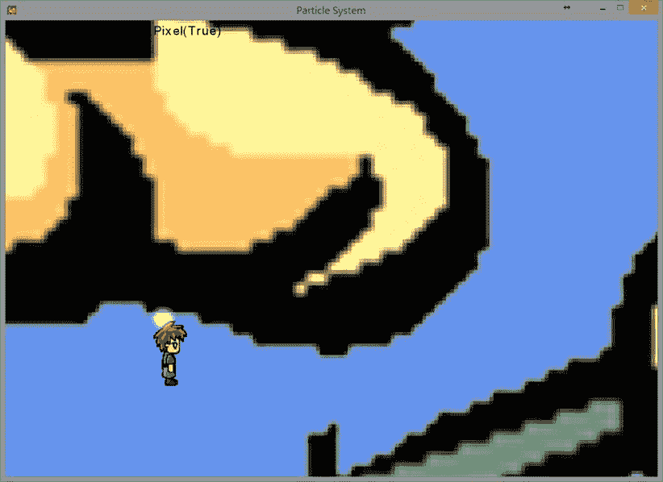
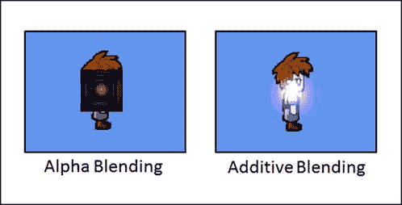
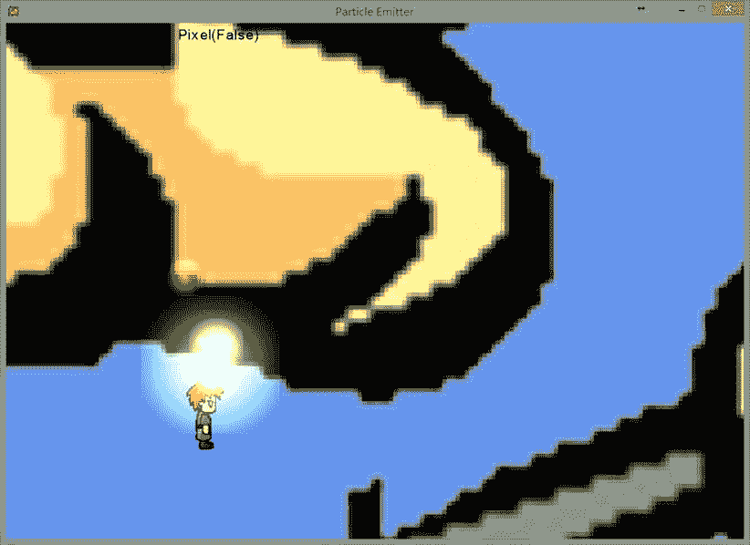

# 八、粒子系统

完成本章后，您将能够:

*   了解如何使用粒子系统创建简单的爆炸或火焰效果
*   处理粒子时，区分 alpha 和加法混合效果
*   了解何时以及如何实现粒子发射器

本章向你展示了如何实现你自己的基本粒子系统，这样你就可以创建各种粒子效果。在游戏中，粒子系统用于各种目的，例如显示火焰、显示法术或爆炸效果，或者为游戏对象创建轨迹。在本章的示例项目中，粒子系统将由碰撞触发；然而，这并不一定是唯一的情况。例如，在一个水下游戏中，你可以实现一个附着在英雄角色身上的粒子系统，并随着时间的推移发出气泡。本章中的实现旨在作为一个基本示例；然而，你将实现的粒子系统足够灵活，你应该能够为你自己的游戏定制它。

粒子系统

在本节中，您将创建一个粒子系统，其中包含实现常见效果所需的基本功能，如爆炸和法术效果。此外，您可以在特定位置初始化您的效果，或者将其添加到游戏对象中，并在需要时触发它。您的实现还将包括使用更平滑显示的混合效果的能力。

粒子系统项目

这个项目的游戏功能与上一章的相同。然而，在这里，您将添加出现在碰撞点的粒子效果。你可以在[图 8-1](#Fig1) 中看到这个项目运行的例子。



[图 8-1](#_Fig1) 。粒子系统项目，在碰撞点显示粒子效果

该项目的控制如下:

*   **右键(箭头键)**移动相机窗口
*   **左手拇指操纵杆(WSAD 键)**移动英雄
*   **按钮 A (K 键)**缩小
*   **按钮 B (L 键)**放大
*   **按钮 X 和 Y (J 和 I 键)**旋转英雄

该项目的目标如下:

*   创建表示单个粒子的基本体对象
*   实现随机性
*   要了解 alpha 和加法混合
*   了解并创建粒子系统
*   初始化和维护粒子集合
*   根据需要创建和绘制粒子

创建项目的步骤如下:

1.  了解粒子系统的组件。
2.  修改 TexturedPrimitive 类以支持淡色。
3.  创建 ParticlePrimitive 类来支持单个粒子。
4.  创建 ParticleSystem 类以支持 ParticlePrimitive 对象的集合。
5.  修改 GameState 类以包含新的粒子系统。

在开始之前，将以下资源(可以在 Chapter08\SourceCode\Resources 文件夹中找到)添加到您的内容项目中:

*   particleimage . png

了解粒子系统

最简单的形式，粒子系统是基本体的集合。粒子系统中的图元被称为*粒子*。粒子系统中的所有粒子都有一套共同的属性，比如寿命、大小、大小变化率和速度。通过以不同的方式操作这些属性，可以实现各种效果。一般来说，每个粒子执行一个基于其属性的行为，直到其生命周期结束。

粒子系统的另一个重要方面是随机性。为了创造一种效果，如爆炸，游戏开发人员通常使用随机值来初始化粒子的属性。如果没有随机因子，当粒子系统执行时，图案通常会变得明显。总的来说，你可以把一个粒子系统想象成一组或一群粒子。通过随机化每个粒子的属性，您可以为各种目的实现引人入胜的效果。

对粒子系统的组件有了基本的了解后，您就可以开始添加对即将到来的粒子类的支持了。您需要做的第一个修改是在 TexturedPrimitive 类中添加颜色着色支持。添加这个可以让你的图像着色。

修改 *TexturedPrimitive* 类

1.  在 TexturedPrimitive.cs 中，添加 mTintColor 变量，并在 InitPrimitive()函数中初始化:

    ```cs
    protected Color mTintColor;

    protected void InitPrimitive(String imageName, Vector2 position, Vector2 size, String label = null)
    {
        ...

        mTintColor = Color.White;

        ...
    }
    ```

2.  在 Draw()函数中，找到 SpriteBatch。绘制调用并修改它以包括色调颜色:

    ```cs
    Game1.sSpriteBatch.Draw(mImage,
                    destRect,           // Area to be drawn in pixel space
                    null,               //
                    mTintColor,         //
                    mRotateAngle,       // Angle to rotate (clockwise)
                    org,                // Image reference position
                    SpriteEffects.None, 0f);
    ```

创建 *ParticlePrimitive* 类

1.  创建一个名为 ParticleSupport 的新文件夹。然后创建一个继承自 GameObject 类的名为 ParticlePrimitive 的新类，并将其保存在刚刚创建的新 ParticleSupport 文件夹中。将如下所示的实例变量添加到 ParticlePrimitive 类中，以支持寿命、大小变化和随机性:

    ```cs
    public class ParticlePrimitive : GameObject
    {
        private float kLifeSpanRandomness = 0.4f;
        private float kSizeChangeRandomness = 0.5f;
        private float kSizeRandomness = 0.3f;
        private float kSpeedRandomness = 0.1f;

        // Number of updates before a particle disappear
        private int mLifeSpan;
        // How fast does the particle changes size
        private float mSizeChangeRate;

        ...
    }
    ```

2.  接下来，创建一个接受粒子的位置、大小和寿命的构造函数。对于此示例，在基本构造函数调用中传递 ParticleImage.png 图像名称。最后，将粒子属性设置为默认值，如下面的代码所示:

    ```cs
    public ParticlePrimitive(Vector2 position, float size, int lifeSpan) :
        base("ParticleImage", position, new Vector2(size, size))
    {
        mLifeSpan =(int)(lifeSpan * Game1.RandomNumber(-kLifeSpanRandomness,
                                        kLifeSpanRandomness));

        mVelocityDir.X = Game1.RandomNumber(-0.5f, 0.5f);
        mVelocityDir.Y = Game1.RandomNumber(-0.5f, 0.5f);
        mVelocityDir.Normalize();
        mSpeed = Game1.RandomNumber(kSpeedRandomness);

        mSizeChangeRate = Game1.RandomNumber(kSizeChangeRandomness);

        mSize.X *= Game1.RandomNumber(1f-kSizeRandomness, 1+kSizeRandomness);
        mSize.Y = mSize.X;
    }
    ```

3.  您需要在基类中覆盖现有的更新函数。在 update 函数中，首先调用基类的 update，然后递减寿命，调整粒子的大小，修改其色调:

    ```cs
    public override void Update()
    {
        base.Update();
        mLifeSpan--;   // Continue to approach expiration

        // Change its size
        mSize.X += mSizeChangeRate;
        mSize.Y += mSizeChangeRate;

        // Change the tintcolor randomly
        Byte[] b = new Byte[3];
        Game1.sRan.NextBytes(b);
        mTintColor.R += b[0];
        mTintColor.G += b[1];
        mTintColor.B += b[2];
    }
    ```

4.  最后，创建一个名为 Expired 的访问器来返回粒子的当前生命状态。返回 false 表示粒子寿命结束。

    ```cs
    public bool Expired { get { return (mLifeSpan < 0); } }
    ```

现在您已经为粒子创建了类，您可以创建粒子系统本身。

创建*粒子系统*类

1.  在 ParticleSupport 文件夹中创建一个名为 ParticleSystem 的新类。使用列表数据结构将粒子集合添加到粒子系统。不要忘记初始化构造函数中的粒子列表。

    ```cs
    public class ParticleSystem
    {
        // Collection of particles
        private List<ParticlePrimitive> mAllParticles;

        public ParticleSystem()
        {
            mAllParticles = new List<ParticlePrimitive>();
        }

        ...
    }
    ```

2.  现在添加一个在特定位置创建粒子的函数。通过传入粒子的所需位置，创建一个粒子，并将其添加到集合中，可以很容易地做到这一点。

    ```cs
    public void AddParticleAt(Vector2 pos)
    {
        ParticlePrimitive particle = new ParticlePrimitive(pos, 2f, 50);
        mAllParticles.Add(particle);
    }
    ```

3.  接下来，创建一个函数来更新集合中的每个粒子。这个函数应该遍历列表中的每个粒子，调用它的更新函数。此外，检查颗粒是否过期；如果是这样，从列表中删除它。

    ```cs
    public void UpdateParticles()
    {
        int particleCounts = mAllParticles.Count;
        for (int i = particleCounts- 1; i >= 0; i--)
        {
           mAllParticles[i].Update();
           if (mAllParticles[i].Expired)
               mAllParticles.RemoveAt(i);  // Remove expired ones
        }
    }
    ```

4.  最后，创建一个函数来绘制粒子系统。您可以通过在列表中绘制每个粒子来实现这一点。此外，可以将“添加剂”和“AlphaBlend”的混合状态应用于粒子。两种混合状态的详细信息如下所示。

    ```cs
    public void DrawParticleSystem()
    {
        // 1\. Switch blend mode to "Additive"
        Game1.sSpriteBatch.End();
        Game1.sSpriteBatch.Begin(SpriteSortMode.Immediate, BlendState.Additive);

        // 2\. Draw all particles
        foreach (var particle in mAllParticles)
            particle.Draw();

        // 3\. Switch blend mode back to AlphaBlend
        Game1.sSpriteBatch.End();
        Game1.sSpriteBatch.Begin(SpriteSortMode.Immediate, BlendState.AlphaBlend);
    }
    ```

了解阿尔法和加法混合

*混合*是将重叠的颜色混合产生一种新颜色的过程。混合过程由三个关键部分组成。首先是*源颜色*，这是覆盖或顶部颜色。第二个是*目标颜色*，它是底部颜色——源颜色下面的颜色。最后一种颜色是*混合色*，是从源色和目的色计算出来的颜色。Alpha 混合和加法混合是计算混合颜色的两种不同方式。

通常，alpha 混合通过以下等式实现:


通过检查这个等式，您可以看到当源的 alpha 等于 1 时，Output _ Color 等于 Source _ Color。或者，当源的 alpha 等于 0 时，输出颜色等于目标颜色。从逻辑上讲，这是有道理的。如果源是完全不透明的(alpha 为 1)，那么背景颜色将不会显示出来。但是，如果源是完全透明的(alpha 为 0)，那么背景颜色将保持不变。介于 0 和 1 之间的 alpha 值将计算源颜色和目标颜色的线性组合(混合)的输出颜色。

MonoGame 使用以下等式实现加法混合:


通过检查这个等式，你可以看到加法混合的方法类似于阿尔法混合；但是，也有一些不同之处。第一个区别是 Tint _ Color 与 Source _ Alpha 包含在一起。其次，添加目标颜色时不引用 Source _ Alpha。这意味着底部颜色被添加到顶部或覆盖颜色。

除了阿尔法和加法混合，还有其他类型，如乘法混合。你应该在游戏中使用的混合类型取决于你想要达到的效果。[图 8-2](#Fig2) 显示了阿尔法和加法混合产生的效果示例。



[图 8-2](#_Fig2) 。alpha 混合和加法混合的区别

现在，您可以添加在游戏中使用粒子系统所需的 GameState 类修改。

修改*游戏状态*类

1.  首先为粒子系统添加一个实例变量，并在构造函数中初始化它:

    ```cs
    ParticleSystem mParticleSystem;

    public GameState()
    {
       ...

       mParticleSystem = new ParticleSystem();
    }
    ```

2.  接下来，在游戏状态的更新函数中调用粒子系统的更新。此外，当检测到碰撞时，在碰撞点创建粒子。发生冲突时，通过调用 AddParticleAt()函数来实现这一点。请记住，冲突检测逻辑已经被分离到它自己的 CollisionUpdate()函数中。

    ```cs
    public void UpdateGame()
    {
        ...

        mParticleSystem.UpdateParticles();
    }

    private void CollisionUpdate()
    {
        ...

        #region Collide the hero with the flower

        ...

        if (mHeroPixelCollision)
        {
            mParticleSystem.AddParticleAt(pixelCollisionPosition);
        }

        ...

        #endregion

        #region Collide the hero with planes

        ...

        if (mHeroPixelCollision)
        {
            mParticleSystem.AddParticleAt(pixelCollisionPosition);
        }

        ...

        #endregion
    }
    ```

3.  最后，简单地通过调用游戏状态的 draw 函数中的函数来绘制粒子系统:

    ```cs
    public void DrawGame()
    {
        mFlower.Draw();
        foreach (var p in mPlane)
           p.Draw();
        mHero.Draw();

        mParticleSystem.DrawParticleSystem();

        ...
    }
    ```

粒子发射器

您刚刚创建的粒子系统非常适合创建粒子；但是，有用的粒子系统应该能够控制粒子创建的持续时间、粒子创建的位置以及所创建粒子的行为。这就是*粒子发射器*的用武之地。通过控制发射粒子的持续时间、位置和行为，您可以通过简单地修改粒子发射的方式来创建有趣的效果，如火焰、爆炸和轨迹。

粒子发射器项目

这个项目允许你为你的粒子系统实现粒子发射器。该项目的功能与上一节中的功能相同；但是，在创建粒子系统后，您将使用粒子发射器来控制粒子的发射。 你可以在[图 8-3](#Fig3) 中看到这个项目运行的例子。



[图 8-3](#_Fig3) 。粒子发射器在碰撞点发射大量粒子

该项目的控制如下:

*   **右键(箭头键)**移动相机窗口
*   **左手拇指操纵杆(WSAD 键)**移动英雄
*   **按钮 A (K 键)**缩小
*   **按钮 B (L 键)**放大
*   **按钮 X 和 Y (J 和 I 键)**旋转英雄

本项目的 目标如下:

*   创建名为 ReddishParticlePrimitive 的新粒子类型
*   允许从 ParticleSystem 类连续发射粒子

创建项目的步骤如下:

*   创建 ReddishParticlePrimitive 类。
*   创建 ParticleEmitter 类以支持连续粒子发射。
*   修改 ParticleSystem 类以支持粒子发射器。
*   修改 GameState 类以支持新创建的发射器。

创建 *ReddishParticlePrimitive* 类

1.  首先在 ParticleSupport 文件夹中创建一个名为 ReddishParticlePrimitive 的新类。让类从 ParticlePrimitive 继承。

    ```cs
    public class ReddishParticlePrimitive : ParticlePrimitive
    {
        ...
    }
    ```

2.  在类构造函数中，设置粒子的速度方向，使其向上运动，将粒子的速度增加 5 倍，更改粒子的大小及其随时间变化的速率，并将粒子的颜色设置为深橙色:

    ```cs
    public ReddishParticlePrimitive(Vector2 position, float size, int lifeSpan) :
            base(position, size, lifeSpan)
    {
        mVelocityDir.Y = 5f * Math.Abs(mVelocityDir.Y);
        mVelocityDir.Normalize();
        mSpeed *= 5.25f;
        mSizeChangeRate *= 1.5f;
        mSize.X *= 0.7f;
        mSize.Y = mSize.X;

        mTintColor = Color.DarkOrange;
    }
    ```

3.  接下来，覆盖更新函数，以便可以随时修改色调颜色。下面的代码在每次更新时单独修改 RGB 值:

    ```cs
    public override void Update()
    {
        base.Update();

        Color s = mTintColor;
        if (s.R < 255)
            s.R += 1;
        if (s.G != 0)
            s.G -= 1;
        if (s.B != 0)
            s.B -= 1;
        mTintColor = s;
    }
    ```

现在是时候创建 ParticleEmitter 类了。发射器类使您能够在有限的时间内发射具有特定类型运动行为的粒子。

创建*粒子发射器*类

1.  首先在 ParticleSupport 文件夹中创建一个名为 ParticleEmitter 的类。包括实例变量，这些变量控制每个周期发射的最小粒子数、发射器的位置以及仍要发射的粒子数。

    ```cs
    public class ParticleEmitter
    {
        const int kMinToEmit = 5;
        protected Vector2 mEmitPosition;
        protected int mNumRemains;

        ...
    }
    ```

2.  现在初始化构造函数中的变量，并提供一个访问器，这样你就可以确定是否有剩余的粒子要发射:

    ```cs
    public ParticleEmitter(Vector2 pos, int n)
    {
        mNumRemains = n;
        mEmitPosition = pos;
    }

    public bool Expired { get { return (mNumRemains <= 0); } }
    ```

3.  接下来，创建一个名为 EmitParticles()的函数。这个函数决定了需要发射的粒子的数量和类型。
    1.  该函数首先计算应该发射多少粒子。这是通过检查是否应该发射所有剩余粒子(当剩余数量小于最小值时为真)或者是否应该发射剩余粒子的某个随机百分比来实现的。确定该数量后，粒子被发射到输入 allParticles 粒子列表。
    2.  计算出要发射的粒子数后，该示例接下来创建一个红色或正常(未修改)的粒子；它们分别有 40%和 60%的几率被创造出来。这为粒子生成增加了一点随机性，并产生了更有趣的外观。

```cs
public void EmitParticles(List<ParticlePrimitive> allParticles)
{
    int numToEmit = 0;
    if (mNumRemains < kMinToEmit)
    {
        // If only a few are left, emits all of them
        numToEmit = mNumRemains;
    }
    else
    {
        // Otherwise, emits about 20% of what's left
        numToEmit = (int)Game1.RandomNumber(0.2f * mNumRemains);
    }
    // Left for future emitting.
    mNumRemains -= numToEmit;

    for (int i = 0; i < numToEmit; i++)
    {
        ParticlePrimitive particle;
        // 40% chance emitting simple particle,
        // 60% chance emitting the new reddish particle
        if (Game1.RandomNumber(1.0f) > 0.6f)
            particle = new ParticlePrimitive(mEmitPosition, 2f, 30);
        else
            particle = new ReddishParticlePrimitive(mEmitPosition, 2f, 80);
        allParticles.Add(particle);
    }
}
```

修改*粒子系统*类

1.  现在，通过添加一个粒子发射器列表并在构造函数中初始化它来修改 ParticleSystem 类:

    ```cs
    private List<ParticleEmitter> mAllEmitters;

    public ParticleSystem()
    {
        ...

        mAllEmitters = new List<ParticleEmitter>();
    }
    ```

2.  移除 AddParticleAt()函数，并将其替换为 AddEmitterAt()函数。通过这样做，您现在可以生成一系列将从所需位置发射的粒子。下面的代码生成 50 到 100 个粒子:

    ```cs
    public void AddEmitterAt(Vector2 pos)
    {
        ParticleEmitter e = new ParticleEmitter(pos, (int) Game1.RandomNumber(50, 100));
        mAllEmitters.Add(e);
    }
    ```

3.  接下来，您需要修改 UpdateParticles()函数来考虑新添加的发射器。通过遍历发射器列表，发射每个粒子，并移除过期的发射器:

    ```cs
    public void UpdateParticles()
    {
        int emittersCount = mAllEmitters.Count;
        for (int i = emittersCount - 1; i >= 0; i--)
        {
            mAllEmitters[i].EmitParticles(mAllParticles);
            if (mAllEmitters[i].Expired)
                mAllEmitters.RemoveAt(i);
        }

        ...
    }
    ```

最后，您可以对 GameState 类进行快速修改，以便使用新的 ParticleEmitter 类。

修改*游戏状态*类

1.  通过用新的 AddEmitterAt()函数替换 AddParticleAt()函数调用来修改 CollisionUpdate()函数。现在，当碰撞发生时，发射器将在消失前的一段时间内创建粒子。

    ```cs
    private void CollisionUpdate()
    {
        ...

        #region Collide the hero with the flower

        ...

        if (mHeroPixelCollision)
        {
            mParticleSystem.AddEmitterAt(pixelCollisionPosition);
        }
        ...

        #endregion

        #region Collide the hero with planes

        ...

        if (mHeroPixelCollision)
        {
            mParticleSystem.AddEmitterAt(pixelCollisionPosition);
        }

        ...

        #endregion
    }
    ```

摘要

在本章中，你看到了如何在你的游戏中实现一个粒子系统。该粒子系统由粒子集合组成，每个粒子都包含决定其在特定生命周期内行为的属性。此外，您还看到了如何将混合效果应用于粒子，从而为粒子系统提供自定义的外观。具体来说，向您展示了如何实现 alpha 和加法混合。

最后，您学习了如何实现粒子发射器来支持持续的粒子发射。连续发射对于需要长时间存在的火焰和其他效果非常有用。

快速参考

| 

到

 | 

做这个

 |
| --- | --- |
| 创造瞬间爆发的效果 | 实例化一个 ParticleSystem 类，并调用 AddParticleAt()函数在所需位置创建粒子效果。 |
| 创造更持久的效果，如火灾或爆炸 | 用想要发射的粒子数和发射持续时间实例化一个 ParticleEmitter 类。然后将发射器添加到 ParticleSystem 类中。 |
| 创建您自己的粒子效果 | 1.ParticlePrimitive 类的子类(就像 ReddishParticlePrimitive 类的情况一样),并实现自定义的初始化和对颜色、行进方向、速度、寿命等的更新行为。
2。创建您自己的发射器类(例如，通过从 ParticleEmitter 类创建子类)并自定义创建和发射行为。 |