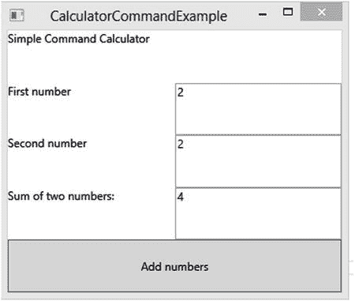

# 四、设计模式

编程中的设计模式相当于烹饪中的菜谱。你能不按照食谱做巧克力饼干吗？当然可以。然而，你将会投入大量的时间和精力去解决一个已经解决的问题。你将基本上重新发明轮子，我们的意思是，饼干。

设计模式不仅帮助开发人员解决开发软件时的常见问题，还建立了一种讨论特定实现时使用的通用语言。设计模式是以这样一种方式编写的，即存在与解决方案的实现细节相关联的通用术语。这将提高你的开发团队的效率。例如，如果您的整个团队都精通设计模式和用于描述问题和解决方案的词汇，那么交流想法或问题就容易得多，而不需要借助白板。这种没有歧义的情况也有利于初级开发人员。如果团队使用同一种语言，那么经验水平就无关紧要了。

如果你知道什么是设计模式，那么你可能听说过四人帮。以防万一，四人帮是一群作者，他们合作编写了《设计模式:可重用面向对象软件的元素》(Addison-Wesley Professional，1995)，这是一本关于设计模式的事实上的书。这是任何软件开发人员的必备参考。书中有 23 种设计模式。然而，您目前正在阅读的这本书并不是关于设计模式的，所以在本书的其余部分，我们将只讨论与您将要构建的应用相关的模式。在我们介绍您将使用的设计模式之前，讨论现代领域驱动应用中使用的不同类型的架构对我们来说很重要。

## 架构类型

如果您是编写业务线(LOB)应用的软件开发人员，那么您很可能熟悉 n 层应用设计的概念。这种设计风格描述了将通用应用组件分成库的软件，这允许应用的不同部分驻留在多台计算机或服务器上。

过去，业务线系统通常将所有应用资源与应用的可执行文件保存在同一台机器上。这些资源包括 INI 文件、Access 数据库、跟踪日志和应用解决业务问题所需的其他数据。随着技术价格的下降和计算机知识的增加，现在的数据比以往任何时候都多，并且数据呈指数级增长。将应用的数据保存在单个用户的工作站上不再可行。

如今，大多数企业都有专门负责信息技术的完整部门。在典型的办公环境中，几乎所有员工都有自己的电脑，用来运行日常工作所需的应用。这就产生了对集中式数据库和其他共享资源的需求，这些资源可以处理多个用户的访问。

大多数应用都与某种服务器进行通信。这些服务器包括关系数据库管理系统(RDBMSs)、用于 web 应用和服务的 web 服务器、用于授权和身份验证的 Active Directory 域控制器以及许多其他类型的服务器。

由于大多数 LOB 应用使用多台机器来完成一项任务，软件开发社区已经创建了几种体系结构设计来利用这些分布式资源。两种最常见的架构设计包括分层架构和六边形/端口和适配器架构。这些架构的相似之处在于，它们都致力于将域模型(也称为业务对象)与用于处理常见任务(如数据访问或文件系统访问)的标准样板代码分离开来。我们现在将讨论这两种架构类型，并说明每种类型的优缺点。

## 分层架构

更古老、更常见的架构风格是分层架构。当使用分层架构设计时，您将应用分成不同的逻辑边界。每一层通常被创建为类库(DLL)；然而，情况并非总是如此。这种类似组件分离的好处之一是能够在多台计算机上执行应用编程接口(API)调用。这种分布式执行提高了可伸缩性，并且在某些情况下，为最终用户提供了性能增益。需要理解的一点是，您不需要使用多台计算机来实现分层架构。在许多应用中，所有层的代码都与应用的可执行文件驻留在同一台机器上。尽管如此，每一层的逻辑分离通过类库促进了应用组件和代码重用之间的松散耦合。使用分层架构的应用通常由图 [4-1](#Fig1) 所示的层组成。

图 4-1。

Typical Layered architecture

### 用户界面层

如你所见，有五层。在可扩展应用标记语言(XAML)应用中，用户界面层由应用的基于 XAML 的视图组成。视图可以表示窗口、页面、用户控件或任何其他由 XAML 标记组成的文件，以定义应用的可视方面。一般来说，用户界面层是轻量级的，只有很少的逻辑。那么，处理用户输入的代码放在哪里呢？这是表示层的工作。

Note

有一些分层体系结构的实现，其中用户界面层和表示层相结合。这在 WinForms 应用和一些 web 应用中很常见。您甚至可以对基于 XAML 的应用采用这种方法；然而，正如您将看到的，Windows Presentation Foundation(WPF)和 XAML 引入的令人惊叹的功能为创建单元测试友好的应用的新范式让路，这些应用具有丰富的用户界面和组件，无需代码隐藏中的事件处理程序即可构建。这种用户界面与用户界面逻辑的分离使得基于 XAML 的应用成为五层方法的主要候选。

### 表示层

表示层用于处理由于用户界面层中的动作而发生的任何逻辑。这包括用户点击按钮、调整窗口大小、手指点击、设备重定向等等。在 WinForms 开发中，`Form`或`UserControl`类的代码隐藏中的事件处理程序处理这个逻辑。正如您将在后面看到的，XAML 的数据绑定功能，加上模型-视图-视图模型(MVVM)设计模式，提供了在表示层处理逻辑的有趣的新方法。

### 服务层

服务层充当表示层和领域层之间的网关。对于要作为 API 的一部分公开的应用服务层的接口，考虑一些因素是很重要的。服务层的设计会有很大的不同，这取决于您对服务层逻辑的物理位置的选择。例如，对于通过 web 服务技术公开的服务来说，服务层接口设计将与运行在与应用其余部分相同的机器上的服务层大不相同。

### 畴层

其次，领域层是任何应用中最重要的部分。领域层包含您的领域模型，它应该反映属于您的问题领域的业务流程。重要的是，您的领域层不知道应用中的所有其他层。您不希望您的领域层依赖于您正在使用的用户界面技术或数据访问库，因为您需要能够在其他实现中使用您的领域模型，例如 web 或移动应用。出于同样的原因，您不希望为了在组织中引入一个新的数据库系统而改变您的领域层。您的设计应该确保领域层是纯净的，并且只由表示您正在建模的业务领域的类组成。

### 基础设施层

最后，基础设施层是大多数应用中的“低级”代码。这是您保存应用“管道”的地方。基础设施层将包含数据访问、日志记录、异常处理、缓存、MSMQ、性能指标、发送电子邮件的代码以及支持与其他软件系统和 API 库交互的类。基础设施层中的代码应该支持所需的所有机制，这些机制不是特定于业务领域的，但却是应用正常运行所必需的。

同样，领域层不应该关心系统中的任何其他层。应该是完全自给自足的。

分层架构方法非常适合将代码分成相关的逻辑单元。这种设计的一个问题是，如果您需要对较低的级别进行更改(这是经常发生的情况)，那么您可能需要更改上面的级别，以考虑对较低级别的依赖。分层体系结构对于层访问的严格规则可能会在需求变化方面产生问题。六边形架构，也称为端口和适配器架构，提供了一种不同的方式来查看层，并解决了有关扩展现有应用的问题。

Note

与分层体系结构相关的一个常见实践是，一个层可以使用它下面的任何层，但是没有一个层可以引用它上面的任何层。这个规则的唯一例外是域层。

## 贯穿全书的设计模式

现在，我们将回顾参考应用中使用的设计模式。涵盖的模式包括存储库、适配器、模型-视图-视图模型和命令。

### 存储库模式

存储库模式与数据访问相关。当您使用存储库模式时，您创建了称为存储库的类，这些类抽象出了如何在数据库中检索和存储数据。对于 API 的用户来说，存储库就像内存中领域实体的集合。存储库类没有特定于数据库的实现细节，这允许您轻松地切换数据库服务器，而无需修改存储库的代码。这也允许您为单元测试创建特殊的存储库实现。

测试存储库实现允许您编写单元测试，您可以在其中硬编码方法返回值，这使您可以完全控制单元测试的执行。这将确保您的单元测试不会因为数据库服务器关闭或数据库中的意外数据而中断。事实上，当您创建一个硬编码方法返回值的测试存储库时，您就不需要存在数据库模式，这允许团队同时处理应用的不同部分。在进行开发之前，必须等待数据库管理员(DBA)创建数据库的日子已经一去不复返了。通过使用存储库模式和测试驱动开发(TDD ),您可以编写代码而不用担心未完成的依赖。根据定义，单元测试应该是受控的、可预测的和快速的。通过消除连接到数据库来运行单元测试的需要，存储库模式将帮助您编写反映这些条件的单元测试(参见清单 [4-1](#FPar1) )。

Listing 4-1\. A Repository Used to Retrieve Product Entities from the Database

`using System;`

`using System.Collections.Generic;`

`using System.Linq;`

`using System.Text;`

`using System.Threading.Tasks;`

`using Ch4DesignPatterns.Entity;`

`using Ch4DesignPatterns.Repository.Interfaces;`

`using Ch4DesignPatterns.UnitOfWork.Interfaces;`

`namespace Ch4DesignPatterns.Repository`

`{`

`//TODO consider adding repositories to the unit of work to`

`//implement an entity framework Uow with DBSet<Product> collections.`

`public class ProductRepository : IProductRepository`

`{`

`private IUnitOfWork _UnitOfWork;`

`/// 
`

`/// Constructor`

`/// 
`

`/// <param name="unitOfWork">`

`/// Unit of work dependency which`

`/// will be injected into the constructor.`

`/// </param>`

`public ProductRepository(IUnitOfWork unitOfWork)`

`{`

`if (unitOfWork == null)`

`throw new ArgumentNullException("unitOfWork");`

`_UnitOfWork = unitOfWork;`

`}`

`/// 
`

`/// Retrieve all products from the db`

`/// 
`

`/// <returns>A collection of Product entities.</returns>`

`public IEnumerable<Product> GetProducts()`

`{`

`if (_UnitOfWork == null)`

`throw new NullReferenceException();`

`return _UnitOfWork.Products;`

`}`

`/// 
`

`/// Retrieve a product from the db by it's id`

`/// 
`

`/// <param name="id">The unique product identifier</param>`

`/// <returns>A product with the specified id.</returns>`

`public Product GetProduct(int id)`

`{`

`if (_UnitOfWork == null)`

`throw new NullReferenceException();`

`return`

`_UnitOfWork.Products.Where(p => p.Id == id).FirstOrDefault();`

`}`

`/// 
`

`/// Create a new Product instance`

`/// and add it to the UnitOfWork.`

`/// 
`

`/// <param name="createInDatabase">`

`/// If true, the new product will be saved`

`/// to the database to receive an id.`

`/// If false, return a new product instance.`

`/// </param>`

`/// <returns>A new Product entity.</returns>`

`public Product NewProduct(bool createInDatabase)`

`{`

`var newProduct = new Product();`

`if (createInDatabase)`

`return _UnitOfWork.Save(newProduct);`

`else`

`_UnitOfWork.Add(newProduct);`

`return newProduct;`

`}`

`/// 
`

`/// Insert or Update a product to the db`

`/// 
`

`/// <param name="product">The product to save.</param>`

`/// <returns>`

`/// The product that was saved to the db.`

`/// If the Product exists, an update is performed.`

`/// If the Product is new, the retuned product will`

`/// have a unique Id from the database system.`

`/// </returns>`

`public Product SaveProduct(Product product)`

`{`

`if (product == null)`

`throw new ArgumentNullException("product");`

`if (_UnitOfWork == null)`

`throw new NullReferenceException();`

`return _UnitOfWork.Save(product);`

`}`

`}`

`}`

### 适配器模式

适配器模式是 .NET 框架。如果您曾经使用 ADO.NET 填充过一个`DataSet`，那么您很可能使用过适配器模式的一个实现。顾名思义，适配器模式包括创建一个充当适配器的类，它协调具有不同接口的两个对象之间的工作。

为了理解适配器模式，想象一个真实的适配器是有帮助的。这本书的一位作者喜欢在不编程的时候录制音乐。他在工作室和笔记本电脑上使用的耳机都有一个 1/8 英寸的接口，大多数计算机声卡都支持这个接口。混音器有一个 1/4 英寸的耳机插孔。显然，1/8 英寸的连接器太小，无法与混音器上的 1/4 英寸耳机插孔配合使用。因此，他应该买一副新耳机来录音吗？不，他只需要买一个 1/8 英寸到 1/4 英寸的适配器。这使得他可以将耳机插入适配器一侧的 1/8 英寸母端口，然后转换信号，并在另一侧有一个 1/4 英寸的插孔。这正是适配器模式的工作方式。

如前所述，ADO.NET 利用适配器设计模式来协调`IDbConnection`接口和`IDbCommand`接口之间的工作，用查询结果填充`DataSet`。清单 [4-2](#FPar2) 展示了一个例子。

Listing 4-2\. Using a SqlDataAdapter to Fill a DataSet

`using System;`

`using System.Collections.Generic;`

`using System.Data;`

`using System.Data.SqlClient;`

`using System.Linq;`

`using System.Text;`

`using System.Threading.Tasks;`

`namespace Ch4DesignPatterns.Adapter`

`{`

`public class AdapterExample`

`{`

`public static DataSet GetDataset()`

`{`

`var connection = new SqlConnection("[cnn string]");`

`var command = new SqlCommand("[SQL Query]", connection);`

`command.CommandType = CommandType.Text;`

`var adapter = new SqlDataAdapter(command);`

`var dataSet = new DataSet();`

`adapter.Fill(dataSet);`

`return dataSet;`

`}`

`}`

`}`

### MVVM 设计模式

模型-视图-视图模型(MVVM)设计模式被称为用户界面设计模式。MVVM 基于表示模型(PM)设计模式，由 John Gossman 专门为 XAML 和 WPF 创建。MVVM 模式允许您通过添加一个抽象层来将您的域模型的业务逻辑(模型)与用户界面(视图)分开，该抽象层封装了用户界面所需的所有逻辑，并且它处理来自用户的对模型执行操作或从模型中检索数据的请求。

当使用 MVVM 时，视图由 XAML 表示。视图直接依赖于视图模型；然而，视图模型是视图不可知的。在视图模型中，不应该有任何与视图相关的用户界面元素或其他依赖项。应该很好地定义视图模型的公共接口。对视图模型公共接口的任何更改通常都要求与视图模型相关联的任何视图也进行更改。

视图模型将与应用服务层一起修改或检索模型中的数据。模型由领域实体组成，领域实体应该只包含与手边的业务领域相关的代码。重要的是不要让视图或视图模型中任何与用户界面相关的代码“泄漏”到域模型中。域模型应该与任何与业务域无关的代码隔离开来。参见图 [4-2](#Fig2) ，它代表了 MVVM 设计模式不同部分之间的交流。

图 4-2。

The flow of communication when using the MVVM design pattern

如您所见，视图将声明性地创建视图模型的实例。视图模型的属性将被数据绑定到视图中声明的控件。数据绑定将允许视图控件显示值的自动更新，以及将与用户交互相关的用户界面控件事件和命令绑定到视图模型的方法和属性。视图模型将响应用户交互事件，与模型进行交互。视图模型将与模型进行通信，以做出更改并向模型报告更新。这允许用户界面、表示层逻辑和应用的领域模型完全分离。

#### WPF 的基本 MVVM 实现

在这一节中，我们将展示如何使用 WPF 和 C#创建一个基本的 MVVM 实现。这个例子将说明 MVVM 设计模式的关键概念。该视图将被表示为 WPF 窗口。视图模型将包含使用数据绑定提供数据以在视图中显示的属性。请注意，这里不需要代码隐藏，只需要 XAML、视图模型和表示一个名为`PersonModel`的类的模型。整本书会有更多的例子和解释。清单 [4-3](#FPar3) 展示了 WPF 应用的标记。

Listing 4-3\. The XAML for App.xaml

`<Application x:Class="BasicMVVMWPF.App"`

`xmlns="`[`http://schemas.microsoft.com/winfx/2006/xaml/presentation`](http://schemas.microsoft.com/winfx/2006/xaml/presentation)T2】

`xmlns:x="`[`http://schemas.microsoft.com/winfx/2006/xaml`](http://schemas.microsoft.com/winfx/2006/xaml)T2】

`StartupUri="MainWindow.xaml">`

`<Application.Resources>`

`</Application.Resources>`

`</Application>`

如您所见，`Application`类可以保存应用级别的资源，如样式和模板。`Application`类的主要目的是提供应用的主启动对象，它在`StartupUri`属性中指定。接下来是清单 [4-4](#FPar4) ，它显示了代表视图的`MainWindow.xaml`的定义。

Listing 4-4\. The XAML for MainWindow.xaml (the View)

`<Window`

`xmlns="`[`http://schemas.microsoft.com/winfx/2006/xaml/presentation`](http://schemas.microsoft.com/winfx/2006/xaml/presentation)T2】

`xmlns:x="`[`http://schemas.microsoft.com/winfx/2006/xaml`](http://schemas.microsoft.com/winfx/2006/xaml)T2】

`xmlns:d="`[`http://schemas.microsoft.com/expression/blend/2008`](http://schemas.microsoft.com/expression/blend/2008)`" xmlns:mc="`[`http://schemas.openxmlformats.org/markup-compatibility/2006`](http://schemas.openxmlformats.org/markup-compatibility/2006)T4】

`xmlns:vm="clr-namespace:BasicMVVMWPF"`

`Title="MainWindow" Height="350" Width="525">`

`<Window.Resources>`

`<vm:MainWindowViewModel x:Key="viewModel" />`

`</Window.Resources>`

`<Grid>`

`<Grid.RowDefinitions>`

`<!--Header row-->`

`<RowDefinition />`

`<!--Content row-->`

`<RowDefinition />`

`<!--Footer row-->`

`<RowDefinition />`

`</Grid.RowDefinitions>`

`<TextBox x:Name="txtInstructions"`

`Text="This is the View of the application." FontSize="20" Grid.Row="0" />`

`<Grid DataContext="{StaticResource ResourceKey=viewModel}" Height="236" VerticalAlignment="Top" Grid.RowSpan="3" Margin="0,54,0,0">`

`<Grid.RowDefinitions>`

`<RowDefinition Height="44*" />`

`<RowDefinition Height="34*" />`

`<RowDefinition Height="40*" />`

`<RowDefinition Height="39*" />`

`<RowDefinition Height="40*" />`

`<RowDefinition Height="39*" />`

`</Grid.RowDefinitions>`

`<TextBlock x:Name="txtFullNameDescription" Text="The field below represents the person's full name"`

`FontSize="20" Grid.Row="0" />`

`<TextBlock x:Name="txtPersonFullName" Text="{Binding FullName}"`

`FontSize="20" Grid.Row="1" />`

`<TextBlock x:Name="txtFirstNameDescription" Text="The field below represents the person's first name"`

`FontSize="20" Grid.Row="2" />`

`<TextBox x:Name="txtFirstName"`

`Text="{Binding FirstName}" FontSize="20" Grid.Row="3"  />`

`<TextBlock x:Name="txtLastNameDescription" Text="The field below represents the person's last name"`

`FontSize="20" Grid.Row="4" />`

`<TextBox x:Name="txtLastName"`

`Text="{Binding LastName}" FontSize="20" Grid.Row="5" />`

`</Grid>`

`</Grid>`

`</Window>`

这里你有一个 WPF 窗口，有两个`Grid`对象用于控制`TextBox`和`TextBlock`元素的布局。您添加了一个新的 XML 名称空间(`xmlns:vm`)，并且没有引用 URI，而是引用了视图模型的名称空间。现在，您可以在 XAML 访问在该名称空间下定义的任何类。在`Window.Resources`元素中，您向视图模型中添加了一个资源，并为该资源提供了一个`"viewModel"`的键，这样您就可以在 XAML 访问该资源。您将`DataContext`设置为等于`viewModel`资源。现在，当您在`Grid`中的其他控件上使用数据绑定时，绑定将引用视图模型上相同属性名称的属性。现在让我们看看清单 [4-5](#FPar5) ，这是模型类的源代码。

Listing 4-5\. The C# Source Code for `PersonModel.cs` (the Model)

`using System;`

`using System.Collections.Generic;`

`using System.ComponentModel;`

`using System.Linq;`

`using System.Text;`

`using System.Threading.Tasks;`

`namespace BasicMVVMWPF`

`{`

`public class PersonModel : INotifyPropertyChanged`

`{`

`private string _FirstName;`

`private string _LastName;`

`public string FirstName`

`{`

`get { return _FirstName; }`

`set`

`{`

`_FirstName = value;`

`OnPropertyChanged("FirstName");`

`}`

`}`

`public string LastName`

`{`

`get { return _LastName; }`

`set`

`{`

`_LastName = value;`

`OnPropertyChanged("LastName");`

`}`

`}`

`public event PropertyChangedEventHandler PropertyChanged;`

`public void OnPropertyChanged(string propertyName)`

`{`

`if (PropertyChanged != null)`

`PropertyChanged(this, new PropertyChangedEventArgs(propertyName));`

`}`

`}`

`}`

如你所见，这个模型很简单。它代表一个`Person`实体。有两个属性被暴露:`FirstName`和`LastName`。该类实现了接口`INotifyPropertyChanged`，它允许模型提醒视图模型任何属性的变化。最后，清单 [4-6](#FPar6) 显示了`ViewModel`类的源代码。

Listing 4-6\. The C# Code for MainWindowViewModel.cs (the ViewModel)

`using System;`

`using System.Collections.Generic;`

`using System.ComponentModel;`

`using System.Linq;`

`using System.Text;`

`using System.Threading.Tasks;`

`namespace BasicMVVMWPF`

`{`

`public class MainWindowViewModel : INotifyPropertyChanged`

`{`

`private PersonModel _Model;`

`private string _FullName;`

`public MainWindowViewModel()`

`{`

`_Model = new PersonModel`

`{`

`FirstName = "Buddy",`

`LastName = "James"`

`};`

`this.FullName =`

`string.Format("{0} {1}", _Model.FirstName, _Model.LastName);`

`}`

`public string FirstName`

`{`

`get { return _Model.FirstName; }`

`set`

`{`

`_Model.FirstName = value;`

`this.FullName =`

`string.Format("{0} {1}", _Model.FirstName, _Model.LastName);`

`OnPropertyChanged("FirstName");`

`}`

`}`

`public string LastName`

`{`

`get { return _Model.LastName; }`

`set`

`{`

`_Model.LastName = value;`

`this.FullName =`

`string.Format("{0} {1}", _Model.FirstName, _Model.LastName);`

`OnPropertyChanged("LastName");`

`}`

`}`

`public string FullName`

`{`

`get { return _FullName; }`

`set`

`{`

`_FullName = value;`

`OnPropertyChanged("FullName");`

`}`

`}`

`public event PropertyChangedEventHandler PropertyChanged;`

`public void OnPropertyChanged(string propertyName)`

`{`

`if (PropertyChanged != null)`

`PropertyChanged(this,`

`new PropertyChangedEventArgs(propertyName));`

`}`

`}`

`}`

视图模型的源应用了与模型相同的技术。您实现了`INotifyPropertyChanged`接口来提醒视图属性的变化(通过数据绑定)。您还包括一个名为`FullName`的新属性，当其中一个值发生变化时，它将返回名字和姓氏。名字和姓氏在视图中表示为`TextBox`控件，因此它们的值可以更改。`FullName`属性由一个`TextBlock`表示，这意味着用户不能修改该值。然而，由于数据绑定到视图模型，当您修改名字或姓氏`TextBox`时，您可以立即看到`FullName TextBlock`的`Text`属性值的变化。

### ICommand:通用事件处理程序的解决方案

我们将通过讨论微软的命令设计模式的实现来结束这一章的设计模式。乍一看，`ICommand`界面似乎很简单，事实也的确如此。然而，不要让简单欺骗了你。这些命令在基于 XAML 的用户界面中的使用方式为在视图的代码隐藏文件中添加事件处理程序提供了一种强大的替代方法。表 [4-1](#Tab1) 描述了`ICommand`接口成员。

表 4-1。

ICommand Interface Members

<colgroup><col> <col></colgroup> 
| 成员名称 | 描述 |
| --- | --- |
| `CanExecute` | 指示指定命令的状态对于执行是否有效的方法。例如，WPF 实现了一个命令来支持粘贴命令。此方法将允许所有绑定到命令的用户界面元素基于它们的返回值被启用和禁用。对于粘贴命令，这意味着任何粘贴按钮元素都将根据方法的返回值被启用或禁用。 |
| `Execute` | 包含当命令被触发并且命令的`CanExecute`方法返回 true 时要执行的逻辑的方法。 |

`ICommand`接口为代码隐藏中处理用户事件的事件处理程序提供了一个测试友好的替代方法。有几个控件具有名为`Command`和`CommandParameter`的属性。对于这个例子，您将使用一个简单的 WPF 按钮控件。`CommandParameter`属性应该设置在`Command`属性之前。这是因为`CanExecute`方法和`Execute`方法都有一个 object 类型的参数实参。当 XAML 解析器处理`Command`属性时，它将检查`CanExecute`方法来确定按钮是应该被启用还是禁用。如果解析器在处理`CommandParameter`属性之前处理`Command`属性，那么`CanExecute`方法的参数将为 null，这将根据您的实现抛出一个异常，或者至少返回 false。

那么，`CommandParameter`属性用什么值呢？这取决于你的命令的性质；然而，我们通常对几乎所有的`ICommand`实现使用相同的策略。99%的情况下，我们将存储视图模型，该模型包含一个表示窗口级`ResourceDictionary`中的`ICommand`实现的属性。接下来，我们将视图模型引用绑定到`Button`控件的`CommandParameter`属性。接下来，我们将感兴趣的视图模型的`ICommand`属性绑定到`Button`控件的`Command`属性。然后，在`CanExecute`方法中，我们将检查参数实参是否为 null。如果它是 null，那么我们返回 false。如果没有，我们将 object 参数转换为视图模型类型，并将视图模型存储在`ICommand`实现的私有字段中。由于`CanExecute`和`Execute`具有相同的对象参数，我们将为`Execute`方法的参数添加一个空检查。如果参数为空，我们将通过`CanExecute`方法检查应该已经包含视图模型的私有字段是否为空。如果它们都为空，那么就有问题了，我们抛出一个异常。

否则，我们有一个对视图模型的有效引用，可以在`ICommand`实现的`Execute`方法中使用。有了视图模型，我们在`Execute`方法中执行预期的命令，这通常涉及到调用一个方法或者改变视图模型引用的属性。这将通过视图模型中的`INotifyPropertyChanged`接口触发数据绑定机制，任何修改的属性都将在视图中更新。也许一个例子会澄清你可能有的任何困惑。

下面的例子是一个带有两个`TextBox`控件和一个`Button`控件的 WPF 窗口。每个`TextBox`应该保存一个数字，`Button`将执行一个命令，将两个数字相加，并将答案存储在一个名为`Sum. Sum`的属性中，该属性与`TextBlock`数据绑定，因此当命令执行时，`Sum`属性被更新，这将更新视图。

Note

在`CanExecute`方法和`ICommand`实现中的`Execute`方法中设置断点可能会有所帮助。我们还建议您在视图模型的`ICommand`属性实现中设置一个断点。这将让您对如何使用`ICommand`绑定有所了解。

正如您所看到的，清单 [4-7](#FPar7) 展示了一个定义了这个例子的用户界面的视图。清单 [4-8](#FPar8) 提供了一个`ICommand`实现，它提供了在视图模型上添加两个数字的逻辑。该实现还将向所有绑定的用户界面控件提供更改通知。最后，在清单 [4-9](#FPar9) 中，您有一个视图模型，它提供了绑定到视图的属性。“添加数字”按钮被绑定到视图模型中的命令实现。按钮的`Command`属性被绑定到视图模型的`AddNumbersCommand`属性。按钮的`CommandParameter`属性被绑定到视图模型。该属性将使用绑定对象作为`ICommand`、`CanExecute`和`Execute`方法的参数。图 [4-3](#Fig3) 为运行示例。

图 4-3。

Output of Listing [4-9](#FPar9) Listing 4-7\. CalculatorCommandExample.xaml View

`<Window x:Class="BasicMVVMWPF.CalculatorCommandExample"`

`xmlns="`[`http://schemas.microsoft.com/winfx/2006/xaml/presentation`](http://schemas.microsoft.com/winfx/2006/xaml/presentation)T2】

`xmlns:x="`[`http://schemas.microsoft.com/winfx/2006/xaml`](http://schemas.microsoft.com/winfx/2006/xaml)T2】

`xmlns:vm="clr-namespace:BasicMVVMWPF.ViewModel"`

`Title="CalculatorCommandExample" Height="300" Width="300">`

`<Window.Resources>`

`<vm:CalculatorViewModel x:Key="viewModel" />`

`</Window.Resources>`

`<Grid DataContext="{StaticResource ResourceKey=viewModel}">`

`<Grid.RowDefinitions>`

`<!--Window instructions-->`

`<RowDefinition />`

`<!--First number-->`

`<RowDefinition />`

`<!--Second number-->`

`<RowDefinition />`

`<!--Sum of two numbers-->`

`<RowDefinition />`

`<!--Add button-->`

`<RowDefinition />`

`</Grid.RowDefinitions>`

`<Grid.ColumnDefinitions>`

`<ColumnDefinition />`

`<ColumnDefinition />`

`</Grid.ColumnDefinitions>`

`<TextBlock Name="AppTitle" Text="Simple Calculator" Grid.Row="0"`

`Grid.Column="0" Grid.ColumnSpan="2" />`

`<TextBlock Name="FirstNumberTitle" Text="First number"`

`Grid.Row="1" Grid.Column="0" />`

`<TextBox Name="txtFirstNumber"`

`Text="{Binding FirstNumber}" Grid.Row="1" Grid.Column="1" />`

`<TextBlock Name="SecondNumberTitle" Text="Second number"`

`Grid.Row="2" Grid.Column="0" />`

`<TextBox Name="txtSecondtNumber"`

`Text="{Binding SecondNumber}" Grid.Row="2" Grid.Column="1" />`

`<TextBlock Name="AnswerTitle" Text="Sum of two numbers:"`

`Grid.Row="3" Grid.Column="0" />`

`<TextBox Name="txtSum"`

`Text="{Binding Sum}" Grid.Row="3" Grid.Column="1" />`

`<Button Name="btnAddNumbers" Content="Add numbers" Grid.Row="4"`

`Grid.Column="0" Grid.ColumnSpan="2"`

`CommandParameter="{StaticResource ResourceKey=viewModel}"`

`Command="{Binding AddNumbersCommand}" />`

`</Grid>`

`</Window>`

Listing 4-8\. ICommand Implementation (AddNumbersCommand.cs)

`using System;`

`using System.Collections.Generic;`

`using System.Linq;`

`using System.Text;`

`using System.Threading.Tasks;`

`using System.Windows.Input;`

`using BasicMVVMWPF.ViewModel;`

`namespace BasicMVVMWPF.Command`

`{`

`public class AddNumbersCommand : ICommand`

`{`

`private CalculatorViewModel _ViewModel;`

`public bool CanExecute(object parameter)`

`{`

`if (parameter == null)`

`return false;`

`else`

`{`

`_ViewModel = (CalculatorViewModel)parameter;`

`}`

`return true;`

`}`

`public event EventHandler CanExecuteChanged;`

`public void Execute(object parameter)`

`{`

`if (parameter == null)`

`{`

`if (_ViewModel == null)`

`throw new ArgumentNullException("parameter");`

`}`

`else`

`{`

`_ViewModel = (CalculatorViewModel)parameter;`

`}`

`_ViewModel.Sum = _ViewModel.FirstNumber + _ViewModel.SecondNumber;`

`}`

`}`

`}`

Listing 4-9\. The View Model Used to Bind the Command and the TextBox Values

(CalculatorViewModel.cs)

`using System;`

`using System.Collections.Generic;`

`using System.ComponentModel;`

`using System.Linq;`

`using System.Text;`

`using System.Threading.Tasks;`

`using System.Windows.Input;`

`using BasicMVVMWPF.Command;`

`namespace BasicMVVMWPF.ViewModel`

`{`

`public class CalculatorViewModel : INotifyPropertyChanged`

`{`

`private int _FirstNumber;`

`private int _SecondNumber;`

`private int _Sum;`

`private ICommand _AddNumbersCommand;`

`public ICommand AddNumbersCommand`

`{`

`get { return _AddNumbersCommand; }`

`set`

`{`

`_AddNumbersCommand = value;`

`OnPropertyChanged("AddNumbersCommand");`

`}`

`}`

`public int FirstNumber`

`{`

`get { return _FirstNumber; }`

`set`

`{`

`_FirstNumber = value;`

`OnPropertyChanged("FirstNumber");`

`}`

`}`

`public int SecondNumber`

`{`

`get { return _SecondNumber; }`

`set`

`{`

`_SecondNumber = value;`

`OnPropertyChanged("SecondNumber");`

`}`

`}`

`public int Sum`

`{`

`get { return _Sum; }`

`set`

`{`

`_Sum = value;`

`OnPropertyChanged("Sum");`

`}`

`}`

`public CalculatorViewModel()`

`{`

`_AddNumbersCommand = new AddNumbersCommand();`

`}`

`public event PropertyChangedEventHandler PropertyChanged;`

`public void OnPropertyChanged(string propertyName)`

`{`

`if (PropertyChanged != null)`

`PropertyChanged(this, new PropertyChangedEventArgs(propertyName));`

`}`

`}`

`}`

Note

清单 [4-7](#FPar7) 的 XAML 标记在`Command`属性之前设置了`CommandParameter`属性。此订单是必需的。如果在`CommandParameter`之前指定`Command`，那么在视图模型被传递给`CanExecute`和`Execute`方法之前，`ICommand`被绑定。

## 摘要

设计模式对于任何软件开发团队来说都是非常有价值的。存储库模式允许您开发数据访问代码，而无需等待数据库创建。您将使用适配器模式来创建一个架构，该架构将使您的应用的更改在未来几年内非常容易实现。我们已经介绍了 MVVM 设计模式，我们认为它是 XAML 应用的面包和黄油。您还了解了如何使用`ICommand`接口通过创建对于单元测试极其简单的`Command`类来消除代码隐藏事件处理程序。在接下来的章节中，您将分析一个业务问题，并使用您所学到的知识，使用领域驱动设计来创建一个完整的、多平台的业务线应用。

下一章将向你介绍单元测试。本章将涵盖流行的单元测试框架，并提供测试 MVVM 计算器示例代码的例子。