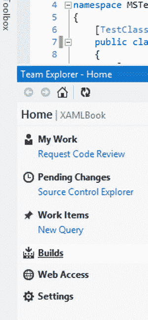
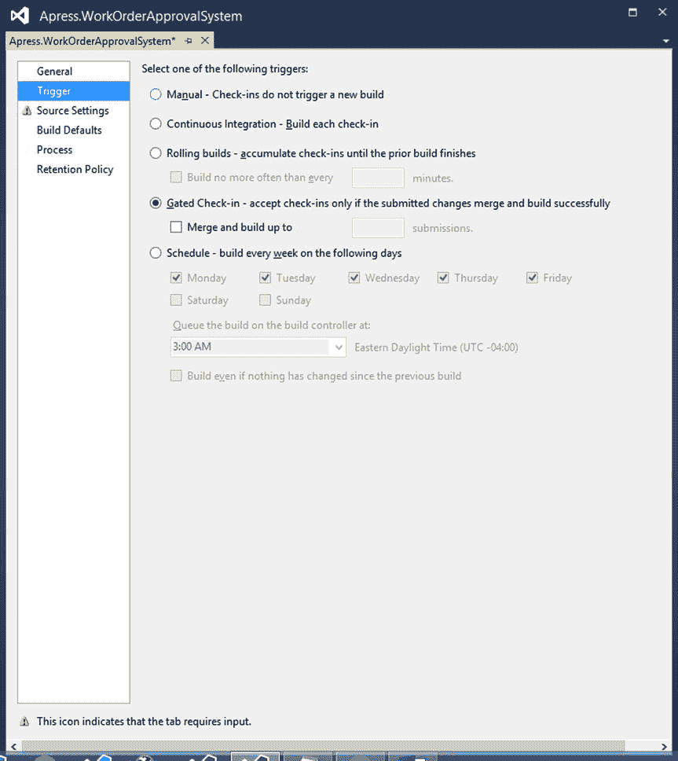
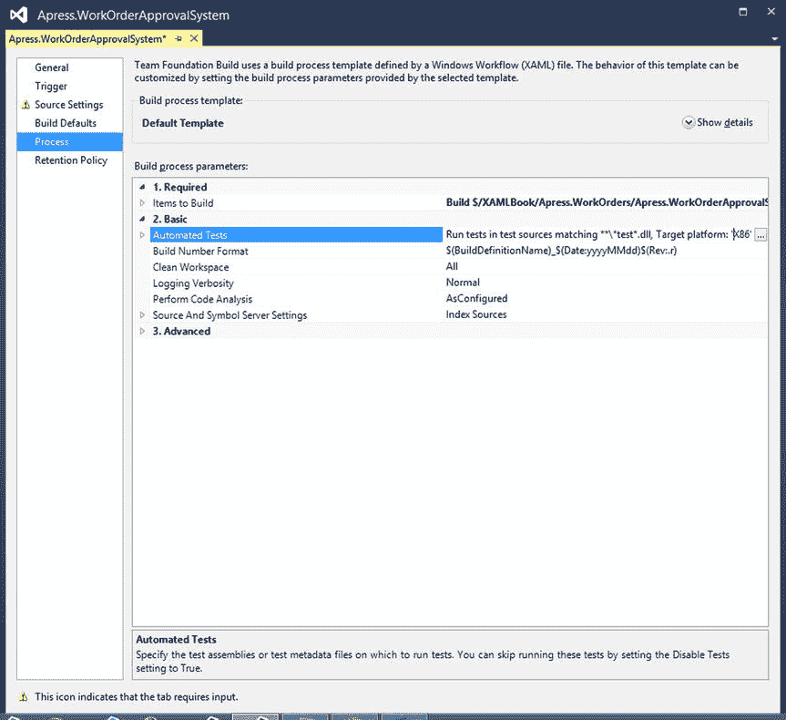
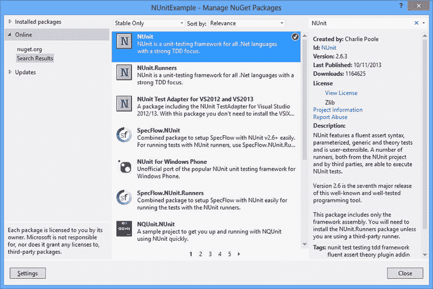
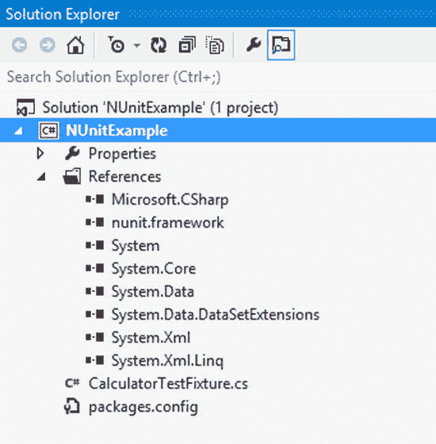
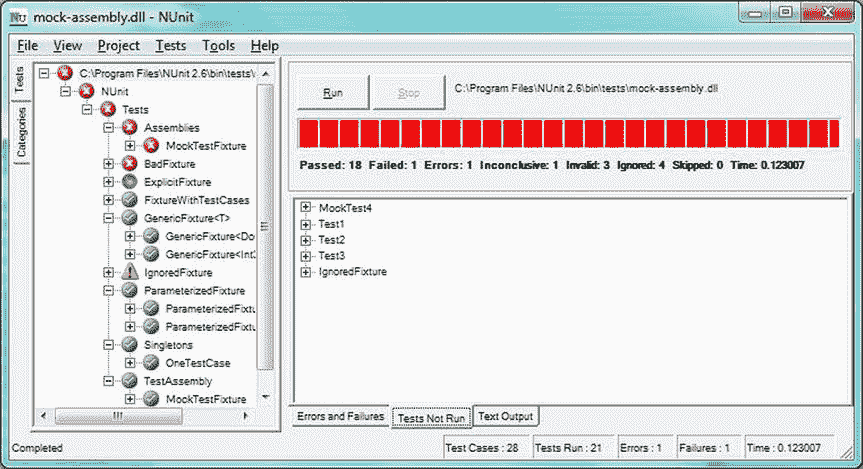
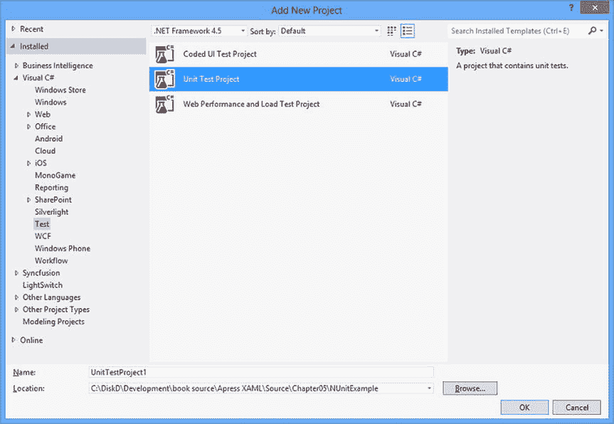
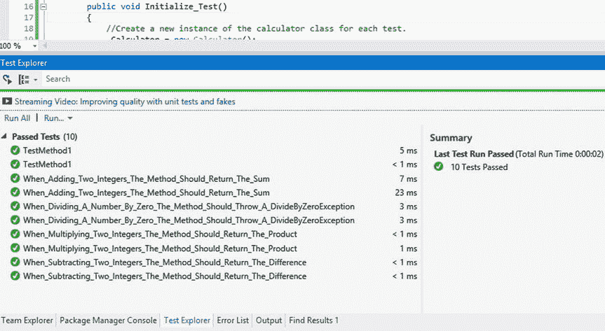

# 五、单元测试

在软件开发的历史上，一直有一个对手困扰着无畏的软件开发人员。我说的是被称为软件 bug 的大敌。自从软件是在纸质穿孔卡片上开发的以来，这个错误已经对每个程序员的职业生涯造成了严重的破坏。他们没有警告就发动攻击。他们依赖于每个项目的时间和预算。它们会损害数据的完整性。他们激起了愤怒的支持呼声。这些难以捉摸的生物随时都会出现。就像它们出现的速度一样快，它们有能力隐藏在你的源代码深处，就好像它们从来不存在一样。

你听过有人说“它在我的机器上工作了吗？”如果没有，你是幸运的。我们也说出了这些诅咒的话。这是不幸的开发人员和软件测试人员在试图重现客户提交的缺陷时所说的话。向付费客户解释，当你执行他们在愤怒的电子邮件中提交的或在支持电话中描述的确切步骤时，你无法引诱这些可怕的野兽离开藏身之处，这是一项艰巨的任务。

事实上，软件错误的范围可以从恼人的会话超时一直到数据垃圾灾难。"但是我怎样才能打败这样一只狡猾又聪明的害虫呢？"你问。就像在现实世界中一样，在调试软件时没有什么灵丹妙药。

Note

20 世纪 40 年代，格蕾丝·赫柏上将使“调试”一词在哈佛大学流行起来。故事是这样的，一只飞蛾被困在马克 2 号电脑的继电器里，导致电脑运行出现问题。当飞蛾从电脑中被移除后，她建议他们“调试”系统。

## 调试策略

这些年来，发现和消除软件系统中的缺陷所使用的主要策略将在下面的章节中介绍。

### 防错性程序设计

防御性编程应该是每个开发人员技能的一部分。以下是一些防御性编程基础:

*   防御性编程是这样一种实践:设计您创建的所有方法，以尝试预测所有可能的错误点，然后编写代码来优雅地处理这些错误，以便它们不会给应用的最终用户带来问题。这包括识别所有有效的输入参数值，并编写代码来测试所有输入以处理任何无效值。
*   在数据输入应用中，识别进入系统的所有数据源并编写代码以不惜一切代价保护数据是非常重要的。毕竟，你可能听过一句老话，“垃圾进，垃圾出。”
*   重要的是要记住，数据的来源不仅限于人工数据输入。许多企业软件应用与其他程序通信以发送和接收数据。这些来源包括 web 服务器、图像扫描仪、消息队列等系统，以及最常见的来源之一，数据库系统。你可以写尽可能多的防御代码；但是，如果您的系统与另一个应用共享一个数据库，您就无法控制这些外部系统产生的数据的质量。这就是为什么您必须检查所有数据，无论其来源如何，以发现潜在问题。
*   坏数据会进入您的应用；但是，您可以用一种不会中断用户体验的方式来处理错误，除非有必要。例如，设计良好的应用会处理错误，并将问题的详细描述写入数据库、日志文件或事件日志。
*   包含向您的支持团队发送电子邮件以提醒他们该问题的代码也很方便。如果您在编写代码时考虑到了用户，那么系统可以处理的错误对最终用户应该是不可见的。当用户遇到神秘的、未处理的异常网页或消息框时，他们会惊慌失措。根据经验，尽可能不要打断用户的工作流程。
*   如果您的应用无法从“致命”错误中恢复，最好用一条道歉的、美观的、可读的消息通知用户，让他们知道遇到了问题。一定要给用户提供指导，告诉他们下一步应该做什么。如果可能的话，在记录了所有相关的错误详细信息供以后调查后，尝试重新启动应用。

### 系统试验

系统测试是对整个应用进行测试的实践。这通常是质量保证团队的工作。然而，如果你的公司很小，你没有 QA 团队，那么这个责任就落在了你，开发者的身上。

最好创建一个测试用例集合，以便在不同的构建中测试是一致的。然而，这种方法每次都要测试相同的步骤。考虑到这个缺点，加入我们喜欢称之为突破挑战测试的东西也是一个好的实践。你会问，什么是突破挑战测试？当一个应用的测试人员被挑战用任何必要的手段破坏系统时。(当然，我们指的是使用荒谬的数据输入或点击多个工具栏按钮或菜单项——而不是用钝器敲打电脑。)

像用户一样思考很重要。通常，作为开发人员和测试人员，我们知道怪癖存在于哪里，并且我们知道如何避免它们。企业系统不应该允许您损害数据的完整性或使应用崩溃。

### 回归测试

回归测试包括测试一个 bug 修复，以确保 bug 被根除，并确保用于解决原始 bug 的代码更改不会产生新的 bug。可以想象，这种形式的测试可能很棘手，因为您几乎不可能跟上一个代码单元可能影响系统另一部分的所有实例。

### 用户接受度测试

用户验收测试是任何软件开发计划中的一个关键点。从在每次迭代结束时部署构建的迭代发布时间表，到最终用户直到构建完成后才能看到应用的遗留软件开发范例，您总是需要让客户测试系统，以便验证您交付的解决方案服务于其目的。这被称为用户验收测试。

如何执行验收测试的细节可能因项目而异。在某些情况下，团队将与客户密切合作，建立一系列测试用例。测试用例是由客户端执行的一系列步骤，目的是验证特定的功能是否按预期工作。有一些不太正式的验收测试实践，比如简单地部署应用并等待客户报告问题。显然，这种方法远非最佳；然而，它确实发生在现场。

## 拯救单元测试

不要误会我；到目前为止，我提到的所有方法都是对抗错误软件的重要武器。单元测试，如果做得正确，可以极大地提高你开发的软件解决方案的质量。

单元测试是由 Kent Beck 在 20 世纪 70 年代创立的一种经过时间考验的范例。如果你对这个名字不熟悉，我们建议你搜索一下，自学一下。Beck 先生在用 SmallTalk 编写代码时创造了单元测试这个术语。本章的其余部分解释了什么是好的单元测试，以及一些第三方产品，它们将帮助你充分利用你的单元测试工作。我们还将讨论测试驱动开发(TDD)，包括使用这种设计方法的利与弊。我们开始吧，好吗？

Caution

重要的是要理解，为了有效地利用单元测试，如果你想利用这个过程提供的好处，你需要投入大量的时间练习。此外，单元测试会增加项目进度的时间。让管理层相信单元测试值得投资不是一件容易的事情；然而，当正确实现时，单元测试可以很容易地在维护成本上收回成本。

重要的是要明白，如果没有完全掌握所需的概念和实践，单元测试可能会弊大于利。如果您投入时间和精力来学习单元测试，您的代码将在更少的错误、即时的错误检测、更易于阅读的代码以及可以跨多个应用重用的松散耦合组件方面受益。您还将获得在生产环境中部署应用的信心，并且当需要对源代码进行更改时，您会感到安全。

测试驱动开发(TDD)是一种软件开发方法，它允许您从单元测试开始驱动代码的设计，以定义您的类将被使用的方式。如果你只关心单元测试，你不必考虑你正在测试的方法的实现。可以先集中精力设计定义良好的类接口。当您将 TDD 添加到组合中时，您的类接口将得到改进，并且您将实际上减少您花费在设计您的类和例程上的时间。TDD 还有助于增加代码测试覆盖率，以及提高源代码的质量，因为重构是 TDD 过程中的一个必需步骤。最后，TDD 有助于防止镀金；也就是说，当正确实现时，您可以放心，您的类方法将有一个单一的责任。任何不支持这种单一职责的代码都将被重构到它自己的类中。

我们坚信单元测试和 TDD 的好处；然而，我们认为不给你们完整的故事是不负责任的。所以请继续阅读并尝试这些例子，以获得足够的知识来做出一个明智的决定，即单元测试和 TDD 是否是您项目的正确解决方案。

## 单元测试基础

免责声明说够了，让我们学习单元测试吧！单元测试是用于测试代码逻辑单元的源代码。代码的逻辑单元是包含逻辑指令(if/else、switch 语句、循环等)的任何方法或例程，这些逻辑指令用于通过设置方法或属性的返回值来控制系统的行为。这种类型的测试允许您在比系统或回归测试低得多的级别上测试您的源代码。

只要你经常运行你的单元测试，假设你所有的类和方法都有适当的测试覆盖，你就会准确地知道一个 bug 何时被引入系统。单元测试失败的那一刻，您就知道已经发现了一个 bug，并且您还知道涉及到哪个类和方法以及测试失败的原因。没有其他类型的软件测试提供这种级别的关于新错误的上下文信息。当您在您的软件解决方案中始终如一地实现适当的单元测试时，这些仅仅是获得的一些好处。

## 伟大的单元测试的特征

正如我们在本章开头的免责声明中所说的，不恰当的单元测试会导致弊大于利。所以，你可能会问，“那么，伙计，什么是伟大的单元测试？”

提出要求，你就会得到。以下部分是一个检查表，您可以用它来评估单元测试的质量。

### 自动化单元测试执行

你能自动执行你的单元测试吗？如果您的测试必须由一个普通的人手动执行，很有可能您或您团队中的某个人迟早会忙于工作以满足最后期限，您可能会听到您脑海中的那个声音在低语，“您不必对每一个微小的变化都执行这些测试；毕竟，现在已经是下午 5 点了。”或者“我将在完成剩下的两个特性之后运行测试。”从现在开始，这是一个滑坡，在你知道之前，你将失去早期 bug 检测的好处，这将使你质疑单元测试的有效性。最终的结果是什么？一些团队成员将编写单元测试，而其他人将放弃实践。

测试将变得陈旧，当您决定执行单元测试时，您不能确定系统的哪些更改导致了导致单元测试失败的错误。这就是为什么在任何代码修改之后，自动执行所有单元测试是非常重要的。主要的候选包括在每次构建或者每次签入到您的源代码控制系统时执行单元测试。

对于与 Visual Studio 集成的源代码管理系统，有几种选择。我个人最喜欢的是 TFS 2013。从现在开始，对源代码管理的所有引用都将针对 Team Foundation Server。然而，对于大多数源代码控制系统来说，这些概念是相似的。

### 单元测试执行速度

持续集成(CI)是一组与软件开发项目的整个构建阶段的构建部署相关的原则。持续集成通常作为其他敏捷方法的补充来实现。这是因为敏捷开发的迭代性质以及工作软件的频繁构建部署。

在敏捷开发中，团队在整个项目的每个迭代中实现增加商业价值的特性。此外，包含来自上一次迭代的新特性的源代码被编译并部署到客户的生产环境中。

这种方法有几个好处。例如，如果您交付的构建包含至少一个增加业务价值的完整特性，那么客户在第一次迭代之后就会体验到他们所要求的产品的好处。这使用户能够提供建设性的反馈，这将保证最终结果正是客户所要求的。

部署一个构建可以顺利进行；但是，在部署过程中经常会发现一些问题，而在尝试部署之前没有人知道这些问题的存在。这是 CI 和单元测试共同确保部署顺利进行的地方。如果问题仍然出现，那么开发人员恢复到以前的版本应该没有任何问题。

这里有一个你如何利用 CI、单元测试和 TFS 源代码控制的例子。您使用 TFS 来处理项目规划、源代码控制、问题跟踪、自动化构建和自动化单元测试执行。您还使用 TDD，这样您就有大量的单元测试。当实现新功能时，在将任何源文件签入源代码管理之前，必须确保所有单元测试都已通过。否则，在解决最初的错误或实现新功能时，您可能会在系统中引入一个新的错误，这是您所做更改的副作用。

显然，您应该只签入没有错误的代码。由于 Visual Studio 和 TFS 之间的紧密集成，您能够从 Visual Studio 中创建自动化的构建定义。图 [5-1](#Fig1) 展示了 Visual Studio 的团队资源管理器窗口中的构建选项。

图 5-1。

Visual Studio 2012 TFS Team Explorer

“构建”菜单选项允许具有适当权限的用户创建构建定义。有几种类型的构建定义。但是，您感兴趣的是封闭签入生成定义类型。封闭签入生成定义将首先尝试使用您尝试签入源代码管理的源代码来生成您的解决方案。如果构建失败，则签入被拒绝，用户得到通知，并且在 TFS 中创建一个 bug 工作项，以便记录和跟踪问题。如果构建成功，自动化构建将执行所有单元测试。

如果构建成功并且所有单元测试都通过，那么源代码将被签入到源代码控制中。您甚至可以配置生成定义，将项目的程序集部署到本地文件夹或网络共享。可以想象，这将大大减少任何部署意外。根据您的需要，您甚至可以将 Visual Studio 配置为在每个用户的每次构建尝试时触发单元测试执行。这样，您永远不必担心忘记运行单元测试。

图 [5-2](#Fig2) 显示了如何在团队资源管理器中配置 TFS 构建定义。在这里，您可以设置一个封闭的签入触发器，以指定只有在提交的代码更改构建成功时才接受签入。

图 5-2。

Visual Studio TFS Build Definition Triggers

图 5-3 显示了如何在 TFS 构建定义中配置自动化单元测试执行。相关的设置可以在 Build Process 选项卡下找到。

图 5-3。

Visual Studio TFS Build Process Parameters

正如您所想象的，如果您的所有单元测试都要在签入甚至构建时自动执行，那么单元测试的执行速度必须尽可能快，同时又不影响测试的质量。

### 你的单元测试

K.I.S.S .是一个臭名昭著的缩写，代表“保持简单，笨蛋。”就像你的类接口和方法实现的设计一样，在设计单元测试时要考虑简单性，这一点很重要。这有助于降低执行速度，同时促进单元测试能够被开发团队的任何成员容易地理解和修改。如果你的单元测试不能快速执行，你就不太可能运行它们，这违背了它的目的。如果团队成员为了理解实现而不得不向单元测试的作者提问，您可能需要重构单元测试。

最后，一个干净简单的单元测试使得开发者更容易看到被测试的类或者被测试的类(CUT)的接口，以及理解它的预期用途。一个好的单元测试清楚地展示了 CUT 的使用以及测试的预期结果。

### 所有团队成员都应该能够执行单元测试

依靠一个团队成员来负责单元测试或任何其他开发过程是不现实的。软件开发人员经常更换工作，因此在所有团队成员之间共享与项目相关的所有知识是极其重要的。

对于团队中的所有开发人员来说，一个好的单元测试应该易于执行。如果可能的话，团队的任何成员都应该能够通过单击鼠标来执行所有的单元测试。

### 伟大的单元测试经受住了时间的考验

单元测试在首次编写两年后应该产生相同的结果。这与测试的质量有很大的关系，就像维护每一个单元测试，以确保导致单元测试失败的任何软件更改也在单元测试中得到解决。如果单元测试没有随着主要软件设计的改变而改变，那么这显然意味着单元测试没有被执行，因此它们变得陈旧和无用。只要项目构建成功，所有相关的单元测试都应该通过。

### 单元测试夹具

单元测试夹具是一个类，其中的方法是单元测试或者是用于准备单元测试的帮助方法。测试夹具应该包含设计用于测试相关特性的单元测试，通常是驻留在同一个类或类库中的测试。测试夹具的一个流行命名惯例是以 test fixture 作为后缀的切割名称。例如，如果您正在为一个名为`Calculator`的类编写一个充满单元测试的测试夹具类，那么您将该测试夹具类命名为`CalculatorTestFixture`。

## 单元测试框架

有几个针对. NET 的单元测试框架。我们将在本章中向您介绍其中的两个。我们将回顾 NUnit 框架以及本机 Visual Studio 单元测试项目模板。

### NUnit

NUnit 是基于 Junit 的开源单元测试框架，Junit 是 Java 编程语言的单元测试框架。NUnit 很受开源倡导者的欢迎。该框架是一个完整的单元测试工具，包括以下内容:

*   通过 NuGet 轻松安装。
*   与 Visual Studio 的集成。
*   可以用来执行单元测试的命令行界面。这使得从命令行构建您的解决方案时自动化测试执行变得轻而易举。
*   一个 GUI 界面，它提供了关于测试工作状态的可视化提示，比如哪个测试正在执行，哪些测试已经通过或者失败，以及哪些测试还没有运行。
*   用于标记特殊测试方法的几个测试方法属性，用于测试设置、拆卸、预期异常等目的。你可以在 [`http://nunit.org/index.php?p=documentation`](http://nunit.org/index.php?p=documentation) 找到一个完整的属性列表。
*   属性标识了一个类，它的目的是提供所有的单元测试方法。单元测试方法标有`[Test]`属性。
*   当编写单元测试时，通常您必须编写样板代码，用于准备在多个单元测试方法中使用的依赖项和其他相关对象。为了纪念 DRY 原则(“不要重复自己”)，NUnit 提供了`[Setup]`属性，该属性指示在执行每个测试之前应该运行指定的方法。这允许您在运行每个测试之前将所有相关变量初始化为预定义的状态。这是创建要在单元测试中使用的存根和模拟对象的绝佳位置。
*   与`[Setup]`属性非常相似的是，`[TearDown]`属性指定了一个方法，用于处置任何不由 .NET CLR 垃圾收集器。这种资源的几个例子包括数据库连接、web 服务引用、文件系统对象等等。这也是将所有对象引用设置为 null 并删除作为单元测试一部分创建的任何文件的主要方法。如果您的测试在内存或任何其他类型的资源中创建了任何应该被释放的对象，这就是要使用的属性。
*   大量的方法允许您断言您的代码正在按预期执行。你可以在 [`http://nunit.org/index.php?p=documentation`](http://nunit.org/index.php?p=documentation) 的 NUnit 官方文档中找到所有的断言方法。

如图 [5-4](#Fig4) 所示，NUnit 框架可以使用 Visual Studio 中的 NuGet 包管理器进行安装。

图 5-4。

NUnit installed from the NuGet package manager

通过从 Visual Studio 中的 NuGet 包管理器安装 NUnit，`nunit.framework`引用将被自动添加到项目的引用中。观察图 [5-5](#Fig5) 中的项目参考。

图 5-5。

A project that references the NUnit framework assembly

NUnit 不仅仅是一个单元测试库。NUnit 为执行单元测试提供了命令行支持。这对自动化测试执行很有用。如果您想查看您的测试结果，您可以使用 NUnit test runner GUI，如图 [5-6](#Fig6) 所示。

图 5-6。

NUnit Test Runner GUI

如您所见，NUnit 单元测试框架是一个全面的测试套件，最棒的是，它是开源的(而且是免费的)。现在我们已经讨论了 NUnit，我将提供一个单元测试和被测试类的例子。清单 [5-1](#FPar1) 显示了一个计算器类的`interface`。有`Add`、`Subtract`、`Divide`、`Multiply`的方法。

Listing 5-1\. ICalculator.cs Code

`using System;`

`using System.Collections.Generic;`

`using System.Linq;`

`using System.Text;`

`namespace NUnitExample`

`{`

`public interface ICalculator : IDisposable`

`{`

`int Add(int numberOne, int numberTwo);`

`int Subtract(int numberOne, int numberTwo);`

`int Divide(int numberOne, int numberTwo);`

`int Multiply(int numberOne, int numberTwo);`

`}`

`}`

清单 [5-2](#FPar2) 展示了`Calculator`类的实现。`Calculator`类实现了`ICalculator`接口。

Listing 5-2\. Calculator.cs Code

`using System;`

`using System.Collections.Generic;`

`using System.Linq;`

`using System.Text;`

`using System.Threading.Tasks;`

`namespace NUnitExample`

`{`

`/// 
`

`/// Represents a primative calculator for demonstration purposes`

`/// 
`

`public class Calculator : ICalculator, IDisposable`

`{`

`#region ICalculator Members`

`/// 
`

`/// Add two integers and return the sum to the caller`

`/// 
`

`/// <param name="numberOne">a number to add</param>`

`/// <param name="numberTwo">a number to add</param>`

`/// <returns>The sum of the two input arguments</returns>`

`public int Add(int numberOne, int numberTwo)`

`{`

`return numberOne + numberTwo;`

`}`

`/// 
`

`/// Subtract two integers and return the difference to the caller`

`/// 
`

`/// <param name="numberOne">a number to subtract</param>`

`/// <param name="numberTwo">a number to subtract</param>`

`/// <returns>The difference between the two input arguments</returns>`

`public int Subtract(int numberOne, int numberTwo)`

`{`

`return numberOne - numberTwo;`

`}`

`/// 
`

`/// Divide two numbers`

`/// 
`

`/// <param name="numberOne">A number that should be divided by the second        argument</param>`

`/// <param name="numberTwo">A number to use to divide the first argument</param>`

`/// <returns>The result of the division</returns>`

`/// <remarks>Generally, you should always check for a DivideByZero exception,         however, we are leaving this out to demonstrate how to test for expected exceptions in unit tests.</remarks>`

`public int Divide(int numberOne, int numberTwo)`

`{`

`return numberOne / numberTwo;`

`}`

`/// 
`

`/// Multiply two integers and return the product to the caller`

`/// 
`

`/// <param name="numberOne">a number to multiply</param>`

`/// <param name="numberTwo">a number to multiply</param>`

`/// <returns>The product of the multiplication between the two numbers</returns>`

`public int Multiply(int numberOne, int numberTwo)`

`{`

`return numberOne * numberTwo;`

`}`

`#endregion`

`#region IDisposable Members`

`/// 
`

`/// if we had any unmanaged resources, we would free the associated         resources here.`

`/// 
`

`public void Dispose()`

`{`

`Console.WriteLine("Clean as a whistle.");`

`}`

`#endregion`

`}`

`}`

清单 [5-3](#FPar3) 显示了一个名为`CalculatorTestFixture.`的单元测试夹具类，正如你所看到的，这个类是用`TestFixture`属性修饰的。这将该类标记为单元测试类。我们使用`Initialize_Test`上的`Setup`属性来指定在运行任何测试之前应该执行的方法。这可以用来初始化您的测试类及其依赖项。`TearDown`属性用于指定在所有测试运行后要执行的方法。此方法可用于释放对外部资源的任何引用。在这个例子中，我在`Calculator`类中实现了`IDisposable`接口。我们使用`TearDown_Test`方法来处理被测试的类。最后，我们有四个用`Test`属性标记的方法。这些是我们的单元测试。

Listing 5-3\. CalculatorTestFixture.cs Code

`using System;`

`using System.Collections.Generic;`

`using System.Linq;`

`using System.Text;`

`using System.Threading.Tasks;`

`using NUnit.Framework;`

`namespace NUnitExample`

`{`

`[TestFixture]`

`public class CalculatorTestFixture`

`{`

`private ICalculator _Calculator;`

`[SetUp]`

`public void Initialize_Test()`

`{`

`//Create a new instance of the calculator class for each test.`

`_Calculator = new Calculator();`

`}`

`[Test]`

`public void When_Adding_Two_Integers_The_Method_Should_Return_The_Sum()`

`{`

`var numberOne = 2;`

`var numberTwo = 8;`

`Assert.AreEqual(10, _Calculator.Add(numberOne, numberTwo));`

`}`

`[Test]`

`public void When_Subtracting_Two_Integers_The_Method_Should_Return_The_Difference()`

`{`

`var numberOne = 10;`

`var numberTwo = 2;`

`Assert.AreEqual(8, _Calculator.Subtract(numberOne, numberTwo));`

`}`

`[Test]`

`public void When_Multiplying_Two_Integers_The_Method_Should_Return_The_Product()`

`{`

`var numberOne = 2;`

`var numberTwo = 2;`

`Assert.AreEqual(4, _Calculator.Multiply(numberOne, numberTwo));`

`}`

`[Test]`

`[ExpectedException("System.DivideByZeroException")]`

`public void When_Dividing_A_Number_By_Zero_The_Method_Should_Throw_A_DivideByZeroException()`

`{`

`var numberOne = 0;`

`var numberTwo = 0;`

`_Calculator.Divide(numberOne, numberTwo);`

`}`

`[TearDown]`

`public void TearDown_Test()`

`{`

`//perform any necessary clean up`

`_Calculator.Dispose();`

`}`

`}`

`}`

### Microsoft 单元测试项目模板

不要误解我们，我们认为 NUnit 是一款很棒的产品；然而，我们选择的单元测试框架是微软单元测试项目模板。它是一个单元测试框架，具有内置于 Visual Studio 中的本机支持。要创建一个新的 Microsoft 单元测试项目，只需在解决方案资源管理器中右击并选择 Add New。接下来，选择测试类别，并选择单元测试项目。图 [5-7](#Fig7) 展示了如何在 Visual Studio 中添加一个新的单元测试项目。

图 5-7。

New Unit Test Project template in Visual Studio

Visual Studio 的测试资源管理器窗口使得只需单击鼠标就可以轻松执行一个或所有单元测试。测试资源管理器窗口也用于查看单元测试的执行状态(参见图 [5-8](#Fig8) )。

图 5-8。

Visual Studio’s Test Explorer window showing a successful test run of all unit tests

Microsoft 单元测试项目模板具有一些属性，这些属性赋予您的测试方法特定的职责，就像您在 NUnit 的覆盖范围中看到的一样。您可以使用各种属性来修饰您的测试方法。这样的属性包括测试设置和拆卸方法，当然，还有一个将方法标识为单元测试的属性。

为了说明这两个框架之间的细微差别，我已经包含了前面的计算器单元测试 fixture 类，移植以使用微软单元测试项目类型，如清单 [5-4](#FPar4) 所示。

Listing 5-4\. CalculatorTestFixture.cs Code

`using System;`

`using System.Collections.Generic;`

`using System.Linq;`

`using System.Text;`

`using System.Threading.Tasks;`

`using Microsoft.VisualStudio.TestTools.UnitTesting;`

`namespace MSTestExample`

`{`

`[TestClass]`

`public class CalculatorTestFixture`

`{`

`private ICalculator _Calculator;`

`[TestInitialize]`

`public void Initialize_Test()`

`{`

`//Create a new instance of the calculator class for each test.`

`_Calculator = new Calculator();`

`}`

`[TestMethod]`

`public void When_Adding_Two_Integers_The_Method_Should_Return_The_Sum()`

`{`

`var numberOne = 2;`

`var numberTwo = 8;`

`Assert.AreEqual(10, _Calculator.Add(numberOne, numberTwo));`

`}`

`[TestMethod]`

`public void When_Subtracting_Two_Integers_The_Method_Should_Return_The_Difference()`

`{`

`var numberOne = 10;`

`var numberTwo = 2;`

`Assert.AreEqual(8, _Calculator.Subtract(numberOne, numberTwo));`

`}`

`[TestMethod]`

`public void When_Multiplying_Two_Integers_The_Method_Should_Return_The_Product()`

`{`

`var numberOne = 2;`

`var numberTwo = 2;`

`Assert.AreEqual(4, _Calculator.Multiply(numberOne, numberTwo));`

`}`

`[TestMethod]`

`[ExpectedException(typeof(System.DivideByZeroException))]`

`public void When_Dividing_A_Number_By_Zero_The_Method_Should_Throw_A_DivideByZeroException()`

`{`

`var numberOne = 0;`

`var numberTwo = 0;`

`_Calculator.Divide(numberOne, numberTwo);`

`}`

`[TestCleanup]`

`public void TearDown_Test()`

`{`

`//perform any necessary clean up`

`_Calculator.Dispose();`

`}`

`}`

`}`

正如您在清单 [5-4](#FPar4) 中看到的，代码与清单 [5-1](#FPar1) 中显示的 NUnit 示例几乎相同。这证明您在单元测试框架中的选择纯粹是个人偏好。我们喜欢微软的框架，因为你不需要下载任何包或者组件。使用与在 Visual Studio 中创建的任何其他项目相同的工作流，可以实现对代码进行单元测试所需的一切。

## 摘要

在这一章中，我们介绍了使用各种测试方法和编程技术来最大限度地减少因错误而浪费在查找、修复和重新测试软件上的时间和金钱。当正确实现时，自动化单元测试可以极大地减少 bug 的数量以及发现和修复它们的影响。我们给了你关于单元测试的“全部故事”,以及如果执行不正确，它们可能产生的损害。

重要的是，你的类接口设计促进了易于阅读、理解、修改和维护的对象的创建。正确实现时，TDD 可以帮助您做到这一点，同时，它将提高您代码的测试覆盖率，因为您不会在没有先编写测试的情况下编写任何代码。

我们提供了一个标准列表，您可以使用它来评估您的单元测试的质量。我们还讨论了自动执行单元测试的重要性，这样当单元测试失败时，您就可以知道任何引入到源代码中的错误。包含失败单元测试的测试夹具的切割将消除与寻找导致测试失败的错误源相关的猜测游戏。

我们向您介绍了两个流行的单元测试框架:NUnit 和微软的单元测试项目模板。我们还提供了一个简单的例子，说明如何使用每个框架编写一个基本的测试夹具类。

在第 6 章中，我们将探索单元测试的一些高级方面，比如存根、假货和模拟对象。我们还将介绍测试驱动开发，这是一种软件设计方法，允许您在编写代码之前通过编写代码测试来设计您的类和方法。这引入了一个抽象层，帮助您忽略每个方法的实现细节，并允许您根据您打算如何使用该类来设计您的类接口。