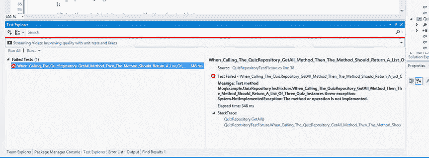
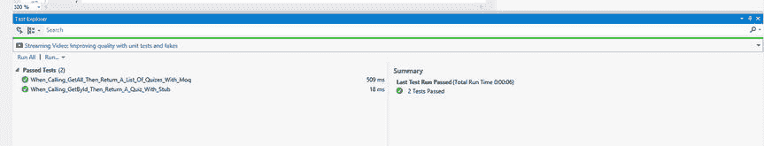

# 6.高级单元测试和测试驱动开发

如果单元测试是您选择在项目中使用的一种实践，那么一旦您掌握了编写有效单元测试的诀窍，您将会编写大量的单元测试。重要的是要记住，单元测试夹具是一个类，因此，您应该利用面向对象设计提供的好处。

## 测试夹具也是类

当编写单元测试时，一定要睁大眼睛寻找任何降低复杂性的机会。由于您的测试设备通常集中在同一个领域，您会发现自己正在创建在所有测试类中使用的实体的实例。如果你发现你在几个方法或者测试类中写同样的代码，你要记得坚持 DRY 原则:不要重复自己。在这种情况下，继承显然是一个很好的工具。

## 使用继承来避免重复代码

您在应用设计中建模的业务领域基于创建和参加测验，以帮助用户学习官方考试。正如我们之前讨论的，有一个名为`Quiz`的根实体。一个`Quiz`是一个`Question`实例的集合，一个`Question`是一个`Answer`实例的集合。

您通常会为应用的每一层创建一个单元测试库。为了测试应用的每一层，假设您将需要例程来创建`Quiz`根实体以及所有`Quiz`属性的实例是安全的。不用复制所有用于创建这些测试类的样板代码，您可以创建一个带有方法的基类来创建您将在整个单元测试类中需要的所有测试实体。所有单元测试类都可以从这个基类继承，并利用继承来消除重复的代码。

考虑清单 [6-1](#FPar1) 中显示的基类。

Listing 6-1\. QuizTestBase.cs

`using System.Collections.Generic;`

`using QuizIt.Domain;`

`namespace MoqExample`

`{`

`/// 
`

`/// Base class for all quiz related unit testing classes`

`/// 
`

`public abstract class QuizTestBase`

`{`

`private int _IdCounter = 0;`

`/// 
`

`/// Create a quiz object to be used in unit tests.`

`/// 
`

`/// <returns>A Quiz object to use for testing.</returns>`

`protected virtual Quiz PrepareTestQuiz()`

`{`

`var testQuiz = new Quiz`

`{`

`Id = _IdCounter++,`

`Name = string.Format("Test Quiz #{0}", _IdCounter),`

`};`

`testQuiz.Questions = PrepareQuizQuestions();`

`return testQuiz;`

`}`

`/// 
`

`/// Create a collection of quiz question objects for testing`

`/// 
`

`/// <returns>A collection of question objects.</returns>`

`protected virtual IEnumerable<Question> PrepareQuizQuestions()`

`{`

`var quizQuestions = new List<Question>`

`{`

`PrepareQuestion(),`

`PrepareQuestion(),`

`PrepareQuestion()`

`};`

`return quizQuestions;`

`}`

`/// 
`

`/// Create a question for testing`

`/// 
`

`/// <returns>A question object.</returns>`

`protected virtual Question PrepareQuestion()`

`{`

`return new Question`

`{`

`Id = _IdCounter++,`

`DisplayText = string.Format("Question # '{0}'.", _IdCounter++),`

`Points = 10,`

`Answers = PrepareAnswers()`

`};`

`}`

`/// 
`

`/// Create a collection of question answers for testing`

`/// 
`

`/// <returns>A collection of answer objects.</returns>`

`protected virtual IEnumerable<Answer> PrepareAnswers()`

`{`

`return new List<Answer>`

`{`

`PrepareAnswer("Incorrect Answer 1.", false),`

`PrepareAnswer("Incorrect Answer 2.", false),`

`PrepareAnswer("Correct Answer.", true),`

`PrepareAnswer("Incorrect Answer 3.", false)`

`};`

`}`

`/// 
`

`/// Create an answer for testing`

`/// 
`

`/// <returns>An answer object.</returns>`

`protected Answer PrepareAnswer(string displayText, bool isCorrect)`

`{`

`return new Answer`

`{`

`Id = _IdCounter++,`

`DisplayText = displayText,`

`IsCorrect = isCorrect`

`};`

`}`

`/// 
`

`/// Create a collection of Quizes for testing`

`/// 
`

`/// <returns>A collection of quiz objects.</returns>`

`protected virtual IEnumerable<Quiz> PrepareTestQuizCollection()`

`{`

`return new List<Quiz>`

`{`

`this.PrepareTestQuiz(),`

`this.PrepareTestQuiz(),`

`this.PrepareTestQuiz()`

`};`

`}`

`}`

`}`

正如您所看到的，这个类提供了创建任何实体的实例的方法，您将在单元测试您的应用层时需要这些实例。

## 有依赖关系的单元测试类

正如我们在前面的章节中所讨论的，依赖注入和控制反转是设计代码的两种方法，这种方法允许改变，但不允许修改(也称为开放/封闭原则)。如果您在设计类时牢记这一开放/封闭原则，那么在部署解决方案后，您可以大大降低与项目维护相关的成本。

### 处理依赖性

单元测试和测试驱动的开发是用来设计和开发松散耦合的组件的好工具，这些组件易于更改，并且只需少量的代码修改就可以在其他项目中重用。为了有效地测试一个特定的类，您需要一种方法来处理您不能控制或预测行为的类的依赖性。

这种依赖关系的一些示例包括与数据库、文件系统或任何第三方依赖关系交互的对象，在这些依赖关系中，您无权访问源代码。例如，假设您正在测试一个 web 服务或者存储库设计模式的实现。无论是哪种情况，您都需要编写在每次测试运行中都产生相同结果的测试。

如果您正在对一个依赖于 web 服务的域服务类进行单元测试，那么您如何控制信息包在网络上往返于 web 服务的传输速度呢？记住，一个好的单元测试的要求之一是它需要运行得很快。假设运行单元测试的开发人员的工作站失去了与互联网的连接。如果有可能抛出异常，如何控制或预测依赖类上的方法调用的返回值？

当对依赖于数据库连接的类进行单元测试时，您会遇到同样的问题。让我们假设您的 DBA 仅有的两个弱点是 kryptonite 和模式更改。超级 DBA 可以保证数据库服务器永远不会失去连接，并且它已经创建了索引，这些索引产生的`SELECT`语句比子弹还快。

出于争论的原因，连接问题和执行速度不是你的问题。如果您试图为一个依赖于超级数据库的类编写单元测试，您仍然会面临许多问题。首先，你需要一个专用于单元测试的数据库。毕竟，除非您能够保证数据的状态以及每个查询将返回的值，否则您无法针对数据库编写测试。

为了实现这一点，您将需要开发具有大量设置和拆卸逻辑的单元测试，以准备您计划使用的表。在这种情况下，您需要在每次测试之前确保测试表处于正确的状态，用您期望的返回值填充该表，并在每次测试运行之后将该表重置为初始状态。

即使有专用的数据库，如果两个开发人员同时执行同一个单元测试会发生什么？三个、四个或二十个开发人员呢？我想你能明白我的意思。如果您的单元测试导致任何`INSERT`语句在超级服务器上执行，而另一个开发人员执行一个将`SELECT`数据的测试，那么很可能有人会以意外的返回值结束，这可能会使测试失败。

你不能依赖这些类型的依赖。那么，如何对你无法控制的依赖类进行单元测试呢？首先，在设计您的类时，记住这些问题是很重要的。这是测试驱动开发的众多好处之一。如果在编写代码之前编写测试，那么作为设计可以有效地进行单元测试的类的副作用，您的代码将会发生变化。

另一个重要的设计决策将帮助您管理单元测试中的依赖关系，那就是利用接口来创建无需修改即可更改的类。如果在设计类时通过接口引用利用多态性，那么就可以很容易地改变单元测试中使用的依赖项的实现。您只需创建被测试类所使用的依赖项的不同实现。如果您可以轻松地切换接口引用的实现，那么您就可以创建一个类，该类的行为总是与测试方法中的断言所期望的行为完全一致。唯一的要求是每个类的实现必须遵守接口定义的契约。这些特殊的测试类实现被称为存根。

例如，假设您已经创建了一个数据访问类，它的实现与特定于 SQL Server 的 ADO.NET 数据访问类紧密耦合，这些数据访问类内置于 .NET 框架类库。清单 [6-2](#FPar2) 提供了一些示例代码。

Listing 6-2\. A Data Access Class That Deals Directly with a Database Connection Using ADO.NET

`using System;`

`using System.Collections.Generic;`

`using System.Configuration;`

`using System.Data;`

`using System.Data.SqlClient;`

`using DataAccess.Interfaces;`

`using QuizIt.Domain;`

`namespace DataAccess.Sql`

`{`

`/// 
`

`/// Provides methods to load and save quiz related data to the database`

`/// using ADO.NET and SQL.`

`/// 
`

`public class QuizSqlDataAccess : IQuizDataAccess`

`{`

`#region "private members"`

`private string _DbConnectionString;`

`private SqlConnection _DbConnection;`

`private IDbCommand _DbCommand;`

`#endregion`

`#region "constructor(s)"`

`/// 
`

`/// Default constructor`

`/// 
`

`public QuizSqlDataAccess()`

`{`

`_SetConnectionString();`

`}`

`#endregion`

`#region IQuizSqlDataAccess Members`

`/// 
`

`/// Retrieve all quiz objects from the database.`

`/// 
`

`/// <returns>A collection of quizes.</returns>`

`public IEnumerable<Quiz> GetAllQuizesFromDatabase()`

`{`

`throw new NotImplementedException();`

`}`

`/// 
`

`/// Retrieve all quiz objects from the database.`

`/// 
`

`/// <param name="id">`

`/// The primary key associated`

`/// with the quiz to be`

`/// retrieved.`

`/// </param>`

`/// <returns>`

`/// The quiz associated with`

`/// the specified id.`

`/// </returns>`

`public Quiz GetQuizById(int id)`

`{`

`if (id <= 0)`

`throw new ArgumentOutOfRangeException("id");`

`var quizDataReader = _GetQuizDataReaderById(id);`

`if (quizDataReader == null)`

`throw new NullReferenceException("error reading quiz data.");`

`return _LoadQuizFromDataReader(quizDataReader);`

`}`

`#endregion`

`#region "private helpers"`

`private IDataReader _GetQuizDataReaderById(int id)`

`{`

`//TODO consider moving the creation of the connection and object`

`//into the using statements to gaurantee the IDisposable Dispose() method is called to close the connections`

`if (_DbConnection == null)`

`_DbConnection = new SqlConnection(_DbConnectionString);`

`var getQuizStoredProc = "usp_GetQuizById";`

`_DbCommand = new SqlCommand(getQuizStoredProc, _DbConnection);`

`_DbCommand.CommandType = CommandType.StoredProcedure;`

`var storedProcParam = new SqlParameter("@id", id);`

`if (_DbConnection.State != ConnectionState.Open)`

`_DbConnection.Open();`

`var quizDataReader = _DbCommand.ExecuteReader();`

`return quizDataReader;`

`}`

`private Quiz _LoadQuizFromDataReader(IDataReader dr)`

`{`

`if (dr == null)`

`throw new ArgumentNullException("dr");`

`var quiz = new Quiz();`

`using (_DbConnection)`

`{`

`using (_DbCommand)`

`{`

`using (dr)`

`{`

`while (dr.Read())`

`{`

`quiz.Id = (int)dr["Id"];`

`quiz.Name = (string)dr["Name"];`

`quiz.Questions = _LoadQuestionsFromDataReader(dr);`

`}`

`dr.Close();`

`}`

`}`

`_DbConnection.Close();`

`}`

`return quiz;`

`}`

`private IEnumerable<Question> _LoadQuestionsFromDataReader(IDataReader dr)`

`{`

`if (dr == null)`

`throw new ArgumentNullException("dr");`

`var questions = new List<Question>();`

`while (dr.Read())`

`{`

`var question = new Question();`

`question.Id = (int)dr["QuestionId"];`

`question.DisplayText = (string)dr["QuestionDisplayText"];`

`question.Points = (int)dr["QuestionPoints"];`

`question.Answers = _LoadAnswersFromDataReader(dr);`

`questions.Add(question);`

`}`

`return questions;`

`}`

`private IEnumerable<Answer> _LoadAnswersFromDataReader(IDataReader dr)`

`{`

`if (dr == null)`

`throw new ArgumentNullException("dr");`

`var answers = new List<Answer>();`

`while (dr.Read())`

`{`

`var answer = new Answer();`

`answer.Id = (int)dr["AnswerId"];`

`answer.DisplayText = (string)dr["AnswerDisplayText"];`

`answer.IsCorrect = (bool)dr["AnswerPoints"];`

`answers.Add(answer);`

`}`

`return answers;`

`}`

`private void _SetConnectionString()`

`{`

`if (ConfigurationManager.ConnectionStrings["DbCnnString"] == null)`

`throw new NullReferenceException("Null DbCnnString.");`

`_DbConnectionString =`

`ConfigurationManager.ConnectionStrings["DbCnnString"].ConnectionString;`

`if (string.IsNullOrEmpty(_DbConnectionString))`

`throw new NullReferenceException("null connection string");`

`_DbConnection = new SqlConnection(_DbConnectionString);`

`}`

`#endregion`

`}`

`}`

首先要注意的是，该类实现了`IQuizDataAccess`接口。清单 [6-3](#FPar3) 显示了接口定义。

Listing 6-3\. IQuizDataAccess.cs

`using System.Collections.Generic;`

`using QuizIt.Domain;`

`namespace DataAccess.Interfaces`

`{`

`/// 
`

`/// Provides a contract for classes`

`/// used to read and write quiz data.`

`/// 
`

`public interface IQuizDataAccess`

`{`

`Quiz GetQuizById(int id);`

`IEnumerable<Quiz> GetAllQuizesFromDatabase();`

`}`

`}`

如您所见，`QuizSqlDataAccess`类需要一个到 SQL Server 数据库的有效连接，以便加载测验数据返回给调用者。现在，您可以在域服务类中直接使用数据访问对象；然而，当您需要支持不同的数据库系统时会发生什么呢？如果您的域服务直接引用 ADO .NET 特定的接口实现，您将需要创建一个接口实现，它是为使用新的数据库技术而设计的。您还需要修改整个项目中的每个类，以及任何其他使用`QuizSqlDataAccess`类的项目。如果您应用面向对象的设计原则，您将编写您的类，以便它们可以在其他应用中重用。(如果你没有，那就为你感到羞耻。)这可能是个大问题，取决于有多少不同的应用共享您的数据访问类。如果有一种设计模式可以用来将数据访问技术从使用它的代码中抽象出来就好了。嗯，你很幸运！您可以使用存储库模式来实现您想要的抽象级别。

### 知识库模式

这就是创建存储库模式要解决的问题。正如在第 4 章中所讨论的，存储库模式被设计成在数据库访问逻辑和该逻辑的调用者之间提供一个抽象层次。存储库是指存储在数据库中的所有对象的内存集合。这提供了一个抽象层次，消除了处理数据库的复杂性，并将它放在一个专用于特定数据访问技术的类中。这也允许开发人员轻松地切换到任何数据库系统，而无需对存储库进行任何修改。如果创建了一种新的数据库技术，开发人员所需要做的就是创建一个新的`IQuizDataAccess`接口实现。依赖注入模式和控制反转原则允许您只在一个地方更改接口的类实现。太棒了。然而，您仍然需要一种在单元测试中测试存储库而不依赖于数据库的方法。这是您可以应用存根和模拟对象的地方。

### 存根

在单元测试中处理依赖关系的一种方法是创建存根类。在讨论存根之前，我们需要讨论一下接口。我们确信您知道接口对于基本面向对象编程和设计的重要性。接口对于利用 C#中的多态性是必不可少的。

当您创建接口引用时，您的代码设计通过动态创建适当类的实例，然后将该对象作为接口引用传递，使得替换接口的实现变得更加容易。

如果您在设计依赖项时利用了接口和多态性，那么您可以创建一个仅用于单元测试目的的实现。这就是所谓的存根。让我们看看清单 [6-4](#FPar4) 中的例子。

Listing 6-4\. QuizSqlDataAccessStub.cs

`using System.Collections.Generic;`

`using DataAccess.Interfaces;`

`using QuizIt.Domain;`

`namespace MoqExample.Data.Stub`

`{`

`/// 
`

`/// A stub implementation of`

`/// IQuizDataAccess. This`

`/// implementation is for testing`

`/// only.`

`/// 
`

`public class QuizSqlDataAccessStub : QuizTestBase, IQuizDataAccess`

`{`

`#region IQuizDataAccess Members`

`/// 
`

`/// Return a test quiz object.`

`/// 
`

`/// <param name="id">`

`/// The id of the quiz.`

`/// </param>`

`/// <returns>`

`/// A test quiz object with the specified id.`

`/// </returns>`

`public Quiz GetQuizById(int id)`

`{`

`var quiz = this.PrepareTestQuiz();`

`quiz.Id = id;`

`return quiz;`

`}`

`/// 
`

`/// Return a collection of test quizes`

`/// 
`

`/// <returns>`

`/// A collection of quizes for unit testing.`

`/// </returns>`

`public IEnumerable<Quiz> GetAllQuizesFromDatabase()`

`{`

`return PrepareTestQuizCollection();`

`}`

`#endregion`

`}`

`}`

如你所见，`Stub`类实现了`IQuizDataAccess`接口，并继承了本章开始时创建的`QuizTestBase`基类的功能。`Stub`类的唯一目的是提供一个`IQuizDataAccess`接口的实现，该接口消除了对特定于数据库的逻辑的依赖，因此它保证这些方法在每次调用时都返回相同的结果。这使您能够实现编写快速执行的可预测单元测试的目标。存根对象非常适合简单的依赖关系。然而，有时依赖关系很复杂，您会发现您正在编写一个需要单元测试的存根。如果你发现自己处于这种境地，那么`Stub`课程可能不是这份工作的最佳工具。如果您正在处理复杂的依赖关系，还有另一个选项可以帮助您编写有效的单元测试，这就是所谓的模拟对象。

### 模拟对象

当您需要创建一个依赖项的实现来指定方法或属性的返回值时，存根类非常有用。但是，有时您需要对测试中的类的依赖关系进行更多的控制。例如，您可能需要验证依赖项的方法是以特定的顺序调用的。当您需要对您在单元测试中处理的依赖关系进行这种类型的控制时，您不需要存根——您需要一个模拟对象。

由于您将模拟对象用于复杂的依赖关系，因此它们的设计和实现比存根更复杂。因此，在创建模拟依赖对象时，现有的开源框架可以节省您的时间和精力。在本章中，我们将只讨论一个模拟框架。

您将使用的模拟框架称为 Moq。您可以使用 NuGet 包管理器轻松安装框架。您也可以从 [`https://github.com/Moq/moq4`](https://github.com/Moq/moq4) 下载该框架的完整源代码。

## 使用 Moq 框架

我们将提供一些基本任务的概述，这些任务是你在利用 Moq 框架来增强你的单元测试时最常用的。不要担心，Moq 项目在前面提到的 GitHub 项目网站上有一个很好的概述。我们还将提供其他 URL，当您学习使用这个令人敬畏的模拟框架时，这些 URL 将会派上用场。

*   官方的 Moq 框架文档在 [`www.nudoq.org/`](http://www.nudoq.org/) `- !/Projects/Moq`。
*   Moq 框架教程在 [`https://github.com/Moq/moq4/wiki/Quickstart`](https://github.com/Moq/moq4/wiki/Quickstart) 。

### 使用模拟类来设置依赖项

使用 Moq 框架的第一步是创建一个`Mock`类的实例。

#### 创建模拟类的一个实例

首先创建一个`Mock<T>`类的实例。`Mock<T>`类是一个泛型类型，其中`T`表示您想要模仿的类型。在这个实例中，您正在模仿一个实现了`IQuizDataAccess`接口的类:

`var mock = new Mock<IQuizDataAccess>();`

如您所见，`Mock`类利用泛型来指定您想要创建的模拟实例的类型。下一步是设置要在单元测试中使用的方法或属性的行为。

#### 设置模拟依赖对象的行为

当您设置`Mock`依赖对象的行为时，您使用框架来指定您计划使用哪个成员以及该成员的返回值。Moq 允许你使用 LINQ 表达式来做到这一点，这将给你智能感知和强制类型安全。

在这个例子中，您想要测试数据访问对象的`GetAllQuizesFromDatabase`方法。`QuizTestBase`类定义了将返回一组`Quiz`对象的`PrepareTestQuizCollection`方法。您将使用这个方法创建一个`Quiz`对象的集合，用于设置`Mock`对象的`GetAllQuizesFromDatabase`方法的返回值。清单 [6-5](#FPar5) 显示了一个例子。

Listing 6-5\. Set Up the Mock Object to Return a Collection of Quiz Objects When Calling the GetAllQuizesFromDatabase Method

`var returnQuizList = PrepareTestQuizCollection();`

`//Setup the mock object to return a collection of quiz objects`

`//when calling the GetAllQuizesFromDatabase method`

`mock`

`.Setup<IEnumerable<Quiz>>(q => q.GetAllQuizesFromDatabase())`

`.Returns(returnQuizList);`

`//Set the quiz sql data access to the mocked object reference`

`//The IQuizDataAccess reference will return the Quiz list`

`//that we've configured above. This allows us to test`

`//the repository without depending on the database which`

`//can't be relied on.`

`IQuizDataAccess mockedDataAccess = _MockingService.Object;`

正如你所看到的，Moq 是灵活的，它允许你建立一个依赖关系，而不需要手工创建一个类。这只是 Moq 框架的好处之一。您还可以使用 Moq 框架来确定在单元测试中是否调用了一个方法或者访问了一个属性或者设置了它的值。

#### 一个完整的例子

为了完成对如何处理单元测试中的依赖的覆盖，我们将提供一个两个单元测试夹具的例子。这两个类都继承了在`QuizTestBase`基类中定义的功能。第一个单元测试类演示了一个`Stub`类的使用。另一个单元测试类演示了如何使用 Moq 框架来创建一个模拟依赖项。查看清单 [6-6](#FPar6) 中所示的示例。

Listing 6-6\. QuizRepositoryStubFixture.cs

`using DataAccess.Interfaces;`

`using DataAccess.Repositories;`

`using Microsoft.VisualStudio.TestTools.UnitTesting;`

`using MoqExample.Data.Stub;`

`namespace MoqExample`

`{`

`/// 
`

`/// This class contains unit tests that`

`/// test the methods of a specific IQuizRepository`

`/// interface implementation`

`/// 
`

`[TestClass]`

`public class QuizRepositoryStubFixture : QuizTestBase`

`{`

`#region "private fields"`

`private IQuizRepository _QuizRepository;`

`private IQuizDataAccess _QuizSqlDataAccess;`

`private int _IdCounter;`

`private QuizSqlDataAccessStub _DataAccessStub;`

`#endregion`

`/// 
`

`/// Initialize all test dependencies`

`/// 
`

`[TestInitialize]`

`public void TestInitialize()`

`{`

`_IdCounter = 1;`

`_QuizRepository = _PrepareQuizRepositoryForTesting();`

`}`

`#region "unit tests"`

`[TestMethod]`

`public void When_Calling_GetById_Then_Return_A_Quiz_With_Stub()`

`{`

`Assert.IsNotNull(_QuizRepository, "The QuizRepository is null.");`

`var quiz = _QuizRepository.GetById(1);`

`Assert.IsNotNull(quiz, "QuizRepository.GetById returned null.");`

`Assert.AreEqual(1, quiz.Id, "The id should be 1.");`

`}`

`#endregion`

`#region "private helper methods"`

`/// 
`

`/// This method will create an instance of an`

`/// IQuizRepository implementation.`

`/// 
`

`/// <returns>`

`/// A reference to an IQuizRepository`

`/// implementation.`

`/// </returns>`

`private IQuizRepository _PrepareQuizRepositoryForTesting()`

`{`

`var dataAccessStub = _GetQuizDataAccessStub();`

`//Inject the dependency via constructor injection`

`_QuizRepository = new QuizRepository(dataAccessStub);`

`return _QuizRepository;`

`}`

`private IQuizDataAccess _GetQuizDataAccessStub()`

`{`

`return new QuizSqlDataAccessStub();`

`}`

`#endregion`

`}`

`}`

清单 [6-7](#FPar7) 显示了使用 Moq 框架的`IQuizRespository`的单元测试夹具。Moq 框架用于模拟存储库使用的特定于 SQL 的数据访问服务。

Listing 6-7\. QuizRepositoryMoqFixture.cs

`using System;`

`using System.Collections.Generic;`

`using DataAccess.Interfaces;`

`using DataAccess.Repositories;`

`using Microsoft.VisualStudio.TestTools.UnitTesting;`

`using Moq;`

`using QuizIt.Domain;`

`namespace MoqExample`

`{`

`/// 
`

`/// This class contains unit tests that`

`/// test the methods of a specific IQuizRepository`

`/// interface implementation`

`/// 
`

`[TestClass]`

`public class QuizRepositoryMoqFixture : QuizTestBase`

`{`

`#region "private fields"`

`private IQuizRepository _QuizRepository;`

`private IQuizDataAccess _QuizSqlDataAccess;`

`private int _IdCounter;`

`private Mock<IQuizDataAccess> _MockingService;`

`#endregion`

`/// 
`

`/// Initialize all test dependencies`

`/// 
`

`[TestInitialize]`

`public void TestInitialize()`

`{`

`_IdCounter = 1;`

`_QuizRepository = _PrepareQuizRepositoryForTesting();`

`}`

`#region "unit tests"`

`[TestMethod]`

`public void When_Calling_GetAll_Then_Return_A_List_Of_Quizes_With_Moq()`

`{`

`Assert.IsNotNull(_QuizRepository, "The QuizRepository is null.");`

`var quizes = _QuizRepository.GetAll();`

`Assert.IsNotNull(quizes, "QuizRepository.GetAll returned null.");`

`var quizCount = ((List<Quiz>)quizes).Count;`

`if (_MockingService == null)`

`throw new NullReferenceException("Moq colaborator is null.");`

`//Make sure that the method was called on`

`//the mock object and that the expected`

`//value was returned.`

`_MockingService`

`.Verify(q => q.GetAllQuizesFromDatabase());`

`Assert.AreEqual(3, quizCount,`

`string.Format("Expected 3\. Actual count is {0}.", quizCount));`

`}`

`#endregion`

`#region "private helper methods"`

`/// 
`

`/// This method will create an instance of an`

`/// IQuizRepository implementation.`

`/// 
`

`/// <returns>`

`/// A reference to an IQuizRepository`

`/// implementation.`

`/// </returns>`

`private IQuizRepository _PrepareQuizRepositoryForTesting()`

`{`

`_PrepareMockedQuizDataAccess();`

`//Inject the dependency via constructor injection`

`_QuizRepository = new QuizRepository(_QuizSqlDataAccess);`

`return _QuizRepository;`

`}`

`private void _PrepareMockedQuizDataAccess()`

`{`

`//prepare the repository's db dependency using the moq framework`

`_MockingService = new Mock<IQuizDataAccess>();`

`var returnQuizList = PrepareTestQuizCollection();`

`//Setup the mock object to return a collection of quiz objects`

`//when calling the GetAllQuizesFromDatabase method`

`_MockingService`

`.Setup<IEnumerable<Quiz>>(q => q.GetAllQuizesFromDatabase())`

`.Returns(returnQuizList);`

`//Set the quiz sql data access to the mocked object reference`

`//The IQuizDataAccess reference will return the Quiz list`

`//that we've configured above. This allows us to test`

`//the repository without depending on the database which`

`//can't be relied on.`

`_QuizSqlDataAccess = _MockingService.Object;`

`}`

`#endregion`

`}`

`}`

既然我们已经介绍了编写单元测试中涉及的一些更高级的概念，我们将解释一个强大的设计方法的基础，当正确使用时，它可以帮助您设计松散耦合的类，这些类对更改开放，对修改关闭，并具有适当的单元测试覆盖率。我们所指的设计方法是测试驱动开发(TDD)。

## 通过测试进行设计:测试驱动的开发

测试驱动开发是一个迭代的过程。实现 TDD 需要三个基本步骤。步骤简单易懂；然而，如果没有纪律，它们可能很难正确实现，而纪律只能通过大量的实践来获得。以下几节将介绍相关步骤。

### 步骤 1:第一次测试运行时，所有单元测试都应该失败

当您使用 TDD 时，您首先要编写一个单元测试来验证被测试类的预期结果。在一系列方法调用之后，您可能只需要验证方法是否返回正确的值，或者对象的属性是否包含预期的值。

但是，请记住，当您开始编写单元测试时，您正在测试的类甚至不应该存在。一旦你写完单元测试，你的第一个目标是运行测试，让它失败。您可能会问自己，“为什么我希望单元测试失败？”为了使单元测试失败，您必须能够运行测试。若要运行单元测试，您的解决方案必须是可构建的。因此，您的第一步将是创建被测试类的类定义。

Caution

为了构建单元测试，编写尽可能少的代码是非常重要的。

这意味着您应该编写足够的代码来构建测试。如果您正在测试一个返回值的方法，您不应该担心编写任何与例程逻辑相关的代码。您只需定义方法签名并抛出一个新的`System.NotImplementedException`,而不是让方法体为空。否则，方法体将为空，并且由于方法签名指定了返回数据类型，因此除非有 return 语句或者您引发了一个指定该方法尚未实现的异常，否则项目将不会生成。此异常将允许项目在不实现指定方法的情况下生成。一旦定义了单元测试中使用的任何类、接口、方法或属性，就应该能够构建单元测试项目了。一旦项目处于可构建状态，就可以开始第一步了。

您只需使用您选择的框架运行单元测试，并验证测试是否如预期的那样失败。请记住，到目前为止，您的类还没有任何实现细节。然而，您已经创建了一个测试，同时，您已经为测试中的类创建了一个接口，该接口的设计考虑到了类的接口的使用。这提供了一个抽象层，允许您在封装血淋淋的实现细节的同时，专注于如何使用该类的高级设计，允许您忽略如何实现该类成员的复杂性。简单地说，首先定义如何使用该类，然后迭代地定义是什么让该类工作。

这将帮助您编写测试，清楚地记录切割应该如何使用，同样重要的是，不应该如何使用。如果一个新的开发人员加入团队，他们可以简单地检查一个测试设备，以了解特定类、方法或属性的预期用途。

第一次测试运行失败，因为测试中的类`GetAll`方法当前没有实现。该方法抛出一个`System.NotImplemented`异常，允许解决方案构建。您可以在图 [6-1](#Fig1) 中的 Visual Studio 测试运行器中看到失败的测试。

图 6-1。

Failed unit test in Visual Studio

理解和掌握 TDD 的关键之一是确保在实现一个方法时进行小的迭代修改，以便通过测试。

#### 步骤 2:只添加足够通过测试的代码，不要再多了

至此，您已经编写了一个单元测试来定义如何使用测试中的类。您已经创建了一个空的类定义，以及单元测试中使用的所有类成员。下一步是实现您在单元测试中调用的任何方法，以便通过测试。

Caution

记住只添加足够通过测试的代码，不要再多了。这很重要，因为它使你的方法简单，并且促进了紧密结合的方法的设计。换句话说，这个方法只做一件事。在这个阶段添加的任何额外代码都会增加复杂性。复杂性增加了潜在的错误，也转移了对方法意图的注意力。你应该遵循接吻原则:保持简单，笨蛋。

现在您已经实现了这个方法，单元测试应该通过了。图 [6-2](#Fig2) 显示了 Visual Studio 测试运行器中的测试过程。

图 6-2。

Passed test in Visual Studio

#### 步骤 3:通过重构来收紧你的代码

因此，现在您已经创建了一个单元测试来定义如何使用该类，并且您实现了使单元测试通过所需的逻辑(并且只有足够的代码来使它通过)。此时，您可以查看您创建的方法的实现，以确定提高代码可读性的方法，并添加任何与防御编程相关的输入检查。在不修改调用方法或例程的外部接口的情况下改进例程的内部设计的术语被称为重构。你应该永远记住，所有的 TDD 步骤都应该在小的迭代步骤中执行。对于每次迭代，您必须执行所有的单元测试。这将保证您在前一次迭代中所做的任何修改都不会产生副作用，从而引入您没有意识到的错误。一旦您使用重构清理了您编写的代码，并且您的所有单元测试都通过了，您就可以重新开始这个过程，并开始新的单元测试。

Caution

我怎么强调坚持失败、通过和重构步骤的重要性都不为过。同样非常重要的是，你要以小的增量进行修改。正如我们所说的，这需要大量的训练，只有通过大量的练习才能学会。

## 摘要

我们在这一章中介绍了很多信息。当正确实施时，测试驱动开发可以是一个有效的工具。如果做得不正确，这可能是对时间的极大浪费。练习 TDD 的一个很好的方法是从武术家那里借来的方法:形。Katas 涉及一遍又一遍地编写代码行，以学习迭代方法和有效利用 TDD 所需的其他规则。这里有一个 Roy Osherove 的网站的 URL，里面有很多资源可以帮助你学习如何正确地实现 TDD:[`http://osherove.com/tdd-kata-1/`](http://osherove.com/tdd-kata-1/)。

接下来在[第 7 章](07.html)中，我们将介绍使用微软企业程序库异常处理应用块的异常处理和日志记录。