# 9.Windows Phone 用户界面

在 Windows Phone 设备上运行的应用被称为 Windows Phone 应用。微软于 2010 年 10 月发布了 Windows Phone 7 移动操作系统，这是 Windows Mobile 的继任者。Windows Phone 7 在 .NET 开发人员，因为这使他们能够轻松地构建应用并将其发布到公共应用商店。Windows Phone 7 应用开发利用了 .NET Framework，它简化了 .NET 开发人员从桌面和 web 开发到移动应用开发领域。开发人员可以使用 Silverlight 或 XNA 和 C#来构建移动应用，并且可以将他们的应用发布到 Windows Phone Marketplace。

2012 年 10 月，微软发布了基于 Windows NT 内核的 Windows Phone 8。Windows Phone 8 包括与 Windows 8 操作系统相同的一小部分 API，因此在两个平台之间实现了大约 30%的代码重用。它还推出了新的应用模型，使不同编程背景的开发人员能够使用他们选择的语言开发 Windows Phone 应用。Windows Phone 8 应用可以使用 C++和 DirectX、HTML5 和 JavaScript 或者 Silverlight 和 C#来创建。Windows 应用商店和 Windows Phone 应用之间的代码重用是通过使用可移植类库实现的，其中包括一组在两个平台之间通用的 API。可移植类库是外部 dll，它们独立编译并作为引用添加到每个特定于平台的项目中。Windows Phone Marketplace 也在这个时候更名为 Windows Phone Store。

2014 年，Windows Phone 8.1 发布，其中包括一个融合的 Windows 运行时 API，支持高达 90%的代码重用，包括 Windows 应用商店和 Windows Phone 应用之间的共享 XAML 框架。Windows Phone 8.1 为开发者提供了更多选择。他们现在可以选择新的 Windows 运行时应用模型来创建 Windows Phone 应用。Windows 运行时应用模型适用于 Windows 通用应用的概念，这使两个平台能够通过共享项目共享 UI 代码、资产和文件。共享项目充当文件链接器，它只是在编译时将共享文件复制到每个特定于平台的项目中。结果是共享文件在每个平台的可执行代码中被编译。使用 Windows 运行时应用模型开发的 Windows Phone 应用被称为 Windows Phone 应用商店应用。

因为这本书的主要焦点是在 XAML，这一章将集中于设计 Windows Phone 商店应用的用户界面。我们将向您展示如何定制您的应用以支持各种屏幕尺寸，以及如何通过使用主题、模板和资源来设计您的用户界面。最后，我们将讨论呈现数据集合的各种方式，以提供交互式的、引人入胜的用户体验。

Note

2015 年 4 月，微软宣布其新的操作系统 Windows 10 将使开发者能够创建可以在任何支持 Windows 10 的设备上运行的应用，包括平板电脑、手机、可穿戴设备、Xbox 和 HoloLens。Windows 10 发布时， .NET 开发人员将能够开发跨平台运行的 XAML/C#应用。我们在本书中介绍的 XAML 基础知识将帮助你为下一波应用开发做好准备。

## 基础知识

许多围绕 XAML UI 设计的核心概念，在第 8 章中讨论过，在这一章中是相关的，它们是接下来两章的基础。如果你跳过了《T2》第八章，现在是时候在继续前进之前回去读一读了。

### Windows Phone 8.1 SDK

在为 Windows Phone 8.1 开发应用之前，必须安装 Windows Phone SDK，Visual Studio 2013 Update 2 或更高版本提供了该 SDK。Windows Phone 8.1 SDK 包括 Windows Phone 和 Windows 运行时 API、仿真器和通用应用模板。如果您没有 Visual Studio 的许可版本，我们建议您安装 Visual Studio Community 2013 with Update 4，该版本可从位于 [`https://www.visualstudio.com/en-us/downloads`](https://www.visualstudio.com/en-us/downloads) 的 Visual Studio 下载页面免费获得。

请注意，在安装 Visual Studio 2013 时，您必须选中 Windows Phone SDK 复选框，因为默认情况下不会选中它。在安装过程中，在“要安装的可选功能”步骤中，选择 Windows Phone 8.0 SDK，如图 [9-1](#Fig1) 所示。虽然标签表明您将安装 Windows Phone 8.0 SDK，但您可以放心，Windows Phone 8.1 SDK 将会安装。

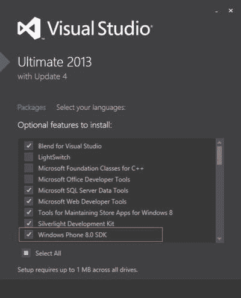

图 9-1。

Installing the Windows Phone SDK with Visual Studio 2013

### 多分辨率支持

如今市场上的 Windows Phone 设备种类繁多。诺基亚 Lumia 设备是市场上最受欢迎的。提供了从高端平板电脑到普通低端设备的各种手持设备。作为一名 Windows Phone 开发人员，您需要设计您的应用来支持不同的屏幕大小和分辨率，以确保它能够在多种设备上正常呈现。当以纵向模式显示时，您的应用必须支持最小 384 像素的屏幕宽度，当以横向模式显示时，必须支持最小 640 像素的屏幕宽度。我们将在本章后面的“页面方向”部分讨论如何配置您的应用以支持纵向和横向模式。

表 [9-1](#Tab1) 列出了 Windows Phone 8.1 SDK 中可用的模拟器图像的屏幕分辨率。

表 9-1。

Windows Phone 8.1 Emulator Resolutions and Aspect Ratio

<colgroup><col> <col> <col> <col> <col></colgroup> 
| 解决 | 像素分辨率 | 每个视图像素的原始像素 | 显示分辨率 | 长宽比 |
| --- | --- | --- | --- | --- |
| WVGA(消歧义) | 400×667 | One point two | 480×800 | 15:9 |
| 类型 | 384×640 | Two | 768×1280 | 15:9 |
| 720p | 400×711 | One point eight | 720×1280 | 16:9 |
| 1080p | 450×800 491×873 | 2.4 2.2 | 1080×1920 1080×1920 | 16:9 16:9 |

要确定设备的分辨率和当前方向，您可以使用来自`Windows.Graphics.Display`名称空间的`DisplayInformation`类，该类公开事件以允许您监视显示中的变化。它还包括只读属性，这些属性提供诸如每逻辑英寸的像素数、沿显示屏的 x 轴和 y 轴每英寸的原始点数、每个布局像素的物理像素数以及当前设备方向等信息。您可以使用这些信息来收集运行应用的设备的相关信息。清单 [9-1](#FPar1) 提供了一个代码示例，它使用`RawPixelsPerViewPixel`作为当前应用窗口的高度和宽度度量的乘数来计算设备的显示分辨率。清单 9-2 展示了在屏幕上显示测量结果所需的 XAML 标记。

Listing 9-1\. Calculate the Device’s Display Resolution

`using System;`

`...`

`using Windows.UI.Xaml;`

`using Windows.UI.Xaml.Controls;`

`using Windows.UI.Xaml.Navigation;`

`using Windows.Graphics.Display;`

`namespace ResolutionDemo`

`{`

`...`

`protected override void OnNavigatedTo(NavigationEventArgs e)`

`{`

`DisplayInformation info = DisplayInformation.GetForCurrentView();`

`double scaleFactor = info.RawPixelsPerViewPixel;`

`//calculate the display resolution`

`double displayResolutionWidth = Window.Current.Bounds.Width * scaleFactor;`

`double displayResolutionHeight = Window.Current.Bounds.Height * scaleFactor;`

`pixelResolution.Text = string.Format("Pixel resolution: {0}x{1}",`

`Window.Current.Bounds.Width, Window.Current.Bounds.Height);`

`displayResolution.Text = string.Format("Display resolution: {0}x{1}",`

`displayResolutionWidth, displayResolutionHeight);`

`}`

`}`

`}`

Listing 9-2\. Sample XAML Markup to Show Resolution Comparison

`<Page`

`x:Class="ResolutionDemo.MainPage"`

`xmlns="`[`http://schemas.microsoft.com/winfx/2006/xaml/presentation`](http://schemas.microsoft.com/winfx/2006/xaml/presentation)T2】

`xmlns:x="`[`http://schemas.microsoft.com/winfx/2006/xaml`](http://schemas.microsoft.com/winfx/2006/xaml)T2】

`Background="{ThemeResource ApplicationPageBackgroundThemeBrush}">`

`<Page.Resources>`

``

`</Page.Resources>`

`<Grid x:Name="mainGrid">`

`<Grid.RowDefinitions>`

`<RowDefinition Height="Auto" />`

`<RowDefinition Height="Auto" />`

`<RowDefinition Height="Auto" />`

`</Grid.RowDefinitions>`

`<TextBlock x:Name="pixelResolution" />`

`<TextBlock x:Name="displayResolution" Grid.Row="1" />`

`<StackPanel Orientation="Horizontal"`

`Grid.Row="2">`

`<TextBlock Text="Grid Actual Width: " />`

`<TextBlock x:Name="gridWidthDetails"`

`Text="{Binding Path=ActualWidth, ElementName=mainGrid}" />`

`</StackPanel>`

`</Grid>`

`</Page>`

将此代码部署到 WXGA 4.5 英寸仿真器会产生如图 [9-2](#Fig2) 所示的显示。

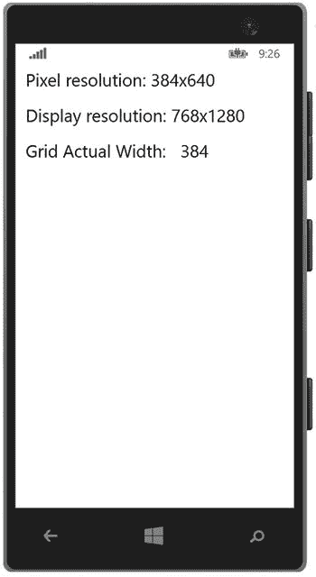

图 9-2。

The device’s resolution information is displayed in the WVGA 4.5-inch emulator

请注意，页面上控件的实际宽度基于像素分辨率。你不应该太在意每个设备的像素尺寸，因为在设计你的页面时不应该使用固定的尺寸。

### 缩放比例

如果你依赖于固定的度量，你会注意到应用中的控件在一种分辨率下可能表现得很好，但在另一种分辨率下可能会显得太小或太大。通过使用动态布局并允许 Windows 运行时系统处理页面中元素的组织方式，它可以确保您的应用在不同设备上看起来一致，而不管屏幕的像素密度如何。

在 Windows Phone 应用中，系统将根据以下比例因子自动缩放 UI 元素:

*   1.0:100%，无缩放
*   1.4:140%的缩放比例
*   2.4:240%的缩放比例

系统根据设备的物理屏幕大小、屏幕分辨率、屏幕 DPI 和外形来确定要使用的比例因子。注意，在清单 [9-1](#FPar1) 中，我们使用了`DisplayInformation`类的`RawPixelsPerViewPixel`属性来确定比例因子。

虽然 Windows 系统可以自动处理缩放，但是在应用中包含图像时，您应该采取一些措施。首先，尽可能使用矢量图形，因为它们可以很好地放大或缩小。如果您需要使用位图图像，请将它们作为资源添加到您的应用中，并为每个缩放因子提供一个单独的图像。

应用将根据设备的比例因子自动加载适当的图像。因此，对于项目中包含的每个原始图像，也要确保在应用中提供按原始图像大小的 140%和 240%缩放的图像。这些图像必须添加到应用的同一个文件夹中，并且应该遵循命名约定:`name.scale-scalefactor.ext`。图 9-3 说明了这种命名惯例。

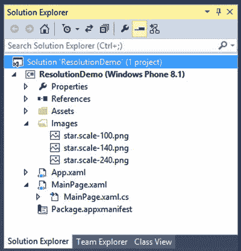

图 9-3。

Including images to support multiple scale factors

在您的 XAML 中，您可以简单地引用如下图像:`<Image Source="img/.png" />`

Windows Phone 将根据其根据当前设备确定要使用的比例因子来检索适当的图像。

在每个模拟器中运行应用。您应该会注意到类似于图 [9-4](#Fig4) 所示的结果。

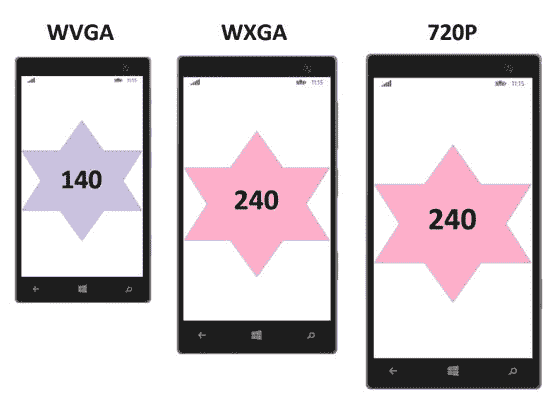

图 9-4。

Star image automatically loaded by Windows based on the scale factor Tip

注意在图 [9-4](#Fig4) 中，原始图像`star.scale-100.png`没有显示。Windows Phone 8.1 模拟器仅提供比例因子大于 1.0 的图像，因此在模拟器中测试时，您将看不到原始图像。

如前所述，Windows 系统根据当前设备的各种属性确定要使用的比例因子，并加载基于计算出的比例因子阈值的图像。当使用文件的基本名称(不包括比例因子)引用来自 XAML 的图像时，只要遵循本节前面讨论的文件命名约定，Windows 就会找到所需的文件。

尽管 XAML 可以轻松处理文件加载，但您可能会遇到需要从代码隐藏文件中手动加载位图图像的情况。在这种情况下，使用`RawPixelsPerViewPixel`属性来确定基于比例因子计算加载哪个位图图像:`RawPixelsPerViewPixel * 100`。在 Windows Phone 上，只有三个比例因子需要考虑，所以决定加载哪个图像只需要几行代码，如清单 [9-3](#FPar3) 所示。

Listing 9-3\. Load a Bitmap Based on the Device’s Scale Factor

`using System;`

`...`

`using Windows.UI.Xaml;`

`using Windows.UI.Xaml.Controls;`

`using Windows.UI.Xaml.Navigation;`

`using Windows.Graphics.Display;`

`namespace ResolutionDemo`

`{`

`...`

`protected override void OnNavigatedTo(NavigationEventArgs e)`

`{`

`DisplayInformation info = DisplayInformation.GetForCurrentView();`

`double scaleFactor = info.RawPixelsPerViewPixel * 100;`

`string selectedScaleFactor = (scaleFactor <= 100) ? "100" :`

`(scaleFactor <= 140) ? "140" :`

`"240";`

`string imageUriString = string.Format(@"ms-appx:img/.scale-{0}.png", selectedScaleFactor);`

`Uri selectedImageUri = new Uri(imageUriString, UriKind.RelativeOrAbsolute);`

`BitmapImage bmpImage = new BitmapImage(selectedImageUri);`

`MyImage.Source = bmpImage;`

`}`

`}`

`}`

在各种仿真器配置中运行应用。结果应该与图 [9-4](#Fig4) 中描述的结果相匹配。

如前所述，Windows Phone 8.1 模拟器只提供比例因子大于 1.0 的图像。但是，有些 Windows Phone 设备的比例因子将为 1.0(特别是对于那些购买了 Windows Phone 8.0 设备并在 Windows Phone 8.1 可用时将其操作系统升级到 Windows Phone 8.1 的用户)。如果您将应用的用户界面设计为在最低屏幕分辨率为 384×640 的设备上正常显示，并提供以前面讨论的三个比例因子呈现的图像，那么您将确保 Windows 系统在更高分辨率的设备上相应地放大，并且您的 UI 在不同设备上的外观和行为将保持一致。

## 主题、资源和样式

Windows Phone 系统使用主题来控制系统应用和第三方应用的视觉表示。主题由一组定义可视元素如何在设备上显示的资源组成，并且由页面和 UI 控件的预定义设置组成，例如背景色、强调色、字体样式和字体大小。

### 背景和强调颜色

Windows Phone SDK 提供了两种背景色主题:深色模式和浅色模式。深色主题模式显示黑色背景，而浅色主题模式显示白色背景。

深色和浅色主题模式下有 20 种强调色，如图 [9-5](#Fig5) 所示。

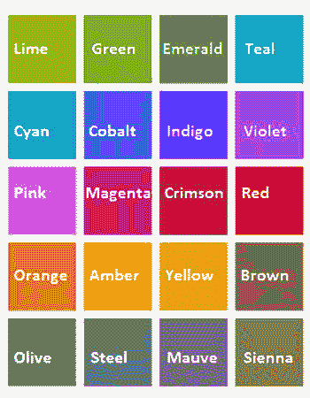

图 9-5。

Accent colors available in Windows Phone 8.1

要在 Windows Phone 上配置您的主题，请启动设置应用，并从列表中选择开始+主题项目。图 [9-6](#Fig6) 描绘了开始+主题屏幕，其中包含背景和强调颜色设置的选择列表。

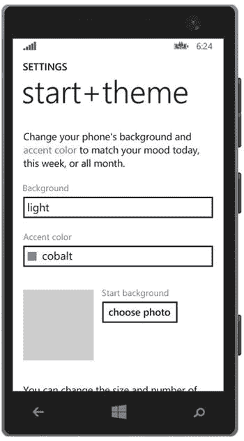

图 9-6。

Windows Phone devices run in Dark or Light theme modes, along with a configured accent color

Windows Phone 上的主题对您很重要的原因是，您可能开发的任何 Windows Phone 应用都将默认自动继承设备的选定主题，除非您用自己的主题覆盖默认主题。但是，理解主题是如何工作的，并确保您的应用在设置为深色或浅色主题模式的设备上运行时具有明显的吸引力，这仍然很重要。

避免将字体文本颜色明确配置为使用白色或黑色；否则，当设备主题改变时，您将面临字体在相同颜色背景下消失的风险。相反，可以利用 Windows Phone 的预定义资源来配置应用中可视元素的样式。

### 主题资源

Windows Phone SDK 提供了多个预定义主题资源集合，您可以在设计应用样式时利用这些资源。当配置元素使用主题资源时，您可以确保应用的样式将与设备当前配置运行的当前主题相关联。

画笔资源可用于定义 Windows Phone 应用中使用的标准颜色主题。最好使用画笔资源，而不是特定的颜色，以确保您的应用适应用户应用的任何主题更改。例如，使用预定义的主题资源来设置字体颜色可以确保颜色不会被当前的背景主题冲掉。在深色主题模式下，字体颜色将设置为白色，而在浅色主题模式下，颜色将设置为黑色。表 [9-2](#Tab2) 列出了 Windows Phone 上可用的`SolidColorBrush`资源。

表 9-2。

SolidColorBrush Resources

<colgroup><col> <col></colgroup> 
| 名字 | 描述 |
| --- | --- |
| `PhoneAccentBrush` | `SolidColorBrush`前景色 |
| `PhoneForegroundBrush` | `SolidColorBrush`前景色和边框颜色 |
| `PhoneBackgroundBrush` | `SolidColorBrush`页面和控件的默认背景色 |
| `PhoneContrastBackgroundBrush` | `SolidColorBrush`用于对比元素的背景色 |
| `PhoneContrastForegroundBrush` | `SolidColorBrush`用于对比元素的前景色 |
| `PhoneDisabledBrush` | `SolidColorBrush`用于禁用的前景和边框颜色 |
| `PhoneSubtleBrush` | 微妙的前景和边框颜色画笔 |
| `TransparentBrush` | 在应用此画笔的元素上提供透明背景 |
| `PhoneSemitransparentBrush` | 提供部分透明的背景笔刷 |
| `PhoneChromeBrush` | `SolidColorBrush`用于匹配当前主题中的应用栏背景 |

如果您需要一个返回`Color`而不是`SolidColorBrush`类型的资源类型，那么与可用的`Brush`资源一致的`Color`资源是可用的，比如`PhoneBackgroundColor`、`PhoneForegroundColor`、`PhoneDisabledColor`等等。

要在 XAML 标记中引用主题资源，请将属性的值设置为名为`ThemeResource`的，如下所示:

`<object Property="{ThemeResource NamedResource}" />`

例如，要将`TextBlock`上的`Foreground`颜色设置为设备的强调颜色，请将以下标记添加到您的页面:

`<TextBlock Foreground="{ThemeResource PhoneAccentBrush}" />`

如表 [9-3](#Tab3) 所列，字体资源定义了您可以在应用中利用的字体样式和大小。

表 9-3。

Font Size Resources

<colgroup><col> <col></colgroup> 
| 名字 | 价值 |
| --- | --- |
| `TextStyleSmallFontSize` | Ten point six five nine |
| `TextStyleMediumFontSize` | Sixteen |
| `TextStyleLargeFontSize` | Eighteen point one three nine |
| `TextStyleExtraLargeFontSize` | Twenty-five point five |
| `TextStyleExtraLargePlusFontSize` | Twenty-nine point eight six |
| `TextStyleExtraExtraLargeFontSize` | Thirty-four point one three nine |

类似于`Brush`资源，配置`TextBlock`元素的`FontSize`以使用命名的`ThemeResource`:

`<TextBlock FontSize="{ThemeResource TextStyleMediumFontSize}" />`

### 预定义样式

与预定义的资源类似，Windows Phone SDK 提供了预定义的样式，您可以使用这些样式来保持应用中所有`TextBlock`控件的一致外观。向 Windows Phone 8.1 应用添加页面时，`Page`背景默认配置为使用`ApplicationBackground`主题资源:

`<Page Background="{ThemeResource  ApplicationPageBackgroundThemeBrush}">`

您可以在 MSDN 网站上找到适用于您的 Windows Phone 8.1 应用的 XAML 主题资源的完整列表: [`http://bitly.com/XAMLThemeResources`](http://bitly.com/XAMLThemeResources) 。

## 应用架构

设计 Windows Phone 商店应用时，了解应用体系结构非常重要。与 WPF 应用类似，Windows Phone 应用的起点是`Application`类，它决定了启动时将加载的页面，包含共享资源和属性，并允许您覆盖或注册应用生命周期事件，以便在应用启动、激活、挂起或从挂起状态恢复时处理自定义行为。表 [9-4](#Tab4) 描述了这些关键事件。

表 9-4。

The Main Application Life-Cycle Events on Windows Phone

<colgroup><col> <col> <col></colgroup> 
| 生命周期事件 | 覆盖事件 | 描述 |
| --- | --- | --- |
| 发射 | 覆盖事件是`OnLaunched`。 | Windows Phone 生成样板代码来处理此事件。您必须保持代码完整无缺；但是，您可以在此事件中包含其他代码逻辑。`LaunchActivatedEventArgs`参数被传递到该事件中，该事件提供有用的信息，例如应用是如何启动的、用户点击以启动应用的`TileId`(如果适用)以及应用的先前执行状态。 |
| 激活的 | 覆盖事件是`OnActivated`。 | 如果要执行自定义操作，如更新和显示应用停用时用户可能错过的任何通知，请重写此事件。 |
| 悬浮 | 没有超驰装置。您必须注册一个事件处理程序。这里有一个例子:`this.Suspending +=` `this.OnSuspending;` | 如果您需要将应用的状态(如用户数据)存储到持久存储中，请为`Suspending`事件注册一个事件处理程序。如果您的应用资源不足或在用户能够恢复应用之前关闭，操作系统可能会自动终止您的应用，因此必须及时存储应用数据，以确保用户在返回您的应用时不会丢失数据。 |
| 重新开始 | 没有超驰装置。您必须注册一个事件处理程序。这里有一个例子:`this.Resuming +=` `this.OnResuming;` | 如果您需要从应用挂起时缓存的数据中恢复应用的状态，请为`Resuming`事件注册一个事件处理程序。 |

### 页面方向

Windows Phone 使您能够设计您的页面，以便可以在纵向和/或横向模式下查看它们。只要您确保您的布局是动态的，当方向改变时，您的 UI 将根据基于新方向的改变的高度和宽度尺寸进行调整。

在 Windows Phone Store 应用中，您可以在名为`Package.appxmanifest`的应用包清单的应用选项卡中设置支持的方向。在 Visual Studio 解决方案资源管理器中双击包清单。您应该会看到类似于图 [9-7](#Fig7) 所示的视图。

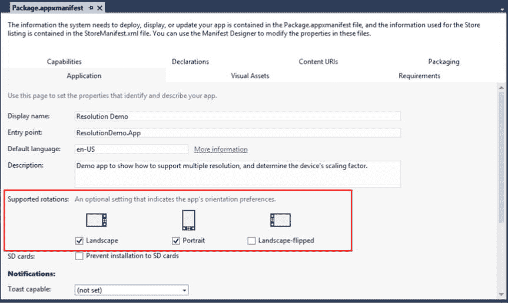

图 9-7。

Selecting the app’s supported screen orientations in the package manifest

包清单包含关于应用的元数据，包括应用的入口点，默认情况下是`Application`类。它还包括磁贴图像和应用徽标、应用将利用的设备特性或功能、设备必须支持应用才能正常工作的硬件，以及发布应用时将在 Windows Phone 商店中显示的包装详细信息。

您还可以通过确保选中每个支持的方向来选择您的应用将支持哪些方向，如图 [9-7](#Fig7) 所示。在包清单中配置应用的方向设置将确保应用中的所有页面都支持所选方向。

或者，您可能更喜欢从每个页面的代码隐藏中单独设置支持的方向。这种方法的优点是，通过设置`DisplayInformation`类的`AutoRotationPreferences`属性的值，您可以逐页将支持的方向设置为不同的值。

例如，假设您正在开发一款游戏，其中游戏主屏幕必须仅以横向模式运行，而应用的设置页面将仅以纵向模式显示。在您的`MainPage`中的`OnNavigatedTo`事件中，包含以下代码行以支持横向和横向翻转方向:`DisplayInformation.AutoRotationPreferences = DisplayOrientations.LandscapeFlipped | DisplayOrientations.Landscape;`

在您的`SettingsPage`中的`OnNavigatedTo`事件中，只需如下设置`AutoRotationPreferences`属性:

`DisplayInformation.AutoRotationPreferences = DisplayOrientations.Portrait;`

### 航行

在 Windows Phone 商店应用中，当导航到或离开页面时，您可以在每个页面中执行自定义逻辑。这可以通过在页面的代码隐藏文件中覆盖`OnNavigatedTo`和`OnNavigatedFrom`事件来实现。

当页面准备好在框架中显示时，触发`OnNavigatedTo`事件。当页面不再显示在框架中时，触发`OnNavigatedFrom`事件，因为应用正在框架中加载替代页面，或者因为应用即将被暂停。

在 Windows Phone 8.0 中，与触发页面导航的事件相关的信息将通过一个`NavigationEventArgs`对象传递给每个事件。如果您的应用是以主/从格式设计的，此信息可用于在下一个正在加载的页面中加载页面数据。此外，您可以利用导航事件来加载或保存页面状态。然而，在 Windows Phone 商店应用中，建议您利用`NavigationHelper`类来加载和保存页面和应用状态。当您在创建新的 Windows Phone 8.1 应用时选择 Pivot 或 Hub 模板时，或者当您使用`BasicPage`模板添加新页面时，会生成此类。

#### 导航助手

`NavigationHelper`类为导航以及页面和应用状态管理提供了事件处理程序。要访问页面中的`NavigationHelper`类，必须首先通过传入页面实例来初始化该类。

如果您想要管理页面或应用状态，那么您可以在页面的代码隐藏中连接`LoadState`和`SaveState`事件。当你使用`BasicPage`模板创建一个页面时，这个代码就会自动生成，如清单 [9-4](#FPar4) 所示。

Listing 9-4\. NavigationHelper Code That Is Generated When Creating a Page from the BasicPage Template

`public sealed partial class DetailsPage : Page`

`{`

`private NavigationHelper navigationHelper;`

`private ObservableDictionary defaultViewModel = new ObservableDictionary();`

`public DetailsPage()`

`{`

`this.InitializeComponent();`

`this.navigationHelper = new NavigationHelper(this);`

`this.navigationHelper.LoadState += this.NavigationHelper_LoadState;`

`this.navigationHelper.SaveState += this.NavigationHelper_SaveState;`

`}`

`public NavigationHelper NavigationHelper`

`{`

`get { return this.navigationHelper; }`

`}`

`private void NavigationHelper_LoadState(object sender, LoadStateEventArgs e)`

`{`

`}`

`private void NavigationHelper_SaveState(object sender, SaveStateEventArgs e)`

`{`

`}`

`#region NavigationHelper registration`

`protected override void OnNavigatedTo(NavigationEventArgs e)`

`{`

`this.navigationHelper.OnNavigatedTo(e);`

`}`

`protected override void OnNavigatedFrom(NavigationEventArgs e)`

`{`

`this.navigationHelper.OnNavigatedFrom(e);`

`}`

`#endregion`

`}`

当页面加载时，利用`NavigationHelper_LoadState`事件从您选择的数据存储位置检索应用状态，无论是本地存储、本地数据库还是云中。

当应用暂停或用户导航到另一个页面时，使用`NavigationHelper_SaveState`来存储任何临时 UI 数据，以便当用户导航回页面或恢复应用时，可以检索并加载到页面中。

#### 页面导航

即使是最简单的应用也可能需要页面导航到至少一个附加页面，即使只是为了加载用户的基本设置或支持页面。当从一个可用的内置模板开发 Windows Phone Store 应用时，在`App.xaml.cs`文件的`OnLaunched`事件中会为您生成启动主页的应用导航代码，如清单 [9-5](#FPar5) 所示。这是 Windows Phone 商店应用中导航处理方式的一个示例，也是您在管理任何其他页面的导航时将采用的方法。

Listing 9-5\. First Page Navigation in the Application’s OnLaunched Event

`Frame rootFrame = Window.Current.Content as Frame;`

…

`// When the navigation stack isn't restored navigate to the first page,`

`// configuring the new page by passing required information as a navigation`

`// parameter`

`if (!rootFrame.Navigate(typeof(MainPage), e.Arguments))`

`{`

`throw new Exception("Failed to create initial page");`

`}`

关于导航是如何处理的，你注意到了什么？似乎是框架而不是主窗口控制着导航。

Windows Phone 商店应用在单个窗口中运行。当应用启动时，会创建一个框架，并将其设置为窗口的内容，可以通过`Window.Current.Content`属性访问它。框架是页面的宿主容器，而不是窗口。这样，就是框架触发并跟踪页面之间的导航。要利用框架导航到特定页面，只需将`Window.Current.Content`属性转换为框架，然后调用`Navigate`方法，传入您想要加载的页面类型，如清单 [9-5](#FPar5) 所示。

当你需要传递信息到下一页时会发生什么？例如，如果您的主页显示一个项目列表，当用户点击一个项目时会发生什么？它是否会导航到包含所选项目的更多信息的详细页面？在这种情况下，您可以选择传递一个惟一的项目 ID，以便详细信息页面知道将哪个项目信息加载到页面中。您可以简单地将这些附加信息作为第二个参数传递给目标页面，如下所示:

`Frame.Navigate(typeof(DetailsPage), itemId);`

第二个参数需要一个对象类型，因此您不会受到要发送到下一页的数据的限制。现在，您已经将必要的信息传递给了详细信息页面，在下一个页面加载之前，如何接收和处理这些信息呢？如果您再看一下清单 [9-5](#FPar5) 中的代码，您将会看到框架正在将参数传递给`DetailsPage`，而后者又接收其`NavigationEventArgs`参数中的信息。然后将它传递给`NavigationHelperClass`中的`OnNavigatedTo`事件，这将触发目标页面中的`LoadState`事件。您的原始参数将被传递到`LoadStateEventArgs`对象中，您可以从它的`NavigationParameter`属性中检索它，如清单 [9-6](#FPar6) 所示。

Listing 9-6\. Retrieving the NavigationParameter Passed into the DetailsPage

`private void NavigationHelper_LoadState(object sender, LoadStateEventArgs e)`

`{`

`if (e.NavigationParameter != null)`

`{`

`int itemId = -1;`

`int.TryParse(e.NavigationParameter.ToString(), out itemId);`

`if (itemId > 0)`

`{`

`//then load your item's details`

`}`

`}`

`}`

#### 向后导航

当用户在应用中加载页面的历史记录中向后移动时，就会出现向后页面导航，类似于在浏览器窗口中点击后退按钮。Windows Phone 用户已经习惯的行为包括使用设备的 back 键浏览页面历史，这被称为 backstack。这与 Windows Phone 最初的设计原则有关。在 Windows Phone Silverlight 应用中，设备的 back 键将通过 backstack 导航。一旦进入主页，如果 backstack 中没有其他页面，点击 back 键将关闭应用，并使用户返回到另一个以前启动的应用或开始屏幕。

在 Windows Phone 商店应用中，这种情况已经发生了变化。默认情况下，设备的 back 键会关闭应用，即使 backstack 中有页面。因此，您首先需要重写此行为来检查 backstack 历史，然后在 backstack 中导航，而不是关闭应用。

如前所述，框架负责跟踪页面导航。框架将导航历史存储在它的`BackStack`属性中，该属性返回一个`PageStackEntry`对象列表。`PageStackEntry`列表由应用按照页面加载顺序加载的页面组成。要导航回应用中的上一页，您应该使用布尔属性`Frame.CanGoBack`检查 backstack 上是否有页面。如果它返回 true，则框架的`BackStack`中有页面条目，然后您可以通过调用框架上的`GoBack()`方法来启动向后导航。

下一步是在按下设备的硬件 back 键时包含此代码。您可以通过连接包含在`Windows.Phone.UI.Input`名称空间中的`HardwareButtons.BackPressed`事件来实现这一点。您可以在每个页面中注册这个事件，如清单 [9-7](#FPar7) 所示。

Listing 9-7\. Overriding the Keypress Event of the Device’s Back Button

`public DetailsPage ()`

`{`

`this.InitializeComponent();`

`Windows.Phone.UI.Input.HardwareButtons.BackPressed += OnHardButtonsBackPressed;`

`}`

`private void OnHardButtonsBackPressed(object sender, Windows.Phone.UI.Input.BackPressedEventArgs e)`

`{`

`if (this.Frame.CanGoBack)`

`{`

`e.Handled = true;`

`this.Frame.GoBack();`

`}`

`}`

一旦您手动处理向后导航，您必须通过设置`e.Handled = true`来取消默认的向后导航行为。这将确保您的应用不会意外关闭。

此外，如果应用中的页面显示一个弹出对话框，您也需要在您的`BackPressed`事件中对此进行说明。要包含的第一项检查将确定弹出对话框是否打开。如果是，第一次点击硬件返回键应该会关闭弹出窗口。然后，下一次点击硬件返回键应检查`BackStack`中是否有页面允许向后导航。如果是这样，那么它应该导航到上一页。最后，如果没有弹出对话框打开或者`BackStack`中没有任何页面，点击后退按钮将关闭应用。这个动作不需要代码，因为这是点击按钮时的默认行为。请确保仅当您由于点击按钮而执行某个操作时，才取消导航。如果前面两个条件都不满足，取消向后导航会导致用户被困在应用中，无处可去。这将确保您的应用在提交到 Windows Phone 商店时不会通过认证。

Tip

当使用 Pivot 或 Hub 模板创建 Windows Phone 商店应用时，您不需要手动处理设备 back 按钮的`BackPressed`事件，因为该代码已经绑定在一个`NavigationHelper`类中。它包括处理向后导航的命令，并为硬件的`BackPressed`事件提供了一个通用的覆盖。这是一个更简洁的实现，它使您不必在每个页面中编写相同的代码来手动管理`BackPressed`事件。

### 缓存页面

Windows Phone 商店应用现在包括导航时缓存页面的选项。这是使用每页上的`NavigationCacheMode`属性配置的，该属性接受以下枚举值之一:

*   `NavigationCacheMode.Disabled`:当导航到页面时，总是加载页面的新实例。
*   `NavigationCacheMode.Enabled`:页面被缓存，但如果超过缓存限制，页面可能会被破坏。
*   `NavigationCacheMode.Required`:页面缓存，用户导航到页面时加载缓存实例。

通过这种方式，您可以配置是在每次用户导航到页面时总是创建页面的新实例，还是将加载的页面实例保存在缓存中，然后在后续访问该页面时从缓存中加载。缓存页面将提高应用的性能。默认情况下，`NavigationCacheMode`被设置为`Disabled`。如果想利用页面缓存，需要在每个页面的构造函数中明确配置`NavigationCacheMode`。

## 模板

在 XAML 中，模板用于配置视图中的数据显示。使用模板的常见场景包括为项目集合设计显示。因为这些项可能是任何类型的对象，所以您需要告诉宿主容器要显示来自该对象的什么信息以及如何显示它。

### 模板

一个`DataTemplate`表示一个对象的可视显示，并且它支持数据绑定到包含在模板中的用户控件，如果控件暴露了要绑定的依赖属性。定义一个`DataTemplate`有多种方式。要在 XAML 定义一个`DataTemplate`，只需将所需内容包装在一个`DataTemplate`元素中，如下所示:

`<DataTemplate>`

`<StackPanel Orientation="Horizontal">`

`<Image Source="{Binding CompanyLogo}" />`

`<TextBox Text="{Binding CompanyName}" />`

`</StackPanel>`

`</DataTemplate>`

一个`DataTemplate`与一个`Page`相似，它期望一个单独的对象被设置为它的内容。因此，为了在一个`DataTemplate`中支持多个项目，您必须使用一个容器控件，比如一个`StackPanel`或`Grid`。`DataTemplate`的内容包含在名为`VisualTree`的属性中。

您可以在`App.xaml`文件中的应用资源字典或特定页面的资源字典中定义一个`DataTemplate`；但是，您必须为它分配一个唯一的键值。

`<DataTemplate x:Key="MyDataTemplate">`

现在您已经将`DataTemplate`定义为一个资源，它利用了数据绑定，您可能会问自己以下问题:

*   如何在视图中使用`DataTemplate`?
*   我在哪里设置`DataContext`以便`DataTemplate`知道从哪里检索数据绑定属性？
*   `DataTemplate`总是必须被定义为应用或页面资源吗？

好吧，回答第一个问题，基于集合的控件，比如`ComboBox`、`ListView`和`GridView`，能够利用`DataTemplate`，只要它被分配给控件的`ItemTemplate`属性。

我们将在下一节讨论第二个和第三个问题的答案，因为我们将详细讨论`ItemTemplate`属性。

### 模板列

显示项目列表的控件，如`ComboBox`、`ListView`和`GridView`控件，公开一个名为`ItemTemplate`的属性，用于设置和检索单个`DataTemplate`对象。分配给`ItemTemplate`属性的模板将应用于控件中显示的每个项目。

除了将其定义为页面或应用资源之外，配置`DataTemplate`的另一个选项是将其定义为 XAML 中控件的`ItemTemplate`属性的内容。例如，要为一个`ListView`配置`ItemTemplate`，您应该包括以下标记:

`<ListView ItemsSource="{Binding Companies}" >`

`<ListView.ItemTemplate>`

`<DataTemplate>`

`<StackPanel Orientation="Horizontal">`

`<Image Source="{Binding CompanyLogo}" />`

`<TextBox Text="{Binding CompanyName}" />`

`</StackPanel>`

`</DataTemplate>`

`</ListView.ItemTemplate>`

`</ListView>`

`GridView`或`ComboBox`的标记将是相似的，只是用所需控件的名称替换元素标签中的`ListView`。这样配置一个`DataTemplate`时，不需要在模板上设置 key，因为模板只适用于这个控件，不能被其他任何控件引用。

当在应用或页面资源字典中定义了`DataTemplate`时，您必须设置`ItemTemplate`属性，以使用模板的分配键来引用该资源，如下所示:

`<ListView ItemTemplate="{StaticResource MyDataTemplate}">`

正如前面提到的，数据模板支持数据绑定，但是模板如何知道数据来自哪里呢？列表项的对象充当绑定的`DataContext`。因此，当在`DataTemplate`中绑定属性时，它们必须映射到列表项中存在的属性；否则，在运行时会出现绑定错误，并且数据不会显示在列表中。

## 显示收藏

最常见的移动应用类型包括以某种方式、形状或形式显示和管理列表。您使用多少应用来处理数据收集？想到的热门应用包括 Twitter、脸书、Vine 和 SnapChat。然后是标准的实用程序，如电子邮件、地址簿和设备设置。所有这些应用都允许您查看和管理数据。

在 Windows Phone 商店应用中，您可以使用`ListView`或`GridView`控件来显示项目集合。要填充这些控件，请在 XAML 或代码隐藏中设置`ItemsSource`属性。在 XAML 中，您可以使用数据绑定将控件的`ItemsSource`设置为一个静态集合，该集合被定义为页面中的一个资源。这里有一个例子:

`<ListView ItemsSource="{StaticResource Companies}">`

但是，在大多数情况下，当用户打开应用时，集合会发生变化。可以通过用户交互来添加、删除或修改项目，可以从 web 服务接收应用更新，或者两者兼有。在这种情况下，您良好的 MVVM 实践将派上用场，使这项任务的短期工作。只需在为视图创建的视图模型中添加一个`ObservableCollection`，并将集合绑定到`ItemsSource`属性，如下所示:

`<ListView ItemsSource="{Binding Companies}">`

正如本章前面的“模板”一节所提到的，默认情况下，`ListView`或`GridView`中显示的每个项目都将使用`ItemsSource`集合作为`DataContext`。只要在控件的`DataTemplate`中定义的控件被配置为绑定到集合项的类型所公开的属性，那么数据将流向 UI，并按预期填充基于集合的控件。

### 列表视图

一个`ListView`用于在一个垂直的滚动列表中显示项目。通常，列表被配置成使得当用户点击项目时，应用导航到细节页面以显示关于所选项目的更多信息。图 [9-8](#Fig8) 描述了一个在应用主页中使用`ListView`控件来显示公司列表的例子。

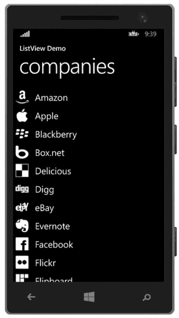

图 9-8。

Items within the ListView control are displayed as a vertical, scrolling list

请注意，`ListView`项由控件的组合组成，使用了一个`ItemTemplate`，如前一节所述。这使您能够通过以独特的方式显示数据，合并图像、文本和任何其他控件来显示项目信息，从而设计出具有视觉吸引力的项目。

可以使用`SelectionMode`属性配置`ListView`控件的选择行为，该属性可以设置为以下枚举值之一:

*   `Single`:当用户轻击项目时，选择单个项目。`SelectionMode`默认设置为`Single`。
*   `Multiple`:在列表中的每个项目旁边显示一个复选框，可以多选。用户必须在每个感兴趣的项目旁边打上复选标记。
*   `None`:未启用项目选择。

当点击列表中的一个项目时，只要其`SelectionMode`设置为`Single`或`Multiple`，就会触发`ListView`的`SelectionChanged`事件。可以为该事件绑定一个处理程序，以提供基于列表项选择的自定义逻辑，例如导航到另一个页面。这可以在 XAML 中通过将`SelectionChanged`属性设置为事件处理程序的名称来实现。这里有一个例子:

`<ListView x:Name="CompanyListView" SelectionChanged="OnListViewSelectionChanged">.`

或者，您可以在页面的代码隐藏中注册该事件，如下所示:

`CompanyListView.SelectionChanged += OnListViewSelectionChanged;`

`SelectionChanged`事件需要两个参数:一个表示发送者的对象和事件参数类型`SelectionChangedEventArgs`。因为您将事件处理程序命名为`OnListViewSelectionChanged`，所以您需要在代码隐藏中添加以下处理程序。

`private void OnListViewSelectionChanged(object sender, SelectionChangedEventArgs e)`

`{`

`}`

`SelectionChangedEventArgs`公开了两个感兴趣的属性:`AddedItems`和`RemovedItems`。`AddedItems`集合包含用户在`ListView`中选择的项目。`RemovedItems`收藏包含被取消选择的项目。

或者，您可以通过在单选模式下运行时检查`ListView`的`SelectedItem`属性或者在多选模式下运行时检查`SelectedItems`集合来确定选择了哪个项目。让我们来看看这一切是如何结合在一起的。

清单 [9-8](#FPar8) 展示了一个在 XAML 标记中连接`ListView`控件上的`SelectionChanged`事件的例子。注意，您没有指定一个`SelectionMode`。在这种情况下，`ListView`将默认启用单项选择。

Listing 9-8\. Configuring the SelectionChanged Event in the ListView to Capture When an Item Selection Occurs

`<ListView x:Name="CompanyListView"`

`ItemsSource="{Binding Companies}"`

`SelectionChanged="OnListViewSelectionChanged">`

`<ListView.ItemTemplate>`

`<DataTemplate>`

`<StackPanel Orientation="Horizontal">`

`<Image Source="{Binding LogoImagePath}" />`

`<TextBlock Text="{Binding CompanyName}"`

`VerticalAlignment="Center"`

`Margin="10,0,0,0"`

`FontSize="{StaticResource TextStyleLargeFontSize}" />`

`</StackPanel>`

`</DataTemplate>`

`</ListView.ItemTemplate>`

`</ListView>`

按照 XAML 标记中显示的例子，将`ListView`控件的`ItemsSource`设置为`ObservableCollection`，其中列表中的每一项都代表一个`Company`模型。设计`ItemTemplate`展示公司的标志和名称。`Company`模型定义如下:

`public class Company`

`{`

`public string CompanyName { get; set; }`

`public string LogoImagePath { get; set; }`

`public string Headquarters { get; set; }`

`public int YearFounded { get; set; }`

`}`

接下来，您需要向添加到代码隐藏中的自定义事件处理程序添加一些逻辑。在本例中，当点击列表中的某个项目时，您只想导航到详细信息页面。为此，请向项目添加一个页面，该页面将用于显示有关选定项的附加信息。正如在本章前面的“页面导航”一节中提到的，在向项目中添加新页面时使用`BasicPage`模板，这样也可以生成导航助手方法。在这个名为`DetailsPage`的新页面中，包含 XAML 标记来显示公司名称、徽标和公司的其他详细信息。清单 [9-9](#FPar9) 描述了实现这一点的示例 XAML 标记，以及一些基本的样式和间距，以提供一个干净、优雅的外观。

Listing 9-9\. Details Page Containing Markup to Display Additional Company Information

`<Page`

`x:Class="ListViewDemo.DetailsPage"`

`xmlns="`[`http://schemas.microsoft.com/winfx/2006/xaml/presentation`](http://schemas.microsoft.com/winfx/2006/xaml/presentation)T2】

`xmlns:x="`[`http://schemas.microsoft.com/winfx/2006/xaml`](http://schemas.microsoft.com/winfx/2006/xaml)T2】

`xmlns:d="`[`http://schemas.microsoft.com/expression/blend/2008`](http://schemas.microsoft.com/expression/blend/2008)T2】

`xmlns:mc="`[`http://schemas.openxmlformats.org/markup-compatibility/2006`](http://schemas.openxmlformats.org/markup-compatibility/2006)T2】

`mc:Ignorable="d"`

`Background="{ThemeResource ApplicationPageBackgroundThemeBrush}">`

`<Page.Resources>`

``

`</Page.Resources>`

`<Grid x:Name="LayoutRoot"`

data context = " { Binding selected company } "`>`

`<Grid.ChildrenTransitions>`

`<TransitionCollection>`

`<EntranceThemeTransition/>`

`</TransitionCollection>`

`</Grid.ChildrenTransitions>`

`<Grid.RowDefinitions>`

`<RowDefinition Height="Auto"/>`

`<RowDefinition Height="*"/>`

`</Grid.RowDefinitions>`

`<StackPanel Grid.Row="0" Margin="19,0,0,0" Orientation="Horizontal">`

`<Image Source="{Binding LogoImagePath}"`

`VerticalAlignment="Center"/>`

`<TextBlock Text="{Binding CompanyName}"`

`VerticalAlignment="Center"`

`Margin="10,0"`

`Style="{ThemeResource HeaderTextBlockStyle}"`

`CharacterSpacing="{ThemeResource PivotHeaderItemCharacterSpacing}"/>`

`</StackPanel>`

`<Grid Grid.Row="1"`

`x:Name="ContentRoot"`

`Margin="19,30,19,0">`

`<Grid.RowDefinitions>`

`<RowDefinition Height="Auto"/>`

`<RowDefinition Height="Auto" />`

`</Grid.RowDefinitions>`

`<Grid.ColumnDefinitions>`

`<ColumnDefinition Width="Auto"/>`

`<ColumnDefinition/>`

`</Grid.ColumnDefinitions>`

`<TextBlock Text="Founded:" />`

`<TextBlock Text="{Binding YearFounded}"`

`Grid.Column="1" />`

`<TextBlock Text="Headquarters:"`

`Grid.Row="1" />`

`<TextBlock Text="{Binding Headquarters}"`

`TextWrapping="Wrap"`

`Grid.Row="1"`

`Grid.Column="1" />`

`</Grid>`

`</Grid>`

`</Page>`

注意，`LayoutRoot Grid`的`DataContext`被设置为一个`SelectedCompany`属性。理想情况下，您将为`DetailsPage`创建一个`ViewModel`，它公开这个属性。接下来，您需要将`ViewModel`的`SelectedCompany`属性设置为用户点击`MainPage`的公司。为了实现这一点，你需要确保你将所选择的公司传递给`DetailsPage`。

在`MainPage`代码隐藏中，在`OnListViewSelectionChanged`事件处理程序中，添加代码来检查`ListView`控件上的`SelectedItem`属性，并导航到将所选的`Company`作为参数传递给二级页面的`DetailsPage`，如清单 [9-10](#FPar10) 所示。

Listing 9-10\. Modifying the SelectionChanged Event Handler to Navigate to the DetailsPage When a ListView Item Is Tapped

`private void OnListViewSelectionChanged(object sender, SelectionChangedEventArgs e)`

`{`

`if (CompanyView.SelectedItem != null)`

`{`

`this.Frame.Navigate(typeof (DetailsPage), CompanyView.SelectedItem);`

`}`

`}`

最后，在`DetailsPage`的`NavigationHelper_LoadState`中，从`LoadStateEventArgs.NavigationParameter`属性中检索选中的`Company`对象，并将其设置为`ViewModel`的`SelectedCompany`属性，如清单 [9-11](#FPar11) 所示。

Listing 9-11\. Set the DataContext of the DetailsPage to the Selected Company

`private DetailsViewModel viewModel = new DetailsViewModel();`

`private void NavigationHelper_LoadState(object sender, LoadStateEventArgs e)`

`{`

`Company selectedCompany = e.NavigationParameter as Company;`

`if (selectedCompany != null)`

`{`

`viewModel.SelectedCompany = selectedCompany;`

`}`

`this.DataContext = viewModel;`

`}`

运行应用，点击列表中的一个项目以查看关于该公司的其他详细信息，如图 [9-9](#Fig9) 所示。

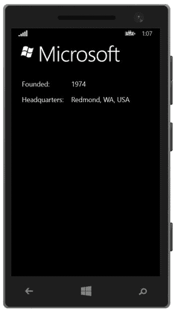

图 9-9。

Navigating to a details page containing more information about the company that was tapped in the ListView

### 显示数据表格（一种控件）

`GridView`类似于`ListView`，除了它以网格而不是列表的形式呈现项目。集合中的项水平显示，并换行到下一行。它的行为类似于第 8 章[中“容器控件”一节中讨论的`WrapPanel`控件`GridView`适用于显示图库或创建 cardview 风格的布局。](08.html)

`GridView`与`ListView`控件共享许多相同的属性和事件，因为这两个项目都来自同一个类型:`ListViewBase`。在`ListView`演示中，我们引用了在`GridView`中也可用的属性和事件。我们可以将`MainPage`上的元素标记改为引用`GridView`而不是`ListView`，并运行它而不出错。如图 [9-10](#Fig10) 所示，显示屏可能不那么吸引人，但它仍然有效。

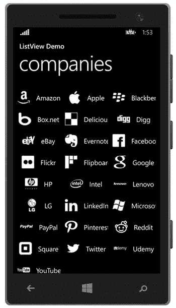

图 9-10。

Modified MainPage to render the collection in a GridView control

在`ItemTemplate`中为`ListView`控件定义的布局在`GridView`中使用时看起来并不吸引人。让我们更改它，以便只显示公司徽标。从`GridView`的`ItemTemplate`标记中删除`TextBlock`，并在`StackPanel`上添加一个`Margin`，以提供每个公司徽标之间的适当间距，如下所示:

`<GridView.ItemTemplate>`

`<DataTemplate>`

`<StackPanel Margin="5,10,0,0">`

`<Image Source="{Binding LogoImagePath}"`

`Stretch="None"/>`

`</StackPanel>`

`</DataTemplate>`

`</GridView.ItemTemplate>`

运行应用。对`MainPage`的更改应该出现，如图 [9-11](#Fig11) 所示。

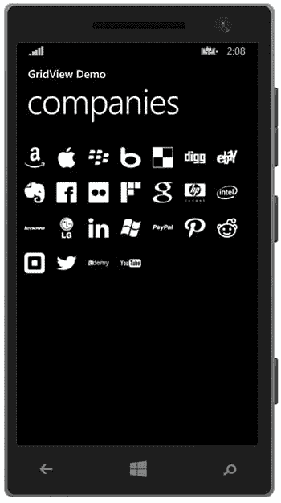

图 9-11。

Modifying the ItemTemplate within the GridView to display company logos only

显示`MainPage`后，点击`GridView`中的一个项目，导航至`DetailsPage`。它不需要任何额外的代码更改就可以工作。处理`SelectionChanged`事件的实现细节与我们为`ListView`控件演示的没有什么不同。

## 演示控制

在第 8 章中，我们讨论了各种容器控件，你可以利用它们来管理用户控件在视图中的布局。在 Windows Phone 8.1 中，许多容器控件都是可用的，包括`StackPanel`、`Grid`和`Canvas`等等。您在第 8 章中获得的关于这些控件的所有知识都可以转移到 Windows Phone 上，因为标记和行为是相同的。在本章中，我们将重点介绍 Windows Phone 8.1 中可用的各种内容呈现控件。

表示控件是容器控件的另一种形式。与标准容器控件的区别在于，用于在单个页面中排列 UI 控件的方法对用户是透明的。你的用户不在乎你是否使用了一个`StackPanel`而不是一个`Grid`，为什么他们会在乎呢？只要他们能在你的应用中做他们需要做的任何事情，那就是最重要的，五星评论就会随之而来，对吗？不完全是。

你真的必须给你的用户留下深刻印象，并在你的应用中给他们提供一个很好的体验。演示控件将帮助您做到这一点。它们是一组高级控件，为用户与应用的交互方式定下基调。但是，只有在有意义的时候才应该使用它们，例如对于提供多个部分或数据列表的应用，以及当您希望以一种吸引人的、易于导航的布局来呈现数据时。对于应用，如游戏或简单的实用程序，这些控件将不是必需的。

### 中心

集线器控件用于显示一系列包含数据或控件的部分。用户可以通过从一侧平移到另一侧来查看各个部分。在 Windows Phone 8.0 中，这被称为全景控件。Hub 控件中定义的可视元素超出了屏幕宽度的界限，因此当用户向左或向右滑动时，感觉就像没有离开主页一样。他们只是转移他们的视线来看屏幕外的项目。

背景图像、数据覆盖和中枢控件内的内置动画的分层效果在扫视各部分时提供了吸引人的视觉用户体验，使用户有在杂志页面上滚动的感觉。

由于中枢控件的主要目的是允许用户在视图中左右移动，因此该控件仅在纵向模式下受支持。

集线器控制由以下主要元素组成:

*   背景图像:在集线器控件上设置背景图像是可选的。然而，这是增加该控件视觉吸引力的一个主要方面。
*   Hub header:由代表应用的纯文本和/或图像组成。例如，使用与应用磁贴上显示的图像相匹配的图像。理想情况下，标题将使用户能够容易地识别他们正在使用的应用。
*   集线器部分:这包含逻辑分组中的控件或附加数据。例如，一个中心部分可能包含一组图像，而另一个部分由来自社交媒体源的状态更新组成。集线器控制器可以由一个或多个集线器部分组成；但是，出于性能原因和最佳用户体验，不要超过五个部分。
*   集线器节标题:不要求包含节标题。如果指定了标题，请确保它用一个单词或短语描述了该部分的意图。
*   缩略图:这些可以用作导航源，在二级页面上显示附加数据或媒体。

让我们来看看一个实际的中枢控制。启动 Visual Studio 新建一个项目，选择 Hub App (Windows Phone)模板，如图 [9-12](#Fig12) 所示。

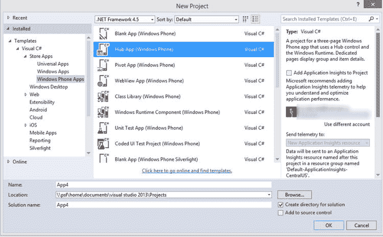

图 9-12。

Creating a new Hub app using the Visual Studio template

一旦项目加载到 Visual Studio 中，花点时间检查一下在`HubPage.xaml`文件中生成的 XAML，如清单 [9-12](#FPar12) 所示。

Listing 9-12\. Markup Generated for the Windows Phone Hub Page

`<Hub x:Name="Hub"`

`x:Uid="Hub"`

`Header="application name"`

`Background="{ThemeResource HubBackgroundImageBrush}">`

`<HubSection x:Uid="HubSection1"`

`Header="SECTION 1"`

`DataContext="{Binding Groups}"`

`HeaderTemplate="{ThemeResource HubSectionHeaderTemplate}">`

`<DataTemplate>`

`...`

`</DataTemplate>`

`</HubSection>`

`<HubSection x:Uid="HubSection2"`

`Header="SECTION 2"`

`DataContext="{Binding Groups}"`

`HeaderTemplate="{ThemeResource HubSectionHeaderTemplate}">`

`<DataTemplate>`

`...`

`</DataTemplate>`

`</HubSection>`

`...`

`</Hub>`

Hub 模板提供了一个现成的工作示例。为了提供不同布局的示例，您可以在自己的应用的每个部分中实现它。运行应用，从左向右滑动以浏览各个部分。图 [9-13](#Fig13) 显示了查看每个可用部分时您将看到的视图。

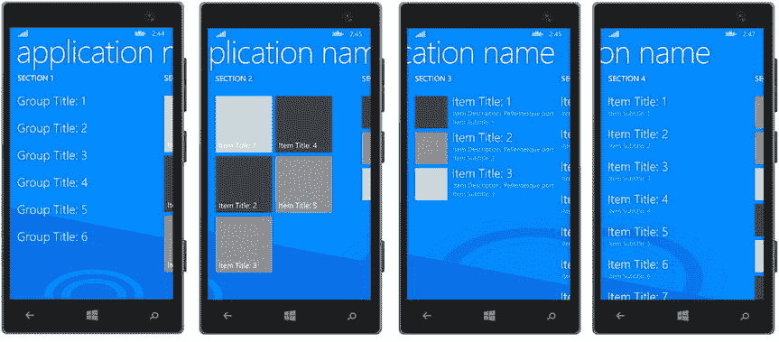

图 9-13。

The Hub control provides an appealing panning effect when swiping across to view the hub sections

每个 Hub 部分使用一个`DataTemplate`来配置部分的外观、布局和 UI 控件。在每个部分中，您可以根据需要布置 UI 元素，利用`ListView`或`GridView`控件来托管项目集合，并连接`SelectionChanged`事件来触发到补充详细信息页面的导航，正如我们在上一部分中所讨论的。

### 在枢轴上转动

Windows Phone 透视控件支持将一个或多个数据集显示为列表，每个列表显示为一个透视项目。用户可以通过从右向左或从左向右滑动来在枢轴项目之间导航。Pivot 控件对于显示大型数据集和筛选特定数据集非常有用。通过点击项目导航到包含更多信息的次级页面，您可以允许用户深入查看透视项目列表中显示的特定项目的更多详细信息。

现在花点时间创建一个 Windows Phone Pivot 应用来检查自动生成的标记和代码。启动 Visual Studio 并选择 Pivot 应用(Windows Phone)模板。一旦项目加载到 Visual Studio 中，花点时间检查一下在`PivotPage.xaml`文件中生成的 XAML，如清单 [9-13](#FPar13) 所示。

Listing 9-13\. Markup for Windows Phone Pivot Page

`<Pivot x:Uid="Pivot" Title="MY APPLICATION"`

`x:Name="pivot"`

`CommonNavigationTransitionInfo.IsStaggerElement="True">`

`<!--Pivot item one-->`

`<PivotItem`

`x:Uid="PivotItem1"`

`Margin="19,14.5,0,0"`

`Header="first"`

`DataContext="{Binding FirstGroup}"`

`CommonNavigationTransitionInfo.IsStaggerElement="True">`

`<ListView`

`ItemsSource="{Binding Items}"`

`IsItemClickEnabled="True"`

`ItemClick="ItemView_ItemClick"`

`ContinuumNavigationTransitionInfo.ExitElementContainer="True">`

`<ListView.ItemTemplate>`

`<DataTemplate>`

`<StackPanel Margin="0,0,0,9.5">`

`<TextBlock`

`Text="{Binding Title}"`

`TextWrapping="Wrap"`

`Pivot.SlideInAnimationGroup="1"`

`CommonNavigationTransitionInfo.IsStaggerElement="True"`

`Style="{ThemeResource ListViewItemTextBlockStyle}"`

`Margin="0,0,19,0"/>`

`<TextBlock`

`Text="{Binding Description}"`

`TextWrapping="WrapWholeWords"`

`Pivot.SlideInAnimationGroup="2"`

`CommonNavigationTransitionInfo.IsStaggerElement="True"`

`Style="{ThemeResource ListViewItemContentTextBlockStyle}"`

`Margin="0,0,19,0"/>`

`</StackPanel>`

`</DataTemplate>`

`</ListView.ItemTemplate>`

`</ListView>`

`</PivotItem>`

`<!--Pivot item two-->`

`<PivotItem`

`x:Uid="PivotItem2"`

`Margin="19,14.5,0,0"`

`Header="second"`

`DataContext="{Binding SecondGroup}">`

`<!--Double line list no text wrapping-->`

`<ListView`

`ItemsSource="{Binding Items}"`

`IsItemClickEnabled="True"`

`ItemClick="ItemView_ItemClick"`

`Loaded="SecondPivot_Loaded"`

`ContinuumNavigationTransitionInfo.ExitElementContainer="True">`

`<ListView.ItemTemplate>`

`<DataTemplate>`

`<StackPanel Margin="0,0,0,9.5">`

`<TextBlock`

`Text="{Binding Title}"`

`Pivot.SlideInAnimationGroup="1"`

`CommonNavigationTransitionInfo.IsStaggerElement="True"`

`Style="{StaticResource ListViewItemTextBlockStyle}"/>`

`<TextBlock`

`Text="{Binding Description}"`

`Pivot.SlideInAnimationGroup="2"`

`CommonNavigationTransitionInfo.IsStaggerElement="True"`

`Style="{StaticResource ListViewItemContentTextBlockStyle}"/>`

`</StackPanel>`

`</DataTemplate>`

`</ListView.ItemTemplate>`

`</ListView>`

`</PivotItem>`

`</Pivot>`

与 Hub 模板类似，Pivot 应用模板提供了一个现成的工作示例。图 [9-14](#Fig14) 描述了一个带有两个枢纽项目的枢纽控件。

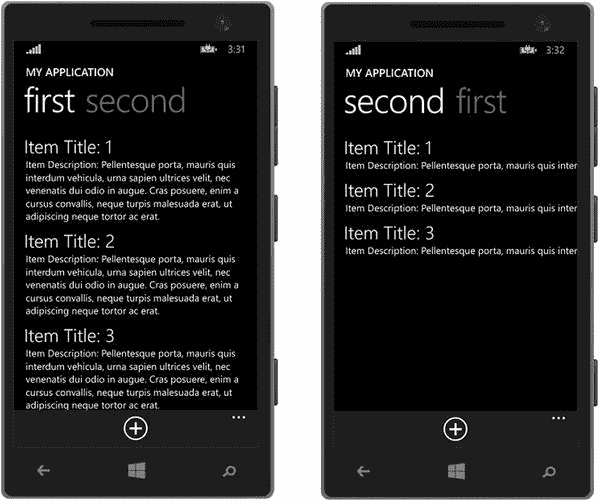

图 9-14。

The Pivot control displays content within Pivot Items, which can be viewed by swiping from side to side

每个条目由一个`ListView`组成，以不同的方式显示相同的数据集合。在现实世界的应用中，这些列表将是不同的和独立的，提供不同的相关数据集合。例如，一个食谱应用可能会提供早餐、午餐、晚餐和甜点食谱的各个部分。

## 应用栏

在前面几节中，我们演示了如何在基于集合的控件中显示项，当点击列表中的项时，触发导航到另一个页面。然而，除了页面导航之外，当您想对选中的项目执行一个操作时，会发生什么呢？您如何提供菜单操作来使用户能够在列表中添加或删除项目？

Windows Phone SDK 包括一个应用栏，它应该用于此目的，如图 [9-15](#Fig15) 所示。

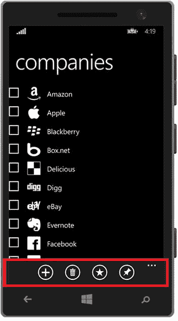

图 9-15。

An Application Bar provides quick access to actions that can be performed on the current page

请注意，我们正在利用 Companies 应用，它是作为本章前面的“显示集合”一节的一部分开发的。只需修改`CompanyListView`控件，通过将它的`SelectionMode`属性设置为`Multiple`来启用多项选择，并删除`OnSelectionChanged`事件的事件注册，因为只有当点击应用栏按钮时，我们才会对选定的项目采取行动。

现在，让我们将应用栏添加到页面中，如图 [9-15](#Fig15) 所示。根据 Windows Phone 设计原则，Windows Phone 应用中的应用栏必须位于页面底部。应用栏最多可以显示四个动作按钮。这些按钮应该用于影响当前页面数据的快速操作。

应用栏还提供了二级命令或菜单项的区域，用户可以通过点击省略号按钮来访问这些命令或菜单项，如图 [9-16](#Fig16) 所示。

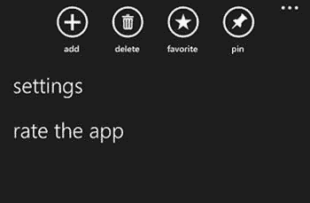

图 9-16。

Tap the ellipsis button to reveal AppBar button labels and additional menu items

二级命令可用于启动不一定与当前页面相关的动作。例如，提供对应用进行评级的操作或导航到设置页面的链接是二级命令操作的良好候选。

要在 Windows Phone 页面中添加应用栏，请在`Page`元素中添加以下标记:

`<Page.BottomAppBar>`

`<CommandBar>`

`<AppBarButton Label="add"`

`Icon="Add"`

`Click="AddAppBarButton_Click" />`

`<CommandBar.SecondaryCommands>`

`<AppBarButton Label="settings"`

click = " settings button _ OnClick "`/>`

`</CommandBar.SecondaryCommands>`

`</CommandBar>`

`</Page.BottomAppBar>`

如您所见，应用栏用`CommandBar`元素表示。要将应用栏放置在页面底部，请将`CommandBar`标记添加到`Page.BottomAppBar`元素中。一次只能在页面上显示一个应用栏，并且它必须位于页面的底部。

`CommandBar`包含两个用于存储命令的集合:`PrimaryCommands`和`SecondaryCommands`。在 Windows Phone 8.1 应用中，`PrimaryCommands`集合代表显示在应用栏上的图像按钮。在 Windows Phone 8.1 应用中，`PrimaryCommands`集合是`CommandBar`的默认属性。因此，通过将`AppBarButton`元素直接添加到`CommandBar`元素中，它们将被添加到`PrimaryCommands`集合中。

主命令按钮必须包含一个图像来表示其相应的动作，以便用户能够容易地识别和理解其预期目的。通过引用按钮的枚举成员名称，将按钮的`Icon`属性设置为 Segoe UI 符号字体的标志符号。要获得可用于`AppBarButton.Icon`属性的符号列表，请参考位于 [`http://bitly.com/AppBarSymbol`](http://bitly.com/AppBarSymbol) 的 Windows 开发中心网站上的符号枚举文档。接下来，设置按钮的`Label`属性，以包含按钮动作的简短描述。

最后，注册按钮的`Click`事件，在页面的代码隐藏中连接一个事件处理程序，这将使您能够添加必要的逻辑，当点击按钮时将执行这些逻辑。清单 [9-14](#FPar14) 描述了一个管理从应用主页中删除选中的`ListView`项的例子。

Listing 9-14\. Deleting Selected Items from the ListView

`private void OnDeleteButtonClicked(object sender, RoutedEventArgs e)`

`{`

`var selectedCompanies = CompanyListView.SelectedItems.ToArray();`

`foreach (Company item in selectedCompanies)`

`{`

`viewModel.DeleteCompany(item);`

`}`

`}`

`SecondaryCommands`集合包含代表附加菜单项的`AppBarButton`元素，当点击应用栏的省略号按钮时会显示这些菜单项。`AppBarButton`元素的配置方式与`PrimaryCommands`集合中的配置方式相同，只是不需要定义`Icon`属性，因为当`AppBarButton`被定义为二级命令时，该属性被忽略。

## 摘要

本章概述了如何使用 XAML 和 C#在 Windows Phone 商店应用中设计引人注目的用户体验。您了解了 Windows Phone 商店应用的基本结构，以及如何为各种屏幕大小和页面方向设计应用。我们还讨论了各种可用的表示控件，以及如何使用它们来显示应用内容，同时最大化屏幕空间。最后，您学习了如何将 Windows Phone 8.1 功能整合到您的应用中，包括添加页面导航、利用主题和资源、在`ListView`和`GridView`控件中显示集合，以及配置应用栏。

在下一章中，我们将探讨用于设计 Windows 应用商店应用用户界面的 XAML，以及如何使用共享合同与其他应用共享数据。