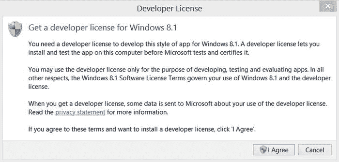

# 10.Windows 用户界面

随着 Windows 8 的出现，微软使开发人员能够创建和发布应用，即所谓的 Windows Store 应用，这些应用可以安装在运行 Windows 8 的台式机、笔记本电脑或平板电脑上。与 Windows Phone 应用类似，开发人员可以轻松发布他们的应用，使其面向全球广泛的受众。然而，只有一小部分 API 可以在 Windows 商店和 Windows Phone 应用中重用，这很快成为试图针对 Windows 系统和 Windows Phone 设备的开发人员的主要症结。

在 2014 年 4 月的微软 Build 大会上，Windows 8.1 的发布让。因为它在 Windows 应用商店和 Windows Phone 应用商店之间引入了一个聚合 API。能够共享更大部分的代码逻辑(包括 XAML 和 UI 资产)的现实，使开发人员更接近用单一代码库实现多个平台的潜力。嗯，差不多了。多平台仅仅意味着能够针对平板电脑、个人电脑和运行 Windows 的设备。一步一步来，对吧？

正如我们在[第 9 章](09.html)中提到的，微软已经宣布，随着 2015 年 7 月底 Windows 10 的发布，开发一个针对多个 Windows 平台的应用的梦想将成为现实。当你转向 Windows 10 开发时，我们在本书中围绕 XAML 用户界面设计讨论的概念仍然适用。

也就是说，我们在第 8 章和第 9 章中涉及的大部分内容也适用于 Windows Store 用户界面的设计，所以我们不会重复我们已经讨论过的内容。如果您匆忙跳过了这些章节，在继续本章之前，请后退一步阅读它们，以确保您对我们将在此讨论的高级主题有一个坚实的基础。

## 基础知识

在深入研究 Windows 应用商店开发之前，我们需要了解有关 Windows SDK、开发人员许可和 Windows 应用商店用户界面基本设计原则的相关信息。

### Windows 软件开发工具包

要开发 Windows 应用商店应用，必须在开发计算机上安装 Windows 8.1 的 Windows SDK。它包含所有必要的 API 和工具，包括 Windows 应用认证工具包，用于在 Windows 应用商店中测试应用的认证。这里的好消息是，您不需要做任何额外的事情来获取 SDK，因为它是随 Visual Studio 2013 Update 2 或更新版本自动安装的。

### 开发者许可证

在 Visual Studio 中创建 Windows 应用商店应用之前，必须在开发计算机上安装开发人员许可证。许可证使您能够在应用商店中进行认证和发布之前测试您的 Windows 应用商店应用。当您尝试使用 Visual Studio 2013 创建新的 Windows 应用商店应用或打开现有的 Windows 应用商店应用时，系统会提示您获取开发者许可证，如图 [10-1](#Fig1) 所示。

图 10-1。

Prompt to install developer license for Windows 8.1

查看许可条款。如果您想继续，请单击“我同意”按钮。然后会出现用户账户控制对话框，如图 [10-2](#Fig2) 所示。

图 10-2。

Click Yes in User Account Control dialog to install the license

单击“是”按钮继续安装。一旦许可证安装在您的计算机上，它的有效期为一年。当许可证到期时，系统会提示您安装新的许可证。

### 基本设计原则

Windows 应用商店应用遵循简洁、现代的设计实践，融合了 Windows 8.1 操作系统中的一些独特功能。为了有效地设计 Windows 应用商店应用，了解使应用商店应用如此独特的关键元素非常重要。

启动时，Windows Store 应用全屏运行，如图 [10-3](#Fig3) 所示。

图 10-3。

Adobe Reader Windows Store app

用户可以将正在运行的 Windows Store 应用拖到屏幕的左侧或右侧，以强制应用与窗格内的相应侧对齐。这允许用户同时与多个 Windows 应用商店应用进行交互，如图 [10-4](#Fig4) 所示。

图 10-4。

Windows Store apps may be snapped to the left or right side of the screen

正如你所看到的，Adobe Reader 被贴在了屏幕的右侧，这样用户也可以与 Internet Explorer 交互。请注意 Adobe Reader 的布局如何自动重排以适应窗格的大小。这是设计 Windows 应用商店应用的重要部分。您必须确保您的应用能够适应这些类型的变化。我们将在下一节“管理布局”中详细讨论这一点

另一个需要考虑的重要设计元素是应用栏。正如我们在[第 9 章](09.html)中提到的，在 Windows Phone 应用中包含应用栏的标记与您将用于 Windows 应用商店应用的标记是相同的。虽然 Windows Phone 应用只能在页面底部显示单个应用栏，但 Windows 应用商店应用可以选择在单个页面上显示最多两个应用栏，一个在页面顶部，另一个在底部。如果放置在`Page.TopAppBar`元素内，应用栏将显示在页面顶部。或者，如果放置在`Page.BottomAppBar`元素中，应用栏将显示在页面底部。当用户从屏幕的底部边缘向下滑动或者当用户右键单击时，应用栏将会出现。图 [10-5](#Fig5) 展示了一个在 Windows 应用商店应用中同时使用顶部和底部应用栏的例子。

图 10-5。

The primary and secondary Application Bars available within a Windows Store app

由于我们已经在第 9 章的[中讨论了应用栏的细节和实现，我们在此不再赘述，因为同样的信息也适用于在您的 Windows 应用商店应用中使用它。](09.html)

Windows 8.1 提供了一组魅力，使应用能够与操作系统中的核心功能集成，如搜索、设置和共享。当从右边缘向内滑动，将鼠标指针悬停在右上角或右下角，或者按下 Windows+C 快捷键组合时，可以将 Charms 栏带入视图。图 [10-6](#Fig6) 显示了魅力条。

图 10-6。

The Charms bar appears on the right side of the screen

此外，Windows 应用商店应用可能会使用弹出按钮来收集用户信息，显示某个项目的更多详细信息，或者要求用户确认某个操作。图 [10-7](#Fig7) 描述了在你的应用中使用弹出按钮的几个例子。我们将在本章后面的“弹出”部分详细讨论这个特性。

图 10-7。

Flyouts can be used to provide pop-up menu options or display a message prompt

### 手势

Windows 应用商店的应用应该都是为触摸而设计的。这很容易做到，因为所有的 UI 控件都将响应下列操作系统识别的常见手势。

*   点击:点击调用接收点击的元素上的主要动作(例如，点击按钮)。
*   按住:按住会显示所选元素的详细信息(例如，显示工具提示)。
*   滑动到平移:向左或向右滑动将在页面上平移(例如，中枢控制行为)。
*   横向滑动选择:垂直于平移方向滑动一小段距离，将选择一个项目(例如，选择列表中的一个项目)。
*   跨幻灯片移动:您可以在页面上拖放控件。
*   捏和拉伸以缩放:您可以将手指拖近以捏和，或将手指拖开以拉伸。这些手势用于调整元素大小或在`SemanticZoom`控件中的视图之间切换。
*   旋转:您可以选择一个项目，然后旋转选定的项目。
*   从边缘轻扫:根据轻扫开始的位置和轻扫的方向，执行特定的操作。
    *   从右边缘滑动会显示魅力条。
    *   从底部边缘滑动会显示应用栏。
    *   从左边缘滑动会显示正在运行的应用。
    *   从顶部边缘向右/向左滑动会分割窗口。
    *   从顶部边缘向下滑动到底部边缘关闭应用。

## 管理布局

Windows 应用商店应用可以在各种尺寸的设备上运行，从 10 英寸平板电脑到采用全尺寸显示器的桌面系统，以及设备方向。平板电脑可以在纵向或横向模式下运行，因此自然要考虑您的应用将支持哪种方向。

除了屏幕大小和方向，应用还必须考虑可用的屏幕空间。正如本章前面提到的，Windows 应用商店应用可以全屏运行，也可以在可以调整到各种宽度的窗格中显示。您必须设计的最小宽度取决于应用清单文件`Package.appxmanifest`中支持的最小宽度设置，如图 [10-8](#Fig8) 所示。

图 10-8。

Configuring the minimum width supported by the application in the application manifest

默认情况下，支持的最小宽度为 500 像素。如果您想要支持 320px 的宽度，只需在清单的“最小宽度”字段中选择该选项。

应用的高度将总是占据整个屏幕的高度。只有应用宽度会有所不同，因为多个应用可以并行运行，用户将能够动态调整窗格的大小。不管用户提供的屏幕大小如何，您的应用都必须继续正常呈现。

设计 Windows 应用商店应用时，您必须确定应用在其可用宽度扩展或收缩时的外观。正如我们在第 8 章和第 9 章中提到的，避免在你的 XAML 视图中使用固定的尺寸。允许 XAML 子系统自动调整到用户提供的应用的屏幕大小。

### 视觉状态

有些情况下，当应用窗口被对齐或调整大小时，您会希望确保页面以不同的格式呈现。您可以通过使用来自`Windows.UI.Xaml`名称空间的`VisualState`类定义您的页面将支持的可视状态来实现这一点。`VisualState`类使你能够配置一个控件在特定状态下的外观。然而，要管理视觉状态的集合以及控件之间的转换逻辑，您必须使用`VisualStateManager`。在 XAML 中，您将使用`VisualStateManager.VisualStateGroups`集合定义一个或多个可视状态，如清单 [10-1](#FPar1) 所示。

Listing 10-1\. Configuring Visual States in XAML

`<VisualStateManager.VisualStateGroups>`

`<VisualStateGroup x:Name="MyVisualStateGroup">`

`<VisualState x:Name="Snapped">`

`</VisualState>`

`<VisualState x:Name="Narrow">`

`</VisualState>`

`<VisualState x:Name="Default" />`

`</VisualStateGroup>`

`</VisualStateManager.VisualStateGroups>`

在清单 [10-1](#FPar1) 的例子中，我们定义了三种视觉状态:`Snapped`、`Narrow`和`Default`。不要太在意名称，因为您可以使用任何对您有意义的约定来命名视觉状态。您在这里提供的名称将在代码隐藏中被引用，我们很快就会看到。

### 故事板和动画

一旦决定了要支持的各种宽度，就必须确定页面在这些视图中的显示方式。例如，如果一个`StackPanel`在应用窗口处于全视图时水平呈现控件，当应用被贴紧到屏幕的左边缘或右边缘时，您可能希望将其更改为垂直呈现控件。更改控件的呈现方式可以看作是一种视觉转换。可视转换可用于更改控件上的任何 Windows 运行时依赖项属性。

在 XAML 中，您将能够定义当控件从一种视觉状态转移到另一种视觉状态时要应用于该控件的视觉转换。这是通过使用故事板和动画来实现的。动画在应用中添加动作，在控件的属性值更改时提供吸引人的转换。故事板控制使用时间轴运行的动画。

您可以使用表 [10-1](#Tab1) 中列出的动画为`Color`、`Double`、`Point`和`Object`属性创建动画。

表 10-1。

Windows Runtime Animations

<colgroup><col> <col></colgroup> 
| 动画 | 激发…的价值... |
| --- | --- |
| `ColorAnimation` | 超过指定的`Duration`的两个目标值之间的`Color`属性 |
| `ColorAnimationUsingKeyFrames` | 一组关键帧上的`Color`属性 |
| `DoubleAnimation` | 超过指定的`Duration`的两个目标值之间的`Double`属性 |
| `DoubleAnimationUsingKeyFrames` | 一组关键帧上的`Double`属性 |
| `ObjectAnimationUsingKeyFrames` | 指定`Duration`上一组关键帧的`Object`属性 |
| `PointAnimation` | 超过指定的`Duration`的两个目标值之间的`Point`属性 |
| `PointAnimationUsingKeyFrames` | 一组关键帧上的`Point`属性 |

使用前面提到的例子，清单 [10-2](#FPar2) 演示了当窗口被捕捉时如何改变`StackPanel`的方向。

Listing 10-2\. Configure the StackPanel to Change Orientation When the Page Is Snapped

`<VisualStateManager.VisualStateGroups>`

`<VisualStateGroup x:Name="MyVisualStateGroup">`

`<VisualState x:Name="Snapped">`

`<Storyboard>`

`<ObjectAnimationUsingKeyFrames`

`Storyboard.TargetName="MyStackPanel"`

`Storyboard.TargetProperty="Orientation">`

`<DiscreteObjectKeyFrame KeyTime="0">`

`<DiscreteObjectKeyFrame.Value>`

`<Orientation>Vertical</Orientation>`

`</DiscreteObjectKeyFrame.Value>`

`</DiscreteObjectKeyFrame>`

`</ObjectAnimationUsingKeyFrames>`

`</Storyboard>`

`</VisualState>`

`...`

`</VisualStateGroup>`

`</VisualStateManager.VisualStateGroups>`

清单 [10-2](#FPar2) 展示了通过在`DiscreteObjectKeyFrame.Value`元素中定义`StackPanel`的新方向属性，使用`ObjectAnimationUsingKeyFrames`类将`StackPanel`从水平方向转换到垂直方向。

`<DiscreteObjectKeyFrame KeyTime="0">`

`<DiscreteObjectKeyFrame.Value>`

`<Orientation>Vertical</Orientation>`

`</DiscreteObjectKeyFrame>`

您希望包含在单个故事板中的动画数量没有限制。您可以根据需要更改任意多的属性值。例如，如果您还想在窗口被捕捉时减小`Title`文本块的文本大小，您可以在`Snapped`可视状态的故事板定义中包含一个额外的动画，如下所示:

`<DoubleAnimation Duration="0"`

`To="21"`

`Storyboard.TargetProperty="FontSize"`

`Storyboard.TargetName="TitleTextBlock" />`

注意，在这种情况下，`FontSize`是通过`DoubleAnimation`元素上的`To`属性更改的。

为特定控件配置动画时，必须指定目标控件的名称和动画必须应用到的属性。您可以通过在动画:`<ObjectAnimationUsingKeyFrames Storyboard.TargetName="MyStackPanel" Storyboard.TargetProperty="Orientation">`上设置附加属性`TargetName`和`TargetProperty`来实现这一点。

请注意，当配置了`TargetName`后，`TargetProperty`将自动使用那些适用于目标 UI 元素的属性填充其选择列表，使您能够完全控制页面中任何对象的外观。

您还必须指定一个`Duration`或`KeyTime`来指示动画需要多长时间才能完成。当定义可视状态转换的持续时间时，使用零持续时间动画来确保应用保持响应。设置较长的持续时间可能会对 UI 线程的性能产生负面影响，并在动画完成之前锁定应用。

### OnSizeChanged

既然您已经知道如何为您的应用将支持的每个可视状态定义一个视图，那么`VisualStateManager`如何知道如何呈现页面呢？

为了确保在调整应用窗口的宽度时呈现适当的视觉状态，您必须注册`Page`的`OnSizeChanged`事件。`OnSizeChanged`事件接收`SizeChangedEventArgs`参数，该参数公开了两个`Size`属性:`NewSize`和`PreviousSize`。您可以使用这些属性来检索调整大小前后的应用窗口的`Height`和`Width`。

在`OnSizeChanged`事件中，您需要调用`VisualStateManager.GoToState`方法，传递想要呈现的可视状态。在这种情况下，您将使用`e.NewSize.Width`属性来确定要呈现的视觉状态。您必须决定每个视觉状态将支持的最大宽度。500px 以下的宽度会触发你的`Snapped`视野，还是 320px？之后支持的下一个最大宽度是多少？这些是您必须基于应用定义的设计考虑事项。清单 [10-3](#FPar3) 展示了一个如何根据窗口的新宽度触发适当的视觉状态的例子。

Listing 10-3\. The OnSizeChanged Event Will Be Used to Trigger the Appropriate VisualState Through the VisualStateManager

`//custom enumeration to represent each of`

`//the custom visual states configured in XAML`

`public enum MyVisualStates`

`{`

`Snapped,`

`Narrow,`

`Default`

`}`

`public sealed partial class MainPage : Page`

`{`

`public MainPage()`

`{`

`this.InitializeComponent();`

`this.SizeChanged += MainPage_SizeChanged;`

`}`

`void MainPage_SizeChanged(object sender, SizeChangedEventArgs e)`

`{`

`VisualStateManager.GoToState(this, GetCustomVisualState(e.NewSize.Width), true);`

`}`

`private string GetCustomVisualState(double width)`

`{`

`if (width <= 500)`

`{`

`return MyVisualStates.Snapped.ToString();`

`}`

`if (width <= 800)`

`{`

`return MyVisualStates.Narrow.ToString();`

`}`

`return MyVisualStates.Default.ToString();`

`}`

`}`

花些时间在你的应用中配置视觉状态将确保你的用户有一个无缝的体验，而不管你的应用在运行时可用的屏幕空间。虽然它确实需要一些前期工作，但最终结果将是一个对用户有吸引力的高质量的应用。

## 搜索数据

所有数据驱动的应用应该提供的一个基本特性是一种机制，允许用户搜索和过滤数据，以找到一个特定的项目或一组项目。

Windows 8.1 SDK 包括一个`SearchBox`控件，使您能够在应用中包含高级搜索功能。虽然`SearchBox`本身是一个简单的控件，没有真正的功能驱动它，但是控件包含集成点，您可以利用这些集成点使用自己的定制逻辑来合并搜索。它包括一些额外的功能，使得显示一个完美的搜索界面变得容易，比如根据用户当前的输入显示建议，如图 [10-9](#Fig9) 所示。

图 10-9。

SearchBox with a list of suggestions displayed based on the user’s search criteria

您可以订阅以下一个或多个事件，为`SearchBox`添加功能:

*   `SuggestionRequested`:处理此事件，根据用户的搜索文本在搜索窗格中提供新的建议。
*   `QueryChanged`:处理这个事件，当用户在`SearchBox`中输入时采取行动。这可能会影响性能，因此请谨慎使用。
*   `QuerySubmitted`:处理此事件，控制用户提交搜索查询时触发的动作。
*   `ResultSuggestionChosen`:处理此事件，控制用户选择建议搜索结果时触发的动作。

要在 Windows 应用商店页面中包含`SearchBox`，只需包含元素的标记`<SearchBox />`，以及您想要设置的任何属性或事件。这里有一个例子:

`<SearchBox x:Name="CompanySearchBox"`

`MinWidth="200"`

`HorizontalAlignment="Right"`

`QuerySubmitted="SearchBoxOnQuerySubmitted"`

`SuggestionsRequested="SearchBoxOnSuggestionsRequested" />`

如前所述，当呈现页面时，`SearchBox`将显示一个建议列表，或者一个搜索历史列表。要关闭列表显示，只需将其布尔属性`SearchHistoryEnabled`设置为`False`。

当`SearchHistoryEnabled`属性设置为`True`时，列表将总共显示多达 20 个项目。前五个项目将显示在弹出窗口中，而列表中的其余项目可以滚动到视图中。

要将搜索历史列表设置为强制填充或清除，可以实例化一个`SearchSuggestionManager`对象。这个对象提供了一个`AddHistory`方法，允许您向搜索历史列表中添加字符串。反过来，它也提供了一个`ClearHistory`方法，使你能够清除搜索历史列表。

如果您想在用户通过点击 Enter 键提交查询条目时显示一个搜索结果页面，您可以通过添加搜索结果页面模板轻松地将其合并到您的应用中，如图 [10-10](#Fig10) 所示。

图 10-10。

Adding a search results page to the application

搜索结果页面模板提供了 UI 布局和呈现完美结果列表所需的大部分代码。通过一些小的调整，您将毫不费力地得到一个功能齐全的结果页面。如果您愿意，您可以创建自己的自定义结果页面。这只是提供了一个快速简单的选择。

在搜索结果页面的代码隐藏中，在`navigationHelper_LoadState`事件中，为`Results`集合向`DefaultViewModel`字典添加一个条目。您需要在您的`ViewModel`中编写您自己的定制搜索逻辑，以便根据输入的查询文本检索结果。例如，在您只搜索公司名称的情况下，您的`ViewModel`可能会公开一个简单的方法来检索包含如下输入的查询文本的所有公司:

`public ObservableCollection<Company> GetSearchResults(string queryText)`

`{`

`return new ObservableCollection<Company>(Companies`

`.Where(c => c.CompanyName.Contains(queryText))`

`.ToList<Company>());`

`}`

在搜索结果代码隐藏文件中，您只需添加一行代码来包含对`DefaultViewModel["Results"]`条目的调用结果，如下所示:

`private void navigationHelper_LoadState(object sender, LoadStateEventArgs e)`

`{`

`var queryText = e.NavigationParameter as String;`

`...`

`//Add your custom results to the DefaultViewModel`

`this.DefaultViewModel["Results"] = App.MainViewModel.GetSearchResults(queryText);`

`}`

搜索结果页面中的 XAML 需要稍微修改一下，以确保`resultsGridView`中的绑定属性与您将要搜索的模型上显示的项目相匹配。在本例中，您正在搜索一组`Company`对象。因此，每个结果将描绘一个`Company`对象。您修改`resultsGridView`中的 XAML 来引用您的`Company`对象中的属性:`LogoImagePath`、`CompanyName`、`Headquarters`和`YearFounded`。

`<GridView x:Name="resultsGridView"`

`...`

`ItemsSource="{Binding Source={StaticResource resultsViewSource}}">`

`<GridView.ItemTemplate>`

`<DataTemplate>`

`<Grid Width="294" Margin="6">`

`<Grid.ColumnDefinitions>`

`<ColumnDefinition Width="Auto" />`

`<ColumnDefinition Width="*" />`

`</Grid.ColumnDefinitions>`

`<Border ...>`

`<Image Source="{Binding LogoImagePath}"`

`Stretch="UniformToFill" />`

`</Border>`

`<StackPanel Grid.Column="1"`

`Margin="10,-10,0,0">`

`<TextBlock Text="{Binding CompanyName}"`

`TextWrapping="NoWrap"`

`Style="{StaticResource BodyTextBlockStyle}" />`

`<TextBlock Text="{Binding Headquarters}"`

`TextWrapping="NoWrap"`

`Style="{StaticResource BodyTextBlockStyle}" />`

`<TextBlock Text="{Binding YearFounded}"`

`TextWrapping="NoWrap"`

`Style="{StaticResource BodyTextBlockStyle}" />`

`</StackPanel>`

`</Grid>`

`</DataTemplate>`

`</GridView.ItemTemplate>`

`...`

`</GridView>`

最后，您需要修改`MainPage`代码隐藏，以便为`SearchBox`添加功能。在本例中，您确保针对`SearchBox`处理以下动作:

*   仅当控件有焦点时才显示搜索历史列表。
*   当引发`onsuggestionsrequested`事件时，将建议添加到搜索历史列表中。
*   每次加载页面时，或者当列表将被新的建议列表填充时，清除搜索历史列表。
*   当引发`querysubmitted`事件时，导航到搜索结果页面。

请注意，这是一个如何包含`SearchBox`功能的简单示例。您可以灵活地添加在应用上下文中有意义的逻辑。清单 [10-4](#FPar4) 展示了示例的结果代码。

Listing 10-4\. Code-Behind Needed to Manage SearchBox

`private readonly SearchSuggestionManager searchManager;`

`public MainPage()`

`{`

`this.InitializeComponent();`

`this.NavigationCacheMode = NavigationCacheMode.Required;`

`this.DataContext = App.MainViewModel;`

`//only show the search history list when the search box has focus`

`CompanySearchBox.GotFocus += delegate(object sender, RoutedEventArgs args)`

`{`

`CompanySearchBox.SearchHistoryEnabled = true;`

`};`

`CompanySearchBox.LostFocus += delegate(object sender, RoutedEventArgs args)`

`{`

`CompanySearchBox.SearchHistoryEnabled = false;`

`};`

`//clear previous search history each time the application is launched`

`searchManager = new SearchSuggestionManager();`

`searchManager.ClearHistory();`

`}`

`private void SearchBoxOnQuerySubmitted(SearchBox sender, SearchBoxQuerySubmittedEventArgs args)`

`{`

`Frame.Navigate(typeof (CompanySearchResults), args.QueryText);`

`}`

`private void SearchBoxOnSuggestionsRequested(SearchBox sender, SearchBoxSuggestionsRequestedEventArgs args)`

`{`

`//clear search history, and add new suggestions to the search history list`

`searchManager.ClearHistory();`

`IEnumerable<Company> results = App.MainViewModel.GetSearchResults(args.QueryText);`

`foreach (Company company in results)`

`{`

`searchManager.AddToHistory(company.CompanyName);`

`}`

`}`

如果配置正确，在`SearchBox`中键入文本并按下`MainPage`上的回车键后，搜索结果页面应该以类似于图 [10-11](#Fig11) 所示的布局出现。

图 10-11。

Search results page displaying list of matching items

如您所见，搜索结果页面模板为您提供了一个很好的起点。但是，我们强烈建议您利用到目前为止所获得的知识来定制这个页面的主题和样式，以匹配您的应用的外观和感觉。

## 飞来飞去

Windows 8.1 SDK 提供了一个`Flyout`控件，可用于收集用户信息、显示消息、提示确认或提供菜单选项。

### 基础知识

通过`Flyout`控件，用户只需触摸屏幕上`Flyout`之外的任何地方，就可以取消控件。您可以通过在容器控件中显示您认为合适的任何元素来自定义`Flyout`控件的内容。您并不局限于单独显示静态文本。您可以合并输入字段、图像、按钮或任何其他您想要的丰富内容。您还可以应用应用的主题或自定义样式来为控件提供视觉吸引力。

如果您想要显示一个菜单选项列表，可以将`Flyout`控件的内容设置为`MenuFlyout`元素。`MenuFlyout`元素使您能够定义将呈现给用户的选项列表，并连接事件来处理用户的选择。`MenuFlyout`内的菜单项可能仅由常规菜单项、切换菜单项和/或分隔条组成。我们将在本节的后面演示`MenuFlyout`元素的用法。

为了在`Flyout`控件被加载、显示或关闭时执行自定义操作，您可以分别订阅`Flyout`控件的`Opening`、`Opened`或`Closed`事件。

### 用法和语法

弹出按钮可以通过按钮、应用栏按钮或编程方式在页面中实现。要在点击按钮时显示弹出按钮，只需在`Button`元素中包含所需的`Flyout`标记，如下所示:

`<Button>`

`<Button.Flyout>`

`<Flyout>`

`<!-- include your desired content here -->`

`</Flyout>`

`</Button.Flyout>`

`</Button>`

当`Flyout`以这种方式与一个按钮相关联时，不需要额外的代码来显示弹出按钮。点击按钮将自动触发弹出按钮打开。

如果你想控制点击按钮时`Flyout`的呈现位置，你可以将`Flyout`的`Placement`属性设置为下列枚举值之一:`Top`、`Bottom`、`Left`、`Right`、`Full`。将控件的`Placement`设置为前四个属性之一将确保它显示在相对于其父按钮的指定位置。将`Placement`设置为`Full`会使`Flyout`展开并显示在屏幕中央，如图 [10-12](#Fig12) 所示。

图 10-12。

When the Flyout’s Placement property is set to Full, it will display center screen

您也可以使用类似的标记将`Flyout`控件集成到`AppBarButton`中，如下所示:

`<AppBarButton>`

`<AppBarButton.Flyout>`

`<!-- place desired content here -->`

`</AppBarButton.Flyout>`

`</AppBarButton>`

就像按钮一样，在`AppBarButton`中包含一个`Flyout`将导致在点击`AppBarButton`时显示`Flyout`。

如前所述，您可以创建一个`MenuFlyout`来为用户呈现上下文选项，以便在当前页面上采取行动，如清单 [10-5](#FPar5) 所示。一个`MenuFlyout`只能包含以下子元素:

*   `MenuFlyoutItem`:显示一个简单的菜单项。当必须在选择后立即采取行动时，使用此菜单项。订阅`Click`事件来处理用户选择。
*   `ToggleMenuFlyoutItem`:显示一个菜单项，点击时旁边会出现一个复选标记。使用此菜单项为用户提供选项选择。监视`ToggleMenuFlyoutItem`上的`IsChecked`属性的值，以确定该项是否已被选中。
*   `MenuFlyoutSeparator`:显示一个水平的灰色条。它不是一个功能菜单项，只是用来将菜单项分成组。

Listing 10-5\. An Example of Using the MenuFlyout to Provide Multiple Options to the User

`<AppBarButton Label="send to" Icon="Send">`

`<AppBarButton.Flyout>`

`<MenuFlyout>`

`<MenuFlyoutItem Text="All Click="SendToAllOnClick" />`

`<MenuFlyoutSeparator />`

`<ToggleMenuFlyoutItem Text="Email"`

`IsChecked="{Binding IsEmailSelected, Mode=TwoWay}" />`

`<ToggleMenuFlyoutItem Text="Facebook"`

`IsChecked="{Binding IsFacebookSelected, Mode=TwoWay}" />`

`</MenuFlyout>`

`</AppBarButton.Flyout>`

`</AppBarButton>`

### 程序显示

如果您想要将`Flyout`附加到`FrameworkElement`而不是按钮，您必须将`Flyout`声明为`Resource`，使用`FlyoutBase.FlyoutAttached`属性将`Flyout`控件关联到`FrameworkElement`，并在点击`FrameworkElement`时通过调用代码隐藏中的`FlyoutBase.ShowAttachedFlyout`方法以编程方式触发`Flyout`显示。

例如，假设您想要创建一个纸牌游戏，其中使用一个`Image`控件来显示一张纸牌。当一张特殊的卡片被点击时，你想给用户提供一个选项列表，使他们能够决定如何在游戏中使用这张卡片。

要将一个`Flyout`与一个`Image`控件相关联，将您的`Flyout`定义为一个页面资源，然后将`Flyout`与`Image`控件相关联，如清单 [10-6](#FPar6) 所示。

Listing 10-6\. Define Flyout as a Resource and Associate It to the Image

`<Page ...>`

`<Page.Resources>`

`<MenuFlyout x:Key="SpecialActionMenuFlyout">`

`<MenuFlyoutItem Text="Power Up"`

`Tag=”PowerUp”`

`Click="SpecialActionOnClick"/>`

`<MenuFlyoutItem Text="Damage Enemy"`

`Tag=”Damage”`

`Click=" SpecialActionOnClick"/>`

`<MenuFlyoutItem Text="Restore Health"`

`Tag="Restore"`

`Click=" SpecialActionOnClick"/>`

`</MenuFlyout>`

`</Page.Resources>`

`...`

`<Image Source="{Binding SpecialCard}"`

`Tapped="OnSpecialCardTapped"`

`FlyoutBase.AttachedFlyout="{StaticResource SpecialActionMenuFlyout}" />`

`...`

`</Page>`

在`Page`的代码隐藏文件中，调用`FlyoutBase.ShowAttachedFlyout`方法，简单地传入`Image`控件。

`private void OnSpecialCardTapped (object sender, TappedRoutedEventArgs e)`

`{`

`FlyoutBase.ShowAttachedFlyout((FrameworkElement)sender);`

`}`

这就是全部了！只需几个额外的步骤，您就可以轻松地将`Flyout`控件与应用中的任何`FrameworkElement`相关联。

### 弹出型样式

既然你已经知道了如何将弹出按钮合并到你的应用中，让我们仔细看看如何定制`Flyout`控件以符合应用的主题。

#### 弹出演示者

一个`Flyout`控件中的内容可以用你在 XAML 中设计标准`FrameworkElement`的方式来设计。然而，`Flyout`控件本身不能被直接设计。相反，必须通过配置它的`FlyoutPresenterStyle`来设计它的样式。`FlyoutPresenterStyle`定义了`Flyout`控件的整体外观。您将能够定制控件的依赖属性的样式，例如`FontSize`、`Background`、`Foreground`和`Padding`等等。在定义`FlyoutPresenterStyle`时，您必须设置它的`TargetType="FlyoutPresenter"`并包含您想要定制的依赖属性的设置器，如下所示:

`<Flyout>`

`<Flyout.FlyoutPresenterStyle>`

``

`</Flyout.FlyoutPresenterStyle>`

`<!-- Flyout content -->`

`</Flyout>`

#### MenuFlyoutPresenter

类似于`Flyout`控件，您可以使用`MenuFlyoutPresenterStyle`属性配置`MenuFlyout`上的样式，确保`TargetType`被设置为`MenuFlyoutPresenter`。

`<MenuFlyout>`

`<MenuFlyout.MenuFlyoutPresenterStyle>`

``

`</MenuFlyout.MenuFlyoutPresenterStyle>`

`<!-- Menu Flyout content -->`

`</Flyout>`

## 契约

Windows 8.1 SDK 提供了合约，您可以在应用中利用这些合约来与本机系统特性和功能进行交互，例如在应用之间共享内容以及与设置菜单进行集成。

### 共享联系人

共享契约使应用能够以纯文本、链接和文件的形式与其他应用共享数据和/或从其他应用接收数据。您可以指定您的应用作为共享源参与，这将为用户选择的应用提供数据。只有那些配置为共享目标的应用才可以作为共享数据的选项。您还可以将应用配置为目标源。这样，当用户选择从外部应用(如脸书或 Instagram)共享数据时，您的应用将作为可接收内容的目标应用出现在列表中。

为了确保您的应用被配置为与其他应用共享数据，您必须将`Windows.ApplicationModel.DataTransfer`名称空间添加到您的应用页面。在应用页面的构造函数中，您必须检索一个`DataTransferManager`对象的实例，并订阅它的`DataRequested`事件。每当用户通过魅力条调用共享动作时，就会触发`DataRequested`事件。因此，您将利用此事件来包含您想要与任何外部应用共享的任何数据。

最后，您想要共享的数据必须通过一个`DataRequest`对象来传递。注意，`DataRequest`对象的`Title`是一个强制字段，必须设置。清单 [10-7](#FPar7) 展示了一个配置应用的主页面来参与共享契约的基本例子，这样它就可以与外部应用共享数据。

Listing 10-7\. Configure the Page to Participate in the Share Contract

`private void OnDataRequested(DataTransferManager sender, DataRequestedEventArgs e)`

`{`

`DataRequest request = e.Request;`

`request.Data.Properties.Title = "Share Demo";`

`request.Data.Properties.Description = "Demonstrating the use of the Share Contract";`

`request.Data.SetText("Sharing text with another application.");`

`}`

清单 [10-7](#FPar7) 展示了与外部应用共享文本是多么容易。然而，如果你想分享一张图片呢？这确实需要几行额外的代码；然而，这很简单。

要共享一个图像，您必须将它转换成一个`RandomAccessStreamReference`，然后通过调用`SetBitmap`方法将它传递给`DataRequest`对象，如清单 [10-8](#FPar8) 所示。

Listing 10-8\. Sharing an Image with an External Application

`private async void OnDataRequested(DataTransferManager sender, DataRequestedEventArgs e)`

`{`

`var deferral = e.Request.GetDeferral();`

`DataRequest request = e.Request;`

`request.Data.Properties.Title = "Share Demo";`

`request.Data.Properties.Description = string.Format("Demonstrating the use of the Share Contract");`

`StorageFile imageFile =`

`await Windows.ApplicationModel.Package.Current.InstalledLocation.GetFileAsync("MontegoBay.png");`

`var stream = RandomAccessStreamReference.CreateFromFile(imageFile);`

`request.Data.SetBitmap(stream);`

`request.Data.Properties.Thumbnail = stream;`

`deferral.Complete();`

`}`

在清单 [10-8](#FPar8) 中，我们通过调用`GetFileAsync`方法从应用打包的文件中加载图像。注意，我们使用了`async` / `await`操作符。在这种情况下，我们需要请求延期，因为我们正在调用一个异步流程。为了实现这一点，我们在`DataRequest`对象上调用`GetDeferral`方法，以便应用能够加载图像并异步生成`DataPackage`。我们通过调用延迟对象上的`Complete`方法来完成请求。现在，当我们运行应用时，我们可以调用 Charms 栏并单击 Share 按钮来与外部应用共享我们的图像，如图 [10-13](#Fig13) 所示。

图 10-13。

The application’s custom share title and description is displayed in the Share Flyout along with applications that are share targets

从可用共享目标列表中选择一个应用将导致该应用加载到一个快照页面中，共享数据显示在视图中，如图 [10-14](#Fig14) 所示。

图 10-14。

The share target application is loaded in a snapped pane with the shared data in view

### 设置合同

设置契约使您能够将应用的设置集成到可从魅力栏访问的设置弹出按钮中。默认情况下，所有 Windows 应用商店应用都设计有默认设置面板，并配置为参与设置合约。在“设置”面板中，您最多可以包含七个命令。如果您的应用中不包含自定义设置弹出按钮，默认设置窗格将包含应用的名称、您的发布者名称、显示包含应用权限信息的设置弹出按钮的命令以及允许用户对您的应用进行评级的命令。只有在应用发布到 Windows 应用商店后,“评价和检查”命令才可用。

## 摘要

本章概述了设计 Windows 应用商店应用时应考虑的设计原则和功能。您了解了如何设计您的应用以适应不同的布局，以及如何将 Windows 8.1 合约整合到您的应用中以提供引人入胜的用户体验。我们还讨论了使用弹出菜单来提供上下文菜单选项。

在下一章中，我们将讨论如何打包您的 Windows 应用，以便在 Windows 应用商店中发布。