# 三、使用布局的用户界面设计

布局是控件、图像、文本和其他布局的容器。布局是创建移动用户界面的核心，它通过使用视图的位置和嵌套布局(更多视图)来帮助我们设计页面。如果你曾经使用过 HTML `
`、`<table>`或`<form>`元素，那么布局应该对你来说很熟悉。布局的目的是指示每个子元素的位置和大小。这通常有三种方式:相对于布局中的单个控件，相对于布局的原点，或者使用网格之类的覆盖结构。每种布局类型都有一种在其中放置子视图、指定每个视图的大小和位置以及在视图之间和周围创建空间的机制。

在本章中，您将构建小项目来使用每种布局类型及其功能。首先，您将了解各种类型的布局并探索自定义控件。Xamarin。表格，Xamarin。Android 和 Xamarin.iOS 使用不同类型的布局。以下是这些类型的概述。

Xamarin。表单布局

Xamarin。表单布局继承自`View`类，可以包含视图或其他布局。Xamarin。表单布局包括以下内容:

*   `StackLayout`:垂直或水平堆叠子视图
*   `RelativeLayout`:使用创建元素之间关系的约束来定义子视图的位置和大小`AbsoluteLayout`:通过使用边界矩形或整体布局的比例来设置子视图的位置和大小
*   `Grid`:创建一个类似表格的容器，用行和列来保存视图
*   `Frame`:在容器周围画一个类似框架的边框

Android 布局

Android 布局继承自`ViewGroup`类，可以包含视图或其他布局。Android 布局包括以下内容:

*   `LinearLayout`:垂直或水平排列子视图
*   `RelativeLayout`:使用创建元素间关系的约束来定义子视图的位置和大小
*   `TableLayout`:创建一个类似表格的容器，用行和列来保存视图
*   `GridLayout`:创建另一个具有行和列的表状容器来保存视图，视图流有几个选项:行优先、列优先或特定的行/列分配
*   垂直排列子视图，提供嵌套、交换、滑动和填充，很像传统的 .NET 面板，以及对 z 顺序(层深度)的控制

iOS 布局

大多数 iOS 布局都是使用设计工具创建的，如 Xcode Interface Builder 和 Xamarin Designer for iOS。从类的角度来看，iOS 布局使用了一种简单的方法，使用了一个名为`UIView`的类和两种技术。iOS 布局技术包括以下内容:

*   自动布局:使用在元素之间创建灵活的相对关系的约束来定义子视图的位置和大小
*   框架:使用称为框架的边界矩形来指示子视图的绝对位置和大小(可以使用遮罩(一种称为自动调整大小的技术)根据上下文来调整大小)

当构建布局时，出现的一个相关主题是创建自定义控件，用作构建布局的组件。

## 了解自定义控件

Xamarin 中的自定义控件是部分布局，可以根据需要包含在更大的布局中，可以在所有平台上创建，并且可以像用户控件、自定义控件或. NET 中的面板一样工作。本书中几乎没有涉及到自定义控件，但在构造专业级布局的上下文中值得一提。

在 Xamarin。Forms，`ContentView`是为嵌套、填充和重用创建自定义视图的基类。自定义控件不应与自定义控件混淆，后者通常是单独的 Xamarin。使用自定义渲染器构建具有增强的平台特定功能的表单视图(见第 8 章[)。即便如此，开发人员有时也会将单个自定义控件称为自定义控件。此外，自定义控件具有包含多个控件的能力，因此实际上可能成为自定义控件。](08.html)

在 Android 中，我们有两个创建自定义控件的选项:子类化视图和片段。子类化视图允许我们创建自定义视图，这些视图可以作为子视图添加到`ViewGroups`中，比如布局。子类化视图是轻量级的，实现起来很简单。然而，有时我们需要访问自定义控件中的活动特性，例如导航堆栈和生命周期事件。片段是动态的迷你布局，具有使用基类`Android.App.Fragment`构建的活动特性。由于它们作为构建块 UI 类的优势和多功能性，许多 Android 应用完全是使用片段创建的。它们通常用于构建必须在手机和平板电脑上都能正常工作的应用，因为它们有助于根据屏幕大小定制布局。

在 iOS 中，自定义控件通常使用设计工具创建，尽管子类化`UIView`也可以。

Note

本章探讨了静态的、手动的布局方法。许多这样的布局，比如 Xamarin。表单包含可绑定的属性，可以绑定到数据源并在运行时动态构造。你将在后面的章节中学习数据绑定(第 5 章[和第 7 章](05.html)的[)。](07.html)

## 使用 Xamarin。表单布局

xamarin.forms

Xamarin 中的布局。表单是保存和格式化视图的容器。每种布局都有自己的一组约束和行为，以满足各种设计需求。当您知道控件之间的坐标关系时，使用`StackLayout. RelativeLayout`可以快速方便地格式化带有几个控件的简单页面。当你只知道你的控件应该出现在页面的哪个象限和区域，以及当你需要分层的时候，使用`AbsoluteLayout`。`Grid`提供了一个类似桌子的容器。`ContentView`是一个用于构建自定义布局视图的基类，比如自定义控件，它可以包含多个布局和其他视图，作为一个可重用的组件非常有用。一个`Frame`布局在其内容周围提供了一个可视的矩形框。

### 堆栈式布局

xamarin.forms

除非指定水平放置，否则`StackLayout`中的视图垂直堆叠。`StackLayout`是一种快速、松散的布局，对于原型和简单的屏幕非常有用。您将视图作为子视图添加到父视图，并通过使用`HorizontalOptions`和`VerticalOptions`来排列它们，这也可以用于扩展视图和提供视图之间的间距。适用于所有 Xamarin。表单布局，`Padding`属性在整个布局的边缘创建空间。

向`ContentPage`的构造函数添加一个`StackLayout`，如下所示:

`StackLayout stackLayout = new StackLayout {`

`Spacing = 0,`

`VerticalOptions = LayoutOptions.FillAndExpand,`

`Children = {`

`// Add Views here`

`}`

`};`

属性在每个视图之间创建指定大小的填充。使用`FillAndExpand`的`VerticalOptions`声明用空格填充布局的末尾，将其他视图推到页面的底部。

Tip

所有示例代码解决方案，包括这些 C#示例的 XAML 版本，都可以在 Apress.com(从源代码/下载选项卡，访问本书的标题)或 GitHub 的 [`https://github.com/danhermes/xamarin-book-examples`](https://github.com/danhermes/xamarin-book-examples) 找到。

清单 [3-1](#FPar3) 是分配了`Children`属性的子视图的内联声明。

Listing 3-1\. StackLayoutHorizontal.cs in LayoutExample Project

`StackLayout stackLayout = new StackLayout {`

`Spacing = 0,`

`Children = {`

`new Label {`

`Text = "Start is flush left",`

`HorizontalOptions = LayoutOptions.Start,`

`},`

`new Label {`

`Text = "Center",`

`HorizontalOptions = LayoutOptions.Center`

`},`

`new Label {`

`Text = "End is flush right",`

`HorizontalOptions = LayoutOptions.End`

`}`

`}`

`};`

`this.Content = stackLayout;`

在图 [3-1](#Fig1) 中，注意`LayoutOptions.Start`、`Center`和`End`的`HorizontalOptions`位置。

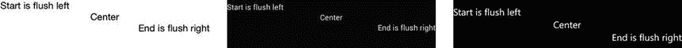

图 3-1。

StackLayout HorizontalOptions Tip

当快速构建布局时，通过分配清单 [3-1](#FPar3) 中使用的`Children`属性来内联声明子视图是很有用的。`Add`方法同样有效:

`stackLayout.Children.Add(View item);`

### 整个布局周围的填充

xamarin.forms

与页面填充非常相似，布局的`Padding`属性在整个布局周围创建空间。下面是内联属性赋值:

`Padding = new Thickness(left, top, right, bottom),`

以下示例在左侧、右侧和底部放置填充，但不在顶部放置填充:

`Padding = new Thickness(10, 0, 10, 5),`

这会在所有四个边上放置相等的空间:

`Padding = new Thickness(10),`

### 垂直方向堆叠

xamarin.forms

默认方向是垂直堆叠，将每个视图放置在前一个视图的下方。有四个水平位置:`Start`、`Center`、`End`和`Fill`。这些是`LayoutOptions`类的字段。

让我们明确默认的垂直方向，这样您就可以看到它，并向第一个示例添加一些视图(清单 [3-2](#FPar5) )。

Listing 3-2\. StackLayoutVertical.cs

`public StackLayoutVertical ()`

`{`

`StackLayout stackLayout = new StackLayout {`

`Spacing = 0,`

`Orientation = StackOrientation.Vertical,`

`VerticalOptions = LayoutOptions.FillAndExpand,`

`Children = {`

`new Label {`

`Text = "Start is flush left",`

`HorizontalOptions = LayoutOptions.Start,`

`},`

`new Label {`

`Text = "Start 2",`

`HorizontalOptions = LayoutOptions.Start,`

`},`

`new Label {`

`Text = "Center",`

`HorizontalOptions = LayoutOptions.Center`

`},`

`new Label {`

`Text = "Center2",`

`HorizontalOptions = LayoutOptions.Center`

`},`

`new Label {`

`Text = "End1",`

`HorizontalOptions = LayoutOptions.End`

`},`

`new Label {`

`Text = "End is flush right",`

`HorizontalOptions = LayoutOptions.End`

`}`

`}`

`this.Content = stackLayout;`

`};`

图 [3-2](#Fig2) 显示了如何将每个视图放置在垂直方向上低于其兄弟视图，以及如何使用`HorizontalOptions`将每个视图水平对齐。

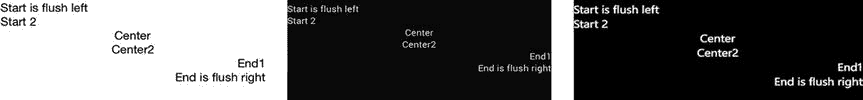

图 3-2。

Top-to-bottom stacking with vertical orientation

还有第四个横向位置:`Fill`。这会导致视图占用可用区域:

`HorizontalOptions = LayoutOptions.Fill`

在这一部分的后面，我们将介绍`Expand`布局选项(比如`FillAndExpand)`，它使视图扩展，并用空间填充视图周围的可用区域。

Tip

请确保您的布局中有足够的空间，否则这些对齐将不可见。

如果您有三个以上的视图要水平放置，最好是水平方向。

### 水平方向堆叠

xamarin.forms

还可以通过将`Orientation`属性设置为`StackOrientation.Horizontal`来水平堆叠视图，如清单 [3-3](#FPar7) 所示。所有视图都在同一水平轴上。

Listing 3-3\. StackLayoutHorizontal.cs Continued

`StackLayout stackLayoutHorizontal = new StackLayout {`

`Spacing = 0,`

`Orientation = StackOrientation.Horizontal,`

`Children = {`

`new Label {`

`Text = "Start------"`

`},`

`new Label {`

`Text = "------Center------",`

`HorizontalOptions = LayoutOptions.CenterAndExpand`

`},`

`new Label {`

`Text = "------End"`

`}`

`}`

`};`

图 [3-3](#Fig3) 显示了每个视图如何放置在它的兄弟视图的右边。

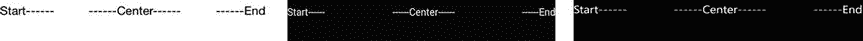

图 3-3。

Left-to-right stacking with horizontal orientation

展开的`LayoutOptions`的水平填充分隔视图。将中心视图的`HorizontalOptions`设置为`LayoutOptions.CenterAndExpand`为中心视图的左侧和右侧提供了空间。

您可以通过将`Orientation`设置为`StackOrientation.Horizontal`来对视图进行水平排序，尽管精确的放置是不可能的。视图按照添加到`Children`集合的顺序从左到右堆叠，并带有来自`HorizontalOptions`的提示。

图 [3-4](#Fig4) 显示了如果我们在前面视图的右边再添加一些视图的话`StackLayout`的样子。

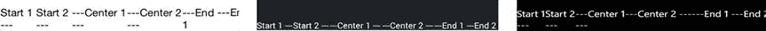

图 3-4。

Six views stacked left to right

清单 [3-4](#FPar8) 是带有这些额外视图的代码。在在线代码示例中，我在包含更简单示例的`StackLayoutHorizontal.cs`和添加额外视图的`StackLayoutVertical.cs`之间来回移动。

Listing 3-4\. StackLayoutVertical`.cs` with Views Using HorizontalOptions

`StackLayout stackLayoutHorizontal = new StackLayout {`

`Spacing = 0,`

`Orientation = StackOrientation.Horizontal,`

`Children = {`

`new Label {`

`Text = "Start 1 ---"`

`},`

`new Label {`

`Text = "Start 2 ---"`

`},`

`new Label {`

`Text = "---Center 1 ---",`

`HorizontalOptions = LayoutOptions.CenterAndExpand`

`},`

`new Label {`

`Text = "---Center 2 ---",`

`HorizontalOptions = LayoutOptions.CenterAndExpand`

`},`

`new Label {`

`Text = "---End 1 "`

`},`

`new Label {`

`Text = "---End 2 "`

`}`

`}`

`};`

如果要将子布局合并到父布局中，请考虑嵌套布局。

### 嵌套布局

布局可以包含`Children`属性中的其他布局。

`A complex page with multiple rows of horizontally oriented views is accomplished with nested StackLayouts:`

`this.Content = new StackLayout`

`{`

`Children =`

`{`

`stackLayout,`

`stackLayoutHorizontal`

`}`

`};`

Tip

如果使用一个以上的嵌套`StackLayout`，应考虑其他布局，如`RelativeLayout`、`AbsoluteLayout`或`Grid`，它们有助于提高复杂性。

控制布局中视图的大小和它们之间的间距对于格式化很重要。

### 使用 LayoutOptions 扩展和填充视图

xamarin.forms

使用`Expand`布局选项扩展视图或用空间填充可用区域。`FillAndExpand`使视图增长，但不在其周围创建填充空间。所有其他扩展选项在视图周围填充空间。

Tip

如果使用`BackgroundColor`属性为视图设置背景颜色，这些特性会更容易看到。

以下是`HorizontalOptions`从左到右的格式选项:

*   `FillAndExpand`向右扩展视图:

`HorizontalOptions = LayoutOptions.FillAndExpand;`

*   `StartAndExpand`向右填充空格:

`HorizontalOptions = LayoutOptions.StartAndExpand;`

*   `EndAndExpand` -带空格的左侧填充:

`HorizontalOptions = LayoutOptions.EndAndExpand;`

*   `CenterAndExpand`带间距的左右衬垫:

`HorizontalOptions = LayoutOptions.CenterAndExpand;`

以下从上到下的格式选项可用于`VerticalOptions`:

*   `FillAndExpand` -将视图扩展到底部:

`VerticalOptions = LayoutOptions.FillAndExpand;`

*   `StartAndExpand` -垫至底部并留有空间:

`VerticalOptions = LayoutOptions.StartAndExpand;`

*   `EndAndExpand` -填充到顶部并留有空间:

`VerticalOptions = LayoutOptions.EndAndExpand`

*   `CenterAndExpand` -顶部和底部有空间的衬垫:

`VerticalOptions = LayoutOptions.CenterAndExpand;`

Note

只有当布局中有兄弟视图时，布局选项才有用。

### 代码完成:StackLayout

xamarin.forms

清单 [3-5](#FPar13) 显示了我们的完整 StackLayout 示例，包括垂直和水平布局、`HorizontalOptions`的使用以及`Expand`布局选项，如图 [3-5](#Fig5) 所示。

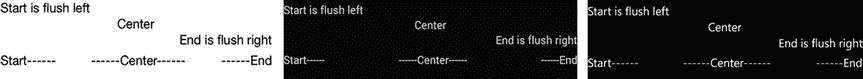

图 3-5。

Two StackLayouts: one vertical and one horizontal XAML

这些例子的 XAML 版本可以在 Apress.com(从源代码/下载选项卡，访问这本书的标题)或 GitHub 的 [`https://github.com/danhermes/xamarin-book-examples`](https://github.com/danhermes/xamarin-book-examples) 找到。Xamarin。表格解决方案为[第三章](03.html)为`LayoutExample.Xaml`。

Listing 3-5\. StackLayoutHorizontal.cs Code Complete

`using System;`

`using Xamarin.Forms;`

`namespace LayoutExample`

`{`

`public class StackLayoutHorizontal : ContentPage`

`{`

`public StackLayoutHorizontal()`

`{`

`StackLayout stackLayout = new StackLayout {`

`Spacing = 0,`

`Children = {`

`new Label {`

`Text = "Start is flush left",`

`HorizontalOptions = LayoutOptions.Start,`

`},`

`new Label {`

`Text = "Center",`

`HorizontalOptions = LayoutOptions.Center`

`},`

`new Label {`

`Text = "End is flush right",`

`HorizontalOptions = LayoutOptions.End`

`}`

`}`

`};`

`StackLayout stackLayoutHorizontal = new StackLayout {`

`Spacing = 0,`

`Orientation = StackOrientation.Horizontal,`

`Children = {`

`new Label {`

`Text = "Start------"`

`},`

`new Label {`

`Text = "------Center------",`

`HorizontalOptions = LayoutOptions.CenterAndExpand`

`},`

`new Label {`

`Text = "------End"`

`}`

`}`

`};`

`// Padding on edges and a bit more for iPhone top status bar`

`this.Padding = new Thickness(10, Device.OnPlatform(20, 0, 0), 10, 5);`

`this.Content = new StackLayout`

`{`

`Children =`

`{`

`stackLayout,`

`stackLayoutHorizontal`

`}`

`};`

`}`

`}`

`}`

### 相对布局

xamarin.forms

`RelativeLayout`自动将其元素缩放至不同的屏幕尺寸。该布局由父布局视图及其子视图组成，由视图之间的关系定义。通过使用约束，每个子视图都与其同级视图或父布局视图相关联。约束可以绑定视图位置和大小:x/y 坐标和宽度/高度尺寸。`RelativeLayout`允许我们创建一个相互连接的视图网络，像橡皮筋一样伸展以适应屏幕，提供内置的响应设计或自动布局。

Tip

`RelativeLayout`对于必须在各种分辨率下都能很好显示的应用非常有用，例如手机和平板电脑。

让我们从一个新的`ContentPage`开始，创建一个`RelativeLayout`实例，并在布局的左上角放置一个标签 0，0，如清单 [3-6](#FPar15) 所示。

Listing 3-6\. Starting RelativeLayoutExample.cs

`public class RelativeLayoutExample  : ContentPage`

`{`

`public RelativeLayoutExample ()`

`{`

`RelativeLayout relativeLayout = new RelativeLayout();`

`Label upperLeft = new Label`

`{`

`Text = "Upper Left",`

`FontSize = 20`

`};`

`relativeLayout.Children.Add (upperLeft,`

`Constraint.Constant (0),`

`Constraint.Constant (0));`

`//  add more views here`

`Content = relativeLayout;`

`}`

`}`

左上标签添加了对父布局的位置约束；对 x 和 y 使用`Constraint.Constant(0)`将标签放置在左上角，原点:0，0。接下来，我们希望添加更多与现有父视图和子视图相关的视图。

### 设置视图位置和大小

xamarin.forms

每次我们向`RelativeLayout`添加视图时，我们会问:我们是要设置视图的位置、视图的大小，还是两者都要？

用这个`Add`方法指定位置:

`relativeLayout.Children.Add(view, xLocationConstraint,`

`yLocationConstraint)`

用这个指定大小和位置:

`relativeLayout.Children.Add(view, xLocationConstraint,`

`yLocationConstraint, widthConstraint, heightConstraint)`

所有这些 x/y 坐标、宽度和高度最终都变成了绝对值。然而，数据类型限制了我们对`Constraint`类的使用。这鼓励基于兄弟和父视图的值进行计算，保持事物的相对性。

### 使用约束

xamarin.forms

大小和位置通过使用约束来指定。`Constraint`对象有三个枚举:

*   `Constant`，用于位置和/或尺寸的绝对 x/y 分配
*   `RelativeToParent`，用于相对于父布局的位置和/或大小的相对 x/y 计算
*   `RelativeToView`，用于子(兄弟)视图之间位置和/或大小的相对 x/y 计算

下面几节将更详细地讨论每一个问题。

#### 绝对位置和大小

`Constant`用于绝对位置或大小。

下面是一个位置示例，它将`upperLeft`标签放置在布局中的坐标 0，0 处:

`relativeLayout.Children.Add (upperLeft,`

`Constraint.Constant (0),`

`Constraint.Constant (0));`

这是一个尺寸示例，创建一个尺寸为 100，100 的视图，尺寸为 50 个单位宽，200 个单位高:

`Label constantLabel = new Label`

`{`

`Text = "Constants are Absolute",`

`FontSize = 20`

`};`

`relativeLayout.Children.Add (constantLabel,`

`Constraint.Constant (100),`

`Constraint.Constant (100),`

`Constraint.Constant (50),`

`Constraint.Constant (200));`

Tip

许多计算机中使用的数字屏幕单元。窗体视图是不代表像素的相对度量单位，其结果因屏幕大小而异。

这个新标签如图 [3-6](#Fig6) 所示，文本以 50 个单位的宽度换行。

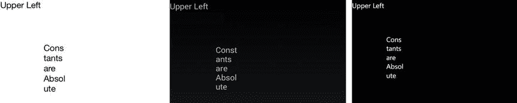

图 3-6。

Label with a Constant contraint

#### 相对双亲约束

`RelativeToParent`约束将视图的位置/大小绑定到父`RelativeLayout`视图。这对于相对于整个页面或部分放置视图和调整视图大小非常有用。

实例化另一个子视图，比如`Label`，并使用`RelativeToParent`约束将其添加到子集合中。此示例将新的子视图的位置放在父布局长度和宽度的中间:

`Label halfwayDown = new Label`

`{`

`Text = "Halfway down and across",`

`FontSize = 15`

`};`

`relativeLayout.Children.Add (halfwayDown,`

`Constraint.RelativeToParent((parent) =>`

`{`

`return parent.Width / 2;`

`}),`

`Constraint.RelativeToParent((parent) =>`

`{`

`return parent.Height / 2;`

`})`

`);`

这些对`RelativetoParent`的调用将父视图`RelativeLayout`传递给 lambda 参数，返回一个等于父布局一半宽度的 x 坐标和一个等于布局一半高度的 y 坐标(见图 [3-7](#Fig7) )。

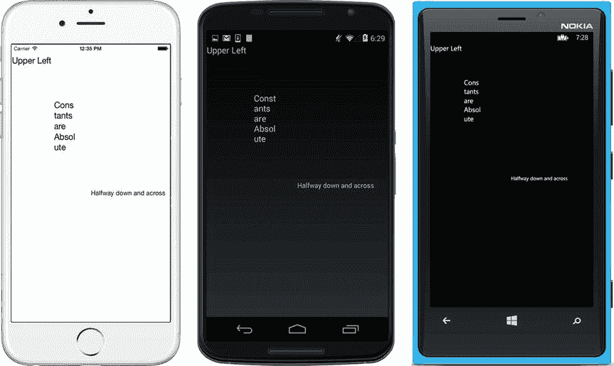

图 3-7。

RelativeToParent with a Height and Width calculation

下面是一般情况下的`Constraint.RelativeToParent`方法:

`Constraint.RelativeToParent ((parent) =>`

`{`

`return calculatedValue`

`})`

使用父属性`X`、`Y`、`Width`和`Height`来计算返回值。

以下是为位置返回的有用计算值的示例:

*   `parent.X + parent.Width;`将视图定位在父视图的右侧。
*   `parent.X + parent.Width /2;`将视图定位在父视图宽度的一半。
*   `parent.Y + parent.Height;`定位父视图下方的视图。
*   `parent.Y + parent.Height/2;`将视图定位在父视图高度的一半。

以下是尺寸值:

*   `parent.Width;`使宽度与父布局的宽度相同。
*   `parent.Width / 2;`使宽度为父布局的一半。
*   `parent.Height;`使高度与父布局的高度相同。
*   `parent.Height / 2;`使高度为父布局的一半。

`Create a BoxView halfway down the page that is half the height and half the width of the parent view by passing RelativeToParent calculations into the Add parameters:`

`BoxView boxView = new BoxView {`

`Color = Color.Accent,`

`WidthRequest = 150,`

`HeightRequest = 150,`

`HorizontalOptions = LayoutOptions.Center,`

`VerticalOptions = LayoutOptions.CenterAndExpand`

`};`

`relativeLayout.Children.Add (boxView,`

`Constraint.Constant (0),`

`Constraint.RelativeToParent((parent) =>`

`{`

`return parent.Height / 2;`

`}),`

`Constraint.RelativeToParent((parent) =>`

`{`

`return parent.Width / 2;`

`}),`

`Constraint.RelativeToParent((parent) =>`

`{`

`return parent.Height / 2;`

`})`

`);`

结果如图 [3-8](#Fig8) 所示。

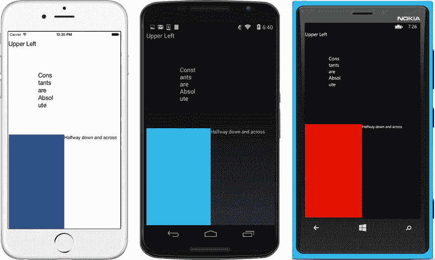

图 3-8。

A BoxView placed using RelativeToParent

#### 相对视图约束

将一个视图的位置/大小限制为另一个视图的位置/大小。实例化另一个子视图，比如一个`Label`，并使用一个`RelativeToView`约束将它添加到子集合中。此示例将新的子视图的位置放在同级视图的下方:

`Label below = new Label`

`{`

`Text = "Below Upper Left",`

`FontSize = 15`

`};`

`relativeLayout.Children.Add (below,`

`Constraint.Constant (0),`

`Constraint.RelativeToView(upperLeft, (parent, sibling) =>`

`{`

`return sibling.Y + sibling.Height;`

`})`

`);`

对`RelativetoView`的这个调用在第一个参数`upperLeft`中传递兄弟视图，然后将父节点和兄弟节点传递到 lambda 参数中，返回一个计算出来的 y 坐标，等于兄弟节点下面的 y 值，如图 [3-9](#Fig9) (针对 Android)。

图 3-9。

Place one label below another by using `RelativetoView`

下面是一般情况下的`Constraint.RelativeToView`方法:

`Constraint.RelativeToView(siblingView, (parent, sibling) =>`

`{`

`return calculatedValue`

`})`

您现在有三个视图:新的子视图、锚定同级视图和父视图或布局。使用父属性或同级属性`X`、`Y`、`Width`和`Height`来计算要分配给子对象的返回值。以下是为位置返回的有用计算值的示例:

*   `sibling.X + sibling.Width;`将视图定位在同级视图的右侧。
*   `sibling.X + sibling.Width /2;`将视图定位在同级宽度的中间。
*   `sibling.Y + sibling.Height;`定位同级下的视图。
*   `sibling.Y + sibling.Height/2;`将视图定位在同级高度的一半。

以下是类似的尺寸值:

*   `sibling.Width;`使宽度与同级相同。
*   `sibling.Width / 2;`使宽度为同级宽度的一半。
*   `sibling.Height;`使身高与同胞相同。
*   使身高为兄弟姐妹的一半。

Tip

`sibling`和`parent`对象包含这些视图中所有可用的属性。除了这里提到的属性之外，其他的属性可能会对你的计算有用，所以一定要探索一下。

### 代码完成:RelativeLayout

xamarin.forms

清单 [3-7](#FPar19) 是我们使用`Constraints` : `Constant`、`RelativeToParent`和`RelativeToView`的`RelativeLayout`的完整代码示例(参见图 [3-10](#Fig10) )。

图 3-10。

RelativeLayoutExample.cs using all the constraint types XAML

这些例子的 XAML 版本可以在 Apress.com 上找到(从源代码/下载选项卡，访问这本书的标题)，或者在 GitHub 上的 [`https://github.com/danhermes/xamarin-book-examples`](https://github.com/danhermes/xamarin-book-examples) 找到。Xamarin。表格解决方案为[第三章](03.html)为`LayoutExample.Xaml`。

Listing 3-7\. RelativeLayoutExample.cs Code Complete

`using System;`

`using Xamarin.Forms;`

`namespace LayoutExample`

`{`

`public class RelativeLayoutExample : ContentPage`

`{`

`public RelativeLayoutExample ()`

`{`

`RelativeLayout relativeLayout = new RelativeLayout();`

`Label upperLeft = new Label`

`{`

`Text = "Upper Left",`

`FontSize = 20,`

`};`

`relativeLayout.Children.Add (upperLeft,`

`Constraint.Constant (0),`

`Constraint.Constant (0));`

`Label below = new Label`

`{`

`Text = "Below Upper Left",`

`FontSize = 15,`

`};`

`relativeLayout.Children.Add (below,`

`Constraint.Constant (0),`

`Constraint.RelativeToView(upperLeft, (parent, sibling) =>`

`{`

`return sibling.Y + sibling.Height;`

`})`

`);`

`Label constantLabel = new Label`

`{`

`Text = "Constants are Absolute",`

`FontSize = 20`

`};`

`relativeLayout.Children.Add (constantLabel,`

`Constraint.Constant (100),`

`Constraint.Constant (100),`

`Constraint.Constant (50),`

`Constraint.Constant (200));`

`Label halfwayDown = new Label`

`{`

`Text = "Halfway down and across",`

`FontSize = 15`

`};`

`relativeLayout.Children.Add (halfwayDown,`

`Constraint.RelativeToParent((parent) =>`

`{`

`return parent.Width / 2;`

`}),`

`Constraint.RelativeToParent((parent) =>`

`{`

`return parent.Height / 2;`

`})`

`);`

`BoxView boxView = new BoxView {`

`Color = Color.Accent,`

`HorizontalOptions = LayoutOptions.Start,`

`VerticalOptions = LayoutOptions.StartAndExpand`

`};`

`relativeLayout.Children.Add (boxView,`

`Constraint.Constant (0),`

`Constraint.RelativeToParent((parent) =>`

`{`

`return parent.Height / 2;`

`}),`

`Constraint.RelativeToParent((parent) =>`

`{`

`return parent.Width / 2;`

`}),`

`Constraint.RelativeToParent((parent) =>`

`{`

`return parent.Height / 2;`

`})`

`);`

`Content = relativeLayout;`

`}`

`}`

`}`

### 绝对布局

xamarin.forms

`AbsoluteLayout`是放置在范围从 0 到 1 的 x/y 坐标上并且大小受限的视图的集合。位置通常不是绝对的，因为我们很少使用依赖于设备的 x 或 y 坐标。位置通常相对于原点处的 0 和单轴上最远点处的 1。布局是绝对的，因为视图会准确地出现在你放置它们的地方，甚至在其他视图的上面，所以这对于分层很有用。

使用`SetLayoutBounds`,`AbsoluteLayout`中的每个视图都绑定到一个边界对象，该对象可以是一个点或一个矩形。使用`SetLayoutFlags`，包围点可以确定位置，而包围矩形可以确定位置和大小。

清单 [3-8](#FPar20) 提供了一个`AbsoluteLayout`的例子。

Listing 3-8\. Starting AbsoluteLayoutExample.cs

`AbsoluteLayout absoluteLayout = new AbsoluteLayout`

`{`

`VerticalOptions = LayoutOptions.FillAndExpand`

`};`

`// Add Views here`

`this.Content = absoluteLayout;`

现在我们将添加一些视图。首先是一个`Label`控件。

`Label firstLabel = new Label`

`{`

`Text = "FirstLabel"`

`};`

为了给`AbsoluteLayout`分配一个视图，控件被添加到`AbsoluteLayout`集合中，然后设置`LayoutFlags`和`LayoutBounds`来定义视图的位置和大小。一条语句就可以完成所有这些事情。下面是实现它的方法和参数:

`absoluteLayout.Children.Add (firstLabel, new Rectangle (xCoordinate,`

`yCoordinate, xWidth, xHeight), AbsoluteLayoutFlags);`

`Rectangle`参数都是从 0 到 1 的 doubles，很快会更深入的讨论。下面是一个代码示例:

`absoluteLayout.Children.Add (firstLabel, new Rectangle (0, 0,`

`AbsoluteLayout.AutoSize, AbsoluteLayout.AutoSize),`

`AbsoluteLayoutFlags.PositionProportional);`

这会将标签视图作为子视图添加到布局集合中，并定义一个包含两条信息的边框对象:视图的位置和大小。它还用`LayoutFlags`将视图与矩形联系起来，以指定边界框与其视图之间的关系。以下是手写版本:

`absoluteLayout.Children.``Add`T2】

`AbsoluteLayout.``SetLayoutFlags`T2】

`AbsoluteLayoutFlags.PositionProportional);`

`AbsoluteLayout.``SetLayoutBounds`T2】

`new Rectangle(0, 0, AbsoluteLayout.AutoSize, AbsoluteLayout.AutoSize));`

在手写代码中，您可以看到以下步骤:将子视图添加到集合中，设置标志，然后设置边界。图 [3-11](#Fig11) 显示结果(针对 Android)。

图 3-11。

Add a label to AbsoluteLayout Tip

`AbsoluteLayout.AutoSize`调整视图中内容的高度或宽度。

Note

`HorizontalOptions`、`VerticalOptions`和`Expand`布局选项被绝对定位覆盖。

### 使用 SetLayoutBounds 创建边界对象

xamarin.forms

`AbsoluteLayout`中的视图可以放在点上，也可以用矩形(不可见的)包围。当只需要一个没有大小区域的位置时，点就派上用场了。矩形和点是在`SetLayoutBounds`中指定的边界对象。

让我们继续另一个矩形的例子。创建第二个标签，将其添加到布局中，然后设置布局标志和边界，将其放置在页面的左下角:

`Label secondLabel = new Label`

`{`

`Text = "SecondLabel"`

`};`

`absoluteLayout.Children.Add(secondLabel);`

`AbsoluteLayout.SetLayoutFlags(secondLabel,`

`AbsoluteLayoutFlags.PositionProportional);`

`AbsoluteLayout.SetLayoutBounds(secondLabel,`

`new Rectangle(0, 1, AbsoluteLayout.AutoSize,`

`AbsoluteLayout.AutoSize));`

图 [3-12](#Fig12) 显示了结果。

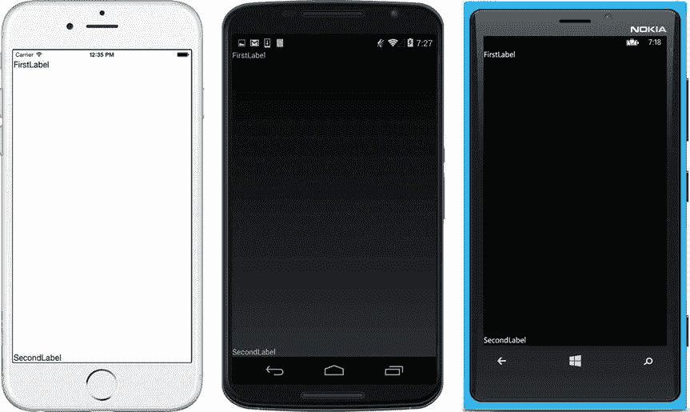

图 3-12。

secondLabel placed at the bottom of the screen with y set to 1

#### 使用矩形设置位置和大小

矩形为`AbsoluteLayout`提供放置视图的有界区域的位置和大小。这是`Xamarin.Forms.Rectangle`的构造器:

`Rectangle (double locationX, double locationY, double width, double height)`

所有参数都是从 0 到 1 的双精度值。以下是实例化矩形的几个示例，以及参数如何影响位置:

*   位于最大宽度和高度的原点:`new Rectangle (0, 0, 1, 1)`
*   在提供的空间水平居中:`new Rectangle (.5, 0, 1, 1)`
*   在提供的空间垂直居中:`new Rectangle (0, .5, 1, 1)`
*   在提供的空间水平和垂直居中:`new Rectangle (.5, .5, 1, 1)`

以下是影响尺寸的参数示例:

*   位于最大宽度和高度的原点:`new Rectangle (0, 0, 1, 1)`
*   位于原点 20%宽度:`new Rectangle (0, 0, .2, 1)`
*   位于原点 20%高度:`new Rectangle (0, 0, 1, .2)`
*   位于原点 20%宽度和高度:`new Rectangle (0, 0, .2, .2)`

Tip

本章中的`AbsoluteLayout`示例显示了相对单位，因为这是普遍推荐的跨平台方法。`AbsoluteLayout`也可以使用设备特定的单位。请确保您知道自己在做什么，因为特定于设备的单元可能会导致不同平台和设备之间的结果不一致。指定`AbsoluteLayoutFlags.None`,然后使用浮点值大于 1 的设备特定单位:

`AbsoluteLayout.SetLayoutFlags(secondLabel,AbsoluteLayoutFlags.None);`

`AbsoluteLayout.SetLayoutBounds(secondLabel,`

`new Rectangle (250f, 250f, 200f, 50f));`

#### 使用点设置位置

不需要大小时，点可以指定视图的位置。通过使用一个点，可以非常简单地将视图添加到`AbsoluteLayout`:

`absoluteLayout.Children.Add (firstLabel, new Point(0,0));`

点的工作方式就像矩形的位置部分，通过使用范围从 0 到 1 的双精度值来定义 x 和 y 位置。下面是`Point`构造函数:

`Point( double locationX, double locationY)`

在使用`SetLayoutFlags`将点和矩形绑定到视图的位置或大小之前，它们只是几何对象。

### 使用 SetLayoutFlags 绑定到绑定对象

xamarin.forms

布局标志描述了视图和边界对象在位置和大小方面的关系。除非使用布局标志创建关系，否则边界对象的定义对关联视图没有影响。这种关系在子视图和边界矩形或点之间建立了关联。下面一行代码将`firstLabel`视图与其边界对象的位置相关联:

`AbsoluteLayout.SetLayoutFlags(firstLabel,`

`AbsoluteLayoutFlags.PositionProportional);`

视图和边界对象之间的关系由第二个参数`SetLayoutFlags`中的`AbsoluteLayoutFlags`决定。这可以通过位置、大小或位置和大小来完成。

Tip

最常用的布局标志是`PositionProportional`和`All`，因为我们通常要么放置一个视图，要么同时放置和调整它的大小。

Tip

图像大小适合这种方式:

`absoluteLayout.Add (image, new Rectangle (0, 0, 1, 1),`

`AbsoluteLayoutFlags.All);`

#### 绑定位置

使用以下标志将边界对象的 x/y 位置绑定到视图:

*   `PositionProportional`将矩形或点的 x/y 位置与视图位置相关联:

`AbsoluteLayout.SetLayoutFlags(firstLabel,`

`AbsoluteLayoutFlags.PositionProportional);`

如果矩形或点位于 0，0，视图将位于 0，0。

*   `XProportional`将矩形或点的 x 坐标与视图的位置相关联:

`AbsoluteLayout.SetLayoutFlags(firstLabel,`

`AbsoluteLayoutFlags.XProportional);`

*   `YProportional`将矩形或点的 y 坐标与视图的位置相关联:

`AbsoluteLayout.SetLayoutFlags(firstLabel,`

`AbsoluteLayoutFlags.YProportional);`

#### 装订尺寸

使用以下标志将边界对象的大小绑定到视图:

*   `SizeProportional`将矩形尺寸与视图尺寸相关联:

`AbsoluteLayout.SetLayoutFlags(firstLabel,`

`AbsoluteLayoutFlags.SizeProportional);`

如果矩形的大小为 0.2，. 5，则视图的大小将为 0.2，. 5。

*   `WidthProportional`将矩形宽度与视图宽度相关联:

`AbsoluteLayout.SetLayoutFlags(firstLabel,`

`AbsoluteLayoutFlags.WidthProportional);`

*   `HeightProportional` -将矩形高度与视图高度相关联:

`AbsoluteLayout.SetLayoutFlags(firstLabel,`

`AbsoluteLayoutFlags.HeightProportional);`

#### 绑定位置和大小

使用`All`或`None`用矩形或点连接(或断开)位置和尺寸。

*   `All`将矩形或点的 x/y 位置和大小与视图的位置和大小相关联:

`AbsoluteLayout.SetLayoutFlags(firstLabel,`

`AbsoluteLayoutFlags.All);`

*   `None`解除矩形或点与视图的关联:

`AbsoluteLayout.SetLayoutFlags(firstLabel,`

`AbsoluteLayoutFlags.None);`

### 代码完成:AbsoluteLayout

xamarin.forms

清单 [3-9](#FPar26) 使用`AbsoluteLayout`将标签添加到之前图 [3-12](#Fig12) 所示屏幕的顶部和底部。这个例子使用了带有一些不同方式的边界矩形来添加第一个`Label`(比如使用缩写的`Add`重载和使用点而不是边界矩形)。

Listing 3-9\. AbsoluteLayoutExample.cs Using Rectangles and Points

`using System;`

`using Xamarin.Forms;`

`namespace LayoutExample`

`{`

`public class AbsoluteLayoutExample : ContentPage`

`{`

`public AbsoluteLayoutExample ()`

`{`

`AbsoluteLayout absoluteLayout = new AbsoluteLayout`

`{`

`VerticalOptions = LayoutOptions.FillAndExpand`

`};`

`Label  firstLabel = new Label`

`{`

`Text = "FirstLabel"`

`};`

`absoluteLayout.Children.Add(firstLabel);`

`AbsoluteLayout.SetLayoutFlags(firstLabel,`

`AbsoluteLayoutFlags.PositionProportional);`

`AbsoluteLayout.SetLayoutBounds(firstLabel,`

`new Rectangle(0, 0, AbsoluteLayout.AutoSize,`

`AbsoluteLayout.AutoSize));`

`//  OR`

`//absoluteLayout.Children.Add (firstLabel, new Rectangle (0, 0,`

`//AbsoluteLayout.AutoSize, AbsoluteLayout.AutoSize),`

`//AbsoluteLayoutFlags.PositionProportional);`

`// OR`

`//absoluteLayout.Children.Add (firstLabel, new Point(1,0));`

`//AbsoluteLayout.SetLayoutFlags(firstLabel,`

`//AbsoluteLayoutFlags.PositionProportional);`

`Label  secondLabel = new Label`

`{`

`Text = "SecondLabel"`

`};`

`absoluteLayout.Children.Add(secondLabel);`

`AbsoluteLayout.SetLayoutFlags(secondLabel,`

`AbsoluteLayoutFlags.PositionProportional);`

`AbsoluteLayout.SetLayoutBounds(secondLabel,`

`new Rectangle(0, 1,`

`AbsoluteLayout.AutoSize, AbsoluteLayout.AutoSize));`

`this.Content = absoluteLayout;`

`}`

`}`

`}`

XAML

这些例子的 XAML 版本可以在 Apress.com(从源代码/下载选项卡，访问这本书的标题)或 GitHub 的 [`https://github.com/danhermes/xamarin-book-examples`](https://github.com/danhermes/xamarin-book-examples) 找到。Xamarin。表格解决方案为[第三章](03.html)为`LayoutExample.Xaml`。

### 格子

xamarin.forms

`Grid`是一个类似表格的视图容器。它被组织成行和列，每一行和列都有一个高度和宽度，放置在称为单元格的特定行/列坐标上。`GridUnitType`提供调整行和列大小的选项，而`grid.Children.Add`方法允许单单元格和多单元格视图。[`ColumnSpacing`](http://iosapi.xamarin.com/monodoc.ashx?link=P%3aXamarin.Forms.Grid.ColumnSpacing)`RowSpacing`提供单元格之间的填充。

Tip

`TableView`是另一个基于单元格的视图，但在技术上不是布局。这对于构建简单的项目组(如设置对话框和分组菜单)非常有用。[第六章](06.html)有一个`TableView`的例子。

创建一个`Grid`对象并定义一个单独的行和列，如清单 [3-10](#FPar29) 所示。

Listing 3-10\. Starting GridExample1.cs

`Grid grid = new Grid`

`{`

`VerticalOptions = LayoutOptions.FillAndExpand,`

`RowDefinitions =`

`{`

`new RowDefinition { Height = GridLength.Auto }`

`},`

`ColumnDefinitions =`

`{`

`new ColumnDefinition { Width = GridLength.Auto }`

`}`

`};`

`this.Content = grid;`

在每个`RowDefinition`中指定`Height`，在每个`ColumnDefinition. GridLength.Auto`中指定`Width`，自动调整`Height`或`Width`单元格的大小。

Tip

`Height`和`Width`、`GridLength(1, GridUnitType.Star)`的默认`GridLength`设置，尽可能扩大行或列的尺寸。

在表格中唯一的单元格第 0 列添加一个视图:

`grid.Children.Add(new Label`

`{`

`Text = "I'm at 0,0",`

`FontSize = 30`

`}, 0, 0);`

这是单细胞视图的一般情况`Add`:

`Grid.Children.Add( view, indexColumn, indexRow)`

现在，让我们将这个表扩展到四行三列:

`Grid grid = new Grid`

`{`

`VerticalOptions = LayoutOptions.FillAndExpand,`

`RowDefinitions =`

`{`

`new RowDefinition { Height = GridLength.Auto },`

`new RowDefinition { Height = GridLength.Auto },`

`new RowDefinition { Height = GridLength.Auto },`

`new RowDefinition { Height = GridLength.Auto }`

`},`

`ColumnDefinitions =`

`{`

`new ColumnDefinition { Width = GridLength.Auto },`

`new ColumnDefinition { Width = GridLength.Auto },`

`new ColumnDefinition { Width = GridLength.Auto }`

`}`

`};`

然后在(1，1)、(2，2)和(0，3)处再添加三个视图。添加一点标签格式来使事情更令人兴奋:

`grid.Children.Add(new Label`

`{`

`Text = "Me? 1,1",`

`FontSize = 30,`

`FontAttributes = FontAttributes.Bold,`

`TextColor = Color.Black,`

`BackgroundColor = Color.Lime`

`}, 1, 1);`

`grid.Children.Add(new Label`

`{`

`Text = "2,2 here",`

`FontSize = 25,`

`FontAttributes = FontAttributes.Bold,`

`TextColor = Color.White,`

`BackgroundColor = Color.Red`

`}, 2, 2);`

`grid.Children.Add(new Label`

`{`

`Text = "I'm at 0,3",`

`FontSize = 30,`

`FontAttributes = FontAttributes.Bold`

`}, 0, 3);`

图 [3-13](#Fig13) 显示了带有四个标签的`Grid`，完成了`GridExample1.cs`中的代码。

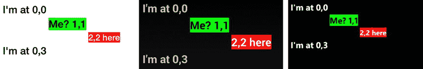

图 3-13。

Grid containing four views

`GridLength.Auto`为我们处理列宽和行高，扩展以适应视图内容。

Tip

空单元格会影响您的网格。设置为`Height = GridLength.Auto`的不包含视图的行的高度为零。设置为`Width = GridLength.Auto`的不包含视图的列的宽度为零。

Tip

下面是行和列定义的快捷方式。默认情况下，`RowDefinition()`和`ColumnDefinition()`构造函数使用`GridUnitType.Star`，所以`new RowDefinition { Height = GridLength(1, GridUnitType.Star) }`可以通过

`new RowDefinition()`

而`new ColumnDefinition { Width = GridLength(1, GridUnitType.Star) }`是这样的:

`new ColumnDefinition()`

为了跟随在线示例，保存您当前的示例`GridExample1.cs`，然后创建一个名为`GridExample2.cs`的新类。将`GridExample1.cs`中构造器的内容复制到`GridExample2.cs`中，继续与`GridExample2.cs`一起工作。记得更新你的应用类(比如用新的`MainPage`引用`GridExample2`。

### 调整行和列的大小

xamarin.forms

行和列的大小由`GridLength`决定。您可以自动调整、扩展或设置行或列的特定高度和宽度。`GridLength`由其`GridUnitType`定义，其中有三个:

*   `Auto`根据内容调整行或列的尺寸。
*   `Absolute`表示行或列的数值维度。
*   `Star`是默认设置，尽可能扩大一行或一列的维度，将后续的行或列推到边缘。

将一个`GridLength`对象分配给`RowDefinitions`中的`Height`:

`new RowDefinition { Height = new GridLength(200, GridUnitType.Absolute)`

或`ColumnDefinition`中的`Width`:

`new ColumnDefinition { Width = GridLength.Auto }`

### 调整大小以适合视图

xamarin.forms

`GridUnitType`的`Auto`值将行或列的大小调整为所包含视图的大小。我们的`Grid`示例完全由`Auto`大小的行组成，我们使用一个简写的`GridLength`构造函数来分配这些行:

`GridLength.Auto`

它返回一个类型为`GridUnitType.Auto`的`GridLength`。以下是手写方法:

`new GridLength(1,``GridUnitType.Auto`T2】

对于`GridUnitType.Auto`，双精度值为 1 的第一个参数被忽略。现在让我们添加`Absolute`和`Star`，它们使用的是手写的`GridLength`方法。

Tip

与`UnitType.Auto`一起使用的小视图可以使行或列看起来好像丢失了。`GridUnitType.Star`用于将网格扩展到适当的比例。请参阅本章后面的“按比例扩展视图”。

### 设置精确尺寸

xamarin.forms

`GridUnitType`的`The Absolute`值设置行或列的精确高度或宽度。这是一般情况下的方法:

`new GridLength(unitSize, GridUnitType.Absolute)`

将第二个`RowDefinition Height`更改为 200 个单位的绝对尺寸:

`RowDefinitions =`

`{`

`new RowDefinition { Height = GridLength.Auto },`

`new RowDefinition { Height = new GridLength(200,`

`GridUnitType.Absolute) },`

`new RowDefinition { Height = GridLength.Auto },`

`new RowDefinition { Height = GridLength.Auto }`

`},`

第二行设置为单位的绝对高度，垂直拉伸，如图 [3-14](#Fig14) 所示。该代码位于`GridExample2.cs`中。

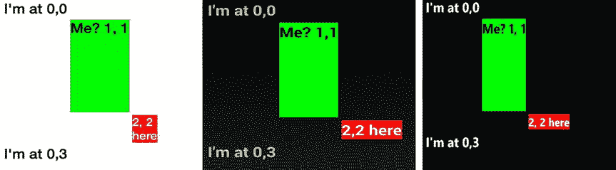

图 3-14。

Using GridUnitType.Absolute to set a tall row height at 1,1

使用`GridUnitType.Absolute`分配的`Width`工作方式类似于`Height`分配:

`new RowDefinition { Width = new GridLength(200, GridUnitType.Absolute) }`

### 扩展视图以适应可用空间

xamarin.forms

`Height`和`Width`的默认设置`GridUnitType.Star`，在行或列内扩展视图以填充可用空间。这对于在屏幕边缘水平填充列或垂直填充行非常有用，尤其是当视图很小时。它的行为类似于`FillAndExpand`布局选项，将填充空间插入指定的行或列。

通过设置一个`RowDefinition`的`Height`垂直扩展。将第三个`RowDefinition`改为使用`GridUnitType.Star`:

`RowDefinitions =`

`{`

`new RowDefinition { Height = GridLength.Auto },`

`new RowDefinition { Height = new GridLength(200, GridUnitType.Absolute) },`

`new RowDefinition { Height = new GridLength(1,``GridUnitType.Star`T2】

`new RowDefinition { Height = GridLength.Auto }`

`},`

`GridUnitType.Star`展开将其下的行一直推到屏幕底部，如图 [3-15](#Fig15) 所示。请记住，在许多这样的例子中，`Padding`属性被用来在页面的外部边缘创建空间(参见清单 [3-11](#FPar36) )。这就完成了`GridExample2.cs`中的代码。

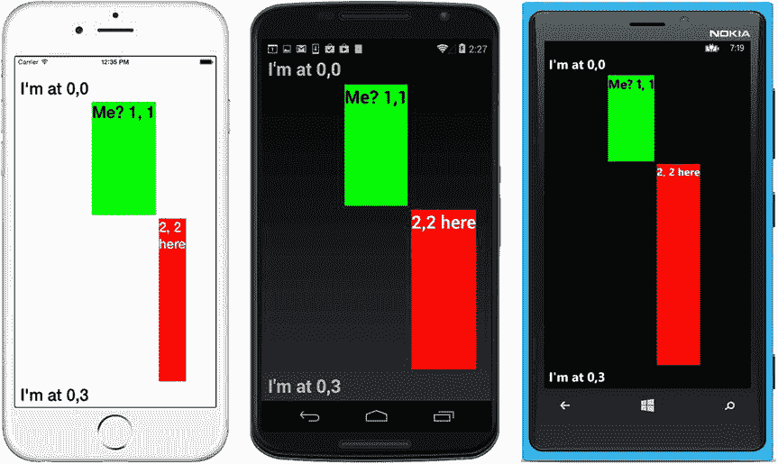

图 3-15。

Filling available vertical space by using GridUnitType.Star in the Height

通过设置使用`GridUnitType.Star`分配的`ColumnDefinition. Width`的宽度来水平扩展，工作方式类似于`Height`分配，向右扩展列，将网格按到屏幕的右边缘:

`new ColumnDefinition { Width = new GridLength(1, GridUnitType.Star) }`

### `Expanding Views Proportionally`

您可以通过使用`GridLength`中的第一个参数来控制`GridUnitType.Star`单元格中单元格大小的比例。这种技术对于小视图特别有用。

在第一个示例中，所有行中的第一个参数加起来是 3 (1 + 2)，将该行分成三个相等的部分。这导致第一行扩展到三分之一的空间，第二行扩展到三分之二的空间:

`new RowDefinition { Height = new GridLength(``1`T2】

`new RowDefinition { Height = new GridLength(``2`T2】

在下一个示例中，所有行中的第一个参数加起来是 4 (1 + 3)，将该行分成四个相等的部分。这导致第一行扩展到空间的四分之一，第二行扩展到空间的四分之三:

`new RowDefinition { Height = new GridLength(``1`T2】

`new RowDefinition { Height = new GridLength(``3`T2】

第一个参数表示在`Star`行或列中总空间的份额。如果所有这些参数都被指定为`1`，那么空间将被平均划分。

Tip

大型网格可能会脱离可见屏幕。考虑使用`GridLengthType.Star`只扩展到与垂直`ScrollView`配对的可用屏幕宽度。垂直滚动网格很常见，但在没有屏幕外内容可见指示器(页面点、箭头等)的移动应用中，水平滚动很少见。

### 创建多单元格视图

xamarin.forms

通过使用`Add`方法，可以调整单个视图的大小以跨越网格中的多个单元格:

`grid.Children.Add( view, indexLeftColumn, indexRightColumn,`

`indexTopRow, indexBottomRow)`

仍然使用从零开始的索引，通过指定最左边和最右边的列索引来跨越视图中的列。通过使用顶部和底部行索引来跨行。

#### 跨越列

通过使用`Add`方法的第二个和第三个参数`indexLeftColumn`和`indexRightColumn`，从左到右跨多个列展开视图，以指定要跨越的列。

为了跟随在线示例，保存您当前的示例`GridExample2.cs`，然后创建一个名为`GridExample3.cs`的新类。将`GridExample2.cs`中的构造器复制到`GridExample3.cs`中，然后继续`GridExample3.cs`。记得用参考`GridExample3`的新`MainPage`更新`App.cs`。

让我们将(1，1)视图扩展到右边的列，将(2，2)单元格向下扩展到它下面的行。将一个`Star`类型的`GridLength`添加到第二列，使其水平扩展:

`ColumnDefinitions =`

`{`

`new ColumnDefinition { Width = GridLength.Auto },`

`new ColumnDefinition { Width = new GridLength(1, GridUnitType.Star) },`

`new ColumnDefinition { Width = GridLength.Auto }`

`}`

将两个视图都更改为使用多池`Add`方法。从(1，1)处的视图开始:

`grid.Children.Add(new Label {`

`Text = "Me? 1, 1",`

`FontSize = 30,`

`FontAttributes = FontAttributes.Bold,`

`TextColor = Color.Black,`

`BackgroundColor = Color.Lime`

`}``, 1, 3,`T2】

从左到右，该视图从第 1 列的左侧延伸到第 3 列的左侧，距离为两列。(是的，没有可见的第 3 列有点奇怪，但符号需要一个端点，而那恰好是我们要扩展到的列或行的开始。)结果见图 [3-16](#Fig16) 。

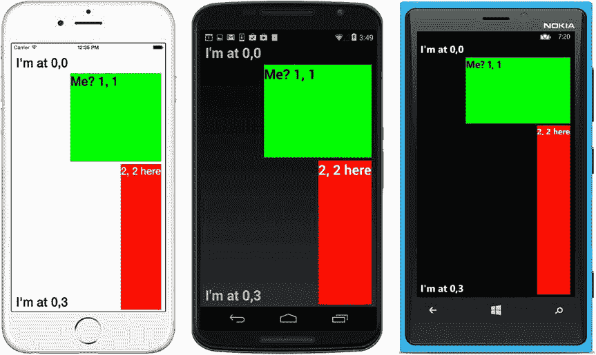

图 3-16。

The cell at 1,1 spans columns, and 2,2 spans rows

从上到下，此视图从第 1 行的顶部跨越到第 2 行的顶部(只有一行的距离)。

#### 跨越行

通过在`Add`方法的最后两个参数:`indexTopRow`和`indexBottomRow`中指定要跨越的行，将视图从一个单元格向下扩展到多行。

现在更改(2，2)处的视图:

`grid.Children.Add(new Label {`

`Text = "2, 2 here",`

`FontSize = 25,`

`FontAttributes = FontAttributes.Bold,`

`TextColor = Color.White,`

`BackgroundColor = Color.Red`

`}``, 2, 3,``2, 4`T3】

从左到右，此视图从第 2 列的左侧延伸到第 3 列的左侧。从上到下，该视图从第 2 行的顶部延伸到第 4 行的顶部(两行的距离),并产生图 [3-16](#Fig16) 中所示的内容。(没有可见的第 4 行；只是一个终点。)这就完成了`GridExample3.cs`中的代码。

Tip

除了网格属性之外，网格单元格内的视图格式通常还需要使用该视图的格式属性，例如，在`Label`视图中居中文本:

`XAlign = TextAlignment.Center,`

`YAlign = TextAlignment.Center,`

查阅您正在使用的视图的属性有助于将其精确地放置在单元格中。

### 单元格之间的填充

您可以通过使用`RowSpacing`和`ColumnSpacing. RowSpacing`来增加单元格之间的空间，其中`ColumnSpacing. RowSpacing`提供行之间的填充，而`ColumnSpacing`提供列之间的空间。下面是一个为每个对象提供 20 个填充单位的示例:

`Grid grid = new Grid`

`{`

`VerticalOptions = LayoutOptions.FillAndExpand,`

`RowSpacing = 20,`

`ColumnSpacing = 20,`

### 代码完成:网格

xamarin.forms

列表 [3-11](#FPar36) 是我们之前在图 [3-15](#Fig15) 中显示的网格示例，显示了四个标签，其中两个跨越多行或多列。

Listing 3-11\. GridExample2.cs Code Complete

`using System;`

`using Xamarin.Forms;`

`namespace LayoutExample`

`{`

`public class GridExample2 : ContentPage`

`{`

`public GridExample2()`

`{`

`Grid grid = new Grid`

`{`

`VerticalOptions = LayoutOptions.FillAndExpand,`

`RowDefinitions =`

`{`

`new RowDefinition { Height = GridLength.Auto },`

`new RowDefinition { Height = new GridLength(200, GridUnitType.Absolute) },`

`new RowDefinition { Height = new GridLength(1, GridUnitType.Star) },`

`new RowDefinition { Height = GridLength.Auto }`

`},`

`ColumnDefinitions =`

`{`

`new ColumnDefinition { Width = GridLength.Auto },`

`new ColumnDefinition { Width = new GridLength(1, GridUnitType.Star) },`

`new ColumnDefinition { Width = GridLength.Auto }`

`}`

`};`

`grid.Children.Add(new Label`

`{`

`Text = "I'm at 0,0",`

`FontSize = 30,`

`FontAttributes = FontAttributes.Bold,`

`}, 0, 0);`

`grid.Children.Add(new Label`

`{`

`Text = "Me? 1, 1",`

`FontSize = 30,`

`FontAttributes = FontAttributes.Bold,`

`TextColor = Color.Black,`

`BackgroundColor = Color.Lime`

`}, 1, 3, 1, 2);`

`grid.Children.Add(new Label`

`{`

`Text = "2, 2 here",`

`FontSize = 25,`

`FontAttributes = FontAttributes.Bold,`

`TextColor = Color.White,`

`BackgroundColor = Color.Red`

`}, 2, 3, 2, 4);`

`grid.Children.Add(new Label`

`{`

`Text = "I'm at 0,3",`

`FontSize = 30,`

`FontAttributes = FontAttributes.Bold`

`}, 0, 3);`

`// Padding on edges and a bit more for iPhone top status bar`

`this.Padding = new Thickness(10, Device.OnPlatform(20, 0, 0), 10, 5);`

`this.Content = grid;`

`}`

`}`

`}`

XAML

这些例子的 XAML 版本可以在 Apress.com(从源代码/下载选项卡，访问这本书的标题)或 GitHub 的 [`https://github.com/danhermes/xamarin-book-examples`](https://github.com/danhermes/xamarin-book-examples) 找到。Xamarin。表格解决方案为[第三章](03.html)为`LayoutExample.Xaml`。

### 全屏

xamarin.forms

布局可以作为一个可视的或者虚拟的容器类，就像一个自定义控件。`ContentView`可在你的应用中重复使用。它对于在另一个视图或布局周围提供快速填充或格式也很有用。

作为一个可视化的矩形容器，`ContentView`提供了标准的`Layout`类属性，如`Padding`、`BackgroundColor`、`HorizontalOptions`和`VerticalOptions`，很像一个. NET 面板控件。作为一个虚拟容器，它可以容纳一个包含多个视图的子布局，用于换入和换出一个页面，并在不同的页面上使用，很像一个. NET 自定义控件或 Android 片段。

这是一个简单的`ContentView`，一个带有白色文本标签的柔和的蓝绿色矩形:

`ContentView contentView = new ContentView`

`{`

`BackgroundColor = Color.Teal,`

`Padding = new Thickness(40),`

`HorizontalOptions = LayoutOptions.Fill,`

`Content = new Label`

`{`

`Text = "a view, such as a label, a layout, or a layout of layouts",`

`FontSize = 20,`

`FontAttributes = FontAttributes.Bold,`

`TextColor = Color.White`

`}`

`};`

`ContentView`现在可以像任何其他视图一样使用，并被放置到分配给页面的`Content`属性的布局中(参见清单 [3-5](#FPar13) )。图 [3-17](#Fig17) 显示了塞在`ContentView`内的标签。注意`ContentView`填充如何在标签周围创建彩色空间。

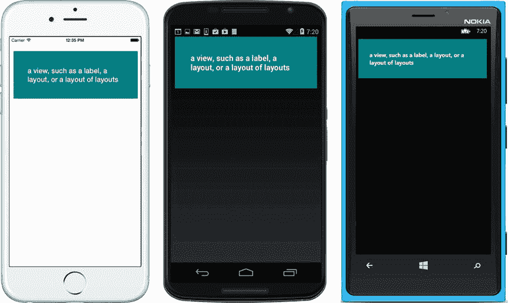

图 3-17。

ContentView in action Note

如果您的截图与图 [3-17](#Fig17) 不匹配，并且`ContentView`消耗了整个屏幕，则将此添加到`ContentView`:

`VerticalOptions = LayoutOptions.StartAndExpand,`

### 代码完成:内容视图

清单 [3-12](#FPar39) 是图 [3-17](#Fig17) 所示的完整`ContentView`代码示例。这里使用了两种填充:在`ContentView`内部的彩色填充和在`ContentPage`边缘周围的空间。

Listing 3-12\. ContentViewExample.cs Code Complete

`class ContentViewExample : ContentPage`

`{`

`public ContentViewExample()`

`{`

`ContentView contentView = new ContentView`

`{`

`BackgroundColor = Color.Teal,`

`Padding = new Thickness(40),`

`HorizontalOptions = LayoutOptions.Fill,`

`Content = new Label`

`{`

`Text = "a view, such as a label, a layout, or a layout of layouts",`

`FontSize = 20,`

`FontAttributes = FontAttributes.Bold,`

`TextColor = Color.White`

`}`

`};`

`// Padding on edges and a bit more for iPhone top status bar`

`this.Padding = new Thickness(10, Device.OnPlatform(20, 0, 0), 10, 5);`

`this.Content = new StackLayout`

`{`

`Children =`

`{`

`contentView`

`}`

`};`

`}`

`}`

XAML

这些例子的 XAML 版本可以在 Apress.com(从源代码/下载选项卡，访问这本书的标题)或 GitHub 的 [`https://github.com/danhermes/xamarin-book-examples`](https://github.com/danhermes/xamarin-book-examples) 找到。Xamarin。表格解决方案为[第三章](03.html)为`LayoutExample.Xaml`。

### 基本框架

xamarin.forms

`Frame`布局在其周围放置一个可见的框架。属性指定了框架的颜色。见清单 [3-13](#FPar41) 。

Listing 3-13\. FrameExample.cs

`class FrameExample : ContentPage`

`{`

`public FrameExample()`

`{`

`this.Padding = 20;`

`this.Content = new Frame {`

`Content = new Label { Text = "Framed", FontSize = 40 },`

`OutlineColor = Color.Red`

`};`

`}`

`}`

`HasShadow`是一个`Boolean`属性，指定平台支持时的阴影效果。一个`Frame`布局的默认`Padding`值是 20。可以将`Content`属性分配给另一个布局，例如`StackLayout`，以包含和框住多个视图。

图 [3-18](#Fig18) 显示了`Frame`的布局。

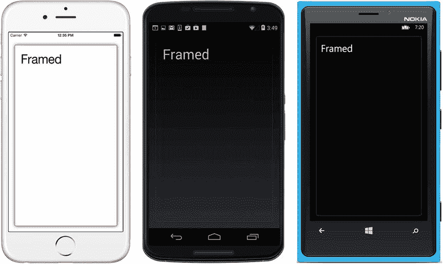

图 3-18。

Frame layout

这些是 Xamarin 的布局。表格！

此时，你面临着一个选择。这些章节中有许多以三种方式涵盖了一个主题:Xamarin。表格，Xamarin。Android，还有 Xamarin.iOS .当你看完了关于 Xamarin 的内容。表单(就像现在)，你可以继续阅读其他操作系统(Android 和 iOS)中的章节主题，或者你可以翻到下一章，了解更多关于 Xamarin.Forms 的信息。以下是你的选择:

*   你准备好了吗？表格？翻到下一章，阅读使用 Xamarin 的用户交互。窗体控件，称为视图。
*   你想了解 Android 布局吗？然后继续读下去。
*   你想知道 iOS 的布局吗？跳到本章的 iOS 部分。

现在让我们从 Android 开始，讨论特定于平台的布局。

### 使用 Android 布局

机器人

Android 布局包含和格式化控件，并继承自 Android `ViewGroup`类，类似于 Xamarin。表单`Layout`类。当你知道控件之间的关系时，使用`LinearLayout. RelativeLayout`可以快速方便的格式化简单的页面。`TableLayout`提供一个类似表格的容器，将视图分配给特定的行和列。`GridLayout`类似于`TableLayout`，但是提供了将视图更松散地流入表格的特性。是一个用于构建自定义布局视图的基类，它可以包含多个布局和其他视图，作为一个可重用的组件非常有用。`Fragments`是一个布局相关的主题，但不是技术上的布局。开发人员使用片段作为高级布局(具有他们自己的状态和生命周期)来组合构建复杂的、可互换的 ui。

Note

在 Android 中，布局这个术语有两种含义。它可以是`Resources`文件夹中的布局 XML ( `.axml`)文件，也可以是用于格式化控件的控件容器之一，如`LinearLayout`。本书通过使用术语布局 XML 和布局来区分它们。

Android 的布局和他们的 Xamarin 相似。表格副本，如表 [3-1](#Tab1) 所示。

表 3-1。

Comparison of Android and Xamarin.Forms Layouts

<colgroup><col> <col></colgroup> 
| 机器人 | Xamarin。形式 |
| --- | --- |
| `LinearLayout` | `StackLayout` |
| `RelativeLayout` | `RelativeLayout` |
| `TableLayout` | `Grid` |
| `GridLayout` | `Grid` |
| `FrameLayout` | `StackLayout`，`ContentLayout` |

尽管 Android `FrameLayout`最初被设计为容纳和构建单个视图，但它经常被用作多个视图的类似面板的元素，其中可以指定 z 顺序，从而对层进行控制。它还充当动态换入和换出片段的容器。

片段继承自`Android.App.Fragment`，技术上不是布局。迷你布局拥有自己的代码和规则，片段通常被用作应用布局架构的基础，就像自定义控件一样，也可以与其他布局协同工作。它们是 Android 移动应用响应式设计的中流砥柱，尤其是当手机应用需要在平板电脑上看起来很棒的时候。我们使用它们作为组件化的 UI 构建块来创建屏幕，既可以在布局 XML 中静态使用，也可以使用代码实时动态地将它们换入和换出。

Note

Android 的`AbsoluteLayout`选项被弃用，取而代之的是`RelativeLayout`。

### 线性布局

机器人

`LinearLayout`可以在视觉上垂直或水平地构建和排列其他元素，就像 web 开发中的`
`或 Xamarin。表格`StackLayout`。

将一个名为`LinearLayoutExample.axml. LinearLayout`的新 Android 布局 XML 文件添加到您的项目中，在视图中声明如下:

`<LinearLayout xmlns:android="`[`http://schemas.android.com/apk/res/android`](http://schemas.android.com/apk/res/android)T2】

`android:orientation=  "vertical"`

`android:layout_width=  "fill_parent"`

`android:layout_height= "fill_parent" >`

`<!-- Add views here -->`

`</LinearLayout>`

方向被声明为垂直，导致视图从上到下层叠。它也可以设置为水平，使视图从左向右层叠。

让我们在`LinearLayout`标签内添加一个`TextView`和两个`Buttons`(列表 [3-14](#FPar44) )。

Listing 3-14\. LayoutExample.axml

`<TextView`

`android:id="@+id/aTextBox"`

`android:text=    "A TextView"`

`android:textSize=    "20pt"`

`android:layout_width=    "match_parent"`

`android:layout_height=    "wrap_content"`

`android:layout_weight=    "4"    />`

`<Button`

`android:id="@+id/aButtonMe"`

`android:text="Click Me!"`

`android:layout_width="match_parent"`

`android:layout_height="wrap_content"`

`android:layout_weight=    "1"`

`/>`

`<Button`

`android:id="@+id/aButtonOrMe"`

`android:text="Or Me!"`

`android:layout_width="match_parentparent"`

`android:layout_height="wrap_content"`

`android:layout_weight=    "1"`

`/>`

`Layout_weight`将尺寸比例归入视图。在这种情况下，我们希望文本框拥有屏幕的大部分，并将其他控件推到底部，因此我们将文本框`layout_weight`设置为 4(共 6 个)，并将每个按钮设置为 1。6 来自总重量:4 + 1 + 1 = 6。使用`layout_weight`时，确保不要设置数字高度或宽度值。

`Match_parent`将视图的高度或宽度设置为与父布局视图相同，但减去其填充。`wrap_content`将视图自动调整为自己的内容，包括填充。

Note

关于使用`layout_height`、`layout_width`、`layout_gravity`和`layout_margin`等`View`属性放置的更多细节，请参考 Xamarin 和 Android online 开发者文档。

Tip

Xamarin Android Designer 可以用来设计 Android UI，也是学习布局 XML ( `.axml`文件)的好方法。然而，Android 布局 XML 是高度可读和可写的，XML 也可以手工编码。

### 使用活动显示布局

在当代的模型-视图-控制器(MVC)模式中，Android 活动是控制器，构成了 Android 移动应用中的核心可执行元素。活动显示和管理布局，这相当于 MVC 视图。

Note

这本书是一部杰作。形成初级和跨平台指南。这不是一本 Android 初级读本，尽管它介绍了一些基本概念，但您需要 Android 和/或 Xamarin 的额外资源。安卓基础。如果你需要关于 Xamarin 的介绍。Android，请参考 Xamarin 在线文档。

本书中的许多例子只使用了一个活动，叫做`MainActivity`。在这些简单的例子中，您可以在`MainActivity`的`OnCreate`方法中加载您的布局 XML，这里称为`LinearLayoutExample`，引用`Resources/layout`文件夹中的`LinearLayoutExample.axml`文件:

`public class MainActivity : Activity`

`{`

`protected override void OnCreate (Bundle bundle)`

`{`

`RequestWindowFeature(WindowFeatures.NoTitle);`

`base.OnCreate (bundle);`

`SetContentView (Resource.Layout.LinearLayoutExample);`

`}`

这个`RequestWindowFeature`调用隐藏了视图顶部的应用标题。现在让我们运行它(图 [3-19](#Fig19) )。

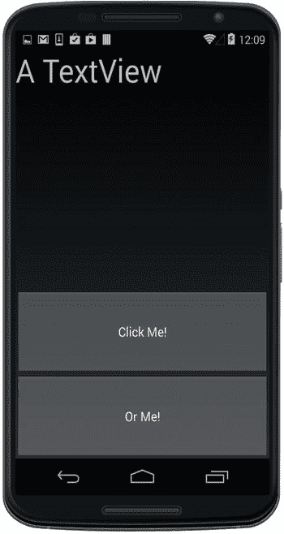

图 3-19。

LinearLayout using layout_weight

### 在代码中创建布局

布局可以用 C#以编程方式创建，而不是使用 XML，但是，我们再次推荐 Xamarin Android Designer 作为 Android UI 的入门。它简单、快速、准确。有时我们需要在代码中创建控件(视图),或者更常见的是，改变它们的属性。

清单 [3-15](#FPar48) 是先前布局 XML 的粗略 C#近似。在主活动的`OnCreate`方法中，创建一个`LinearLayout`元素并将视图添加到布局中。使用`SetContentView`方法将布局分配给活动并显示它。

Listing 3-15\. LinearLayoutActivity.cs Creates a LinearLayout Using C#

`protected override void OnCreate (Bundle bundle)`

`{`

`RequestWindowFeature(WindowFeatures.NoTitle);`

`base.OnCreate (bundle);`

`var linearLayout= new LinearLayout (this);`

`linearLayout.Orientation = Orientation.Vertical;`

`var aTextView = new TextView (this);`

`aTextView.Text = " A TextView ";`

`aTextView.TextSize = 20;`

`var aButtonMe= new Button (this);`

`aButtonMe.Text = "Click Me!";`

`var aButtonOrMe= new Button (this);`

`aButtonOrMe.Text = "Or Me!";`

`linearLayout.AddView (aTextView);`

`linearLayout.AddView (aButtonMe);`

`linearLayout.AddView (aButtonOrMe);`

`SetContentView (linearLayout);`

`}`

用`AddView`将控件添加到`LinearLayout`，然后用`SetContentView`将布局添加为主视图。

### 使用嵌套布局

多个`LinearLayout`元素可以定义复杂的元素分组。在下面的代码中，为了便于阅读，节点被折叠起来:

`<LinearLayout>`

`<TextView/>`

`<LinearLayout>`

`<Button/>`

`<Button/>`

`</LinearLayout>`

`</LinearLayout>`

如果嵌套的`LinearLayout`元素太多，性能会受到影响，应该使用`RelativeLayout`。

### 相对布局

机器人

`RelativeLayout`是一个视图容器，这些视图之间有位置关系。通过在单个视图之间创建约束将视图放置在`RelativeLayout`中，例如:上方、下方、右侧、左侧、对齐和居中。

向您的项目添加一个新的 Android 布局文件，并用我们的`TextView`和两个`Buttons`创建`RelativeLayout`，如清单 [3-16](#FPar49) 所示。

Listing 3-16\. RelativeLayoutExample.axml

`<RelativeLayout xmlns:android="`[`http://schemas.android.com/apk/res/android`](http://schemas.android.com/apk/res/android)T2】

`android:layout_width="fill_parent"`

`android:layout_height="fill_parent" >`

`<TextView`

`android:id="@+id/aTextBox2"`

`android:layout_width="wrap_content"`

`android:layout_height="wrap_content"`

`android:text="A TextView"`

`/>`

`<Button`

`android:id="@+id/aButtonMe2"`

`android:layout_width="wrap_content"`

`android:layout_height="wrap_content"`

`android:text="Click Me!"`

`android:layout_below="@+id/aTextBox2"`

`/>`

`<Button`

`android:id="@+id/aButtonOrMe"`

`android:layout_width="wrap_content"`

`android:layout_height="wrap_content"`

`android:text="Or Me!"`

`android:layout_marginLeft="50dip"`

`android:layout_alignTop="@id/aButtonMe2"`

`android:layout_toRightOf="@+id/aButtonMe2"`

`/>`

`</RelativeLayout>`

使用`layout_marginLeft`和按钮之间的填充在`aButtonOrMe`上设置边距。使用`layout_alignTop`对准两个按钮的顶部(参见图 [3-20](#Fig20) )。这些控件使用`wrap_content`将它们的大小设置为内容的大小，在本例中是文本。

图 3-20。

RelativeLayout with three views Tip

`LinearLayout`和`RelativeLayout`可用于构建复杂的定制视图。这些又可以用来创建详细的列表视图。你会在第五章的[中了解到更多。](05.html)

Note

有关使用`RelativeLayout`布局参数(如`layout_align`)放置的更多详细信息，请参考 Xamarin 和 Android 在线开发人员文档。

### 表格布局

机器人

您可以使用`TableLayout`按行和列排列视图。声明行并用视图填充这些行。列的宽度由该列中最宽的视图决定。您可以使用自上而下应用的`TableLayout`属性来拉伸或收缩列。

清单 [3-17](#FPar52) 显示`TableLayout`有两排，第一排有两个`TextViews`，第二排有我们的两个`Buttons`。

Listing 3-17\. TableLayoutExample.axml

`<TableLayout xmlns:android="`[`http://schemas.android.com/apk/res/android`](http://schemas.android.com/apk/res/android)T2】

`android:layout_width="match_parent"`

`android:layout_height="wrap_content"`

`android:stretchColumns="*"`

`android:shrinkColumns="*">`

`<TableRow>`

`<TextView`

`android:layout_column="0"`

`android:text="A TextView"`

`android:layout_marginBottom="20dp"/>`

`<TextView`

`android:text="and Another!"`

`android:layout_marginBottom="20dp"/>`

`</TableRow>`

`<TableRow>`

`<Button`

`android:layout_column="0"`

`android:text="Click Me!" />`

`<Button`

`android:text="Or Me!" />`

`</TableRow>`

`</TableLayout>`

`stretchColumns`和`shrinkColumns`指示在哪些列上赋予布局的宽度和高度特征(在本例中为填充和换行)，星号表示所有列，与`stretchColumns="0,1". Layout_column`通过使用从零开始的索引指定视图的列相同(图 [3-21](#Fig21) )。

图 3-21。

TableLayout with two rows

以编程方式完成几乎相同事情的代码看起来如清单 [3-18](#FPar53) 所示。

Listing 3-18\. TableViewActivity.cs

`protected override void OnCreate (Bundle bundle)`

`{`

`RequestWindowFeature(WindowFeatures.NoTitle);`

`base.OnCreate (bundle);`

`var tableLayout= new TableLayout (this);`

`tableLayout.LayoutParameters = new TableLayout.LayoutParams(`

`ViewGroup.LayoutParams.MatchParent,`

`ViewGroup.LayoutParams.WrapContent);`

`TableRow tableRow1 = new TableRow(this);`

`TableRow tableRow2 = new TableRow(this);`

`var aTextView1 = new TextView (this);`

`aTextView1.Text = "A TextView";`

`var aTextView2 = new TextView (this);`

`aTextView2.Text = "and Another!";`

`tableRow1.AddView (aTextView1,0); // add view to column 0`

`tableRow1.AddView (aTextView2,1); // add view to column 1`

`var aButton1= new Button (this);`

`aButton1.Text = "Click Me!";`

`var aButton2= new Button (this);`

`aButton2.Text = "Or Me!";`

`tableRow2.AddView (aButton1,0);`

`tableRow2.AddView (aButton2,1);`

`tableLayout.AddView(tableRow1, 0); // add row 0 to layout`

`tableLayout.AddView(tableRow2, 1); // add row 1 to layout`

`SetContentView (tableLayout);`

`}`

这创建了两个`TableRows`，用`TableRow.AddView`方法向它们添加视图，然后用`TableLayout.AddView`将每个`TableRow`添加到`TableLayout`。这用宽度和高度`LayoutParams`设置了`TableLayout`的`LayoutParameters`属性。可以在布局、行和视图级别设置布局参数。

### 网格布局

机器人

`GridLayout`类为视图构建了一个类似表格的容器，与`TableLayout. GridLayout`类似但不完全相同，提供了将视图放入单元格以及单独放置视图的额外选项。通过使用`layout_columnSpan`和`layout_rowSpan`跨越几行或几列来创建多单元格视图。动态图像网格使用另一种叫做`GridView`的布局控件。

在`GridLayout`中放置视图有三种方式:

*   水平方向(默认)-视图从左到右，然后从上到下流入单元格。
*   垂直方向从上到下排列视图，先填充每一列，然后向右移动，从上到下填充下一列。
*   “指定行/列”使每个单独的视图都可以用要占据的行和列来标记。

### 以水平方向从左到右填充行

机器人

水平方向在移动到下一行之前，从左到右用视图填充一行。

使用默认的水平方向，创建一个带有两个`TextViews`和两个`Buttons`的`GridLayout`，如清单 [3-19](#FPar54) 所示。

Listing 3-19\. GridLayoutExample.axml

`<GridLayout xmlns:android="`[`http://schemas.android.com/apk/res/android`](http://schemas.android.com/apk/res/android)T2】

`android:layout_width="match_parent"`

`android:layout_height="match_parent"`

`android:rowCount="2"`

`android:columnCount="2">`

`<TextView`

`android:text="A TextView,"`

`android:textSize="30dip" />`

`<TextView`

`android:text=" and another!"`

`android:textSize="30dip" />`

`<Button`

`android:text="Click Me!"`

`android:textSize="20dip" />`

`<Button`

`android:text="Or Me!"`

`android:textSize="20dip" />`

`</GridLayout>`

`GridLayout rowCount`和`columnCount`定义网格的尺寸。默认方向为水平，从左到右填充该行单元格，然后下拉到下一行，如图 [3-22](#Fig22) 所示。

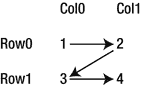

图 3-22。

GridLayout cells fill in a horizontal orientation

图 [3-23](#Fig23) 显示了结果。

图 3-23。

GridLayout in a horizontal orientation

### 垂直方向从上到下填充列

机器人

垂直方向在向右移动到下一列之前从上到下用视图填充一列，如图 [3-24](#Fig24) 所示。

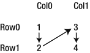

图 3-24。

GridLayout cells fill in a vertical orientation

将`GridLayout.orientation`属性设置为`vertical`，以便在向右移动到下一列之前从上到下填充单元格:

`<GridLayout xmlns:android="`[`http://schemas.android.com/apk/res/android`](http://schemas.android.com/apk/res/android)T2】

`android:layout_width="match_parent"`

`android:layout_height="match_parent"`

`android:rowCount="2"`

`android:columnCount="2"`

`android:orientation="vertical">`

`</GridLayout>`

图 [3-25](#Fig25) 显示了结果。

图 3-25。

GridLayout in a vertical orientation

### 指定行和列

机器人

您可以通过删除方向设置并为网格中的所有视图声明`layout_row`和`layout_column`来为每个视图指定行和列。

这个例子有目的地将我们的`TextViews`和`Buttons`交叉，以证明位置是在每个子视图中定义的(图 [3-26](#Fig26) )。

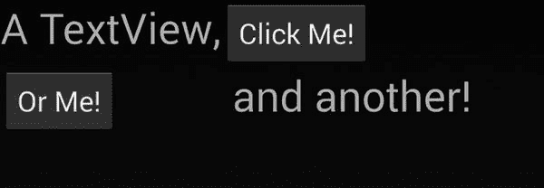

图 3-26。

Specify exact rows and columns in a GridLayout

清单 [3-20](#FPar55) 显示了用为每个子视图声明的`layout_row`和`layout_column`创建一个`GridLayout`的代码。

Listing 3-20\. GridLayoutSpecifyRowCol.axml

`<GridLayout xmlns:android="`[`http://schemas.android.com/apk/res/android`](http://schemas.android.com/apk/res/android)T2】

`android:layout_width="match_parent"`

`android:layout_height="match_parent"`

`android:rowCount="2"`

`android:columnCount="2">`

`<TextView`

`android:text="A TextView,"`

`android:textSize="30dip"`

`android:layout_row="0"`

`android:layout_column="0"/>`

`<TextView`

`android:text=" and another!"`

`android:textSize="30dip"`

`android:layout_row="1"`

`android:layout_column="1" />`

`<Button`

`android:text="Click Me!"`

`android:textSize="20dip"`

`android:layout_row="0"`

`android:layout_column="1" />`

`<Button`

`android:text="Or Me!"`

`android:textSize="20dip"`

`android:layout_row="1"`

`android:layout_column="0" />`

`</GridLayout>`

### 创建多单元格视图

机器人

通过在视图上设置这些属性，可以调整单个视图的大小以跨越网格中的多个单元格。

按如下方式跨列:

`android:layout_columnSpan="numberOfColumnsToSpan"`

或者您可以跨行:

`android:layout_rowSpan=" numberOfRowsToSpan"`

清单 [3-21](#FPar56) 显示了一个例子，其中我们的一个按钮被拉伸成两列。

Listing 3-21\. GridLayoutMultiCellView.axml

`<GridLayout xmlns:android="`[`http://schemas.android.com/apk/res/android`](http://schemas.android.com/apk/res/android)T2】

`android:layout_width="wrap_content"`

`android:layout_height="wrap_content"`

`android:rowCount="2"`

`android:columnCount="2">`

`<TextView`

`android:text="A TextView,"`

`android:textSize="30dip" />`

`<TextView`

`android:text=" and another!"`

`android:textSize="30dip" />`

`<Button`

`android:text="Click Me!"`

`android:textSize="20dip"`

`android:layout_columnSpan="2"`

`android:layout_gravity="fill"/>`

`</GridLayout>`

为了用一个按钮填充两列，其 l `ayout_gravity`属性被设置为`fill`。布局的`height`和`width`被设置为`wrap_content`。

图 [3-27](#Fig27) 显示了多单元`GridLayout`。

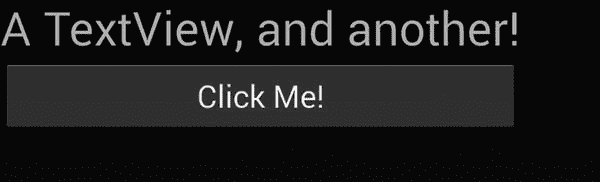

图 3-27。

GridLayout with a multicelled button Tip

确保您的视图填充了多个单元格，否则对`layout_columnSpan`和`layout_rowSpan`的更改可能看起来没有效果。使用它或者失去它。

### 创建动态图像网格

Android `GridView`是一个二维、可滚动的网格布局，用于显示和选择图像。所有的单元格都是相同的大小，它们的内容是从一个`Adapter`动态填充的，就像一个网格形式的列表。[第七章](07.html)提供了更多细节。

### 框架布局

机器人

`FrameLayout`通常用于创建分层屏幕，因为它允许视图从前到后排序。它还可以通过使用片段动态地换入和换出部分布局，这将在下一节中解释。

`FrameLayout`最初的设计是创建一个矩形区域来显示一个视图。然而，它通常用于实现复杂的分层屏幕，因为`FrameLayout`将接受多个孩子，并控制视图的 z 顺序(从前到后的顺序)，将最近添加的孩子放在顶部。这对于类似 HUD 的元素、滑动面板和更复杂的动画转场等效果非常有用。

清单 [3-22](#FPar58) 是一个声明的`FrameLayout`包含一个`TextView`的简单例子。

Listing 3-22\. FrameLayout.axml

`<LinearLayout xmlns:android="`[`http://schemas.android.com/apk/res/android`](http://schemas.android.com/apk/res/android)T2】

`android:orientation="vertical"`

`android:layout_width="fill_parent"`

`android:layout_height="fill_parent">`

`<FrameLayout`

`android:id="@+id/details"`

`android:layout_weight="1"`

`android:layout_width="fill_parent"`

`android:layout_height="fill_parent">`

`<TextView`

`android:text="A TextView"`

`android:layout_width="fill_parent"`

`android:layout_height="wrap_content" />`

`</FrameLayout>`

`</LinearLayout>`

Tip

在这种布局中，要注意不同屏幕尺寸上的多个嵌套元素，因为在跨设备测试时已经报告了重叠的子元素。

### 碎片

机器人

Android `Fragment`是一个动态的、可重用的布局，可以在我们的页面中按需使用，就像 .NET 自定义控件。继承自`Android.App.Fragment`，所以技术上不是布局，它更像是类固醇上的布局，因为它有自己的状态和自己的生命周期。使用片段可以有效地构建整个应用。

碎片是 Android 对可变形状因子问题的解决方案。我们为数百种不同尺寸的设备开发，这些设备有时在完全不同的布局下工作得最好。片段给了我们组件化的、可移动的和可重用的元素，而不是用页面上的静态视图和布局来构建。它们经常被用在那些在手机和平板电脑上都必须好看和好用的应用中。

片段是一个核心的 Android UI 主题，但是完整的探索超出了本书的范围。如果你认为你需要在 Android 上可重用的、动态的、定制的 UI 组件，特别是对于手机/平板电脑应用，在 Xamarin 和 Android 在线文档中寻找更多信息。参见[第 6 章](06.html)的片段示例。

那些是 Xamarin。Android 布局基础。如果你想了解更多关于 Android(或者 Xamarin。表单)，转到第 4 章的[，它涵盖了通过控件的用户交互。](04.html)

如果你准备好了 iOS 布局，请继续阅读。

## 使用 iOS 布局

我是操作系统

iOS 中的静态布局主要是使用`UIView`类完成的，它是 iOS 控件的基本容器类，也是 iOS MVC 模式中的 V。`UIViews`通常与一个名为`UIViewController`的控制器类配对，其行为类似于 Android 活动或 Xamarin。表格`ContentPage`。

Tip

大多数开发者通过使用设计工具来创建 iOS 布局，例如 [Xcode Interface Builder](https://developer.apple.com/library/mac/recipes/xcode_help-interface_builder/_index.html) 和 [Xamarin Designer for iOS](http://developer.xamarin.com/guides/ios/user_interface/designer/) 。因为这是一本代码优先的书，而不是工具指南，所以这里没有太多关于这个主题的内容。我将触及代码中的基本概念，并向您推荐 Xamarin 在线文档( [`http://developer.xamarin.com/guides/ios/user_interface/designer/`](http://developer.xamarin.com/guides/ios/user_interface/designer/) )和 Apple 文档，了解如何使用 designer 工具构建 iOS 布局的详细信息。

通过使用两种技术中的一种:自动布局和框架，将视图作为子视图添加到`UIView`。自动布局技术使用约束来创建视图之间的相对水平和垂直关系。框架技术使用矩形来限制视图，将它们分配给视图的`Frame`属性。使用框架时，位置和大小是绝对的，使用自动布局时，位置和大小是相对的。

表 [3-2](#Tab2) 比较了 iOS 和其他平台的布局方法。

表 3-2。

Layout Techniques and Classes by Platform

<colgroup><col> <col> <col></colgroup> 
| ios | 机器人 | Xamarin。形式 |
| --- | --- | --- |
| `UIView` | `LinearLayout` | `StackLayout` |
| 自动布局 | `RelativeLayout` | `RelativeLayout` |
| 框架 | (已弃用) | `AbsoluteLayout` |

Tip

强烈建议使用 UI 设计工具来开始使用 nib 和 story boards(iOS XML 布局文件格式)中的布局。使用 Xcode Interface Builder 或 Xamarin Designer for iOS。当您熟悉了 iOS UI 之后，仍然不推荐手工编码 iOS XML 文件，因为这些文件的不可读取性是由设计工具而不是人眼为配置而构建的。然而，我可以向喜欢不用设计工具的高级用户推荐 C# iOS UI 的手工编码和跳过 XML。

### 使用自动布局

我是操作系统

AutoLayout 是一种响应式布局技术，可自动适应不同的屏幕尺寸。在`UIViewController`内，视图被指定为子视图。它们的位置和大小可以由约束来确定，约束是视图之间灵活的相对关系。

Note

如前所述，这本书是一本杰作。形成初级和跨平台指南。这不是一本 iOS 初级读本，尽管它介绍了一些基本概念，但您还需要 iOS 和/或 Xamarin.iOS 基础知识的其他来源。如果您需要 Xamarin.iOS 的介绍，请查阅 Xamarin 在线文档。

在您的`UIViewController`的`ViewDidLoad`方法中，在清单 [3-23](#FPar63) 中，使用`UITextField`实例化一个文本框。然后在将其添加到父视图之前，向其添加尺寸和位置约束。

Listing 3-23\. iOSLayoutExample2ViewController.cs from Solution iOSLayoutExample2

`public override void ViewDidLoad ()`

`{`

`base.ViewDidLoad ();`

`var textView  = new UITextField`

`{`

`Placeholder = "Your name",`

`BorderStyle = UITextBorderStyle.RoundedRect`

`};`

将 textView 的`TranslatesAutoresizingMaskIntoConstraints`属性设置为`false`。当将旧的自动调整框架蒙版转换为新的自动布局时，该属性被设置为`true`。

`textView.TranslatesAutoresizingMaskIntoConstraints = false;`

现在我们向控件和视图添加约束。这是使用控件的`AddConstraints`方法完成的，该方法使用`NSLayoutConstraint`。

指定文本字段的大小。使用指定`NSLayoutAttribute`的`NSLayoutConstraint.Create`方法构建约束，在本例中是`Height`和`Width`。`Add`方法将`textView`控件添加到视图中。

`textView.AddConstraints (new[] {`

`NSLayoutConstraint.Create (textView, NSLayoutAttribute.Height,`

`NSLayoutRelation.Equal, null, NSLayoutAttribute.NoAttribute,`

`1, 50),`

`NSLayoutConstraint.Create (textView, NSLayoutAttribute.Width,`

`NSLayoutRelation.Equal, null, NSLayoutAttribute.NoAttribute,`

`1, 200),`

`});`

`Add(textView);`

指定文本字段的位置。通过在`View. NSLayoutAttribute.Left`上使用`AddConstraints`方法将控件约束到顶级视图，这允许我们将文本视图放置在距左侧 10 点的位置，而`NSLayoutAttribute.Top`允许我们指定距顶部 30 点的位置。

`View.AddConstraints (new[] {`

`//Location`

`NSLayoutConstraint.Create (textView, NSLayoutAttribute.Left,`

`NSLayoutRelation.Equal, View, NSLayoutAttribute.Left, 1, 10),`

`NSLayoutConstraint.Create (textView, NSLayoutAttribute.Top,`

`NSLayoutRelation.Equal, View, NSLayoutAttribute.Top, 1, 30)`

`});`

图 [3-28](#Fig28) 显示了根据视图调整大小和约束的文本框。

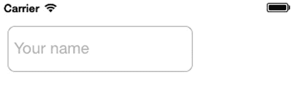

图 3-28。

UITextField using AutoLayout Tip

探索`NSLayoutAttribute`的值，了解所有可用的约束条件。包括`Left`、`Right`、`Top`、`Bottom`、`Leading`、`Trailing`、`Width`、`Height`、`CenterX`、`CenterY`、`LeftMargin`、`RightMargin, TopMargin`、`BottomMargin`等。

### 使用可视化格式语言添加约束

在代码中添加约束的另一种方法是使用可视化格式语言(Visual Format Language，VFL)，这是一种声明性的 iOS 语法，用于表示常见的约束，包括标准的间距和尺寸、垂直布局以及具有不同优先级的约束。这种简明易懂的语法可以用在`AddConstraints`方法中。下面是一些代码片段，让您感受一下 VFL 语法。

本示例将文本字段的最小宽度设置为 50 磅:

`var viewsDictionary = NSDictionary.FromObjectsAndKeys(new NSObject[]`

`{textView}, new NSObject[] { new NSString("textView")});`

`textView.AddConstraints(NSLayoutConstraint.FromVisualFormat`

`("H:|[textView(>=50)]|", 0, null, viewsDictionary));`

`H:`指定水平方向。对于垂直约束，将`V:`添加到 VFL 字符串的开头。冒号指定控件与超级视图(顶级视图)的关系。此按钮高度为 50.0 磅，与超级视图顶部的标准间距。

`var viewsDictionary = NSDictionary.FromObjectsAndKeys(new NSObject[]`

`{button}, new NSObject[] { new NSString("button")});`

`textView.AddConstraints(NSLayoutConstraint.FromVisualFormat`

`("V:|-[button(50.0)]", 0, null, viewsDictionary));`

VFL 还允许在视图之间创建约束。以下示例创建了四个按钮，通过使用括号将每个按钮的宽度设置为与下一个按钮的宽度相同，因此它们都是`buttonFourth`的宽度:

`var viewsDictionary = NSDictionary.FromObjectsAndKeys(new NSObject[]`

`{buttonFirst, buttonSecond, buttonThird, buttonFourth},`

`new NSObject[] { new NSString("buttonFirst"),`

`new NSString("buttonSecond"), new NSString("buttonThird"),`

`new NSString("buttonFourth ")});`

`this.View.AddConstraints( NSLayoutConstraint.FromVisualFormat`

`("H:|-[buttonFirst(buttonSecond)]-[ buttonSecond(buttonThird)]-[ " +`

`"buttonThird(buttonFourth)]-[buttonFourth]-|",`

`NSLayoutFormatOptions.AlignAllTop |`

`NSLayoutFormatOptions.AlignAllBottom,`

`height, viewsDictionary));`

虚线表示视图之间的标准间距，也可以用点值来指定精确的间距值。例如，`[buttonFirst]-10-[buttonSecond]`在按钮之间放置 10 个点。括号和破折号的语法是为了直观地表示控件在屏幕上的外观。

Tip

这些例子只是给你 VFL 的要点的片段。iOS 开发人员指南包含完整的 VFL 定义。

### 使用框架

我是操作系统

iOS 布局的一种绝对方法是通过分配给超级视图的`Frame`属性的`RectangleF`来指定 iOS 视图的边界和中心位置。

Note

请注意，自动调整大小(或自动调整大小)是一种比之前描述的 AutoLayout 更古老的 iOS 相对布局方法，它将框架与`UIViewAutoResizingMasks`耦合在一起，以创建响应性的“弹簧和支柱”。这里不包括自动调整大小，因为 Apple 已经用使用约束的自动布局替换了它。一些 iOS 开发者认为自动调整大小对于简单的布局还是更好的。

下面是一个使用`Frames`的绝对布局的例子。创建一个名为`textView`的文本字段，并用分配给`Frame`属性的`RectangleF`来放置和调整它的大小。然后将`textView`添加到父视图中，如清单 [3-24](#FPar67) 所示。

Listing 3-24\. iOSLayoutExamplesViewController.cs from Solution iOSLayoutExamples

`public override void ViewDidLoad ()`

`{`

`base.ViewDidLoad ();`

`var textView = new UITextField`

`{`

`Placeholder = "Your name",`

`BorderStyle = UITextBorderStyle.RoundedRect,`

`Frame = new RectangleF(10, 30, 200, 50)`

`};`

`Add (textView);`

`}`

图 [3-29](#Fig29) 显示了结果。

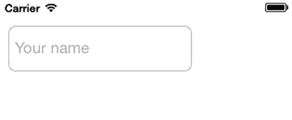

图 3-29。

UITextField using AutoSizing Tip

下面是一个简单的视图构造函数，它以内联方式分配`Frame`属性:

`var textView = new UITextField(new RectangleF(10, 30, 200, 50));`

## 摘要

布局是这些不同平台有多么相似的一个很好的例子。名称会改变，但概念不会改变，为了增加连续性，Xamarin 努力将这些不同平台的最有用的方面合并到 Xamarin.Forms 中。以下是一些与布局相关的通用术语:

*   堆叠布局是最简单的，非常适合简单的页面和快速的原型和线框，就像 Xamarin。表单`StackLayout`和安卓`LinearLayout`。
*   矩形框架视图及其大小和坐标位置。
*   约束将视图绑定在一起，就像由上下文决定大小和位置的松紧带一样。
*   相对位置让我们以精度为代价对屏幕尺寸做出响应，这是移动用户界面的标准。
*   布局选项使用 Xamarin 中的`HorizontalOptions`和`VerticalOptions`处理跨平台的对齐和格式化。表单、安卓`LayoutOptions`和 iOS 的限制。
*   自定义控件在移动开发中作为一个概念存在，尽管它在不同的平台上实现和命名不同，如 Xamarin。表单`ContentView`和安卓`Fragment`。
*   iOS 将之前的许多概念归为一类:`UIView`。
*   表格产生相关性、精确性和多功能性。它们存在于 Xamarin 中。表单`GridLayout`和安卓`TableLayout`和`GridLayout`。你将在第五章的[中了解更多关于 iOS 表格的信息。](05.html)

这些是所有平台上的移动屏幕布局的一些基础。但是已经有足够的设计和布局了。让我们继续讨论用户交互！