# 四、使用控件的用户交互

用户通过使用触觉控制在移动设备上选择日期、时间、文本、整数、双精度和其他值。触摸感应屏幕的用户交互与鼠标驱动的用户界面略有不同:大部分是用拇指和食指在触摸屏上完成的。从用户的角度来看，这导致了一个实际操作的控制面板界面，其中的开关、图标、滑块、键盘和拾取器有时看起来——但更重要的是，感觉起来——像物理机制。

第 2 章讲述了一些基本的 Xamarin。形成视图，如`Label`、`Button`和`Image`。在本章中，您将探索每个平台上可用的附加控制，使它们工作的手势和事件，以及它们的输出。

本章中的许多控件都是选择器式的(选择日期、选择选项、选择时间等等)。当显示在模态对话框中时，这些控件看起来和工作起来都更好，模态对话框是一个弹出框，覆盖在应用上并保持焦点，直到用户取消。Xamarin。表单通过在模态中自动放置选择器来处理这个问题。对于 Android 和 iOS，本章涵盖了构建模态选择器对话框的特定于平台的方法。

本章是最常用的选择控件的图库和参考。

Xamarin。表单视图

Xamarin。表单视图可以执行以下基本输入功能:

*   `Picker`:从简单列表中选择一个值的弹出窗口
*   `DatePicker`:选择月、日、年的弹出窗口
*   `TimePicker`:选择小时、分钟、上午/下午的弹出窗口
*   `Stepper`:离散值的递增/递减按钮
*   `Slider`:连续值滑动输入杆
*   `Switch`:布尔开/关控制

Android 控件

以下是一些主要的 Android 选择部件:

*   `Spinner`:一个简单的下拉列表
*   `DatePicker`:选择月、日、年的控件
*   `TimePicker`:用于选择小时、分钟和上午/下午的控件
*   `SeekBar`:连续值滑动输入杆
*   `CheckBox`:一个标准的布尔型复选框控件
*   `Switch`:布尔开/关开关
*   `RadioButton`:单选或多选按钮组

iOS 控制

iOS 控制执行一系列用户交互:

*   `UIPickerView`:微调器中的简单下拉列表
*   `UIDatePicker`:日期和/或时间微调器
*   `UIStepper`:离散值的递增/递减按钮
*   `UISlider`:连续值滑动输入杆
*   `UISwitch`:布尔开/关控制

Note

iOS 和 Android 的标签、文本视图、按钮、滚动视图和图像控件不在本书讨论范围之内。请查阅 iOS 或 Android 初级读本。

## Xamarin。表单视图

xamarin.forms

Xamarin。表单视图提供了一系列控件，这些控件模仿并扩展了 iOS 和 Android 中的控件。这里涉及的所有视图都允许选择，并且至少用用户指定的数据值填充一个属性，有时甚至更多。让我们依次看看每个视图。

Xamarin。表单视图通常在两个位置提供选定的值:一个处理程序事件属性(例如，`e.NewValue`)提供最近的值，视图上的一个通用属性提供选定的值，以便在整个页面中使用。您将创建两个标签来显示这两个值:`eventValue`和`pageValue`。

创建一个名为`Controls`的新`ContentPage`，并声明两个`Label`视图来保存控件选择的结果:

`public partial class Controls : ContentPage`

`{`

`Label eventValue;`

`Label pageValue;`

`public Controls()`

`{`

`eventValue= new Label();`

`eventValue.Text = "Value in Handler";`

`pageValue = new Label();`

`pageValue.Text = "Value in Page";`

在你的`Controls()`构造函数的末尾创建一个`StackLayout`，分配给你的页面的`Content`属性。使用`HorizontalOptions = LayoutOptions.Center`将`StackLayout`中的所有控制器居中。所有的 Xamarin。本章中的表单示例可以在`ControlExamples`解决方案的源代码列表`Controls.cs`中找到，如本节末尾的列表 [4-1](#FPar2) 所示。

记得随时将每个视图添加到您的`StackLayout`中！

Tip

所有示例代码解决方案，包括这些 C#示例的 XAML 版本，都可以在 Apress 网站( [`www.apress.com`](http://www.apress.com/) )或 GitHub 上的 [`https://github.com/danhermes/xamarin-book-examples`](https://github.com/danhermes/xamarin-book-examples) 找到。

### 采摘者

`Picker`视图提供了一个弹出窗口，可以从一个简单的列表中选择一个值。

Note

`Picker`视图用于快速选择短单词、短语或数字。包含多个字符串和图像的复合单元格的复杂列表将在下一章介绍。

首先，创建选取器并给它一个标题:

`Picker picker = new Picker`

`{`

`Title = "Option",`

`VerticalOptions = LayoutOptions.CenterAndExpand`

`};`

接下来，填充列表:

`var options = new List<string> { "First", "Second", "Third", "Fourth" };`

`foreach (string optionName in options)`

`{`

`picker.Items.Add(optionName);`

`}`

选项名称被放入列表中，然后添加到选取器中的`Items`集合。

图 [4-1](#Fig1) 中的`Entry`视图开始是一个数据输入字段，类似于`Xamarin.Forms.Entry`显示`Title`属性的值。

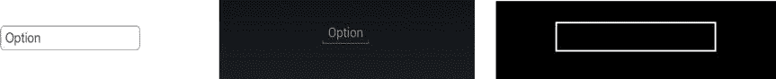

图 4-1。

Entry views often have inline labels instead of side labels

点击该字段时，会出现一个模态对话框，其中包含项目列表(图 [4-2](#Fig2) )。

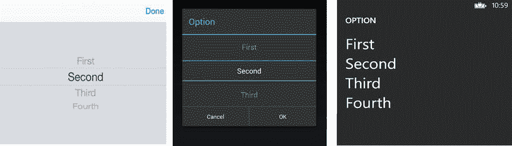

图 4-2。

Each picker looks a bit different, depending on the platform

滑动时，列表会旋转，突出显示的值会成为选定的值。选择会自动填充到原始输入字段中，以便用户可以看到更改的效果。也触发了`SelectedIndexChanged`事件，它可以被分配一个处理程序方法或者像这样被内联处理:

`picker.SelectedIndexChanged += (sender, args) =>`

`{`

`pageValue.Text = picker.Items[picker.SelectedIndex];`

`};`

该实现将选定的字符串分配给`pageValue`标签的`Text`属性。

Tip

在`Picker.SelectedIndex`属性中选择的索引是一个从零开始的整数索引。如果选择取消，则`SelectedIndex`保持不变。

### 日期选择器

xamarin.forms

`DatePicker`视图创建一个弹出窗口，用于选择月份、日期和年份。像这样创建一个`DatePicker`视图:

`DatePicker datePicker = new DatePicker`

`{`

`Format = "D",`

`VerticalOptions = LayoutOptions.CenterAndExpand`

`};`

对于完整的月/日/年显示，`Format`属性被设置为`D`。本节稍后将提供更多日期格式。

`DatePicker`视图开始时是一个数据输入字段(图 [4-3](#Fig3) ，类似于`Xamarin.Forms.Entry`显示`Date`属性的值。

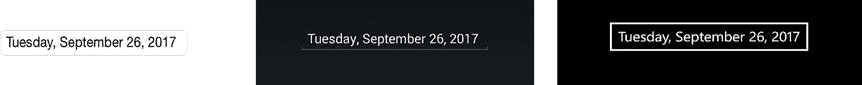

图 4-3。

DatePicker begins as an Entry view waiting for a tap

当点击日期字段时，会出现一个模态对话框(图 [4-4](#Fig4) )。

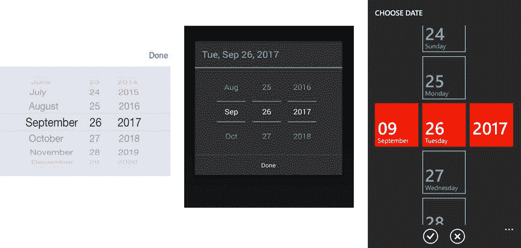

图 4-4。

DatePicker is a modal dialog

滑动时，每列都单独旋转，突出显示的值成为选定值。点击完成时，所选日期会自动填充到原始输入字段中，以便用户可以看到更改的效果。也触发了`DateSelected`事件，它可以被分配一个处理程序方法或者像这样被内联处理:

`datePicker.DateSelected += (object sender, DateChangedEventArgs e) =>`

`{`

`eventValue.Text = e.NewDate.ToString();`

`pageValue.Text = datePicker.Date.ToString();`

`};`

属性`e.OldDate`和`e.NewDate`在该事件中可用，以提供旧的和新的选定日期值。然而，在一般情况下，用户输入的值存储在`Date`属性中。所有这些属性都使用类型`DateTime`。

使用`Format`属性可以定制`Date`字段的格式，例如`myDate.Format = "D"`。其他值如下:

*   `D`:整年整月整日(2018 年 3 月 5 日，星期一)
*   `d`:年、月、日(2018 年 3 月 5 日)
*   `M`:年月日(3 月 5 日)
*   `Y`:年月(2018 年 3 月)
*   `yy`:年份的最后两位数(18)
*   `yyyy`:2018 年全年
*   `MM`:两位数的月份(03)
*   `MMMM`:月(三月)
*   `dd`:两位数的日期(05)
*   `ddd`:星期几的缩写(Mon)
*   一周中的一整天(星期一)

您可以使用`MaximumDate`和`MinimumDate`设置选择的日期范围:

`datePicker.MaximumDate = Convert.ToDateTime("1/1/2019");`

`datePicker.MinimumDate = Convert.ToDateTime("1/1/2014");`

Tip

在 Android 上，`Format`和`MaximumDate/MinimumDate`属性影响`DatePicker`输入字段，但在本文撰写时不影响模态选择对话框。

### TimePicker(时间选择器)

xamarin.forms

`TimePicker`视图创建一个弹出窗口，用于选择小时、分钟和 AM/PM。像这样创建一个`TimePicker`视图:

`TimePicker timePicker = new TimePicker`

`{`

`Format = "T",`

`VerticalOptions = LayoutOptions.CenterAndExpand`

`};`

设置为`T`的`Format`属性显示完整时间。更多的时间格式如下。

`TimePicker`视图以类似于`Xamarin.Forms.Entry`的数据输入字段开始，显示`Time`属性的值(图 [4-5](#Fig5) )。

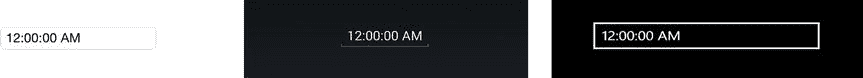

图 4-5。

TimePicker waits for a tap

当点击时间字段时，出现一个模态对话框(图 [4-6](#Fig6) )。

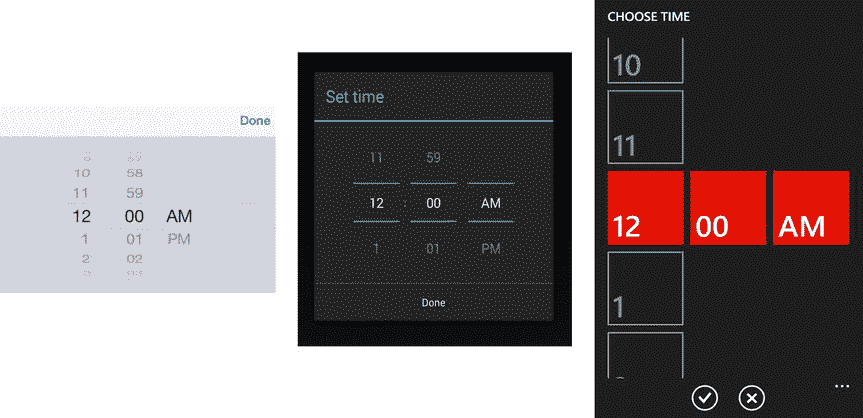

图 4-6。

TimePicker is a dialog box

滑动时，每列都单独旋转，突出显示的值成为选定值。当点击完成时，所选时间会自动填充到原始输入字段中，以便用户可以看到更改的效果。

没有在选择值时触发的 TimeSelected 事件。相反，使用 Xamarin 中的`PropertyChanged`事件。窗体数据绑定以跟踪对此视图的更改:

`timePicker.PropertyChanged += (sender, e) =>`

`{`

`if (e.PropertyName == TimePicker.TimeProperty.PropertyName)`

`{`

`pageValue.Text = timePicker.Time.ToString();`

`}`

`};`

将`timePicker.Time`属性设置为类型`TimeSpan`的选定值。

使用`Format`属性可以定制`Time`字段的格式(例如，`Format = "T"`)。其他值如下:

*   `T`:全时间，包括小时、分钟、秒和上午/下午(上午 9:30:25)
*   `t`:带小时、分钟和上午/下午(上午 9:30)的全职
*   `hh`:两位数小时(09)
*   `mm`:两位数分钟(30)
*   `ss`:两位数秒(25)；秒在对话框中是不可选择的
*   `tt` : AM/PM 指示器(AM)

Tip

`Format`影响`TimePicker`输入域，但在写入时不影响对话框。

### 跳舞者

xamarin.forms

`Stepper`视图为数值的离散调整创建增量和减量按钮:

`Stepper stepper = new Stepper`

`{`

`Minimum = 0,`

`Maximum = 10,`

`Increment = 1,`

`HorizontalOptions = LayoutOptions.Center,`

`VerticalOptions = LayoutOptions.CenterAndExpand`

`};`

为步进值设置`Minimum`、`Maximum`和`Increment`属性。可以在`Stepper.Value`属性中设置起始值。下面是一个快捷构造函数:

`public Stepper (Double Minimum, Double  Maximum, Double  StartValue,  Double Increment)`

这个构造函数可以这样实现:

`Stepper stepper = new Stepper(0,10,0, 1);`

图 [4-7](#Fig7) 显示了`Stepper`视图的样子。

图 4-7。

Plus and minus for increment and decrement

点击加号或减号按钮改变可调值并触发`Stepper.ValueChanged`事件。它可以在方法或内联中处理，如下所示:

`stepper.ValueChanged += (sender, e) =>`

`{`

`eventValue.Text = String.Format("Stepper value is {0:F1}", e.NewValue);`

`pageValue.Text = stepper.Value.ToString();`

`};`

属性`e.OldValue`和`e. NewValue`在该事件中可用，以提供旧的和新的选择值。然而，在一般情况下，用户输入的值存储在`Stepper's Value`属性中。所有这些属性都是类型`Double`。

### 滑块

xamarin.forms

`Slider`视图是一个滑动输入控件，提供连续的选择:

`Slider slider = new Slider`

`{`

`Minimum = 0,`

`Maximum = 100,`

`Value = 50,`

`VerticalOptions = LayoutOptions.CenterAndExpand,`

`WidthRequest = 300`

`};`

为滑动值设置`Minimum`和`Maximum`属性。起始值可以在`Slider.Value`属性中设置。随着滑块的移动，该值以十分之一单位(0.1)的增量变化。`WidthRequest`属性设置视图的宽度，但不改变最小值或最大值。下面是一个快捷构造函数:

`public Slider (Double Minimum, Double  Maximum, Double  StartValue)`

这个构造函数可以这样实现:

`Slider  slider = new Slider  (0,100,50);`

图 [4-8](#Fig8) 显示了`Slider`视图的样子(带有`Value = 100`)。

图 4-8。

Slider view at its max value

滑动滑块改变可调值并触发`slider.ValueChanged`事件。它可以内联处理，也可以作为一个方法来处理，如下所示:

`slider.ValueChanged += (sender, e) =>`

`{`

`eventValue.Text = String.Format("Slider value is {0:F1}", e.NewValue);`

`pageValue.Text = slider.Value.ToString();`

`};`

属性`e.OldValue`和`e.NewValue`在该事件中可用，以提供旧的和新的选择值。一般情况下，滑动值也存储在`slider.Value`属性中。所有这些属性都是类型`Double`。

### 转换

xamarin.forms

`Switch`视图是一个布尔开/关控件:

`Switch switcher = new Switch`

`{`

`HorizontalOptions = LayoutOptions.Center,`

`VerticalOptions = LayoutOptions.CenterAndExpand`

`};`

图 [4-9](#Fig9) 显示了`Switch`视图关闭后的样子。

图 4-9。

Switch off

图 [4-10](#Fig10) 显示了同一视图在。

图 4-10。

Switch on

点击开关改变布尔值并触发`Switch.Toggled`事件。它可以内联处理，也可以作为一个方法来处理，如下所示:

`switcher.Toggled += (sender, e) =>`

`{`

`eventValue.Text = String.Format("Switch is now {0}", e.Value);`

`pageValue.Text = switcher.IsToggled.ToString();`

`};`

属性`e.Value`在这个事件中可以用来提供新的开关值。在一般情况下，该值也存储在`Switch.IsToggled`属性中。这些属性属于`Boolean`类型。

### 缩放、旋转、不透明度、可见性和聚焦

xamarin.forms

您可以改变 Xamarin 的外观和行为。通过使用`View`超类`VisualElement`的成员形成视图。

您通过使用`Focus()`方法为视图提供焦点，如果成功，该方法将返回`true`。本例将焦点设置在一个`Entry`视图上(弹出键盘):

`var gotFocus = entry.Focus();`

以下是可以在视图上设置的一些关键属性:

*   `Scale`:在不影响周围视图的情况下改变视图的大小。默认值为 1.0。`switcher.Scale = 0.7;`
*   使视图不可见，或再次可见。`label.IsVisible = false;`
*   `IsEnabled`:禁用和重新启用视图。`label.IsEnabled = false;`
*   `Opacity`:淡入淡出一个视图。默认值为 1.0。`label.Opacity = 0.5;`
*   `Rotation`:使用`Rotation`、`RotationX`和`RotationY`属性可以实现所有轴上的视图旋转。这些按钮围绕`AnchorX`和`AnchorY`设置的点旋转视图。

### 代码完成:Xamarin。表单控件

xamarin.forms

清单 [4-1](#FPar2) 包含所有 Xamarin 的完整代码清单。本章中的表单选择控件示例。

XAML

这个例子的 XAML 版本可以在 Apress 网站( [`www.apress.com`](http://www.apress.com/) )或者 GitHub 上的 [`https://github.com/danhermes/xamarin-book-examples`](https://github.com/danhermes/xamarin-book-examples) 找到。Xamarin。第四章为`ControlExamples.Xaml`的表格解决方案。

图 [4-11](#Fig11) 显示全屏。

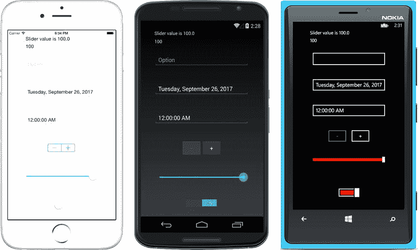

图 4-11。

Xamarin.Forms selection views Listing 4-1\. Controls.cs in the ControlExamples Project of the ControlExamples Solution

`public partial class Controls : ContentPage`

`{`

`Label eventValue;`

`Label pageValue;`

`public Controls()`

`{`

`eventValue= new Label();`

`eventValue.Text = "Label";`

`pageValue = new Label();`

`pageValue.Text = "PageValue";`

`Picker picker = new Picker`

`{`

`Title = "Option",`

`VerticalOptions = LayoutOptions.CenterAndExpand`

`};`

`var options = new List<string> { "First", "Second", "Third", "Fourth" };`

`foreach (string optionName in options)`

`{`

`picker.Items.Add(optionName);`

`}`

`picker.SelectedIndexChanged += (sender, args) =>`

`{`

`pageValue.Text = picker.Items[picker.SelectedIndex];`

`};`

`DatePicker datePicker = new DatePicker`

`{`

`Format = "D",`

`VerticalOptions = LayoutOptions.CenterAndExpand`

`};`

`datePicker.DateSelected += (object sender, DateChangedEventArgs e) =>`

`{`

`eventValue.Text = e.NewDate.ToString();`

`pageValue.Text = datePicker.Date.ToString();`

`};`

`TimePicker timePicker = new TimePicker`

`{`

`Format = "T",`

`VerticalOptions = LayoutOptions.CenterAndExpand`

`};`

`timePicker.PropertyChanged += (sender, e) =>`

`{`

`if (e.PropertyName == TimePicker.TimeProperty.PropertyName)`

`{`

`pageValue.Text = timePicker.Time.ToString();`

`}`

`};`

`Stepper stepper = new Stepper`

`{`

`Minimum = 0,`

`Maximum = 10,`

`Increment = 1,`

`HorizontalOptions = LayoutOptions.Center,`

`VerticalOptions = LayoutOptions.CenterAndExpand`

`};`

`stepper.ValueChanged += (sender, e) =>`

`{`

`eventValue.Text = String.Format("Stepper value is {0:F1}", e.NewValue);`

`pageValue.Text = stepper.Value.ToString();`

`};`

`Slider slider = new Slider`

`{`

`Minimum = 0,`

`Maximum = 100,`

`Value = 50,`

`VerticalOptions = LayoutOptions.CenterAndExpand,`

`WidthRequest = 300`

`};`

`slider.ValueChanged += (sender, e) =>`

`{`

`eventValue.Text = String.Format("Slider value is {0:F1}", e.NewValue);`

`pageValue.Text = slider.Value.ToString();`

`};`

`Switch switcher = new Switch`

`{`

`HorizontalOptions = LayoutOptions.Center,`

`VerticalOptions = LayoutOptions.CenterAndExpand`

`};`

`switcher.Toggled += (sender, e) =>`

`{`

`eventValue.Text = String.Format("Switch is now {0}", e.Value);`

`pageValue.Text = switcher.IsToggled.ToString();`

`};`

`this.Padding = new Thickness(10, Device.OnPlatform(20, 0, 0), 10, 5);`

`this.Content = new StackLayout {`

`HorizontalOptions = LayoutOptions.Center,`

`Children = {`

`eventValue,`

`pageValue,`

`picker,`

`datePicker,`

`timePicker,`

`stepper,`

`slider,`

`switcher`

`}`

`};`

`}`

`}`

Note

同样，本例中使用的两个标签反映了检索选择值的两种方式:在处理程序事件属性(例如，`e.NewValue`)中，它提供最近的值；或者在视图的通用属性中，它提供在整个页面中使用的选定值。

我们的 Xamarin 之旅到此结束。表单视图！

该是你做出选择的时候了:

*   如果你是为 Xamarin 看这本书。并且对特定于平台的 UI 不感兴趣，您可能想跳到下一章的开头继续阅读关于 Xamarin.Forms 的内容。
*   如果您准备使用 Xamarin 更深入地研究特定于平台的方法。Android 和 Xamarin.iOS，然后继续读下去！

让我们从 Xamarin 开始。Android 控件，然后再转移到 iOS。构建 Xamarin 时，可以使用以下控件。特定于 Android 平台的解决方案，或者在 Xamarin 中创建 Android 自定义渲染器时。形成解决方案，如第 8 章中的[所述。](08.html)

## Android 控件

机器人

Android 上最常用的一些选择窗口小部件有`Spinner`、`DatePicker`、`TimePicker`、`SeekBar`、`CheckBox`、`Switch`和`RadioButton`。`Spinner`是一个简单的下拉选择选择器，`SeekBar`是一个滑块，其余的这些控件就像它们听起来一样。

与许多 Xamarin 不同。窗体控件，Android 视图默认不产生模态对话框，只产生内联对话框。使用以下章节描述的技术或使用`DialogFragments`滚动你自己的模态(见[第 6 章](06.html))。

创建一个名为`ControlExamplesAndroid`的空白应用(Android)类型的新 Android 解决方案。

### 纺纱机

一个`Spinner`是一个 Android 小部件，提供一个简单的下拉列表供选择。

制作一个`Spinner`需要几个步骤。您在布局 XML 中放置一个`Spinner`，然后创建另一个包含一个`TextView`的布局，用于绑定到一个`Adapter`来创建一个要显示的列表。接下来，在活动中实例化微调器，填充列表，然后将列表绑定到`Spinner.Adapter`属性，并使用`Spinner.ItemSelected`事件处理选择。

首先，将一个`Spinner`放置在一个`LinearLayout`上，要么使用设计器，要么用 XML 手工编码，然后调用`Resources/layout`文件夹中的布局`Spinner.axml`:

`<Spinner`

`android:layout_width="match_parent"`

`android:layout_height="wrap_content"`

`android:id="@+id/spinner" />`

从一个`Adapter`填充一个`Spinner`。在这个例子中，一个`ArrayAdapter`基于一个手工编码的字符串数组。一个`ArrayAdapter`用字符串填充一个列表，为每个列表项使用一个`TextView`。

创建一个新布局来包含一个用作`Spinner`列表中的单元格的`TextView`(也在`Resources/layout`文件夹中)。将此布局命名为`TextViewForSpinner.axml`:

`<?xml version="1.0" encoding="UTF-8"?>`

`<TextView xmlns:android="`[`http://schemas.android.com/apk/res/android`](http://schemas.android.com/apk/res/android)T2】

`android:id="@+id/textItem"`

`android:textSize="44sp"`

`android:layout_width="fill_parent"`

`android:layout_height="wrap_content" />`

创建一个名为`SpinnerActivity.cs`的新活动。在`OnCreate`方法中，用`SetContentView`指向微调器布局，用`FindViewById`在布局中找到微调器:

`SetContentView (Resource.Layout.Spinner);`

`Spinner spinner = FindViewById<Spinner> (Resource.Id.spinner);`

用可选选项填充一个字符串数组，并构造`ArrayAdapter`:

`string[] options = {"one", "two", "three", "four", "five"} ;`

`ArrayAdapter adapter = new ArrayAdapter (this, Resource.Layout.TextViewForSpinner, options);`

`spinner.Adapter = adapter;`

注意`ArrayAdapter`构造函数如何使用`TextView`和字符串数组作为参数。将`ArrayAdapter`分配给微调器的`Adapter`属性。

Tip

使用默认资源`SimpleSpinnerItem`，而不是在`Adapter`声明中手动创建`TextViewForSpinner.axml`:

`ArrayAdapter adapter = new ArrayAdapter (this, Resource.Layout.SimpleSpinnerItem, options);`

Tip

您也可以使用`SetDropDownViewResource`设置默认的下拉样式:

`adapter.SetDropDownViewResource (Android.Resource.Layout.SimpleSpinnerDropDownItem);`

旋转器起初看起来像一个`Entry`视图(图 [4-12](#Fig12) )。

图 4-12。

Spinner anxiously awaiting a tap

点击它显示下拉列表(图 [4-13](#Fig13) )。

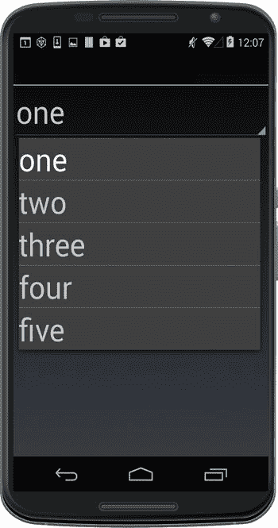

图 4-13。

Spinner is a dialog box

选择一个项目会触发`ItemSelected`事件，该事件可以内联处理，也可以用如下的处理程序方法处理:

`spinner.ItemSelected += new EventHandler<AdapterView.ItemSelectedEventArgs> (spinner_ItemSelected);`

下面是创建 toast 来显示选定项目的处理程序方法:

`private void spinner_ItemSelected (object sender, AdapterView.ItemSelectedEventArgs e)`

`{`

`Spinner spinner = (Spinner)sender;`

`string toast = string.Format ("Selection: {0}", spinner.GetItemAtPosition (e.Position));`

`Toast.MakeText (this, toast, ToastLength.Long).Show ();`

`}`

选择一个项目，弹出 toast，显示所选择的项目，如图 [4-14](#Fig14) 所示。

图 4-14。

A toast is Android’s way of raising a glass for an important occasion Note

填充微调器的另外两个有用的技术包括 XML `<string-array>`和数据绑定适配器。

#### 代码完成:微调器

机器人

完整的`SpinnerActivity.cs`如清单 [4-2](#FPar13) 所示。参考布局 XML 的可下载源代码。

Listing 4-2\. SpinnerActivity.cs in the ControlExamplesAndroid Solution

`[Activity (Label = "AndroidSelectionExamples", MainLauncher = true, Icon = "@drawable/icon")]`

`public class SpinnerActivity : Activity`

`{`

`protected override void OnCreate (Bundle bundle)`

`{`

`base.OnCreate (bundle);`

`SetContentView (Resource.Layout.Spinner);`

`Spinner spinner = FindViewById<Spinner> (Resource.Id.spinner);`

`spinner.ItemSelected += new EventHandler<AdapterView.ItemSelectedEventArgs> (spinner_ItemSelected);`

`string[] options = {"one", "two", "three", "four", "five"} ;`

`ArrayAdapter adapter = new ArrayAdapter (this,`

`Resource.Layout.TextViewForSpinner, options);`

`spinner.Adapter = adapter;`

`}`

`private void spinner_ItemSelected (object sender, AdapterView.ItemSelectedEventArgs e)`

`{`

`Spinner spinner = (Spinner)sender;`

`string toast = string.Format ("Selection: {0}", spinner.GetItemAtPosition (e.Position));`

`Toast.MakeText (this, toast, ToastLength.Long).Show ();`

`}`

`}`

### 日期选择器

机器人

`DatePicker`是用于选择月份、日期和年份的旋钮和/或日历。

Note

模态对话框不是像`DatePicker`这样的 Android pickers 的内置功能。默认情况下，Android pickers 是内嵌对话框。模态必须手工编码，在这种情况下使用`DatePickerDialog`。您将在下一节中完成这项工作。

通过使用设计器或用 XML 手工编码，向主布局添加一个`DatePicker`:

`<DatePicker`

`android:layout_width="match_parent"`

`android:layout_height="wrap_content"`

`android:id="@+id/datePicker" />`

在活动中实例化一个`DatePicker`。匹配布局和活动之间的小部件 ID 名称:

`DatePicker datePicker = FindViewById<DatePicker> (Resource.Id.datePicker);`

默认`DatePicker`如图 [4-15](#Fig15) 所示。

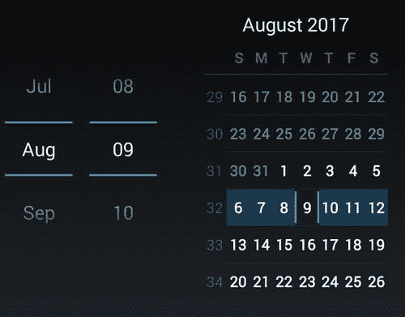

图 4-15。

The default DatePicker is a spinner and calendar

月和日列可以滚动，并可以接受键入的条目，使用户能够搜索月份或输入日期。右边的日历是可滚动的，日期是可选的。

这个例子创建了一个内联`DatePicker`，它占用了空间，甚至在用户使用它之后仍然保留在页面上。通常，`DatePickers`被实现为模态对话框，允许用户选择一个日期值来填充一个特定的文本字段，然后对话框在选择完成后消失。

#### 使用 DatePickerDialog 创建模式 DatePicker

下面的例子演示了一个可点击的文本视图，它调用`DatePicker`作为一个模态对话框。

在名为 Picker.axml 的新布局中，将`TextView`添加到`LinearLayout`中，并将其命名为`textView`，文本为`"Pick Date"`:

`<LinearLayout xmlns:android="`[`http://schemas.android.com/apk/res/android`](http://schemas.android.com/apk/res/android)T2】

`android:orientation="vertical"`

`android:layout_width="fill_parent"`

`android:layout_height="fill_parent">`

`<TextView`

`android:text="Pick Date"`

`android:textAppearance="?android:attr/textAppearanceLarge"`

`android:layout_width="match_parent"`

`android:layout_height="wrap_content"`

`android:id="@+id/textView" />`

`</LinearLayout>`

在活动中，声明一个`date`变量。引用`textView`并为调用`ShowDialog`方法的`Click`事件创建一个监听器:

`public class DatePickerActivity : Activity`

`{`

`DateTime date;`

`protected override void OnCreate (Bundle bundle)`

`{`

`base.OnCreate (bundle);`

`SetContentView (Resource.Layout.Picker);`

`var textView = FindViewById<TextView>(Resource.Id.textView);`

`textView.Click += delegate {`

`ShowDialog (0);`

`};`

`date = DateTime.Today;`

`}`

向调用`ShowDialog`时触发并实例化`DatePickerDialog`的活动添加一个方法:

`protected override Dialog OnCreateDialog (int id)`

`{`

`return new DatePickerDialog (this, HandleDateSet, date.Year, date.Month - 1, date.Day);`

`}`

`DatePickerDialog`由来自`date`变量的字段填充。最后，通过定义`HandleDateSet`来处理`DatePickerDialog`中日期的变化:

`void HandleDateSet (object sender, DatePickerDialog.DateSetEventArgs e)`

`{`

`var textView = FindViewById<TextView>(Resource.Id.textView);`

`date = e.Date;`

`textView.Text = date.ToString("d");`

`}`

这会将输入的`Date`赋给`date`变量，并将其格式化以放入`textView`的`Text`属性中。运行解决方案，查看图 [4-16](#Fig16) 中的`TextView`。

图 4-16。

textView patiently awaits a click

轻击/点击`TextView`弹出`DatePickerDialog`(图 [4-17](#Fig17) )。

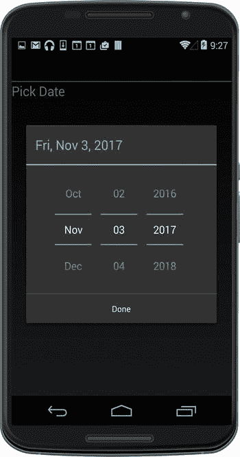

图 4-17。

DataPickerDialog modal dialog

旋转微调器，选择日期，然后单击“完成”。`textView`根据选择的日期更新(图 [4-18](#Fig18) )。

图 4-18。

The TextView displays the selected date

#### 代码完成:DatePickerExample 示例

机器人

清单 [4-3](#FPar15) 包含模态`DatePicker`对话框`DatePickerDialogExample`解决方案的活动代码。记得使用设计器将名为`textView`的`TextView`添加到主屏幕。

Listing 4-3\. DatePickerActivity.cs in the ControlExamplesAndroid Solution

`[Activity (Label = "DatePickerDialogExample", MainLauncher = true)]`

`public class DatePickerActivity : Activity`

`{`

`DateTime date;`

`protected override void OnCreate (Bundle bundle)`

`{`

`base.OnCreate (bundle);`

`SetContentView (Resource.Layout.Picker);`

`var textView = FindViewById<TextView>(Resource.Id.textView);`

`textView.Click += delegate {`

`ShowDialog (0);`

`};`

`date = DateTime.Today;`

`}`

`protected override Dialog OnCreateDialog (int id)`

`{`

`return new DatePickerDialog (this, HandleDateSet, date.Year, date.Month - 1, date.Day);`

`}`

`void HandleDateSet (object sender, DatePickerDialog.DateSetEventArgs e)`

`{`

`var textView = FindViewById<TextView>(Resource.Id.textView);`

`date = e.Date;`

`textView.Text = date.ToString("d");`

`}`

`}`

### TimePicker(时间选择器)

机器人

`TimePicker`是用于选择小时、分钟和上午/下午的旋钮。

Note

模态对话框不是像`TimePicker`这样的选择器的内置函数，必须手动编码，在这种情况下使用`TimePickerDialog`类。使用上一节为`DatePickerDialog`描述的模态技术。参见`ControlExamplesAndroid`解决方案中`TimePickerActivity.cs`的完整代码。

将名为`timePicker`的`TimePicker`添加到您的布局中:

`<TimePicker`

`android:layout_width="match_parent"`

`android:layout_height="wrap_content"`

`android:id="@+id/timePicker" />`

在您的活动中创建一个`TimePicker`类。匹配布局和活动之间的小部件 ID 名称:

`TimePicker timePicker = FindViewById<TimePicker> (Resource.Id.timePicker);`

可以在属性`CurrentHour`和`CurrentMinute`中设置默认时间值:

`timePicker.CurrentHour = (Java.Lang.Integer) 17;`

`timePicker.CurrentMinute = (Java.Lang.Integer) 30;`

`TimePicker`看起来像图 [4-19](#Fig19) 。

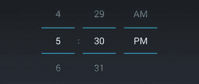

图 4-19。

TimePicker has columns of spinners

所有行都是可滚动的。对控件的更改会触发`TimeChanged`事件，可以通过以下方式进行内联处理:

`timePicker.TimeChanged += delegate(object sender, TimePicker.TimeChangedEventArgs e)`

`{`

`Toast.MakeText (this, "Hour: " + e.HourOfDay + " Minute: " + e.Minute, ToastLength.Short).Show();`

`};`

`e.HourOfDay`和`e.Minute`包含选择的时间值。图 [4-20](#Fig20) 所示为土司。

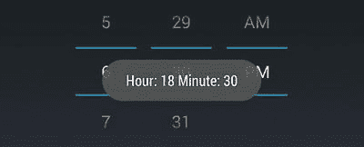

图 4-20。

Cheers! It’s that time

### 搜索栏

机器人

`SeekBar`是连续值的滑动输入杆。

向您的布局添加一个`SeekBar`:

`<SeekBar`

`android:layout_width="match_parent"`

`android:layout_height="wrap_content"`

`android:id="@+id/seekBar"/>`

在您的活动中创建一个`SeekBar`类:

`SeekBar seekBar = FindViewById<SeekBar> (Resource.Id.seekBar);`

`SeekBar`外形如图 [4-21](#Fig21) 。

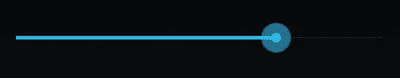

图 4-21。

SeekBar is a slider. Tip

`SeekBar`的最小值为零。

当`SeekBar`值改变时，触发`ProgressChanged`事件，可以这样内联处理:

`seekBar.ProgressChanged += (object sender, SeekBar.ProgressChangedEventArgs e) => {`

`if (e.FromUser)`

`{`

`Toast.MakeText (this, "Value: " + e.Progress, ToastLength.Short).Show ();`

`}`

`};`

选择值位于`e.Progress`属性中。如果更改是由用户发起的(不是以编程方式)，则`e.FromUser`属性为`true`。图 [4-22](#Fig22) 所示为土司。

图 4-22。

The toast memorializes the value Tip

通过实现`SeekBar.IOnSeekBarChangeListener`接口，还可以用监听器跟踪`SeekBar`。详见 [`http://developer.xamarin.com/recipes/android/controls/seekbar/`](http://developer.xamarin.com/recipes/android/controls/seekbar/) 。

Tip

使用`SeekBar.Max`可以更改默认的`SeekBar`范围。默认值为 100。

### 检验盒

机器人

`CheckBox`是一个标准的布尔型复选框控件，经常成组部署。

将`CheckBoxes`添加到您的布局中:

`<CheckBox`

`android:text="Option1"`

`android:layout_width="match_parent"`

`android:layout_height="wrap_content"`

`android:id="@+id/checkBox1" />`

`<CheckBox`

`android:text="Option2"`

`android:layout_width="match_parent"`

`android:layout_height="wrap_content"`

`android:id="@+id/checkBox2" />`

这些有 id`checkBox1`和`checkBox2`。`Text`属性包含显示的文本字符串。

在您的活动中创建`CheckBox`类(通常在`OnCreate`()):

`CheckBox checkBox1 = FindViewById<CheckBox> (Resource.Id.checkBox1);`

`CheckBox checkBox2 = FindViewById<CheckBox> (Resource.Id.checkBox2);`

复选框如图 [4-23](#Fig23) 所示。

图 4-23。

Two separate, unconnected check boxes

`Boolean`选择值存储在每个`CheckBox`的`CheckBox.Checked`属性中。

当一个复选框被点击时，一个`Click`事件被触发，这可以像在`OnCreate()`方法中这样被内联处理:

`checkBox1.Click += (o, e) => {`

`if (checkBox1.Checked)`

`Toast.MakeText (this, "Checked", ToastLength.Short).Show ();`

`else`

`Toast.MakeText (this, "Not checked", ToastLength.Short).Show ();`

`};`

这个处理程序显示一个 toast 来反映`checkBox1`的值。参见清单 [4-4](#FPar21) 中剩余的代码。

Tip

为了使`CheckBoxes`像一个组一样工作(例如，一次只能选择一个),它们必须手工编码，使用每个`CheckBox`的`Click`事件并手工设置每个事件的值。对于这些情况，您可能应该考虑`RadioButtons`，稍后将会介绍。

### 转换

机器人

`Switch`是一个布尔开/关小部件，通常用于打开或关闭功能。

向您的布局添加一个`Switch`:

`<Switch`

`android:layout_width="wrap_content"`

`android:layout_height="wrap_content"`

`android:id="@+id/switch1"`

`android:layout_gravity="center_horizontal" />`

在活动中实例化一个`Switch`类:

`Switch switch1 = FindViewById<Switch> (Resource.Id.switch1);`

一个`Switch`看起来像图 [4-24](#Fig24) 。

图 4-24。

Switch is on, waiting for a tap

布尔值存储在`Switch.IsChecked`属性中。点击控件触发`CheckedChange`事件，可以这样处理:

`switch1.CheckedChange += delegate(object sender, CompoundButton.CheckedChangeEventArgs e)`

`{`

`var toast = Toast.MakeText (this, "Selection:" + (e.IsChecked ?  "On" : "Off"), ToastLength.Short);`

`toast.Show ();`

`};`

这会弹出一个带有开关量的祝酒词(图 [4-25](#Fig25) )。

图 4-25。

Toast displaying Switch state

#### 使用标题、开关文本和状态进行自定义

出现在开关前的文本标题，通常是一个特征或问题，可以添加到`text`属性中。使用`textOn`和`textOff`属性可以改变开关本身的默认文本(例如，指示是/否而不是开/关)。默认开关开/关状态可通过`checked`属性更改:

`<Switch android:text="Feature activated?"`

`android:id="@+id/switch1"`

`android:layout_width="wrap_content"`

`android:layout_height="wrap_content"`

`android:checked="true"`

`android:textOn="YES"`

`android:textOff="NO" />`

这就产生了一个定制的开关(图 [4-26](#Fig26) )。

图 4-26。

The text property shows a label, and On/Off is now Yes/No

### 单选按钮

机器人

一个`RadioButton`是一个可选择的按钮部件，可以通过使用一个`RadioGroup`与其他`RadioButtons`组合在一起。这种分组使选择相互排斥，因此一次只能选择一个按钮。

在布局中创建包含`RadioButtons`的`RadioGroup`:

`<RadioGroup`

`android:layout_width="fill_parent"`

`android:layout_height="wrap_content"`

`android:orientation="vertical">`

`<RadioButton android:id="@+id/radio1"`

`android:layout_width="wrap_content"`

`android:layout_height="wrap_content"`

`android:text="First" />`

`<RadioButton android:id="@+id/radio2"`

`android:layout_width="wrap_content"`

`android:layout_height="wrap_content"`

`android:text="Second" />`

`</RadioGroup>`

这里我们有两个 id 分别为`radio1`和`radio2`的`RadioButtons`。它们的文本属性分别设置为 First 和 Second，这是将出现在按钮旁边的文本。

在`OnCreate`外的活动顶部创建`RadioButtons`:

`RadioButton radio1;`

`RadioButton radio2;`

在`OnCreate`中，找到按钮:

`radio1 = FindViewById<RadioButton>(Resource.Id.radio1);`

`radio2 = FindViewById<RadioButton>(Resource.Id.radio2);`

图 [4-27](#Fig27) 显示了结果。

图 4-27。

RadioGroup of two RadioButtons

点击`RadioButton`会触发一个`Click`事件，可以这样处理:

`radio1.Click += RadioButtonClick;`

`radio2.Click += RadioButtonClick;`

将处理程序方法放在`OnCreate`方法之外:

`private void RadioButtonClick (object sender, EventArgs e)`

`{`

`RadioButton rb = (RadioButton)sender;`

`Toast.MakeText (this, rb.Text, ToastLength.Short).Show ();`

`}`

这将在点击时烘烤`RadioButton`的`text`属性(图 [4-28](#Fig28) )。

图 4-28。

Cheers, First!

### 代码完成:Android 控件

机器人

清单 [4-4](#FPar21) 包含`SeekBar`、`CheckBox`和`Switch`控件的活动代码。关于`DatePicker`和`TimePicker`的例子，参见清单 [4-3](#FPar14) 和可下载的代码解决方案`ControlExamplesAndroid`。

图 [4-29](#Fig29) 显示了此处包含的所有选择控件。

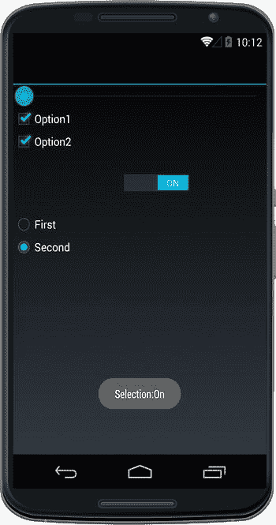

图 4-29。

Android selection controls Listing 4-4\. SelectionActivity.cs in the ControlExamplesAndroid Solution

`public class SelectionActivity : Activity`

`{`

`RadioButton radio1;`

`RadioButton radio2;`

`protected override void OnCreate (Bundle bundle)`

`{`

`base.OnCreate (bundle);`

`SetContentView (Resource.Layout.Selection);`

`SeekBar seekBar = FindViewById<SeekBar> (Resource.Id.seekBar);`

`seekBar.ProgressChanged += (object sender, SeekBar.ProgressChangedEventArgs e) =>`

`{`

`if (e.FromUser)`

`{`

`Toast.MakeText(this, "Value: " + e.Progress, ToastLength.Short).Show();`

`}`

`};`

`CheckBox checkBox1 = FindViewById<CheckBox> (Resource.Id.checkBox1);`

`CheckBox checkBox2 = FindViewById<CheckBox> (Resource.Id.checkBox2);`

`checkBox1.Click += (o, e) =>`

`{`

`if (checkBox1.Checked)`

`Toast.MakeText(this, "Box 1 Checked", ToastLength.Short).Show();`

`else`

`Toast.MakeText(this, "Box 1 Not checked", ToastLength.Short).Show();`

`};`

`checkBox2.Click += (o, e) =>`

`{`

`if (checkBox2.Checked)`

`Toast.MakeText(this, "Box 2 Checked", ToastLength.Short).Show();`

`else`

`Toast.MakeText(this, "Box 2 Not checked", ToastLength.Short).Show();`

`};`

`Switch switch1 = FindViewById<Switch> (Resource.Id.switch1);`

`switch1.CheckedChange += delegate(object sender, CompoundButton.CheckedChangeEventArgs e)`

`{`

`var toast = Toast.MakeText(this, "Selection:" + (e.IsChecked ? "On" : "Off"), ToastLength.Short);`

`toast.Show();`

`};`

`radio1 = FindViewById<RadioButton>(Resource.Id.radio1);`

`radio2 = FindViewById<RadioButton>(Resource.Id.radio2);`

`radio1.Click += RadioButtonClick;`

`radio2.Click += RadioButtonClick;`

`}`

`private void RadioButtonClick(object sender, EventArgs e)`

`{`

`RadioButton rb = (RadioButton)sender;`

`Toast.MakeText(this, rb.Text, ToastLength.Short).Show();`

`}`

`}`

如果你准备好学习更多关于 Android 的知识，那么翻到第五章，在那里你会学到关于列表的知识。

对于 iOS 控件，请继续阅读。接下来我们来探索 Xamarin.iOS 平台特定的控件。在构建 Xamarin.iOS 平台特定的解决方案或在 Xamarin 中创建 iOS 自定义渲染器时，可以使用这些控件。形成解决方案，如第 8 章中的[所述。](08.html)

## iOS 控制

我是操作系统

一些最常见的 iOS 选择控件有`UIPickerView`、`UIDatePicker`、`UIStepper`、`UISlider`、`UISwitch. UIPickerView`提供了一个下拉列表，`UIStepper`给出了一个用于更改数值的加/减按钮，其余的不言自明。

与 Android 类似，iOS 控件默认不产生模态对话框，只产生内联对话框。使用以下章节描述的`UITextField.InputView`模态对话技术。

### 滚轮

`UIPickerView`控件提供了一个下拉列表，用于选择单个项目，通常是从一个从数据模型获得的短列表中选择。

`UIPickerView`通常与一个`UITextField`相连，点击后会弹出拾取器。该选择器被数据绑定到一个名为`UIPickerViewModel`的专用视图模型类，该类从其包含的数据模型中返回行，并具有一个`ValueChanged`方法和返回所选值的`SelectedItem`属性。

让我们构建一个允许用户选择颜色的下拉菜单。

使用您选择的设计器，向您的布局(故事板)添加一个`UITextField`，并将其命名为`color`。然后将数据模型准备为一个类`PickerModel`(清单 [4-5](#FPar22) )。将它放在名为`DatePickerViewController`的`UIViewController`中的`ViewDidLoad`方法下面。

Listing 4-5\. PickerModel Provides Data for UIPickerView, ValueChangedEvent, and SelectedItem

`public class PickerModel : UIPickerViewModel`

`{`

`private readonly IList<string> items = new List<string>`

`{`

`"Red",`

`"Blue",`

`"Green",`

`"Yellow",`

`"Black"`

`} ;`

`public event EventHandler<EventArgs> ValueChanged;`

`protected int selectedIndex = 0;`

`public PickerModel()`

`{`

`}`

`public string SelectedItem`

`{`

`get { return items[selectedIndex]; }`

`}`

`public override nint GetComponentCount (UIPickerView picker)`

`{`

`return 1;`

`}`

`public override nint GetRowsInComponent (UIPickerView picker, nint component)`

`{`

`return items.Count;`

`}`

`public override string GetTitle (UIPickerView picker, nint row, nint component)`

`{`

`return items[(int)row];`

`}`

`public override nfloat GetRowHeight (UIPickerView picker, nint component)`

`{`

`return 40f;`

`}`

`public override void Selected (UIPickerView picker, nint row, nint component)`

`{`

`selectedIndex = (int)row;`

`if (this.ValueChanged != null)`

`{`

`this.ValueChanged (this, new EventArgs ());`

`}`

`}`

`}`

组件是选择器中的列。该示例只有一个组件/列。做出选择会触发`Selected`事件，该事件将选择的值存储在`selectedIndex`中，然后触发`ValueChanged`事件，该事件稍后会处理选择的值。

Tip

`Nint`和`nfloat`是 Xamarin.iOS 统一 API 中添加的本地 iOS 数据类型，用于 32 位和 64 位支持。

在您的`ViewDidLoad`方法中，创建一个`selectedColor`字符串来存储选择的值。然后实例化`PickerModel`并连接`model.ValueChanged`事件，其中`selectedColor`由所选项目填充:

`public override void ViewDidLoad ()`

`{`

`string selectedColor = "";`

`PickerModel model = new PickerModel();`

`model.ValueChanged += (sender, e) => {`

`selectedColor = model.SelectedItem;`

`} ;`

对`UIPickerView`进行编码并设置其属性，包括分配`Model`和设置`color.Text`的默认值:

`UIPickerView picker = new UIPickerView();`

`picker.ShowSelectionIndicator = true;`

`picker.BackgroundColor = UIColor.White;`

`picker.Model = model;`

`this.color.Text = model.SelectedItem;`

现在，让我们将该选取器制作成一个弹出窗口。

#### 将 UIPickerView 视图制作成弹出窗口

我是操作系统

有几种方法可以创建一个模态对话框，最常用的是使用`UITextField.InputView`。`UITextField`的`InputView`属性支持替代“键盘”的分配，这里是一个`UIPickerView`。这个键盘可以用额外的控件来修饰，比如带有“完成”按钮的工具栏。

仍然在`ViewDidLoad`方法中，创建一个`UIToolbar`。然后添加完成按钮，点击该按钮时会用颜色填充`textField`:

`UIToolbar toolbar = new UIToolbar();`

`toolbar.BarStyle = UIBarStyle.Default;`

`toolbar.Translucent = true;`

`toolbar.SizeToFit();`

`UIBarButtonItem doneButton = new UIBarButtonItem("Done", UIBarButtonItemStyle.Done,`

`(s, e) => {`

`this.color.Text = selectedColor;`

`this.color.ResignFirstResponder();`

`} );`

`toolbar.SetItems(new UIBarButtonItem[]{doneButton}, true);`

`ResignFirstResponder`方法将键盘从`textField`中移除。

将工具栏分配给`textField`的`InputAccessoryView`属性。

`this.color.InputAccessoryView = toolbar;`

最后，通过使用`InputView`属性将您的选取器与`UITextField`相关联。这使得当文本控件被点击时,`UIPickerView`控件变成一个模态弹出窗口。

`this.color.InputView = picker;`

点击文本视图弹出选择器(图 [4-30](#Fig30) )。

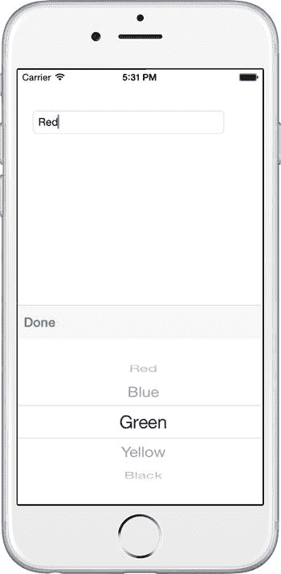

图 4-30。

Color text field with picker pop-up

轻按“完成”执行该动作，该动作用选定的颜色填充文本框(图 [4-31](#Fig31) )，然后使用`ResignFirstResponder()`方法关闭选取器，从`textField`关闭键盘。

图 4-31。

The color text field populated with the selected color Note

关于模态的更多信息，参见第 6 章。

#### 代码完成:UIPickerView

我是操作系统

清单 [4-6](#FPar25) 展示了`UIPickerView`的完整代码示例。记得使用设计工具将名为`color`的`UITextField`添加到你的布局中。

Listing 4-6\. PickerViewController.cs from the PickerExample solution

`public partial class PickerViewController : UIViewController`

`{`

`public PickerViewController (IntPtr handle) : base (handle)`

`{`

`}`

`public override void ViewDidLoad ()`

`{`

`base.ViewDidLoad ();`

`string selectedColor = "";`

`PickerModel model = new PickerModel();`

`model.ValueChanged += (sender, e) => {`

`selectedColor = model.SelectedItem;`

`} ;`

`UIPickerView picker = new UIPickerView();`

`picker.ShowSelectionIndicator = true;`

`picker.BackgroundColor = UIColor.White;`

`picker.Model = model;`

`this.color.Text = model.SelectedItem;`

`UIToolbar toolbar = new UIToolbar();`

`toolbar.BarStyle = UIBarStyle.Default;`

`toolbar.Translucent = true;`

`toolbar.SizeToFit();`

`UIBarButtonItem doneButton = new UIBarButtonItem("Done", UIBarButtonItemStyle.Done,`

`(s, e) => {`

`this.color.Text = selectedColor;`

`this.color.ResignFirstResponder();`

`} );`

`toolbar.SetItems(new UIBarButtonItem[]{doneButton}, true);`

`this.color.InputAccessoryView = toolbar;`

`this.color.InputView = picker;`

`}`

`public class PickerModel : UIPickerViewModel`

`{`

`private readonly IList<string> items = new List<string>`

`{`

`"Red",`

`"Blue",`

`"Green",`

`"Yellow",`

`"Black"`

`} ;`

`public event EventHandler<EventArgs> ValueChanged;`

`protected int selectedIndex = 0;`

`public PickerModel()`

`{`

`}`

`public string SelectedItem`

`{`

`get { return items[selectedIndex]; }`

`}`

`public override nint GetComponentCount (UIPickerView picker)`

`{`

`return 1;`

`}`

`public override nint GetRowsInComponent (UIPickerView picker, nint component)`

`{`

`return items.Count;`

`}`

`public override string GetTitle (UIPickerView picker, nint row, nint component)`

`{`

`return items[(int)row];`

`}`

`public override nfloat GetRowHeight (UIPickerView picker, nint component)`

`{`

`return 40f;`

`}`

`public override void Selected (UIPickerView picker, nint row, nint component)`

`{`

`selectedIndex = (int)row;`

`if (this.ValueChanged != null)`

`{`

`this.ValueChanged (this, new EventArgs ());`

`}`

`}`

`}`

`}`

Tip

iOS 选取器的模态弹出可以通过其他方法产生。这些需要使用`UIViewController`或`UIPopover`手动编码。创建一个包含选取器、标题标签和完成按钮的自定义`UIViewController`类。实例化模态`ViewController`并用`await PresentViewControllerAsync(viewController, true);`呈现视图。

### 日期选择器

我是操作系统

`UIDatePicker`是用于选择日期和时间的旋钮式控件(图 [4-32](#Fig32) )。

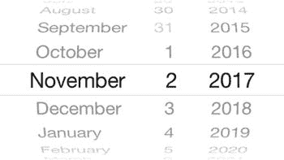

图 4-32。

UIDatePicker has columns of spinners

`UIDatePicker`通常链接到一个`UITextField`上，点击它会弹出拾取器。

使用您选择的设计器，在布局上创建一个`UITextField`，并将其命名为`textView`。在`Text`属性中输入字段的名称，在这里是`Your Birthday`。

在`ViewController’s` `ViewDidLoad`方法中，对`UIDatePicker`进行编码，并将`Mode`属性设置为`Date`，以允许仅日期选择:

`UIDatePicker datePicker = new UIDatePicker ();`

`datePicker.Mode = UIDatePickerMode.Date;`

`datePicker.BackgroundColor = UIColor.White;`

Tip

在接下来的“指定显示哪些字段”小节中，我们将介绍其他模式，如`Time`、`DateAndTime`和`CountDownTimer`。

使用`MinimumDate`和`MaximumDate`属性限制条目的范围:

`datePicker.MinimumDate = (NSDate)DateTime.Today.AddDays(-7);`

`datePicker.MaximumDate = (NSDate)DateTime.Today.AddDays(7);`

本示例将日期限制在以今天的日期为中心的两周范围内。可以使用微调器选择此范围之外的日期，但是微调器会在允许的范围内转回。

接下来，您需要将日期选择器制作成一个弹出窗口。

#### 将 UIDatePicker 制作成弹出窗口

像`UIPickerView`一样，模态对话框可以通过几种方式创建，最常见的是使用`UITextField.InputView`。`UITextField`的`InputView`属性支持另一个“键盘”的分配，在本例中就是一个`UIDatePicker`。这个键盘可以用额外的控件来修饰，比如带有“完成”按钮的工具栏。创建一个`UIToolbar`并添加 Done 按钮，点击该按钮时会用日期填充`textField`:

`UIToolbar toolbar = new UIToolbar();`

`toolbar.BarStyle = UIBarStyle.Default;`

`toolbar.Translucent = true;`

`toolbar.SizeToFit();`

`UIBarButtonItem doneButton = new UIBarButtonItem("Done", UIBarButtonItemStyle.Done,`

`(s, e) => {`

`DateTime dateTime = DateTime.SpecifyKind((DateTime)datePicker.Date, DateTimeKind.Unspecified);`

`this.textField.Text = dateTime.ToString("MM-dd-yyyy");`

`this.textField.ResignFirstResponder();`

`} );`

`toolbar.SetItems(new UIBarButtonItem[]{doneButton}, true);`

`DateTime.SpecifyKind`以正确的格式返回新的日期/时间值。`ResignFirstResponder`方法将键盘从`textField`中移除。

将工具栏分配给`textField`的`InputAccessoryView`属性:

`this.textField.InputAccessoryView = toolbar;`

最后，通过使用`InputView`属性将日期选择器与`UITextField`相关联。当点击文本控件时，这将导致`UIDatePicker`控件变成一个模式弹出窗口:

`this.textField.InputView = datePicker;`

点击文本视图弹出日期选择器(图 [4-33](#Fig33) )。

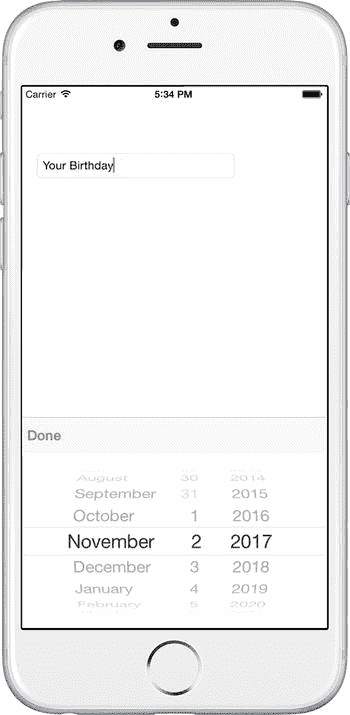

图 4-33。

textField with popped-up datePicker

点击完成选项执行该动作，该动作用格式化的日期填充文本框(图 [4-34](#Fig34) )，并通过使用`ResignFirstResponder()`方法从`textField`关闭键盘来关闭选取器。

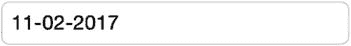

图 4-34。

The textField populated with a formatted date

各种字段可以出现在`UIDatePicker`选择中。接下来让我们看看这些。

#### 指定要显示的字段

用`Mode`属性指定`UIDatePicker`中使用的字段，该属性使用`UIDatePickerMode`枚举器。例如`datePicker.Mode = UIDatePickerMode.` `Date` `;`

使用这些`UIDatePickerMode`来指定指示的字段:

*   `Time`:仅选择时间
*   `Date`:仅选择日期
*   `DateAndTime`:选择日期和时间
*   `CountDownTimer`:仅选择小时和分钟

Tip

在`CountDownTimer`模式下，`CountDownDuration`属性包含所选时间的总秒数。

#### 代码完成:UIDatePicker

我是操作系统

清单 [4-7](#FPar29) 显示了完整的`UIDatePicker`示例。记得使用设计工具将`textField`添加到布局中。

Listing 4-7\. DatePickerViewController.cs from the DatePickerExample solution

`public partial class DatePickerViewController : UIViewController {`

`public override void ViewDidLoad ()`

`{`

`base.ViewDidLoad ();`

`UIDatePicker datePicker = new UIDatePicker ();`

`datePicker.Mode = UIDatePickerMode.Date;`

`datePicker.BackgroundColor = UIColor.White;`

`datePicker.MinimumDate = (NSDate)DateTime.Today.AddDays(-7);`

`datePicker.MaximumDate = (NSDate)DateTime.Today.AddDays(7);`

`UIToolbar toolbar = new UIToolbar();`

`toolbar.BarStyle = UIBarStyle.Default;`

`toolbar.Translucent = true;`

`toolbar.SizeToFit();`

`UIBarButtonItem doneButton = new UIBarButtonItem("Done", UIBarButtonItemStyle.Done,`

`(s, e) => {`

`DateTime dateTime = DateTime.SpecifyKind((DateTime)datePicker.Date, DateTimeKind.Unspecified);`

`this.textField.Text = dateTime.ToString("MM-dd-yyyy");`

`this.textField.ResignFirstResponder();`

`} );`

`toolbar.SetItems(new UIBarButtonItem[]{doneButton}, true);`

`this.textField.InputAccessoryView = toolbar;`

`this.textField.InputView = datePicker;`

`}`

### ui 步进器

我是操作系统

`UIStepper`是离散值的递增/递减按钮，在需要对值进行细微更改时非常有用。使用您选择的设计器向视图添加一个`UIStepper`。

在 Properties 视图中定位按钮并将其命名为`stepper`。运行时，应如图 [4-35](#Fig35) 所示。

图 4-35。

Stepper

使用`MinimumValue`和`MaximumValue`属性设置控件将接受的值的范围:

`stepper.MinimumValue = 0;`

`stepper.MaximumValue = 11;`

在步进器上方添加一个名为`stepperLabel`的`UILabel`来显示步进值。点击控件触发`ValueChanged`事件，可以这样处理:

`stepper.ValueChanged += (object sender, EventArgs e) => stepperLabel.Text = stepper.Value.ToString ();`

步进器的值包含在`Value`属性中。运行它并点击加号按钮，点击从 0 到 8，看起来如图 [4-36](#Fig36) 。

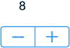

图 4-36。

stepperLabel and stepper

一直点加号，值增加到 11。

`StepValue`属性将步进器增加指定的值。一次递增 2(0、2、4 等)，如下所示:

`stepper.StepValue = 2;`

使用这些布尔属性可以调整使用步进器的体验:

*   `AutoRepeat`:如果`true`，按住步进按钮反复改变数值。默认= `true`。`stepper.AutoRepeat = true;`
*   `Continuous`:如果`true`，所有值的改变都会触发一个事件。如果是`false`，只有当用户交互停止时，事件才会触发。默认= `true`。`stepper.Continuous = true;`
*   `Wraps`:如果`true`，则当值达到`MinimumValue`时，进入`MaximumValue`。相反，当它到达`MaximumValue`时，进一步的增量改变它到`MinimumValue`。默认= `false`。`stepper.Wraps = false;`

### ui slider(ui slider)

我是操作系统

`UISlider`是一个滑动输入按钮，用于在数值范围内进行选择。使用您选择的设计器向视图添加一个`UISlider`。

定位滑块并将其拉伸到所需的宽度。在`Properties`视图中将其命名为`slider`。运行时，应如图 [4-37](#Fig37) 所示。

图 4-37。

Slider in its native habitat

这些属性可以在“属性”视图或代码中设置:

`slider.MinValue = -1;`

`slider.MaxValue = 2;`

`slider.Value = 0.5f;`

`MinValue`和`MaxValue`属性决定了滑块的端点值。`Value`属性是滑块的默认值。

在步进器上方添加一个名为`sliderLabel`的`UILabel`来显示步进值。当滑块移动时，触发`ValueChanged`事件，可以这样处理:

`slider.ValueChanged += (sender,e) => sliderLabel.Text = ((UISlider)sender).Value.ToString ();`

运行时，滑块如图 [4-38](#Fig38) 所示，显示滑块设置在`MinValue`。

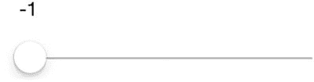

图 4-38。

Slider slid far left

图 [4-39](#Fig39) 显示`MaxValue`。

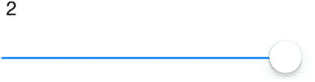

图 4-39。

Slider slid far right

您可以使用这些属性来自定义滑块的外观:

*   `MinimumTrackTintColor`:按钮左侧滑动线条的颜色。`slider.MinimumTrackTintColor = UIColor.LightGray;`
*   `MaximumTrackTintColor`:按钮右侧滑动线条的颜色。`slider.MaximumTrackTintColor = UIColor.Green;`
*   `ThumbTintColor`:拇指按钮的颜色。然而，由于苹果的一个 bug，在撰写本文时，这个选项并不可靠。在设置`ThumbTintColor`之前，使用以下解决方法使其工作:`slider.SetThumbImage(UIImage.FromBundle("thumb.png"),UIControlState.Normal);` `slider.ThumbTintColor = UIColor.Brown;`

在与图像名称对应的`Resources`文件夹中放置一个小的虚拟图像。

### 复选框:使用 UISwitch 或 MonoTouch。对话

我是操作系统

iOS 没有开箱即用的复选框控件，所以很多开发者使用`UISwitch`，接下来解释。你也可以使用`MonoTouch.Dialog`，这是一个库，它使得跨平台应用的设置 ui 易于创建。(详见 [`https://github.com/migueldeicaza/MonoTouch.Dialog`](https://github.com/migueldeicaza/MonoTouch.Dialog) 。)

### unis switch

我是操作系统

`UISwitch`已经成为布尔开/关控制的标准。使用您选择的设计器将`UISwitch`添加到视图中。

在 Properties 视图中定位它并将其命名为`thisSwitch`。运行时，应如图 [4-40](#Fig40) 所示。

图 4-40。

UISwitch turned on

`UISwitch.On`属性包含开关的布尔值，可以设置或获取。将其设置为`true`以创建默认值或以编程方式进行设置:

`thisSwitch.On = true;`

从`On`属性中获取状态，如下所示:

`bool state = thisSwitch.On;`

在开关上方添加一个名为`switchLabel`的`UILabel`来显示开关值。当开关移动时，触发`ValueChanged`事件，可以这样处理:

`thisSwitch.ValueChanged += (sender, e) => switchLabel.Text = thisSwitch.On.ToString();`

打开开关(图 [4-41](#Fig41) )，查看标签是否变为真。

图 4-41。

It is true

关闭开关(图 [4-42](#Fig42) )可以看到标签变为 False。

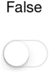

图 4-42。

Not true at all

您可以使用这些属性来自定义交换机的外观:

*   `ThumbTintColor`:拇指按钮的颜色`thisSwitch.ThumbTintColor = UIColor.Blue;`
*   `TintColor`:开关边缘周围的颜色`thisSwitch.TintColor = UIColor.Blue;`
*   `OnTintColor`:按钮打开时按钮周围开关的颜色`thisSwitch.OnTintColor = UIColor.Black;`
*   `OnImage`:当开关打开`switch.OnImage = onImage;`时，用于代替默认缩略图的图像
*   `OffImage`:当开关关闭时用于代替默认缩略图的图像`switch.OffImage = offImage;`

Note

在`OnImage`和`OffImage`中使用的缩略图的尺寸必须小于或等于 77 磅宽和 27 磅高。如果指定较大的图像，边缘可能会被剪裁。

### 代码完成:iOS 控件

我是操作系统

清单 [4-8](#FPar31) 显示了`ViewDidLoad`方法中完整的`UISlider`、`UIStepper`和`UISwitch`示例。

图 [4-43](#Fig43) 显示了所有三个选择控件。

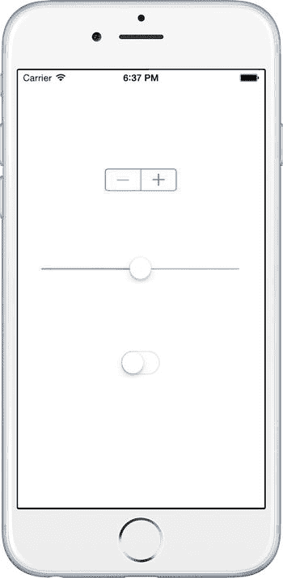

图 4-43。

UISlider, UIStepper, and UISwitch Listing 4-8\. From SelectionViewController.cs in the StepperSliderSwitch solution

`public override void ViewDidLoad ()`

`{`

`base.ViewDidLoad ();`

`slider.MinValue = -1;`

`slider.MaxValue = 2;`

`slider.Value = 0.5f;`

`slider.SetThumbImage(UIImage.FromBundle("thumb.png"),UIControlState.Normal);`

`slider.ThumbTintColor = UIColor.Brown;`

`slider.MinimumTrackTintColor = UIColor.LightGray;`

`slider.MaximumTrackTintColor = UIColor.Green;`

`slider.ValueChanged += (sender, e) => sliderLabel.Text = ((UISlider)sender).Value.ToString ();`

`stepper.MinimumValue = 0;`

`stepper.MaximumValue = 11;`

`stepper.StepValue = 2;`

`stepper.ValueChanged += (object sender, EventArgs e) => stepperLabel.Text = stepper.Value.ToString ();`

`thisSwitch.On = false;`

`thisSwitch.TintColor = UIColor.Blue;`

`thisSwitch.OnTintColor = UIColor.Black;`

`bool state = thisSwitch.On;`

`thisSwitch.ValueChanged += (sender, e) => switchLabel.Text = thisSwitch.On.ToString();`

`}`

## 摘要

许多控件都有一个共同的目标:允许用户选择一个值。简单的选择控件要求我们指定最小值和最大值，并设置一个默认值。选择器/微调器在模态对话框中工作得最好，我们使用它们从列表中选择或者选择日期和时间。Xamarin。表单为您处理模态弹出窗口，而 Android 和 iOS 需要您自己滚动。Android 提供了一些有用的现成组件，如`DatePickerDialog`和`TimePickerDialog`，但`DialogFragment`也是一个很好的模型。对于 iOS 中的模态，使用`UITextField.InputView`属性(不再使用`ActionSheets`)。

本章中的选择控件通常提供某种类型的值更改或单击事件，以允许您的代码响应值的更改。虽然不可或缺，但本章中的控件非常简单。在下一章中，你将深入到移动用户界面选择的核心，当使用列表和表格时，数据和选择都可能更加丰富和复杂。