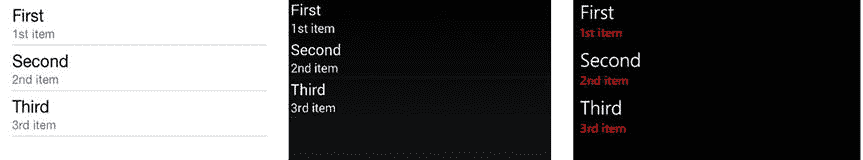
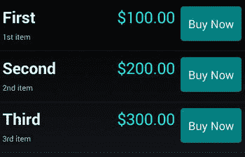
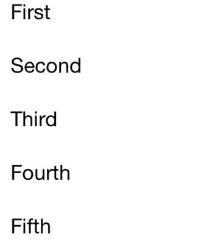
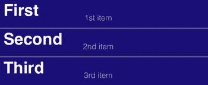

# 5.制作可滚动列表

从一长串项目中快速选择是移动 UI 的关键功能之一。移动电话屏幕上有限的空间使数据网格成为一个挑战，并导致列表的广泛和创造性使用。项目分组、滚动、手势敏感性和图像使列表成为最通用和可重用的数据绑定工具之一。列表对于移动开发就像数据网格对于 web 开发一样。

本章介绍了每个库中可用的列表类，以创建一个可滚动、可选择的列表。主要考虑的问题包括绑定到数据模型、处理项目选择、定制行的外观、对标题进行分组，以及可能最重要的:性能。

以下是可用于在每个平台上创建可滚动列表的选项:

Xamarin。表单列表视图

`ListView`绑定到数组或数据模型。

Android ListView

使用`Adapter`将`ListView`绑定到数组或数据模型。

iOS UITableView

使用`UITableViewSource`将`UITableView`绑定到数组或数据模型。

## 数据适配器

Android 和 iOS 列表需要单独的适配器进行数据绑定。在 Android 中，我们使用`BaseAdapter`，在 iOS 中有`UITableViewSource`。在 Xamarin。表单，不需要额外的适配器类。我们可以使用默认列表模板的`ItemsSource`属性直接绑定到一个`Strings`列表。我们还可以绑定到数据模型，并通过名为`ItemTemplate`的`ListView's`内置适配器类使用定制列表，该适配器类是使用`SetBinding`方法配置的。

## Xamarin。表单列表视图

xamarin.forms

Xamarin 中的列表。使用绑定到数组或数据模型的`ListView`控件创建表单。Xamarin。Forms `ListView`类提供了一个可滚动、可选择的列表。使用布局、图像和视图(如按钮)可以自定义列表行。`ListView`支持分组、页眉、页脚、跳转列表、拉式刷新。使用上下文操作支持对列表行进行删除和应用操作。

本章中的列表是只读的，这意味着它们绑定到数据源以供查看和选择，但不能编辑、删除或添加行。在“上下文操作和定制列表行”一节中，我们会涉及一些可编辑列表 UI 技术，但不会涉及数据模型或双向数据绑定的更改，因此这些更改可以反映在列表中。可编辑的`ListView`数据绑定参见[第 7 章](07.html)。

带有`ListView`的起点是将它绑定到数据源的数据。

### 绑定到字符串列表

最简单的`ListView`实现是绑定到`Strings`的`List`。

在页面上实例化一个`ListView`类，并使用`ItemsSource`属性将它指向一个数据源，在本例中是`Strings`的`List`。使用默认布局，`ListView`中的每一项都是一个单元格，使用`TextCell`模板显示单行文本。

`class ListViewStrings : ContentPage`

`{`

`public ListViewStrings()`

`{`

`ListView listView = new ListView();`

`List<String> items = new List<String>() {"First","Second","Third"};`

`listView.ItemsSource = items;`

`this.Content = listView;`

`}`

`}`

这是图 [5-1](#Fig1) 中的列表。

图 5-1。

ListView in iOS, Android, and Windows Phone Tip

使用第三章中提到的布局`Padding`属性在列表边缘创建空间。

`Padding = new Thickness (0, Device.OnPlatform (20, 0, 0), 0, 0);`

选择一个列表项会触发`ItemSelected`事件。

### 选择一个项目

xamarin.forms

有两个事件用于项目选择:`ItemTapped`和`ItemSelected`。当用户点击`ListView`中的单元格时，这两种情况都会发生。当一个列表不仅仅允许点击，而且可以选择和取消选择项目时，它们之间的区别就很明显了。在没有取消行选择的简单列表中(就像这里的例子)，它们之间几乎没有区别。

`ItemTapped`是最简单的。当单击列表行时，它作为一个运动事件激发。

`listView.ItemTapped += async (sender, e) =>`

`{`

`await DisplayAlert("Tapped", e.Item.ToString() + " was selected.", "OK");`

`};`

`ItemSelected`事件响应行选择状态的变化，并在选择或取消选择行时发生。

`listView.ItemSelected += async (sender, e) =>`

`{`

`await DisplayAlert("Selected", e.SelectedItem.ToString()+ " was selected.", "OK");`

`};`

在这些事件处理程序上使用`async/await`并不是强制性的，但是在完成任何处理时，这是一个好习惯，以避免占用 UI 线程。使用`ItemTapped`或`ItemSelected`选择第一项，结果如图 [5-2](#Fig2) 。

图 5-2。

The alert displays the selected item Tip

`DisplayAlert`方法比安卓吐司更能提供信息。它提供了一个标题，需要交互来清除它。

通过将`ListView's SelectedItem`属性设置为 null 来清除选定的行(删除突出显示的行)。最容易做到这一点的地方是在`ItemTapped`处理器内部。

`listView.ItemTapped += async (sender, e) =>`

`{`

`await DisplayAlert("Tapped", e.Item.ToString() + " was selected.", "OK");`

`((ListView)sender).SelectedItem = null` `;`

`};`

如果您正在使用`ItemSelected`事件，请注意更改`SelectedItem`值会再次触发`ItemSelected`事件。因此，在响应事件之前，您需要检查`e.SelectedItem`是否为空。

`listView.ItemSelected += async (sender, e) =>`

`{`

`if (e.SelectedItem == null) return;`

`await DisplayAlert("Selected", e.SelectedItem.ToString() + " was selected.", "OK");`

`((ListView)sender).SelectedItem = null;`

`};`

清单 [5-1](#FPar3) 展示了绑定到`Strings`的`List`的完整`ListView`示例，使用`async/await`选择一个项目作为`ItemTapped`事件处理程序的后台，然后在完成后清除选中的行。

Listing 5-1\. Binding to a List of Strings in ListViewStrings.cs

`class ListViewStrings: ContentPage`

`{`

`public ListViewStrings()`

`{`

`var items = new List<String>() {"First","Second","Third"};`

`var listView = new ListView();`

`listView.ItemsSource = items;`

`listView.ItemTapped += async (sender, e) =>`

`{`

`await DisplayAlert("Tapped", e.Item.ToString() + " was selected.", "OK");`

`((ListView)sender).SelectedItem = null;`

`};`

`this.Padding = new Thickness(0, Device.OnPlatform(20, 0, 0), 0, 0);`

`this.Content = listView;`

`}`

`}`

Tip

多行选择必须手动编码，这里不讨论。

一个`List<String>`对于演示是有用的，但是在许多真实世界的场景中，我们绑定到一个数据模型。

### 绑定到数据模型

xamarin.forms

在 Xamarin 中，将`ListView`绑定到数据模型变得很容易。通过使用名为`ItemTemplate`的`ListView's`内置适配器形成。准备您的数据模型类，并将其分配给`ListView.` `ItemsSource`属性。然后使用`ItemTemplate.SetBinding`方法将模型的每个属性绑定到列表。

创建包含列表项的数据模型或自定义类。称之为`ListItem`。

`public class ListItem {`

`public string Title { get; set; }`

`public string Description { get; set; }`

`}`

填充它并将`ListView`的`ItemsSource`属性指向它。

`listView.ItemsSource = new ListItem [] {`

`new ListItem {Title = "First", Description="1st item"},`

`new ListItem {Title = "Second", Description="2nd item"},`

`new ListItem {Title = "Third", Description="3rd item"}`

`};`

使用`ItemTemplate`格式化列表行。创建一个`DataTemplate`类，并传入要显示的单元格类型。标准的单元格类型是`TextCell`，它将为每一行显示一个标题，外加一些您稍后将添加的详细文本。通过将属性分配给列表中的`TextProperty`，在本例中为`Title`，指定要显示为主行文本的属性。

`listView.ItemTemplate = new DataTemplate (typeof(TextCell));`

`listView.ItemTemplate.SetBinding(TextCell.TextProperty, "Title");`

这将显示相同的列表，但来自自定义类`ListItem`而不是`Strings`的`List`(图 [5-3](#Fig3) )。不需要额外的适配器！

图 5-3。

This ListView looks the same as Figure [5-1](#Fig1) but is driven by the ListItem data model

通过绑定`TextCell`的`DetailProperty`向每一行添加描述性的文本。

`listView.ItemTemplate.SetBinding(TextCell.DetailProperty, "Description");`

这将`ListItem`类的`Description`属性绑定到`TextCell`的`DetailProperty`。图 [5-4](#Fig4) 显示了结果。

图 5-4。

Title and Description properties are bound to each row using properties of TextCell Tip

使用`TextColor`属性可以设置`TextCell`的字体颜色，使用`DetailColor`属性可以设置细节字体颜色。

`var template = new DataTemplate (typeof(TextCell));`

`template.SetValue(TextCell.TextColorProperty, Color.Red);`

`template.SetValue (TextCell.DetailColorProperty, Color.Blue);`

`listView.ItemTemplate = template;`

在处理项目选择时，记得使用数据模型。

`listView.ItemTapped += async (sender, e) =>`

`{`

`ListItem item = (ListItem)e.Item;`

`await DisplayAlert("Tapped",``item.Title.`T2】

`((ListView)sender).SelectedItem = null;`

`};`

#### 代码完成:绑定到数据模型

xamarin.forms

清单 [5-2](#FPar7) 展示了完整的`ListView`示例，其中我们绑定到一个数据模型，该模型包含列表中每一行的文本和细节，在`ListViewExample`解决方案中可以找到。

XAML

所有 Xamarin 的 XAML 版本。本章中的表单示例可以在 Apress.com(从源代码/下载选项卡，访问本书的标题)或 GitHub 的 [`https://github.com/danhermes/xamarin-book-examples`](https://github.com/danhermes/xamarin-book-examples) 找到。Xamarin。表格 XAML 解为[第五章](05.html)为`ListViewExample.Xaml`。

Listing 5-2\. Binding to a Data Model ListViewDataModel.cs

`class ListViewDataModel : ContentPage`

`{`

`public class ListItem`

`{`

`public string Title { get; set; }`

`public string Description { get; set; }`

`}`

`public ListViewDataModel()`

`{`

`var listView = new ListView();`

`listView.ItemsSource = new ListItem[] {`

`new ListItem {Title = "First", Description="1st item"},`

`new ListItem {Title = "Second", Description="2nd item"},`

`new ListItem {Title = "Third", Description="3rd item"}`

`};`

`listView.ItemTemplate = new DataTemplate(typeof(TextCell));`

`listView.ItemTemplate.SetBinding(TextCell.TextProperty, "Title");`

`listView.ItemTemplate.SetBinding(TextCell.DetailProperty, "Description");`

`this.Padding = new Thickness(0, Device.OnPlatform(20, 0, 0), 0, 0);`

`Content = listView;`

`listView.ItemTapped += async (sender, e) =>`

`{`

`ListItem item = (ListItem)e.Item;`

`await DisplayAlert("Tapped", item.Title.ToString() + " was selected.", "OK");`

`((ListView)sender).SelectedItem = null;`

`};`

`}`

`}`

Tip

在模型视图视图模型(MVVM)应用程序中，数据模型通常被包装在称为视图模型(VM)的特定于屏幕的类中。关于如何创建数据绑定到`ListViews`的视图模型，参见[第 7 章](07.html)。

### 添加图像

xamarin.forms

使用`ImageCell`单元格类型可以很容易地将单个图像添加到`ListView`中。之前，我们使用`TextCell`单元格类型来显示每行中的文本和细节。一个`ImageCell`继承了`TextCell`并添加了一个`ImageSource`属性，它包含图像文件名或 URI。我们使用可绑定属性`ImageSource`、`Text`和`Detail`来绑定到我们的数据模型。图像左对齐显示，如图 [5-5](#Fig5) 所示。

图 5-5。

ImageCell in a ListView

我将强调与前面的`TextCell`数据绑定示例的区别，然后您可以在清单 [5-3](#FPar10) 中看到最终结果。向`ListItem`类添加一个`String`类型的`Source`属性，并用您的图像(文件名或 URI)填充它。

`listView.ItemsSource = new ListItem[] {`

`new ListItem {``Source = "first.png",`T2】

`new ListItem {``Source = "second.png",`T2】

`new ListItem {``Source = "third.png",`T2】

`};`

实例化一个包含`ImageCell`的`DataTemplate`，并将其分配给`ListView`的`ItemTemplate`。

`listView.ItemTemplate = new DataTemplate(typeof(``ImageCell`T2】

将`ListItem`属性绑定到`ImageCell`，包括文本属性和图像`Source`。

`listView.ItemTemplate.SetBinding(ImageCell.ImageSourceProperty, "Source");`

`listView.ItemTemplate.SetBinding(ImageCell.TextProperty, "Title");`

`listView.ItemTemplate.SetBinding(ImageCell.DetailProperty, "Description");`

将 listView 分配给`Content`属性，这就是全部内容。

Tip

图像文件夹将位于每个平台项目的本地(Android: Resources/drawable，iOS: /Resources，Windows Phone: WinPhone 根文件夹)。请记住，通过右键单击项目中的图像文件来设置构建操作(Android: AndroidResource、iOS: BundleResource 和 Windows Phone: Content)。

清单 [5-3](#FPar10) 包含使用`ImageCell`向`ListView`添加图像的完整代码，如图 [5-5](#Fig5) 所示。

Listing 5-3\. Image in a List Row in ListViewImageCell.cs

`class ListViewImageCell : ContentPage`

`{`

`public class ListItem`

`{`

`public string Source { get; set; }`

`public string Title { get; set; }`

`public string Description { get; set; }`

`}`

`public ListViewImageCell()`

`{`

`var listView = new ListView();`

`listView.ItemsSource = new ListItem[] {`

`new ListItem {Source = "first.png", Title = "First", Description="1st item"},`

`new ListItem {Source = "second.png", Title = "Second", Description="2nd item"},`

`new ListItem {Source = "third.png", Title = "Third", Description="3rd item"}`

`};`

`listView.ItemTemplate = new DataTemplate(typeof(ImageCell));`

`listView.ItemTemplate.SetBinding(ImageCell.ImageSourceProperty, "Source");`

`listView.ItemTemplate.SetBinding(ImageCell.TextProperty, "Title");`

`listView.ItemTemplate.SetBinding(ImageCell.DetailProperty, "Description");`

`this.Padding = new Thickness(0, Device.OnPlatform(20, 0, 0), 0, 0);`

`Content = listView;`

`}`

`}`

Tip

一个`ListView`可以包含四种内置单元格类型:`TextCell`、`ImageCell`、`SwitchCell`和`EntryCell`。这里最有用的是`TextCell`和`ImageCell`。虽然单元格类型可以使用`TableView`组合，但是`TableView`不能被数据绑定，所以`TableViews`对于构建`ListViews`没有用。

迟早你会超越`TextCell`和`ImageCell`，并且需要更好地控制列表行的外观。因此，您将学会定制它们。

### 自定义列表行

xamarin.forms

通过创建定制行模板来定制列表行，定制行模板基本上是一个包含带有`Views`的`Layout`的定制单元格。它从一个从`ViewCell`继承的自定义类开始。然后我们在上面放置一个布局并添加我们的视图。`Views`比`TextCell`之类的内置单元格更加通用，并为布局和设计展示更多属性。

使用自定义行模板，您可以自定义标签并将更多视图添加到列表中，如图 [5-6](#Fig6) 所示。这三个标签的位置、字体大小、属性和颜色都是定制的。

图 5-6。

Custom row template

让我们浏览一下这个多行定制行示例的代码，使用三个`Label Views`来显示标题、描述和价格。图 [5-6](#Fig6) 是一个例子，其中需要比内置单元格提供的更多的字体和格式控制。

将`Price`添加到您的`ListItem`数据模型中。

`public class ListItem`

`{`

`public string Source { get; set; }`

`public string Title { get; set; }`

`public string Description { get; set; }`

`public string Price { get; set; }`

`}`

在`ContentPage`的构造函数中，用值填充`Price`。

`var listView = new ListView();`

`listView.ItemsSource = new ListItem[] {`

`new ListItem {Title = "First",  Description="1st item", Price="$100.00"},`

`new ListItem {Title = "Second", Description="2nd item", Price="$200.00"},`

`new ListItem {Title = "Third",  Description="3rd item", Price="$300.00"}`

`};`

用自定义模板覆盖名为`ViewCell`的默认列表行类，并从构造函数返回一个`View`属性。在此自定义模板中放置一个或多个控件或布局。对于不同大小字体的简单文本字段，创建标签控件并将它们放置在`StackLayout`(或者`AbsoluteLayout`或`Grid`，如果性能是一个问题的话)。使用`Image`视图时要小心，因为图像会影响性能，尤其是在旧设备上。

创建标签控件`titleLabel, descriptionLabel`和`priceLabel`，并将它们绑定到数据类`listView`中各自的属性。将`titleLabel`和`descriptionLabel`放在一个叫做`viewLayoutItem`的`StackLayout`上进行垂直格式化，然后将`StackLayout`和`priceLabel`视图放在另一个叫做`viewLayout`的`StackLayout`上。设置`viewLayout`为`ViewCell`的主`View`。

`class ListItemCell : ViewCell`

`{`

`public ListItemCell()`

`{`

`Label titleLabel = new Label`

`{`

`HorizontalOptions = LayoutOptions.FillAndExpand,`

`FontSize = 25,`

`FontAttributes = Xamarin.Forms.FontAttributes.Bold,`

`TextColor = Color.White`

`};`

`titleLabel.SetBinding(Label.TextProperty, "Title");`

`Label descLabel = new Label`

`{`

`HorizontalOptions = LayoutOptions.FillAndExpand,`

`FontSize = 12,`

`TextColor = Color.White`

`};`

`descLabel.SetBinding(Label.TextProperty, "Description");`

`StackLayout viewLayoutItem = new StackLayout()`

`{`

`HorizontalOptions = LayoutOptions.StartAndExpand,`

`Orientation = StackOrientation.Vertical,`

`Children = { titleLabel, descLabel }`

`};`

`Label priceLabel = new Label`

`{`

`HorizontalOptions = LayoutOptions.End,`

`FontSize = 25,`

`TextColor = Color.Aqua`

`};`

`priceLabel.SetBinding(Label.TextProperty, "Price");`

`StackLayout viewLayout = new StackLayout()`

`{`

`HorizontalOptions = LayoutOptions.StartAndExpand,`

`Orientation = StackOrientation.Horizontal,`

`Padding = new Thickness(25, 10, 55, 15),`

`Children = { viewLayoutItem, priceLabel }`

`};`

`View = viewLayout;`

`}`

`}`

注意在所有四个边上使用主`StackLayout`的`Padding`来提供该行内视图的正确定位。`LayoutOptions`帮助对齐(这是有性能代价的)，使用`Start`用于左对齐或上对齐的视图，使用`End`用于右对齐或下对齐的视图。如果你在 iOS 上，你将背景颜色设置为黑色，这样你就可以看到白色的文字。

回到`ContentPage` `’s`构造函数，将`ListView.ItemTemplate`属性设置为`ListItemCell`，这是新的定制模板。这将自定义类指定为列表中每一行的模板。此外，设置`RowHeight`以容纳额外的`Views`。

`listView.RowHeight = 80;`

`listView.ItemTemplate = new DataTemplate(typeof(ListItemCell));`

Tip

当你的列表行高度不同时，使用`ListView`的`HasUnevenRows`属性代替`RowHeight`(例如`listView.HasUnevenRows = true;`)。

下面是完整的`ContentPage`构造函数。

`public ListViewCustom()`

`{`

`var listView = new ListView();`

`listView.ItemsSource = new ListItem[] {`

`new ListItem {Title = "First",  Description="1st item", Price="$100.00"},`

`new ListItem {Title = "Second", Description="2nd item", Price="$200.00"},`

`new ListItem {Title = "Third",  Description="3rd item", Price="$300.00"}`

`};`

`listView.RowHeight = 80;`

`listView.BackgroundColor = Color.Black;`

`listView.ItemTemplate = new DataTemplate(typeof(ListItemCell));`

`Content = listView;`

`}`

定制一个列表可以产生一个漂亮的、高功能的 UI 特性。这也是破坏列表性能的最好方法之一，所以要谨慎定制。在决定定制之前，尽可能使用`TextCell`或`ImageCell`。在 Xamarin 中优化图像和嵌套布局是一个挑战。窗体，尤其是在旧设备上。如果在测试自定义列表时遇到性能问题，请尝试(Xamarin。Forms)优化性能部分。如果这些对您不起作用，那么考虑使用带有特定于平台的控件的自定义渲染器。(参见本章 Android 和 iOS 部分的列表视图，然后转到[第 8 章](08.html)阅读定制渲染器。)

Tip

`ListView`使用其`SeparatorVisibility`和`SeparatorColor`属性可以定制行分隔线。将`ListView`的`SeparatorVisibility`属性设置为`None`隐藏线条(默认值为`Default`)。使用`SeparatorColor`设置分离器的颜色。记得在 Android 上加载`ListView`之前定义这些，以避免性能损失。

Tip

页眉和页脚由`ListView`支持。对简单的文本或视图使用`Header`和`Footer`属性。对于更复杂的布局，使用`HeaderTemplate`和`FooterTemplate`。

#### 代码完成:自定义列表行

xamarin.forms

清单 [5-4](#FPar15) 包含了图 [5-6](#Fig6) 中显示的行定制示例的完整代码，并添加了一个`ItemTapped`事件。

Listing 5-4\. Customizing List Rows in ListViewCustom.cs

`class ListViewCustom : ContentPage`

`{`

`public class ListItem`

`{`

`public string Source { get; set; }`

`public string Title { get; set; }`

`public string Description { get; set; }`

`public string Price { get; set; }`

`}`

`public ListViewCustom()`

`{`

`var listView = new ListView();`

`listView.ItemsSource = new ListItem[] {`

`new ListItem {Title = "First", Description="1st item", Price="$100.00"},`

`new ListItem {Title = "Second", Description="2nd item", Price="$200.00"},`

`new ListItem {Title = "Third", Description="3rd item", Price="$300.00"}`

`};`

`listView.RowHeight = 80;`

`listView.BackgroundColor = Color.Black;`

`listView.ItemTemplate = new DataTemplate(typeof(ListItemCell));`

`Content = listView;`

`listView.ItemTapped += async (sender, e) =>`

`{`

`ListItem item = (ListItem)e.Item;`

`await DisplayAlert("Tapped", item.Title.ToString() + " was selected.", "OK");`

`((ListView)sender).SelectedItem = null;`

`};`

`}`

`class ListItemCell : ViewCell`

`{`

`public ListItemCell()`

`{`

`Label titleLabel = new Label`

`{`

`HorizontalOptions = LayoutOptions.FillAndExpand,`

`FontSize = 25,`

`FontAttributes = Xamarin.Forms.FontAttributes.Bold,`

`TextColor = Color.White`

`};`

`titleLabel.SetBinding(Label.TextProperty, "Title");`

`Label descLabel = new Label`

`{`

`HorizontalOptions = LayoutOptions.FillAndExpand,`

`FontSize = 12,`

`TextColor = Color.White`

`};`

`descLabel.SetBinding(Label.TextProperty, "Description");`

`StackLayout viewLayoutItem = new StackLayout()`

`{`

`HorizontalOptions = LayoutOptions.StartAndExpand,`

`Orientation = StackOrientation.Vertical,`

`Children = { titleLabel, descLabel }`

`};`

`Label priceLabel = new Label`

`{`

`HorizontalOptions = LayoutOptions.End,`

`FontSize = 25,`

`TextColor = Color.Aqua`

`};`

`priceLabel.SetBinding(Label.TextProperty, "Price");`

`StackLayout viewLayout = new StackLayout()`

`{`

`HorizontalOptions = LayoutOptions.StartAndExpand,`

`Orientation = StackOrientation.Horizontal,`

`Padding = new Thickness(25, 10, 55, 15),`

`Children = { viewLayoutItem, priceLabel }`

`};`

`View = viewLayout;`

`}`

`}`

`}`

Tip

使用`INotifyPropertyChanged`接口的实现，对列表属性的更改可以实时反映在列表中。有关可编辑列表数据绑定的更多信息，请参见第 7 章。

在可以添加到列表行的视图中，`Buttons`由于其普遍性和独特性而需要特别注意。

### 添加按钮

xamarin.forms

可以通过两种方式之一将按钮添加到列表中:作为按钮视图和作为上下文动作。按钮视图被添加到自定义模板中，而当滑动或长按一行时会出现上下文操作，例如隐藏在每行后面的按钮，这些按钮通常用于对选定行的操作，如删除。

Note

与手势识别器配对(手动编码的图像按钮)不返回包含它们的列表行的属性，所以它们不能用作按钮。

#### 使用按钮视图

在定制`ListView`期间，将按钮视图添加到您的定制模板中。将`Button View`添加到自定义`ViewCell`中的布局上，它将显示在列表的每一行中，如图 [5-7](#Fig7) 所示。使用`CommandParameter`属性设置一个`Button.Clicked`处理程序来确定哪个按钮被点击了。

图 5-7。

Add a Button View to a ListView

在您的自定义`ViewCell`中声明一个`Button`视图。绑定句号(。)添加到按钮的`CommandParameter`属性，以检索被单击的行。

`var button = new Button`

`{`

`Text = "Buy Now",`

`BackgroundColor = Color.Teal,`

`HorizontalOptions = LayoutOptions.EndAndExpand`

`};`

`button.SetBinding(Button.CommandParameterProperty, new Binding("."));`

记得将按钮添加到您的自定义模板布局中，如前一节所述。

处理`Clicked`事件需要使用`CommandParameter`，它返回按钮被点击的行的数据对象，在本例中为`ListItem`。

`button.Clicked += (sender, e) =>`

`{`

`var b = (Button)sender;`

`var item = (ListItem)b.CommandParameter;`

`((ContentPage)((ListView)((StackLayout)((StackLayout)b.ParentView)`

`.ParentView).ParentView).ParentView).DisplayAlert("Clicked",`

`item.Title.ToString() + " button was clicked", "OK");`

`};`

那个长的`ParentView`表达式是为了从按钮向上爬回布局树，通过嵌套的布局和`ListView`来检索`ContentPage`。

清单 [5-5](#FPar18) 包含代码摘录，其中我们向`ListView`添加了一个按钮视图，如图 [5-7](#Fig7) 所示。

Listing 5-5\. Adding a Button to a List Row from ListViewButton.cs

`class ListItemCell : ViewCell`

`{`

`public ListItemCell()`

`{`

`// ... custom labels and layouts...`

`var button = new Button`

`{`

`Text = "Buy Now",`

`BackgroundColor = Color.Teal,`

`HorizontalOptions = LayoutOptions.EndAndExpand`

`};`

`button.SetBinding(Button.CommandParameterProperty, new Binding("."));`

`button.Clicked += (sender, e) =>`

`{`

`var b = (Button)sender;`

`var item = (ListItem)b.CommandParameter;`

`((ContentPage)((ListView)((StackLayout)((StackLayout)b.ParentView).ParentView).ParentView).ParentView).DisplayAlert("Clicked", item.Title.ToString() + " button was clicked", "OK");`

`};`

在 Android 上，像按钮这样的输入视图是有问题的，在 Xamarin 上并不总是可选的。由于输入视图和行之间的焦点冲突，表单`ListViews`。希望在这本书上架之前，这个 bug 能够被修复。如果没有，解决方法需要为输入控件创建一个自定义渲染器，并将`Focusable`属性设置为`False` ( `Control.Focusable = false)`)。参见可下载代码中的`ListViewButton.cs`和`ListButtonRenderer.cs`了解完整的解决方法。iOS 和 Windows Phone 没有这个问题。

Tip

在 iOS 上增加这个按钮会导致标题文字换行，所以在`titleLabel`上设置`FontSize = 20`。

按钮视图的替代方法是上下文操作。

#### 使用上下文操作

上下文动作是当在 iOS 上左键滑动该行或在 Android 或 Windows Phone 上长按该行时出现的按钮栏，如图 [5-8](#Fig8) 所示。

图 5-8。

The Context Action buttons More and Delete

在定制您的列表时，创建一个`MenuItem`对象并将其放在您的`ViewCell`子类中。将`Text`属性设置为显示在上下文按钮上，并使用句点(.)和`CommandParameter`。

`var moreAction = new MenuItem { Text = "More" };`

`moreAction.SetBinding(MenuItem.CommandParameterProperty, new Binding("."));`

创建`Clicked`事件，并使用`CommandParameter`检索行数据类。

`moreAction.Clicked += (sender, e) =>`

`{`

`var mi = ((MenuItem)sender);`

`var item = (ListItem)mi.CommandParameter;`

`Debug.WriteLine("More clicked on row: " + item.Title.ToString());`

`};`

最后，使用`ContextActions.Add`将`MenuItem`添加到`ViewCell`中。

`ContextActions.Add(moreAction);`

对于删除按钮，做所有相同的事情，除了将`IsDestructive`标志设置为`true`。在 iOS 上，这将使按钮变成红色。仅将其中一个按钮的`IsDestructive`标志设置为`true`。

`var deleteAction = new MenuItem { Text = "Delete",``IsDestructive = true`T2】

Tip

如果您需要在本例中的`Clicked`事件中找到`ContentPage`，请使用上一个按钮视图示例中建议的技术，但是在声明了`viewLayout`之后使用以下代码:`((ContentPage)((ListView)viewLayout.ParentView).ParentView).DisplayAlert("More Clicked", "On row: " + item.Title.ToString(), "OK");`

清单 [5-6](#FPar21) 包含图 [5-8](#Fig8) 中所示的上下文动作示例的相关代码摘录。

Listing 5-6\. Creating Context Actions for a List, from ListViewContextAction.cs

`class ListItemCell : ViewCell`

`{`

`public ListItemCell()`

`{`

`// ... custom labels and layouts...`

`var moreAction = new MenuItem { Text = "More" };`

`moreAction.SetBinding(MenuItem.CommandParameterProperty, new Binding("."));`

`moreAction.Clicked += (sender, e) =>`

`{`

`var mi = ((MenuItem)sender);`

`var item = (ListItem)mi.CommandParameter;`

`Debug.WriteLine("More clicked on row: " + item.Title.ToString());`

`};`

`var deleteAction = new MenuItem { Text = "Delete", IsDestructive = true };`

`deleteAction.SetBinding(MenuItem.CommandParameterProperty, new Binding("."));`

`deleteAction.Clicked += (sender, e) =>`

`{`

`var mi = ((MenuItem)sender);`

`var item = (ListItem)mi.CommandParameter;`

`Debug.WriteLine("Delete clicked on row: " + item.Title.ToString());`

`};`

`ContextActions.Add(moreAction);`

`ContextActions.Add(deleteAction);`

`}`

`}`

Tip

从列表中添加和删除行可以通过使用`ObservableCollection`反映在 UI 中。有关可编辑列表数据绑定的更多信息，请参见第 7 章。

### 分组标题

xamarin.forms

长列表可能很难导航，有时排序不够好。对标题进行分组可以创建类别，帮助用户快速找到他们想要的内容。可以使用`ListView`的`IsGroupingEnabled`和`GroupDisplayBinding`属性对项目进行分组。

您必须首先创建组标题。存储组头的一个好方法是创建一个静态数据模型，它是组的集合，每个组包含一个数据项的集合。也就是说，创建了集合的集合，其中在每个组集合中定义了组头字段。

创建一个 group 类，其中包含 group-by 键和项的集合。

`public class Group : List<ListItem>`

`{`

`public String Key { get; private set; }`

`public Group(String key, List<ListItem> items)`

`{`

`Key = key;`

`foreach (var item in items)`

`this.Add(item);`

`}`

`}`

在`ContentPage`构造函数中，填充组并将它们分配给一个主模型。根据需要，使用相应的键及其包含的项目创建任意多个组。在这个例子中，有两个组，键被称为“重要”和“不太重要”。

`List<Group> itemsGrouped = new List<Group> {`

`new Group ("Important", new List<ListItem>{`

`new ListItem {Title = "First", Description="1st item"},`

`new ListItem {Title = "Second", Description="2nd item"},`

`}),`

`new Group ("Less Important", new List<ListItem>{`

`new ListItem {Title = "Third", Description="3rd item"}`

`})`

`};`

Note

这是一个简化的静态数据示例，用于演示目的。在现实世界中，您可能会用 LINQ 或循环填充一个排序数据模型，插入分组项及其伴随的键。

创建`ListView`，将`IsGroupingEnabled`设置为`true`，并将包含组头的 group-by 模型的属性分配给`GroupDisplayBinding`，这里是`Key`属性。

`ListView listView = new ListView()`

`{`

`IsGroupingEnabled = true,`

`GroupDisplayBinding = new Binding("Key"),`

`ItemTemplate = new DataTemplate(typeof(TextCell))`

`{`

`Bindings = {`

`{ TextCell.TextProperty, new Binding("Title") },`

`{ TextCell.DetailProperty, new Binding("Description") }`

`}`

`}`

`};`

Note

这个`ItemTemplate`恰好包含一个`Title`和`Description`，但是对于项目的分组并不需要特定的`ItemTemplate`。

将组模型分配给`ListView.ItemsSource`属性。

`listView.ItemsSource = itemsGrouped;`

图 [5-9](#Fig9) 显示了分组列表。

图 5-9。

This list of three items is grouped under two headings

清单 [5-7](#FPar25) 包含了`ListView`的所有代码，组头如图 [5-9](#Fig9) 所示。

Listing 5-7\. Grouping List Items in ListViewGrouped.cs

`class ListViewGrouped : ContentPage`

`{`

`public class ListItem {`

`public string Title { get; set; }`

`public string Description { get; set; }`

`}`

`public ListViewGrouped()`

`{`

`List<Group> itemsGrouped = new List<Group> {`

`new Group ("Important", new List<ListItem> {`

`new ListItem {Title = "First", Description="1st item"},`

`new ListItem {Title = "Second", Description="2nd item"},`

`}),`

`new Group ("Less Important", new List<ListItem>{`

`new ListItem {Title = "Third", Description="3rd item"}`

`})`

`};`

`ListView listView = new ListView()`

`{`

`IsGroupingEnabled = true,`

`GroupDisplayBinding = new Binding("Key"),`

`ItemTemplate = new DataTemplate(typeof(TextCell))`

`{`

`Bindings = {`

`{ TextCell.TextProperty, new Binding("Title") },`

`{ TextCell.DetailProperty, new Binding("Description") }`

`}`

`}`

`};`

`listView.ItemsSource = itemsGrouped;`

`Content = listView;`

`this.Padding = new Thickness(0, Device.OnPlatform(20, 0, 0), 0, 0);`

`}`

`public class Group : List<ListItem>`

`{`

`public String Key { get; private set; }`

`public Group(String key, List<ListItem> items)`

`{`

`Key = key;`

`foreach (var item in items)`

`this.Add(item);`

`}`

`}`

`}`

### 自定义组标题

xamarin.forms

当您准备好使用比默认组标题更好的组标题时，您可以使用实现布局和控件的自定义模板类，以类似于自定义列表行的方式创建自己的组标题。使用名为`HeaderCell`的自定义`ViewCell`为`GroupHeaderTemplate`属性设置自定义模板。

`GroupHeaderTemplate = new DataTemplate(typeof(HeaderCell)),`

`HasUnevenRows = true,`

这个`GroupHeaderTemplate`赋值应该遵循你的`ListView`中的`GroupDisplayBinding`声明。当您处理不同高度的标题和项目行时，`HasUnevenRows`属性有助于保持格式。在 iOS 上，开发人员必须手动计算(或估计)每个单元格的高度。

将`HeaderCell`定义为标题单元格的自定义模板。本示例为标题组关键字创建一个白色背景和大的黑色文本。将`Group.Key`字段绑定到`title Label`，并将`Label`放入`StackLayout`中。

`public class HeaderCell : ViewCell`

`{`

`public HeaderCell()`

`{`

`this.Height = 40;`

`var title = new Label`

`{`

`FontSize = 16,`

`TextColor = Color.Black,`

`VerticalOptions = LayoutOptions.Center`

`};`

`title.SetBinding(Label.TextProperty, "Key");`

`View = new StackLayout`

`{`

`HorizontalOptions = LayoutOptions.FillAndExpand,`

`HeightRequest = 40,`

`BackgroundColor = Color.White,`

`Padding = 5,`

`Orientation = StackOrientation.Horizontal,`

`Children = { title }`

`};`

`}`

`}`

图 [5-10](#Fig10) 显示了带有自定义标题的列表。

图 5-10。

Custom group headings can contain one or more data-bound fields Tip

`Group Headers`中的性能编码与创建自定义列表行模板时相同。关于性能的更多细节即将公布。

清单 [5-8](#FPar27) 显示了图 [5-10](#Fig10) 中的`ListView`分组模板代码。

Listing 5-8\. Customizing List Group Headers in ListViewGroupingTemplate.cs

`class ListViewGroupingTemplate : ContentPage`

`{`

`public class ListItem {`

`public string Title { get; set; }`

`public string Description { get; set; }`

`}`

`public ListViewGroupingTemplate()`

`{`

`ListView listView = new ListView()`

`{`

`IsGroupingEnabled = true,`

`GroupDisplayBinding = new Binding("Key"),`

`GroupHeaderTemplate = new DataTemplate(typeof(HeaderCell)),`

`HasUnevenRows = true,`

`ItemTemplate = new DataTemplate(typeof(TextCell))`

`{`

`Bindings = {`

`{ TextCell.TextProperty, new Binding("Title") },`

`{ TextCell.DetailProperty, new Binding("Description") }`

`}`

`}`

`};`

`List<Group> itemsGrouped = new List<Group> {`

`new Group ("Important", new List<ListItem> {`

`new ListItem {Title = "First", Description="1st item"},`

`new ListItem {Title = "Second", Description="2nd item"},`

`}),`

`new Group ("Less Important", new List<ListItem>{`

`new ListItem {Title = "Third", Description="3rd item"}`

`})`

`};`

`listView.ItemsSource = itemsGrouped;`

`Content = listView;`

`this.Padding = new Thickness(0, Device.OnPlatform(20, 0, 0), 0, 0);`

`}`

`public class HeaderCell : ViewCell`

`{`

`public HeaderCell()`

`{`

`this.Height = 40;`

`var title = new Label`

`{`

`FontSize = 16,`

`TextColor = Color.Black,`

`VerticalOptions = LayoutOptions.Center`

`};`

`title.SetBinding(Label.TextProperty, "Key");`

`View = new StackLayout`

`{`

`HorizontalOptions = LayoutOptions.FillAndExpand,`

`HeightRequest = 40,`

`BackgroundColor = Color.White,`

`Padding = 5,`

`Orientation = StackOrientation.Horizontal,`

`Children = { title }`

`};`

`}`

`}`

`public class Group : List<ListItem>`

`{`

`public String Key { get; private set; }`

`public Group(String key, List<ListItem> items)`

`{`

`Key = key;`

`foreach (var item in items)`

`this.Add(item);`

`}`

`}`

`}`

### 创建跳转列表

xamarin.forms

长列表可能很难处理，需要使用跳转列表快速滚动，跳转列表是右侧的一个键列表，允许在列表中快速移动。这些字母通常对应于项目的第一个字母。

通过将组模型中的属性绑定到`ListView.GroupShortNameBinding`属性来分配跳转列表值。这个例子将`Group.Key`属性绑定到跳转列表。

`listView.GroupShortNameBinding = new Binding("Key");`

您将需要一个相当长的分组列表来查看实际情况。

让我们继续滚动。Xamarin。当表单包含的元素多于屏幕一次可以容纳的元素时，表单`ListViews`可以自动滚动。

### listview 自动滚动

xamarin.forms

不需要额外的编码来获得一个`ListView`来滚动。`ScrollView`是内置的，如果它比页面上的可用空间长，列表将会滚动。

在原始数据模型绑定示例中，向`ItemsSource`添加几行。

`listView.ItemsSource = new ListItem [] {`

`new ListItem {Title = "First", Description="1st item"},`

`new ListItem {Title = "Second", Description="2nd item"},`

`new ListItem {Title = "Third", Description="3rd item"},`

`new ListItem {Title = "Fourth", Description="4th item"},`

`new ListItem {Title = "Fifth", Description="5th item"},`

`new ListItem {Title = "Sixth", Description="6th item"},`

`new ListItem {Title = "Seventh", Description="7th item"},`

`new ListItem {Title = "Eighth", Description="8th item"},`

`new ListItem {Title = "Ninth", Description="9th item"},`

`new ListItem {Title = "Tenth", Description="10th item"},`

`new ListItem {Title = "Eleventh", Description="11th item"},`

`new ListItem {Title = "Twelfth", Description="12th item"},`

`new ListItem {Title = "Thirteenth", Description="13th item"},`

`new ListItem {Title = "Fourteenth", Description="14th item"},`

`new ListItem {Title = "Fifteenth", Description="15th item"},`

`new ListItem {Title = "Sixteenth", Description="16th item"},`

`new ListItem {Title = "Seventeenth", Description="17th item"},`

`new ListItem {Title = "Eighteenth", Description="18th item"}`

`};`

让`ListView`滚动只需要将足够的数据/行放入其中，使其长于屏幕上的空间(图 [5-11](#Fig11) )。

图 5-11。

ListView scrolls automatically when there are more rows than fit on the screen Tip

`ListView`使用其`IsPullToRefreshEnabled`属性支持拉至刷新特性。设置它。

`listView.IsPullToRefreshEnabled = true;`

执行`Refreshing`事件，但是你需要执行一个列表刷新(见[第 7 章](07.html))。调用`EndRefresh`方法，将`IsRefreshing`设置为`false`(之前是`true`)。

### 优化性能

xamarin.forms

Xamarin 内置了单元重用。表单，让你在 iOS 和 Android 列表上领先一步。即便如此，滚动列表也会变得缓慢、拖沓或笨拙。这让用户很烦，也让 app 觉得不专业。

在构建`ListViews`时，需要注意的几件事是带有许多视图的定制模板`ViewCells`，使用旧设备上的图像，以及使用需要大量测量计算的布局。

以下是一些优化`ListView`性能的建议:

*   尽可能使用内置单元格:`TextCell`和`ImageCell`。
*   仅在必要时使用定制模板`ViewCells`。
*   仅在必要时使用图像，并使图像尽可能小。
*   使用尽可能少的元素。例如，考虑使用单个`FormattedString`标签，而不是多个标签。
*   尽可能使用`AbsoluteLayout`，因为它不进行测量。
*   如果直接传递约束，可以很好地工作。
*   避免深度嵌套的布局层次结构。使用`AbsoluteLayout`或`Grid`帮助减少嵌套。
*   避免具体的`LayoutOptions`除了`Fill` ( `Fill`算起来最便宜)。

作为最后的手段，对于一个复杂的列表，使用自定义渲染器来本地创建列表(见第 8 章[)。](08.html)

Xamarin 的`ListView`到此为止。表格！此时，你面临着你的选择。如果你读完了 Xamarin。表单，您可以继续阅读其他操作系统(Android 和 iOS)中的列表，也可以翻到下一章了解更多关于 Xamarin 的信息。表单，您将在其中了解导航。

如果你正在阅读这一章，你将会从 Android 开始学习特定平台的布局。

## Android ListView

机器人

`ListView`是显示可滚动项目列表的视图组。`ListViews`被绑定到一个`Array`、`List`，或者使用一个`Adapter`的数据模型。它们包含几个内置视图，这些视图包含一两行文本和一幅图像。定制视图可以使用`LinearLayout`以牺牲性能为代价来构建。`ListView`以其基本形式使用，简单快捷。

这是构建`ListView`的两种最常见的方式:

*   使用`ListActivity`类，它是一个包含`ListView`的`Activity`。
*   在布局 XML 中使用`ListView`标签，通常用于定制列表。

我们将从第一个开始，`ListActivity`，然后在“定制列表行”一节中讨论第二个。

### 使用列表活动

Android 提供了一个名为`ListActivity`的类，专门用于显示列表。`ListActivity`类继承自`Activity`类并包含一个`ListView`。这是一种通过编程创建`ListView`并使用`Adapter`类填充它的便捷方式。在下面的例子中，您将使用`ListActivity`编写一个`ListView`代码。

### 绑定到字符串数组

将一个`ListActivity`绑定到一个字符串数组来创建一个列表。

创建一个机器人`Activity`，然后改变类来继承`ListActivity`而不是`Activity`。声明并赋值一个`listItems`字符串数组，如清单 [5-9](#FPar29) 所示。

Listing 5-9\. List from an Array in ListActivityArray.cs from the ListViewExamplesAndroid Solution

`public class MainActivity : ListActivity`

`{`

`string[] listItems;`

`protected override void OnCreate(Bundle bundle)`

`{`

`base.OnCreate(bundle);`

`listItems = new string[] { "First", "Second", "Third"};`

`ListAdapter = new ArrayAdapter<String>(this, Android.Resource.Layout.SimpleListItem1, listItems);`

`}`

`}`

在这里，您使用`ListActivity`的`ListAdapter`属性将列表绑定到引用字符串 l `istItems`数组的`ArrayAdapter`。`SimpleListItem1`是一个每行包含一个标题的内置视图。我们稍后将讨论其他内置布局。

这是显示绑定到字符串数组的`ListView`所需的全部代码(图 [5-12](#Fig12) )。

图 5-12。

This ListView is bound to a string array.

接下来，用户会想要点击你的一行。

### 选择一个项目

机器人

用户对列表项的选择通过覆盖`ListActivity`中的`OnListItemClick`方法来处理。所选择的项目索引通过名为`position`的参数传入。

`protected override void OnListItemClick(ListView l, View v, int position, long id)`

`{`

`String SelectedItem = listItems[position];`

`Android.Widget.Toast.MakeText(this, SelectedItem,`

`Android.Widget.ToastLength.Short).Show();`

`}`

触摸列表项现在会出现一个祝酒词并显示出`ListItem`的`Title`(参见图 [5-13](#Fig13) )。

图 5-13。

Tapping “Third” will raise a Toast with that Title

#### 多次选择

使用`ListView`的`ChoiceMode`属性将多行选择内置到 Android 中。

`ListView.ChoiceMode = Android.Widget.ChoiceMode.Multiple;`

该设置与 Android 的另一个内置列表视图`SimpleListItemMultipleChoice`配合使用，该视图在每一行的右侧都有复选标记。您将很快了解到内置视图。

数组有助于简单的列表演示，但在现实世界中，您通常会将列表绑定到数据模型。

### 绑定到数据模型

机器人

Android `ListView`数据绑定需要模型和列表之间的适配器。通过三个步骤从数据模型创建列表:

Data Model: Create a data model containing the list items.   Adapter: Create a list item adapter to specify which fields in the data model to display in the list and manage row cell reuse.   Activity: Populate the data model and pass it into the list adapter constructor. Assign the resulting adapter to the `ListAdapter` property of the `ListActivity`.  

开始了。

#### 数据模型

在名为`ListItem.cs`的单独类文件中创建一个包含列表项的定制数据模型，如完整的清单 [5-10](#FPar30) 所示。

Listing 5-10\. List Data Model in ListItem.cs

`public class ListItem`

`{`

`public string Title { get; set; }`

`public string Description { get; set; }`

`}`

#### 适配器

要创建一个适配器，创建一个名为`ListItemAdapter.cs`(参见完整清单 [5-11](#FPar31) )的普通类，它继承自`BaseAdapter`，然后覆盖`Count`、`GetItemId`、`GetItem`和`GetView`。声明数据模型列表的私有副本，称为`itemList`。创建一个`ListItemAdapter`构造函数，它接收`Activity`和填充的数据模型作为参数。

Listing 5-11\. List Adapter in ListItemAdapter.cs

`public class ListItemAdapter : BaseAdapter`

`{`

`private List<ListItem> itemList;`

`private Activity context;`

`public ListItemAdapter(Activity context, List<ListItem> items) : base()`

`{`

`this.context = context;`

`this.itemList = items;`

`}`

`public override int Count`

`{`

`get { return itemList.Count; }`

`}`

`public override Java.Lang.Object GetItem(int position)`

`{`

`throw new NotImplementedException();`

`}`

`public override long GetItemId(int position)`

`{`

`return position;`

`}`

`public override View GetView(int position, View convertView, ViewGroup parent)`

`{`

`View view = convertView;`

`if (view == null)`

`view = context.LayoutInflater.Inflate(`

`Android.Resource.Layout.SimpleListItem1, null);`

`view.FindViewById<TextView>(Android.Resource.Id.Text1).Text =`

`itemList[position].Title;`

`return view;`

`}`

`}`

`GetView`是这里的操作方法，创建单独的列表行，每一行作为一个`View`，并根据需要将它们返回给`ListActivity`。当滚动列表时，调用此方法来创建更多的行以显示在屏幕上。将`ListItem`的`Title`属性赋给`ListActivity`、`Android.Resource.Id.Text1`上内置`TextView`的`Text`属性，使用内置列表行视图`SimpleListItem1`(关于内置行视图的更多内容即将推出)。在`GetView`中，总是进行空单元格检查，并使用这个传入的`View`和`Inflate`方法技术来构造单元格。我们这样做是出于性能方面的原因，稍后我们将对此进行更深入的讨论。

#### 活动

回到活动中，现在可以使用适配器将数据模型绑定到列表。在`ListActivity`的`OnCreate`方法中，将`listItems`声明为数据类型`e List<ListItem>`，然后填充数据模型并将其传递给`ListAdapter`的构造函数。将产生的适配器分配给`ListActivity.ListAdapter`属性，如完整的清单 [5-12](#FPar32) 所示。

Listing 5-12\. List Activity in ListActivityDataModel.cs

`public class MainActivity : ListActivity`

`{`

`List<ListItem> listItems;`

`protected override void OnCreate(Bundle bundle)`

`{`

`base.OnCreate(bundle);`

`List<ListItem> listItems = new List<ListItem> {`

`new ListItem {Title = "First", Description="1st item"},`

`new ListItem {Title = "Second", Description="2nd item"},`

`new ListItem {Title = "Third", Description="3rd item"}`

`};`

`ListAdapter = new ListItemAdapter(this, listItems);`

`}`

`}`

这将显示来自我们的数据绑定模型的列表(图 [5-14](#Fig14) )。

图 5-14。

This ListView is a data-bound list using an adapter Note

Xamarin。Android 提供了几个将列表直接绑定到 SQLite 数据源的光标，包括`SimpleCursorAdapter`和`CursorAdap` `ter`。这些将在第 7 章中探讨。

### 优化性能

机器人

构建列表适配器时，为性能而编码是很重要的，这意味着尽可能重用单元格。单元格是保存列表行的内存位置。Xamarin 中常用的技术。Android apps 是空单元格检查，它试图重用现有的单元格(如果它存在于内存中),或者如果它不存在就重新创建它。无论哪种方式，单元格都会填充新数据。这是为了当行滚动出屏幕时，单元格可以在内存中回收，而不是被丢弃。

下面是空单元格检查的工作原理。适配器的`GetView`方法根据需要构造列表的每一行，当列表滚动时产生新的显示行。`View`参数包含一个现有的行，如果存在的话。如果为空，则使用`Inflate`方法创建一个新行。然后用当前数据填充该行。我们之前在清单 [5-11](#FPar31) 中创建列表项适配器的时候已经这么做了。

`public override View GetView(int position, View convertView, ViewGroup parent)`

`{`

`View view = convertView;`

`if (view == null)`

`view = context.LayoutInflater.Inflate(`

`Android.Resource.Layout.SimpleListItem1, null);`

`view.FindViewById<TextView>(Android.Resource.Id.Text1).Text =`

`itemList[position].Title;`

`return view;`

`}`

Tip

使用`ViewHolder`可以获得进一步的优化。参见 James Montemagno 在 [`http://blog.xamarin.com/creating-highly-performant-smooth-scrolling-android-listviews/`](http://blog.xamarin.com/creating-highly-performant-smooth-scrolling-android-listviews/) 发表的关于这个话题的博文。

### 使用内置的行视图

机器人

在`Android.Resource.Layout`中有 12 个内置的行视图来处理基本的列表布局。图 [5-15](#Fig15) 、 [5-16](#Fig16) 和 [5-17](#Fig17) 显示了三种最常用的布局:`SimpleListItem1`、`SimpleListItem2`和`TwoLineListItem`。

图 5-17。

TwoLineListItem shows a large title and a description of equal size

图 5-16。

SimpleListItem2 shows a large title and a smaller description

图 5-15。

SimpleListItem1 shows a title only

内置列表布局的实现方式取决于列表是使用数组还是绑定到数据模型:

*   数组:在活动中，当给`ListAdapter`赋值一个`ArrayAdapter`时，将内置的行视图类型作为参数传递(见清单[5-9](#FPar29)):`ListAdapter = new ArrayAdapter<String>(this,`T3】
*   数据模型:在适配器中，当绑定一个数据模型并将一个`ListView`传递给一个活动时，通过在`Inflate`方法中指定布局来设置`GetView`方法中的内置视图(参见清单 [5-11](#FPar31) ): `view = context.LayoutInflater.Inflate(` `Android.Resource.Layout.SimpleListItem1, null);`

通过在内置控件上设置视图的属性来自定义适配器中所选的视图:文本字符串使用`Text1`和`Text2`，图像使用`Icon`。仅使用适用于内置视图的属性，否则将引发错误。例如:

`view.FindViewById<TextView>(Android.Resource.Id.``Text1`T2】

`itemList[position].Title;`

`view.FindViewById<TextView>(Android.Resource.Id.``Text2`T2】

`itemList[position].Description;`

`view.FindViewById<ImageView>(Android.Resource.Id.``Icon`T2】

`SetImageResource(itemList[position].ImageResourceId);`

以下是属于`Android.Resource.Layout`成员的其余 12 个内置行视图:

*   `ActivityListItem`:图像和标题
*   `TestListItem`:仅小标题
*   `SimpleSelectableListItem`:标题仅支持单选或多选
*   `SimpleListItemActivated1`:仅在背景颜色指示选择的情况下显示标题
*   `SimpleListItemActivated2`:大标题和小描述，背景色表示选择
*   `SimpleListItemChecked`:仅带有勾号选择的标题
*   `SimpleListItemMultipleChoice`:仅标题，多选
*   `SimpleListItemSingleChoice`:标题只有单选按钮选择的单项
*   `SimpleExpandableListItem`:排列在可扩展组中的标题

### 自定义列表行

机器人

如果 12 个内置列表行视图都不符合您的需要，那么是时候创建一个自定义列表行视图了。

为此，您将使用创建 Android `ListViews`的第二种方法:布局 XML。这种方法与之前的`ListActivity`方法有很大不同。它需要两种 XML 布局，一种用于列表页面，另一种用于行布局。用一个`Activity`代替一个`ListActivity`。

使用 Android 设计器创建主 XML 布局，并将其命名为`HomeLayout.axml`，如清单 [5-13](#FPar35) 所示。它应该包含一个名为`headerText`的`TextView`和一个名为`listItems`的`ListView`。将列表的名称放在`headerText`的`text`属性中，这里称为`"My Items"`。

Listing 5-13\. Layout Containing the ListView in HomeLayout.axml

`<?xml version="1.0" encoding="utf-8"?>`

`<LinearLayout xmlns:android="`[`http://schemas.android.com/apk/res/android`](http://schemas.android.com/apk/res/android)T2】

`android:orientation="vertical"`

`android:layout_width="fill_parent"`

`android:layout_height="fill_parent">`

`<TextView`

`android:text="My Items"`

`android:textAppearance="?android:attr/textAppearanceLarge"`

`android:layout_width="match_parent"`

`android:layout_height="wrap_content"`

`android:id="@+id/headerText" />`

`<ListView`

`android:minWidth="25px"`

`android:minHeight="25px"`

`android:layout_width="match_parent"`

`android:layout_height="wrap_content"`

`android:id="@+id/listItems" />`

`</LinearLayout>`

现在创建另一个包含定制行布局的 XML 布局文件，并将其命名为`CustomLayout.axml`，如清单 [5-14](#FPar36) 所示。删除默认的`LinearLayout.`，添加一个`RelativeLayout`，并在其中嵌套一个`LinearLayout`。增加两个`TextViews`，一个叫`title`，一个叫`description`。将`RelativeLayout`的背景颜色设置为白色，将`TextViews`的`text`和`Color`设置为黑色。

Listing 5-14\. Custom List Row in CustomLayout.axml

`<?xml version="1.0" encoding="utf-8"?>`

`<RelativeLayout xmlns:android="`[`http://schemas.android.com/apk/res/android`](http://schemas.android.com/apk/res/android)T2】

`android:layout_width="fill_parent"`

`android:layout_height="wrap_content"`

`android:background="#FFFFFF"`

`android:padding="8dp">`

`<LinearLayout`

`android:orientation="vertical"`

`android:layout_width="fill_parent"`

`android:layout_height="fill_parent"`

`android:minWidth="25px"`

`android:minHeight="25px">`

`<TextView`

`android:text="Large Text"`

`android:textAppearance="?android:attr/textAppearanceLarge"`

`android:layout_width="match_parent"`

`android:layout_height="wrap_content"`

`android:textColor="#000000"`

`android:id="@+id/title" />`

`<TextView`

`android:text="Small Text"`

`android:textAppearance="?android:attr/textAppearanceSmall"`

`android:layout_width="match_parent"`

`android:layout_height="wrap_content"`

`android:textColor="#000000"`

`android:id="@+id/description" />`

`</LinearLayout>`

`</RelativeLayout>`

基于之前的`ListViewAdapter`创建一个名为`ListCustomAdapter`的新`Adapter`(参见清单 [5-11](#FPar31) )。在`GetView`方法中，使用`Inflate`分配`CustomLayout`布局。

`view = context.LayoutInflater.Inflate(Resource.Layout.CustomLayout, null);`

基于`MainActivity`创建一个新的主活动(参见清单 [5-12](#FPar32) ，但是继承自`Activity`而不是`ListActivity`，并将其命名为`MainCustomListActivity`。移除`ListAdapter`任务。创建一个`ListView`类型的`listView`变量来保存家庭布局。

`ListView listView;`

在`OnCreate`方法中，使用`SetContentView`方法将 XML `HomeLayout`屏幕指定为主布局，并使用`FindViewById`在 XML 布局中定位`listItems ListView`。

`SetContentView(Resource.Layout.HomeLayout);`

`listView = FindViewById<ListView>(Resource.Id.listItems);`

`listView.Adapter = new ListCustomAdapter(this, listItems);`

现在我们有了一个可定制的主页布局和列表行布局！参见图 [5-18](#Fig18) 。

图 5-18。

Customized list Tip

将您需要的任何控件添加到主屏幕并列出行，包括图像，将它们绑定到您的数据模型中的属性。

#### 选择自定义行中的项目

机器人

当用户选择定制布局上的一行时，点击事件在`Activity`中的工作方式与在`ListActivity`中不同。委托一个事件来处理单击。

`listView.ItemClick += OnListItemClick;`

然后用一个使用`e`传递变量的非重写方法来处理事件。

`void OnListItemClick(object sender, AdapterView.ItemClickEventArgs e)`

`{`

`String SelectedItem = listItems[e.Position].Title;`

`Android.Widget.Toast.MakeText(this,`

`SelectedItem, Android.Widget.ToastLength.Short).Show();`

`}`

这将显示一个项目时，点击祝酒词。

Note

当一行被触摸时，它应该被高亮显示以获得用户反馈。当自定义视图像`CustomLayout.axml`一样指定背景颜色时，它也会覆盖选择高亮，导致没有可见的高亮。这是 Android `ListView`行定制的副作用，其解决方案超出了本书的范围。

#### 代码完成:自定义列表行

机器人

清单 [5-15](#FPar39) 和 [5-16](#FPar40) 展示了来自`ListViewExamplesAndroid`解决方案的创建定制列表行的完整活动和适配器。

Listing 5-15\. Customizing a List in MainCustomListActivity.cs

`public class MainCustomListActivity : Activity`

`{`

`List<ListItem> listItems;`

`ListView listView;`

`protected override void OnCreate(Bundle bundle)`

`{`

`base.OnCreate(bundle);`

`listItems = new List<ListItem> {`

`new ListItem {Title = "First", Description="1st item"},`

`new ListItem {Title = "Second", Description="2nd item"},`

`new ListItem {Title = "Third", Description="3rd item"}`

`};`

`SetContentView(Resource.Layout.HomeLayout);`

`listView = FindViewById<ListView>(Resource.Id.listItems);`

`listView.Adapter = new ListCustomAdapter(this, listItems);`

`listView.ItemClick += OnListItemClick;`

`}`

`void OnListItemClick(object sender, AdapterView.ItemClickEventArgs e)`

`{`

`String SelectedItem = listItems[e.Position].Title;`

`Android.Widget.Toast.MakeText(this, SelectedItem, Android.Widget.ToastLength.Short).Show();`

`}`

`}`

Listing 5-16\. ListCustomAdapter.cs

`public class ListCustomAdapter : BaseAdapter`

`{`

`private List<ListItem> itemList;`

`private Activity context;`

`public ListCustomAdapter(Activity context, List<ListItem> items)`

`: base()`

`{`

`this.context = context;`

`this.itemList = items;`

`}`

`public override int Count`

`{`

`get { return itemList.Count; }`

`}`

`public override Java.Lang.Object GetItem(int position)`

`{`

`throw new NotImplementedException();`

`}`

`public override long GetItemId(int position)`

`{`

`return position;`

`}`

`public override View GetView(int position, View convertView, ViewGroup parent)`

`{`

`View view = convertView;`

`if (view == null)`

`{`

`view = context.LayoutInflater.Inflate(Resource.Layout.CustomLayout, null);`

`}`

`view.FindViewById<TextView>(Resource.Id.title).Text =`

`itemList[position].Title;`

`view.FindViewById<TextView>(Resource.Id.description).Text =`

`itemList[position].Description;`

`return view;`

`}`

`}`

### 分组标题

机器人

长列表有时需要组标题，以便轻松定位项目。

Android 中没有内置的方法来创建带有组标题的列表。它们必须通过使用自定义适配器和更改`GetView`方法手工编码，以便除了通常的列表行之外还返回组标题。Android 适配器使用列表中的索引位置来标识行，由开发人员决定如何以及何时基于该索引将单元格类型更改为组标题。

Note

组列表头数据结构有许多不同的选项，包括字典、列表、集合和类。

向`ListItem.cs`添加一个布尔型`IsGroupHeader`指示器，仅当项目是组标题时，该指示器才会成为`true`。

`public class ListItem`

`{`

`public string Title { get; set; }`

`public string Description { get; set; }`

`public Boolean IsGroupHeader { get; set; }`

`}`

组标题将进入`Title`属性，与其他列表项标题混合在一起。是的，它使数据非规范化，但它保持代码简单，性能是关键。清单 [5-17](#FPar42) 显示了在活动的`OnCreate`方法中发生的模型总体。

Listing 5-17\. List Group Headers in MainActivityGrouped.cs

`listItems = new List<ListItem>  {`

`new ListItem {Title = "Important", Description="", IsGroupHeader=true},`

`new ListItem {Title = "First", Description="1st item", IsGroupHeader=false},`

`new ListItem {Title = "Less Important", Description="", IsGroupHeader=true},`

`new ListItem {Title = "Second", Description="2nd item", IsGroupHeader=false},`

`new ListItem {Title = "Third", Description="3rd item", IsGroupHeader=false},`

`new ListItem {Title = "Fourth", Description="4th item", IsGroupHeader=false},`

`new ListItem {Title = "Fifth", Description="5th item", IsGroupHeader=false},`

`new ListItem {Title = "Not Important", Description="", IsGroupHeader=true},`

`new ListItem {Title = "Sixth", Description="6th item", IsGroupHeader=false},`

`new ListItem {Title = "Seventh", Description="7th item", IsGroupHeader=false},`

`new ListItem {Title = "Eighth", Description="8th item", IsGroupHeader=false},`

`new ListItem {Title = "Ninth", Description="9th item", IsGroupHeader=false},`

`new ListItem {Title = "Tenth", Description="10th item", IsGroupHeader=false},`

`new ListItem {Title = "Trivial", Description="", IsGroupHeader=true},`

`new ListItem {Title = "Eleventh", Description="11th item", IsGroupHeader=false},`

`new ListItem {Title = "Twelfth", Description="12th item", IsGroupHeader=false},`

`new ListItem {Title = "Thirteenth", Description="13th item", IsGroupHeader=false},`

`new ListItem {Title = "Fourteenth", Description="14th item", IsGroupHeader=false},`

`new ListItem {Title = "Fifteenth", Description="15th item", IsGroupHeader=false},`

`new ListItem {Title = "Sixteenth", Description="16th item", IsGroupHeader=false},`

`new ListItem {Title = "Seventeenth", Description="17th item", IsGroupHeader=false},`

`new ListItem {Title = "Eighteenth", Description="18th item", IsGroupHeader=false}`

`};`

Tip

当您从实时数据创建和整理列表时，您需要使用循环或 LINQ。

使用一个名为`ListGroupAdapter`的定制组适配器，将数据模型分配给`ListActivity`的`ListAdapter`属性，这将在几秒钟内完成。

`ListAdapter = new ListGroupAdapter(this, listItems);`

现在让我们创建名为`ListGroupAdapter`的定制组适配器。创建一个与上例中的清单 [5-16](#FPar40) 相同的新适配器。在`getView`方法中，使用`ListItem.IsGroupHeader`属性来确定行的样式:组标题或列表项(参见清单 [5-18](#FPar44) )。

Listing 5-18\. List Group Adapter in ListGroupAdapter.cs

`public override View getView(int position, View convertView, ViewGroup parent)`

`{`

`View view;`

`if (itemList[position].IsGroupHeader)` `// group header view`

`{`

`view = context.LayoutInflater.Inflate(Android.Resource.Layout.SimpleListItem1, null);`

`view.FindViewById<TextView>(Android.Resource.Id.Text1).Text = itemList[position].Title;`

`}`

`else` `// list item view`

`{`

`view = context.LayoutInflater.Inflate(Android.Resource.Layout.SimpleListItem2, null);`

`view.FindViewById<TextView>(Android.Resource.Id.Text1).Text = itemList[position]              .Title;`

`view.FindViewById<TextView>(Android.Resource.Id.Text2).Text = itemList[position].Description;`

`}`

`return view;`

`}`

这给了我们一个分组列表(图 [5-19](#Fig19) )。

图 5-19。

Grouped list using conditional logic in GetView

出于演示的目的，这个组标题示例使用了简单的内置行样式，很难与列表项行区分开来。自定义行时，组标题看起来最好，提供对字体、字体大小、颜色和背景的控制。天空是已经定制的行的设计的极限。

Note

这个组头示例没有使用单元重用，并且没有针对性能进行优化。对包含组标题的列表进行空单元格检查需要确定回收视图的行样式(组标题或行项目)。这必须手工完成，超出了本书的范围。

Tip

使用内置的行列表视图`SimpleExpandableListItem`创建可扩展的组标题。这就需要使用`Activity`级`ExpandableListActivity`和`Adapter`级`BaseExpandableListAdapter`。见 Xamarin GitHub 示例名为 [`BuiltInExpandableViews`](https://github.com/xamarin/monodroid-samples/tree/master/BuiltInViews/BuiltInExpandableViews) 。

这些就是 Android 的突出之处。现在我们将检查 iOS 上的主列表类，称为`UITableView`。

## iOS UITableView

我是操作系统

iOS 中的列表是使用绑定到数组或数据模型的`UITableView`控件创建的。`UITableView`提供分组、页眉、页脚、图像和索引。每个列表都需要一个视图的`UITableView`、一个从`UITableSource`派生出来并分配给`UITableView.Source`属性的适配器，以及一个数据源，比如数组或数据模型。

### 绑定到字符串数组

将`UITableView`绑定到一个字符串数组来创建一个列表。

创建一个名为`ListArrayViewController.cs`的类型为`iPhone View Controller`的新文件。在这个文件中，实例化`UITableView`，并将其添加到`ViewController`的`ViewDidLoad`方法中的一个视图中。

`public override void ViewDidLoad()`

`{`

`base.ViewDidLoad();`

`UITableView table = new UITableView(View.Bounds);`

`Add (table);`

`}`

对于适配器，创建一个名为`ListSourceFromArray.cs`的新的空类，从`UITableViewSource`继承它，创建一个构造函数，并覆盖`RowsInSection`和`GetCell`方法。创建一个名为`listItems`的字符串数组，绑定到列表的`TextLabel.Text`属性。`RowsInSection`方法返回整个列表的长度，如清单 [5-19](#FPar47) 所示。

Listing 5-19\. Using the Adapter Pattern, Subclass UITableViewSource to Create ListSourceFromArray.cs

`using System;`

`using Foundation;`

`using UIKit;`

`public class ListSourceFromArray : UITableViewSource`

`{`

`protected string[] listItems;`

`protected string CellId= "TableCell";`

`public ListSourceFromArray(string[] items)`

`{`

`listItems = items;`

`}`

`public override nint RowsInSection (UITableView tableview, nint section)`

`{`

`return listItems.Length;`

`}`

`public override UITableViewCell GetCell (UITableView tableView, NSIndexPath indexPath)`

`{`

`UITableViewCell cell = tableView.DequeueReusableCell (CellId);`

`if (cell == null)  cell = new UITableViewCell (UITableViewCellStyle.Default,  CellId);`

`cell.TextLabel.Text = listItems[indexPath.Row];`

`return cell;`

`}`

`}`

`GetCell`中的单元格重用提高了性能，从而使滚动速度更快，跳过的帧数更少。在检索每一行时，`DequeueReusableCell`方法检查是否有一个单元格(一行的内存位置)已经存在于那个`CellId`中。如果返回 null，那么实例化一个新的单元格，否则使用它。当滚动列表时，调用此方法来创建更多的行以显示在屏幕上，尽可能回收单元格。类型`NSIndexPath`来自`using`中的`Foundation`库。

Note

iOS 中有两种处理列表行单元格重用的方法:这种旧的空单元格检查方法和新的方法(iOS 6+)。我从老方法开始，因为它演示起来更简单，与内置的行样式配合得很好，并且向后兼容旧的 iOS 版本。如果您的目标是 iOS 6+并使用定制的行样式列表，请考虑使用本章后面的“优化性能”一节中解释的新的表格和单元格重用实现。

最后，填充数据源。在`ViewController`的`ViewDidLoad`方法中，创建一个字符串数组并将其传递给`ListSourceFromArray`的构造函数，并将新的适配器分配给表上的`Source`属性。这将数组绑定到`UITableView`。将完成的表格添加到您的`ViewController`(列表 [5-20](#FPar49) )。

Listing 5-20\. Creating a UITableView in ListArrayViewController.cs in the iOSListExample Solution

`public override void ViewDidLoad()`

`{`

`base.ViewDidLoad();`

`UITableView table = new UITableView(View.Bounds);`

`string[] tableItems = new string[] {"First","Second","Third","Fourth","Fifth"};`

`table.Source = new ListSourceFromArray(tableItems);`

`Add (table);`

`}`

这将显示您的列表(图 [5-20](#Fig20) )。

图 5-20。

UITableView list

### 选择一个项目

我是操作系统

列表项的选择通过覆盖`UITableViewSource`子类中的`RowSelected`事件来处理，如清单 [5-21](#FPar50) 所示。

Listing 5-21\. Handling a Row Selection in ListSourceFromArray.cs

`public override void RowSelected (UITableView tableView, NSIndexPath indexPath)`

`{`

`new UIAlertView("Row Selected", listItems [indexPath.Row],`

`null, "OK", null).Show();`

`tableView.DeselectRow (indexPath, true);`

`}`

`indexPath`表示该行的索引。`DeselectRow`取消选中行的高亮显示。图 [5-21](#Fig21) 为显示选中行的`UIAlertView`。

图 5-21。

UIAlertView with the second item selected

#### 多次选择

通过将`UITableView`的`AllowsMultipleSelection`或`AllowsMultipleSelectionDuringEditing`属性设置为`true`来实现多行选择。

`tableView.AllowsMultipleSelection = true;`

在`IndexPathsForS` `electedRows`属性中检索结果。

### 绑定到数据模型

我是操作系统

iOS `UITableView`数据绑定需要一个从`UITableViewSource`子类化的适配器来将模型绑定到列表。这类似于清单 [5-19](#FPar47) 中使用的方法，通过添加数据模型将字符串数组绑定到列表。

通过三个步骤从数据模型创建列表:

Data Model: Create a data model containing the list items.   Adapter: Create a list item adapter subclassed from `UITableViewSource` to specify which fields in the data model to display in the list and manage row cell reuse.   View Controller: Create a `UIViewController` to display the list. Instantiate the table to house the list. Populate the data model and then pass it into the list adapter constructor. Assign the resulting adapter to the `Source` property of the `UIViewController`.  

让我们做好每一步。

#### 数据模型

在一个名为`ListItem.cs`的单独类文件中创建一个包含列表项的定制数据模型(清单 [5-22](#FPar51) )。

Listing 5-22\. Data Model in ListItem.cs.

`public class ListItem`

`{`

`public string Title { get; set; }`

`public string Description { get; set; }`

`}`

#### 适配器

要创建一个适配器，创建一个名为`ListSourceFromModel.cs`的普通类(参见清单 [5-23](#FPar52) ，从`UITableViewSource`继承，然后覆盖`RowsInSection`和`GetCell`。声明数据模型`List`的私有副本，称为`itemList`。创建一个构造函数，它接收填充的数据模型作为参数。这段代码与清单 [5-19](#FPar47) 中的前一个例子几乎相同，它绑定了一个数组，所以我用粗体显示了指定数据模型的不同之处。

Listing 5-23\. UITableViewSource Subclass in ListSourceFromModel.cs

`using System;`

`using System.Collections.Generic;`

`using Foundation;`

`using UIKit;`

`namespace iOSListExample`

`{`

`public class``ListSourceFromModel`T2】

`{`

`protected List<ListItem> listItems;`

`protected string CellId= "TableCell";`

`public ListSourceFromModel (List<ListItem> items)`

`{`

`listItems = items;`

`}`

`public override nint RowsInSection (UITableView tableview, nint section)`

`{`

`return listItems.Count;`

`}`

`public override UITableViewCell GetCell (UITableView tableView,NSIndexPath indexPath)`

`{`

`UITableViewCell cell = tableView.DequeueReusableCell (CellId);`

`if (cell == null)  cell = new UITableViewCell (UITableViewCellStyle.Default,CellId);`

`cell.TextLabel.Text =` `listItems[indexPath.Row].Title;`

`return cell;`

`}`

`}`

`}`

使用内置列表行视图`UITableViewCellStyle.Default`，将`listItems`的`Title`属性赋给`UITableViewCell`上内置`TextLabel`的`Text`属性。

`GetCell`是这里的操作方法，创建单独的列表行，每一行作为一个`UITableViewCell`，并将它们返回给`UITableView`。使用`DequeueReusableCell`尽可能重复使用细胞。出于性能方面的原因，我重用了 null cell check，尽管它是一个更老的实现，在这里是为了简单和向后兼容。在本章后面的“优化性能”一节中，你会读到 iOS 6+中使用的更新的单元重用方法。

#### 视图控制器

在`UIViewController`中，可以使用适配器将数据模型绑定到列表。创建一个名为`ListModelViewController.cs`的`iPhone View Controller`类型的新文件。在`UIViewController's ViewDidLoad`方法中，将`listItems`声明为数据类型`List<ListItem>`，将 table 声明为`UITableView`，然后填充数据模型并将其传递给`ListSourceFromModel`的构造函数。将生成的适配器分配给`UITableView.Source`属性。使用`Add`方法(为`AddSubView`的别名)添加`UITableView`作为子视图。清单 [5-24](#FPar53) 显示了完整的视图控制器。

Listing 5-24\. View Controller in ListModelViewController.cs

`using System;`

`using System.Collections.Generic;`

`using Foundation;`

`using UIKit;`

`namespace iOSListExample`

`{`

`public partial class ListModelViewController : UIViewController`

`{`

`public ListModelViewController () : base ("ListModelViewController", null)`

`{`

`}`

`List<ListItem> listItems;`

`public override void ViewDidLoad()`

`{`

`base.ViewDidLoad();`

`UITableView table = new UITableView(View.Bounds);`

`listItems = new List<ListItem> {`

`new ListItem {Title = "First", Description="1st item"},`

`new ListItem {Title = "Second", Description="2nd item"},`

`new ListItem {Title = "Third", Description="3rd item"}`

`} ;`

`table.Source = new ListSourceFromModel(listItems);`

`Add (table);`

`}`

`}`

`}`

`This will display the list from the data-bound model (Figure` [5-22](#Fig22) `).`

图 5-22。

Data-bound list using UITableView Note

这是一个简化的静态数据示例，仅用于演示目的。在现实世界中，您可能会使用 LINQ 或循环填充排序后的数据模型。

### 使用内置行视图

我是操作系统

`UITableView`中最常见的三种内置行样式是`Default`、`Subtitle`和`Value1`。

图 [5-23](#Fig23) 为`Default`行样式。

图 5-23。

Default row style with title only

图 [5-24](#Fig24) 为`Subtitle`行样式。

图 5-24。

Subtitle row style with title and description

图 [5-25](#Fig25) 为`Value1`行样式。

图 5-25。

Value1 row style with title and right-justified description Tip

这三种样式都支持图像和文本。

当一个单元格在`GetCell`方法中被实例化时，这些样式在`UITableViewSource`适配器中被配置(在可下载的例子中来自`ListSourceStyles.cs`)。

`cell = new UITableViewCell (UITableViewCellStyle.``Default`T2】

文本字段和图像也在`GetCell`方法中分配。

`cell.TextLabel.Text = listItems[indexPath.Row].Title;`

`cell.DetailTextLabel.Text = listItems[indexPath.Row].Description;`

`cell.ImageView.Image = UIImage.FromFile("img/" + listItems[indexPath.Row].ImageName);`

为了支持图像，必须将一个`ImageName`字符串字段添加到`ListItems`数据模型中并进行填充。

Tip

请注意，不要将特定内置行类型不存在的属性赋值给该属性，否则编译器将引发错误。

Note

第四种内置的行类型叫做`Value2`，带有右对齐的标题和左对齐的细节标签。我建议不要使用它，因为它很难阅读。

### 电池隔板

我是操作系统

分隔行的细线有几种样式，可以使用`UITableView SeparatorStyle`属性关闭。也可以使用`SeparatorColor`属性设置颜色。

`table.SeparatorColor = UIColor.Blue;`

`table.SeparatorStyle = UITableViewCellSeparatorStyle.DoubleLineEtched;`

这是四个`SeparatorStyle`设置:

*   无:关闭分隔线
*   单线:默认单线
*   单线蚀刻:由两种颜色组成的组合式线条
*   双线蚀刻:由两种颜色组成的组合式粗线

Note

`SingleLineEtched`和`DoubleLineEtched`样式只适用于`UITableStyle.Grouped`。

使用`None SeparatorStyle`拆卸分离器(图 [5-26](#Fig26) )。

图 5-26。

No separators with the None SeparatorStyle

`table.SeparatorStyle = UITableViewCellSeparatorStyle.None;`

### 自定义列表行

我是操作系统

可以通过子类化`UITableViewCell`并在适配器的`GetCell`方法中实现定制单元格来定制列表行。

创建一个名为`CustomCell.cs`的新类，如清单 [5-25](#FPar59) 所示。从`UITableViewCell`继承并实现这三个方法:

*   `Constructor`:创建控件，设置它们的属性，并将它们作为子视图添加到单元格中
*   `UpdateCell`:由`UITableViewSource.GetCell`调用，设置单元格属性，如`title`和`description`
*   `LayoutSubviews`:自动调用，设置控件的位置

Listing 5-25\. A Custom UITableViewCell in Customcell.cs

`public class CustomCell : UITableViewCell  {`

`UILabel titleLabel, descriptionLabel;`

`public CustomCell (NSString cellId) : base (UITableViewCellStyle.Default, cellId)`

`{`

`SelectionStyle = UITableViewCellSelectionStyle.Gray;`

`ContentView.BackgroundColor = UIColor.FromRGB (27, 16, 117);`

`titleLabel = new UILabel ()`

`{`

`Font = UIFont.FromName("Helvetica-Bold", 25f),`

`TextColor = UIColor.White,`

`BackgroundColor = UIColor.Clear`

`} ;`

`descriptionLabel = new UILabel ()`

`{`

`Font = UIFont.FromName("Helvetica-Light", 12f),`

`TextColor = UIColor.FromRGB (179, 179, 186),`

`TextAlignment = UITextAlignment.Center,`

`BackgroundColor = UIColor.Clear`

`} ;`

`ContentView.AddSubviews (new UIView[] { titleLabel, descriptionLabel });`

`}`

`public void UpdateCell (string title, string description)`

`{`

`titleLabel.Text = title;`

`descriptionLabel.Text = description;`

`}`

`public override void LayoutSubviews ()`

`{`

`base.LayoutSubviews ();`

`titleLabel.Frame = new RectangleF(5, 4, (float)ContentView.Bounds.Width - 63, 25);`

`descriptionLabel.Frame = new RectangleF(100, 18, 100, 20);`

`}`

`}`

这个定制的`UITableViewCell`使用了普通的`title`和`description`标签，带有定制的字体和颜色，以及整个列表的蓝色背景。

Tip

`UITableViewCellSelectionStyle`表示选中行的背景颜色:`Default (Blue)`、`Blue`、`Gray`或`None`。

Tip

`LayoutSubviews`可以根据单元格定制控件位置

Tip

不要忘记参考文献`using Foundation`和`using UIKit`。

创建一个从`UITableViewSource`子类化的新适配器，它实际上与清单 [5-23](#FPar52) 中显示的先前的数据绑定适配器相同。下面是新的`GetCell`实现，它实例化了您的`CustomCell`(参见清单 [5-26](#FPar63) )，与之前的适配器有所不同，以粗体显示。

Listing 5-26\. `GetCell` Method from ListSourceFromCustomCell.cs

`public override UITableViewCell GetCell (UITableView tableView, NSIndexPath indexPath)`

`{`

`var``cell = tableView.DequeueReusableCell (CellId) as``CustomCell`T3】

`if (cell == null)`

`cell = new``CustomCell`T2】

`cell.UpdateCell (listItems [indexPath.Row].Title`

`, listItems [indexPath.Row].Description);`

`return cell;`

`}`

注意对`UpdateCell`的调用，这是我们在自定义`UITableViewCell`中实现的。它更新单元格中的可见属性。

图 [5-27](#Fig27) 显示了定制的列表行。

图 5-27。

A UITableView with custom cells by subclassing UITableViewCell Tip

可以使用`UIImageView`将图像添加到自定义单元格中。

### 分组标题

我是操作系统

可以使用`UITableViewSource`适配器中的`TitleForHeader`和`TitleForFooter`方法在标题下对项目进行分组。

必须首先创建组标题。一种方法是制作一个数据模型，它是组的集合；其中每一个都包含数据项的集合。这是集合的集合，每个组集合中都定义了组头字段。

创建一个 group 类，包含 group-by 键和一个项目集合(清单 [5-27](#FPar65) )。

Listing 5-27\. Group Data Model in Group.cs

`public class Group : List<ListItem>`

`{`

`public String Key { get; private set; }`

`public Group(String key, List<ListItem> items)`

`{`

`Key = key;`

`foreach (var item in items)`

`this.Add(item);`

`}`

`}`

在你的`ViewController`里，给模型补水。填充每个`ListItem`并将它们分配到主组。根据需要，使用相应的键及其包含的项目创建任意多个组。在这个例子中，有两个组，具有名为“重要”和“不太重要”的键。

`List<Group> itemsGrouped;`

`public override void ViewDidLoad()`

`{`

`base.ViewDidLoad();`

`UITableView table = new UITableView(View.Bounds);`

`itemsGrouped = new List<Group> {`

`new Group ("Important", new List<ListItem> {`

`new ListItem {Title = "First", Description="1st item"},`

`new ListItem {Title = "Second", Description="2nd item"},`

`} ),`

`new Group ("Less Important", new List<ListItem>{`

`new ListItem {Title = "Third", Description="3rd item"}`

`} )`

`} ;`

`table.Source = new ListSourceFromModelGrouped(itemsGrouped);`

`Add (table);`

`}`

要在您的`UITableViewSource`中创建标题，覆盖`TitleForHeader`方法并返回与每个组相关的字符串值。

`public override string TitleForHeader (UITableView tableView, int section)`

`{`

`return group[section];`

`}`

其余的`UITableViewSource`代码如清单 [5-28](#FPar68) 所示。

Note

iOS API 将组称为部分。

图 [5-28](#Fig28) 显示了`TitleForHeader`返回的组头。

图 5-28。

Group headers

对于页脚，覆盖`TitleForFooter`方法并返回与组相关的字符串值。

`public override string TitleForFooter (UITableView tableView, int section)`

`{`

`return indexedTableItems[keys[section]].Count + " items";`

`}`

让我们添加由`TitleForFooter`返回的组页脚。

图 [5-29](#Fig29) 显示页眉和页脚在一起。

图 5-29。

Group headers and footers Tip

使用页眉和页脚时考虑使用`Grouped`表格样式，这将在本章后面的“使用表格样式突出显示组”一节中解释。它比默认的`Plain`表格样式更强调分组的图形化。

#### 代码完成:分组适配器

我是操作系统

这是用于分组页眉和页脚的适配器，继承自`UITableViewSource`(清单 [5-28](#FPar68) )。

Listing 5-28\. Data Source for Headers and Footers in ListSourceFromModelGrouped.cs

`public class ListSourceFromModelGrouped : UITableViewSource`

`{`

`List<Group> groups;`

`protected string cellId= "TableCell";`

`public ListSourceFromModelGrouped (List<Group> items)`

`{`

`groups = items;`

`}`

`public override nint NumberOfSections (UITableView tableView)`

`{`

`return groups.Count;`

`}`

`public override nint RowsInSection (UITableView tableview, nint section)`

`{`

`List<ListItem> list = groups [(int)section];`

`return list.Count;`

`}`

`public override string TitleForHeader (UITableView tableView, nint section)`

`{`

`return groups[(int)section].Key;`

`}`

`public override string TitleForFooter (UITableView tableView, nint section)`

`{`

`List<ListItem> list = groups [(int)section];`

`return list.Count + " items";`

`}`

`public override void RowSelected (UITableView tableView, NSIndexPath indexPath)`

`{`

`List<ListItem> list = groups [indexPath.Section];`

`new UIAlertView("Row Selected"`

`, list[indexPath.Row].Title`

`, null, "OK", null).Show();`

`tableView.DeselectRow (indexPath, true);`

`}`

`public override UITableViewCell GetCell (UITableView tableView, NSIndexPath indexPath)`

`{`

`UITableViewCell cell = tableView.DequeueReusableCell (cellId);`

`List<ListItem> list = groups [indexPath.Section];`

`ListItem item = list[indexPath.Row];`

`if (cell == null)`

`{  cell = new UITableViewCell (UITableViewCellStyle.Default, cellId); }`

`cell.TextLabel.Text = item.Title;`

`return cell;`

`}`

`}`

Tip

通过在`UITa` `bleViewSource`上使用`GetViewForHeader`和`GetViewForFooter`方法覆盖，可以进一步定制组页眉和页脚。

#### 代码完成:分组视图控制器

我是操作系统

清单 [5-29](#FPar70) 展示了`UIViewController`，它实现了`ListSourceFromModelGrouped`来创建一个带有分组页眉和页脚的`UITableView`。

Listing 5-29\. Implement Grouped Headers and Footers in ListModelGroupedViewController.cs

`public partial class ListModelGroupedViewController : UIViewController`

`{`

`public ListModelGroupedViewController ()`

`{`

`}`

`List<Group> itemsGrouped;`

`public override void ViewDidLoad()`

`{`

`base.ViewDidLoad();`

`UITableView table = new UITableView(View.Bounds);`

`itemsGrouped = new List<Group> {`

`new Group ("Important", new List<ListItem> {`

`new ListItem {Title = "First", Description="1st item"},`

`new ListItem {Title = "Second", Description="2nd item"},`

`} ),`

`new Group ("Less Important", new List<ListItem>{`

`new ListItem {Title = "Third", Description="3rd item"}`

`} )`

`};`

`table.Source = new ListSourceFromModelGrouped(itemsGrouped);`

`Add (table);`

`}`

`}`

### 使用表格样式高亮显示组

我是操作系统

使用`Grouped`表格样式可以在视觉上突出各组。

在实例化`UITableView`时，有两种表格样式可以设置:`Plain`和`Grouped. Plain`是这些例子中使用的默认样式。`Grouped`样式使列表在列表项周围包含更多的阴影和边界区域(图 [5-30](#Fig30) )，设置如下:

图 5-30。

Grouped table style

`UITableView table = new UITableView(View.Bounds,`

`UITableViewStyle.Grouped` `);`

图 [5-30](#Fig30) 为较重的`Grouped`样式。

图 [5-31](#Fig31) 为较轻的`Plain`样式。

图 5-31。

Plain table style

### 装饰列表行

我是操作系统

附件是增强列表行的简单图标。有四种附件列表行类型:`Checkmark`、`DisclosureIndicator`、`DetailButton`和`DetailDisclosureButton`。以下示例是未分组项目的普通列表。

`Checkmark`可以指示行的选择(图 [5-32](#Fig32) )。

图 5-32。

Checkmark accessory

`DisclosureIndicator`是一个右箭头，通常表示该行可以被点击(图 [5-33](#Fig33) )。

图 5-33。

DisclosureIndicator accessory

`DetailButton`是用于附加功能的可点击信息按钮，不同于点击行(图 [5-34](#Fig34) )。

图 5-34。

DetailButton accessory

`DetailDisclosureButton`是用于附加功能的可点击信息/右箭头按钮，不同于点击行(图 [5-35](#Fig35) )。

图 5-35。

DetailDisclosureButton accessory Tip

如果您希望用户多选行，首先考虑使用前面“多选”一节中描述的`UITableView`的`AllowsMultipleSelection`属性，因为这种方法内置了完整的多选功能。

在`UITableViewSource`的`GetCell`方法中指定附件。

`cell.Accessory = UITableViewCellAccessory.Checkmark;`

使用`UITableViewCellAccessory.None`清除特定单元的附件。这对于取消选中行很有用。

`cell.Accessory = UITableViewCellAccessory.None;`

Tip

将行附件状态存储在您的数据模型中，而不是视图中，并且仅使用`GetCell`来保持您的视图与数据模型同步。

#### 选择配件

我是操作系统

当点击`DetailButton`或`DetailDisclosureButton`时，通过覆盖`AccessoryButtonTapped`处理`UITableViewSource`中的事件。

`public override void AccessoryButtonTapped (UITableView tableView, NSIndexPath indexPath)`

`{`

`new UIAlertView("Detail Button Tapped"`

`, listItems[indexPath.Row].Title, null, "OK", null).Show();`

`}`

附件示例可在可下载代码的`ListSourceStyles.cs`中找到。

### 优化性能

我是操作系统

和往常一样，在构建列表适配器时，为性能编码很重要，这意味着尽可能重用单元格。单元格是保存列表行的内存位置。当行滚动出屏幕时，您希望单元格在内存中被回收，而不是被丢弃。

Xamarin.iOS 应用程序中使用的一种常见技术是空单元格检查，就像前面示例中的`UITableViewSource.GetCell`方法中使用的一样:

`if (cell == null) cell = new UITableViewCell (UITableViewCellStyle.Default, CellId);`

iOS 6 中引入了一种新的单元重用模式，废除了传统的空单元检查。前面使用的单元重用示例都是向后和向前兼容的，但是下面显示的新技术更有效。这种新技术在 iOS 6 之前是不向后兼容的。

Note

新的单元重用模式最适合定制单元。对于像`Default, Subtitle`和`Value1`这样的内置行样式，我推荐使用旧的空单元格检查方法。在撰写本文时，还没有简单的方法来使用带有内置行样式的新模式。

为了实现新的单元格重用方法，在视图控制器的顶部声明一个`CellId`变量作为静态变量。

`public static NSString CellId = new NSString ("CellId");`

在声明您的`UITableView`之后，使用`UITableView`方法`RegisterClassForCellReuse`或`RegisterNibForCellReuse`注册包含单元格定义的类或布局文件。

`table.RegisterClassForCellReuse (typeof(CustomCell), CellId);`

将这个新的`UIViewController`保存为`ListModelViewControllerCellReuse.cs`，并将类和构造函数的名称改为`ListModelViewControllerCellReuse`。接下来，对您的`UITableViewSource`子类进行更改。

在`UITableViewSource`中编码`GetCell`时，跳过空单元检查。这个检查现在由`DequeueReusableCell`自动完成。参考您的视图控制器中的静态`CellId`。

`public override UITableViewCell GetCell (UITableView tableView,`

`NSIndexPath indexPath)`

`{`

`var cell = tableView.DequeueReusableCell`

`(``ListModelViewControllerCellReuse.CellId`T2】

`cell.UpdateCell (listItems [indexPath.Row].Title`

`, listItems [indexPath.Row].Description);`

`return cell;`

`}`

注意，在这个例子中，视图控制器类被称为`ListModelViewControllerCellReuse`。

最后，在您的自定义`UITableViewCell`、`CustomCell.cs`中，用一个使用指针参数而不是字符串的声明替换自定义单元格构造函数声明。保持构造函数的其余部分不变。

`public CustomCell (IntPtr p):base(p)`

这些更改将实现新的单元格重用模式，并显示在早期数据模型绑定中使用的带有自定义列表行的相同列表。完整的代码示例可以在`ListModelViewControllerCellReus` `e.cs`、`ListSourceFromModelCellReuse.cs`和`CustomCell.cs`中下载。

### 列表的替代方法:UITableViewController

我是操作系统

`UIViewController`、`UITableView`和`UITableViewSource`类被合并成一个名为`UITableViewController`的类。这个表大类在一个类中处理显示和数据逻辑，使用了许多开发人员熟悉的技术，比如`GetCell`。开发人员不同意这个类的有用性。许多人使用它没有困难或抱怨，而其他人则被违反关注点分离(SOC)、类的笨拙以及相对于更老、更模块化的方法的几个小的设计限制所困扰。一个`UITableViewController`可以用来创建滚动列表，具有本章中演示的所有特性。

## 摘要

在移动开发中，列表是新的数据网格。

列表视图绑定到数组、`Lists`或数据模型，并允许在项目超过屏幕显示范围时滚动。它们通常包含文本字符串行，但有些包含图像或整个控件布局。

可以用单行或多行来完成选择。多行选择在 Xamarin.Forms 中必须手动完成，在 Android 中可以使用`ChoiceMode`，iOS 提供类似`Checkmark`的配件。

单元格重用是性能列表中的一个常见主题，涉及到尽可能经济地使用已经填充的列表行。在 Xamarin。表单，这个是内置的但是在 Android 和 iOS 是手动编码的。

长列表通常需要分组，分组标题有助于引导用户找到他们想要的内容。

内置的列表行视图为您提供了布局选项，而无需从头开始构建。这些控件为列表行提供了一系列控件布局，包括标题、描述、图像以及复选框和单选按钮等附件。

自定义列表行提供了多功能性，但会降低性能。创建这些时要小心，因为通常会有性能上的权衡。使用长列表时，测试性能并遵循每个平台的性能定制规则。

列表帮助我们导航应用程序。现在让我们在第 6 章中探索其他类型的导航。