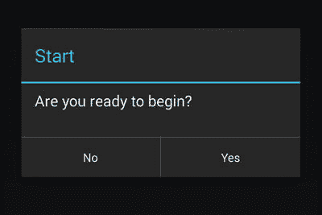
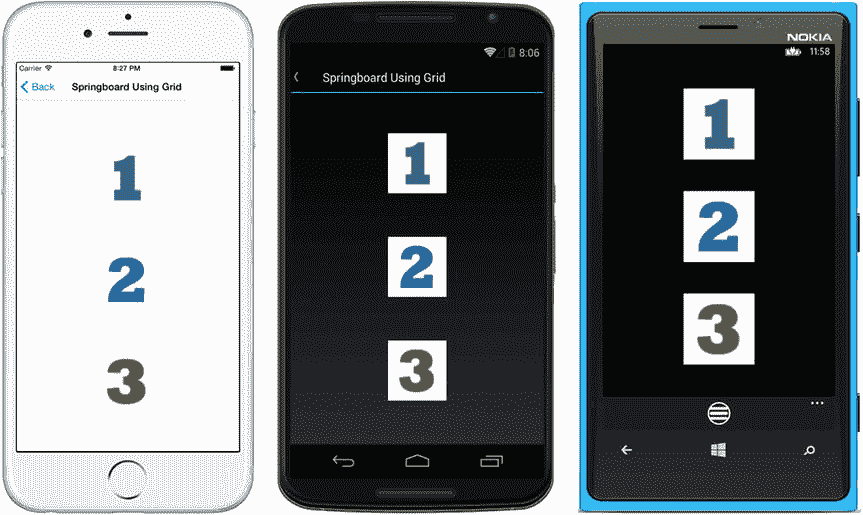
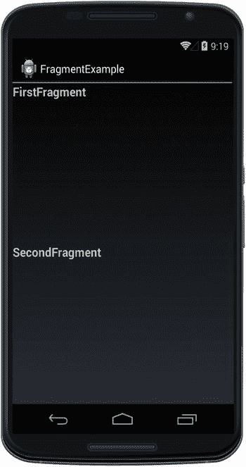
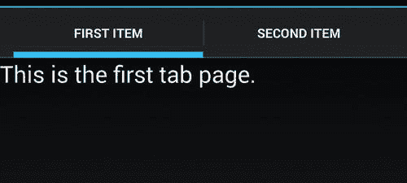

# 6.航行

导航为用户提供了快速浏览应用程序所需的功能，让他们自信而轻松地在屏幕间切换。这可以包括菜单、可点击图标、按钮、标签和列表项，以及向用户显示数据、信息和选项的许多类型的手势敏感屏幕。

## 导航模式

导航模式是行业标准的模板，用于以优雅和可用的方式将应用程序的屏幕连接在一起。移动导航中最常见的两种视觉设计模式是层次化和模态化。衍生模式的整个家族组合、增强和修饰这些基本导航模式，以创建全系列的移动 UI 模式。以下是 Xamarin 开发中最常用的移动 UI 导航模式的详尽列表:

*   分层:一种基于堆栈的导航模式，使用户能够更深入地进入屏幕层次，然后通过使用 Up 或 back 按钮一次退出一个屏幕。
*   模态:一个中断层次导航的屏幕，通常是一个带有警告或菜单的弹出屏幕，用户可以完成或取消。
*   追溯列表:选定的可点击项目列表，用于显示项目详细信息。
*   导航抽屉(Navigation drawer ):点击图标，导航菜单从左侧滑过，通常是屏幕左上角的三条水平线，即众所周知的汉堡包。
*   选项卡:在屏幕的顶部或底部包含几个类似文件夹的按钮的栏，每个按钮都有可点击的图标或调用新页面的文本。
*   跳板:也被称为仪表板，这是一个可点击图标的网格，用于调用新页面。
*   转盘:水平滑动的屏幕大小的面板，有时包含大图像。

让我们探索两种最常见的导航模式，层次导航和模态导航。

### 等级体系的

分层是一种基于堆栈的模式，它允许用户向下移动到一堆屏幕中，然后再次弹出，一次一个屏幕。这种模式通常在屏幕顶部使用一个工具栏，当以任何方式选择或“深入”一个页面时，在左上角显示一个向上按钮。当用户深入菜单结构时，会维护一个堆栈，每个页面都被推送到堆栈上。两个按钮 Back 和 Up 按钮——被用来向后导航，弹出堆栈中的页面。后退键是屏幕下方的弯箭头图标(iOS 没有)。向上按钮是左上角的小于图标。可以用这种方式遍历深层导航栈，页面选择需要使用额外的 UI 导航模式，比如导航抽屉、下钻列表或弹出菜单。

### 情态的

模态是一个单一的、中断性的弹出窗口或屏幕，有两种风格。最常见的类型浮动在主页的顶部，通常是用户可以响应或取消的警告、对话框或菜单。当模式关闭时，导航会返回到原始页面。模态通知用户一个重要的事件，比如一个保存的记录，或者给他们机会提供输入或者指示，比如一个菜单或者是否提交或者取消一个事务。第二种不太常见的模式完全取代了主页，打断了层次导航栈。

移动用户界面中最常见的两个模态菜单是导航抽屉和动作菜单。导航抽屉通常从左侧滑入，通过点击屏幕左上角的图标(通常是汉堡包)来触发，并显示要导航的页面列表。动作菜单通常在屏幕右侧滑动或弹出，通过点击屏幕右上角的图标(通常是三个垂直点)来调用，主要包含操作(例如，收藏这个)，尽管也有一些导航页面不太常见。要遵循这个既定的 UI 模式，请记住这条规则:导航在左边，操作在右边。

分层和模态 UI 导航模式通常用作补充技术，分层提供导航结构的框架，模态为用户提供他们想做的事情和他们想在应用程序中去哪里的选择，以及沿途的信息更新。

在这一章中，你将探索每个平台上的层次化、模态化和其他导航模式。

#### Xamarin。表单导航

Xamarin。表单提供了大多数现成的主要导航模式:

*   使用`NavigationPage`进行分级导航
*   使用`NavigationPage`、警报和`ActionSheets`的模式
*   使用`NavigationPage`、`ListView`和`TableView`的下钻列表
*   导航抽屉使用`MasterDetailPage`
*   使用`TabbedPage`的标签
*   使用带有手势识别器的图像的跳板
*   使用`CarouselPage`的转盘

#### 安卓导航

Android 提供了许多现成的主要导航模式:

*   使用`Toolbar`或`ActionBar`进行分级导航
*   使用`DialogFragment`、`AlertDialog`和`PopupMenu`的模态
*   使用`ListView`的下钻列表
*   导航抽屉使用`DrawerLayout`
*   使用`ActionBar`的标签

#### iOS 导航

iOS 导航通常使用设计工具创建，但导航模式也可以手工编码。

*   使用`UINavigationController`、推送序列或`PushViewController`进行分层导航
*   模态使用模态序列、`PresentViewController`和`UIAlertAcontroller`
*   使用`UINavigationController`的下钻列表
*   使用组件的导航抽屉
*   使用`UITabBarController`的标签

Note

Xamarin UI 导航的主题可以写满一整本书。本章涵盖了所有平台上的许多重要导航模式，以 Xamarin 为例进行了详尽的介绍。表单，尽可能提供代码示例以及其他资源。

在深入研究模式之前，需要解决一个跨领域的导航主题:状态管理。当用户浏览应用程序时，独立的屏幕必须看起来是统一的整个应用程序的一部分，即使每个屏幕都是一个单独的 UI，有一个单独的控制器。

### 状态管理

通过共享屏幕上的数据，当用户在屏幕间导航时，状态帮助我们保持一致性和连续性的幻觉。我们不再生活在查询字符串、cookies 和`Session`变量的世界中，但是我们仍然必须在移动应用程序中维护状态。大多数变量的作用范围是特定的屏幕，所以状态管理通常涉及在屏幕之间来回传递数据。屏幕之间的参数传递是所有移动平台上鼓励的状态管理方法，以最小化内存滥用的风险，并最大化应用程序的性能。

Xamarin。Forms 允许我们将参数传递给一个`ContentPage`构造函数。Android 使用一个名为`Bundle`的类，这是一个包含传递值的字典，位于一个名为`Intent`的类中，我们用它来调用新的活动。iOS 开发人员喜欢目标视图控制器上的公共属性，但 iOS 支持将参数传递到目标页面的构造函数中。

静态全局类是单例模式的 C#实现。它在所有平台上都可用，但必须谨慎使用；注意移动设备的内存限制。Xamarin 内置了磁盘持久性。表单通过使用`Application`对象的`Properties`，字典使用 ID/对象对。

现在您已经有了在页面之间传递值的方法，让我们从 Xamarin 开始。表单导航。

## Xamarin。表单导航

Xamarin 导航。表单基于两种主要的导航模式:层次导航和模态导航。

分层模式允许用户在一堆页面中向下移动，然后使用向上或向后按钮向上弹出。这有时被称为向下钻取或面包屑导航。

模态模式是一个中断性的屏幕，需要用户进行特定的操作，但通常可以通过取消按钮来取消。示例包括通知、警报、对话框以及编辑或新建记录页面。

最常见的 Xamarin。表单导航组件是`NavigationPage`，它基于分层模式，但也提供模态功能。

XAML

所有 Xamarin 的 XAML 版本。表格示例可在 Apress 网站( [`www.apress.com`](http://www.apress.com/) )或 GitHub 上的 [`https://github.com/danhermes/xamarin-book-examples`](https://github.com/danhermes/xamarin-book-examples) 找到。Xamarin。第六章为`NavigationExamples.Xaml`的表格解决方案。

### 使用导航页面进行分层导航

xamarin.forms

`NavigationPage`创建一个先进/后进的页面堆栈。页面可以被推到堆栈上，然后弹出返回到上一页。`NavigationPage`通常包装主页。它可以在屏幕顶部提供导航栏，提供当前页面标题、图标和向上(

图 [6-1](#Fig1) 显示了 iOS 和 Android 屏幕顶部的导航栏。

图 6-1。

NavigationPage

iOS up 按钮上的默认文本是“后退”Windows Phone 使用`NavigationPage`在屏幕顶部不显示导航，但后退按钮将正常工作，从堆栈中弹出页面。

Note

“向上”和“向后”是不同的导航按钮。向上是导航页面左上角的小于箭头，后退按钮在 OS 提供的底部导航栏上(iOS 中除外)。

要使用`NavigationPage`，在你的`Application`类的构造函数中，实例化一个`NavigationPage`对象，传入 home `ContentPage`作为参数，并将其分配给你的`MainPage`:

`public class App : Application`

`{`

`public App()`

`{`

`MainPage = new NavigationPage(new HomePage());`

`}`

`}`

如清单 [6-1](#FPar4) 所示，创建一个名为`HomePage`的新`ContentPage`，它有一个标识自己为主页的标签和一个通过`PushAsync`方法将我们带到第二页的按钮。

Listing 6-1\. Hierarchical Navigation Home Page (in NavigationPage1.cs—See Next Tip)

`class HomePage : ContentPage`

`{`

`Button homeButton;`

`public HomePage()`

`{`

`Title = "Hierarchical Navigation";`

`Label homeLabel = new Label`

`{`

`Text = "Home Page",`

`FontSize = 40`

`};`

`homeButton = new Button`

`{`

`Text = "Go to Second Page"`

`};`

`homeButton.Clicked += async (sender, args) =>`

`await Navigation.PushAsync(new secondPage());`

`StackLayout stackLayout = new StackLayout`

`{`

`Children = { homeLabel, homeButton }`

`};`

`this.Content = stackLayout;`

`}`

`}`

Tip

如果您一直关注在线代码示例，请注意，我简化了这个示例，将本文中的`NavigationPage1`重命名为`HomePage`，省略了可下载代码中非常有用但有点跑题的`ListView`主页。

首页是一个简单的页面，上面有你的标签和按钮，等着带你去第二页，如图 [6-2](#Fig2) 所示。

图 6-2。

Home page

清单 [6-2](#FPar6) 包含一个名为`secondPage`的简单`ContentPage`，它将自己标记为第二页。

Listing 6-2\. Second Page in the Hierarchy from NavigationPage2.cs

`class secondPage: ContentPage`

`{`

`public secondPage()`

`{`

`Title = "Hierarchical Navigation";`

`Label homeLabel = new Label`

`{`

`Text = "Second Page",`

`FontSize = 40`

`};`

`var stackLayout = new StackLayout`

`{`

`Children = { homeLabel }`

`};`

`this.Content = stackLayout;`

`}`

`}`

现在页面被推送到导航栈上，导航栏变得可见，如图 [6-3](#Fig3) 所示。

图 6-3。

The second page contains a navigation bar with a Back button (except on Windows Phone)

请注意，导航栏中的图标已被设置为空白图像，如“自定义导航栏”一节中所述

Note

导航栏是由`NavigationPage`自动创建的。当向上按钮(

#### 推动和弹出导航堆栈上的屏幕

有三种方法可用于分层在页面间移动:

*   `PushAsync`将一页推到堆栈上并到达那里:

`Navigation.PushAsync(new nextPage());`

可以添加第二个参数来指定导航是否是动画:

`Navigation.PushAsync(new nextPage(), bool animated);`

*   `PopAsync`从堆栈中弹出一页并转到上一页:

`Navigation.PopAsync();`

*   `PopToRootAsync`从堆栈中弹出所有页面，并转到根页面:

`Navigation.PopToRootAsync();`

Tip

另外两个方法，`RemovePage`和`InsertPageBefore`，用于在不推不弹出的情况下改变堆栈。

`RemovePage`从堆栈中删除指定页面:

`Navigation.RemovePage(page);`

`InsertPageBefore`在堆栈中指定页面之前插入一个页面:

`Navigation.InsertPageBefore(insertPage, beforePage);`

所有这些方法通常都是在点击图标或链接的事件中执行的，或者是内联的，比如清单 [6-1](#FPar4) 中的主页:

`homeButton.Clicked += async (sender, args) =>`

`await Navigation.PushAsync(new secondPage());`

或者在委托事件中:

`private async void OnButtonClicked(object sender, EventArgs e)`

`{`

`await Navigation.PushAsync(new nextPage());`

`}`

#### 设置页面标题

`Page.Title`属性在导航栏中显示一个标题:

`Title = "Home";`

Tip

`ContentPage`继承自`Page`类，其中大量的 Xamarin。本章讨论的表单属性位于。

#### 自定义导航栏

有几个可以从任何子页面访问的属性，所有这些属性都提供了对导航栏元素的访问。导航栏属性如`Title`和`Icon`设置在子页面中，而不是在启动`NavigationPage`的页面中。这符合本地平台架构。

在大部分的 Xamarin 中。表单导航示例中，`icon.png`文件已被替换为空白图像，因此看不到图标。这是一个精简和现代的外观。也可以将`icon.png`文件替换成适当的图形来反映 app，如图 [6-4](#Fig4) 所示。

图 6-4。

The icon can be changed on the navigation bar Tip

`icon.png`文件是特定于平台的，驻留在每个平台项目中。有关图像的详细信息，请参见第 2 章。

通过使用`SetTitleIcon`和`Page.Icon`属性，还可以动态设置导航图标以反映页面或用户上下文:

`var image = "icon.png";`

`NavigationPage.SetTitleIcon (this, image);`

使用这些`NavigationPage`方法可以进一步定制屏幕顶部的导航栏:

*   `SetHasNavigationBar`显示/隐藏当前页面的导航栏:

`Ex. NavigationPage.SetHasNavigationBar(this, false);`

*   `SetTitleIcon`改变标题图标(`Page.Icon`属性)。
*   `SetHasBackButton`显示/隐藏后退按钮。
*   `SetBackButtonTitle`改变导航标题(调用页面上设置的`Page.Title`属性)。
*   `BarBackgroundColor`改变导航栏的颜色。
*   `BarTextColor`改变导航栏的文字颜色。

#### 处理后退按钮

从堆栈中弹出页面可以通过 Up 或 Back 按钮来完成。向上是小于号(

后退按钮点击事件可以通过覆盖页面的`OnBackButtonPressed`方法显式处理:

`public override void OnBackButtonPressed()`

`{`

`// your code here`

`base.OnBackButtonPressed ();`

`}`

#### 创建下拉菜单

名为`ToolBarItems`的下拉菜单类内置在`Page`类中，在使用`NavigationPage`时可见。

实例化`NavigationPage`来调用工具栏`ContentPage`，如清单 [6-3](#FPar11) 所示。

Listing 6-3\. Drop-down Menu in DropdownMenu.cs

`class DropdownMenu: ContentPage`

`{`

`public DropdownMenu()`

`{`

`ToolbarItems.Clear();`

`ToolbarItems.Add(new ToolbarItem {`

`Text = "Home",`

`Order = ToolbarItemOrder.Secondary,`

`Command = new Command(() =>`

`Navigation.PushAsync(new NavigationPage1()))`

`});`

`ToolbarItems.Add(new ToolbarItem {`

`Text = "Second",`

`Order = ToolbarItemOrder.Secondary,`

`Command = new Command(() =>`

`Navigation.PushAsync(new NavigationPage2()))`

`});`

`}`

`}`

这将创建一个下拉菜单/工具栏或选项卡菜单，其中包含“主页”和“第二”项。点击其中一个导航到相应的页面(见图 [6-5](#Fig5) )。在 iOS 上，它看起来像一个标签菜单。在 Windows Phone 上，它位于屏幕底部。

图 6-5。

ToolbarItems drop-down menu

### 情态的

xamarin.forms

Xamarin。表单为模式导航提供了三个选项:

*   `NavigationPage`对于整页模态
*   用户通知警报
*   弹出式菜单的动作表单

#### 使用 NavigationPage 的整页模式

可以创建打破层次模式的模态全屏页面。当模式页面被提升时，层次结构被中断，导航条消失。当模式从堆栈中弹出时，导航条会返回。这两种方法用于模式化地在页面之间移动:

`PushModalAsync`将一页推到堆栈上并转到那里:

`Navigation.PushModalAsync(new nextPage());`

`PopModalAsync`从堆栈中弹出一页并转到上一页:

`Navigation.PopModalAsync();`

Tip

对象上的四个事件可以帮助你管理模式页面的生命周期:`ModalPushing`、`ModalPushed`、`ModalPopping`和`ModalPopped`。

#### 使用警报的用户通知

`ContentPage`的`DisplayAlert`方法显示弹出警告，如图 [6-6](#Fig6) 所示。这通常与 async/await 一起使用，因此执行将暂停，直到弹出窗口被清除(清单 [6-4](#FPar13) )。

图 6-6。

DisplayAlert pop-up with title, message, and action button Listing 6-4\. Using DisplayAlert, from Alerts.cs

`Button button = new Button { Text = "Show Alert" };`

`button.Clicked += async (sender, e) =>`

`{`

`await DisplayAlert("Hey", "You really should know about this.", "OK");`

`};`

可以通过从`DisplayAlert`返回一个值来接收用户反馈:

`Button button = new Button { Text = "Show Alert" };`

`button.Clicked += async (sender, e) =>`

`{`

`Boolean answer = await DisplayAlert("Start",`

`"Are you ready to begin?", "Yes", "No");`

`};`

答案以布尔值的形式返回，如图 [6-7](#Fig7) 所示。

图 6-7。

The DisplayAlert method can return a value

#### 使用动作表的弹出式菜单

`ActionSheet`在弹出窗口中提供选项菜单。Xamarin。表单版本返回一个字符串作为结果。

使用`DisplayActionSheet`，创建一个由按钮点击激活的动作表，将结果分配给一个标签，如清单 [6-5](#FPar14) 所示。

Listing 6-5\. Using DisplayActionSheet from PopupMenu.cs

`Button button = new Button { Text = "Show ActionSheet" };`

`button.Clicked += async (sender, e) =>`

`{`

`String action = await DisplayActionSheet("Options",`

`"Cancel", null, "Here", "There", "Everywhere");`

`label.Text = "Action is :" + action;`

`};`

这将在屏幕中央显示一个包含我们选项的弹出菜单(图 [6-8](#Fig8) )。

图 6-8。

DisplayActionSheet is a method that can return a value

### 管理状态

xamarin.forms

状态管理是指当用户在应用程序中导航时，在页面之间处理和传递数据。有四种主要方法:将数据值直接传递给页面的构造函数，使用`Application`对象上的静态`Properties`字典将键/值对保存到磁盘，所有页面都可用的静态数据实例(全局)，以及`Application`对象上的静态属性。global 和`Application` object 技术都使用单例模式，对于数据访问或业务对象等应用程序范围的类非常有用。

尽可能将数据直接传入页面，以缩小变量的范围并谨慎管理内存。当你的应用在后台运行时，甚至在你的应用重启后，字典仍然存在！

让我们从最简单的技术开始，将数据直接传递到页面中。

#### 将数据传递到页面参数中

状态通常在 Xamarin 中管理。通过使用构造函数将数据直接传递给`Page`来创建表单。这种方法将数据对象限定在一个页面中，从架构和内存使用的角度来看，这是理想的。

当调用一个新页面时，只需传入页面构造函数中定义的变量。用一个`ListItem`类作为构造函数参数定义一个详细页面:

`class DetailPage : ContentPage`

`{`

`public DetailPage(ListItem item)`

`{`

然后将`ListItem`类的实例直接传递给`DetailPage`:

`Navigation.PushAsync (new detailPage(item));`

在页面构造函数中添加从其他页面传入数据所需的所有参数。关于这个例子的更多细节可以在清单 [6-8](#FPar20) 和清单 [6-10](#FPar22) 中找到。

数据元素有时会在整个应用程序的许多页面上使用，单独传递它们会变得很麻烦。经常使用的数据元素可以放在一个静态的全局类中，这样它们在整个应用程序中都可用。

#### 使用属性字典的磁盘持久性

Xamarin 内置的最持久的状态特性。表单是字典。名称/值对作为对象存储在磁盘中，即使在应用程序重新启动后，也可以根据需要从应用程序中的任何位置检索。`Properties`有点像你的应用程序的 cookies。

通过使用一个键值将一个值保存到`Properties`字典中，例如`id`:

`Application.Current.Properties["id"] = 12345;`

通过从`Properties`对象类型进行强制转换来检索值:

`var id = (int)Application.Current.Properties["id"];`

Tip

属性在`Application`的`OnStart`、`OnSleep`和`OnResume`方法中很方便，用于在用户会话之间保存数据。它们也可以用在`Page`的`OnAppearing`和`OnDisappearing`事件中，当一个页面被创建时或者就在它被销毁之前触发。

#### 使用静态全局类

静态全局类是单例模式的 C#实现，可用于在整个应用程序中存储数据。

Important Note

实现单例是一种标准的 C#技术，可以跨所有平台使用。表格，Xamarin。Android、Xamarin.iOS 和 Windows Phone。

创建一个名为`Global`的静态类，并在其中放置您希望在应用中使用的属性，例如`myData`，如清单 [6-6](#FPar17) 所示。

Listing 6-6\. Static Global Class in Global.cs

`public class Global`

`{`

`private Global ()`

`{`

`}`

`private static Global _instance;`

`public static Global Instance`

`{`

`get`

`{`

`if (_instance == null)`

`{`

`_instance = new Global ();`

`}`

`return _instance;`

`}`

`}`

`public String myData { get; set; }`

`}`

为静态全局类赋值:

`Global.Instance.myData = "12345";`

从应用程序中的任何位置访问全局属性:

`MyData myData = Global.Instance.myData;`

Caution

过度使用静态全局类会消耗内存并影响性能。只要有可能，就在页面之间直接传递变量，这样当不再需要变量时，它们就会超出范围。

#### 在应用程序对象上使用静态属性

可以通过使用`Application`对象的静态属性来创建单例:

`public class App : Application`

`{`

`static Database database;`

`public static Database MyDatabase {`

`get {`

`if (database == null) {`

`database = new Database ();`

`}`

`return database;`

`}`

`}`

在应用程序中的任意位置引用此数据库对象:

`App.MyDatabase.DBConnect();`

你将在[第 7 章](07.html)中使用这种方法来维护数据库连接。(`DBConnect`只是`Database`对象上的一个示例方法。)

### 向下钻取列表

xamarin.forms

下钻列表是一个可点击项目的列表，用于导航到新页面。有许多方法可以使用 Xamarin 来构建它们。表单，下面的方法涵盖了三种最常见的下钻列表类型:按项目、按页面和分组。按项目的下钻列表有一些行，可以选择这些行来显示每个项目的更多信息:传统的主-详细模式。按页面的下钻列表是一个页面菜单，可以选择它来导航到不同的`ContentPages`。这两种方法都使用一个`ListView`绑定到一个数据模型，以提供一个可点击项目的动态列表。使用`TableView`构建的分组下钻列表对于创建分类静态菜单项非常有用。

`ListView`是创建下钻列表最通用的工具之一。当然，短列表可以通过使用任何填充有按钮或标签的布局以及手势识别器来手动构建。较长的列表适合使用`ListView`进行数据绑定。

分组与上一章使用`ListView`分组相同。可以使用`ListView`的`IsGroupingEnabled`和`GroupDisplayBinding`属性对项目和页面进行分组。

需要分组的页面列表也可以通过使用`TableView`来构建。这种对`ListView`的手动替代使用了`TextCell Command`和`CommandParameter`属性，而不是数据绑定。

我们将从数据绑定的`ListView`菜单开始。

#### 按项目使用列表视图

xamarin.forms

许多列表包含一系列项目，用户希望深入查看这些项目以获得每个项目的详细信息。使用`ListView`显示数据绑定到数据模型的项目列表，然后使用`PushAsync`显示一个详细页面，所有这些都包装在`NavigationPage`中，以便用户可以返回到列表。

你可以使用《T4》第五章中讨论的任何方法来创建你的`ListView`。这个实现使用了我们的列表项类`DrilldownListViewByItem`(参见完整列表 [6-8](#FPar20) )。在包装在`NavigationPage`中的`Application`类的构造函数中实例化该页面(参见完整清单 [6-9](#FPar21) )。

`public class App : Application`

`{`

`public App()`

`{`

`MainPage = new NavigationPage(new DrilldownListViewByItem ());`

`}`

`}`

这将创建如图 [6-9](#Fig9) 所示的列表，在 iOS 和 Android 上有一个导航栏。Windows Phone 不显示导航栏。

图 6-9。

ListView on a page with a navigation bar

创建一个名为`detailPage`的详细页面，其构造函数将`ListItem`作为参数(参见完整清单 [6-10](#FPar22) )。`ListItem`必须包含详细查找查询的列表项 ID 或需要在详细页面上显示的所有字段。此详细信息页面显示标题和描述。

`class DetailPage: ContentPage`

`{`

`public detailPage(ListItem listID) { // display detail }`

`}`

回到列表页面，当点击一个项目行时，将`ListItem`传递到详细页面，该页面显示该特定项目的详细信息。

`listView.ItemTapped += (sender, args) => {`

`var item = args.Item as ListItem;`

`if (item == null) return;`

`Navigation.PushAsync (new detailPage(item) );`

`listView.SelectedItem = null;`

`};`

点击列表项行触发`ItemTapped`事件，`PushAsync`调用实例化一个`detailPage`并传入`ListItem`进行显示，如图 [6-10](#Fig10) 所示。

图 6-10。

Detail page displaying title and description

#### 代码完成:向下钻取列表

这是一个按项目的向下钻取列表的快速总结。清单 [6-7](#FPar19) 、 [6-8](#FPar20) 、 [6-9](#FPar21) 和 [6-10](#FPar22) 显示了使用`NavigationPage`的下钻列表模式的完整代码清单。

Listing 6-7\. ListItem.cs

`public class ListItem`

`{`

`public string Title { get; set; }`

`public string Description { get; set; }`

`}`

Listing 6-8\. DrilldownListViewByItem.cs

`class DrilldownListViewByItem : ContentPage`

`{`

`public DrilldownListViewByItem()`

`{`

`Title = "Drilldown List Using ListView";`

`var listView = new ListView();`

`listView.ItemsSource = new ListItem [] {`

`new ListItem {Title = "First", Description="1st item"},`

`new ListItem {Title = "Second", Description="2nd item"},`

`new ListItem {Title = "Third", Description="3rd item"}`

`};`

`listView.ItemTemplate = new DataTemplate (typeof(TextCell));`

`listView.ItemTemplate.SetBinding(TextCell.TextProperty, "Title");`

`listView.ItemTapped += async (sender, args) =>`

`{`

`var item = args.Item as ListItem;`

`if (item == null) return;`

`await Navigation.PushAsync(new DetailPage(item));`

`listView.SelectedItem = null;`

`};`

`Content = listView;`

`}`

`}`

Listing 6-9\. App.cs

`public class App : Application`

`{`

`public App()`

`{`

`MainPage = new NavigationPage(new DrilldownListViewByItem ());`

`}`

`}`

Listing 6-10\. DetailPage.cs

`class DetailPage : ContentPage`

`{`

`public DetailPage(ListItem item)`

`{`

`Label titleLabel = new Label`

`{`

`Text = item.Title,`

`FontSize = 40`

`};`

`Label descLabel = new Label`

`{`

`Text = item.Description,`

`FontSize = 40`

`};`

`var stackLayout = new StackLayout`

`{`

`Children = { titleLabel, descLabel }`

`};`

`this.Content = stackLayout;`

`}`

`}`

#### 按页面使用 ListView

xamarin.forms

使用`ListView`可以轻松导航页面列表。构建一个包含页面列表的菜单，每个页面都有自己的`ContentPage`。将您的`ListView`数据绑定到包含`ContentPages`的数据模型，然后使用`NavigationPage`深入每个页面，给用户一个返回列表的方法。

列表 [6-11](#FPar23) 的结果在屏幕上看起来与图 [6-9](#Fig9) 相同，但是导航到不同的`ContentPage`类型，而不是一个类型(`DetailPage`)。

Listing 6-11\. ListView by Page in DrilldownListViewByPage.cs

`class DrilldownListViewByPage : ContentPage`

`{`

`public DrilldownListViewByPage()`

`{`

`Title = "Drilldown List Using ListView";`

`var listView = new ListView();`

`listView.ItemsSource = new ListItemPage [] {`

`new ListItemPage {Title = "First", PageType= typeof(FirstPage)},`

`new ListItemPage {Title = "Second", PageType= typeof(SecondPage)},`

`new ListItemPage {Title = "Third", PageType= typeof(ThirdPage)}`

`};`

`listView.ItemTemplate = new DataTemplate (typeof(TextCell));`

`listView.ItemTemplate.SetBinding(TextCell.TextProperty, "Title");`

`listView.ItemTapped += async (sender, args) =>`

`{`

`var item = args.Item as ListItemPage;`

`if (item == null) return;`

`Page page = (Page)Activator.CreateInstance(item.PageType);`

`await Navigation.PushAsync(page);`

`listView.SelectedItem = null;`

`};`

`Content = listView;`

`}`

`public class ListItemPage`

`{`

`public string Title { get; set; }`

`public Type PageType { get; set; }`

`}`

`}`

#### 使用表格视图对页面进行分组

xamarin.forms

对于导航项目的多类别列表来说，这种下钻列表模式的变体是完美的，它通过使用一个名为`TableView`的视图来显示一个静态列表。点击一个项目时，将显示详细信息屏幕。它还使用分层模式，提供了使用后退按钮的选项。这种分层/下钻列表模式在许多 Xamarin 中使用。在整本书中形成可下载的代码项目作为解决方案主页，允许在每章中选择代码示例。

当有多种类别的项目可供选择时，这个食谱看起来最好，因为至少需要一个`TableSection`，即使多种类别都不需要，如图 [6-11](#Fig11) 所示。

图 6-11。

Grouping a list by using TableView

如果你不想使用类别，你可以保留`TableSection`标题为空，但是这会在列表顶部留下一个相当大的空白。如果不需要类别，可以考虑按页面使用`ListView`，如前一节所述。

从技术上来说，它不是一个布局，但工作起来很像。该视图由分段排列的`ViewCells`组成。每个`TableSection`代表一个不同的物品类别，如清单 [6-12](#FPar24) 所示。

Listing 6-12\. Grouped List of Pages Using TableView in DrilldownTableView.cs

`class DrilldownTableView : ContentPage`

`{`

`public DrilldownTableView()`

`{`

`Command<Type> navigateCommand =`

`new Command<Type>(async (Type pageType) =>`

`{`

`Page page = (Page)Activator.CreateInstance(pageType);`

`await this.Navigation.PushAsync(page);`

`});`

`this.Title = "Drilldown List Using TableView";`

`this.Content = new TableView`

`{`

`Intent = TableIntent.Menu,`

`Root = new TableRoot`

`{`

`new TableSection("Hindi")`

`{`

`new TextCell`

`{`

`Text = "Prathama",`

`Command = navigateCommand,`

`CommandParameter = typeof(FirstPage)`

`},`

`new TextCell`

`{`

`Text = "Du¯sara¯",`

`Command = navigateCommand,`

`CommandParameter = typeof(SecondPage)`

`},`

`new TextCell`

`{`

`Text = "Tı¯sara¯",`

`Command = navigateCommand,`

`CommandParameter = typeof(ThirdPage)`

`}`

`},`

`new TableSection("Español")`

`{`

`new TextCell`

`{`

`Text = "Primero",`

`Command = navigateCommand,`

`CommandParameter = typeof(FirstPage)`

`},`

`new TextCell`

`{`

`Text = "Segundo",`

`Command = navigateCommand,`

`CommandParameter = typeof(SecondPage)`

`},`

`new TextCell`

`{`

`Text = "Tercera",`

`Command = navigateCommand,`

`CommandParameter = typeof(ThirdPage)`

`}`

`},`

`new TableSection("English")`

`{`

`new TextCell`

`{`

`Text = "First",`

`Command = navigateCommand,`

`CommandParameter = typeof(FirstPage)`

`},`

`new TextCell`

`{`

`Text = "Second",`

`Command = navigateCommand,`

`CommandParameter = typeof(SecondPage)`

`},`

`new TextCell`

`{`

`Text = "Third",`

`Command = navigateCommand,`

`CommandParameter = typeof(ThirdPage)`

`}`

`}`

`}`

`};`

`}`

`}`

### 使用 MasterDetailPage 的导航抽屉

xamarin.forms

实现了导航抽屉模式，当点击一个图标(通常是汉堡包)时，它从侧面滑入一个菜单。

在主页面中，列表 [6-13](#FPar25) ，定义了主页面和详细页面。母版页是包含菜单选项列表的菜单抽屉。当在菜单抽屉中点击一个选项时，详细页面被打开。

Listing 6-13\. Using MasterDetailPage in NavigationDrawer.cs

`public class NavigationDrawer : MasterDetailPage`

`{`

`public NavigationDrawer()`

`{`

`Title = "Navigation Drawer Using MasterDetailPage";`

`string[] myPageNames = { "Home", "Second", "Third" };`

`ListView listView = new ListView`

`{`

`ItemsSource = myPageNames,`

`};`

`this.Master = new ContentPage`

`{`

`Title = "Options",`

`Content = listView,`

`Icon = "hamburger.png"`

`};`

`listView.ItemTapped += (sender, e) =>`

`{`

`ContentPage gotoPage;`

`switch (e.Item.ToString())`

`{`

`case "Home":`

`gotoPage = new HomePage();`

`break;`

`case "Second":`

`gotoPage = new SecondPage();`

`break;`

`case "Third":`

`gotoPage = new ThirdPage();`

`break;`

`default:`

`gotoPage = new NavigationPage1();`

`break;`

`}`

`Detail = new NavigationPage(gotoPage);`

`((ListView)sender).SelectedItem = null;`

`this.IsPresented = false;`

`};`

`Detail = new NavigationPage(new HomePage());`

`}`

`}`

当选择一个菜单项时，`ItemTapped`事件将`Detail`属性设置为目标页面。`SelectedItem`设置为`null`以移除选中行上的高亮显示，`IsPresented`设置为`false`以移除菜单。

Tip

`Master`页面的`Title`属性是必需的。

因为导航抽屉已经实例化了自己的导航页面，所以在调用它的时候不需要再创建一个`NavigationPage`。

`public class App : Application`

`{`

`public App()`

`{`

`MainPage =` `new NavigationDrawer ();`

`}`

`}`

本例从首页设置为详情页开始，如图 [6-12](#Fig12) 所示。它对导航抽屉页面进行硬编码，而不是使其动态化。

图 6-12。

HomePage ContentPage is the initial detail page

请注意，汉堡包位于 Windows Phone 屏幕的底部。

Important Note

`HomePage.cs`包含图 [6-12](#Fig12) 中所示的`HomePage ContentPage`，在可下载的代码中，但这里没有列出。一定要下载本章的代码并查看，因为它包含了本书中一些最适合项目的例子。

点击图标，显示主页，包含菜单和左上角的菜单图标，如图 [6-13](#Fig13) 所示。

图 6-13。

The fly-in menu is the master page

使用母版页的`Icon`属性将菜单图标更改为汉堡包。图标文件取自每个平台的本地图像文件夹。

`this.Master = new ContentPage`

`{`

`Title = "Options",`

`Content = listView,`

`Icon = "hamburger.png"`

`};`

单击菜单项会将您带到指定的新详细信息页面。

### 使用标签板的标签

xamarin.forms

在屏幕的顶部或底部有可点击的类似文件夹的标签是一种常见的导航模式，由`TabbedPage`实现，如图 [6-14](#Fig14) 所示。

图 6-14。

TabbedPage makes tabs that navigate to pages

iOS 标签在屏幕底部，Android 和 Windows Phone 标签在顶部。

创建一个从`TabbedPage`派生的类，并将标签页分配给`TabbedPage.Children`属性，如清单 [6-14](#FPar28) 所示。

Listing 6-14\. Tabs in TabPage.cs

`class TabPage : TabbedPage`

`{`

`public TabPage()`

`{`

`this.Title = "Tabbed Page";`

`this.Children.Add (new homePage());`

`this.Children.Add (new secondPage());`

`this.Children.Add (new thirdPage());`

`}`

`}`

每个子页面的`Title`属性是标签标题的来源。记得在创建子页面或内联页面时分配它，如清单 [6-15](#FPar30) 所示。编译并运行它，查看图 [6-14](#Fig14) 中的结果。

Tip

在 iOS 中，你可以使用子页面的`Icon`属性将图标放在标签上。在 Android 上并非如此。

属性分配可以在`Add`方法中进行，如清单 [6-15](#FPar30) 所示。

Listing 6-15\. Inline Tab Page Property Assignments

`this.Children.Add  (new homePage () {`

`Title = "Home Page",`

`Icon = "Home.png"`

`});`

#### 创建数据绑定选项卡

`TabbedPage`可以绑定到一个数据源。使用`TabbedPage`属性`ItemsSource`和`ItemTemplate`实现数据绑定的选项卡式菜单。

首先创建一个数据模型来保存选项卡信息，如清单 [6-16](#FPar31) 所示。`Name`和`Number`是我们这里使用的属性。

Listing 6-16\. TabItem class from TabPageDatabound.cs

`class TabItem`

`{`

`public TabItem(string name, int number)`

`{`

`this.Name = name;`

`this.Number = number;`

`}`

`public string Name { private set; get; }`

`public int Number { private set; get; }`

`}`

使用`ItemsSource`属性创建一个带有标签的`TabbedPage`(清单 [6-17](#FPar32) )。通过使用`ItemTemplate`，使用`DataTemplate`和`NumberPage`类中的绑定动态创建页面，来分配页面目的地。

Listing 6-17\. Data-Bound Tabs in TabPageDatabound.cs

`class TabPageDatabound : TabbedPage`

`{`

`public TabPageDatabound()`

`{`

`this.Title = "Data-bound TabbedPage";`

`this.ItemsSource = new TabItem[] {`

`new TabItem ("First", 1),`

`new TabItem ("Second", 2),`

`new TabItem ("Third", 3),`

`new TabItem ("Fourth", 4),`

`new TabItem ("Fifth", 5),`

`new TabItem ("Sixth", 6)`

`};`

`this.ItemTemplate = new DataTemplate(() =>`

`{`

`return new NumberPage();`

`});`

`}`

`}`

`ItemsSource`允许在指定的`ItemTemplate`中使用`TabItem`类的属性进行绑定，在本例中是`NumberPage`类。

Tip

`DataTemplate`通常用于数据绑定类，如`ListView`和`TableView`。在第 7 章中了解更多信息。

通过为`Name`和`Number`属性调用`SetBinding`来创建数据绑定`NumberPage`，如清单 [6-18](#FPar34) 所示。这将`TabItem.Name`属性绑定到页面的`Title`，并将`TabItem.Number`属性绑定到标签的`Text`属性。

Listing 6-18\. Data-Bound Destination Page in TabPageDatabound.cs

`class NumberPage : ContentPage`

`{`

`public NumberPage()`

`{`

`this.SetBinding(ContentPage.TitleProperty, "Name");`

`Label label = new Label`

`{`

`HorizontalOptions = LayoutOptions.Center,`

`Font = Font.SystemFontOfSize(40)`

`};`

`label.SetBinding(Label.TextProperty, "Number");`

`this.Content = label;`

`}`

`}`

结果是六个命名页签，如图 [6-15](#Fig15) 所示。

图 6-15。

TabbedPage with data-bound tabs

在 Android 和 Windows Phone 上垂直滚动标签栏，或者在 iOS 上点击“更多”以查看第六个标签。

当点击一个选项卡时，相应的`NumberPage`被创建并导航到，显示绑定的`Number`。

#### 将 navigationpage 放入 tabbedpage 中

导航页面在选项卡式页面中使用，方法是将它们指定为子页面，在选项卡被选中时创建一个导航栏。记住给`NavigationPage`分配一个`Title`来指定选项卡的名称:

`this.Children.Add (new NavigationPage (new homePage())`

`{`

`Title = "Home",`

`Icon = "Home.png"`

`});`

### 跳板

xamarin.forms

跳板是主屏幕菜单上可点击图像的网格，有时也称为仪表板，如图 [6-16](#Fig16) 所示。

图 6-16。

Springboard using tap-gesture recognizers added to the images

这个跳板是用一个`Grid`布局和提供了轻击手势识别器的图像实现的，如清单 [6-19](#FPar35) 所示。这段代码在网格上放置了三个图像，并使它们可以点击。每个手势处理程序的`Tapped`事件包含一个指向所请求页面的`PushAsync`。稍后我将更多地讨论点击手势识别器。

Listing 6-19\. Springboard.cs

`class Springboard : ContentPage`

`{`

`public Springboard()`

`{`

`Title = "Springboard Using Grid";`

`Grid grid = new Grid`

`{`

`VerticalOptions = LayoutOptions.FillAndExpand,`

`RowSpacing = 65,`

`ColumnSpacing = 65,`

`Padding = 60,`

`RowDefinitions =`

`{`

`new RowDefinition { Height = new GridLength(1,`

`GridUnitType.Star) },`

`new RowDefinition { Height = new GridLength(1,`

`GridUnitType.Star) },`

`new RowDefinition { Height = new GridLength(1,`

`GridUnitType.Star) }`

`},`

`ColumnDefinitions =`

`{`

`new ColumnDefinition { Width = new GridLength(1,`

`GridUnitType.Star) }`

`}`

`};`

`var firstImage = new Image`

`{`

`Source = "first.png",`

`Aspect = Aspect.AspectFit,`

`HorizontalOptions = LayoutOptions.FillAndExpand,`

`VerticalOptions = LayoutOptions.FillAndExpand`

`};`

`grid.Children.Add(firstImage, 0, 0);`

`var secondImage = new Image`

`{`

`Source = "second.png"`

`};`

`grid.Children.Add(secondImage, 0, 1);`

`var thirdImage = new Image`

`{`

`Source = "third.png"`

`};`

`grid.Children.Add(thirdImage, 0, 2);`

`var tapFirst = new TapGestureRecognizer();`

`tapFirst.Tapped += async (s, e) =>`

`{`

`await this.Navigation.PushAsync(new FirstPage());`

`};`

`firstImage.GestureRecognizers.Add(tapFirst);`

`var tapSecond = new TapGestureRecognizer();`

`tapSecond.Tapped += async (s, e) =>`

`{`

`await this.Navigation.PushAsync(new SecondPage());`

`};`

`secondImage.GestureRecognizers.Add(tapSecond);`

`var tapThird = new TapGestureRecognizer();`

`tapThird.Tapped += async (s, e) =>`

`{`

`await this.Navigation.PushAsync(new ThirdPage());`

`};`

`thirdImage.GestureRecognizers.Add(tapThird);`

`this.Padding = new Thickness(10, Device.OnPlatform(20, 0, 0),`

`10, 5);`

`this.Content = grid;`

`}`

`}`

#### 使用手势识别器使图标可点击

清单 [6-19](#FPar35) 中添加到每个图像的手势识别器处理`TapGestureRecognizer Tapped`事件中的点击，使用`PushAsync`将指定的页面推到导航堆栈上。这里，点击手势识别器被添加到`firstImage`:

`var tapFirst = new TapGestureRecognizer();`

`tapFirst.Tapped += async (s, e) =>`

`{`

`await this.Navigation.PushAsync(new FirstPage());`

`};`

`firstImage.GestureRecognizers.Add(tapFirst);`

可点击的图像应该对触摸有视觉反应。使用[第二章](02.html)(列表 [2-6](02.html#FPar22) )中的不透明技巧:

`var tapFirst = new TapGestureRecognizer();`

`tapFirst.Tapped +=  async (sender, e) =>`

`{`

`image.Opacity = .5;`

`await Task.Delay(100);`

`image.Opacity = 1;`

`await this.Navigation.PushAsync(new FirstPage());`

`};`

`firstImage.GestureRecognizers.Add(tapFirst);`

当触摸时，这将使图像稍微变暗一会儿，以提供用户反馈，并让他们知道他们的手势做了一些事情。当使用`Task`类时，记得添加`using`语句:

`using System.Threading.Tasks.`

### 使用旋转木马旋转木马页面

xamarin.forms

当用户向左或向右滑动时，轮播页面会滚动出屏幕，显示另一个页面。

创建一个轮播页面并添加子页面，如清单 [6-20](#FPar36) 所示。

Listing 6-20\. Carousel.cs

`class Carousel :CarouselPage`

`{`

`public Carousel()`

`{`

`this.Children.Add(new FirstPage());`

`this.Children.Add(new SecondPage());`

`this.Children.Add(new ThirdPage());`

`}`

`}`

这允许在子页面之间水平滚动。图 [6-17](#Fig17) 显示首页向左滑动，显示第二页。

图 6-17。

Sliding to the left shows the second page

在`MasterDetailPage`中使用`CarouselPage`作为详情页时，将`MasterDetailPage.IsGestureEnabled`设置为`false`，以防止`CarouselPage`和`MasterDetailPage`之间的手势冲突。

XAML

同样，这整个 Xamarin 的 XAML 版本。本章表格部分可在 Apress 网站 [`www.apress.com`](http://www.apress.com/) 或 GitHub 网站 [`https://github.com/danhermes/xamarin-book-examples`](https://github.com/danhermes/xamarin-book-examples) 找到。Xamarin。第六章为`NavigationExamples.Xaml`的表格解决方案。

现在，您可以为任何 Xamarin 构建导航大纲了。你能想象的表单应用程序！这是你自己选择的冒险时间。

*   更多的 Xamarin。表格？翻到第 7 章阅读数据绑定和数据访问。
*   准备好安卓导航了吗？然后继续读下去。
*   想知道 iOS 导航吗？跳到本章的 iOS 部分。

现在让我们从 Android 开始，讨论特定于平台的导航。

## 安卓导航

与 XML 布局配对的活动是 Android 应用程序的组成部分。使用 MVC 模式，布局是视图，而活动是为每个视图提供代码后端的控制器。活动使用`SetContentView`实例化它们各自的布局(在`Resources/layout`项目文件夹中):

`SetContentView(Resource.Layout.Main);`

构建大于一个屏幕的应用程序需要将活动串联起来。这通常使用`Intent`来完成，它是一个可以创建和导航到新活动的类。

分层导航是使用工具栏完成的，在谷歌的鼓励下，工具栏正逐渐取代动作栏。导航按钮包括屏幕顶部工具栏上的“向上”(或“主页”)按钮，以及屏幕底部导航栏上的“后退”按钮。通过使用使用`Intent`传递的`Bundle`类在活动之间传递值。称为片段的特殊布局用于创建模态。

以下是本节涉及的主要 Android 导航概念:

*   意图:对要执行的操作的抽象描述，用于实例化和显示新屏幕
*   工具栏/操作栏:屏幕顶部的导航控件，可以包括页面标题、向上按钮和弹出菜单
*   导航栏:屏幕底部的按钮，包括后退按钮
*   bundle:intent 中的一个字典，用于维护屏幕之间的状态
*   Fragment:一个带有代码隐藏类的迷你布局`.axml`,它作为一个组件可以用来制作模型，并且可以组合起来制作更大的布局

让我们在 UI 导航模式的上下文中探究每个概念。

### 使用意图开始新的活动

意向在 Android 上创建并导航到新屏幕。用所需新活动的参数实例化一个意图，比如`IntentToActivity`，然后调用`Activity.StartActivity`方法，传入该意图，如清单 [6-21](#FPar38) 所示。

Listing 6-21\. From IntentActivity.cs

`Intent intent = new Intent(this, typeof(IntentToActivity));`

`StartActivity (intent);`

这可以简化为:

`StartActivity(typeof(IntentToActivity));`

`StartActivity`实例化指定的新活动类(`IntentToActivity`)并将其加载到屏幕上，卸载旧活动。

新的活动，比如`IntentToActivity`，通常是为了响应事件处理程序中的用户操作而产生的。这里，`IntentToActivity`被创建并在点击按钮时被调用:

`Button button = FindViewById<Button> (Resource.Id.myButton);`

`button.Click += delegate {`

`StartActivity(typeof(IntentToActivity));`

`};`

Tip

也可以使用`SetContentView`改变屏幕，而无需创建新的活动。

### 使用工具栏进行分层导航

机器人

Android 上的分层导航现在使用工具栏来完成，这是一个功能丰富的导航栏，有向上按钮、图标和当前页面名称。包含工具栏的第一页通常会显示一个标题，有时会显示一个用于选择操作的弹出菜单图标，如图 [6-18](#Fig18) 所示。

图 6-18。

Toolbar on a home page

在导航树的更深处，工具栏通常有一个向上(或主页)按钮( [6-19](#Fig19) )。

图 6-19。

Toolbar on a second page

Android 5.0 Lollipop(API 21 级)中引入了工具栏，取代了动作栏。尽管动作栏仍然可以在新的 API 上工作，但是 Google 鼓励使用工具栏。工具栏可以在 Android 设计者的工具箱中找到，可以拖放到你的布局中。它可以用在屏幕上的任何地方，但最常用在顶部，不太常用在底部。

但是有一个问题:新的`Toolbar`类只适用于 API 21+。因此，我将介绍一种向后兼容的方法，使用作为 NuGet 提供的`Android.Support.V7.AppCompat`库来实现工具栏。这使得我们可以瞄准 Lollipop 之前到现在的一系列 API 版本。

概括地说，在 Android 中使用分层导航时，有三种方法可以实现上下移动:

*   API 21+(棒棒糖)的新类
*   `ActionBar`:老班被`Toolbar`取代
*   `Toolbar`使用`Android.Support.V7.AppCompat`库:`Toolbar`，它向后兼容 API 4

为了向后兼容，我将在下面的例子中介绍第三种方法，即使用`Android.Support.V7.AppCompat`库的`Toolbar`。

Tip

如果你正在制作一个最低 API 为 21 或更高版本的应用，不要对`Android.Support.V7.AppCompat`库使用下面的方法。使用 James Montemagno 在 [`http://blog.xamarin.com/android-tips-hello-toolbar-goodbye-action-bar/`](http://blog.xamarin.com/android-tips-hello-toolbar-goodbye-action-bar/) 的博客文章中提到的常规`android.widget.Toolbar`类。

Tool bar vs. Action bar

action bar 作为备用导航栏已经有一段时间了，它内置在一个活动中，不需要在 XML 布局中进行标记。谷歌鼓励我们升级到更通用、更成熟的工具栏，它有更集中的功能集，并支持现代导航美学:顶部栏视觉上独特的配色方案，而不是依赖应用程序图标作为主要设计元素。在 API 21 和更高版本的设备上，不鼓励使用应用程序图标加标题作为标准布局。现在是关于工具栏的样式，使用`style.xml`加上自由使用向上按钮、页面标题和动作菜单。

然而，工具栏也有一些不便之处。首先，它没有内置到活动中，必须在 XML 布局中声明，通常作为一个单独的工具栏布局的包含。第二，标准的新工具栏库只在 API 21 和更高版本上工作，所以我们经常需要使用向后兼容的`Android.Support.V7.AppCompat`库及其相关的`Support-`前缀关键字和方法，以便使用工具栏 pre-Lollipop。如果你想听从谷歌的建议，开始使用工具栏而不是动作栏，但你想让你的应用程序在旧的 API 上工作，那么`Android.Support.V7.AppCompat`方法是一条路要走(可作为一个 NuGet 包或在 Xamarin 组件商店)。

创建一个包含工具栏的 XML 布局，如清单 [6-22](#FPar42) 所示。

Listing 6-22\. Toolbar.axml

`<?xml version="1.0" encoding="utf-8"?>`

`<android.support.v7.widget.Toolbar`

`xmlns:android="`[`http://schemas.android.com/apk/res/android`](http://schemas.android.com/apk/res/android)T2】

`xmlns:local="`[`http://schemas.android.com/apk/res-auto`](http://schemas.android.com/apk/res-auto)T2】

`android:id="@+id/toolbar"`

`android:layout_width="match_parent"`

`android:layout_height="wrap_content"`

`android:minHeight="?attr/actionBarSize"`

`android:background="?attr/colorPrimary"`

`local:theme="@style/ThemeOverlay.AppCompat.Dark.ActionBar"/>`

使用支持库时，有几种样式可用:

*   “黑暗”主题
*   “光”的主题
*   `Theme.AppCompat.Light.DarkActionBar`:带有深色动作条的浅色主题

这里的`popupTheme`指定了`ThemeOverlay.AppCompat`，一个深色的主题，供以后在弹出菜单中使用。

接下来，在主布局中包含工具栏，如清单 [6-23](#FPar43) 所示。添加一个按钮导航到第 2 页。

Listing 6-23\. Main Layout in MainToolbar.axml

`<?xml version="1.0" encoding="utf-8"?>`

`<RelativeLayout xmlns:android="`[`http://schemas.android.com/apk/res/android`](http://schemas.android.com/apk/res/android)T2】

`xmlns:local="`[`http://schemas.android.com/apk/res-auto`](http://schemas.android.com/apk/res-auto)T2】

`android:layout_width="fill_parent"`

`android:layout_height="fill_parent">`

`<include`

`android:id="@+id/toolbar"`

`layout="@layout/toolbar" />`

`<LinearLayout`

`android:orientation="vertical"`

`android:layout_width="fill_parent"`

`android:layout_height="fill_parent"`

`android:id="@+id/main_content"`

`android:layout_below="@id/toolbar">`

`<Button`

`android:id="@+id/nextPageButton"`

`android:layout_width="fill_parent"`

`android:layout_height="wrap_content"`

`android:text="Go to Second Page" />`

`</LinearLayout>`

`</RelativeLayout>`

Important Note

在下面的活动中，利用下面的`using`语句来引用`Android.Support.V7`库。

`using Android.Support.V7.App;`

`using Toolbar = Android.Support.V7.Widget.Toolbar;`

创建一个活动，如清单 [6-24](#FPar45) 所示，您可以在布局上找到工具栏，并通过调用`SetSupportActionBar`方法初始化它。继承自`ActionBarActivity`。

Listing 6-24\. Using the ToolBar in ToolBarActivity.cs

`[Activity(Label = "ToolbarActivity")]`

`public class ToolbarActivity : ActionBarActivity`

`{`

`protected override void OnCreate(Bundle bundle)`

`{`

`base.OnCreate(bundle);`

`SetContentView(Resource.Layout.MainToolbar);`

`var toolbar = FindViewById<Toolbar>(Resource.Id.toolbar);`

`SetSupportActionBar(toolbar);`

`SupportActionBar.Title = "Toolbar Home";`

使用`SupportActionBar.Title`属性设置工具栏的标题。

为了将工具栏用作操作栏，您需要禁用装饰提供的操作栏。如清单 [6-25](#FPar46) 所示，最简单的方法是让`AndroidManifest.xml`中的应用程序主题从`Theme.AppCompat.NoActionBar`扩展而来(一个深色主题，或者浅色变体，简单描述一下)。稍后，您将看到通过定制主题来实现这一点的其他方法。

Listing 6-25\. Application Theme in AndroidManifest.xml

`<?xml version="1.0" encoding="utf-8"?>`

`<manifest xmlns:android="`[`http://schemas.android.com/apk/res/android`](http://schemas.android.com/apk/res/android)T2】

`package="NavigationExamplesAndroid.NavigationExamplesAndroid"`

`android:versionCode="1" android:versionName="1.0">`

`<uses-sdk android:minSdkVersion="10" android:targetSdkVersion="21" />`

`<application android:label="NavigationExamplesAndroid"`

`android:icon="@drawable/Icon" android:theme=`

`"``@style/Theme.AppCompat.NoActionBar`T2】

`</application>`

`</manifest>`

编译并运行应用程序，创建带有工具栏的`ToolbarActivity`，如图 [6-20](#Fig20) 所示。

图 6-20。

The toolbar

现在是时候创建带有工具栏和向上按钮的第二个页面了。

第二个活动实际上与第一个相同，除了 Up 按钮，如清单 [6-26](#FPar47) 所示。找到布局上的工具栏，并通过调用`SetSupportActionBar`方法初始化它。用工具栏的`SetDisplayHomeAsUpEnabled`方法打开向上按钮。

Listing 6-26\. Second Activity in ToolbarActivitySecond.cs

`[Activity(Label = "ToolbarActivitySecond")]`

`public class ToolbarActivitySecond : ActionBarActivity`

`{`

`protected override void OnCreate(Bundle bundle)`

`{`

`base.OnCreate(bundle);`

`SetContentView(Resource.Layout.MainToolbarSecond);`

`var toolbar = FindViewById<Toolbar>(Resource.Id.toolbar);`

`SetSupportActionBar(toolbar);`

`SupportActionBar.Title = "Toolbar Second Page";`

`SupportActionBar.SetDisplayHomeAsUpEnabled(true);`

`}`

`}`

清单 [6-27](#FPar48) 中的第二个 XML 布局比第一个简单。它包括与以前相同的工具栏布局。

Listing 6-27\. Second Layout in MainToolbarSecond.axml

`<?xml version="1.0" encoding="utf-8"?>`

`<RelativeLayout xmlns:android="`[`http://schemas.android.com/apk/res/android`](http://schemas.android.com/apk/res/android)T2】

`xmlns:local="`[`http://schemas.android.com/apk/res-auto`](http://schemas.android.com/apk/res-auto)T2】

`android:layout_width="fill_parent"`

`android:layout_height="fill_parent">`

`<include`

`android:id="@+id/toolbar"`

`layout="@layout/toolbar" />`

`</RelativeLayout>`

回到主活动`ToolbarActivity`，为导航到`ToolbarActivitySecond`的下一页按钮单击添加一个处理程序。

`var nextPageButton = FindViewById<Button>(Resource.Id.nextPageButton);`

`nextPageButton.Click += (sender, e) =>`

`{`

`StartActivity(typeof(ToolbarActivitySecond));`

`};`

现在，当你进入更深的导航时，你可以使用向上按钮返回(图 [6-21](#Fig21) )。

图 6-21。

The toolbar on the second page with the Up button Tip

工具栏也可以独立在屏幕的任何地方，而不仅仅是顶部。为此，不要使用`SetSupportActionBar`将`Toolbar`设置为动作栏。此外，你不需要这个`NoActionBar`主题，除非你也有一个顶部工具栏。

#### 操作向上按钮

机器人

从堆栈中弹出页面可以通过 Up 或 Back 按钮来完成。向上是小于号(

##### 完成()活动

向后导航的一个简单方法是通过覆盖`OnOptionsItemSelected`调用`Finish()`方法来处理向上按钮点击，这将关闭当前活动并返回到前一个活动(清单 [6-28](#FPar50) )。

Listing 6-28\. Finish Method in ToolbarActivitySecond.cs

`public override bool OnOptionsItemSelected (IMenuItem item)`

`{`

`if (item.ItemId == Android.Resource.Id.Home)`

`Finish();`

`return base.OnOptionsItemSelected (item);`

`}`

其他可点击的选项也是可用的，但是在这种情况下，我们只关心由`Android.Resource.Id.Home`标识的向上按钮。

##### 在 AndroidManifest.xml 中使用 parentActivityName

通过在`AndroidManifest.xml`的`<activity>`元素上的`android:parentActivityName`属性中声明每个活动的父级来指定向上按钮将行进到的页面(从 Android 4.1 开始，API 级别 16)。“向上”按钮将导航到每个活动中指定的父活动。

##### 使用意图

Up 按钮也可以手动编码，通过使用 intent 重定向到特定页面(而不是从堆栈中弹出活动)。工具栏上的向上按钮点击事件用`OnOptionsItemSelected`方法处理:

`public override bool OnOptionsItemSelected(MenuItem item){`

`StartActivity(typeof(NewActivity));`

`return true;`

`}`

#### 添加弹出式菜单

机器人

工具栏可以定制附加菜单和动作图标，如图 [6-22](#Fig22) 所示。通过覆盖`OnCreateOptionsMenu`方法并从 XML 文件展开菜单来添加弹出菜单。这不是分层导航。它是模态导航，但是因为它是工具栏的一部分，我们将在这里介绍它。

图 6-22。

Toolbar with pop-up/action menu icon

在您的活动中，覆盖`OnCreateOptionsMenu`，它从`ToolbarActivity.cs`展开一个名为`popupmenu`的菜单:

`public override bool OnCreateOptionsMenu (IMenu menu)`

`{`

`MenuInflater.Inflate (Resource.Menu.``popupmenu`T2】

`return base.OnCreateOptionsMenu (menu);`

`}`

创建一个菜单文件夹并构建一个名为`popupmenu`(在本例中)的 XML 文件，如清单 [6-29](#FPar51) 所示。添加您的菜单项，并给它们 id 和标题。

Listing 6-29\. Menu XML File in popupmenu.xml

`<?xml version="1.0" encoding="utf-8"?>`

`<menu xmlns:android="`[`http://schemas.android.com/apk/res/android`](http://schemas.android.com/apk/res/android)T2】

`<item android:id="@+id/item1"`

`android:title="First Item" />`

`<item android:id="@+id/item2"`

`android:title="Second Item" />`

`<item android:id="@+id/item3"`

`android:title="Third Item" />`

`</menu>`

点击弹出菜单图标显示弹出菜单(图 [6-23](#Fig23) )。

图 6-23。

Pop-up menu on the toolbar

回到活动中，处理菜单点击(清单 [6-30](#FPar52) )。

Listing 6-30\. Handle Menu Taps in ToolbarActivity.cs

`public override bool OnOptionsItemSelected(IMenuItem item)`

`{`

`switch (item.ItemId)`

`{`

`case Resource.Id.item1:`

`Toast.MakeText(this, "Item1 tapped",`

`ToastLength.Short).Show();`

`return true;`

`case Resource.Id.item2:`

`Toast.MakeText(this, "Item2 tapped",`

`ToastLength.Short).Show();`

`return true;`

`case Resource.Id.item3:`

`Toast.MakeText(this, "Item3 tapped",`

`ToastLength.Short).Show();`

`return true;`

`}`

`return base.OnOptionsItemSelected(item);`

`}`

Tip

右侧导航抽屉通常用于操作，而不是导航。

#### 自定义工具栏

机器人

工具栏的颜色可以用自定义主题自定义。在`styles.xml`中设计工具栏的颜色。在`AndroidManifest.xml`中，将`android:theme`更改为您自定义的主题名称(本例中为`MyTheme`)。

`<application android:label="NavigationExamplesAndroid"`

`android:icon="@drawable/Icon" android:theme="@style/MyTheme">`

`</application>`

用`MyTheme`主题创建一个名为`values`的文件夹和一个名为`styles.xml`的新文件(清单 [6-31](#FPar54) ),以及一个使用前面提到的`AppCompat`主题之一的父文件。`windowActionBar`属性必须设置为`false`，并且`windowNoTitle`必须设置为`true`。

Listing 6-31\. styles.xml in values Folder

`<?xml version="1.0" encoding="utf-8" ?>`

`<resources>`

``

``

`</resources>`

对于 API 21+设备，按照 Android 的要求，添加一个`values-v21`文件夹，创建一个`styles.xml`文件(列表 [6-32](#FPar55) )。请注意，这种样式与本章后面的`ActionBar`选项卡示例不兼容。

Listing 6-32\. styles.xml in values-v21 Folder

`<?xml version="1.0" encoding="utf-8" ?>`

`<resources>`

``

`</resources>`

通过在工具栏 XML 声明中添加一个`popupTheme`(清单 [6-33](#FPar56) )，甚至弹出菜单也可以被主题化和定制。

Listing 6-33\. styles.xml in values-v21 Folder

`<?xml version="1.0" encoding="utf-8"?>`

`<android.support.v7.widget.Toolbar`

`xmlns:android="`[`http://schemas.android.com/apk/res/android`](http://schemas.android.com/apk/res/android)T2】

`xmlns:local="`[`http://schemas.android.com/apk/res-auto`](http://schemas.android.com/apk/res-auto)T2】

`android:id="@+id/toolbar"`

`android:layout_width="match_parent"`

`android:layout_height="wrap_content"`

`android:minHeight="?attr/actionBarSize"`

`android:background="?attr/colorPrimary"`

`local:theme="@style/ThemeOverlay.AppCompat.Dark.ActionBar"`

`local:popupTheme="@style/ThemeOverlay.AppCompat.Light" />`

图 [6-24](#Fig24) 显示了灯光风格的弹出菜单。

图 6-24。

Pop-up menu styled

除了在通常位于屏幕顶部的工具栏中处理后退导航之外，还可以在屏幕底部的导航栏中处理后退导航。

### 使用导航栏

机器人

图 [6-25](#Fig25) 所示的导航条(nav bar)是屏幕底部的三按钮栏，或者在一些较老的设备上，实际的物理按钮。按钮是返回、主页和应用切换器。

图 6-25。

Android navigation bar

使用`StatusBarVisibility`枚举(`Hidden`或`Visible`)隐藏导航条上的图标:

`text.SystemUiVisibility = StatusBarVisibility.Hidden;`

#### 处理后退按钮

后退按钮的默认行为是跳回到上一个活动，或者，如果在顶级活动，从应用程序到 Android 应用程序菜单。Back 按钮的 click 事件可以通过覆盖页面的`OnBackPressed method`来显式处理:

`public override void OnBackPressed()`

`{`

`// your code here`

`base.OnBackPressed();`

`}`

### 碎片

机器人

作为成熟的 Android 应用程序的构建模块，片段被用于从警告到模态弹出屏幕、到屏幕的一部分、到可以填满整个屏幕的视图的一切。在 Android 3.0 中引入，片段像迷你布局或自定义控件一样工作，每个片段都有自己的代码隐藏，称为`Fragment`类。就像常规的 Android 布局一样，它们可以用 UI 设计器构建并保存为`.axml`文件。片段布局可以包含在其他布局文件中，允许布局文件嵌套。

Tip

通过在主布局中使用`FrameLayout`以及在主活动中使用`FragmentTransaction Add()`、`Remove()`和`Replace()`方法，动态地将片段换入和换出页面。参见清单 [6-60](#FPar98) 中的选项卡示例。

这个例子展示了如何在一个主布局上显示两个片段。首先让我们构建布局，然后我们将创建代码隐藏类。

创建三个布局:`MainFragment`(列表 [6-34](#FPar58) )、`Fragment1`(列表 [6-35](#FPar59) )、`Fragment2`(列表 [6-36](#FPar60) )。每个片段类使用其名称空间和片段类名来引用一个片段(例如，`FragmentExample.FirstFragment`)。

Listing 6-34\. MainFragment.axml

`<?xml version="1.0" encoding="utf-8"?>`

`<LinearLayout xmlns:android="`[`http://schemas.android.com/apk/res/android`](http://schemas.android.com/apk/res/android)T2】

`android:orientation="vertical"`

`android:layout_width="fill_parent"`

`android:layout_height="fill_parent">`

`<fragment`

`class="``FragmentExample.FirstFragment`T2】

`android:id="@+id/FirstFragment"`

`android:layout_weight="1"`

`android:layout_width="match_parent"`

`android:layout_height="match_parent" />`

`<fragment`

`class="``FragmentExample.SecondFragment`T2】

`android:id="@+id/SecondFragment"`

`android:layout_weight="1"`

`android:layout_width="match_parent"`

`android:layout_height="match_parent" />`

`</LinearLayout>`

Listing 6-35\. Fragment1.axml

`<?xml version="1.0" encoding="utf-8"?>`

`<TextView xmlns:android="`[`http://schemas.android.com/apk/res/android`](http://schemas.android.com/apk/res/android)T2】

`android:layout_width="fill_parent"`

`android:layout_height="fill_parent"`

`android:text="``FirstFragment`T2】

`android:textStyle="bold"`

`android:textSize="20dip" />`

Listing 6-36\. Fragment2.axml

`<?xml version="1.0" encoding="utf-8"?>`

`<TextView xmlns:android="`[`http://schemas.android.com/apk/res/android`](http://schemas.android.com/apk/res/android)T2】

`android:layout_width="fill_parent"`

`android:layout_height="fill_parent"`

`android:text="``SecondFragment`T2】

`android:textSize="20dip"`

`android:textStyle="bold" />`

现在开始上课。创建引用`MainFragment`布局的主活动，如清单 [6-37](#FPar61) 所示。

Listing 6-37\. Begin with MainFragment Layout in FragmentsActivity.cs

`public class FragmentsActivity : Activity`

`{`

`public FragmentsActivity ()`

`{`

`}`

`protected override void OnCreate (Bundle bundle)`

`{`

`base.OnCreate (bundle);`

`SetContentView (Resource.Layout.MainFragment);`

`}`

`}`

最后，创建片段类，每个都继承自`Fragment`基类，并在它们的`OnCreateView`方法中膨胀它们各自的片段布局`Fragment1`和`Fragment2`(清单 [6-38](#FPar62) 和 [6-39](#FPar63) )。

Listing 6-38\. FirstFragment Inflates Fragment1.axml Layout

`public class FirstFragment : Fragment`

`{`

`public override void OnCreate (Bundle savedInstanceState)`

`{`

`base.OnCreate (savedInstanceState);`

`// Create your fragment here`

`}`

`public override View OnCreateView (LayoutInflater inflater,`

`ViewGroup container, Bundle savedInstanceState)`

`{`

`return inflater.Inflate(Resource.Layout.``Fragment1`T2】

`}`

`}`

Listing 6-39\. SecondFragment Inflates Fragment2.axml Layout

`public class SecondFragment : Fragment`

`{`

`public override void OnCreate (Bundle savedInstanceState)`

`{`

`base.OnCreate (savedInstanceState);`

`// Create your fragment here`

`}`

`public override View OnCreateView (LayoutInflater inflater,`

`ViewGroup container, Bundle savedInstanceState)`

`{`

`return inflater.Inflate(Resource.Layout.``Fragment2`T2】

`}`

`}`

运行应用程序允许`MainFragment`布局在屏幕上同时实例化两个片段，一个在另一个之上(图 [6-26](#Fig26) )。

图 6-26。

Two fragments shown on one main layout Tip

当一个应用程序必须在各种不同的屏幕尺寸上看起来很好时，片段特别有用，特别是在手机和平板电脑上，因为同一应用程序的不同版本可以根据屏幕的实际大小来创建。

Note

几个片段类类型，包括`ListFragment`、`DialogFragment`和`PreferenceFragment`，分别用于特定的 UI 功能:列表、对话框和首选项。

Tip

通过使用`Android Support Library v4`组件，可以为大多数片段功能实现与 Android 3.0 之前设备的向后兼容。

### 模态导航

机器人

Android 上的模态导航是通过使用一系列技术创建的，包括`DialogFragment`、`AlertDialog`和`PopupMenu`类。`DialogFragment`是一种特殊类型的片段，它创建一个弹出模态，该模态可以包含一个布局或包装一个`AlertDialog`(一个包含文本和/或控件的对话框)。使用`PopupMenu`类制作弹出菜单。

#### 使用 DialogFragment 创建模态

`DialogFragment`用于创建多种类型的模态对话框。自从 Google 否决了`ShowDialog`方法以来，`DialogFragment`已经在很大程度上取代了`AlertDialog`成为主要的模态技术。创建一个包含模态的布局 XML，然后构建一个在`OnCreateView`方法中扩展这个布局的`DialogFragment`子类。

使用一个`TextView`、一个`EditView`和一个提交`Button`，创建一个名为`Modal`的布局 XML，允许输入名称，如清单 [6-40](#FPar67) 所示。

Listing 6-40\. Modal Layout in Modal.axml

`<?xml version="1.0" encoding="utf-8"?>`

`<LinearLayout xmlns:android="`[`http://schemas.android.com/apk/res/android`](http://schemas.android.com/apk/res/android)T2】

`android:orientation="vertical"`

`android:layout_width="fill_parent"`

`android:layout_height="fill_parent">`

`<TextView`

`android:text="Enter Your Name"`

`android:textAppearance="?android:attr/textAppearanceLarge"`

`android:layout_width="match_parent"`

`android:layout_height="wrap_content"`

`android:id="@+id/nameTextView" />`

`<EditText`

`android:id="@+id/nameEditText"`

`android:textAppearance="?android:attr/textAppearanceLarge"`

`android:layout_width="fill_parent"`

`android:layout_height="wrap_content"/>`

`<Button`

`android:text="Submit"`

`android:layout_width="match_parent"`

`android:layout_height="wrap_content"`

`android:id="@+id/submitButton" />`

`</LinearLayout>`

创建一个名为`DialogFragmentView`的新片段和一个来自`DialogFragment`的子类。在`OnCreateView`方法中，膨胀`Modal`布局。找到`submitButton`并通过调用`Dismiss()`方法关闭片段来处理点击事件，如清单 [6-41](#FPar68) 所示。

Listing 6-41\. Inflate Modal Layout in DialogFragmentView.cs

`public class DialogFragmentView : DialogFragment`

`{`

`public override View OnCreateView(LayoutInflater inflater,`

`ViewGroup container, Bundle savedInstanceState)`

`{`

`base.OnCreate(savedInstanceState);`

`var view = inflater.Inflate(Resource.Layout.Modal,`

`container, false);`

`view.FindViewById<Button>(Resource.Id.submitButton).Click +=`

`(sender, args) => Dismiss();`

`return view;`

`}`

`}`

Tip

通过使用`DialogFragment.Dismiss()`方法，可以在代码中将`DialogFragment`从活动中解除。这将提交事务，并在销毁片段时触发标准事件。

在主活动的`OnCreate`方法中，实例化一个事务和`DialogFragmentView`。调用片段上的`Show`方法，传入事务和一个字符串标识符，如清单 [6-42](#FPar70) 所示。

Listing 6-42\. Show the DialogFragment in DialogViewActivity.cs

`var transaction = FragmentManager.BeginTransaction();`

`var dialogFragment = new DialogFragmentView();`

`dialogFragment.Show(transaction, "dialog_fragment");`

这将显示一个弹出主布局的模态，如图 [6-27](#Fig27) 所示。

图 6-27。

DialogFragment modal layout

#### 使用 DialogFragment 创建警报

`DialogFragment`可以包含`AlertDialog`来创建警告和对话框。这些都是用`OnCreateDialog`的方法建造的。

创建一个名为`DialogFragmentAlert`(清单 [6-43](#FPar71) )的新`Fragment`类，并从`DialogFragment`类继承。在`OnCreateDialog`方法中，构建一个简单的`AlertDialog`。

Listing 6-43\. Using AlertDialog in DialogFragmentAlert.cs

`public class DialogFragmentAlert : DialogFragment`

`{`

`public override Dialog OnCreateDialog(Bundle savedInstanceState)`

`{`

`var builder = new AlertDialog.Builder(Activity)`

`.SetMessage("This is an AlertDialog.")`

`.SetPositiveButton("Ok", (sender, args) =>`

`{`

`// Handles button click`

`})`

`.SetTitle("DialogFragment");`

`return builder.Create();`

`}`

`}`

在主活动的`OnCreate`方法中，比如`DialogAlertActivity`，实例化并显示对话框片段。`DialogFragment.Show`方法将一个事务和一个字符串作为参数(清单 [6-44](#FPar72) )。

Listing 6-44\. Show DialogFragment in DialogFragmentAlert.cs

`var transaction = FragmentManager.BeginTransaction();`

`var dialogFragment = new DialogFragmentAlert();`

`dialogFragment.Show(transaction, "dialog_fragment");`

这将在主屏幕顶部弹出对话框片段，直到关闭，如图 [6-28](#Fig28) 所示。

图 6-28。

AlertDialog wrapped in DialogFragment

#### 使用警报对话框的模式布局

通过使用`AlertDialog`，整个 XML 布局可以被创建并显示为模态对话框。首先，创建模态布局 XML，然后在活动中编码`AlertDialog`，使用`alert.SetView`将该布局扩展为一个警告视图。

在活动的`OnCreate`方法中，实例化`AlertDialog`并引用`alert.SetView`方法中的`Modal.axml`布局，然后`alert.Create().Show()`它。见清单 [6-45](#FPar73) 。

Listing 6-45\. Inflate Modal Layout in ModalAlertActivity.cs

`var alert = new AlertDialog.Builder(this);`

`alert.SetView(LayoutInflater.Inflate(Resource.Layout.Modal, null));`

`alert.Create().Show();`

这将显示一个弹出主布局的模态，如图 [6-29](#Fig29) 所示。

图 6-29。

Enter Your Name dialog box using AlertDialog Tip

通过`AlertDialog`创建用户通知，通过使用`SetPositiveButton`和`SetNegativeButton`得到用户的响应。

#### 弹出菜单

`PopupMenu`类提供了一个现成的上下文相关的弹出菜单。没有下一节讨论的导航抽屉流行，弹出菜单仍然在使用。弹出菜单是通过制作一个 XML 菜单文件来创建的，使用 Android 的`<menu>`和`<item>`标签，放在`Resources/menu`文件夹中。`PopupMenu`类被实例化并锚定到屏幕上的一个控件，XML 菜单文件被展开。

Tip

很多难看的导航都是用弹出菜单编码的。遵循移动用户界面(du jour)的黄金法则:导航在左边，动作在右边，让你的导航保持优雅并与行业用户界面模式保持一致。

如清单 [6-46](#FPar76) 所示，创建菜单 XML 文件并将其放在`Resources/menu`文件夹中。

Listing 6-46\. Menu Layout in Popuplayout.xml

`<?xml version="1.0" encoding="utf-8"?>`

`<menu xmlns:android="`[`http://schemas.android.com/apk/res/android`](http://schemas.android.com/apk/res/android)T2】

`<item android:id="@+id/item1"`

`android:title="First Item" />`

`<item android:id="@+id/item2"`

`android:title="Second Item" />`

`<item android:id="@+id/item3"`

`android:title="Third Item" />`

`</menu>`

布局可以很简单，只包含一个触发菜单的按钮(清单 [6-47](#FPar77) )。

Listing 6-47\. Main Layout in PopupLayout.axml

`<?xml version="1.0" encoding="utf-8"?>`

`<LinearLayout xmlns:android="`[`http://schemas.android.com/apk/res/android`](http://schemas.android.com/apk/res/android)T2】

`android:orientation="vertical"`

`android:layout_width="fill_parent"`

`android:layout_height="fill_parent"`

`android:minWidth="25px"`

`android:minHeight="25px">`

`<Button`

`android:text="Show PopupMenu"`

`android:layout_width="match_parent"`

`android:layout_height="wrap_content"`

`android:id="@+id/button" />`

`</LinearLayout>`

在您的活动中，找到名为`button`的按钮。在`button.Click`事件中，将`PopupMenu`类实例化为锚定到按钮的菜单。放大弹出菜单 XML 布局。使用`MenuItemClick`处理菜单项点击，使用`DismissEvent`处理菜单关闭，这也发生在项目点击时。用`Show`方法显示菜单(列表 [6-48](#FPar78) )。

Listing 6-48\. Button to Trigger the Pop-up Menu in PopupActivity.cs (OnCreate Method)

`SetContentView(Resource.Layout.PopupLayout);`

`Button button = FindViewById<Button>(Resource.Id.button);`

`button.Click += (s, e) => {`

`PopupMenu menu = new PopupMenu (this, button);`

`menu.Inflate (Resource.Menu.popupmenu);`

`menu.MenuItemClick += (s1, e2) => {`

`Console.WriteLine ("{0} Selected", e2.Item.TitleFormatted);`

`};`

`menu.Show ();`

`};`

点击显示弹出菜单按钮调出如图 [6-30](#Fig30) 所示的菜单。通过使用输入参数的`Item.TitleFormatted`属性，选定的菜单项标题作为输出写入控制台。

图 6-30。

Context menus using PopupMenu Note

菜单关闭时会触发`DismissEvent`事件。

### 使用捆绑包管理状态

机器人

Android 使用一个名为 bundle 的字典，附加到`Extras`属性中的一个 intent，来保存对象值并在页面之间传递它们。活动不能直接引用彼此的属性。包以两种方式在活动之间传递:或者通过使用意图打包和解包的`PutExtra`和`GetExtra`方法填充为单独的字段，或者作为独立创建的整个包，然后通过使用`putExtras`复制到意图的包中。`PutExtra`在传递一两个字段时很方便，当必须管理许多字段时，创建包很有用。自定义类中的对象可以传递，但必须序列化为字符串。

#### 传递字符串

通过在第二个活动上使用`PutExtra`方法将字符串传递给新活动。在第一个活动中，声明意图并传入数据字符串，如清单 [6-49](#FPar80) 所示。

Listing 6-49\. Pass String by Using PutExtra in PassStringActivity.cs

`var intent = new Intent (this, typeof(DetailActivity));`

`intent.PutExtra ("MyData", "A string of data");`

在目标活动中，使用`GetStringExtra`检索字符串:

`String text = Intent.GetStringExtra ("MyData") ?? "No Data";`

Tip

有超过 20 个`PutExtra`重载和类似数量的`GetExtra`方法来处理不同的数据类型。

#### 传递物体

对象可以以与字符串相同的方式传递，但是在用`PutExtra`传递之前必须序列化。使用 JavaScript 对象表示法(JSON)和 XML 序列化最容易做到这一点。`System.Runtime.Serialization`和`IParcelable`是此处未涉及的其他选项。

JSON 是最简单也是最通用的方法，尤其是使用 Xamarin 组件库(或 NuGet)中的 Json.NET 组件。这允许使用`SerializeObject`方法将类型为`ObjectClass`的对象`object`序列化到 JSON 中。参见清单 [6-50](#FPar82) 。

Listing 6-50\. Pass Object Using PutExtra in PassObjectActivity.cs

`String json = Newtonsoft.Json.JsonConvert.SerializeObject (data);`

`var intent = new Intent(this, typeof(PassToActivity));`

`intent.PutExtra("MyData", json);`

`StartActivity(intent);`

并且对象可以在名为`PassToActivity`的活动中用`DeserializeObject`反序列化:

`String json = Intent.GetStringExtra("MyData") ?? "No Data";`

`DataModel data =`

`Newtonsoft.Json.JsonConvert.DeserializeObject<DataModel>(json);`

XML 序列化是使用标准传递对象的另一种简单方法。NET `System.Xml.Serialization`库。我们不打算在这里讨论这个问题，因为这是一个证据充分的问题。NET 技术。通过 XML 序列化将对象序列化为字符串后，使用`putExtra/ GetStringExtra`以与 JSON 字符串相同的方式传递字符串。

这里没有介绍`System.Runtime.Serialization`和`IParcelable`，因为`[Serializable]`属性在可移植类库(PCL)中不受支持，这使得它不适合许多 Xamarin 架构。`Java.IO.ISerializable`是 Xamarin 推荐的替代产品，示例可在 Xamarin 论坛上找到。

如果你没有使用 PCL，`System.Runtime.Serializable`可以通过使用标准来实现。NET 实践，但是`IParcelable`实现的运行速度要快很多倍。`Serializable`使用反射，这种方式很慢，会产生很多临时对象，导致更多的垃圾收集。当处理大量对象(数百个或更多)或担心性能时，使用`IParcelable`(如果必须的话)。`IParcelable`的实现也超出了本书的范围，但是当性能是关键并且其他选择不起作用时，它是一个有用的选择。

#### 创建包

当您有许多字段要传递给另一个活动，并且需要一种方法来管理它们时，创建一个 bundle 会很有用。之前使用的`PutExtra`方法将字段添加到已经存在于意向中的包中。但是，可以显式创建一个包，并将其覆盖到 intent 的包中。首先准备它们，然后一步到位地写出意图是有用的。

创建 intent 和 bundle，填充 bundle，然后在开始新活动之前使用`putExtras`将其复制到 intent 上(清单 [6-51](#FPar83) )。

Listing 6-51\. Build and Assign a Bundle in PassBundleActivity.cs

`Bundle thisBundle = new Bundle();`

`thisBundle.PutString("MyData", "A string of data.");`

`thisBundle.PutString("MyData2", "Another string of data.");`

`var intent = new Intent(this, typeof(PassToBundleActivity));`

`intent.PutExtras(thisBundle);`

`StartActivity(intent);`

检索包与使用`GetExtra`方法从`PutExtra`方法中检索数据完全相同。这发生在目的地活动中，如清单 [6-52](#FPar84) 所示。

Listing 6-52\. Get Fields from a Bundle in PassToBundleActivity.cs

`String text = Intent.GetStringExtra ("MyData") ?? "No Data";`

`String text2 = Intent.GetStringExtra ("MyData2") ?? "No Data";`

Tip

当活动停止和开始时，利用活动事件`OnSaveInstanceState`和`OnRestoreInstanceState`来填充和读取包。

#### 使用静态全局类和 StartActivityForResult

在活动之间传递数据还有其他几种方法:

*   静态全局类可以用来共享对象实例，而不是传递值，这在 Xamarin 的“使用静态全局类”中讨论过。表单部分。
*   `StartActivityForResult`可以用来在需要返回值的时候调用一个活动；然后在被调用的活动中使用`SetResult`，在调用活动中覆盖`OnActivityResult`来处理返回值。

### 向下钻取列表

机器人

下钻列表是一个可点击项目的列表，用于导航到新页面。下面的方法涵盖了两种最常见的列表类型:按页面和按项目。按页列出包含多行菜单页，可以选择这些菜单页导航到不同的活动。这两种方法都使用`ListView`绑定到数据模型，以提供可点击项目的动态列表。可以按项目查看和选择列表，以显示关于该项目的更多信息:传统的主从模式。出于篇幅的考虑，我将提供实现第一个方法的细节，然后提供第二个方法的大致方向。

下钻列表通常在屏幕顶部还有一个工具栏，用于后退导航，显示当前屏幕标题和操作菜单。

#### 按页面使用 ListView

Android 中的下钻列表可以使用绑定到数据模型的`ListView`来创建，该数据模型包含您想要列出并导航到的活动页面类型。这个例子包括导航到一个新的活动。

创建一个包含`PageType`属性的`ListItem`类，如清单 [6-53](#FPar86) 所示。`PageType`将包含要导航到的活动类型。

Listing 6-53\. List Data Model in ListItem.cs

`public class ListItem`

`{`

`public string Title { get; set; }`

`public Type PageType { get; set; }`

`}`

创建一个列表活动，用您的导航页面填充一个`ListItem`对象(清单 [6-54](#FPar87) )。

Listing 6-54\. List Activity in DrilldownListActivity.cs

`public class DrilldownListActivity : ListActivity`

`{`

`List<ListItem> listItems;`

`protected override void OnCreate(Bundle bundle)`

`{`

`base.OnCreate(bundle);`

`listItems = new List<ListItem> {`

`new ListItem {Title = "First Page", PageType=`

`typeof(DrilldownActivity1)},`

`new ListItem {Title = "Second Page", PageType=`

`typeof(DrilldownActivity2)},`

`new ListItem {Title = "Third Page", PageType=`

`typeof(DrilldownActivity3)}`

`};`

`ListAdapter = new ListItemAdapter(this, listItems);`

`}`

`}`

使用`StartActivity`覆盖`OnListItemClick`来启动新的活动，传入被点击的活动类型:

`protected override void OnListItemClick(ListView l, View v,`

`int position, long id)`

`{`

`StartActivity(listItems[position].PageType);`

`}`

`ListItemAdapter`从`BaseAdapter`继承而来，工作方式与清单 [5-11](05.html#FPar31) 中[第五章](05.html)所示的`ListItemAdapter`完全相同。图 [6-31](#Fig31) 显示了所有三页的下钻列表。

图 6-31。

Drill-down list using ListActivity

点击列表中的页面，app 导航到相应的活动/布局，如图 [6-32](#Fig32) 所示。

图 6-32。

Navigate to the selected page by using StartActivity

#### 按项目使用列表视图

用户希望深入到一个项目列表中，以显示关于该项目的更多信息:传统的主从模式。从前面的例子“按页面使用 ListView”开始。向`ListItem`数据模型添加一个项目 ID，并删除`PageType`。在`OnListItemClick StartActivity`方法调用中，导航到单个活动类型，一个显示该项目的详细信息的详细活动，并通过使用新 intent 上的 bundle 传入该项 ID。

#### 使用带有工具栏的 ListView

在`ListView`上添加工具栏需要使用包含`ToolBar`和`ListView`的布局 XML。将第 5 章的[中的`ListView`技术与本章前面的工具栏配方结合起来。将一个`<ListView>`标签添加到一个包含工具栏(如清单](05.html) [6-23](#FPar43) 所示)的布局(如清单 [5-13](05.html#FPar35) 所示)，并在您的活动中绑定布局的`ListView`:

`listView = FindViewById<ListView>(Resource.Id.listItems);`

`listView.Adapter = new ListCustomAdapter(this, listItems);`

### 导航抽屉

机器人

导航抽屉是滑动侧菜单，通过点击屏幕顶部的图标(通常是汉堡)来触发。像工具栏一样，抽屉布局被用作支持库的一部分，以支持旧的 API(`android.support.v4.widget.DrawerLayout`)。可用的实现解决方案太长，无法在此一一列举。以下是导航抽屉实现的一些推荐来源:

*   Xamarin 中的有效导航。Android:第一部分 MotzCod.es 的导航抽屉
*   还有他在 [`https://github.com/jamesmontemagno/Xam.NavDrawer`](https://github.com/jamesmontemagno/Xam.NavDrawer) 举的 GitHub 例子

### 使用动作栏的选项卡

机器人

屏幕顶部的选项卡式菜单允许在不同页面之间切换屏幕内容(图 [6-33](#Fig33) )。

图 6-33。

Action bar tabs

Android 在操作栏中提供了这个功能，操作栏处理标签页，但是翻页必须使用片段手动编码。要做到这一点，有几个步骤:

Add a `FrameLayout` to the main layout XML to contain the tab fragments.   Create a fragment class and layout XML for each tab.   In the main activity, instantiate `ActionBar` and set its `NavigationMode` to `Tabs`.   Add tabs to the action bar by using `AddTab`.   Add event handlers for `TabSelected` and `TabUnselected` that invoke and destroy the tab fragments.  

让我们详细介绍一下这些步骤。

向主布局 XML 添加一个名为`fragmentContainer`的`FrameLayout`，如清单 [6-55](#FPar88) 所示，它将包含动态加载的选项卡布局 XML。

Listing 6-55\. Main Layout in TabMain.axml

`<LinearLayout xmlns:android="`[`http://schemas.android.com/apk/res/android`](http://schemas.android.com/apk/res/android)T2】

`android:orientation="vertical"`

`android:layout_width="fill_parent"`

`android:layout_height="fill_parent">`

`<` `FrameLayout`

`android:id="@+id/fragmentContainer"`

`android:layout_width="match_parent"`

`android:layout_height="0dip"`

`android:layout_weight="1" />`

`</LinearLayout>`

为每个选项卡创建一个片段类。第一个如清单 [6-56](#FPar89) 所示。

Listing 6-56\. Tab Fragment in TabFirstFragment.cs

`class TabFirstFragment : Fragment`

`{`

`public override View OnCreateView(LayoutInflater inflater,`

`ViewGroup container, Bundle savedInstanceState)`

`{`

`base.OnCreateView(inflater, container, savedInstanceState);`

`var view = inflater.Inflate( Resource.Layout.TabFirst, container, false);`

`var text = view.FindViewById<TextView>(Resource.Id.text);`

`text.Text = "This is the first tab page.";`

`return view;`

`}`

`}`

对于每个标签片段，创建一个包含标签页内容的片段布局，在本例中是一个`TextView`(清单 [6-57](#FPar90) )。

Listing 6-57\. Tab Fragment Page Content in TabFirst.axml

`<?xml version="1.0" encoding="utf-8"?>`

`<TextView xmlns:android="`[`http://schemas.android.com/apk/res/android`](http://schemas.android.com/apk/res/android)T2】

`android:text="Large Text"`

`android:textAppearance="?android:attr/textAppearanceLarge"`

`android:layout_width="match_parent"`

`android:layout_height="wrap_content"`

`android:id="@+id/text" />`

Note

记住为第二个选项卡(`TabSecondLayout.cs`和`TabSecond.axml`)创建布局和片段类。

在主活动的`OnCreate`方法中，将布局设置为`TabMain.axml`，将动作栏的`NavigationMode`属性设置为`Tabs`(列表 [6-58](#FPar92) )。

Listing 6-58\. Display TabMain Layout and Set ActionBar to Tabs in TabMenuActivity.cs

`SetContentView(Resource.Layout.``TabMain`T2】

`ActionBar.NavigationMode = ActionBarNavigationMode.``Tabs`T2】

这将创建一个选项卡式操作栏，它下面的页面是一个框架布局，可以添加和删除选项卡片段。

Note

如果您在操作栏上得到一个空对象错误，确保您没有使用本章前面的主题`MyTheme`，它是为支持库 v7 AppCompat 库创建的。如果需要的话，为这个活动使用一个明确的主题声明，如清单 [6-60](#FPar98) 所示。如果您的应用程序中需要操作栏和工具栏，请考虑使用支持库 v7 AppCompat 库来实现这两者。

对于每个选项卡，使用`ActionBar.NewTab()`方法实例化该选项卡，如清单 [6-59](#FPar94) 所示。然后实例化标签的附属片段。使用`TabSelected`事件来添加和显示选项卡的片段。使用`TabUnselected`事件进行清理。使用`AddTab`将选项卡添加到操作栏。

Listing 6-59\. Instantiate Tabs and Handle TabSelected Events in TabMenuActivity.cs

`var tab = ActionBar.NewTab();`

`tab.SetText("First Item");`

`var tabFirst = new TabFirstFragment();`

`tab.TabSelected += delegate(object sender, ActionBar.TabEventArgs e)`

`{`

`var fragment = this.FragmentManager`

`.FindFragmentById(Resource.Id.fragmentContainer);`

`if (fragment != null)`

`e.FragmentTransaction.Remove(fragment);`

`e.FragmentTransaction.Add(Resource.Id.fragmentContainer, tabFirst);`

`};`

`tab.TabUnselected += delegate(object sender, ActionBar.TabEventArgs e)`

`{`

`e.FragmentTransaction.Remove(tabFirst);`

`};`

`ActionBar.AddTab(tab);`

在`TabSelected`事件中的空片段检查确保该片段不会被添加两次。

Tip

记住对第二个选项卡也这样做，如清单 [6-60](#FPar98) 所示。

图 [6-34](#Fig34) 显示了选中的第一个选项卡。

图 6-34。

Action bar tabs in action

图 [6-35](#Fig35) 显示了第二个被选中的选项卡。

图 6-35。

Second tab selected, showing the second tab fragment layout

可以使用`SetIcon`将图标添加到选项卡中:

`tab.SetIcon(Resource.Drawable.tabFirstIcon);`

当使用多个选项卡时，选项卡事件处理程序的性能可能会受到影响。手动实现`ActionBar.ITabListener`来处理每个事件。Xamarin。Android 用`ActionBar.Tab`类上的事件包装了`ActionBar.ITabListener`。这意味着`ActionBar.ITabListener`是在使用常规事件处理程序时自动创建的，但是实现它可以显式地提高性能。

选项卡模式自然地与转盘模式一起工作，允许在选项卡之间滑动。对可滑动的标签内容使用`ViewPager`类。注意`ActionBar`和`Android.App.Fragment`一起工作，而`ViewPager`和`Android.Support.V4.App.Fragment`一起工作，所以为了整顿这两个库，从`FragmentActivity`派生出你的主`Activity`。

Tip

当先前选择的选项卡再次被选择时，触发`TabReselected`事件。

Note

动作栏是在 Android 3.0(API 11 级)引入的。通过使用 Android 支持库 v7 AppCompat 可以实现对 Android 2.1 (API Level 7)的兼容。

#### 代码完成:TabMenuActivity.cs

清单 [6-60](#FPar98) 显示了动作栏标签的两个标签实现的完整主要活动。参见可下载代码解决方案`NavigationExamplesAndroid`中的所有文件。

关于`[Activity]`属性，只有当您在本章前面的应用程序中为工具栏使用了自定义的`MyTheme`主题时，才需要显式声明该活动的主题，这与`ActionBar`不兼容。

Listing 6-60\. TabMenuActivity.cs

`[Activity(Theme = "@android:style/Theme.Material",`

`Label = "TabMenuActivity")]`

`public class TabMenuActivity : Activity`

`{`

`protected override void OnCreate(Bundle bundle)`

`{`

`base.OnCreate(bundle);`

`SetContentView(Resource.Layout.TabMain);`

`ActionBar.NavigationMode = ActionBarNavigationMode.Tabs;`

`var tab = ActionBar.NewTab();`

`tab.SetText("First Item");`

`var tabFirst = new TabFirstFragment();`

`tab.TabSelected += delegate(object sender, ActionBar.TabEventArgs e)`

`{`

`var fragment = this.FragmentManager.FindFragmentById(Resource.Id.fragmentContainer);`

`if (fragment != null)`

`e.FragmentTransaction.Remove(fragment);`

`e.FragmentTransaction.Add(Resource.Id.fragmentContainer, tabFirst);`

`};`

`tab.TabUnselected += delegate(object sender, ActionBar.TabEventArgs e)`

`{`

`e.FragmentTransaction.Remove(tabFirst);`

`};`

`ActionBar.AddTab(tab);`

`var tab2 = ActionBar.NewTab();`

`tab2 = ActionBar.NewTab();`

`tab2.SetText("Second Item");`

`var tabSecond = new TabSecondFragment();`

`tab2.TabSelected += delegate(object sender, ActionBar.TabEventArgs e)`

`{`

`var fragment = this.FragmentManager`

`.FindFragmentById(Resource.Id.fragmentContainer);`

`if (fragment != null)`

`e.FragmentTransaction.Remove(fragment);`

`e.FragmentTransaction.Add(Resource.Id.fragmentContainer,`

`tabSecond);`

`};`

`tab.TabUnselected += delegate(object sender, ActionBar.TabEventArgs e)`

`{`

`e.FragmentTransaction.Remove(tabFirst);`

`};`

`ActionBar.AddTab(tab2);`

`}`

`}`

使用我们讨论过的 Android 导航模式，您应该能够构建应用程序的框架。如果你准备好学习更多关于 Android 的知识，请翻到第 7 章，其中涵盖了数据绑定和数据访问。

如果你准备好了 iOS 导航模式，请继续阅读！

## iOS 导航

我是操作系统

iOS 页面是使用 MVC 模式中的视图和控制器`UIView`和`UIViewController`构建的。虽然`UIView`可以使用代码手工构建，但它通常是使用 iOS 设计工具构建的，如 iOS 的 Xamarin Designer 或 Xcode Interface Builder，有两种方式:故事板或笔尖。

故事板是一组由 XML 布局文件表示的`UIView`类，通过使用设计器工具将它们串成一个应用程序。每个故事板屏幕称为场景，由一个`UIView`和一个代码隐藏`UIViewController`组成。每个 XML 布局通常被自动实例化成一个`UIView`，而不需要`UIViewController`中的代码来完成。称为 segues 的故事板结构处理到其他布局的转换，也不需要代码。使用故事板的时候，iOS 中基本导航不需要做太多 C#编码。

构建应用程序的一个老方法是使用 nibs ( `.xib`文件)。nib 是一个单独的 XML 布局文件，与其他 nib 分开使用，并通过其附带的`UIViewController`实例化为一个`UIView`。通常使用 Xcode 接口构建器来构建 nib，然后用少量 C#代码将它们串在一起。

Important Note

如今，iOS 开发中的大多数导航都是使用设计工具构建的故事板来完成的，没有太多的 C#，这使得 iOS 导航的关键方面超出了这本代码优先、非面向工具的书的范围。请务必研究适当的设计工具资源，如 Xamarin 在线文档，以了解如何使用 Xcode Interface Builder 或 Xamarin Designer for iOS 来完成此操作。这对于学习 Xamarin.iOS 开发的最佳实践是绝对必要的。

您将探索如何手工编写导航代码，让您了解幕后发生的事情，并在需要更多控制的情况下使用。使用本章来理解 iOS UI 导航的基础，并帮助你摆脱棘手的情况，但是工具优先的方法通常是这里的最佳实践，这是一本代码优先的书。我将介绍对故事板和笔尖都有用的代码优先导航方法，但主要假设您正在使用故事板。

现在让我们深入了解 iOS 导航的基础知识。对于每个示例，我将首先提到使用设计器的标准方法，然后详细介绍基于代码的方法。

### 使用故事板、场景和片段

故事板是由场景和场景之间的过渡组成的，称为连续镜头。场景由`View`和`ViewController`对组成，实际上是单个屏幕。iPhone 场景通常与屏幕一一对应。然而，在 iPad 上，一个屏幕上可能会出现多个场景。此外，模态场景可以出现在其他场景之上。Segues 定义了导航模式，层次的或者模态的，并且可以处理场景之间传递的动画和数据。

在 iOS 设计器的属性面板中，使用故事板来管理控件的事件。在那里添加事件处理程序，并在`UIViewController`类的分部方法中完成它们。故事板存储为 XML 文件。在构建过程中，`.storyboard`文件被编译成 nibs，即特定于屏幕的二进制文件。在运行时，nib 被初始化和实例化以创建新的视图。

在故事板解决方案模板中，故事板通过选项➤ iOS 应用程序➤主界面自动连接到项目，该界面设置为故事板名称。

故事板屏幕也可以在`AppDelegate`中以编程方式实例化，如清单 [6-61](#FPar100) 所示，这里我们实例化了`NavigationStory`故事板。

Listing 6-61\. Instantiate a Storyboard in AppDelegate.cs

`public partial class AppDelegate : UIApplicationDelegate`

`{`

`UIWindow window;`

`public static UIStoryboard Storyboard = UIStoryboard`

`.FromName ("NavigationStory", null);`

`public static UIViewController firstViewController;`

`public override bool FinishedLaunching (UIApplication app,`

`NSDictionary options)`

`{`

`window = new UIWindow (UIScreen.MainScreen.Bounds);`

`firstViewController = Storyboard`

`.InstantiateInitialViewController () as UIViewController;`

`window.RootViewController = firstViewController;`

`window.MakeKeyAndVisible ();`

`return true;`

`}`

`}`

这个`AppDelegate`将故事板中的第一个场景(视图/视图控制器)初始化为第一个可见页面，作为`firstViewController`放入窗口的`RootViewController`中。

Segues 定义了导航类型、动画细节和场景之间传递的数据。默认情况下，故事板项目以一个`Sourceless`片段开始，这是第一个场景的“引入”，指示用户将首先看到哪个视图。最常见的顺序是推送、模态和展开:

*   分层导航通过使用 Push segue 或手动使用`UINavigationController`的`PushViewController`方法来完成。
*   模态是用模态序列或`UIViewController`的`PresentViewController`方法创建的。
*   使用 Unwind segue 或`DismissViewController`方法可以完成向后导航。

通过在按钮控件中按住 Ctrl 键并从一个场景拖动到另一个场景来创建一个片段；然后通过从弹出菜单中选择“根”、“推”、“模态”或“自定义”来定义分段类型。使用场景底部的“分段退出”按钮创建展开分段。

Note

右键单击 VMware 上适用于您的 Windows 虚拟机的 segues，或将您的键盘首选项更改为左键单击。

### 使用笔尖

在故事板之前，有 nib(`.xib`文件):代表单个屏幕布局的 XML 文件。你会发现许多应用程序仍在使用笔尖。你可能会自己找机会用一个，因为有时候故事板是多余的。故事板是一组布局，而笔尖是单个的 XML 布局文件，它们通过伴随的`UIViewControllers`被实例化到`UIViews`中，通常在`UIViewController`的声明中作为引用的基类的一部分。`ThisScreen.xib`被加载到屏幕上的`UIViewController`称为`ThisScreen.cs`。

`public ThisScreen () : base ("ThisScreen", null)`

nib 通常使用 Xcode Interface Builder 构建，然后使用设计器工具中的 outlets 或 events 或以编程方式在它们的`UIViewControllers`中串成应用程序。

### 分层导航

我是操作系统

iOS 中的分层导航使用导航控制器`UINavigationController`。使用导航控制器的`PushViewController`方法将新页面弹出到堆栈中，并使用`DismissViewController`弹出回来。这是在故事板中完成的，方法是将导航控制器放到画布上，使用 Push segue 添加场景，然后使用 Unwind segue 从堆栈中弹出场景(使用场景退出)。

#### 使用 UINavigationController

我是操作系统

iOS 中的主要导航组件是导航控制器，或称`UINavigationControlle` `r`。该视图控制器提供了一个调用堆栈和一个完全可定制的导航栏，导航栏带有一个屏幕标题和导航控件(图 [6-36](#Fig36) )。导航控制器对象通过使用导航堆栈来管理当前显示的屏幕，导航堆栈由视图控制器数组表示。数组中的第一个视图控制器是根视图控制器。数组中的最后一个视图控制器是当前显示的视图控制器。

图 6-36。

UINavigationController provides up navigation and titles for context

首先使用你的设计工具创建一个初始页面。通过在设计器中点击该页面的底部栏并输入类名和视图控制器标题作为`PageOne`来分配一个视图控制器。

`UINavigationController`可以通过使用设计器拖放到故事板上，或者可以通过将它缠绕在另一个视图控制器上来手动添加。

在您的`AppDelegate.cs`中手动添加一个导航控制器，如清单 [6-62](#FPar102) 所示，通过将它缠绕在故事板中的第一个视图控制器上，您可以使用`Storyboard.InstantiateInitialViewController()`找到它。

Listing 6-62\. Instantiate the Storyboard in AppDelegate.cs FinishedLaunching Method

`firstViewController = Storyboard`

`.InstantiateInitialViewController () as UIViewController;`

`UINavigationController navController = new UINavigationController`

`(firstViewController);`

然后使用`window.RootViewController`将导航控制器指定为主窗口的根控制器:

`window.RootViewController = navController;`

图 [6-37](#Fig37) 显示了使用故事板创建的第 1 页。添加了名为`buttonGoToTwo`的按钮来导航到第二页(我们将在稍后介绍)。

图 6-37。

Page 1 wrapped in UINavigationController

#### 使用推送序列或推送视图控制器

我是操作系统

推送序列将视图控制器添加到同一导航控制器内的导航堆栈上。这提供了一个带有后退按钮的导航栏。推送序列在功能上与使用`UIViewController.PushViewController`方法相同。`UIViewController`方法`PushViewController`将新的视图控制器推到堆栈上。

首先，使用 designer 工具将一个目标场景添加到故事板中，导航到该场景并为其命名(在本例中为`PageTwoView`)。同样通过点击`PageTwoView`场景的底部添加一个`UIViewController`，并给视图控制器命名为`PageTwo`。将故事板 ID 设置为`PageTwo`。

如果您正在使用设计器构建故事板，请在设计器中创建一个推送序列，方法是按住 Ctrl 键单击源场景上的按钮，然后将蓝线拖动到要导航到的场景。然后从弹出菜单中选择推送选项。

要手工做同样的事情，将清单 [6-63](#FPar103) 中的代码添加到`PageOne`视图控制器中，以导航到第二个页面，在本例中是按钮事件。

Listing 6-63\. Navigate Using PushViewController in the ViewDidLoad Method of PageOne.cs

`PageTwo pageTwo = this.Storyboard.InstantiateViewController ("PageTwo") as PageTwo;`

`NavigationController.PushViewController(pageTwo,true);`

清单 [6-64](#FPar104) 显示了整个按钮事件处理程序。

Listing 6-64\. TouchUpInside Event Handler

`buttonGoToTwo.TouchUpInside += (sender, ea) => {`

`PageTwo pageTwo = this.Storyboard.InstantiateViewController`

`("PageTwo") as PageTwo;`

`NavigationController.PushViewController(pageTwo,true);`

`};`

这段代码使用`Storyboard.InstantiateViewController`实例化第二个视图控制器，然后使用`NavigationController.PushViewController`将第二个页面推送到堆栈上。点击第一页的`buttonGoToTwo`，导航至第二页，如图 [6-38](#Fig38) 所示。

图 6-38。

Navigate to the second page by using UINavigationController

`UINavigationController`允许用户点击左箭头和/或 PageOne 文本返回第一页。

Tip

Back(或 pop)可以用 Unwind segue 或`DismissViewController`方法手动编码。

#### 自定义 UINavigationController

可以直接对`UINavigationController`进行定制(这里是指`navController`，或者通过`UIViewController.NavigationController`属性引用`UIViewController`中的导航控制器实例。以下定制直接在`navController`进行。

导航栏中使用的标题来自每个视图控制器的`Title`属性:

`navController.Title = "Page Title";`

使用`BarStyle`属性更改导航栏的样式颜色:

`navController.NavigationBar.BarStyle = UIBarStyle.Black;`

将样式设置回默认值:

`navController.NavigationBar.BarStyle = UIBarStyle.Default;`

使用`SetNavigationBarHidden`方法隐藏导航栏:

`navController.SetNavigationBarHidden (true, true);`

显示导航栏:

`navController.SetNavigationBarHidden (false, true);`

Note

导航栏有可定制的后退按钮图标、右键和屏幕底部的第二个工具栏选项。对于这些和其他选项，请参考 iOS 导航控制器的 Xamarin 在线文档。

### 模态导航

我是操作系统

iOS 中有两种模态:全屏和弹出。使用模态序列或视图控制器的`PresentViewController`方法创建全屏模态。弹出模式包括对话框、用户警告、通知和弹出菜单，使用`UIAlertController. UIAlertController`创建，是`ViewController`的子类，显示为模式警告或动作表，即弹出菜单。

Tip

`UIAlertController`在 iOS 8 中同时替换了`UAlertView`和`UIActionSheet`。关于如何处理操作系统版本的提示，见第 9 章[。](09.html)

#### 使用模态 Segue 或 PresentViewController

模态序列创建了两个视图控制器之间的关系，并提供了屏幕之间的动画选项。子屏幕将填充整个可见页面，但不会提供后退按钮。模态序列在功能上与使用`UIViewController.PresentViewController`方法相同。

通过使用 designer 工具将一个视图控制器拖放到脚本中，并给它一个类名和视图控制器标题`PageModalView`，将一个场景添加到脚本中。通过点击`PageModalView`场景的底部添加一个`UIViewController`，并给视图控制器一个名称和故事板 ID`PageModal`。

如果您使用设计器来构建故事板，请在设计器中创建一个模态序列，方法是按住 Ctrl 键单击源场景上的按钮，然后将蓝线拖动到要导航到的场景。然后从弹出菜单中选择模态选项。

要手动创建一个模态，在源代码视图控制器中编写一个按钮事件，比如`PageOne.cs`。`UIViewController`方法`PresentViewController`以模态方式调用您的视图控制器并将其带入视图，如清单 [6-65](#FPar108) 所示。

Listing 6-65\. Navigate Using PresentViewController in PageOne.cs

`PageModal pageModal = this.Storyboard.InstantiateViewController`

`("PageModal") as PageModal;`

`this.PresentViewController(pageModal,true,null);`

这将导航到一个没有导航栏的模态页面，即使`UINavigationController`正在包装当前视图控制器(图 [6-39](#Fig39) )。

图 6-39。

PresentViewController in action

不，用户没有办法在不点击主页按钮或重启应用程序的情况下返回这个应用程序。

Tip

Back 可以通过使用 Unwind segue 手动编码，或者通过使用`DismissViewController`方法以编程方式编码。

`buttonClose.TouchUpInside += (object sender, EventArgs e) => {`

`DismissViewController(true, () => {});`

`};`

#### 使用 UIAlertController 的警报和用户通知

警告和用户通知通常是小的模式弹出对话框，包含给用户的实时反馈和一个或多个按钮，以允许用户取消或选择选项作为响应。使用`UIAlertController`，通过`Create`方法将标题和消息包含在警报中，通过`AddAction`方法添加按钮。

通过在`Create`方法中指定`UIAlertControllerStyle.Alert`来创建一个警报，如清单 [6-66](#FPar110) 所示。用`AddAction`给它添加一个按钮，用`PresentViewController`模态显示警告。

Listing 6-66\. Using UIAlertController in PageOne.cs

`var alert = UIAlertController.Create("Important",`

`"Are you sure you want to do this irreversible thing?",`

`UIAlertControllerStyle.Alert);`

`alert.AddAction(UIAlertAction.Create("Cancel", UIAlertActionStyle.Cancel,`

`alertAction => {}));`

`alert.AddAction(UIAlertAction.Create("Yes", UIAlertActionStyle.Default,`

`alertAction => {}));`

`this.PresentViewController(alert, true, null);`

这里的`alertAction` lambda 表达式是空的(`alertAction => {}`)，但是将包含您想要在用户选择动作时执行的代码。

这个`UIAlertController`呈现了一个带有重要信息和几个选项的弹出警告(图 [6-40](#Fig40) )。

图 6-40。

UIAlertController with the Alert style

#### 使用 UIAlertController 的弹出式菜单

弹出式菜单是包含几个按钮的模式对话框，允许用户从选项列表中进行选择。这种类型的菜单有时被称为动作表。

通过在`Create`方法中指定`UIAlertControllerStyle.ActionSheet`来创建一个警报(清单 [6-67](#FPar111) )。用`AddAction`给它添加按钮，用`PresentViewController`模态显示警告。

Listing 6-67\. Using UIAlertControllerStyle.ActionSheet to Create a Pop-up in PageOne.cs

`var popup = UIAlertController.Create("What is your choice?", null,`

`UIAlertControllerStyle.ActionSheet` `);`

`var firstChoice= UIAlertAction.Create ("First Choice",`

`UIAlertActionStyle.Default, alertAction => {});`

`popup.AddAction(firstChoice);`

`var secondChoice= UIAlertAction.Create ("Second Choice",`

`UIAlertActionStyle.Default, alertAction => {});`

`popup.AddAction(secondChoice);`

`popup.AddAction(UIAlertAction.Create("Cancel", UIAlertActionStyle.Cancel,`

`alertAction => {}));`

`this.PresentViewController(popup, true, null);`

这里的`alertAction` lambda 表达式是空的(`alertAction => {}`)，但是将包含您想要在用户选择动作时执行的代码。

这将在屏幕底部显示带有几个选项的弹出菜单(图 [6-41](#Fig41) )。

图 6-41。

UIAlertController with the ActionSheet style Tip

提供取消选项通常是个好主意。

### 管理状态

我是操作系统

在 iOS 中，状态通常是通过将数据直接传递给`UIViewController`来管理的。这通常是通过在目标视图控制器上使用自定义公共属性来完成的。当使用 segues 时，覆盖`PrepareForSegue`方法在 segues 之前填充这些属性，类似于使用`PushViewController`手工编码过渡。不太常见的是，值通过视图控制器的构造函数传递。这里介绍的所有方法一次将数据限定在一个视图控制器中，从架构和内存使用的角度来看，这是非常理想的。

Tip

静态全局类可以用来共享对象实例，而不是传递值，这在。前面的“使用静态全局类”部分。

#### 使用 PrepareForSegue 方法

您可以在故事板上使用 segues 来传递值，方法是在 segues 发生之前，在起始视图控制器中覆盖`PrepareForSegue`方法，并更新目标视图控制器的公共属性。

向故事板添加一个名为`DetailPageProperty`的目的视图控制器。添加一个公共`Item`属性(列表 [6-68](#FPar114) )。

Listing 6-68\. Destination View Controller in DetailPageProperty.cs

`partial class DetailPageProperty : UIViewController`

`{`

`private ListItem _item;`

`public ListItem Item`

`{`

`get { return _item;}`

`set { _item = value;}`

`}`

`public DetailPageProperty (IntPtr handle) : base (handle)`

`{`

`}`

`public override void ViewDidLoad ()`

`{`

`base.ViewDidLoad ();`

`LabelTitle.Text = _item.Title;`

`LabelDescription.Text = _item.Description;`

`}`

`}`

在设计器中创建推送序列，方法是按住 Ctrl 键单击源场景上的按钮，然后将蓝线拖动到要导航到的场景。然后从弹出菜单中选择推送选项。

在父视图控制器中覆盖`PrepareForSegue`，并填充目标视图控制器的公共属性，如清单 [6-69](#FPar115) 所示。

Listing 6-69\. PrepareForSegue Override in PageOne.cs

`public override void PrepareForSegue (UIStoryboardSegue segue,`

`NSObject sender)`

`{`

`ListItem item = new ListItem();`

`item.Title = "Item Title";`

`item.Description = "Detailed Information about this item";`

`base.PrepareForSegue (segue, sender);`

`var detailPage = segue.DestinationViewController`

`as DetailPageProperty;`

`if (detailPage != null) {`

`detailPage.Item = item;`

`}`

`}`

`UIStoryboardSegue`的`DestinationViewController`属性包含目标视图控制器的实例，其公共属性可以在 segue 之前填充。在 segue 完成之后，可以访问目标视图控制器的公共属性的内容(在本例中是`detailPage.Item`)。

#### 使用 UIViewController 公共属性

当手动将页面推入堆栈时，您可以使用类似于前面的公共属性示例的技术，但是使用`PushViewController`而不是 Push sequeue。在调用视图控制器中，实例化`detailPageProperty`页面，分配公共的`Item`属性，并将预先填充了数据的新页面推送到堆栈中(清单 [6-70](#FPar116) )。

Listing 6-70\. Navigate to Detail Page Using PushViewController in PageOne.cs

`detailPageProperty detailPageProperty = this.Storyboard.InstantiateViewController ("DetailPage") as`

`detailPageProperty;`

`detailPageProperty.Item = item;`

`NavigationController.PushViewController(detailPageProperty,true);`

当您的页面是手动编码的，没有故事板时，视图控制器构造函数参数对于传递值是有用的。

#### 使用 UIViewController 构造函数参数

在代码中调用新页面时，可以传入页面构造函数中定义的变量。

用一个`ListItem`类作为构造函数参数定义一个目标页面，如清单 [6-71](#FPar117) 所示。这个例子传入了`Item`对象并使用了`Item.Title`属性。

Listing 6-71\. Define Contructor Parameters in the Destination Page in DetailPage.cs

`partial class DetailPage : UIViewController`

`{`

`private ListItem item;`

`public DetailPage(ListItem itemPassed)`

`{`

`item = itemPassed;`

`}`

`public override void ViewDidLoad ()`

`{`

`base.ViewDidLoad ();`

`Title = item.Title;`

`}`

`}`

当调用时，`ListItem`类的实例可以直接传递给页面，如清单 [6-72](#FPar118) 所示。

Listing 6-72\. Pass Item into the Destination Page in PageOne.cs

`DetailPage detailPage = new DetailPage(item);`

`NavigationController.PushViewController(detailPage,true);`

Tip

C#事件或带有`Action<string>`的回调方法对于从视图控制器返回数据非常有用。

### 使用 UINavigationController 的下钻列表

我是操作系统

在使用`UITableView`构建列表时(如[第 5 章](05.html)所示)，可选列表可以成为具有分层导航的下钻列表。

从第 5 章(清单 [5-23](05.html#FPar52) )的[清单源示例开始，创建一个名为`DrilldownListSource`的新`UITableViewSource`。在`UITableViewSource`构造函数中，传入父`UIViewController`，如清单](05.html) [6-73](#FPar120) 所示。

Listing 6-73\. UITableViewSource Using Parent View Controller in DrilldownListSource.cs

`UIViewController parentController;`

`public DrilldownListSource (List<ListItem> items, UIViewController parentController)`

`{`

`listItems = items;`

`this.parentController = parentController;`

`}`

这允许来自父`UIViewController`的调用传入它自己的引用，允许列表源访问 t `NavigationController:`。

`table.Source = new DrilldownListSource(listItems, this);`

列表 [6-74](#FPar121) 是包含列表数据填充和`Source`属性设置的完整`UITableViewController`。这是基于清单 [5-24](05.html#FPar53) 中的[第 5 章](05.html)中的列表模式。

Listing 6-74\. UIViewController for a UITableView in DrilldownList.cs

`public partial class DrilldownList : UITableViewController`

`{`

`List<ListItem> listItems;`

`public override void ViewDidLoad()`

`{`

`base.ViewDidLoad();`

`UITableView table = new UITableView(View.Bounds);`

`listItems = new List<ListItem> {`

`new ListItem {Title = "First", Description="1st item"},`

`new ListItem {Title = "Second", Description="2nd item"},`

`new ListItem {Title = "Third", Description="3rd item"}`

`};`

`table.Source = new DrilldownListSource(listItems, this);`

`Add (table);`

`}`

`}`

在`UITableViewSource`子类中，实例化细节屏幕。然后使用`PushViewController`方法通过使用父`UIViewController`上的`NavigationController`将那个屏幕推到堆栈上，如清单 [6-75](#FPar122) 所示。

Listing 6-75\. Navigate to the Selected View Controller by Using PushViewController in DrilldownListSource.cs

`public override void RowSelected (UITableView tableView, NSIndexPath indexPath)`

`{`

`var detail = new DetailScreen (listItems[indexPath.Row]);`

`parentController.NavigationController.PushViewController(detail,true);`

`tableView.DeselectRow (indexPath, true);`

`}`

使用`indexPath`在`listItems`数组中定位选中的项目，然后将它传递给详细页面的构造函数，以使用详细页面上的那个`Item`对象。图 [6-42](#Fig42) 显示了结果列表。

图 6-42。

Drill-down list using UINavigationController

点击一个项目导航到指定页面，经过项目标题，如图 [6-43](#Fig43) 所示。

图 6-43。

Drill-down list destination page Tip

通过向列表数据模型添加一个页面类型字段，并使用该类型在`RowSelected`方法中实例化详细页面，创建一个按页面类型的下钻列表。

清单 [6-76](#FPar124) 是清单源代码的完整代码。

Listing 6-76\. Drill-down List UITableViewSource in DrilldownListSource.cs

`public class DrilldownListSource : UITableViewSource`

`{`

`protected List<ListItem> listItems;`

`protected string CellId= "TableCell";`

`protected UIViewController parentController;`

`public DrilldownListSource (List<ListItem> items,`

`UIViewController parentController)`

`{`

`listItems = items;`

`this.parentController = parentController;`

`}`

`public override nint RowsInSection (UITableView tableview, nint section)`

`{`

`return listItems.Count;`

`}`

`public override UITableViewCell GetCell(UITableView tableView,`

`NSIndexPath indexPath)`

`{`

`UITableViewCell cell = tableView.DequeueReusableCell(CellId);`

`if (cell == null) cell = new`

`UITableViewCell(UITableViewCellStyle.Default, CellId);`

`cell.TextLabel.Text = listItems[indexPath.Row].Title;`

`return cell;`

`}`

`public override void RowSelected (UITableView tableView,`

`NSIndexPath indexPath)`

`{`

`var detail = new DetailPage (listItems[indexPath.Row]);`

`parentController.NavigationController.PushViewController(detail,true);`

`tableView.DeselectRow` `(indexPath, true);`

`}`

`}`

### 使用组件的导航抽屉

我是操作系统

导航抽屉是滑动侧菜单，通过点击屏幕顶部的图标(通常是汉堡)来触发。不像 Xamarin。表单和 Android，在本文撰写之时，苹果没有提供开箱即用的导航抽屉组件；必须手工开发。我建议尝试 Xamarin 组件商店中的这些组件:

*   詹姆斯·克兰西的飞出式导航
*   杰克·德林的侧边栏导航

GitHub 也有选项:

*   MonoTouch。Dillon Buchanan 的 SlideoutNavigation

这些包括 MVVM 友好菜单:

*   MonoTouch。乔纳森·斯通曼的《滑动控制》
*   MvxSlidingPanels。大弗兰克触球
*   滑动面板。Patrick Laplante 的触摸

### 使用 UITabBarController 的选项卡

我是操作系统

选项卡是一组屏幕，用户可以通过一组类似文件夹的按钮导航到这些屏幕。在 iOS 中，每个选项卡屏幕由一对`UIView` / `UIViewController`表示(图 [6-44](#Fig44) )。在 iOS 中，标签位于屏幕底部。

图 6-44。

UITabBarController

通过将选项卡栏控制器拖放到故事板上来创建选项卡，或者使用`UITabBarController`类手工编码它们。

手工编码时，使用`UITabBarController`将`ViewControllers`实例化为标签菜单屏幕，并将其分配给`ViewControllers`属性，如清单 [6-77](#FPar125) 所示。

Listing 6-77\. Tabbed Menu Using UITabBarController

`public class TabBarController : UITabBarController {`

`UIViewController tabFirst, tabSecond, tabThird;`

`public TabBarController ()`

`{`

`tabFirst = new UIViewController();`

`tabFirst.Title = "Purple";`

`tabFirst.View.BackgroundColor = UIColor.Purple;`

`tabSecond = new UIViewController();`

`tabSecond.Title = "Black";`

`tabSecond.View.BackgroundColor = UIColor.Black;`

`tabThird = new UIViewController();`

`tabThird.Title = "Blue";`

`tabThird.View.BackgroundColor = UIColor.Blue;`

`var tabs = new UIViewController[] {`

`tabFirst, tabSecond, tabThird`

`};`

`ViewControllers = tabs;`

`}`

`}`

结果如前面图 [6-43](#Fig43) 所示。

选项卡可以自定义。标题和图标可以更改。这些属性的默认值可以通过使用`TabBarItem`属性和`UITabBarItem`构造函数获得。

Tip

在 iOS 中，标签导航通常出现在屏幕底部。

通过替换清单 [6-77](#FPar125) 中第一个选项卡的`Title`赋值，创建一个收藏夹选项卡:

`tabFirst.TabBarItem = new UITabBarItem (UITabBarSystemItem.Favorites, 0);`

通过设置`Image`和`Title`属性定制第二个选项卡。此图像必须是图标的 alpha 通道轮廓。

`tabSecond = new UIViewController ();`

`tabSecond.TabBarItem = new UITabBarItem ();`

`tabSecond.TabBarItem.Image = UIImage.FromFile ("second.png");`

`tabSecond.TabBarItem.Title = "Second";`

Important

将`second.png`与名为`second@2x.png`的高分辨率图像一起添加到 Xamarin Studio 项目的`Resources`文件夹中。

徽章通常用于反映标签屏幕中要阅读的新内容。也可以使用`BadgeValue`属性将徽章添加到选项卡中:

`tabThird.TabBarItem.BadgeValue = "New";`

通过将徽章设置为`null`使其消失:

`tabThird.TabBarItem.BadgeValue = null;`

## 摘要

恭喜你！你已经读完了这本书最长的一章。

导航是创建移动应用的一个关键话题。在网络和桌面应用程序中，单个屏幕如此之大，容纳了如此多的用户工作流，以至于导航通常是用户体验的一小部分，有时甚至是事后添加的。由于移动应用中屏幕空间的经济性，我们必须让用户在尽可能短的时间内轻松地在应用中四处走动。消费者应用程序可以吸引用户很长一段时间，但商业应用程序的成功不是以用户在应用程序上花费的时间来衡量的，而是以这个问题的答案来衡量的:他们找到了他们正在寻找的信息吗？菜单不能是页面顶部下拉菜单的总称，也不能是(同样糟糕的)充斥着杂乱无章功能的导航抽屉。

移动应用中导航的重要性让我们明白了这个原则:移动导航必须紧密匹配用户的工作流程。如果不这样，我们会让用户感到困惑和沮丧。

在我们的大多数应用程序中，尤其是商业应用程序中，尝试将我们的用户故事和用例与这些关键导航模式相匹配是很有用的:分层、模态、下钻列表、导航抽屉和选项卡。

希望这一章能为你提供一些想法和模式，来勾勒出你能想象到的任何应用的框架。可下载的代码样本可以混合搭配，帮助你勾画出你的应用。

现在是我们所有 UI 技术的基础:数据的时候了。让我们深入探讨数据访问和数据绑定。

请浏览下一章。