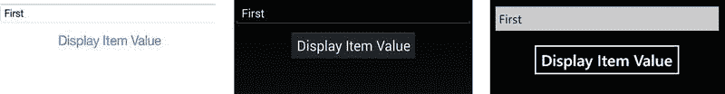
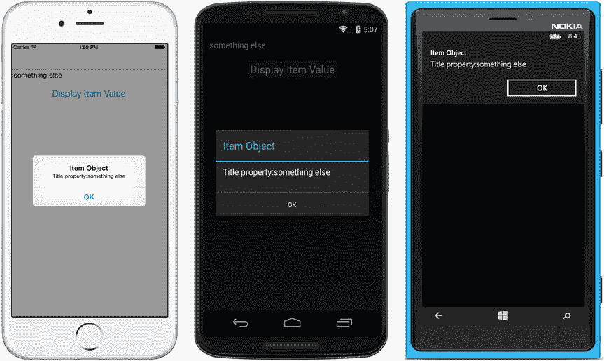
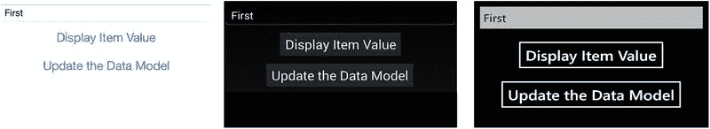
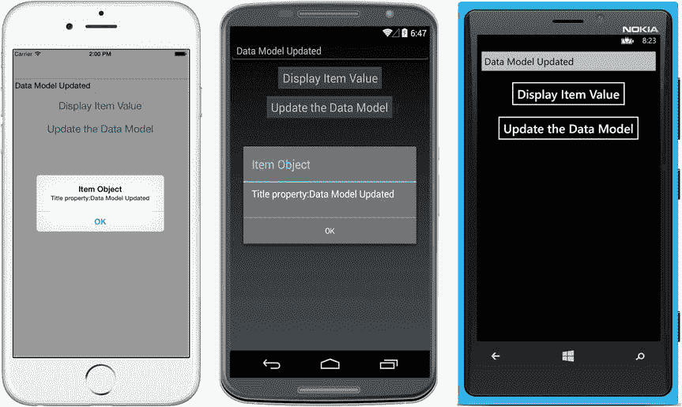
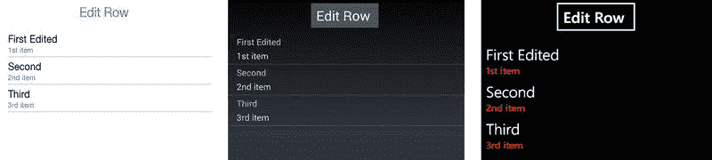
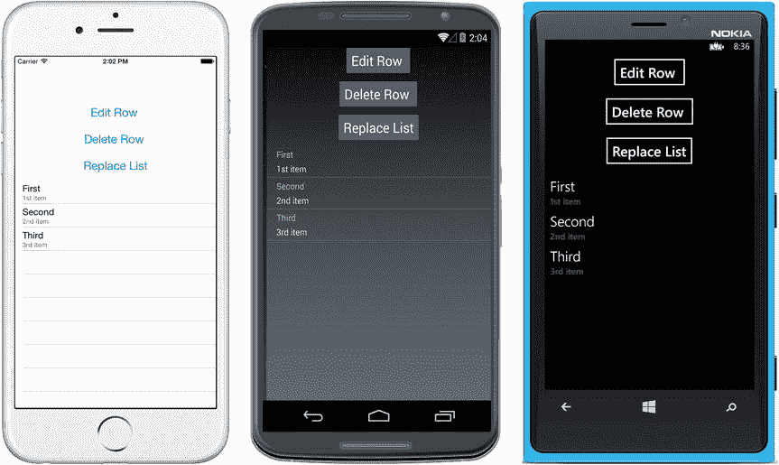
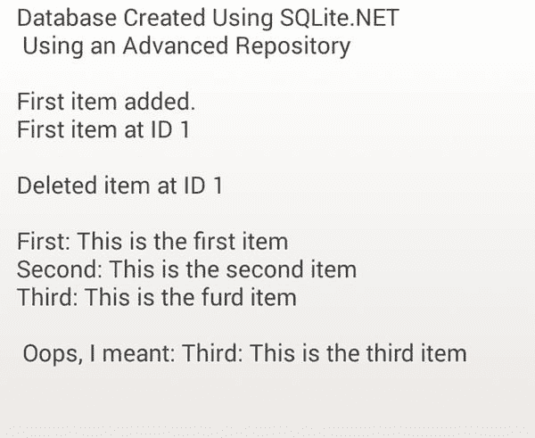
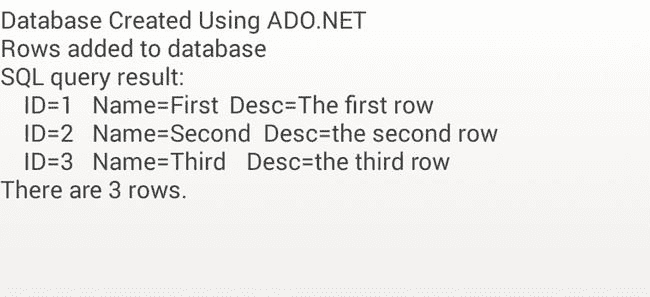

# 7.使用 SQLite 和数据绑定进行数据访问

Xamarin 应用中的数据访问通常涉及通过 web 服务访问的本地数据库和远程数据服务器。本地数据访问可以通过许多产品以多种方式处理，包括开源和专有产品，但 Xamarin 推荐的移动数据库是 SQLite，它内置于 iOS 和 Android 中。可以从 SQLite 数据库中查询数据并手动填充到 UI 中，但是更复杂的方法是使用数据绑定在 UI 和数据模型之间自动传输信息。在本章中，您将了解如何在 Xamarin 应用中使用 SQLite，以及如何在 Xamarin 中使用数据绑定。表单应用。

## 什么是 SQLite？

SQLite 是一个基于 C 的关系数据库，由 D. Richard Hipp 于 2000 年春天设计，用于美国海军的导弹战舰。它现在是包括 iOS 和 Android 在内的许多操作系统中包含的备用数据库引擎(但 Windows Phone 中没有，所以必须手动发货)。SQLite 实现了大部分 SQL 标准，没有独立的数据库服务器进程，而是作为一个库访问的数据存储进行链接，提供一个按需的、特定于应用的数据库。

您通常会以三种方式之一将 SQLite 与 Xamarin 一起使用:

*   SQLite。NET:使用 SQLite.NET 与`Insert`、`Get`、`Delete`、`Table`、`Query`形成 CRUD 交易
*   阿多。NET:使用 SQLite 的最小 ADO.NET 实现来执行带有`Command`对象的 SQL 语句
*   第三方 MVVM 库:通过使用第三方 MVVM 框架，如 MvvmCross 或 MVVM 轻型工具包，将视图数据绑定到 SQLite 数据库中的字段

第三方 MVVM 库超出了本书的范围。ADO.NET 在本章的最后，SQLite.NET 是一个受开发者欢迎的选择。

## 什么是 SQLite.NET？

要在 C#中使用基于 C 的 SQLite，需要一个绑定库，这也是 Frank Krueger 在 C#中创立开源 SQLite 库 SQLite.NET 的原因。SQLite.NET 是一个对象关系映射(ORM)库。ORMs 允许您操作数据库对象，而不是处理字段和表。SQLite.NET 提供了两种选择。我们可以通过使用像`Insert`、`Get`和`Delete`这样的方法对映射到表的数据类进行操作来进行数据对象操作。我们还可以使用 SQL 通过`Query`方法查询一个表，并使用 LINQ 通过`Table`方法对表的内容进行操作。使用 SQLite.NET 的 SQLite 为您提供了从本地移动数据库构建消费者、商业和企业本地移动应用所需的一切。

Data Storage Options

许多成功的移动应用使用非数据库存储选项。除了使用 SQLite 数据库进行数据存储之外，甚至可以使用基于文件的数据存储来代替 SQLite 数据库。这可能涉及 XML 或 JSON、HTML 中的序列化数据，或者存储在设备本地文件夹中的文本文件中的逗号分隔字段。首选项是另一个数据存储选项。iOS、Android 和 Windows Phone 提供了将偏好存储为键值对的方式，通常用于记录用户设置或其他少量数据。本章着重于本地数据库访问，并不探索这些或其他非数据库数据存储技术，但我鼓励您在 Xamarin 在线文档中这样做。另外，[第 6 章](06.html)在“管理状态”一节中提到了涉及 XML 序列化的磁盘存储技术。

## 数据绑定

如果您手工编写代码，保持您的 UI 与您的数据模型同步可能需要大量的工作。每次用户在 UI 中进行更改时，您可以实现更新数据模型内容的事件处理程序(如`TextChanged`)，每次数据模型在代码中发生更改时，您可以通知 UI 进行刷新(通过实现`PropertyChanged`)。

数据绑定通过提供一个将视图与数据模型同步的框架来为您处理所有这些问题。数据绑定管理视图，这些视图需要修改其附带的数据模型的内容，并根据数据模型的变化刷新 UI。

数据绑定内置于 Xamarin.Forms 中。

在移动开发中，数据层和表示层之间的这种实时连接是可用的，因为表示层和数据层一起驻留在单个物理层，即移动设备上。Windows Presentation Foundation(WPF)桌面应用的开发有许多相似之处。WPF 开发中经常使用的设计模式是 MVVM(模型-视图-视图模型)。MVVM 和数据绑定涉及表示层和数据层的耦合，以创建丰富、响应迅速的用户体验。

Xamarin 应用可以使用第三方数据绑定库，如 MvvmCross 或 MVVM 之光。还提供了一系列特定于平台的技术。Android 提供了在[第五章](05.html)中讨论的数据绑定适配器方法，比如子类化`BaseAdapter`。Android 还通过使用`SimpleCursorAdapter`和`CursorAdapter`为数据绑定到 SQLite 数据库提供了适配器类，这超出了本书的范围。iOS 提供了`UITableViewSource`之类的适配器，这在[第 5 章](05.html)中也有涉及。

Important Note

本章涵盖了跨平台的 SQLite 技术，如 SQLite.NET 和 ADO.NET，以及 Xamarin。表单数据绑定。如果您需要一个用 Xamarin 设置的 SQLite 解决方案。Android 或 Xamarin.iOS，参考 Xamarin 在线文档和食谱。

本章不关注特定于平台的数据访问技术，而是深入研究跨平台 SQLite 技术和使用 Xamarin.Forms 的数据绑定。

## Xamarin。表单数据绑定

xamarin.forms

Xamarin。Forms 内置了数据绑定，允许您轻松优雅地将视图绑定到模型。XAML 通常用于在 Xamarin.Forms 中实现数据绑定。本章涵盖了 C#方法，您可以在可下载的代码示例中遵循 XAML。Xamarin。表单数据绑定支持将一个视图绑定到另一个视图，以及将一个视图绑定到一个变量。本节主要关注最常见的业务应用用例:将视图绑定到数据模型。

Xamarin。窗体数据绑定是通过将数据源属性绑定到目标 UI 元素属性来完成的。目标属性必须是一个可绑定的属性(从`BindableObject`派生)，可以通过使用视图的`SetBinding`方法来指定。可绑定属性在联机 Xamarin 中指出。每个类的窗体 API 文档。数据源可以是变量或数据模型类属性，并且可以通过使用页面或视图上的`BindingContext`属性来设置。

值得注意的是，数据绑定可以通过使用视图的`PropertyChanged`或`TextChanged`事件与源同步来手动完成。

然而，Xamarin。安装完成后，表单数据绑定基本上是自动的。您需要创建和配置目标视图，并将其与源视图配对。您还需要通过实现`INotifyPropertyChanged`接口来准备该源，以便通过`PropertyChanged`事件处理程序对该源进行可观察的更改。Xamarin。表单隐藏在其余的事件处理程序中，执行源和目标之间的数据传输。下面的例子使用了`BindingContext`属性和`SetBinding`方法，重点介绍了这种自动方法。

琐碎的数据绑定涉及包含来自数据模型(源)的初始值的视图，对 UI(目标)的更改反映在模型中。但是，不会刷新 UI 来反映对数据模型的更改。刷新 UI 需要重要的数据绑定，稍后将在“使用 INotifyPropertyChanged”中介绍

让我们看几个 Xamarin.Forms 中自动数据绑定的例子。接下来，您将继续学习一些重要的示例，在这些示例中，对数据模型的更改会在视图中刷新。您将探索 MVVM 设计模式，将您的数据模型包装在视图模型(或 view model)中。然后，您将重新访问数据绑定列表，只是您将使它们可编辑而不是只读。

在简单的自动数据绑定中，对 UI 的更改会实时反映在数据模型中。下面是在 C#中处理简单数据绑定的一种常用方法(但不是唯一的方法):

Specify the source data model by using the `BindingContext` page (or view) property:  

`Ex. this.BindingContext = listItem;`

Pair the source property with the target view property by using the `SetBinding` method:  

`Ex. titleEntry.SetBinding(Entry.TextProperty, "Title");`

这两个步骤将`Entry`视图绑定到`Item`模型的`Title`属性(`listItem`是`Item`的一个实例)。

重要的数据绑定需要实现`INotifyPropertyChanged`接口的观察者事件`PropertyChanged`，当视图模型检测到数据的变化时触发该事件(在属性的`Set`访问器方法中)。

Tip

您希望使用 Xamarin.iOS 还是 Xamarin 进行数据绑定。安卓？查看第三方 MVVM 数据绑定库，如 MvvmCross 或 MVVM 之光。更传统的数据绑定技术包括 Android 上的`BaseAdapter`、`SimpleCursorAdapter`和`CursorAdapter`，以及 iOS 上的`UITableViewSource`。参考[第 5 章](05.html)入门安卓`BaseAdapter`和 iOS `UITableViewSource`。

让我们看一个微不足道的 Xamarin。表单数据绑定示例。

### 绑定到数据模型

xamarin.forms

使用上一节中的两步数据绑定方法，将一个`Entry`视图绑定到一个名为`Item`的数据模型的`Title`属性。这是一个简单的绑定:对视图的更改会导致对数据模型的更新。

创建一个名为`Item`的数据模型，带有`Title`和`Description`字符串属性，如清单 [7-1](#FPar4) 所示。

Listing 7-1\. Item Data Model in Item.cs

`public class Item`

`{`

`public string Title { get; set; }`

`public string Description { get; set; }`

`}`

创建一个实例化然后填充`Item`的`ContentPage`(清单 [7-2](#FPar5) )。将页面的`BindingContext`属性设置为 item 对象。创建`Entry`视图，然后使用`SetBinding`方法将其`Text`属性绑定到`Item`中的`Title`属性。`SetBinding`方法调用中的`Entry.TextProperty`是一个数据绑定属性，它提供了对`Entry`视图的`Text`属性的引用。

Listing 7-2\. Bind a View to a Model in ItemPage.cs

`public ItemPage()`

`{`

`var item =  new Item {Title = "First", Description="1st item"};`

`this.BindingContext = item;`

`var titleEntry = new Entry()`

`{`

`HorizontalOptions = LayoutOptions.FillAndExpand`

`};`

`titleEntry.SetBinding(Entry.TextProperty, "Title");`

`Content  = new StackLayout {`

`Children = { titleEntry }`

`};`

`}`

在`SetBinding`调用中，`"Title"`字符串参数用于创建一个`Binding`对象。

`BindingContext`可在页面或视图级别设置。在大多数情况下，页面级属性就足够了，但是如果使用多个源，一定要在视图级设置`BindingContext`。在 MVVM 应用中，单一来源(视图模型)是典型的。稍后会有更多的介绍。

由于绑定的原因，您键入到`Entry`视图中的任何值都会被填充到`item.Title`属性中。通过添加一个带有显示项目对象值的事件处理程序的按钮视图来证明这一点，如清单 [7-3](#FPar6) 所示。

Listing 7-3\. Button Click Displays the Value of the Title Property

`Button buttonDisplay = new Button`

`{`

`Text = "Display Item Value",`

`FontSize = Device.GetNamedSize(NamedSize.Large, typeof(Button)),`

`HorizontalOptions = LayoutOptions.Center,`

`VerticalOptions = LayoutOptions.Fill`

`};`

`buttonDisplay.Clicked += async (sender, args) =>`

`{`

`await DisplayAlert("Item Object", "Title property:" +  item.Title.ToString(), "OK");`

`};`

记得将新按钮添加到`StackLayout`:

`Content  = new StackLayout {`

`Children = { titleEntry, buttonDisplay }`

`};`

启动应用，你会看到你的`Entry`视图，数据已经预填充(图 [7-1](#Fig1) )。

图 7-1。

Trivial data binding populates the target with an initial source value

将条目值更改为其他值，然后单击按钮查看数据绑定的运行情况，如图 [7-2](#Fig2) 所示。

图 7-2。

The data-bound Entry view changes the Item property when edited

用户对`Entry`视图的`Text`属性的更改会自动更新数据模型。

这里使用的`BindingContext`是页面级别的。这可以很容易地在视图级别设置:

`titleEntry.BindingContext = item;`

在具有多个需要单独绑定的视图的页面上，在视图级别设置`BindingContext`。

Tip

如果您想直接看到普通绑定的局限性(不使用`INotifyPropertyChanged`)，请将下面一行代码放入您的`button.Clicked`事件中。当您单击该按钮时，您会看到 UI 并没有因为对数据模型的更改而更新。

`item.Title = "Trivial binding";`

前面所有的例子都是琐碎的数据绑定例子；数据模型和变量将反映 UI 的变化。为了从数据模型刷新 UI，您需要使用`INotifyPropertyChanged`接口来实现重要的数据绑定。

### 使用 INotifyPropertyChanged

xamarin.forms

`INotifyPropertyChanged`是一个. NET 接口，用于通知绑定客户端一个属性值已经改变。当您的数据绑定 UI 必须实时刷新以反映数据模型的变化时，请使用`INotifyPropertyChanged`(不仅仅是在 UI 中显示初始数据)。

下面是`INotifyPropertyChanged`接口的定义:

`public interface INotifyPropertyChanged`

`{`

`event PropertyChangedEventHandler PropertyChanged;`

`}`

在视图模型(或 view model)中实现`INotifyPropertyChanged`，这是一个为特定屏幕提供数据的类。`INotifyPropertyChanged`接口在`System.ComponentModel`名称空间中，而`CallerMemberName`属性驻留在`System.Runtime.CompilerServices`名称空间中，所以记得将它们添加到您的类中:

`using System.ComponentModel;`

`using System.Runtime.CompilerServices;`

实现`INotifyPropertyChanged`来创建一个简单的视图模型，它有一个名为`Title`的属性，如清单 [7-4](#FPar8) 所示。`Title`属性上的`Set`访问器调用`OnPropertyChanged`事件来通知 UI 数据发生了变化，这样它就可以刷新了。

Listing 7-4\. INotifyPropertyChanged Implementation in a View Model in TitleViewModel.cs

`public class TitleViewModel : INotifyPropertyChanged`

`{`

`public event PropertyChangedEventHandler PropertyChanged;`

`String title;`

`public string Title`

`{`

`set`

`{`

`if (!value.Equals(title, StringComparison.Ordinal))`

`{`

`title = value;`

`OnPropertyChanged("Title");`

`}`

`}`

`get`

`{`

`return title;`

`}`

`}`

`void OnPropertyChanged([CallerMemberName] string propertyName = null)`

`{`

`var handler = PropertyChanged;`

`if (handler != null)`

`{`

`handler(this, new PropertyChangedEventArgs(propertyName));`

`}`

`}`

`}`

当设置了`Title`属性时，调用`OnPropertyChanged`事件来触发，调用属性由`[CallerMemberName]`属性传入。`PropertyChangedEventHandler`事件就是 Xamarin。表单机制，用于通知绑定到该属性的视图刷新并反映更新的数据模型。

注意，这个简化的方法没有使用`Item`数据模型。你很快就会这么做的。

回到您的`ContentPage`，更新绑定:

`var titleViewModel = new TitleViewModel();`

`titleViewModel.Title = "First";`

`this.BindingContext = titleViewModel;`

由于属性名(`Title`)没有改变，`SetBinding`基本上与前面的例子相同。所以你可以看到这个方法是如何工作的，这里我使用了另一个重载`SetBinding`，它接受一个`Binding`对象`new Binding("Title")`，而不仅仅是一个`"Title"`字符串。

`titleEntry.SetBinding(Entry.TextProperty, new Binding("Title"));`

在您的`buttonDisplay.Clicked`事件中，将显示属性更改为`titleViewModel.Title`。

添加一个按钮来修改数据模型的属性，并演示重要的数据绑定:

`Button buttonUpdate = new Button`

`{`

`Text = "Update the Data Model",`

`FontSize = Device.GetNamedSize(NamedSize.Large, typeof(Button)),`

`HorizontalOptions = LayoutOptions.Center,`

`VerticalOptions = LayoutOptions.Fill`

`};`

`buttonUpdate.Clicked += async (sender, args) =>`

`{`

`titleViewModel.Title = "Data Model Updated";`

`await DisplayAlert("Item Object", "Title property:" + titleViewModel.Title.ToString(), "OK");`

`};`

记得将新按钮添加到`StackLayout`:

`Content = new StackLayout`

`{`

`Children = { titleEntry, buttonDisplay, buttonUpdate }`

`};`

图 [7-3](#Fig3) 显示了更新后的`ContentPage`。

图 7-3。

ContentPage for nontrivial data binding

单击`buttonUpdate`来更改`Title`属性，并看到该更改传播回`Entry`视图(图 [7-4](#Fig4) )。

图 7-4。

The Entry view has refreshed to match the model.

### 代码完成:使用 INotifyPropertyChanged

xamarin.forms

清单 [7-5](#FPar10) 是针对`TitleViewModel`的`INotifyPropertyChanged`实现的完整代码。

XAML

所有的 Xamarin。本章中的表单数据绑定代码解决方案，包括这些 C#示例的 XAML 版本，可以在 Apress.com(从源代码/下载选项卡，访问本书的标题)或 GitHub 上的 [`https://github.com/danhermes/xamarin-book-examples`](https://github.com/danhermes/xamarin-book-examples) 找到。Xamarin。第七章中[的数据绑定样本的表单 XAML 文件夹为`DataBindingExamples.Xaml`。](07.html)

Listing 7-5\. ItemPageUsingTitleViewModel.cs

`public ItemPageUsingTitleViewModel()`

`{`

`var titleViewModel = new TitleViewModel();`

`titleViewModel.Title = "First";`

`this.BindingContext = titleViewModel;`

`var titleEntry = new Entry()`

`{`

`HorizontalOptions = LayoutOptions.FillAndExpand`

`};`

`titleEntry.SetBinding(Entry.TextProperty, new Binding("Title"));`

`Button buttonDisplay = new Button`

`{`

`Text = "Display Item Value",`

`FontSize = Device.GetNamedSize(NamedSize.Large, typeof(Button)),`

`HorizontalOptions = LayoutOptions.Center,`

`VerticalOptions = LayoutOptions.Fill`

`};`

`buttonDisplay.Clicked += async (sender, args) =>`

`{`

`await DisplayAlert("Item Object", "Title property:" + titleViewModel.Title.ToString(), "OK");`

`};`

`Button buttonUpdate = new Button`

`{`

`Text = "Update the Data Model",`

`FontSize = Device.GetNamedSize(NamedSize.Large, typeof(Button)),`

`HorizontalOptions = LayoutOptions.Center,`

`VerticalOptions = LayoutOptions.Fill`

`};`

`buttonUpdate.Clicked += async (sender, args) =>`

`{`

`titleViewModel.Title = "Data Model Updated";`

`await DisplayAlert("Item Object", "Title property:" + titleViewModel.Title.ToString(), "OK");`

`};`

`Content = new StackLayout`

`{`

`Children = { titleEntry, buttonDisplay, buttonUpdate }`

`};`

`}`

Tip

通过创建一个实现`INotifyPropertyChanged`的`BindableBase`类来避免重复样板`PropertyChanged`代码。然后，您可以在您的模型或视图模型中子类化`BindableBase`,使它们为非平凡绑定做好准备。

`public abstract class BindableBase : INotifyPropertyChanged`

`{`

`public event PropertyChangedEventHandler PropertyChanged;`

`void OnPropertyChanged([CallerMemberName] string propertyName = null)`

`{`

`var handler = PropertyChanged;`

`if (handler != null)`

`{`

`handler(this, new PropertyChangedEventArgs(propertyName));`

`}`

`}`

`}`

有了`INotifyPropertyChanged`的实现，你的应用现在可以在数据改变时通知用户界面。表单将刷新用户界面。通过创建一个为特定视图(`TitleViewModel`)提供数据的类，您就创建了一个视图模型。

### 了解视图模型和 MVVM

ViewModel(MVVM 的 VM)是通过使用一个或多个模型(MVVM 的 M，或数据模型)为特定屏幕提供数据的类。ViewModel 使用特定于视图的属性进行修饰，并绑定到视图(MVVM 中的 V，指的是表示层或 UI，不要与 Xamarin 混淆。表单`View`类)。ViewModel 类似于数据模型，只是它是通过使用助手类和处理程序事件来定制特定视图(或屏幕)的，这些事件是填充该页面上的数据或管理对数据模型的更改所必需的。在传统的 MVVM 应用中，您为每个视图(屏幕)创建一个视图模型，用在每个屏幕上提供和保存数据所需的构造函数和助手方法填充您的视图模型。

MVVM 应用通常使用数据模型(不仅仅是作为属性添加到视图模型中的几个变量)。这需要将数据模型包装在视图模型中，视图不应该直接使用模型，而应该只与视图模型交互。

### 绑定到视图模型和数据模型

如前所述，视图模型可以实现`INotifyPropertyChanged`，但是数据模型也可以实现`INotifyPropertyChanged`。这是实现非平凡数据绑定的`INotifyPropertyChanged`的两种标准方法，按流行程度排序。对于为什么非此即彼是做事的唯一方式，存在激烈的争论，但我将向您展示两种方式，并让您做出决定。我还将展示第三种方法，它避免了其他两种方法的一些问题:

*   创建一个实现`INotifyPropertyChanged`的视图模型。从`INotifyPropertyChanged`继承，在视图模型类中封装必要的变量和数据模型，在每个可编辑属性`Set`访问器中，引发`OnPropertyChanged`事件。这种方法是严格的 MVVM。
*   在您的数据模型中实现`INotifyPropertyChanged`。每当您在数据绑定上下文中使用您的模型时，它将为非平凡绑定做好准备，并通过其`OnPropertyChanged`事件向绑定的 UI 提供通知。
*   将您的数据模型包装在一个可观察的类中。稍后会有更多的介绍。

前两种方法功能相似，但架构不同。

第一种方法，创建一个实现`INotifyPropertyChanged`的视图模型，意味着在视图模型中包含一个数据模型的实例，并将顶级模型类包装为一个属性，以及必须在视图模型中公开的所有数据模型的属性。这为实例化、分配和更改封装的数据模型及其所有相关属性提供了对视图的完全控制。如果视图模型实现了`INotifyPropertyChanged`，并且在每个公共属性的`Set`方法中调用了`OnPropertyChanged`，那么这个类可以提供重要的绑定。(参见清单 [7-6](#FPar12) 。)

实现`INotifyPropertyChanged`的第二种方法发生在数据模型中，甚至在视图模型中使用它之前。参见清单 [7-7](#FPar13) 中实现`Item`类中的`INotifyPropertyChanged`来创建一个可观察的项目集合的例子。对于 MVVM 应用，这种方法仍然需要额外的步骤，将结果数据模型嵌入到视图模型中。

有些开发人员不喜欢第一种方法，因为它会导致代码重复，在不同的视图模型中有相同属性的多个`INotifyPropertyChanged`实现，有些开发人员不喜欢第二种方法，因为它弄乱了数据模型。

第三种方法避免了这两个问题，那就是将您的数据模型包装在一个实现`INotifyPropertyChanged`的类中，使其可观察(代价是创建另一个子类)。这是为我们做的。NET 来创建像`ObservableCollection`这样的类，你马上就可以为你的`Item`模型创建一个`ObservableItem`。这是一点额外的工作，但保持你的模型干净。我们将在清单 [7-10](#FPar18) 中的“绑定可编辑的`ListView`”一节中讨论第三种方法。

以下是前两种方法的示例:

#### 创建实现 INotifyPropertyChanged 的视图模型

通过使用封装的数据模型实现简单的 MVVM 方法，在视图模型中实现`INotifyPropertyChanged`。

基于`Item`数据模型创建一个视图模型，如清单 [7-6](#FPar12) 所示。它基本上与清单 [7-4](#FPar8) 中的`TitleViewModel`视图模型相同，除了一个`Item`类被实例化并用来保存`Title`属性值而不是`string`。(这是架构上的变化，不是功能上的。)

Listing 7-6\. View Model Based on the Item Data Model (ItemViewModel.cs)

`class ItemViewModel : INotifyPropertyChanged`

`{`

`public event PropertyChangedEventHandler PropertyChanged;`

`Item item;`

`public ItemViewModel ()`

`{`

`item = new Item();`

`}`

`public string Title`

`{`

`set`

`{`

`if (!value.Equals(``item.Title`T2】

`{`

`item.Title` `= value;`

`OnPropertyChanged("Title");`

`}`

`}`

`get`

`{`

`return``item.Title`T2】

`}`

`}`

`void OnPropertyChanged([CallerMemberName] string propertyName = null)`

`{`

`var handler = PropertyChanged;`

`if (handler != null)`

`{`

`handler(this, new PropertyChangedEventArgs(propertyName));`

`}`

`}`

`}`

注意，您没有包装`Description`属性，因为在这种情况下视图不需要包装。视图模型通常只包含视图所需的内容。

使用`ItemViewModel`像以前一样实现视图模型:

`var itemViewModel = new ItemViewModel();`

`itemViewModel.Title = "First";`

`this.BindingContext = itemViewModel;`

甚至`Entry`视图也是这样绑定的:

`titleEntry.SetBinding(Entry.TextProperty, new Binding("Title"));`

其余的`ContentPage`与清单 [7-5](#FPar10) 中的前一个示例`ItemPageUsingTitleViewModel`相同，只是重命名为使用`itemViewModel`而不是`titleViewModel`。详见可下载代码`ItemPageUsingItemViewModel.cs`。

该应用的功能与前一个示例完全相同，只是没有使用`Title`字符串变量，而是使用了`Item`数据模型，这是一个更真实的实现(和 MVVM)。

现在是第二种方法`INotifyPropertyChanged`。

#### 在数据模型中实现 INotifyPropertyChanged

可以在你的数据模型中实现，而不是在你的视图模型中。然后，可以将该数据模型直接绑定到视图，如下例所示，也可以将该数据模型包含在 MVVM 应用的视图模型中。

创建一个名为`ItemModel.cs`的类，如清单 [7-7](#FPar13) 所示。实现`OnPropertyChanged`事件并在每个属性`Title`和`Description`的`Set`方法中调用它，确保列表数据的变化实时反映在 UI 中。

Listing 7-7\. Implementing INotifyPropertyChanged in a Data Model

`class ItemBindable: INotifyPropertyChanged`

`{`

`public event PropertyChangedEventHandler PropertyChanged;`

`string title;`

`string description;`

`public string Title`

`{`

`set`

`{`

`if (!value.Equals(title, StringComparison.Ordinal))`

`{`

`title = value;`

`OnPropertyChanged("Title");`

`}`

`}`

`get`

`{`

`return title;`

`}`

`}`

`public string Description`

`{`

`set`

`{`

`if (!value.Equals(description, StringComparison.Ordinal))`

`{`

`description = value;`

`OnPropertyChanged("Description");`

`}`

`}`

`get`

`{`

`return description;`

`}`

`}`

`void OnPropertyChanged([CallerMemberName] string propertyName = null)`

`{`

`var handler = PropertyChanged;`

`if (handler != null)`

`{`

`handler(this, new PropertyChangedEventArgs(propertyName));`

`}`

`}`

`}`

现在可以实现这个`ItemBindable`类，将其属性绑定到任何视图:

`var itemBindable = new ItemBindable();`

`itemBindable.Title = "First";`

`this.BindingContext = itemBindable;`

通过`Title`属性再次使用`Entry`视图绑定:

`titleEntry.SetBinding(Entry.TextProperty, new Binding("Title"));`

这种在视图中直接使用模型的方式(我用来简化演示)与 MVVM 模式不一致，后者鼓励模型和视图之间的分离。在视图模型中包含`ItemBindable`以利用 MVVM 模式。

这些是在 Xamarin.Forms 中为非平凡的双向绑定构建视图模型和数据模型的一些技术。

### 绑定只读 ListView

xamarin.forms

绑定到一个`ListView`在[第 5 章](05.html)中有广泛的介绍，但是我们只做了琐碎的只读绑定。这意味着数据模型的初始值显示在列表中以供查看或选择，但是 UI 或模型不会发生任何变化。重要的可编辑列表绑定意味着数据模型的初始值显示在列表中，并且提供了允许用户添加或删除行或更改列表中显示的行属性的控件。

在讨论重要的绑定之前，我将从简单的绑定到一个`ListView`开始。

在`ContentPage`中，实例化并填充数据模型，如清单 [7-8](#FPar14) 所示。将模型分配给列表的`ItemSource`属性等同于设置`BindingContext`。使用`ItemTemplate.SetBinding`分配一行中的每个字段。

Listing 7-8\. Trivial, Read-Only ListView Binding from [Chapter 5](05.html)

`class ListViewPage: ContentPage`

`{`

`public ListViewPage()`

`{`

`var listView = new ListView();`

`var items = new Item[] {`

`new Item {Title = "First", Description="1st item"},`

`new Item {Title = "Second", Description="2nd item"},`

`new Item {Title = "Third", Description="3rd item"}`

`};`

`listView.ItemsSource = items;`

`listView.ItemTemplate = new DataTemplate(typeof(TextCell));`

`listView.ItemTemplate.SetBinding(TextCell.TextProperty, "Title");`

`listView.ItemTemplate.SetBinding(TextCell.DetailProperty, "Description");`

`listView.ItemTapped += async (sender, e) =>`

`{`

`Item item = (Item)e.Item;`

`await DisplayAlert("Tapped", item.Title.ToString() + " was selected.", "OK");`

`((ListView)sender).SelectedItem = null;`

`};`

`this.Padding = new Thickness(0, Device.OnPlatform(20, 0, 0), 0, 0);`

`Content = listView;`

`}`

`}`

这种方法适用于只读的、可选择的列表(甚至可以扩展到包括列表 UI 中数据模型属性的编辑，比如`Entry`视图，尽管这超出了本书的范围)。如果您想了解有关使用 Xamarin 构建和自定义只读列表的更多信息。表格，翻到[第五章](05.html)的开头。

如果您的列表需要动态变化，在代码中实时添加或删除行或更改属性，那么可能需要重要的数据绑定。

### 绑定可编辑的 ListView

xamarin.forms

用户编辑列表的标准方式是添加或删除列表行，或者修改列表行的属性。当在数组或集合中添加或删除列表行时，或者当在代码中更改列表属性时，这些类型的列表编辑需要重要的数据绑定。我们需要这些数据模型的变化反映在 UI 中。

重要的列表绑定需要实现一个`INotify`接口来通知 UI 在模型发生变化时进行刷新。有两种方法可以做到这一点:使用手动实现`INotifyPropertyChanged`或使用`ObservableCollection`。`ObservableCollection`已经实现了`INotifyCollectionChanged`接口。使用哪种方法(一种或两种)应取决于您希望在列表 UI 中反映的列表更改类型。

下面是两种主要的列表编辑场景和处理它们的标准方法:

*   添加和删除行:使用一个`ObservableCollection`作为列表数据源。
*   编辑`ListView`中的属性:创建一个实现`INotifyPropertyChanged`的视图模型，该模型公开了列表数据模型中的可编辑属性(如`Title`)。

Tip

如果需要替换整个列表，可能需要通过重新分配 ItemsSource 来重新绑定列表，以便刷新 UI。

让我们从添加和删除行开始。

#### 添加和删除行

xamarin.forms

添加和删除`ListView`中的行时的重要数据绑定可以使用`ObservableCollection`来处理，它有一个内置的`INotifyCollectionChanged`实现。绑定到`ObservableCollection`的`ListView`将自动为`CollectionChanged`事件安装一个处理程序。

使用`ObservableCollection`作为`ListItem`的绑定数据类型确保了对列表行的更改实时反映在 UI 中。

创建并填充`ObservableCollection`，如清单 [7-9](#FPar16) 所示。将`ListView`的`ItemsSource`属性设置为集合。

Listing 7-9\. List Binding Using an ObservableCollection (ListObservablePage.cs)

`var items = new ObservableCollection<Item> {`

`new Item {Title = "First", Description="1st item"},`

`new Item {Title = "Second", Description="2nd item"},`

`new Item {Title = "Third", Description="3rd item"}`

`};`

`listView.ItemsSource = items;`

`ListView`的`ItemTemplate`实现与清单 [7-8](#FPar14) 中的前一个例子相同:

`listView.ItemTemplate = new DataTemplate(typeof(TextCell));`

`listView.ItemTemplate.SetBinding(TextCell.TextProperty, "Title");`

`listView.ItemTemplate.SetBinding(TextCell.DetailProperty, "Description");`

完整的代码可以在可下载的代码文件`ListObservablePage.cs`中找到。

通过添加一个在名为`items`的`ObservableCollection`中添加或删除行的按钮来测试这种方法，您将看到您的模型更改立即反映在列表 UI 中。

`items.RemoveAt(0);`

在执行我们的`RemoveAt`方法后，UI 中的第一个列表行立即被删除，如图 [7-5](#Fig5) 所示。注意，如果没有`items.Count > 0`检查，我们简单的演示代码可能会因为多次删除而中断。

图 7-5。

The deleted first item disappears from the list

这种方法不使用视图模型，因此它不是 MVVM 实现。我们很快会认真对待 MVVM 的可编辑列表。

Tip

通过使用`ObservableCollection`添加和删除列表行特别适合上下文操作，即 Xamarin。在每个列表行上提供删除和/或更多按钮的表单方法。转到第 5 章了解更多关于上下文动作的信息。

一个`ObservableCollection`只跟踪行的添加或删除。反映这些行中属性的变化是另一回事。

#### 编辑属性

xamarin.forms

在代码中编辑列表属性并在列表用户界面中反映这些更改可以通过前面讨论的三种方法中的任何一种来处理，将列表绑定到下列方法之一:

*   创建一个实现`INotifyPropertyChanged`的视图模型。
*   在您的数据模型中实现`INotifyPropertyChanged`。
*   将您的数据模型包装在实现`INotifyPropertyChanged`的类中。

第一种方法是一种流行的选择，但是由于您已经在前面的清单 [7-6](#FPar12) 中看到了，第二种方法在清单 [7-7](#FPar13) 中看到了，这里您将使用第三种方法:使用`INotifyPropertyChanged`将您的数据模型包装在一个可观察的项目类中。然后将这个可观察的类绑定到您的列表(直接或通过视图模型)。

创建一个名为`ObservableItem.cs`的类，如清单 [7-10](#FPar18) 所示。实现`OnPropertyChanged`事件并在`ListItems`的`Set`方法中调用它可以确保列表数据的变化实时反映在 UI 中。请注意，这个类本身并不是 MVVM，除非您将它封装在一个视图模型中，稍后您将会这样做。

Listing 7-10\. Wrap Your Data Model in an Observable Class (ObservableItem.cs)

`class ObservableItem: INotifyPropertyChanged`

`{`

`public event PropertyChangedEventHandler PropertyChanged;`

`Item item;`

`public ObservableItem()`

`{`

`item = new Item();`

`}`

`public string Title`

`{`

`set`

`{`

`if (!value.Equals(item.Title, StringComparison.Ordinal))`

`{`

`item.Title = value;`

`OnPropertyChanged("Title");`

`}`

`}`

`get`

`{`

`return item.Title;`

`}`

`}`

`public string Description`

`{`

`set`

`{`

`if (!value.Equals(item.Description, StringComparison.Ordinal))`

`{`

`item.Description = value;`

`OnPropertyChanged("Description");`

`}`

`}`

`get`

`{`

`return item.Description;`

`}`

`}`

`void OnPropertyChanged([CallerMemberName] string propertyName = null)`

`{`

`var handler = PropertyChanged;`

`if (handler != null)`

`{`

`handler(this, new PropertyChangedEventArgs(propertyName));`

`}`

`}`

`}`

现在可以实现这个`ObservableItem`类来创建一个重要的数据绑定列表:

`var items = new List<ObservableItem> {`

`new ObservableItem {Title = "First", Description="1st item"},`

`new ObservableItem {Title = "Second", Description="2nd item"},`

`new ObservableItem {Title = "Third", Description="3rd item"}`

`};`

`listView.ItemsSource = items;`

`ListView`的`ItemTemplate`实现与清单 [7-8](#FPar14) 中包含的(两个)前面的例子相同:

`listView.ItemTemplate = new DataTemplate(typeof(TextCell));`

`listView.ItemTemplate.SetBinding(TextCell.TextProperty, "Title");`

`listView.ItemTemplate.SetBinding(TextCell.DetailProperty, "Description");`

完整的`ListView`代码清单见可下载文件`ListPropertiesPage.cs`。

对代码中任何属性的更改都将实时反映在列表 UI 中。您可以通过创建一个按钮或上下文操作来编辑项目列表中的一个属性，例如,`Title`:

`items[0].Title = "First Edited";`

执行该语句后，UI 中第一行列表会立即更新，如图 [7-6](#Fig6) 所示。

图 7-6。

The first row is edited in code, and the UI is refreshed automatically Note

如果列表行中的可编辑视图，比如`Entry`视图，被绑定到数据模型中的属性，那么前面描述的简单数据绑定可能就足够了，这种`INotifyPropertyChanged`方法可能就不需要了。

将`List<` `ObservableItem>`直接绑定到列表也没有使用视图模型，所以它不是 MVVM。

接下来，您将看到如何使用 observable item 类和 observable 集合来创建可编辑列表的视图模型。

#### 绑定到视图模型

xamarin.forms

构建 MVVM 应用需要使用视图模型。使用 MVVM 时，直接在视图中实现数据模型是一种反模式。您需要创建一个视图模型，并将您的数据模型包装在其中，以绑定到您的可编辑列表。

创建一个包含前面列表绑定示例中所有特性的`ListViewModel`类。`Items`属性是一个`ObservableCollection`，所以 UI 可以反映增加或删除的行，而基项目类是`ObservableItem`，所以属性的变化也可以反映在列表 UI 中。见清单 [7-11](#FPar21) 。

Note

清单 [7-11](#FPar21) 是视图模型的一个不寻常的例子，因为没有明确的实现`INotifyPropertyChanged. INotifyPropertyChanged`已经在所有封装的模型中实现:`ObservableCollection`和`ObservableItem`。在这个视图模型中，`INotifyPropertyChanged`的额外实现是多余的或者无关紧要的。

Listing 7-11\. ListViewModel for an Editable List in ListViewModel.cs

`class ListViewModel`

`{`

`ObservableCollection<ObservableItem> items;`

`public ListViewModel()`

`{`

`items = new ObservableCollection<ObservableItem> {`

`new ObservableItem {Title = "First", Description="1st item"},`

`new ObservableItem {Title = "Second", Description="2nd item"},`

`new ObservableItem {Title = "Third", Description="3rd item"}`

`};`

`}`

`public ObservableCollection<ObservableItem> Items`

`{`

`set`

`{`

`if ( value != items)`

`{`

`items = value;`

`}`

`}`

`get`

`{`

`return items;`

`}`

`}`

`}`

将视图模型中的`Items`属性绑定到列表源:

`var items = new ListViewModel();`

`listView.ItemsSource = items.Items;`

`ListView`的`ItemTemplate`实现与前面的例子相同，如清单 [7-8](#FPar14) 所示:

`listView.ItemTemplate = new DataTemplate(typeof(TextCell));`

`listView.ItemTemplate.SetBinding(TextCell.TextProperty, "Title");`

`listView.ItemTemplate.SetBinding(TextCell.DetailProperty, "Description");`

这是一个不平凡的，使用 MVVM 完全可编辑的列表。从列表中添加和删除行，在代码中编辑属性，所有这些都将实时反映在列表 UI 中。

创建一个`ContentPage`演示应用，包括行编辑、属性编辑和替换整个列表。绑定在你的`ListViewModel`上。图 [7-7](#Fig7) 展示了这个清单数据绑定演示应用的外观。

图 7-7。

Editable ListView data binding to a view model

这个可编辑列表绑定的基本示例仅用于演示目的。对于专业外观的 UI，可以考虑使用上下文操作。在每个列表行上提供“删除”和/或“更多”按钮的表单方法。翻到[第 5 章](05.html)了解更多关于上下文动作的信息。

参见清单 [7-12](#FPar23) 中的`ContentPage`这个例子，称为`ListPageUsingListViewModel.cs`。

Tip

替换整个列表需要重新绑定列表(这个例子是`ListViewModel)`中的`Replace`方法)。

`public void Replace()`

`{`

`Items = new ObservableCollection<ObservableItem> {`

`new ObservableItem {Title = "Primero", Description="First"},`

`new ObservableItem {Title = "Segundo", Description="Second"},`

`new ObservableItem {Title = "Tercero", Description="Third"}`

`};`

`}`

#### 代码完成:绑定可编辑的 ListView

xamarin.forms

清单 [7-12](#FPar23) 显示了绑定到清单 [7-11](#FPar21) 中视图模型`ListViewModel`的完整`ContentPage`。这演示了行编辑、属性编辑和替换整个列表。

Listing 7-12\. ListPageUsingListViewModel.cs

`public ListPageUsingListViewModel()`

`{`

`var listView = new ListView();`

`var items = new ListViewModel();`

`listView.ItemsSource = items.Items;`

`listView.ItemTemplate = new DataTemplate(typeof(TextCell));`

`listView.ItemTemplate.SetBinding(TextCell.TextProperty, "Title");`

`listView.ItemTemplate.SetBinding(TextCell.DetailProperty, "Description");`

`listView.ItemTapped += async (sender, e) =>`

`{`

`ObservableItem item = (ObservableItem)e.Item;`

`await DisplayAlert("Tapped", item.Title.ToString() + " was selected.", "OK");`

`((ListView)sender).SelectedItem = null;`

`};`

`Button buttonEdit = new Button`

`{`

`Text = "Edit Row ",`

`FontSize = Device.GetNamedSize(NamedSize.Large, typeof(Button)),`

`HorizontalOptions = LayoutOptions.Center,`

`VerticalOptions = LayoutOptions.Fill`

`};`

`buttonEdit.Clicked += async (sender, args) =>`

`{`

`items.Items[0].Title = "First Edited";`

`await DisplayAlert("Edited", "First row edited", "OK");`

`};`

`Button buttonDelete = new Button`

`{`

`Text = "Delete Row ",`

`FontSize = Device.GetNamedSize(NamedSize.Large, typeof(Button)),`

`HorizontalOptions = LayoutOptions.Center,`

`VerticalOptions = LayoutOptions.Fill`

`};`

`buttonDelete.Clicked += async (sender, args) =>`

`{`

`items.Items.RemoveAt(0);`

`await DisplayAlert("Delete", "Row deleted", "OK");`

`};`

`Button buttonReplace= new Button`

`{`

`Text = "Replace List",`

`FontSize = Device.GetNamedSize(NamedSize.Large, typeof(Button)),`

`HorizontalOptions = LayoutOptions.Center,`

`VerticalOptions = LayoutOptions.Fill`

`};`

`buttonReplace.Clicked += async (sender, args) =>`

`{`

`items.Replace();   // see previous Tip`

`await DisplayAlert("Replace", "List replaced con Español", "OK");`

`listView.ItemsSource = items.Items;`

`};`

`Content = new` `StackLayout`

`{`

`Children = { buttonEdit, buttonDelete, buttonReplace, listView }`

`};`

`this.Padding = new Thickness(0, Device.OnPlatform(20, 0, 0), 0, 0);`

`}`

`buttonReplace`调用`Replace()`，这是添加到`ListViewModel`中的一个方法，这里没有显示。`Replace()`显示在上一篇技巧文章中，可在可下载的代码`ListViewModel.cs`中查看，并在列表必须被重新绑定以反映更改之前用西班牙行替换列表。

视图也可以绑定到其他视图。

### 将视图绑定到另一个视图

xamarin.forms

这本书的重点是数据驱动的应用，这意味着将视图绑定到模型和视图模型。然而，视图可以相互绑定。滑块可以绑定到标签。交换机可以绑定到入口视图，等等。

数据绑定的目标必须由一个`BindableProperty`对象支持，并且大多数 Xamarin。窗体视图有许多符合这一要求的属性。探索 Xamarin API 文档以了解这些内容。许多视图属性也可以作为源绑定。

单个视图很容易绑定，因为每个视图必须有一个`BindingContext`。多个视图需要使用`BindingModes` : `OneWayToSource`和`TwoWay`进行映射，这超出了本书的范围。有关详细信息，请参考 Xamarin 在线文档。

尽管数据绑定是特定于平台的，但在 Xamarin 开发中，数据库访问确实是跨平台的。不管您在开发什么平台，使用 SQLite 基本上都是一样的。

## 使用 SQLite.NET

跨平台

数据模型通常由本地数据库填充并与之同步。SQLite.NET 是许多使用 Xamarin 的 Xamarin 开发者的移动、跨平台数据库库。表格，Xamarin。Android，或者 Xamarin.iOS。

Xamarin。为了便于演示，在下面的 SQLite.NET 示例的 UI 部分使用了 Forms，但是这些技术也可以很好地用在 Xamarin 中。Android 和 Xamarin.iOS 应用。SQLite.NET 是一种跨平台技术。

如何在解决方案中安装 SQLite.NET 取决于解决方案的类型。PCL 设置不同于共享项目设置:

*   PCL 设置:将 SQLite.NET 与 PCL 一起使用的最佳选择是名为 SQLite.NET PCL 的 NuGet 包。其中有几个具有相似的名称，所以一定要使用具有这些属性的包:

*   名称:SQLite-Net PCL
*   创建者:弗兰克·克鲁格
*   id:SQLite-net PCL
*   nu set link:SQLite-net PCL

*   在您需要的项目中安装 SQLite-Net PCL，通常是您的解决方案中的大部分项目。不要手动将`SQLite.cs`文件添加到您的项目中。参见可下载的代码解决方案`SQLiteNetPCL`。
*   共享项目设置:从 sqlite-net GitHub 项目中添加一个名为`SQLite.cs`的文件到您的共享项目中，方法是下载该文件，然后单击您的应用解决方案并选择 Add File。参见可下载的代码解决方案`SQLiteNETSharedProject`。

本节中的许多 SQLite.NET 例子使用了 PCL，因为它在演示中更清晰，但是我也将涵盖共享项目。PCL 和共享项目 SQLite.NET 实现是相似的，除了它们如何处理数据库路径和连接的平台特定的实现。在“构建数据库路径”一节中有更多的介绍

现在您已经在解决方案中安装了 SQLite.NET，在数据访问层类中使用`using`语句引用该库:

`using SQLite;`

使用 SQLite.NET 构建数据访问层需要创建特定于表数据的数据库连接、锁定对象和 CRUD 事务方法(get、insert、update 和 delete)。

Important Note

插入、获取、更新和删除行应该使用锁来完成，以避免冲突。以下示例为简单起见排除了锁，直到“锁定行”一节查看清单 [7-19](#FPar39) 或清单 [7-22](#FPar43) 中带锁的代码。

### 在 Windows Phone 上安装 SQLite

windows 手机

SQLite 数据库引擎随 iOS 和 Android 提供，但不随 Windows Phone 提供，因此您必须随自己的应用提供。从 sqlite.org 下载 Windows Phone 8 的预编译二进制文件。安装此 Visual Studio 扩展并重新启动 Visual Studio。将此引用添加到您的项目中:名为 SQLite for Windows Phone 的 Windows Phone 扩展。

现在 SQLite.NET 已经安装好了，让我们创建一个 SQLite 数据库。

### 创建数据库

通过建立到包含文件夹路径的数据库文件名的数据库连接来创建新的 SQLite 数据库。您可以打开 SQLite 连接，并在整个应用中使用它，而无需关闭它。

首先找到数据库应该进入的文件夹，并创建数据库文件夹路径:

`string folder = Environment.GetFolderPath (Environment.SpecialFolder.Personal);`

`databasePath = Path.Combine(documents, "ItemsSQLite.db3");`

通过指定数据库路径和名称来创建数据库连接:

`var database = new SQLite.SQLiteConnection(databasePath);`

不需要检查文件是否已经存在。如果它尚不存在，将被创建；不然就干脆打开。

Tip

避免在不同的线程上使用单个连接。使用锁有助于避免冲突，如“锁定行”一节所述

在真实的应用中，构建数据库路径通常是数据访问层中唯一特定于平台的代码。

### 构建数据库路径

数据库路径通常是特定于平台的，每个平台都需要一个实现来检索它。

数据库路径和数据库连接的实现是构建数据访问层的 PCL 方法和共享项目方法之间的主要区别。在 PCLs 中，使用依赖注入(DI)来创建数据库路径和连接的特定于平台的实现。在共享项目中，通过使用条件编译来创建数据库路径，这是一种在编译时实现特定于平台的代码的方法。

Tip

有关跨平台架构方法的更多细节，如条件编译和 DI，请参见第 9 章。

在转到 PCLs 之前，让我们从共享项目数据库连接实现开始。

#### 使用共享项目连接

Xamarin 应用中 SQLite 数据库连接的诀窍在于，数据库路径通常是特定于平台的。例如，iOS iCloud 要求规定非用户创建的文件不应驻留在个人文档文件夹中，但可以驻留在`/Library`等子文件夹中。

在共享项目中，使用清单 [7-13](#FPar27) 中的条件编译来指定特定于平台的文件夹。

Listing 7-13\. Database Path in a Shared Project

`string databasePath {`

`get {`

`var dbName = "ItemsSQLite.db3";`

`#if __IOS__`

`string folder = Environment.GetFolderPath (Environment.SpecialFolder.Personal);`

`folder = Path.Combine (folder, "..", "Library");`

`var databasePath = Path.Combine(folder, dbName);`

`#else`

`#if __ANDROID__`

`string folder = Environment.GetFolderPath (Environment.SpecialFolder.Personal);`

`var databasePath = Path.Combine(folder, dbName);`

`#else`

`// WinPhone`

`var databasePath = Path.Combine(Windows.Storage.ApplicationData.Current.LocalFolder.Path, dbName);;`

`#endif`

`#endif`

`return databasePath;`

`}`

`}`

Tip

共享项目不能添加引用，所以您需要从 GitHub 添加`SQLite.cs`代码。

#### 使用可移植类库连接

在 PCL 中，获取到 SQLite 数据库的连接需要依赖注入(DI ),这可以使用 Xamarin 来完成。表格`DependencyService`。

在 Xamarin。Forms 项目中，为特定于平台的数据库功能创建一个名为`IDatabase`的接口，其中包含一个连接方法`DBConnect`:

`public interface IDatabase {`

`SQLiteConnection DBConnect();`

`}`

要连接到 SQLite 数据库，使用`DependencyService`调用连接方法`DBConnect`:

`database = DependencyService.Get< IDatabase > ().DBConnect ();`

本节中关于 SQLite 的其余示例将在 PCL 中使用这种数据库连接类型。

接下来，您需要在每个平台上实现`IDatabase`接口。

Tip

PCL 需要安装一个特殊的 SQLite.NET nu get 库，名为 SQLite-NET PCL，由 Frank A. Krueger 创建，ID 为 sqlite-net-pcl。不要手动将`SQLite.cs`文件添加到您的项目中。

#### 在 Android 中连接

通过在名为`Database_ Android`的类中实现`IDatabase`接口，在 Android 项目中为 Android 创建一个数据库路径(清单 [7-14](#FPar30) )。以一个`[assembly]`属性开始这个类，声明这个类是一个依赖注入，供 PCL 项目中的`DependencyService`使用。将文件夹名称设置为`System.Environment.GetFolderPath (System.Environment.SpecialFolder.Personal)`。

Listing 7-14\. Database Path in the Android Project of a PCL Solution

`[assembly: Dependency(typeof(Database_Android))]`

`namespace SQLiteNetPCL.Android`

`{`

`public class Database_Android : IDatabase`

`{`

`public Database_Android() { }`

`public SQLiteConnection DBConnect()`

`{`

`var filename = "ItemsSQLite.db3";`

`string folder =`

`System.Environment.GetFolderPath(System.Environment.SpecialFolder.Personal);`

`var path = Path.Combine(folder, filename);`

`var connection = new SQLiteConnection(path);`

`return connection;`

`}`

`}`

`}`

#### 在 iOS 中连接

通过在名为`Database_iOS`的类中实现`IDatabase`接口，在 iOS 项目中为 iOS 创建一个数据库路径(清单 [7-15](#FPar31) )。通过查找用户的`/Library`文件夹，满足 iCloud 不将文件直接放入用户个人文件夹的要求。从用户在`System.Environment.GetFolderPath (System.Environment.SpecialFolder.Personal)`的个人文件夹开始，定位`/Library`。

Listing 7-15\. Database Path in the iOS Project of a PCL Solution

`[assembly: Dependency(typeof(Database_iOS))]`

`namespace SQLiteNetPCL.iOS`

`{`

`public class Database_iOS : IDatabase`

`{`

`public Database_iOS() { }`

`public SQLiteConnection DBConnect()`

`{`

`var filename = "ItemsSQLite.db3";`

`string folder =`

`Environment.GetFolderPath (Environment.SpecialFolder.Personal);`

`string libraryFolder = Path.Combine (folder, "..", "Library");`

`var path = Path.Combine(libraryFolder, filename);`

`var connection = new SQLiteConnection(path);`

`return connection;`

`}`

`}`

`}`

现在来看一下`IDatabase`的 Windows Phone 实现。

#### 在 Windows Phone 中连接

通过在名为`Database_ WinPhone`的类中实现`IDatabase`接口，在 Windows Phone 项目中为 Windows Phone 创建一个数据库路径(清单 [7-16](#FPar32) )。将文件夹名称设置为`ApplicationData.Current.LocalFolder.Path`。

Listing 7-16\. Database Path in the Windows Phone Project of a PCL Solution

`[assembly: Dependency(typeof(Database_WinPhone))]`

`namespace SQLiteNetPCL.WinPhone`

`{`

`public class Database_WinPhone : IDatabase`

`{`

`public Database_WinPhone () { }`

`public SQLiteConnection DBConnect()`

`{`

`var filename = "ItemsSQLite.db3";`

`string folder =`

`ApplicationData.Current.LocalFolder.Path;`

`var path = Path.Combine(folder, filename);`

`var connection = new SQLiteConnection(path);`

`return connection;`

`}`

`}`

`}`

一旦正确连接了`IDatabase`的实现，检索 SQLite 数据库连接的调用就可以工作了:`DependencyService.Get< IDatabase > ().DBConnect ()`。如果你遇到困难，检查你的参考资料和`using`陈述。特定于平台的解决方案需要引用包含您的数据访问层的 PCL 项目，并且在引用那些库时需要`using`语句(或直接的名称空间引用)。有时，Visual Studio 在添加新库时似乎会失败，关闭并重新打开解决方案会有所帮助。

本章的其余部分使用了一个 PCL 而不是一个共享项目，这只是为了简化演示，但是除了数据库路径和初始连接之外，这两种方法的代码基本上是相同的。如果您想了解 PCL 和共享项目之间的 SQLite.NET 实现的基本区别，请参考“构建数据库路径”一节

一旦与 SQLite 数据库建立了连接，您就可以向我们的新数据库添加表，并开始插入、获取、更新和删除行。

### 创建表格

通过在数据模型中定义表，然后使用数据库的`CreateTable`方法，在数据库中创建一个新表。使用属性如`[PrimaryKey, AutoIncrement]`来指定表及其字段的键、最大长度和其他属性(清单 [7-17](#FPar33) )。

定义`Item`数据模型。使用`PrimaryKey`和`AutoIncrement`属性，指定一个整数主键来帮助查询。除非另外指定(使用属性)，否则 SQLite 将使用类名作为表名，使用属性名作为列名。

Listing 7-17\. Table Class Declaration Using SQLite Attributes (Item.cs)

`public class Item {`

`[PrimaryKey, AutoIncrement]`

`public int ID { get; set; }`

`[MaxLength(15)]`

`public string Name { get; set; }`

`[MaxLength(50)]`

`public string Description { get; set; }`

`}`

使用`CreateTable`方法创建表格:

`database.CreateTable<Item>();`

该表现在已经存在，可以插入行了。`CreateTable`不会覆盖现有表格(使用`DropTable`删除表格)。

括号中的属性告诉 SQLite.NET 如何看待与数据库表相关的数据模型中的属性。

#### 使用属性

SQLite 数据模型的以下常用属性有助于您定义数据库中的表:

*   `[Primary Key]`:指定应用于整数属性时表的主键(无组合键)。
*   `[AutoIncrement]`:当每个对象插入数据库时，自动增加一个整数属性。
*   `[Column(name)]`:指定列名。当它应该不同于属性名时很有用。
*   `[Table(name)]`:指定表格名称。当它应该不同于数据模型类名时很有用。
*   SQLite.NET 将忽略这个属性。对于无法存储在数据库中的属性非常有用。
*   `[MaxLength(value)]`:通过拒绝较长的文本对象来限制插入和更新文本字段的大小。在将文本提交到该字段之前，请记住验证长度。

一旦创建了表并定义了字段，就可以向数据库中添加数据。

#### 插入和删除行

通过填充数据模型，然后调用`Insert`方法，在表中插入一个新行。

用数据填充`Item`数据模型:

`var item = new Item { Name = "First", Description = "This is the first item"};`

调用数据库连接的`Insert`方法，尝试向表中添加一行:

`database.Insert (item);`

使用`Delete`方法删除行:

`database.Delete<Item>(id);`

Tip

SQLite 支持使用带有`BeginTransaction`、`Commit`和`Rollback`方法的`SQLiteTransaction`对象的事务。

#### 获取行

使用`Get`、`Table`或`Query`方法从表中检索行。`Get`返回单行，`Table`返回整个表，`Query`使用 SQL 返回多行。

将整数键 ID 传递给`Get`方法，从`Item`表中返回一行:

`var item = database.Get<Item>(1);`

使用`Table`方法返回整个表格:

`var itemList = database.Table<Item>();`

使用 SQL 通过使用`Query`方法过滤表的内容:

`var firstItem = database.Query<Item>("SELECT * FROM Item WHERE Name = 'First' ");`

使用 LINQ 过滤表格内容:

`var firstItem = from i in database.Table<Item>()`

`where i.Name == "First"`

`select i;`

或者在`FirstOrDefault`方法中指定参数进行过滤:

`var itemList = database.Table<Item>().FirstOrDefault(x => x.ID == id);`

#### 更新行

使用`Update`方法更新表中的行。这将更改现有行上的数据。

首先用数据填充`Item`数据模型:

`var item = new Item { Name = "First", Description = "This is the first item"};`

调用`Update`方法在现有行中填充新数据:

`database.Update(item);`

检查 ID 是否存在，以便知道是否应该更新或插入新行:

`if (item.ID != 0) {`

`database.Update(item);`

`return item.ID;`

`} else {`

`return database.Insert(item);`

`}`

如果您不确定该行是否存在，可以使用组合`Insert` / `Update`。如果失败，`Insert`方法将返回一个非零值，允许`Update`继续。

`if (database.Insert(item) != 0)`

`database.Update(item);`

#### 锁定行

为了避免数据库冲突，应该锁定所有事务。对静态对象使用`lock`关键字。

下面是一个使用`Delete`方法的锁定示例:

`static object locker = new object ();`

`lock (locker) {`

`database.Delete<Item>(id);`

`}`

为了避免死锁，不要锁定调用另一个创建锁的方法的方法。

这些都是使用 SQLite.NET ORM 的基本技巧！现在，您已经准备好使用这些技术为您的应用构建一个数据访问层(DAL)。因为在 UI 层中使用 SQLite.NET 不是一种好的架构形式，所以您可以将 SQLite.NET 调用封装在存储库模式中，以创建一个更优雅、更去耦的架构。

### 创建数据访问层

数据访问层(DAL)是 C#应用中数据访问的行业标准架构。这组类封装了数据层，包括数据库连接、数据库路径和 CRUD 事务，公开了反映特定应用中特定数据的数据访问方法(例如，`GetItem`、`SaveItem`方法)。根据体系结构的严格程度，数据访问层可以向具有有限访问点(通常使用存储库模式)的高度结构化和分离的层提供一组简单的松散排列的访问类和方法。这种方法将数据层实现与应用的业务和表示层分离开来。

Note

针对本地数据库运行的创建、读取、更新和删除(CRUD)事务通常构成移动应用数据的基础。有些应用不需要本地数据库访问，完全使用 web 服务运行，但我不打算在本书中讨论这些。

#### 创建存储库

许多企业级 Xamarin 数据访问层的核心是存储库模式的实现。这种位于业务层和数据层之间的抽象(SQLite.NET ORM)使用对象集合提供了特定于应用的 CRUD 方法，而不暴露数据源实现的细节(数据库、XML、JSON、平面文件等等)。使用该模式抽象出 SQLite 实现的细节，包括锁定。稍后，您可以将您的存储库与 singleton 模式耦合起来，以维护数据库连接。

Note

从一开始，存储库模式的定义就不断发展。它最初是作为一种抽象，将数据层实现(例如 SQLite)从应用的其余部分中分离出来，并提供内存中的数据对象集合。多年来，许多 C#应用需要解耦，但不需要内存中的数据对象，因此这些集合已经发展成为在许多情况下由方法返回的数据对象，而不是保存在存储库属性中。大多数 Xamarin 应用也是如此。

创建特定于表的数据访问方法(`GetItems`、`SaveItem`等)，这些方法封装并使用前面描述的通用 SQLite CRUD 方法(`Get`、`Insert`、`Update`等)。):

`public IEnumerable<Item> GetItems ()`

`public IEnumerable<Item> GetFirstItems ()`

`public Item GetItem(int id)`

`public int SaveItem(Item item)`

`public int DeleteItem(int id)`

`public void DeleteAllItems()`

创建特定于您正在使用的数据类型的方法，在本例中是指`Item`表。避免使用像`Get`和`Insert`这样的通用方法，而是使用像`GetItem`和`InsertItem`这样的特定于数据的方法(听起来很通用，但是特定于您的`Item`表)。通用存储库组件有它的位置，我们很快就会谈到它。

用单个表表示单个数据库的基本存储库通常看起来像清单 [7-18](#FPar37) 中的类大纲。

Listing 7-18\. Repository Class Outline (ItemDatabaseBasic.cs)

`Public Class ItemDatabaseBasic`

`{`

`protected static object locker = new object ();`

`protected SQLiteConnection database;`

`public ItemDatabaseBasic()`

`{`

`database = DependencyService.Get<IDatabase>().DBConnect();`

`database.CreateTable<Item>();`

`}`

`public IEnumerable<Item> GetItems () { ... }`

`public IEnumerable<Item> GetFirstItems () { ... }`

`public Item GetItem(int id) { ... }`

`public int SaveItem(Item item) { ... }`

`public int DeleteItem(int id) { ... }`

`public void DeleteAllItems() { ... }`

`}`

为此示例创建一个名为`SQLiteNetPCL`的可移植类库(PCL)解决方案。关于`DBConnect()`和`IDatabase`的实现，请参见前面的“使用可移植类库连接”一节。

Tip

如果您想要使用共享项目创建一个存储库，除了初始连接之外，几乎所有的事情都与您使用 PCL 所做的相同。有关共享项目实现的详细信息，请参见前面的“使用可移植类库连接”一节，以及可下载的解决方案示例`SQLiteNETSharedProject`。

清单 [7-19](#FPar39) 基于清单 [7-18](#FPar37) 中的概要展示了这个基本存储库的完整代码。创建一个在数据访问方法中使用的静态`locker`对象，以避免不同线程上的并发问题，如前所述。封装`SQLiteConnection`对象，并在构造函数中实例化它。使用前面“通过使用可移植类库连接”中描述的方法来创建`databasePath`

Listing 7-19\. Single-Table Repository in ItemDatabaseBasic.cs

`public class ItemDatabaseBasic`

`{`

`protected static object locker = new object ();`

`protected SQLiteConnection database;`

`public ItemDatabaseBasic()`

`{`

`database = DependencyService.Get<IDatabase>().DBConnect();`

`database.CreateTable<Item>();`

`}`

`public IEnumerable<Item> GetItems ()`

`{`

`lock (locker) {`

`return (from i in database.Table<Item>() select i).ToList();`

`}`

`}`

`public IEnumerable<Item> GetFirstItems ()`

`{`

`lock (locker) {`

`return database.Query<Item>("SELECT * FROM Item WHERE Name = 'First'");`

`}`

`}`

`public Item GetItem(int id)`

`{`

`lock (locker) {`

`return database.Table<Item>().FirstOrDefault(x => x.ID == id);`

`}`

`}`

`public int SaveItem(Item item)`

`{`

`lock (locker) {`

`if (item.ID != 0) {`

`database.Update(item);`

`return item.ID;`

`} else {`

`return database.Insert(item);`

`}`

`}`

`}`

`public int DeleteItem(int id)`

`{`

`lock (locker) {`

`return database.Delete<Item>(id);`

`}`

`}`

`public void DeleteAllItems()`

`{`

`lock (locker) {`

`database.DropTable<Item>();`

`database.CreateTable<Item>();`

`}`

`}`

`}`

Important Tip

这个基本存储库只适用于单个表:`Item`。您可以通过向这个存储库添加更多的方法或者通过使用泛型重构类来访问额外的表，这两种方法都将在“向存储库添加方法”一节中完成

让我们回到数据库连接。

#### 管理存储库

在使用 SQLite 的 Xamarin 应用中，数据库连接通常保存在内存中，因此可以在整个用户会话中重用。因为静态类保留在内存中，所以它们很可能有助于构建知识库和存储连接。您还可以为每个事务打开和关闭连接，但是因为 SQLite 是一个无服务器数据库，所以不太需要，并且保持单个连接打开是常见的做法。

连接通常以两种方式之一进行处理，要么封装在存储库中，要么作为参数传入。在这些示例中，SQLite 数据库连接封装在存储库中。(例如，为了可测试性，如果您希望对连接实例有更多的控制，您可能希望将连接移出存储库，并将其作为参数传入。)因为在本例中连接驻留在我们的存储库中，所以我们需要将存储库保存在内存中。

维护存储库的一个常见位置是在`Application`类的静态属性中，如清单 [7-20](#FPar41) 所示。下面的代码引用了清单 [7-19](#FPar39) 中早先的`ItemDatabaseBasic`存储库。

Listing 7-20\. Static Database Property Declared in the Application Object

`public class App : Application`

`{`

`static ItemDatabaseBasic database;`

`public static ItemDatabaseBasic Database {`

`get {`

`if (database == null) {`

`database = new ItemDatabaseBasic ();`

`}`

`return database;`

`}`

`}`

`...`

`}`

通过`Application`对象引用这个自我实例化的存储库来使用它:

`App.Database.SaveItem (item);`

用户界面可以在可下载的代码文件`App.cs`和`DataAccessPageDatabase.cs`中找到。

通常，您必须访问数据库中的多个表，或者您有多个数据源，比如文件、XML、JSON 或多个数据库。这些情况需要更高级的存储库方法。

#### 将方法添加到存储库中

访问多个表或多个数据源需要考虑 DAL 架构应该如何发展以适应这种情况。以下是多源存储库的两个常见选项:

*   将数据访问方法直接添加到您的存储库类中。
*   将存储库重构为一个存储库类和一个通用数据库访问类。

第一个选项既快又脏，而第二个选项更适合企业级业务应用。让我们看看每个选项。

将数据访问方法直接添加到您的存储库类中。如果你想访问一个新表，比如一个`Person`表，你需要在某个地方创建`GetPerson`和`SavePerson`方法。您可以将这些方法添加到您的存储库中。

`public Person GetPerson (int id) { ... }`

`public IEnumerable<Person> GetPeople () { ... }`

`public int SavePerson(Person person) { ... }`

`public int DeletePerson(int id) { ... }`

`public int DeleteAllPeople() { ... }`

那会工作得很好。它甚至是适度可测试的。如果对你有用，就使用它。

这种方法的问题是所有的代码都没有显示出来:这些方法的实现对于每个表来说实际上都是一样的。这种方法带有代码重复的味道。如果您需要访问第三个或第四个表，您将得到几十种方法，看起来或多或少像这样:

`public int GetOrSaveOrDeleteSomething(int id)`

`{`

`lock (locker) {`

`return database.GetOrSaveOrDelete<TableName>(id);`

`}`

`}`

真的很臭。如果你幸运的话，里面就只有这些了。在某些情况下，特定于表的逻辑和 SQLite 实现的混合会提供额外的味道。是时候进行重构了，第二个选项是显而易见的选择。

将存储库重构为一个存储库类和一个通用数据库访问类。

一种更高级的存储库模式方法将存储库类与 DAL 实现分开。如果您有多个表或混合类型的数据访问，如基于文件的、XML 和 JSON，以及 SQLite 数据层或多个数据库(很少)，这种方法很有用。每个数据源都可以有自己的实现；然后存储库通过一个接口将它们联系在一起。SQLite 实现可以全部封装到一个通用数据库类中。

创建一个通用数据库类来处理 SQLite 数据层，然后创建一个高级存储库类来处理对该通用数据库和其他数据源的所有数据访问调用。

从通用数据库类开始，如清单 [7-21](#FPar42) 所示。取你原来的`ItemDatabaseBasic`类，做个副本，叫`ItemDatabaseGeneric.cs`。用`T`替换对特定表、数据模型和数据类的所有引用，比如`Item`或`Person`。在泛型的自由使用中，创建可以与任何表进行事务处理的方法，这取决于传递给它们的数据类型。

Listing 7-21\. Generic Database Class (ItemDatabaseGeneric.cs)

`public class ItemDatabaseGeneric`

`{`

`static object locker = new object ();`

`SQLiteConnection database;`

`public ItemDatabaseGeneric()`

`{`

`database = DependencyService.Get<IDatabase>().DBConnect();`

`database.CreateTable<Item>();`

`database.CreateTable<Person>();`

`}`

`public IEnumerable<T> GetObjects<T> () where T : IObject, new ()`

`{`

`lock (locker) {`

`return (from i in database.Table<T>() select i).ToList();`

`}`

`}`

`public IEnumerable<T> GetFirstObjects<T> () where T : IObject, new ()`

`{`

`lock (locker) {`

`return database.Query<T>("SELECT * FROM Item WHERE Name = 'First'");`

`}`

`}`

`public T GetObject<T> (int id) where T : IObject, new ()`

`{`

`lock (locker) {`

`return database.Table<T>().FirstOrDefault(x => x.ID == id);`

`}`

`}`

`public int SaveObject<T> (T obj) where T : IObject`

`{`

`lock (locker) {`

`if (obj.ID != 0) {`

`database.Update(obj);`

`return obj.ID;`

`} else {`

`return database.Insert(obj);`

`}`

`}`

`}`

`public int DeleteObject<T> (int id) where T : IObject, new ()`

`{`

`lock (locker) {`

`return database.Delete<T> (id);`

`}`

`}`

`public void DeleteAllObjects<T> ()`

`{`

`lock (locker) {`

`database.DropTable<T>();`

`database.CreateTable<T>();`

`}`

`}`

`}`

因为 ID 字段在这些方法中是必需的，所以它必须作为约束添加到某些方法的类型参数中。这意味着您需要升级到具有需要 ID 的接口的数据模型(清单 [7-22](#FPar43) )。

Listing 7-22\. Generic Model Interface That Includes an ID Field (IObject.cs)

`public interface IObject`

`{`

`int ID { get; set; }`

`}`

将接口应用到您的模型，继承自`IObject`:

`public class Item : IObject`

在`Item`类中已经有一个 ID 字段，所以没有必要对它做进一步的修改。

添加一个`Person`类作为新的数据模型，继承自`IObject`并包含一个 ID 字段来实现`IObject`(清单 [7-23](#FPar44) )。

Listing 7-23\. Person Data Model Class (Person.cs)

`public class Person : IObject`

`{`

`[PrimaryKey, AutoIncrement]`

`public int ID { get; set; }`

`[MaxLength(25)]`

`public string FirstName { get; set; }`

`[MaxLength(25)]`

`public string LastName { get; set; }`

`}`

创建一个使用通用数据库类的高级存储库类。使用特定于正在处理的数据类型的方法，如清单 [7-24](#FPar45) 所示。避免在这个存储库中使用任何 SQLite 实现，因为这个类的目的是充当业务逻辑和数据访问实现之间的一个层。

Listing 7-24\. Advanced Repository Calls Generic Database Class Methods (ItemRepository.cs)

`public class ItemRepository {`

`ItemDatabaseGeneric itemDatabase = null;`

`public ItemRepository()`

`{`

`itemDatabase = new ItemDatabaseGeneric();`

`}`

`public Item GetItem(int id)`

`{`

`return itemDatabase.GetObject<Item>(id);`

`}`

`public IEnumerable<Item> GetFirstItems ()`

`{`

`return itemDatabase.GetObjects<Item>();`

`}`

`public IEnumerable<Item> GetItems ()`

`{`

`return itemDatabase.GetObjects<Item>();`

`}`

`public int SaveItem (Item item)`

`{`

`return itemDatabase.SaveObject<Item>(item);`

`}`

`public int DeleteItem(int id)`

`{`

`return itemDatabase.DeleteObject<Item>(id);`

`}`

`public void DeleteAllItems()`

`{`

`itemDatabase.DeleteAllObjects<Item>();`

`}`

`public Person GetPerson(int id)`

`{`

`return itemDatabase.GetObject<Person>(id);`

`}`

`public IEnumerable<Person> GetPeople ()`

`{`

`return itemDatabase.GetObjects<Person>();`

`}`

`public int SavePerson (Person person)`

`{`

`return itemDatabase.SaveObject<Person>(person);`

`}`

`public int DeletePerson(int id)`

`{`

`return itemDatabase.DeleteObject<Person>(id);`

`}`

`public void DeleteAllPeople()`

`{`

`itemDatabase.DeleteAllObjects<Person>();`

`}`

`}`

这个更高级的存储库中有三个组件:通用数据库实例、项目方法和人员方法。`Item`对象被传递到 item 方法中，`Person`对象出现在 person 方法中。通用数据库类通过泛型使用这些数据类型来解析它的所有 SQLite.NET 方法，决定要读写哪些表。

这就是如何使用泛型和数据模型接口将您的基本存储库重构为高级存储库。

如果你在看本章中的存储库，并问模型属性和缓存机制在哪里，你就问对了问题。使用存储库来维护内存中的数据模型是 web 开发中的一种常见技术，但是考虑到移动设备的内存有限，这种技术可能会有风险，并且超出了本书的范围。这里显示的存储库是一些基本的存储库，只是为了围绕 SQLite ORM 创建特定于应用的抽象而设计的。

Note

向存储库添加方法还有第三种选择:创建一个通用存储库。这类似于第二个选项，通用数据库类，但是没有封装存储库类。这向您的视图和视图模型公开了一个通用的 DAL 接口，被许多人认为是懒惰的编码和一个有漏洞的抽象。

### 代码完成:使用 SQLite.NET 创建 DAL

清单 [7-21](#FPar42) 、 [7-22](#FPar43) 、 [7-23](#FPar44) 、 [7-24](#FPar45) 、 [7-25](#FPar47) 、 [7-26](#FPar48) 和 [7-27](#FPar49) 包含调用通用数据库类的高级存储库示例的完整数据访问层代码。包含静态`Repository`属性的`Application`对象可以在清单 [7-25](#FPar47) 中找到。这个例子使用了我们在清单 [7-24](#FPar45) 中重构的高级存储库，而不是基本的数据库存储库(清单 [7-18](#FPar37) )。

清单 [7-26](#FPar48) 中的`ContentPage`演示 UI 遍历 DAL 中的各种方法。实现了`IObject`的`List`数据模型在清单 [7-27](#FPar49) 中。

这个例子是一个 PCL Xamarin。Forms 项目，它使用依赖注入来通过“使用可移植类库连接”中描述的`DBConnect()`方法检索数据库连接，也可以在名为`SQLiteNetPCL`的可下载代码解决方案中看到。

如果您使用的是共享项目，跳过 DI，使用条件编译来创建`DatabasePath`，正如前面“使用共享项目连接”中提到的，也可以在名为`SQLiteNETSharedProject`的可下载代码解决方案中看到。

Listing 7-25\. App.cs Using a Static Application Property for the Repository

`public class App : Application`

`{`

`static ItemRepository repository;`

`public static ItemRepository Repository {`

`get {`

`if (repository == null) {`

`repository = new ItemRepository ();`

`}`

`return repository;`

`}`

`}`

`public App()`

`{`

`MainPage = new NavigationPage(new HomePage());`

`}`

`}`

图 [7-8](#Fig8) 显示了被称为`DataAccessPageRepository`的`ContentPage`(列表 [7-26](#FPar48) )的 UI 输出，这是使用高级存储库的数据访问层的快速演示。

图 7-8。

UI display in the demo data access page shown in Listing [7-27](#FPar49) Listing 7-26\. DataAccessPageRepository.cs Is a Xamarin.Forms ContentPage That Uses ItemsRepository

`public class DataAccessPageRepository : ContentPage`

`{`

`public DataAccessPageRepository()`

`{`

`var label = new Label { Text = "Database Created Using SQLite.NET\n" };`

`label.Text += " Using an Advanced Repository\n\n";`

`App.Repository.DeleteAllItems (); // clear out the table to start fresh`

`var item = new Item { Name = "First", Description = "This is the first item"};`

`App.Repository.SaveItem (item);`

`var firstItem = App.Repository.GetFirstItems();`

`label.Text += firstItem.First().Name + " item added.\n";`

`var id = 1;`

`item = App.Repository.GetItem (id);`

`label.Text += item.Name + " item at ID " + id.ToString () + "\n\n";`

`App.Repository.DeleteItem(id);`

`label.Text += "Deleted item at ID " + id.ToString () + "\n\n";`

`item = new Item { Name = "First", Description = "This is the first item"};`

`App.Repository.SaveItem (item);`

`item = new Item { Name = "Second", Description = "This is the second item"};`

`App.Repository.SaveItem (item);`

`item = new Item { Name = "Third", Description = "This is the furd item"};`

`App.Repository.SaveItem (item);`

`var items = App.Repository.GetItems ();`

`foreach (var i in items) {`

`label.Text += i.Name + ": " + i.Description + "\n";`

`}`

`label.Text += "\n Oops, I meant: ";`

`item.Description = "This is the third item";`

`App.Repository.SaveItem(item);`

`id = 4;`

`item = App.Repository.GetItem (id);`

`label.Text += item.Name + ": " + item.Description + "\n";`

`this.Padding = new Thickness(10, Device.OnPlatform(20, 0, 0), 10, 5);`

`Content = new StackLayout`

`{`

`Children = {`

`label`

`}`

`};`

`}`

Listing 7-27\. Item.cs Contains the Item Class Implementing IObject

`public class Item : IObject`

`{`

`[PrimaryKey, AutoIncrement]`

`public int ID { get; set; }`

`[MaxLength(15)]`

`public string Name { get; set; }`

`[MaxLength(50)]`

`public string Description { get; set; }`

`}`

## 使用 ADO.NET

跨平台

Xamarin 提供了 SQLite 的 ADO.NET 实现，它使用熟悉的 ADO.NET`Command`和`DataReader`对象(映射到`SqliteCommand`和`SQLiteDataReader)`)提供所有必要的 SQL 事务。

使用`SqliteConnection`对象创建一个 ADO.NET 数据库。每次使用时都要小心地打开和关闭连接，就像你习惯使用 ADO.NET 一样。使用 ADO.NET`Command`对象来创建和执行 SQL 语句。通过使用连接的`CreateCommand`方法创建`Command`对象，然后通过使用其`CommandText`属性将 SQL 分配给命令。

首先，将这些引用添加到特定于平台的项目和数据库类中:

`using System.Data;`

`using Mono.Data.Sqlite;`

Important Note

PCL 不支持 Xamarin ADO.NET 实现，因为它们不提供`System.Data`或`Mono.Data.Sqlite`。ADO.NET 提供的 Xamarin 项目选项是使用共享项目或使用 PCL，但几乎完全在特定于平台的项目(例如，Android 和 iOS)中实现数据层，这是一个不太理想的架构。某些第三方库，如 MvvmCross，提供了这些缺失的库供 PCL 使用。

使用本章前面介绍的技术确定数据库路径。这里又是共享项目方法:

`var dbName = "ItemsSQLite.db3";`

`#if __IOS__`

`string folder = Environment.GetFolderPath (Environment.SpecialFolder.Personal);`

`folder = Path.Combine (folder, "..", "Library");`

`var databasePath = Path.Combine(folder, dbName);`

`#else`

`#if __ANDROID__`

`string folder = Environment.GetFolderPath (Environment.SpecialFolder.Personal);`

`var databasePath = Path.Combine(folder, dbName);`

`#else // Windows Phone`

`var databasePath = Path.Combine(Windows.Storage.ApplicationData.Current.LocalFolder.Path, dbName);`

`#endif`

`#endif`

接下来，创建数据库。

### 创建数据库

使用`CreateFile`方法创建一个新的数据库。您可能需要首先检查该文件是否存在(使用`File.Exists`)，因为该语句将覆盖一个现有的数据库。

`Mono.Data.Sqlite.SqliteConnection.CreateFile (databasePath);`

一旦创建了数据库，您将需要建立一个到它的连接。实例化一个`SqliteConnection`对象并调用`Open`方法:

`var connection = new SqliteConnection ("Data Source=" + databasePath);`

`connection.Open();`

执行 SQL 操作，然后关闭连接:

`connection.Close();`

如前所述，连接永远不应该跨线程重用。

现在，您可以使用 SQL 创建表，插入和删除它们的行，并查询数据。

### 创建表格

通过将 ADO.NET 与 SQLite 结合使用来创建新表；在带有命令对象的 SQL 中使用`CREATE TABLE`语句，并调用其`ExecuteNonQuery`方法。

通过使用连接的`CreateCommand`方法创建一个`Command`对象，然后通过使用其`CommandText`属性将`CREATE TABLE` SQL 分配给命令。创建一个包含名称和描述字段的`Items`表。使用命令的`ExecuteNonQuery`来执行 SQL，因为您不想要数据结果。

`using (var command = connection.CreateCommand ()) {`

`command.CommandText = "CREATE TABLE [Items] ([ID] INTEGER" +`

`" PRIMARY KEY AUTOINCREMENT, [Name] ntext, [Description] ntext)";`

`var rowcount = command.ExecuteNonQuery ();`

`}`

ID 字段被创建为`AUTOINCREMENT`，因此 SQLite 可以创建并维护这个值。

通过创建一组 SQL `INSERT`语句用数据填充您的表。用一个`foreach`遍历它们，为每一个创建一个`Command`对象:

`var sqlStatements = new [] {`

`"INSERT INTO [Items] ([Name], [Description]) VALUES ('First', 'The first row')",`

`"INSERT INTO [Items] ([Name], [Description]) VALUES ('Second', 'the second row')",`

`"INSERT INTO [Items] ([Name], [Description]) VALUES ('Third', 'the third row')"`

`};`

`foreach (var sqlStatement in sqlStatements) {`

`using (var command = connection.CreateCommand ()) {`

`command.CommandText = sqlStatement;`

`var rowcount = command.ExecuteNonQuery ();`

`}`

`}`

现在表中有数据了，可以使用`SELECT`语句查询它。

### 执行 SQL 语句

通过将 SQL 语句分配给命令的`CommandText`属性并调用以下三种方法之一来执行 SQL 语句:`ExecuteNonQuery`用于非数据结果，`ExecuteReader`用于查询，`ExecuteScalar`用于返回单个数值。

创建一个命令对象并用 SQL 查询填充它。此`SELECT`语句查询项目表中的`ID`、`Name`和`Description`:

`using (var command = connection.CreateCommand ()) {`

`command.CommandText = "SELECT [ID], [Name], [Description] from [Items]";`

`var results = command.ExecuteReader();`

`while (results.Read ())`

`rows += String.Format ("\t ID={0}\t Name={1}\t Desc={2}\n",`

`results ["ID"].ToString (),`

`results ["Name"].ToString (),`

`results ["Description"].ToString ());`

`}`

`command.ExecuteReader()`调用返回一个用`results`变量中的数据填充的`SqliteDataReader`。`rows`是包含显示结果的字符串。

`using`语句使`Command`对象的范围保持简短，并基于需要。这种方法鼓励良好的数据访问层设计，并减少占用大量内存的数据类。

以下是执行包含 SQL 的 ADO.NET 命令的三种方式。您使用哪一个将取决于您的 SQL 的性质和您想要返回的内容:

*   `ExecuteNonQuery`:向表中写入操作，如`CREATE`、`INSERT`或`DELETE`，并返回受影响的行数的计数:

`using (var command = connection.CreateCommand ()) {`

`command.CommandText = "CREATE TABLE [Items] ([ID] INTEGER" +`

`" PRIMARY KEY AUTOINCREMENT, [Name] ntext, [Description] ntext)";`

`var rowcount = command.ExecuteNonQuery ();`

`}`

*   `ExecuteReader`:执行只读 SQL 语句，如`SELECT`，返回一个填充了数据的`SqliteDataReader`对象:

`command.CommandText = "SELECT [ID], [Name], [Description] from [Items]";`

`var dataReader = command.ExecuteReader ();`

`SqliteDataReader`的其他有用属性包括`RowsAffected`，受影响行的计数，以及`HasRows`，一个布尔值，指定是否返回任何结果。

*   `ExecuteScalar`:从 SQL 语句中读取`object`类型的单个值，如行计数或单个字段值:

`command.CommandText = "SELECT COUNT(*) FROM [Items]";`

`count = "There are " + command.ExecuteScalar().ToString() + " rows.";`

下一节包含在单个 Xamarin 中部署的所有 ADO.NET 示例。表格`ContentPage`。

### 代码完成:使用 ADO.NET

清单 [7-28](#FPar51) 包含了之前放在 Xamarin 中的所有 ADO.NET 例子。共享项目中名为`ConnectionPage.cs`的表单`ContentPage`。UI 显示一个标签视图，提供所有 ADO.NET 操作的简单状态更新。图 [7-9](#Fig9) 显示了`ConnectionPage`ADO.NET 演示的输出。

图 7-9。

ADO.NET demo called ConnectionPage Listing 7-28\. ADO.NET Implemented in Xamarin.Forms (ConnectionPage.cs)

`public class ConnectionPage : ContentPage`

`{`

`public ConnectionPage ()`

`{`

`var dbName = "ItemsSQLite.db3";`

`#if __IOS__`

`string folder = Environment.GetFolderPath (Environment.SpecialFolder.Personal);`

`folder = Path.Combine (folder, "..", "Library");`

`var databasePath = Path.Combine(folder, dbName);`

`#else`

`#if __ANDROID__`

`string folder = Environment.GetFolderPath (Environment.SpecialFolder.Personal);`

`var databasePath = Path.Combine(folder, dbName);`

`#else // Windows Phone`

`var databasePath = Path.Combine(Windows.Storage.ApplicationData.Current.LocalFolder.Path, dbName);`

`#endif`

`#endif`

`Mono.Data.Sqlite.SqliteConnection.CreateFile (databasePath);`

`var connection = new SqliteConnection ("Data Source=" + databasePath);`

`connection.Open();`

`using (var command = connection.CreateCommand ()) {`

`command.CommandText = "CREATE TABLE [Items] ([ID] INTEGER" +`

`" PRIMARY KEY AUTOINCREMENT, [Name] ntext, [Description] ntext)";`

`var rowcount = command.ExecuteNonQuery ();`

`}`

`connection.Close();`

`var label = new Label { Text = "Database Created Using ADO.NET\n" };`

`connection.Open ();`

`var sqlStatements = new [] {`

`"INSERT INTO [Items] ([Name], [Description]) VALUES ('First', 'The first row')",`

`"INSERT INTO [Items] ([Name], [Description]) VALUES ('Second', 'the second row')",`

`"INSERT INTO [Items] ([Name], [Description]) VALUES ('Third', 'the third row')"`

`};`

`foreach (var sqlStatement in sqlStatements) {`

`using (var command = connection.CreateCommand ()) {`

`command.CommandText = sqlStatement;`

`var rowcount = command.ExecuteNonQuery ();`

`}`

`}`

`connection.Close ();`

`label.Text += "Rows added to database\n";`

`var rows = "SQL query result:\n";`

`connection.Open ();`

`using (var command = connection.CreateCommand ()) {`

`command.CommandText = "SELECT [ID], [Name], [Description] from [Items]";`

`var results = command.ExecuteReader();`

`while (results.Read ())`

`rows += String.Format ("\t ID={0}\t Name={1}\t Desc={2}\n",`

`results ["ID"].ToString (),`

`results ["Name"].ToString (),`

`results ["Description"].ToString ());`

`}`

`connection.Close ();`

`label.Text += rows;`

`var count = "";`

`connection.Open ();`

`using (var command = connection.CreateCommand ()) {`

`command.CommandText = "SELECT COUNT(*) FROM [Items]";`

`count = "There are " + command.ExecuteScalar().ToString() + " rows.";`

`}`

`connection.Close ();`

`label.Text += count;`

`Content = label;`

`}`

`}`

该实现仅用于简明的演示目的。在专业级应用中，不建议将表示层与数据访问层混合使用。

## 数据库创建选项

创建 SQLite 数据库的三个最常见的选项如下:

*   使用 SQLite。NET:使用 SQLite.NET API 创建数据库和表，如“使用 SQLite.NET”一节中的“创建数据库”所述。对于 ORM 中未涉及的功能，如外键和索引，使用 SQL。
*   使用 SQL:在应用首次运行时创建数据库和表，使用 SQL，如“使用 ADO.NET”一节中的“创建数据库”所述
*   包含数据库:您可以在应用中包含一个完全创建的数据库，如果您想要完全控制表及其关系的细节，这是一个不错的选择。使用 MonoDevelop 数据库编辑器或 SQLite Manager Firefox 扩展等工具。然后记得让你的应用将数据库复制到一个可写的目录中，然后使用如下代码:

`if (!File.Exists (databasePath))`

`{`

`File.Copy (dbName, databasePath);`

`}`

SQLite 提供了一个本地数据库来帮助您维护用户会话之间的状态，并根据需要提供重要的数据。许多应用还需要与服务器端数据源进行交互，例如 SQL server 或远程数据服务器上的其他数据源。

## 网络服务

Web 服务促进了与远程数据存储的通信以及与本地 SQLite 数据库的同步。它们允许 Xamarin 应用从远程数据源下载数据，并在需要时将其推回。

在使用 Xamarin 平台时，有许多选项可用于构建 web 服务，但以下是一些最常见的选项:

*   REST:一种常见的方法，RESTful 服务可以使用`HttpWebRequest`、`WebClient`，或者许多第三方库中的一个，包括 RestSharp、吊床或通常与 JSON 或 LINQ 结合的 ServiceStack。
*   windows Communication Framework(WCF):通过在 Silverlight 库中使用`BasicHttpBinding`，标准的微软 web 服务方法得到了有限的支持。
*   SOAP:一种更老的、基于标准的网络数据传输方法，Xamarin 支持 SOAP 1.1、微软的 SOAP 实现和 ASP.NET 网络服务(ASMX)，尽管实现并不完整。

对 web 服务的详细探索超出了本书的范围，但是基本原理类似于 web 中使用的 web 服务，尤其是桌面应用。如果您对数据访问层如何融入移动应用架构感兴趣，您将在第 9 章中找到更多关于该主题的信息。

有一些更重要的选项可以提供开箱即用的数据解决方案，处理安全的细微之处，并且可以节省开发时间。这些企业云数据解决方案是远程数据集成的工业级平台。

## 企业云数据解决方案

一系列企业解决方案提供身份验证、安全性、云存储、数据同步、推送通知和一系列其他功能。这里有几个最受欢迎的。

### Microsoft Azure

Azure 移动服务 Xamarin 组件提供了一种开始使用微软移动数据存储、身份验证和推送通知的首要云平台的方法。包括 SQL 数据库和推送通知在内的移动服务可以在 Azure 门户上配置，无需任何编码。使用 Azure Active Directory (AAD)可以进行身份验证，包括单点登录(SSO)。离线数据同步将更改保存在本地，然后在应用恢复在线时将它们上传到云数据库。使用 Azure Mobile Services Xamarin 组件中的名称空间`Microsoft.WindowsAzure.MobileServices`可以访问这些功能。Azure 服务也可以在服务器上手工编码，以提供更好的控制和扩展可用的功能。消费 REST 或 Web API 云服务，并使用`OAuth`身份验证和授权来访问 Azure 服务中任何所需的功能。较新的 Azure 应用服务为在 Xamarin 应用中配置服务提供了一个额外的平台，并包括移动应用(在撰写本文时处于预览版)。你可以在 [`azure.microsoft.com/mobile`](http://azure.microsoft.com/mobile) 找到更多信息。

### IBM MobileFirst 平台基金会

Xamarin 组件商店中的 IBM MobileFirst SDK 作为企业移动解决方案套件的一部分，提供了进入 IBM 企业级移动应用平台产品的桥梁。IBM mobile first Platform Foundation(以前的 IBM Worklight)提供了一系列移动应用开发特性，包括安全性、云数据访问、企业集成和应用管理。MobileFirst Platform Foundation 安全产品包括使用 SSO 和多因素的安全认证。事务可以使用 SSL 加密，本地数据可以加密，并且有一些防止逆向工程的保护。该平台的云数据访问功能集提供远程数据访问、存储用户偏好和数据同步。企业集成特性包括统一推送、短信通知和对企业服务的优化访问，如 Web 服务、REST 服务、SAP 等。应用管理功能提供了全面的应用发布管理功能，包括分发、版本控制、分析、推送通知、远程禁用应用和错误记录。这些是使用 IBM MobileFirst SDK 中的`WL.Client`名称空间可以获得的一些特性。您可以在 [`xamarin.com/ibm`](http://xamarin.com/ibm) 了解更多信息。

### 亚马逊网络服务

使用亚马逊服务进行身份验证(亚马逊认知)、云存储(亚马逊 S3)和其他功能。在 AWSLabs 上开始使用 AWS Mobile SDK(在撰写本文时处于测试阶段)。SDK 提供对身份验证、亚马逊 S3 云数据存储、用户偏好持久化、NoSQL 数据库服务、推送通知和加密等功能的访问。你可以在 [`aws.amazon.com`](http://aws.amazon.com/) 找到更多信息。

这些是 Xamarin 应用中可用于云数据服务的几个企业级选项。其他流行的选项包括 Couchbase 和 Parse。

## 摘要

Xamarin。表单数据绑定建立在多年来与 Mono 一起使用的第三方 MVVM 库、MvvmCross 和 MVVM 轻量级工具包的基础和经验之上，并且也受到了 WPF·XAML 数据绑定的启发。虽然是比较年轻的产品，但是这样来说，Xamarin。Forms 是一个先进而成熟的 API。

数据绑定通过视图将数据导入和导出数据模型。将数据移入和移出数据库可以通过 SQLite.NET 或 ADO.NET 来完成。一些 Xamarin 开发人员更喜欢 SQLite.NET，因为它内置了 ORM。SQLite.NET ORM 用方便的 LINQ 友好的方法包装了所有标准的 CRUD 事务。ADO.NET 的方法很简单，但是很实用。这两个选项都不支持外键，这些必须在 SQL 或包含的数据库中完成。

这就是填充数据模型并将它们与本地 SQLite 数据库耦合所需的一切。

在下一章中，我们将回到移动用户界面上来讨论 Xamarin 的最后一个话题。表单开发:自定义呈现器。自定义渲染器允许您在 Xamarin 的上下文中使用本书中涉及的几乎所有 UI 功能(甚至更多)。表单应用。您可以包含特定于平台的代码，这些代码使用 Xamarin.iOS 和 Xamarin。安卓，在你的 Xamarin 里。使用自定义渲染器形成页面。

翻到第八章看如何使用自定义渲染器。