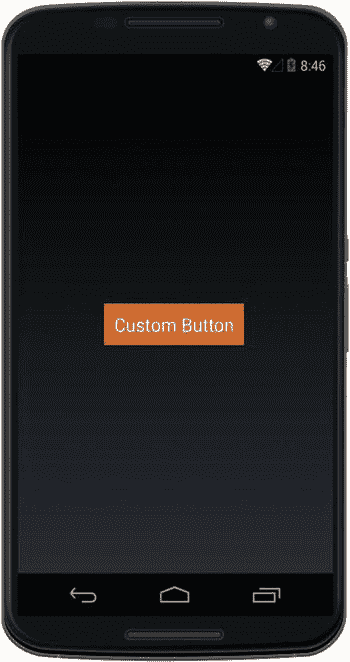
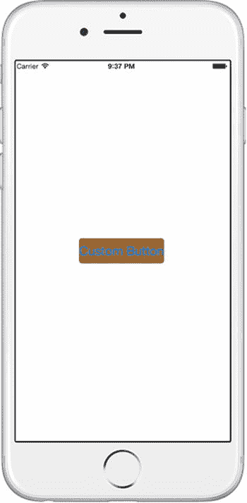
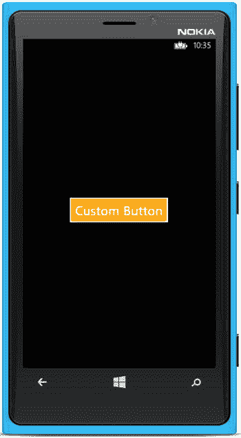

# 8.自定义渲染器

当您准备扩展 Xamarin 的功能时。表单视图超出了它们现成的功能，那么是时候开始使用定制呈现器对它们进行定制了。特定于平台的控件和布局有许多仅使用 Xamarin 无法实现的功能。形式抽象。幸运的是 Xamarin。Forms 公开了将跨平台视图转换成特定于平台的视图的机制，称为呈现器。通过创建自己的自定义渲染器，您可以完全访问每个视图中隐藏的特定于平台的特性！

自定义渲染器是 Xamarin。表单和 Xamarin 特定于平台的库。Android，以及 Windows Phone SDK。

Xamarin。表单`controls`使用两个主要组件绘制在屏幕上:元素和呈现器。在本书中，您一直在处理元素:视图、页面或 Xamarin.Forms 中定义的单元格。渲染器采用跨平台元素，并使用特定于平台的 UI 库将其绘制在屏幕上。所有的 Xamarin 屏幕都使用渲染器！例如，如果您使用 Xamarin 创建一个`Label`视图。表单，这个元素在 iOS 中使用`UILabel`，在 Android 中使用`TextView`，在 Windows Phone 中使用`TextBlock`呈现。然而，Xamarin。表单只提供了对这些特定于平台的视图的部分绑定。如果您想要访问特定于平台的元素中的所有属性和方法(比如`UILabel`、`TextView`和`TextBlock`，那么您需要创建一个定制的呈现器。

可以将自定义呈现器视为访问和扩展 Xamarin 之间绑定的一种方式。表单和特定于平台的元素。

Tip

您可以为这些元素创建自定义渲染器:`Views`、`Cells`和`Pages`。

在这一章的最后，我将列出大部分的 Xamarin。本书中涉及的表单元素，它们特定于平台的等价物，以及在定制它们时使用的渲染器。

## 何时使用自定义渲染器

什么时候可能需要使用自定义渲染器？

您可能希望对视图和 Xamarin 稍作修改。表格不能满足你。例如，你知道一个事实，iOS 在特定视图上做文本装饰或阴影，而这在 Xamarin 中是不可用的。窗体，因此您可以创建一个自定义呈现器来访问 Xamarin.iOS 控件。当需要直接访问元素的特定于平台的属性和方法时，或者当需要替换 Xamarin 时，请使用自定义控件。Forms 元素与您自己的特定于平台的自定义元素。

Note

一个 Xamarin。窗体自定义控件使用自定义渲染器来访问单个控件中的本机功能。定制控件通常是一组使用`ContentView` ( [第 3 章](03.html))合成为单个可重用组件的控件(但是您也可以使用定制渲染器创建一个定制控件，并用一组视图替换视图)。有时开发人员会说“自定义控件”来指代自定义控件。

让我们来探索如何为 Android、iOS 和 Windows Phone 创建自定义渲染器。

## 创建和使用自定义渲染器

xamarin.forms

创建自定义渲染器是为了实现自定义元素的可视化表示。创建一个从标准 Xamarin 继承的自定义元素类。表单元素，如`Button`。然后在 UI 中使用自定义元素。您可以为每个平台实现定制的呈现器，以使用该元素的特定于平台的成员，例如 Android 的`SetBackgroundColor`方法，或者 iOS 的`BackgroundColor`属性。

创建和实现定制呈现器有几个步骤，但是我将把它们分成两个任务:在 Xamarin 中准备定制元素。窗体项目，并在每个特定于平台的项目中创建自定义呈现器。

在您的 Xamarin 中准备自定义元素。创建一个元素子类，然后在您的 UI 中使用它。以下步骤只发生一次。

Use the element. Use the subclassed element, such as this `CustomButton`, in a layout in your Xamarin.Forms project.   Create an element subclass. Create an empty subclass of the element you want to customize, such as `Button`, in your Xamarin.Forms project.            `public class CustomButton : Button {}`  

使用这三个步骤在每个特定于平台的项目(iOS、Android、Windows Phone)中创建一个自定义渲染器。以下步骤在每个平台上执行一次。

Add `[assembly]`. Add the `[assembly]` attribute outside of the namespace declaration to declare the new renderer.   Add `using`. Add `using` statements to the renderer class so that the renderer types are resolved.   Create a custom renderer. Add a custom renderer class to each platform-specific project where you want to make customizations.            `public class CustomButtonRenderer : ButtonRenderer`  

这就是创建自定义渲染器的结果。

在下一个示例中，您将创建一个自定义按钮，该按钮具有针对每个平台的自定义渲染器。首先在 Xamarin 中准备您的自定义视图。移动到渲染器之前的窗体项目。

## 准备自定义元素

xamarin.forms

自定义渲染器首先需要一个自定义 Xamarin。表单元素，可以是一个`View`、`Cell`或`Page`。在本例中，您将使用自定义渲染器将按钮视图的背景颜色更改为某种橙色，因为这在使用 Xamarin 时是不可能的。撰写本文时的表单`Button`视图。自定义视图将被称为`CustomButton`，并继承自`Button`视图。

现在，让你的`CustomButton`变成橙色…

创建一个 Xamarin。形成名为`CustomRenderer`的 PCL 解决方案；然后，我将更详细地介绍这些步骤。

Use element. Use the subclassed element, such as this `CustomButton`, in a layout in your Xamarin.Forms project.   Create an element subclass. Create an empty subclass of the element you want to customize, the Xamarin.Forms `Button` in this case, and place it in `CustomButton.cs` in your Xamarin.Forms project.            `public class CustomButton : Button {}`  

在名为`Mainpage.cs`的文件中创建一个新的`ContentPage`。实例化一个`CustomButton`视图的实例，创建一个点击处理程序，并将按钮放在一个`Stacklayout`上，如清单 [8-1](#FPar3) 所示。

Listing 8-1\. Invoke the CustomButton in Mainpage.cs (in the Forms Project)

`public class MainPage : ContentPage`

`{`

`public MainPage()`

`{`

`CustomButton button = new CustomButton`

`{`

`Text = "Custom Button",`

`FontSize = Device.GetNamedSize(NamedSize.Large, typeof(Button)),`

`HorizontalOptions = LayoutOptions.Center,`

`VerticalOptions = LayoutOptions.Fill`

`};`

`button.Clicked += (sender, args) =>`

`{`

`DisplayAlert("Congratulations",`

`"This button was rendered in a platform-specific class.", "OK");`

`};`

`Content = new StackLayout`

`{`

`VerticalOptions = LayoutOptions.Center,`

`Children = {`

`button`

`}`

`};`

`}`

`}`

记住将这个`MainPage`类分配给你的`Application`构造函数的`MainPage`属性。在`StackLayout`中，您对定制视图`CustomButton`的使用与常规 Xamarin 的使用完全相同。表格`Button`视图。

## 创建自定义渲染器

既然您已经创建了一个定制元素并在您的 UI 中使用了它，那么您需要创建一个定制呈现器。您需要为您的元素确定渲染器的名称，我将在本章后面的“您定制哪个渲染器和视图？”一节中向您展示如何进行在本例中，您将使用`ButtonRenderer`。

自定义控件有两种主要方式:通过属性或替换整个控件。自定义控件的属性包括访问通过 Xamarin 不可用的平台特定的属性。窗体视图(如按钮的背景色)。一个 Xamarin。表单控件也可以完全被开发人员选择的特定于平台的控件所取代。我将在这一章中深入讨论属性定制，并在注释中提到控件替换。

以下是自定义渲染器的主要方法:

*   `OnElementChanged`:这个 main 方法在元素改变时触发，用于控件初始化。设置初始控制值及其属性。
*   `OnElementPropertyChanged`:这个方法在元素属性改变时触发，对数据绑定很有用。
*   `SetNativeControl`:手动调用此方法，用自定义的平台特定控件替换整个元素。(比如`SetNativeControl(new YourCustomizedControl());`)

以下是自定义渲染器的重要属性:

*   Control:对渲染器显示的特定于平台的元素(如`UIButton`)的引用。此处提供了特定于平台的属性。这个对象也可以用一个全新的(和定制的)特定于平台的控件来替换。
*   元素:对 Xamarin 的引用。形成子类元素(如`CustomButton`)。Xamarin。此处提供了表单元素属性。

使用`OnElementChanged`方法中的`Control`属性定制控件及其属性。

通过在`OnElementPropertyChanged`方法中从对应的`Element`属性中分配`Control`属性来实现数据绑定定制控件。

现在在每个平台上创建一个自定义渲染器。先从 Android 平台开始，然后做 iOS 和 Windows Phone。

## Android 自定义渲染器

机器人

渲染器在本机平台上实现视图。通过继承标准渲染器来创建自己的渲染器，比如`ButtonRenderer`。然后调用本机视图的特定于平台的 API，使用渲染器的`Control`属性定制视图。在`OnElementChanged`中，你将分配你的`Control`的背景颜色属性。

执行特定于平台的三个步骤中的第一个。

Create a custom renderer. Add a custom renderer class to the platform-specific project, which is `ButtonRenderer` in this case.   Tip

请参考“您定制哪个渲染器和视图？”帮助您确定要为要自定义的元素使用的渲染器和特定于平台的控件。

在 Droid 项目中将`CustomButtonRenderer.cs`创建为一个类。从`ButtonRenderer`类继承并根据需要修改`Control`属性来影响你的按钮。特定于平台的视图被分配给`Control`属性，在本例中是一个 Android `Button`控件，它的本地属性和方法是可用的。清单 [8-2](#FPar5) 显示了一个使用`SetBackgroundColor`方法设置背景颜色的 Android 渲染器。

Listing 8-2\. Customized ButtonRenderer in CustomButtonRenderer.cs (in the Droid Project)

`public class CustomButtonRenderer : ButtonRenderer`

`{`

`protected override void OnElementChanged (ElementChangedEventArgs<Button> e)`

`{`

`base.OnElementChanged (e);`

`if (Control != null) {`

`Control.SetBackgroundColor (global::Android.Graphics.Color.Chocolate);`

`}`

`}`

`}`

Tip

`OnElementChanged`是用您自己定制的特定于平台的控件替换整个控件的地方。

`if (Control != null) {`

`SetNativeControl(new YourCustomizedControl());`

`}`

Note

如果不添加特定于平台的渲染器，默认的 Xamarin。将使用窗体渲染器。

完成最后两个特定于平台的步骤。以使自定义渲染器对 Xamarin 可见。Forms 项目中，类的属性是必需的。然后添加`using`语句。

Add the `[assembly]` attribute outside of the namespace declaration to declare the new renderer.  

`[assembly: ExportRenderer (typeof (CustomButton), typeof (CustomButtonRenderer))]`

Add `using` statements to the renderer class so that the renderer types are resolved.  

`using Xamarin.Forms.Platform.Android;`

`using Xamarin.Forms;`

`using CustomRenderer;`

`using CustomRenderer.Droid;`

图 [8-1](#Fig1) 显示了结果:一个“巧克力”色的按钮看起来是橙色的。只有使用当前版本的 Xamarin.Forms 的自定义渲染器，才能设置按钮的背景色。

图 8-1。

Orange CustomButton via an Android custom renderer Tip

在这一章中，彩色是为所有黑白印刷读者准备的隐藏标题。

### 代码完成:Android 自定义渲染器

机器人

清单 [8-3](#FPar10) 、 [8-4](#FPar11) 和 [8-5](#FPar12) 包含 Android 定制按钮渲染器的完整代码清单。清单 [8-3](#FPar10) 、`CustomButton.cs`和清单 [8-4](#FPar11) 、`MainPage.cs`在 Xamarin 中。表单项目和清单 [8-5](#FPar12) ，`CustomButtonRenderer.cs`，来自同一个解决方案`CustomRenderer`中的 Droid 项目。

XAML

这个例子的 XAML 版本可以在 Apress 网站( [`www.apress.com`](http://www.apress.com/) )或者 GitHub 上的 [`https://github.com/danhermes/xamarin-book-examples`](https://github.com/danhermes/xamarin-book-examples) 找到。Xamarin。第八章为`CustomRenderer.Xaml`的表格解决方案。

Listing 8-3\. CustomButton.cs

`public class CustomButton : Button {}`

Listing 8-4\. MainPage.cs

`public class MainPage : ContentPage`

`{`

`public MainPage()`

`{`

`CustomButton button = new CustomButton`

`{`

`Text = "Custom Button",`

`FontSize = Device.GetNamedSize(NamedSize.Large, typeof(Button)),`

`HorizontalOptions = LayoutOptions.Center,`

`VerticalOptions = LayoutOptions.Fill`

`};`

`button.Clicked += (sender, args) =>`

`{`

`DisplayAlert("Congratulations",`

`"This button was rendered in a platform-specific class.", "OK");`

`};`

`Content = new StackLayout`

`{`

`VerticalOptions = LayoutOptions.Center,`

`Children = {`

`button`

`}`

`};`

`}`

`}`

Listing 8-5\. CustomButtonRenderer.cs (Droid Project)

`using Xamarin.Forms.Platform.Android;`

`using Xamarin.Forms;`

`using CustomRenderer;`

`using CustomRenderer.Droid;`

`[assembly: ExportRenderer (typeof (CustomButton), typeof (CustomButtonRenderer))]`

`namespace CustomRenderer.Droid`

`{`

`public class CustomButtonRenderer : ButtonRenderer`

`{`

`protected override void OnElementChanged (ElementChangedEventArgs<Button> e)`

`{`

`base.OnElementChanged (e);`

`if (Control != null) {`

`Control.SetBackgroundColor (global::Android.Graphics.Color.Chocolate);`

`}`

`}`

`}`

`}`

现在我们将在 iOS 中做一个橙色按钮。

## iOS 自定义渲染器

我是操作系统

为`Button`视图创建一个 iOS 渲染器类似于创建一个 Android 渲染器。创建一个从标准渲染器继承的自定义渲染器，比如`ButtonRenderer`。然后调用本机视图的特定于平台的 API，使用渲染器的`Control`属性对其进行定制。在`OnElementChanged`中，你将分配你的`Control`的背景颜色属性。

从特定于平台的第一步开始。

Create a custom renderer. Create `CustomButtonRenderer.cs` as a class in the iOS project. Inherit from the `ButtonRenderer` class and modify the `Control` property to affect your button as needed. The platform-specific view is assigned to the `Control` property, in this case an iOS `UIButton` control, and its native properties and methods are available. Listing [8-6](#FPar13) shows an iOS renderer where the background color is set using the `UIButton's BackgroundColor` property.   Listing 8-6\. Customized ButtonRenderer in CustomButtonRenderer.cs (iOS Project)

`public class CustomButtonRenderer : ButtonRenderer`

`{`

`protected override void OnElementChanged (ElementChangedEventArgs<Button> e)`

`{`

`base.OnElementChanged (e);`

`if (Control != null) {`

`Control.BackgroundColor = UIColor.Brown;`

`}`

`}`

`}`

接下来，执行最后两步。以使自定义渲染器对 Xamarin 可见。Forms 项目，需要在类上添加一个属性和两个`using`语句。

Add `[assembly]`. Add the `[assembly]` attribute outside of the namespace declaration to declare the new renderer.  

`[assembly: ExportRenderer (typeof (CustomButton), typeof (CustomButtonRenderer))]`

Add `using` statements to the renderer class so that the renderer types are resolved.  

`using Xamarin.Forms.Platform.iOS;`

`using Xamarin.Forms;`

`using UIKit;`

`using CustomRenderer;`

`using CustomRenderer.iOS;`

图 [8-2](#Fig2) 显示了结果:另一个橙色按钮(橙棕色)，只有在使用当前版本的 Xamarin.Forms 的自定义渲染器时才有可能。

图 8-2。

Orange CustomButton via an iOS custom renderer

### 代码完成:iOS 自定义渲染器

我是操作系统

清单 [8-7](#FPar14) 显示了 iOS 定制按钮渲染器的完整代码清单。这与 Xamarin 中的列表 [8-3](#FPar10) 和 [8-4](#FPar11) 相匹配。表单项目。

Listing 8-7\. CustomButtonRenderer.cs for the iOS Project

`using Xamarin.Forms.Platform.iOS;`

`using Xamarin.Forms;`

`using UIKit;`

`using CustomRenderer;`

`using CustomRenderer.iOS;`

`[assembly: ExportRenderer (typeof (CustomButton), typeof (CustomButtonRenderer))]`

`namespace CustomRenderer.iOS`

`{`

`public class CustomButtonRenderer : ButtonRenderer`

`{`

`protected override void OnElementChanged (ElementChangedEventArgs<Button> e)`

`{`

`base.OnElementChanged (e);`

`if (Control != null) {`

`Control.BackgroundColor = UIColor.Brown;`

`}`

`}`

`}`

`}`

现在让我们将 Windows Phone 中的按钮设置为橙色。

## Windows Phone 自定义渲染器

窗子

Windows Phone 自定义渲染器也是一个渲染器类，继承自带有`[assembly]`标记和特定于平台的视图实现的标准渲染器。下面是定制`Button`视图渲染器的细节。

Note

以下 Windows Phone 自定义呈现器是使用 Silverlight API 而不是 WinRT 制作的。WinRT 名称空间略有不同，但方法是相同的。

像往常一样，从自定义渲染器开始:

Create a custom renderer. Create `CustomButtonRenderer.cs` as a class in the WinPhone project. Inherit from the `ButtonRenderer` class and modify the `Control` property to affect your button as needed. The platform-specific view is assigned to the `Control` property, in this case a Windows Phone `Button` control, and its native properties and methods are made available. Listing [8-8](#FPar16) shows a Windows Phone renderer where the background color is set using the Button’s `Background` property.   Listing 8-8\. Customized ButtonRenderer in CustomButtonRenderer.cs (WinPhone Project)

`public class CustomButtonRenderer : ButtonRenderer`

`{`

`protected override void OnElementChanged(ElementChangedEventArgs<Button> e)`

`{`

`base.OnElementChanged(e);`

`if (e.OldElement == null)`

`{`

`var customButton = (System.Windows.Controls.Button)Control;`

`customButton.Background = new SolidColorBrush(Colors.Orange);`

`}`

`}`

`}`

Note

在 null 检查中，使用了`OldElement`属性，而不是 Windows Phone 上的`Control`。

Note

对于 WinRT，用`Windows.UI.Xaml`代替`System.Windows`。

现在完成最后两个步骤。添加`[assembly]`属性，使定制渲染器对 Xamarin 可见。表单项目然后添加`using`语句。

Add `[assembly]`. Add the `[assembly]` attribute outside of the namespace declaration to declare the new renderer.  

`[assembly: ExportRenderer (typeof (CustomButton), typeof (CustomButtonRenderer))]`

Add `using` statements to the renderer class so that the renderer types are resolved.  

`using System;`

`using System.Windows.Media;`

`using Xamarin.Forms.Platform.WinPhone;`

`using Xamarin.Forms;`

`using CustomRenderer;`

`using CustomRenderer.WinPhone;`

Note

以下是 WinRT `using`语句。

`using Windows.UI;`

`using Windows.UI.Xaml.Media;`

`using Xamarin.Forms;`

`using Xamarin.Forms.Platform.WinRT;`

图 [8-3](#Fig3) 显示了一个 Kool-Aid 橙色按钮，这次是在 Windows Phone 上。

图 8-3。

Orange CustomButton via a Windows Phone custom renderer

### 代码完成:Windows Phone 自定义渲染器

窗子

清单 [8-9](#FPar20) 显示了 Windows Phone 自定义按钮渲染器的完整代码清单。这与 Xamarin 中的列表 [8-3](#FPar10) 和 [8-4](#FPar11) 相匹配。表单项目。

Listing 8-9\. CustomButtonRenderer.cs for the WinPhone Project

`using System;`

`using System.Windows.Media;`

`using Xamarin.Forms.Platform.WinPhone;`

`using Xamarin.Forms;`

`using CustomRenderer;`

`using CustomRenderer.WinPhone;`

`[assembly: ExportRenderer(typeof(CustomButton), typeof(CustomButtonRenderer))]`

`namespace CustomRenderer.WinPhone`

`{`

`public class CustomButtonRenderer : ButtonRenderer`

`{`

`protected override void OnElementChanged(ElementChangedEventArgs<Button> e)`

`{`

`base.OnElementChanged(e);`

`if (e.OldElement == null)`

`{`

`var customButton = (System.Windows.Controls.Button)Control;`

`customButton.Background = new SolidColorBrush(Colors.Orange);`

`}`

`}`

`}`

`}`

这就是如何在所有三种移动操作系统平台上构建自定义渲染器的方法！

构建自定义渲染器的第一个技巧是弄清楚渲染器的名称和本机元素名称。这里有一个快速指南来帮助你。

## 你定制哪个渲染器和视图？

xamarin.forms

表 [8-1](#Tab1) 显示了大部分 Xamarin。本书中涉及的表单元素，它们的呈现器，以及它们可以定制的特定于平台的等效物。

表 8-1。

Elements, Their Renderers, and Platform-Specific Elements

<colgroup><col> <col> <col> <col> <col></colgroup> 
| Xamarin。形式 | 渲染器 | 机器人 | ios | windows 手机 |
| --- | --- | --- | --- | --- |
| [第二章](02.html) |   |   |   |   |
| `ContentPage` | `PageRenderer` | `ViewGroup` | `UIView` | `Panel` |
| `Label` | `LabelRenderer` | `TextView` | `UILabel` | `TextBlock` |
| `Button` | `ButtonRenderer` | `Button` | `UIButton` | `Button` |
| `Entry` | `EntryRenderer` | `EditText` | `UITextField` | `PhoneTextBox` |
| `Image` | `ImageRenderer` | `ImageView` | `UIImageView` | `Image` |
| `BoxView` | `BoxRenderer, BoxViewRenderer(WP)` | `ViewGroup` | `CGContext` | `Rectangle` |
| `ScrollView` | `ScrollViewRenderer` | `ScrollView` | `UIScrollView` | `ScrollViewer` |
| [第三章](03.html) |   |   |   |   |
| `Frame` | `FrameRenderer` | `Drawable` | `UIView` | `UIElement` |
| [第四章](04.html) |   |   |   |   |
| `Picker` | `PickerRenderer` | `TextView, AlertDialog, NumberPicker` | `UIPickerView, UIPickerViewModel, UIToolBar, UIBarButtonItems, UITextField` | `ListPicker` |
| `DatePicker` | `DatePickerRenderer` | `TextView, AlertDialog` | `UIDatePicker, UIToolbar, UITextField, UIBarButtonItems` | `DateTimePickerBase` |
| `TimePicker` | `TimePickerRenderer` | `TextView, AlertDialog` | `UIDatePicker, UIToolbar, UITextField, UIBarButtonItems` | `DateTimePickerBase` |
| `Stepper` | `StepperRenderer` | `LinearLayout, Button` | `UIStepper` | `Border, Button` |
| `Slider` | `SliderRenderer` | `SeekBar` | `UISlider` | `Slider` |
| `Switch` | `SwitchRenderer` | `Switch` | `UISwitch` | `ToggleButton` |
| [第五章](05.html) |   |   |   |   |
| `ListView` | `ListViewRenderer` | 尚不可用 | `UITableView` | `LongListSelector` |
| `TextCell` | `TextCellRenderer` | `LinearLayout, TextView, ImageView` | `UITableViewCell` | `DataTemplate` |
| `EntryCell` | `EntryCellRenderer` | `LinearLayout, TextView, EditText` | `UITableViewCell, UITextField` | `DataTemplate` |
| `SwitchCell` | `SwitchCellRenderer` | `Switch` | `UITableViewCell, UISwitch` | `DataTemplate` |
| `ImageCell` | `ImageCellRenderer` | `TextView, ImageView` | `UITableViewCell, UIImage` | `DataTemplate` |
| [第六章](06.html) |   |   |   |   |
| `NavigationPage` | `NavigationRenderer, NavigationPageRenderer(WP)` | 没有带`View`页的 | `UINavigationController, UIToolbar` | 没有带`FrameworkElements`的 |
| `MasterDetailPage` | `MasterDetailRenderer, TabletMasterDetailRenderer(iPad)` | `DrawerLayout` | `custom(iPhone), UISplitViewController(iPad)` | `Panel` |
| `TableView` | `TableViewRenderer, TableViewModelRenderer(A)` | `ListView, View` | `UITableView` | `LongListSelector` |
| `TabbedPage` | `TabbedRenderer, TabbedPageRenderer(WP)` | 没有带`View`页的 | `UIViewController, UIView` | `Pivot` |
| `CarouselPage` | `CarouselPageRenderer` | `View` | `UIScrollView` | `PanoramaItem` |

(A) = Android

(WP) = Windows 手机

Xamarin。在撰写本文时，forms`Layout`renderer 还没有被公开用于定制。

表 [8-1](#Tab1) 中列出的 Windows Phone 类来自 Silverlight API，许多(不是全部)在 WinRT 中没有改变。

这应该足以让您开始使用自定义渲染器。

## 摘要

自定义渲染器完成了 Xamarin。形成图片，扩展 Xamarin 的范围。使用 Xamarin.iOS、Xamarin 深入特定于平台的 API。Android 和 Windows Phone SDK。Xamarin。表单抽象作为跨平台工具提供了不可估量的价值，但是平台确实不同，开发人员需要一种方法来弥合这一差距。自定义渲染器是桥梁。

是时候公开你正在阅读的这本书的设计了(尽管我相当肯定你已经想到了这一点):

整本书都是围绕 Xamarin 构建的。表单以及如何使用自定义呈现器扩展它。这也是为什么如此多的章节以 Xamarin 开头的部分原因。表单方法，然后继续使用 Android 和 iOS 的等效方法。

出于这个原因，这一章的自定义渲染器是你现在的弓。一个橙色的大蝴蝶结。希望你已经发现这个礼物是有用的，因为它即将结束。

如果你还记得 Xamarin。在[第 2 章](02.html)中的表单与特定于平台的实现讨论中，您现在应该对着手构建 Xamarin 应用程序时要做出的决定以及使用 Xamarin 可帮助您完成的选项有了全面的了解。表格，Xamarin。Android，和 Xamarin.iOS。

自定义渲染器是 Xamarin 中特定于平台的 UI 中使用的主要方法。表单应用程序。然而，有许多其他方法可以在数据访问层、业务逻辑和其他非 UI 功能中分割特定于平台的代码。这将把您带到 Xamarin 应用程序架构。

在下一章，也是最后一章，你将会看到如何构建跨平台的应用。