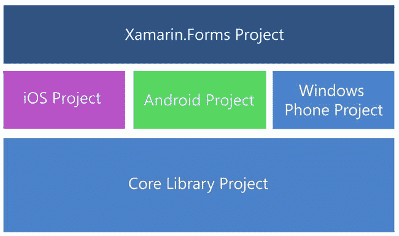
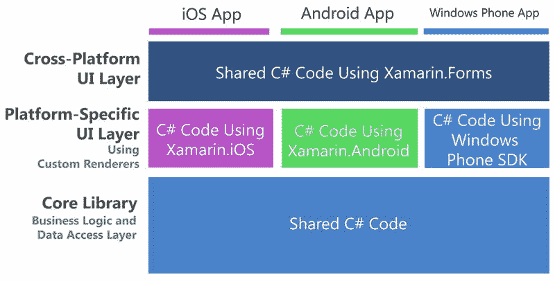
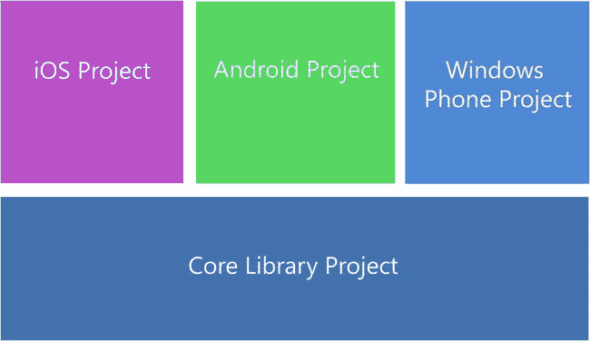
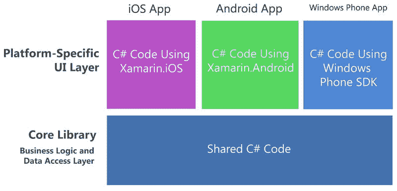
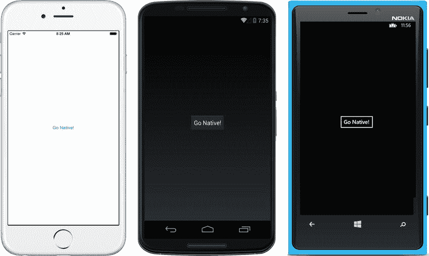
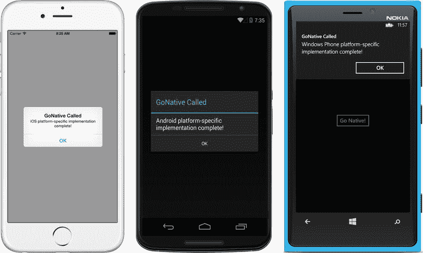

# 九、跨平台架构

在本书的开头，我提到了移动开发的独角兽:一次编写，随处部署。在寻找这只独角兽的过程中，可能吸引这只野兽出现的淑女是跨平台设计。

Xamarin 平台的整体已经提供了跨平台设计的基础，但是您可以通过理解和仔细实现跨平台架构来推进这项事业。

什么是跨平台架构？

它始于两种代码。

## 共享代码和平台特定代码

Xamarin 应用可以分为两种类型的代码:

*   共享代码:app 解决方案中所有平台使用；也称为跨平台代码。
*   特定于平台的代码:由 app 解决方案中的一个 OS 平台使用，如 iOS 或 Android，但不能同时由两者使用。

有许多方法可以将应用解决方案划分为共享代码和特定于平台的代码。它可以由项目自顶向下完成，也可以使用单独的代码行自底向上完成；然后还有使用特定文件或类的中间方法。许多好的应用在所有这些层次上都被分成共享的和特定于平台的代码。

自上而下分割应用的可用选项有可移植类库(PCL)、可编译成供多个平台使用的单个 DLL 的项目，以及在不同平台上下文中重新编译的共享项目。自下而上的选项包括条件编译，这是围绕共享项目中的小代码块的特定于平台的编译界限。条件编译在 PCL 中不可用，因为 DLL 是预编译的，所以可以使用依赖注入(DI)来创建针对公共接口的特定于平台的类。第 8 章中的[介绍的定制渲染器使用 DI 在 Xamarin 中分离出特定于平台的 UI 类。表单解决方案。文件链接用于在项目之间共享特定文件。](08.html)

所有这些技术都用于解决跨平台应用中特定于平台的差异问题，这被称为分歧。

## 处理分歧

分歧描述了在跨平台应用中对平台特定实现的需求，因为平台特定的差异导致它们的实现与解决方案中的主代码不同。示例包括 Xamarin 中的自定义渲染器。当特定于平台的 UI 偏离跨平台方法时，以及当在核心库中实现的网络或推送通知达到需要本地 OS API 访问的点时，形成应用。

以下是在不同粒度级别处理跨平台应用中的差异的主要技术。

*   在项目级别，使用特定于平台的项目。
*   在文件级别，使用文件链接，有时使用部分类或方法。
*   在类级别，在 PCL 中使用依赖注入。在共享项目中，您有更多的选择，包括 DI、分部类和条件编译。
*   在方法级别，使用分部方法。
*   在代码级别，对特定于平台的单独代码行使用条件编译。

由于它们的封装性质，PCL 只能使用前面的几种技术，而不需要为每个平台重新编译新的 DLL:特定于平台的项目和依赖注入。不建议为每个平台实现重新编译跨平台的 PCL DLL。如果必须重新编译，请考虑使用共享项目。共享项目可以使用前面提到的所有技术，因为它们被设计为可以为每个平台重新编译。我很快会说更多关于 PCL 和共享项目的内容。

Tip

由于平台版本之间的差异，例如 Android API 或 iOS 发布版本，单个平台内部也存在差异。版本差异可以包括屏幕尺寸或 API 中被添加或被否决的特征之间的差异。

这些技术导致了 Xamarin 跨平台应用的一些标准架构，您现在将看到这些架构。承认架构与解决方案结构重叠但不相同，让我们从 Xamarin 开始。表单解决方案。

## Xamarin。表单解决方案架构

Xamarin。表单应用有一个基础解决方案模式，在第 2 章中提到过。这些是主要项目。

*   Xamarin。表单:PCL 或共享项目中的跨平台 UI 代码，由特定于平台的项目之一调用。
*   Xamarin。Android: Android 专用代码，包括 Android 项目启动。
*   Xamarin.iOS: iOS 专用代码，包括 iOS 项目启动。
*   Windows Phone 应用:特定于 Windows Phone 的代码，包括 Windows Phone 项目启动。
*   核心库:使用 PCL 或共享项目的共享代码，如业务逻辑层(BLL)和 DAL。(在小型或原型应用中，核心库可能不是必需的，因为共享代码可以驻留在 Xamarin 中。表单项目。)

除了核心库之外，所有这些项目都可以由项目模板自动创建，核心库必须在需要时手动添加。图 [9-1](#Fig1) 显示了相关项目。

图 9-1。

Xamarin.Forms solution projects

图 9-2 显示了查看 Xamarin 的另一种方式。形成包括应用和架构层轴的解决方案。

图 9-2。

Xamarin.Forms solution architecture of iOS, Android, and Windows Phone apps

在 Xamarin 中有两种类型的共享代码。表单解决方案:Xamarin 中的共享 UI 代码。表单项目和核心库项目中的 DAL 和 BLL。

特定于平台的项目(Xamarin。Android、Xamarin.iOS 和 Windows Phone)存放启动代码、自定义呈现器和其他特定于平台的功能，如服务、通知、传感器或网络。在 Xamarin。表单解决方案中，大部分 UI 都放在 Xamarin 中。窗体项目，并且只有在有自定义呈现器的平台特定的项目中。特定于平台的项目在项目级别处理分歧。

Note on Windows Phone Projects

创造一个 Xamarin。如果没有安装 Windows Phone SDK，Windows 上的窗体解决方案将不会创建 Windows Phone 项目。无法使用 Mac 开发 Windows Phone 应用。Xamarin Studio 不支持创建 Windows Phone 项目，这些项目必须在 Visual Studio 中创建。

关于 iOS 项目创建 Xamarin 的说明。Windows 计算机上的 Forms 解决方案将创建一个 iOS 项目，但如果没有 Mac 构建主机，它将无法使用。

完全特定于平台的解决方案将大部分或全部 UI 保留在特定于平台的项目中。

## 特定于平台的解决方案架构

特定于平台的应用有一个看起来类似于 Xamarin 的基础解决方案。形成溶液，减去 Xamarin。Forms 项目，所有特定于平台的项目都包含更多的代码。下面是一个典型的特定于平台的解决方案中的项目。

*   Xamarin。Android: Android 专用代码。
*   Xamarin.iOS: iOS 特定代码。
*   Windows Phone 应用:Windows Phone 特定代码。
*   核心库:使用 PCL 或共享项目的共享应用逻辑，如 BLL 和 DAL。(对于没有核心库的轻量级解决方案，您可以使用文件链接将驻留在单个平台的项目中的共享代码连接到其他平台的每个项目。)

图 [9-3](#Fig3) 显示了针对特定平台解决方案的 Xamarin 项目。

图 9-3。

Xamarin projects in a platform-specific solution

图 [9-4](#Fig4) 展示了另一种看待平台特定解决方案的方式，包括应用和架构层轴。

图 9-4。

Xamarin solution architecture for Xamarin.iOS, Xamarin.Android, and Windows Phone apps

这里特定于平台的项目(除核心库之外的所有项目)在项目级别处理分歧。在许多情况下，一次只能创建一个。比如先写一个 app 的 iOS 版本，再写 Android 版本。这是一种构建应用的有用方式，因为核心库可以在单一平台上测试，UI 可以在添加第二个或第三个平台之前完全在一个平台上完成。

MVVM and MVC

Xamarin。Forms 很好地模仿了 MVVM 模式，内置了数据绑定(如第 7 章中所讨论的)。对于拥有特定平台应用的 MVVM，有开源选项，如 MvvmCross 和 MVVM 之光。MvvmCross 和 MVVM 光都可以与 Xamarin.Forms 一起使用。但是，MvvmCross 的许多功能与 Xamarin 重叠。形式，在一起使用时提供递减的回报。

关于特定于平台的解决方案中的 MVC，Xamarin 应用在很大程度上是 MVC 式的。您可以手工创建数据模型(MVC 中的 M ),这些数据模型作为数据源绑定到字段和列表。XML 布局组成视图(MVC 中的 V)，Android `Activities`和 iOS `UIViewControllers`可以充当控制器；然而，由于本机 OS UI 架构，视图和控制器之间的界限可能有些模糊。尽管 iOS 被吹捧为基于 MVC，但如果你习惯了 ASP.NET MVC 解决方案中的严格关注点分离(SOC ),你可能会发现 iOS 的 MVC 思想被淡化了。由于故事板生成的`UIViews`主要定义屏幕的静态方面，定义动态内容的逻辑被下推到`UIViewController`(控制器，或 MVC 中的 C)。故事板生成的`UIView`的大部分内容都和视图一样。aspx 文件是在 ASP.NET MVC 发布之前的，也就是说，一点也不像视图。在原生移动开发中没有 Razor 的等价物(尽管使用 Razor 在 Xamarin 中构建 HTML 模板)。安卓开发也是如此。布局 XML 文件主要创建静态布局，并将向页面填充动态内容的工作留给了`Activity`，后者可能会与业务逻辑纠缠在一起。Xamarin 的任务是提供对这些 API 的直接访问，而不是改变它们的基本模式。因此，对于我们中的许多人来说，iOS 和 Android 开发在架构上将从更严格的 MVC 后退一步。

然而，拥有这种知识就是力量。您可以在自己的应用中加入 SOC。您可以使用您的`UIViewControllers`和`Activities`来保存主要与视图相关的逻辑，并将业务逻辑分离到您自己构造的真正控制器中。不要让工具集拖了你的后腿。毕竟，这就是上课的目的。这就是用 C# 做这些事情的好处！

## 核心库

核心库是您的解决方案中的一个专用项目，DAL、BLL 和其他非 UI 平台无关的代码可以驻留在其中。企业使用核心库进行专业级代码分离，将表示层从 BLL 和 DAL 中分离出来，并促进团队开发。核心库对于一些原型应用、小项目或小团队来说是不必要的。核心库项目中的所有内容都可以放在 Xamarin 中。窗体项目来简化解决方案。

Tip

如果你刚开始服用 Xamarin。表单，请考虑将数据访问、业务逻辑和共享代码放在 Xamarin 中。Forms UI 项目，暂时不使用核心库。您可以使用 Xamarin 中的文件夹。Forms 项目来组织您的非 UI 代码(例如，/data，/utilities 等。)如果你刚开始使用特定平台的应用，你可以使用文件链接(在本章后面解释)作为核心库的轻量级替代。

在大型和/或企业级应用中，非 UI 共享代码应该放在核心库项目中，与 UI 项目分开。核心库通常使用 PCL 或共享项目来实现。下面是您可以放入核心库中的内容:

*   DAL:数据访问层，可能包括 SQLite 访问、数据模型、视图模型、存储库、云数据访问和 web 服务。参见[第七章](07.html)。
*   BLL:跨越平台且独立于平台的业务逻辑。
*   杂项:工具、接口、跨平台资源和各种必需品。核心库是跨平台的非 UI 文件、文件夹和类的集合。

简而言之，将独立于平台的非 UI 代码放在核心库中。

如果核心库组件变得不可共享，那么将它们转移到特定于平台的项目中是很自然的。有相当多的功能，例如某些类型的本地文件访问或操作系统服务，它们是特定于平台的功能，必须放在特定于平台的项目中。如果核心库中只有几行代码需要特定于平台，那么可以在共享项目中使用条件编译，或者在 PCL 中使用依赖注入。文件链接在共享项目中也是一个有用的选项，用于创建带有特定于平台的文件的分部类。稍后会有更多内容。

有时使用共享库来创建核心库，或者，不太常见的是，在特定于平台的应用中使用文件链接来创建核心库，而不是创建专用的核心库项目(通常通过将特定于平台的项目中的 BLL 或 DAL 文件共享给所有其他特定于平台的项目)。越来越多的核心库和 Xamarin。窗体项目使用 PCL。

## 可移植类库(PCL)

PCL 是代码项目，它提供 .NET 框架基于目标平台的选择，如 Xamarin。Android 和 Xamarin.iOS(或者 .NET 4.5 甚至 Xbox！).PCL 可以一次编译成一个 DLL，然后在所有目标平台上运行，因此它们是跨平台代码共享的理想选择。

解决方案中的共享代码——如 Xamarin。表单项目、业务逻辑或数据访问代码—可以编译成 PCL DLL，用于特定于平台的项目或其他解决方案。由于其解耦的本质，当 PCL 被分发给其他开发人员而不是由一个开发人员使用时，它特别有用。

在“添加新项目”屏幕上，通过选择“可移植类库”选项，在 Visual Studio 中创建 PCL。在 Xamarin Studio 的“新建项目”屏幕上，选择“可移植库”选项。

在 Visual Studio 或 Xamarin Studio 中，PCL 是在编译时使用配置文件配置的，以特定平台为目标。配置文件被配置为允许 PCL 与 Xamarin.iOS，Xamarin 一起运行。Android 或 Windows phone，以及其他平台。PCL 允许您瞄准这些平台:

*   微软 .NET 框架
*   开发
*   windows 手机
*   。用于 Windows 应用商店应用的. NET
*   巫师安卓系统
*   洗发精，快
*   微软游戏机

PCL 为解决方案中的共享代码提供了一个方便的、分离的组件。使用 PCL 的代价是，一旦 DLL 被编译，特定于平台的定制需要一点额外的工作。

Important Note

在 PCL 中，不能添加或链接文件，也不能对特定于平台的实现使用分部类、分部方法或条件编译。

因为构建 PCL 是为了避免重新编译，所以特定于平台的定制通常在特定于平台的项目中使用依赖注入在 PCL 之外完成。

## 依赖注入

依赖注入(DI)是一种设计原则，它帮助开发人员使用控制反转(IoC)将特定于平台的功能包含到跨平台的类中。IoC 模式是对应用提供的通用类的特定实现的框架调用。DI 通过将实现传递给构造器/设置器来实现这一点。

DI 对于特定于平台的功能非常有用，比如定制渲染器、文件处理、后台服务和传感器。在你的共享代码中(通常是一个 PCL，但是也可以在一个共享的项目或文件中工作)，创建一个接口来定义在每个平台中实现的方法和模式。在每个平台特定的项目中实现基类的平台特定的子类。然后您可以将这些特定于平台的实现注入到您的共享代码中。DI 处理类级别的分歧。

有几种方法可以实现 DI 设计原则，包括接口、抽象类和继承。内置于 Xamarin。Forms 是名为`DependencyService`的阿迪实现，它使用接口实现 DI。

Note

DI 是实现四人帮(g of)策略和/或桥接模式的一种方式。微软在 Windows Presentation Foundation(WPF)中对此进行了补充，并称之为提供者模式。Xamarin。Forms 实现了`DependencyService`中提供者模式的变体。

### 使用 DependencyService

Xamarin。Forms 提供了一个名为`DependencyService`的内置 DI 实现，它允许您创建一个基本接口，然后构建特定于平台的实现类，以便在共享代码中调用。这包括三个步骤:

Interface: An interface in the shared code declares the class for platform-specific implementation.   Implementation: Platform-specific implementations of the interface are registered using [assembly] tags.   Invocation: The platform-specific code is invoked from the shared code using `DependencyService.Get<InterfaceName>.MethodName`.  

让我们看一个例子，它将一个简单的字符串传递给一个定制类，将操作系统的名称连接到开头，并将该字符串返回给共享代码调用者。

我将从接口开始。

#### 创建界面

使用`DependencyService`首先需要一个您想要实现的功能的接口。接口有助于创建一个一致的体系结构，用特定于平台的实现来指定跨平台的特性集。

用一个`GoNative`方法为你的跨平台类`ICustomClass`创建一个接口。

`public interface ICustomClass`

`{`

`string GoNative(string param);`

`}`

第二步是创建特定于平台的实现。

Important Note

记住在所有特定于平台的项目中提供接口的实现。为了解析引用，`DependencyService.Get`方法需要这样做；否则，运行时将抛出一个`NullReferenceException`错误。

先说安卓。

#### Android 实现

机器人

在您的 Android 项目中，创建一个名为`CustomClass_Android.cs`的特定于平台的`ICustomClass`实现。这个版本的`CustomClass.GoNative`返回值`"Android"`。

`class CustomClass_Android : ICustomClass`

`{`

`public CustomClass_Android() { }`

`public string GoNative(string param)`

`{`

`return "Android " + param;`

`}`

`}`

在`CustomClass_Android`和名称空间声明上方的`DependencyService`中注册要使用的类。

`[assembly: Xamarin.Forms.Dependency(typeof(CustomClass_Android))]`

记得引用当前项目来解析`CustomClass_Android`。

`using DependencyServiceExample.Android;`

现在来看看 iOS 的实现。

#### iOS 实现

我是操作系统

在 iOS 项目中，创建一个名为`CustomClass_iOS.cs`的`CustomClass`的特定于平台的实现。这个版本的`CustomClass.GoNative`返回值`"iOS"`。

`class CustomClass_iOS : ICustomClass`

`{`

`public CustomClass_iOS() { }`

`public string GoNative(string param)`

`{`

`return "iOS " + param;`

`}`

`}`

在`CustomClass_Android`和名称空间声明上方的`DependencyService`中注册要使用的类。

`[assembly: Xamarin.Forms.Dependency(typeof(CustomClass_iOS))]`

记得引用当前项目来解析`CustomClass_iOS`。

`using DependencyServiceExample.iOS; And next is the Windows Phone version.`

接下来是 Windows Phone 版本。

#### Windows Phone 实现

windows 手机

最后，在您的 Windows Phone 项目中，创建一个名为`CustomClass_WindowsPhone.cs`的特定于平台的`CustomClass`实现。这个版本的`CustomClass.GoNative`返回值`"Windows Phone"`。

`class CustomClass_WindowsPhone : ICustomClass`

`{`

`public CustomClass_WindowsPhone () { }`

`public string GoNative(string param)`

`{`

`return "Windows Phone " + param;`

`}`

`}`

在`CustomClass_WindowsPhone`和名称空间声明上方的`DependencyService`中注册要使用的类。

`[assembly: Xamarin.Forms.Dependency(typeof(CustomClass_WindowsPhone))]`

记得引用当前项目来解析`CustomClass_WindowsPhone`。

`using DependencyServiceExample.WinPhone;`

现在，您将在共享代码中使用这些特定于平台的实现。

#### 调用特定于平台的类

在共享项目或 PCL 中调用特定于平台的实现。

`var text = DependencyService.Get<ICustomClass>()`

`.GoNative("platform-specific implementation complete!");`

在主页上创建一个按钮，并在按钮的`Clicked`事件中使用这个 DI 调用。

`class MainPage : ContentPage`

`{`

`public MainPage()`

`{`

`var button = new Button`

`{`

`Text = "Go Native!",`

`VerticalOptions = LayoutOptions.CenterAndExpand,`

`HorizontalOptions = LayoutOptions.CenterAndExpand,`

`};`

`button.Clicked += (sender, e) =>`

`{`

`var text = DependencyService.Get<ICustomClass>()`

`.GoNative("platform-specific implementation complete!");`

`DisplayAlert("GoNative Called", text, "OK");`

`};`

`Content = button;`

`}`

`}`

图 [9-5](#Fig5) 显示等待调用`CustomClass.GoNative`的按钮。

图 9-5。

Button ready to call platform-specific implementations using DependencyService

当点击按钮时，`DependencyService`调用`ICustomClass`实现的平台特定的`GoNative`方法，传入文本`"platform-specific implementation complete!"`。注册的平台特定版本的`CustomClass`获取文本参数，在传入的文本字符串的开头添加操作系统的名称，并在共享代码中将其返回给调用类。然后调用类在一个`DisplayAlert`中显示整个字符串，如图 [9-6](#Fig6) 所示。

图 9-6。

Platform-specific implementations of CustomClass Tip

实现依赖注入的其他方法包括抽象类和继承。

#### 代码完成:使用 DependencyService

清单 [9-1](#FPar10) 、 [9-2](#FPar11) 、 [9-3](#FPar12) 、 [9-4](#FPar13) 和 [9-5](#FPar14) 包含了这个`DependencyService`示例的完整代码。清单 [9-1](#FPar10) 包含了接口。清单 [9-2](#FPar11) 包含使用`DependencyService`对特定于平台的`CustomClass.GoNative`实现的标注。清单 [9-3](#FPar12) 、 [9-4](#FPar13) 和 [9-5](#FPar14) 包含了`ICustomClass`的特定于操作系统的实现。

这个例子可以在`DependencyServiceExample`解决方案的可下载代码中找到。

Listing 9-1\. The Interface Resides in CustomClass.cs in the Xamarin.Forms Project

`public interface ICustomClass`

`{`

`string GoNative(string param);`

`}`

Listing 9-2\. The DependencyService Callout Is in MainPage.cs in the Xamarin.Forms Project

`class MainPage : ContentPage`

`{`

`public MainPage()`

`{`

`var button = new Button`

`{`

`Text = "Go Native!",`

`VerticalOptions = LayoutOptions.CenterAndExpand,`

`HorizontalOptions = LayoutOptions.CenterAndExpand,`

`};`

`button.Clicked += (sender, e) =>`

`{`

`var text = DependencyService.Get<ICustomClass>()`

`.GoNative("platform-specific implementation complete!");`

`DisplayAlert("GoNative Called", text, "OK");`

`};`

`Content = button;`

`}`

`}`

Listing 9-3\. The Android Implementation Is in CustomClass_Android.cs in the Android Project

`using System;`

`using DependencyServiceExample.Droid;`

`[assembly: Xamarin.Forms.Dependency(typeof(CustomClass_Android))]`

`namespace DependencyServiceExample.Droid`

`{`

`class CustomClass_Android : ICustomClass`

`{`

`public CustomClass_Android() { }`

`public string GoNative(string param)`

`{`

`return "Android " + param;`

`}`

`}`

`}`

Listing 9-4\. The iOS Implementation Is in CustomClass_iOS.cs in the iOS Project

`using System;`

`using DependencyServiceExample.iOS;`

`[assembly: Xamarin.Forms.Dependency(typeof(CustomClass_iOS))]`

`namespace DependencyServiceExample.iOS`

`{`

`class CustomClass_iOS : ICustomClass`

`{`

`public CustomClass_iOS() { }`

`public string GoNative(string param)`

`{`

`return "iOS " + param;`

`}`

`}`

`}`

Listing 9-5\. The Windows Phone Implementation Is in CustomClass_WindowsPhone.cs in the Windows Phone Project

`using System;`

`using DependencyServiceExample.WinPhone;`

`[assembly: Xamarin.Forms.Dependency(typeof(CustomClass_WindowsPhone))]`

`namespace DependencyServiceExample.WinPhone`

`{`

`class CustomClass_WindowsPhone : ICustomClass`

`{`

`public CustomClass_WindowsPhone() { }`

`public string GoNative(string param)`

`{`

`return "Windows Phone " + param;`

`}`

`}`

`}`

除了使用`DependencyService`和编写您自己的 DI 实现，还有第三方的替代方案。

### 第三方和开源 DI 容器

有许多有用的第三方和开源 DI 容器可以帮助你进行依赖注入。下面是许多开发人员使用的一些方法:

*   TinyIoC:简单的开源 IoC 解决方案
*   Unity:微软的 DI 解决方案
*   AutoFac :另一个有用的开源 IoC 解决方案

Tip

依赖注入(DI)是控制反转(IoC)设计原则的一个子集。

当共享代码需要比 PCL 所能提供的更大的灵活性时，共享项目会很有用。

## 共享项目

共享项目包含可以重新编译到不同应用中的共享代码(在同一个解决方案或不同的解决方案中)。像 PCL 一样，这是一个核心库或 Xamarin。表单项目可以在不同的平台环境中使用。共享项目在由单个开发人员使用时特别有用，因为它只生成可共享的代码项目，而不是 DLL。

在 Visual Studio 中创建一个共享项目，方法是导航到“文件”“➤新解决方案”,然后为项目和解决方案选择一个名称。在 Xamarin Studio 中，导航到文件➤新解决方案并选择一个名称。

Tip

[共享项目](http://developer.xamarin.com/guides/cross-platform/application_fundamentals/shared_projects/)解决方案模板需要 Visual Studio 2013 Update 2(或 Xamarin Studio)。

有许多技术可以用来处理共享项目中的分歧:依赖注入(DI)、条件编译、文件链接、分部类和分部方法。我已经讨论了 DI，所以让我们看看这些常见方法的其余部分:

*   条件编译:针对少量代码级差异的编译器指令
*   文件链接:项目文件包含文件或类大小的分歧水平
*   分部类:使用`partial`关键字进行类分离
*   分部方法:使用`partial`关键字进行方法发散

这些方法可以根据需要松散地使用，没有太多的结构。小心使用它们，因为它们中的任何一个的实现都可能成为反模式，在没有适当组织的情况下紧密地链接跨平台和特定于平台的类。

一个架构上严格的方法可能会使用策略模式和桥模式。策略模式将各种平台行为封装在一个类中，以抽象出特定于平台的实现。桥模式用于使用接口、抽象类或继承将共享代码中的类或方法声明与特定于平台的实现分离。如前所述，您也可以使用 DI。

让我们依次看看每种技术，从条件编译开始。共享项目是放置代码的理想位置，这些代码需要在使用条件编译的平台之间稍有变化。

### 条件编译

当共享代码需要轻微的特定于平台的变化时(这不能用 Xamarin 来解释。Forms `OnDevice` command)，您可以创建编译器指令，按平台有条件地编译代码。这是一种将小块平台代码注入共享代码块的有用方法。这是一种以最小粒度处理分歧的方法:逐行处理。

Xamarin 解决方案模板预定义了三个编译符号:`__IOS__`、`__ANDROID__`和`__MOBILE__`(每个术语前后有两个下划线)。使用这些编译符号和`#if/#endif`编译器指令来包含和排除基于项目平台的代码。

使用`#if __IOS__`指定特定于 iOS 的代码块。

`#if __IOS__`

`// iOS-specific code`

`#endif`

使用`#if __ANDROID__`指定 Android。

`#if __ANDROID__`

`// Android-specific code`

`#endif`

使用`#if __MOBILE__`指定 iOS 或 Android。

`#if __MOBILE__`

`// iOS or Android-specific code`

`#endif`

Android API 级别也可以在条件中指定。这是管理平台版本差异的一种方式。

`#if __ANDROID_22__`

`// code for Android API 22 or newer`

`#endif`

条件编译对于跨平台类中特定于平台的异常非常有用。如果有太多的异常，你应该把你的特性分成特定于平台的实现，放到各自的项目中，也就是 Xamarin.iOS 项目中。在使用策略和/或桥接模式(或 DI)创建特定于平台的实现之前，您可以通过使用接口来定义特性集，以一种架构上合理的方式来实现这一点。

### 文件链接

您可以使用文件链接将单个文件从其他项目引入到项目中。这可用于将特定于平台的实现引入共享项目，或将共享代码引入特定于平台的项目。

只需右键单击一个项目，然后选择“添加”(在 Xamarin Studio 中)或“添加文件”(在 Visual Studio 中)。选择所需的文件或文件夹，并在提示将其虚拟包含在当前项目中时选择 Link。

文件链接的一个常见用途是用于小型或原型平台特定的应用，这些应用需要核心库的轻量级替代方案。您可以将所有的共享文件(业务逻辑、数据访问、工具等等)放入一个单独的项目(比如 Android 或 Xamarin。表单项目)，然后从其他特定于平台的项目(如 iOS 和/或 Windows Phone 项目)链接到这些文件。文件链接而不是核心库是一种快速而肮脏的方法，可能不应该在企业级或团队项目中使用。

Tip

过度使用自底向上的细粒度方法，如文件链接和条件编译，会导致架构上不规范的代码，所以首先考虑自顶向下的替代方法(如 PCL 和共享项目)。

### 分部类和方法

分部类对于扩展具有特定于平台的功能的跨平台共享类非常有用。分部方法对于在方法级别实现特定于平台的功能很有用，尽管没有基本的跨平台实现。这些技术适用于共享项目和链接文件，但不适用于 PCL。

在共享项目中创建一个分部类。

`public partial class Utility`

`{`

`public void DoCrossPlatformThing()`

`{`

`}`

`}`

然后在特定于平台的项目中扩展该类。

`public partial class Utility`

`{`

`public void DoPlatformSpecificThing()`

`{`

`}`

`}`

分部方法类似于分部类，尽管它们不提供跨平台的实现，只提供特定于平台的实现。

在共享项目中定义分部方法，但不提供实现。

`partial void DoThing();`

然后在特定于平台的项目中实现该方法。

`partial void DoThing()`

`{`

`}`

分部类是在共享项目和链接文件中设计分歧的一种常用方法。然而，分歧不仅仅是平台的问题；操作系统版本也是如此。

## 处理版本差异

随着移动操作系统新版本的出现和新设备的发布，必须考虑屏幕尺寸和功能弃用等变化。旧的特性必须被优雅地抛弃，新的特性必须被热情地接受。所有这些都可能发生在一个平台上，如 iOS 或 Android，这就产生了一个称为版本差异的过程。

为了解释这种类型的差异，您的应用必须知道在某些情况下活动的操作系统版本，并做出相应的响应。这需要版本检测。这里有几种方法可以做到这一点。

在 Android 上，您可以使用以下内容:

`if (((int)Android.OS.Build.Version.SdkInt) >= 22)`

`{`

`// code for Android API 22 or newer`

`}`

而且在使用条件编译的时候，Android 上有一个选项。

`#if __ANDROID_22__`

`// code for Android API 22 or newer`

`#endif`

在 iOS 上，你用`CheckSystemVersion`。

`if (UIDevice.CurrentDevice.CheckSystemVersion(8, 0))`

`{`

`// code for iOS version 8.0 or newer`

`}`

这些是处理操作系统版本差异的一些技术。请记住适当地降级不推荐使用的函数，并在必要时提供最小公分母功能。

## 摘要

在你决定要不要用 Xamarin 之后。表单或特定于平台的方法，您需要精心设计一个架构。将你的跨平台应用分成两种类型的代码:共享的和特定于平台的。将你的应用分成这两组，从最大的部分开始，向下到较小的部分。

在专业级 Xamarin 应用中，核心库对于保存您的 BLL、DAL、工具、接口和其他后端、非 UI、跨平台类非常有用。

特定于平台的代码应该放在各自的特定于平台的项目中——放在一个 Xamarin 中。比如安卓项目。Xamarin 中的自定义渲染器。表单项目放在这些特定于平台的项目中。

跨平台项目包括 Xamarin。窗体项目和核心库。这些通常是使用可移植类库(PCL)或共享项目构建的。PCL 产生预编译的跨平台 dll，非常适合在开发人员之间共享。共享项目产生的共享代码项目是为每个平台重新编译而设计的，通常对单个开发人员更有用。

许多跨平台的类需要特定于平台的代码，必须决定如何处理这些异常。小于整个项目的粒度需要在处理共享代码和特定于平台的代码时进行特殊处理。有用的设计原则包括依赖注入(DI)和控制反转(IoC)。有用的设计模式包括提供者、策略和桥模式。

当使用跨平台 PCL 时，依赖注入(DI)是特定于平台的首选武器。Forms 提供了一个方便的`DependencyService`类来实现 DI。因为共享项目比 PCL 更紧密地耦合到特定于平台的项目，并且必须在每个平台上重新编译，所以它们提供了更多的选项，包括 DI、条件编译、分部类和方法以及文件链接。这些技术可以用来创建特定于平台的任务的松散构造的显式实现，所以在使用共享项目时要注意反模式。

这些是 Xamarin 移动应用架构中的基本原则、模式和分歧处理技术。我希望你在这里找到前进和建设所需的一切！